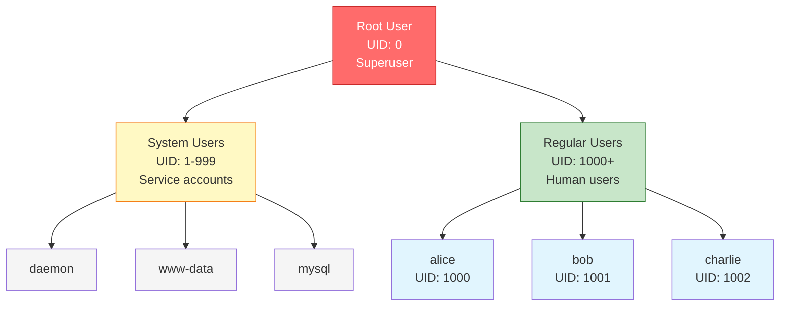
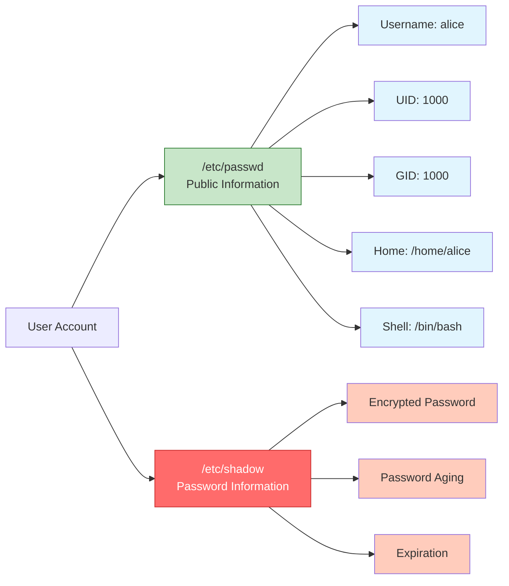
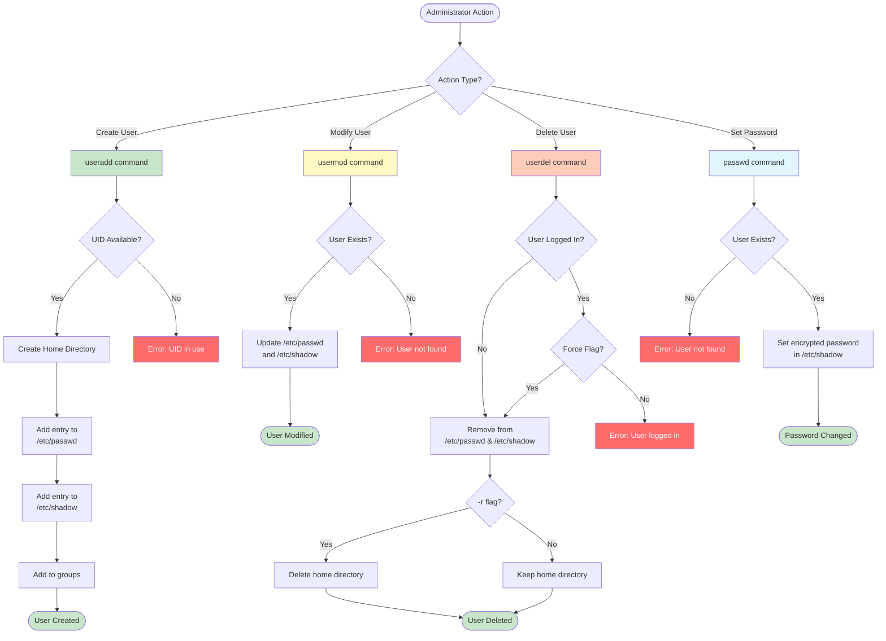
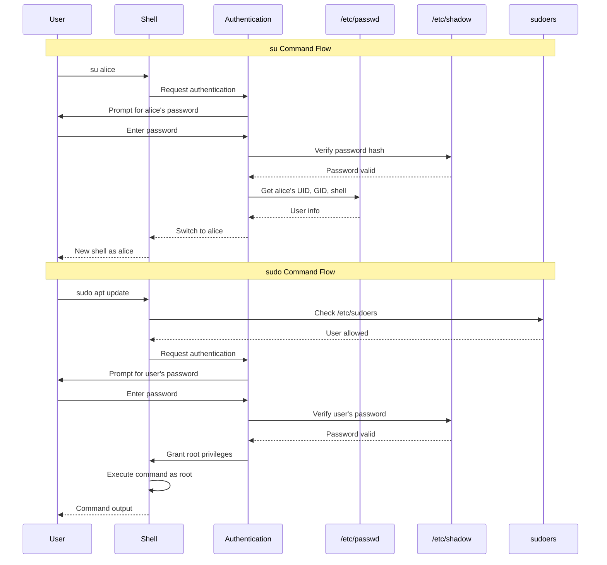

#linux #operating-system #cybersecurity #access-control #ubuntu #debian #fedora #rhel
#centos-stream #unix #shell 
- A user is an entity that can interact with the operating system and access resources.
- Users provide the basis for access control and resource management in Unix-like systems.
# User Types
## Root User (Superuser)
- UID = `0`.
- <mark class="hltr-yellow">Has unrestricted access to all system resources</mark>.
- Can perform any administrative task.
- Username is typically `root`.
## System Users
- UID range: `1-999` (system-dependent).
- <mark class="hltr-yellow">Used by system services and daemons</mark>.
- Cannot log in interactively.
- Examples: `daemon`, `bin`, `sys`, `www-data`, `mysql`.
## Regular Users
- UID range: `1000+` (typically).
- <mark class="hltr-yellow">Normal human users with restricted privileges</mark>.
- Can log in interactively.
- Have home directories under `/home/`.
## User Hierarchy

# User Identification
## User ID (UID)
- Numeric identifier assigned to each user.
- <mark class="hltr-yellow">Operating system uses UID, not username, for access control</mark>.
- Must be unique within the system.
- Range:
	- `0` - Root user
	- `1-999` - System users
	- `1000-60000` - Regular users (default range)
	- `65534` - `nobody` user (unprivileged user)
## Username
- Human-readable identifier.
- <mark class="hltr-yellow">Mapped to UID by the system</mark>.
- Must be unique.
- Conventions:
	- Lowercase letters
	- May include numbers, hyphens, underscores
	- Maximum length: 32 characters (typically)
## Group ID (GID)
- Primary group identifier for the user.
- Every user belongs to at least one group.
- Used for group-based access control.
# User Account Files
## `/etc/passwd`
- Stores user account information.
- <mark class="hltr-yellow">World-readable file containing user database</mark>.
- Each line represents one user.
### Format
```Shell title='User database format'
username:x:UID:GID:comment:home_directory:shell
```
### Fields
- **username** - Login name.
- **x** - Password placeholder (actual password in `/etc/shadow`).
- **UID** - User ID number.
- **GID** - Primary group ID.
- **comment** - User's full name or description (GECOS field).
- **home_directory** - Absolute path to user's home directory.
- **shell** - Login shell (e.g., `/bin/bash`, `/bin/sh`).
### Example Entry
```Shell title='User information entry example'
root:x:0:0:Super User:/root:/bin/bash
bin:x:1:1:bin:/bin:/usr/sbin/nologin
daemon:x:2:2:daemon:/sbin:/usr/sbin/nologin
adm:x:3:4:adm:/var/adm:/usr/sbin/nologin
lp:x:4:7:lp:/var/spool/lpd:/usr/sbin/nologin
sync:x:5:0:sync:/sbin:/bin/sync
shutdown:x:6:0:shutdown:/sbin:/sbin/shutdown
halt:x:7:0:halt:/sbin:/sbin/halt
mail:x:8:12:mail:/var/spool/mail:/usr/sbin/nologin
operator:x:11:0:operator:/root:/usr/sbin/nologin
games:x:12:100:games:/usr/games:/usr/sbin/nologin
ftp:x:14:50:FTP User:/var/ftp:/usr/sbin/nologin
nobody:x:65534:65534:Kernel Overflow User:/:/usr/sbin/nologin
tss:x:59:59:Account used for TPM access:/:/usr/bin/nologin
dbus:x:81:81:System Message Bus:/:/usr/bin/nologin
systemd-oom:x:999:999:systemd Userspace OOM Killer:/:/usr/bin/nologin
polkitd:x:114:114:User for polkitd:/:/sbin/nologin
systemd-coredump:x:998:998:systemd Core Dumper:/:/usr/bin/nologin
```
## `/etc/shadow`
- Stores encrypted password and password-related information.
- <mark class="hltr-yellow">Readable only by root for security</mark>.
- Each line corresponds to a user in `/etc/passwd`.
### Format
```
username:password:lastchange:min:max:warn:inactive:expire:reserved
```
### Fields
- **username** - Login name.
- **password** - Encrypted password hash.
	- `!` or `*` - Account locked/disabled.
	- Empty - No password required.
- **lastchange** - Days since epoch when password was last changed.
- **min** - Minimum days before password can be changed.
- **max** - Maximum days password is valid.
- **warn** - Days before expiration to warn user.
- **inactive** - Days after expiration until account is disabled.
- **expire** - Days since epoch when account expires.
- **reserved** - Reserved for future use.
### Example Entry
```Shell title='User with hash password entry'
gnome-initial-setup:!*:20187::::::
gnome-remote-desktop:!*:20187::::::
vboxadd:!*:20187::::::
sshd:!*:20187::::::
passim:!*:20187::::::
tcpdump:!*:20187::::::
nick:$y$j9T$aOjaFgYQnUlp.jfKDLlpv/$gigaMgCRAOfkKAZ35672u1ciNOPabrw5B78uaElSP0:20425:0:99999:7:::
```
## File Structure


# User Management Commands
## Create User
### Syntax
```Shell title='Create user'
useradd [options] username
```
### Common Options
- `-u UID` - Specify user ID.
- `-g GID` - Specify primary group ID.
- `-G groups` - Specify supplementary groups (comma-separated).
- `-d directory` - Specify home directory.
- `-s shell` - Specify login shell.
- `-m` - Create home directory if it doesn't exist.
- `-c comment` - Add comment (GECOS field).
- `-r` or `--system` - Create system account.
### Examples
```Shell title='Add user examples'
# Create user with default settings
sudo useradd alice

# Create user with home directory and bash shell
sudo useradd -m -s /bin/bash alice

# Create user with specific UID and groups
sudo useradd -u 1500 -g users -G wheel,docker alice

# Create system user (no home directory, no login)
sudo useradd -r -s /usr/sbin/nologin mysql
```
## Modify User
### Syntax
```Shell title='Modify user'
usermod [options] username
```
### Common Options
- `-u UID` - Change user ID.
- `-g GID` - Change primary group.
- `-G groups` - Set supplementary groups.
- `-aG groups` - Append to supplementary groups.
- `-d directory` - Change home directory.
- `-m` - Move contents of old home to new home (with `-d`).
- `-s shell` - Change login shell.
- `-L` - Lock user account.
- `-U` - Unlock user account.
- `--expiredate YEAR-MONTH-DAY`: Set expiration date
### Examples
```Shell title='Modify user examples'
# Add user to sudo group
sudo usermod -aG sudo alice

# Change user's shell
sudo usermod -s /bin/zsh alice

# Lock user account
sudo usermod -L alice
    
# Change home directory and move files
sudo usermod -d /new/home/alice -m alice

# Set expiration date
sudo usermod --expiredate 2028-10-12 jack

# Make account expired
sudo usermod --expiredate 2024-13-10 jack

# Remove expiration date
sudo usermod --expiredate "" jack
```
## Delete User
### Syntax
```Shell title='Delete user'
userdel [options] username
```
### Common Options
- `-r` or `--remove` - Remove home directory and mail spool.
- `-f` - Force removal (even if user is logged in).
### Examples
```Shell title='Delete user'
# Delete user (keep home directory)
sudo userdel alice

# Delete user and home directory
sudo userdel -r alice
```
## Change Password
### Syntax
```Shell title='Change password of user'
passwd [options] [username]
```
### Common Options
- `-l` - Lock password (disable account).
- `-u` - Unlock password.
- `-d` - Delete password (passwordless login).
- `-e` - Expire password (force change on next login).
- `-n days` - Minimum password lifetime.
- `-x days` - Maximum password lifetime.
- `-w days` - Warning days before expiration.
### Examples
```Shell title='Change password'
# Change own password
passwd

# Change another user's password (as root)
sudo passwd alice

# Force password change on next login
sudo passwd -e alice

# Lock user account
sudo passwd -l alice

# Make the user password expired after 30 days
passwd -x 30 alice
```
# User Management Flow


# User Switching
## su - Switch User
- Allows switching to another user account.
- <mark class="hltr-yellow">Requires target user's password</mark>.
### Syntax
```Shell
su [options] [username]
```
### Common Options
- `-` or `-l` - Start login shell (load user's environment).
- `-c command` - Execute command as target user.
- `-s shell` - Use specified shell.
### Examples
```Shell title='Switch user'
# Switch to root
su

# Switch to root with login shell
su -

# Switch to alice
su alice

# Execute command as alice
su -c "ls /home/alice" alice
```
## Execute as Root
- Allows permitted users to execute commands as root or another user.
- <mark class="hltr-yellow">Requires user's own password, not root password</mark>.
- Configured in `/etc/sudoers` file.
### Syntax
```Shell title='Execute with root permissions'
sudo [options] command
```
### Common Options
- `-u user` - Execute as specified user.
- `-i` - Start login shell as root.
- `-s` - Start shell as root.
- `-l` - List allowed commands.
### Examples
```Shell title='Root permission execution'
# Execute single command as root
sudo apt update

# Start root shell
sudo -i

# Execute command as specific user
sudo -u alice ls /home/alice

# Edit sudoers file safely
sudo visudo
```
## User Authentication Flow


# User Information Commands
## Display User Identity
```Shell title='User identity'
# Show current user info
id
# Output: uid=1000(alice) gid=1000(alice) groups=1000(alice),27(sudo),999(docker)

# Show specific user info
id bob
```
## Display Current Username
```Shell title='Username'
whoami
# Output: alice
```
## Display Logged-in Users
```Shell title='Logged-in user'
who
# Output: alice    tty1    2025-01-03 10:30
```
## Display Logged-in Users with Activity
```Shell title='Logged-in user with activity'
w
# Output: Shows users, terminals, login time, idle time, processes
```
## Display Login History
```Shell title='Log-in history'
# Show recent logins
last

# Show specific user's logins
last alice
```
## Display User Information
```Shell title='User information'
# Display info about user (if finger is installed)
finger alice
```
# Practical Examples
## Create Developer User
```Shell title='Create developer user'
# Create user with home directory
sudo useradd -m -s /bin/bash developer

# Set password
sudo passwd developer

# Add to development groups
sudo usermod -aG sudo,docker,www-data developer

# Verify creation
id developer
grep developer /etc/passwd
```
## Create Service Account
```Shell title='Create service account'
# Create system user for nginx
sudo useradd -r -s /usr/sbin/nologin nginx

# Verify (no home directory, cannot login)
grep nginx /etc/passwd
# Output: nginx:x:995:995::/home/nginx:/usr/sbin/nologin
```
## Modify Existing User
```Shell title='Modify a specific user'
# Change user's shell
sudo usermod -s /bin/zsh alice

# Add user to multiple groups
sudo usermod -aG docker,libvirt alice

# Change home directory
sudo usermod -d /opt/alice -m alice

# Verify changes
id alice
grep alice /etc/passwd
```
## Lock and Unlock User
```Shell title='Lock and unlock the user'
# Lock user account
sudo passwd -l alice

# Verify lock (! in password field)
sudo grep alice /etc/shadow
# Output: alice:!$6$...:...

# Unlock account
sudo passwd -u alice
```
***
# References
1. Operating System Concepts - Abraham Silberschatz - 10th - 2018 - Pearson Publisher.
	1. Chapter 17: Protection.
		1. Section 17.3: Access Matrix.
2. The Linux Command Line - William Shotts - 2nd Edition - 2019 - No Starch Press.
	1. Chapter 9: Permissions.
3. `man useradd`, `man usermod`, `man userdel`, `man passwd`
4. https://www.redhat.com/sysadmin/linux-user-group-management
5. https://wiki.archlinux.org/title/Users_and_groups
