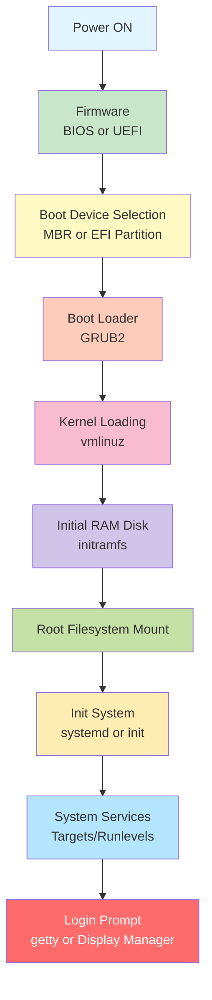
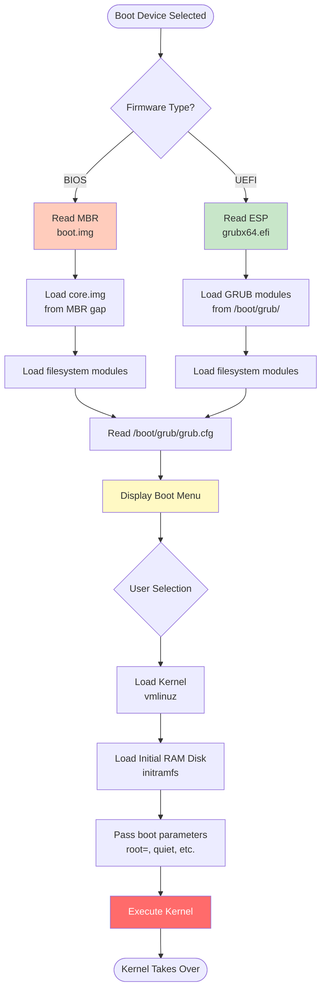
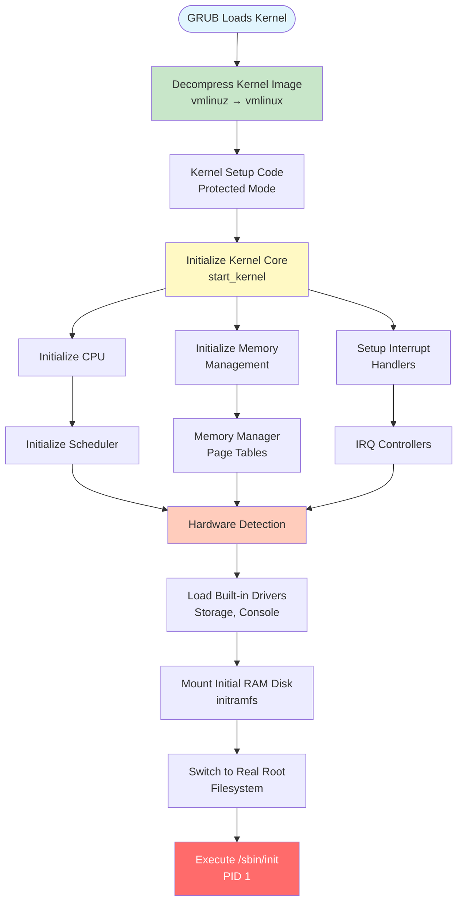
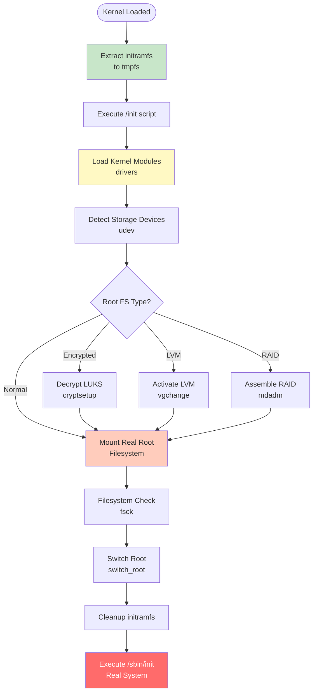
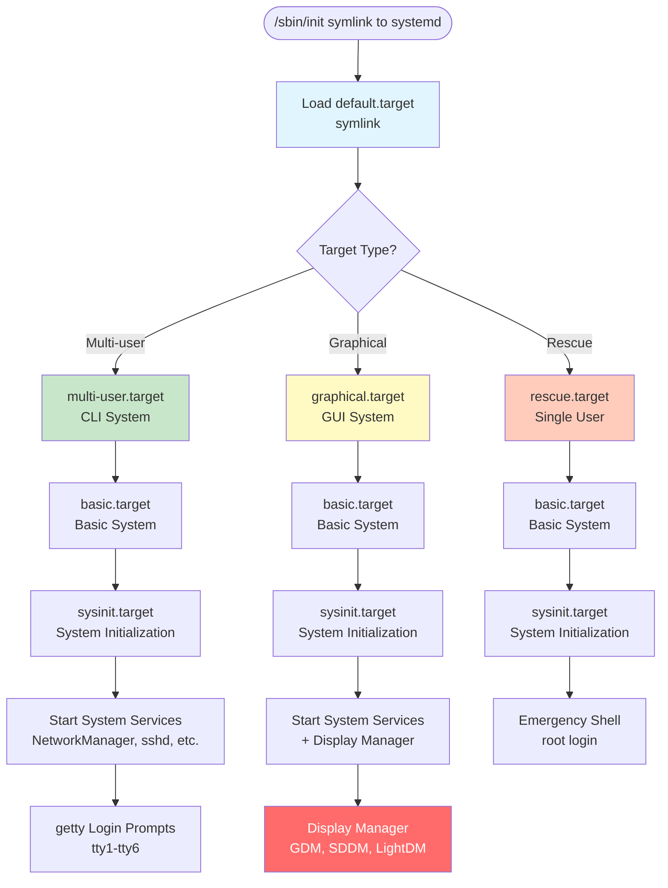
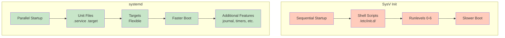
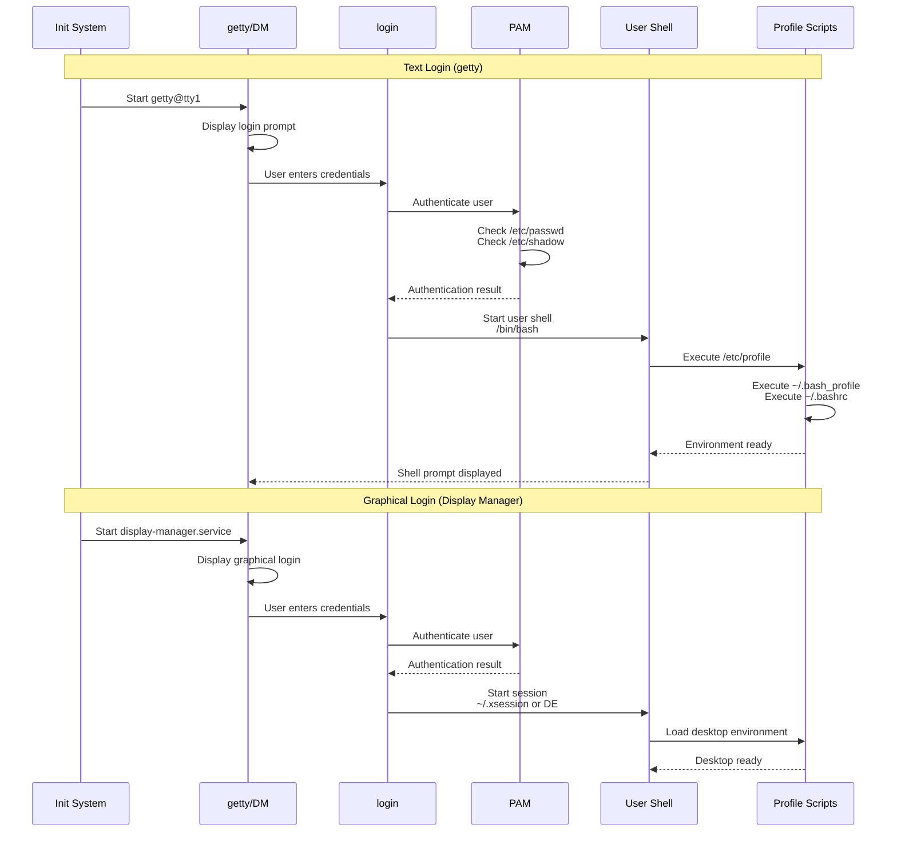

#linux #operating-system #fedora #ubuntu #debian #rhel #centos-stream #unix #system-administration #boot
- The boot process is the sequence of events that occurs from powering on a computer to loading the operating system.
- <mark class="hltr-yellow">Understanding the boot process is essential for troubleshooting system startup issues</mark>.
- Linux boot process involves multiple stages: firmware initialization, boot loader, kernel loading, and system initialization.
# Boot Process Overview

# Boot Stages
## Stage 1: Firmware Initialization
### Basic Input/Output System (BIOS)
- <mark class="hltr-yellow">Legacy firmware interface for PC-compatible systems</mark>.
- Stored on read-only memory (ROM) chip on the motherboard.
- Executes Power-On Self-Test (POST) to verify hardware functionality.
#### BIOS Operations
1. **Power-On Self-Test (POST)**
	- Tests CPU, memory, storage devices, and peripherals.
	- Beeps or displays error codes if hardware issues detected.
	- Initializes hardware components.
2. **Hardware Initialization**
	- Detects and configures installed hardware.
	- Initializes keyboard, video adapter, disk controllers.
	- Enumerates PCI devices.
3. **Boot Device Selection**
	- Searches for bootable devices in configured order.
	- Checks boot priority (HDD, SSD, USB, CD/DVD, Network).
	- Reads Master Boot Record (MBR) from first sector of boot device.
#### BIOS Limitations
- Maximum partition size: 2 TB (MBR limitation).
- Maximum 4 primary partitions.
- 16-bit real mode operation.
- Limited security features.
- No support for modern hardware features.
### Unified Extensible Firmware Interface (UEFI)
- <mark class="hltr-yellow">Modern replacement for BIOS with enhanced capabilities</mark>.
- Supports GPT (GUID Partition Table) partitioning scheme.
- Provides secure boot and pre-OS environment.
#### UEFI Features
1. **Enhanced Boot Manager**
	- Reads boot configuration from NVRAM.
	- Supports multiple boot loaders.
	- Boot menu with graphical interface.
	- Network boot capabilities (PXE).
2. **Security Features**
	- Secure Boot: Verifies boot loader signatures.
	- Trusted Platform Module (TPM) integration.
	- Protection against rootkits and bootkits.
3. **Modern Capabilities**
	- Supports disks larger than 2 TB.
	- Unlimited partitions (GPT supports 128 by default).
	- 32-bit or 64-bit mode.
	- Mouse and network support in firmware.
	- Faster boot times.
#### UEFI Boot Process
- Firmware reads Boot Manager configuration.
- Locates EFI System Partition (ESP).
- Loads UEFI application (boot loader) from ESP.
- ESP typically mounted at `/boot/efi`.
### BIOS vs UEFI Comparison

```mermaid
graph TD
    subgraph BIOS["BIOS/MBR Boot"]
        B1[BIOS Firmware] --> B2[Read MBR<br/>First 512 bytes]
        B2 --> B3[Execute Boot Code]
        B3 --> B4[Load Boot Loader<br/>from active partition]
        B4 --> B5[Boot Loader<br/>GRUB Stage 1]
    end

    subgraph UEFI["UEFI/GPT Boot"]
        U1[UEFI Firmware] --> U2[Read Boot Manager<br/>from NVRAM]
        U2 --> U3[Locate EFI System<br/>Partition ESP]
        U3 --> U4[Load EFI Application<br/>/boot/efi/EFI/]
        U4 --> U5[Boot Loader<br/>GRUB2 EFI]
    end

    style B1 fill:#ffccbc
    style B2 fill:#ffccbc
    style B3 fill:#ffccbc
    style B4 fill:#ffccbc
    style B5 fill:#ffccbc
    style U1 fill:#c8e6c9
    style U2 fill:#c8e6c9
    style U3 fill:#c8e6c9
    style U4 fill:#c8e6c9
    style U5 fill:#c8e6c9
```

## Stage 2: Boot Loader
- <mark class="hltr-yellow">Responsible for loading the kernel and initial RAM disk into memory</mark>.
- Provides menu for selecting operating system or kernel version.
- Passes boot parameters to the kernel.
### GRUB2 (GRand Unified Bootloader 2)
- Default boot loader for most Linux distributions.
- Supports both BIOS and UEFI systems.
- Allows editing boot parameters at runtime.
- Supports multiple operating systems.
#### GRUB2 Boot Process

#### GRUB2 Configuration Files
##### Main Configuration
- Location: `/boot/grub/grub.cfg` (BIOS) or `/boot/efi/EFI/<distro>/grub.cfg` (UEFI).
- <mark class="hltr-yellow">Auto-generated file, should not be edited directly</mark>.
- Contains menu entries, kernel parameters, and boot options.
##### Custom Configuration
- Location: `/etc/default/grub`.
- User-editable configuration file.
- Contains GRUB settings and default parameters.
##### Configuration Parameters
```Shell title='Common GRUB parameters'
GRUB_TIMEOUT=5                    # Menu timeout in seconds
GRUB_DEFAULT=0                    # Default boot entry (0-based index)
GRUB_CMDLINE_LINUX_DEFAULT="quiet splash"  # Default kernel parameters
GRUB_CMDLINE_LINUX=""             # Always-applied kernel parameters
GRUB_DISABLE_RECOVERY="true"      # Disable recovery mode entries
GRUB_GFXMODE=1024x768             # Graphics resolution
```
#### Update GRUB Configuration
```Shell title='Regenerate GRUB configuration'
# Ubuntu/Debian
sudo update-grub

# Or equivalently
sudo grub-mkconfig -o /boot/grub/grub.cfg

# Fedora/RHEL/CentOS (BIOS)
sudo grub2-mkconfig -o /boot/grub2/grub.cfg

# Fedora/RHEL/CentOS (UEFI)
sudo grub2-mkconfig -o /boot/efi/EFI/fedora/grub.cfg
```
#### View GRUB Boot Messages
```Shell title='Check GRUB configuration'
# View current default entry
sudo grub-editenv list

# Set default boot entry
sudo grub-set-default 0

# View available menu entries
sudo grep menuentry /boot/grub/grub.cfg

# View kernel command line from running system
cat /proc/cmdline
```
### Other Boot Loaders
#### LILO (Linux Loader)
- Legacy boot loader (mostly deprecated).
- Configuration: `/etc/lilo.conf`.
- Requires reinstallation after kernel updates.
#### systemd-boot (formerly gummiboot)
- Simple UEFI boot manager.
- Used by some systemd-based distributions.
- Configuration: `/boot/loader/loader.conf`.
#### ISOLINUX
- Boot loader for bootable CD/DVD media.
- Used for Linux installation media.
#### U-Boot
- Boot loader for embedded systems.
- Supports ARM, PowerPC, MIPS architectures.
## Stage 3: Kernel Initialization
- <mark class="hltr-yellow">The kernel is the core component of the operating system</mark>.
- Located at `/boot/vmlinuz-<version>` (compressed kernel image).
- First code executed in kernel space.
### Kernel Loading Process

### Kernel Boot Parameters
- Passed by boot loader via kernel command line.
- <mark class="hltr-yellow">Control kernel behavior during initialization</mark>.
- Viewable at `/proc/cmdline`.
#### Common Parameters
| Parameter | Description |
|-----------|-------------|
| `root=/dev/sda1` | Specify root filesystem device |
| `ro` | Mount root filesystem read-only initially |
| `quiet` | Suppress most boot messages |
| `splash` | Show graphical splash screen |
| `single` or `1` | Boot into single-user mode |
| `init=/bin/bash` | Specify alternative init program |
| `systemd.unit=rescue.target` | Boot into rescue mode |
| `nomodeset` | Disable kernel mode setting (graphics) |
| `acpi=off` | Disable ACPI |
| `noapic` | Disable APIC |
| `maxcpus=2` | Limit number of CPUs |
| `mem=4G` | Limit available memory |
### Viewing Kernel Messages
```Shell title='View kernel boot messages'
# View kernel ring buffer
dmesg

# View boot messages with timestamps
dmesg -T

# View only kernel errors
dmesg --level=err

# Follow kernel messages in real-time
dmesg -w

# View boot log from journal
journalctl -b -k

# View boot log from previous boot
journalctl -b -1 -k
```
## Stage 4: Initial RAM Disk (initramfs)
- <mark class="hltr-yellow">Temporary root filesystem loaded into memory during boot</mark>.
- Contains essential drivers and tools needed to mount real root filesystem.
- Allows kernel to boot without built-in drivers for all hardware.
### initramfs Purpose
1. **Load Filesystem Drivers**
	- Drivers for root filesystem type (ext4, xfs, btrfs).
	- RAID and LVM support.
	- Encrypted filesystem support (LUKS).
2. **Load Storage Drivers**
	- SATA, SCSI, NVMe drivers.
	- Hardware RAID controllers.
	- Network storage (iSCSI, NFS).
3. **System Preparation**
	- Device detection and initialization.
	- Root filesystem checks and repairs.
	- Cryptographic key loading.
### initramfs Workflow

### initramfs Files
- Location: `/boot/initramfs-<kernel-version>.img` or `/boot/initrd.img-<kernel-version>`.
- Compressed cpio archive.
- Auto-generated for each installed kernel.
### Manage initramfs
```Shell title='Regenerate initramfs'
# Ubuntu/Debian - update all kernels
sudo update-initramfs -u

# Ubuntu/Debian - update specific kernel
sudo update-initramfs -u -k 5.15.0-58-generic

# Fedora/RHEL/CentOS - regenerate for current kernel
sudo dracut --force

# Fedora/RHEL/CentOS - regenerate for specific kernel
sudo dracut --force /boot/initramfs-5.14.0-1.el9.x86_64.img 5.14.0-1.el9.x86_64

# List contents of initramfs
lsinitramfs /boot/initrd.img-$(uname -r)

# Or extract manually
mkdir /tmp/initramfs
cd /tmp/initramfs
zcat /boot/initrd.img-$(uname -r) | cpio -idmv
```
### View initramfs Contents
```Shell title='Examine initramfs'
# Ubuntu/Debian
lsinitramfs /boot/initrd.img-$(uname -r) | less

# Fedora/RHEL (extract to directory)
mkdir /tmp/initramfs-contents
cd /tmp/initramfs-contents
/usr/lib/dracut/skipcpio /boot/initramfs-$(uname -r).img | zcat | cpio -idmv

# View init script
lsinitramfs /boot/initrd.img-$(uname -r) | grep init
```
## Stage 5: Init System
- <mark class="hltr-yellow">First process started by kernel with PID 1</mark>.
- Responsible for starting all other system processes.
- Manages system services and runlevels/targets.
### systemd (Modern Init System)
- Default init system for most modern distributions.
- Parallel service startup for faster boot.
- Dependency-based service management.
- Socket and D-Bus activation.
#### systemd Boot Sequence

#### systemd Targets
- <mark class="hltr-yellow">Equivalent to runlevels in SysV init</mark>.
- Define system states and service groups.
##### Common Targets
| Target | SysV Runlevel | Description |
|--------|---------------|-------------|
| `poweroff.target` | 0 | Halt the system |
| `rescue.target` | 1, s | Single-user rescue mode |
| `multi-user.target` | 2, 3, 4 | Multi-user, non-graphical |
| `graphical.target` | 5 | Multi-user, graphical |
| `reboot.target` | 6 | Reboot the system |
| `emergency.target` | - | Emergency shell |
#### systemd Commands
```Shell title='Manage systemd targets'
# View current default target
systemctl get-default

# Set default target to graphical
sudo systemctl set-default graphical.target

# Set default target to multi-user (no GUI)
sudo systemctl set-default multi-user.target

# Boot into rescue mode (next boot only)
sudo systemctl rescue

# Boot into emergency mode
sudo systemctl emergency

# List all available targets
systemctl list-units --type=target

# View dependencies of a target
systemctl list-dependencies graphical.target

# Check boot time
systemd-analyze

# View service startup times
systemd-analyze blame

# View critical chain
systemd-analyze critical-chain

# Plot boot process
systemd-analyze plot > boot.svg
```
### SysV Init (Legacy Init System)
- Traditional Unix init system.
- Sequential service startup (slower).
- Uses runlevels and init scripts.
- Configuration: `/etc/inittab`.
#### SysV Runlevels
| Runlevel | Description |
|----------|-------------|
| 0 | Halt/Shutdown |
| 1, S | Single-user mode |
| 2 | Multi-user without networking (Debian/Ubuntu) |
| 3 | Multi-user with networking (RHEL/CentOS) |
| 4 | Unused/Custom |
| 5 | Graphical multi-user |
| 6 | Reboot |
#### SysV Init Scripts
- Location: `/etc/init.d/`.
- Symlinks from `/etc/rc<runlevel>.d/`.
- Naming: `S##service` (start) or `K##service` (kill).
- Numbers determine startup order.
```Shell title='SysV init commands'
# Change runlevel
sudo init 3

# View current runlevel
runlevel

# Start service
sudo service sshd start

# Stop service
sudo service sshd stop

# List all services
service --status-all
```
### Init System Comparison

## Stage 6: Login and User Session
### Text-Mode Login (getty)
- <mark class="hltr-yellow">Provides text-based login prompts on virtual terminals</mark>.
- Started by init system for each virtual terminal.
- Program: `getty` or `agetty`.
#### Virtual Terminals
- Linux provides multiple virtual consoles (tty).
- Accessible via `Ctrl+Alt+F1` through `Ctrl+Alt+F6`.
- `tty1` often used for graphical session.
- `tty2-tty6` typically text consoles.
```Shell title='Manage getty'
# View getty services (systemd)
systemctl status getty@tty1.service

# Restart getty on tty2
sudo systemctl restart getty@tty2.service

# View active terminals
who

# View current terminal
tty
```
### Graphical Login (Display Manager)
- Provides graphical login interface.
- Starts X Window System or Wayland compositor.
- Manages user sessions.
#### Common Display Managers
| Display Manager | Desktop Environment | Description |
|----------------|---------------------|-------------|
| GDM | GNOME | GNOME Display Manager |
| SDDM | KDE Plasma | Simple Desktop Display Manager |
| LightDM | Various | Lightweight, cross-desktop |
| XDM | Generic | X Display Manager (basic) |
| LXDM | LXDE | LXDE Display Manager |
| Ly | Various | TUI display manager |
```Shell title='Manage display manager'
# Check active display manager
systemctl status display-manager.service

# Restart display manager
sudo systemctl restart display-manager.service

# Disable graphical login (boot to console)
sudo systemctl set-default multi-user.target

# Enable graphical login
sudo systemctl set-default graphical.target

# Switch display managers (Ubuntu/Debian)
sudo dpkg-reconfigure gdm3

# View X server information
echo $DISPLAY
ps aux | grep Xorg
```
### Login Process Flow

# Boot Process Troubleshooting
## Common Boot Issues
### GRUB Rescue Mode
- <mark class="hltr-yellow">GRUB cannot find its configuration or modules</mark>.
- Usually caused by deleted/moved `/boot` partition or corrupted GRUB.
```Shell title='GRUB rescue recovery'
# At grub rescue prompt, list available partitions
grub rescue> ls
# Output: (hd0) (hd0,msdos1) (hd0,msdos2)

# Find partition with /boot
grub rescue> ls (hd0,msdos1)/
grub rescue> ls (hd0,msdos2)/boot/

# Set root partition (where /boot is found)
grub rescue> set root=(hd0,msdos2)
grub rescue> set prefix=(hd0,msdos2)/boot/grub

# Load normal mode
grub rescue> insmod normal
grub rescue> normal

# After booting into system, reinstall GRUB
sudo grub-install /dev/sda
sudo update-grub
```
### Kernel Panic
- <mark class="hltr-yellow">Fatal kernel error preventing system boot</mark>.
- Common causes: missing initramfs, corrupted root filesystem, wrong root parameter.
#### Recovery Steps
1. Boot from older kernel (select in GRUB menu).
2. Boot from live USB/CD.
3. Check kernel parameters in GRUB.
4. Regenerate initramfs.
```Shell title='Fix kernel panic from rescue'
# Boot from live USB, then chroot into system
sudo mount /dev/sda2 /mnt
sudo mount /dev/sda1 /mnt/boot
sudo mount --bind /dev /mnt/dev
sudo mount --bind /proc /mnt/proc
sudo mount --bind /sys /mnt/sys
sudo chroot /mnt

# Regenerate initramfs
update-initramfs -u -k all

# Update GRUB
update-grub

# Exit and reboot
exit
sudo reboot
```
### Filesystem Errors
- Root filesystem corruption or inconsistencies.
- System may drop to emergency shell.
```Shell title='Repair filesystem'
# Boot into single-user or rescue mode
# At GRUB, press 'e' to edit boot entry
# Add 'single' or 'systemd.unit=rescue.target' to kernel line
# Press Ctrl+X to boot

# Remount root as read-only
mount -o remount,ro /

# Run filesystem check
fsck -y /dev/sda2

# Remount as read-write
mount -o remount,rw /

# Continue boot
systemctl default
```
### Boot Stuck at "Started GNOME Display Manager"
- Display manager starts but no login screen.
- Often graphics driver issue.
```Shell title='Fix display manager issues'
# Press Ctrl+Alt+F2 to switch to tty2
# Login as root or user

# Check display manager status
systemctl status gdm.service

# View Xorg logs
cat /var/log/Xorg.0.log

# Try reconfiguring display manager
sudo dpkg-reconfigure gdm3

# Boot with nomodeset (at GRUB, press 'e')
# Add 'nomodeset' to kernel line
# Press Ctrl+X to boot

# If successful, install correct graphics drivers
# Then remove nomodeset parameter
```
## Emergency Boot Options
### Single-User Mode (Rescue Mode)
- <mark class="hltr-yellow">Minimal boot environment for system recovery</mark>.
- Boots to root shell without network or services.
- Useful for password recovery and system repairs.
```Shell title='Boot into rescue mode'
# At GRUB menu, press 'e' to edit boot entry
# Find line starting with 'linux' or 'linux16'
# Append one of:
#   single
#   1
#   s
#   systemd.unit=rescue.target

# Press Ctrl+X to boot

# System will boot to single-user mode
# Remount root as read-write if needed
mount -o remount,rw /
```
### Emergency Mode
- Even more minimal than rescue mode.
- Only root filesystem mounted (read-only).
- No services started.
```Shell title='Boot into emergency mode'
# At GRUB, append to kernel line:
#   systemd.unit=emergency.target
#   emergency

# Or from running system
sudo systemctl emergency
```
### Reset Root Password
```Shell title='Reset forgotten root password'
# At GRUB, press 'e' to edit boot entry
# Find 'linux' or 'linux16' line
# Append: init=/bin/bash

# Press Ctrl+X to boot

# System boots directly to bash shell
# Remount root filesystem as read-write
mount -o remount,rw /

# Change root password
passwd root

# Sync and reboot
sync
exec /sbin/init
```
## Boot Time Analysis
### Analyze Boot Performance
```Shell title='systemd boot analysis'
# Show total boot time
systemd-analyze

# Show service startup times
systemd-analyze blame

# Show critical path
systemd-analyze critical-chain

# Show critical path for specific service
systemd-analyze critical-chain multi-user.target

# Generate boot timeline SVG
systemd-analyze plot > /tmp/boot.svg

# Verify systemd configuration
systemd-analyze verify

# Show boot loader entries
systemd-analyze list-boots
```
### View Boot Logs
```Shell title='Check boot logs'
# View current boot log
journalctl -b

# View previous boot log
journalctl -b -1

# View only kernel messages
journalctl -k

# View messages from last boot with priority
journalctl -b -p err

# View boot logs since date
journalctl --since "2026-01-05"

# Follow boot messages in real-time
journalctl -f

# View specific service boot log
journalctl -b -u NetworkManager.service
```
# Practical Examples
## Example 1: Change Default Boot Target
```Shell title='Switch between graphical and text mode'
# Check current default target
systemctl get-default
# Output: graphical.target

# Change to text mode (no GUI)
sudo systemctl set-default multi-user.target
# Output: Removed /etc/systemd/system/default.target.
#         Created symlink /etc/systemd/system/default.target → /usr/lib/systemd/system/multi-user.target.

# Verify change
systemctl get-default
# Output: multi-user.target

# Reboot to apply
sudo reboot

# Switch back to graphical mode
sudo systemctl set-default graphical.target
sudo reboot
```
## Example 2: Add Custom Kernel Boot Parameter
```Shell title='Add custom kernel parameter'
# Edit GRUB configuration
sudo nano /etc/default/grub

# Modify GRUB_CMDLINE_LINUX_DEFAULT line
# Before:
#   GRUB_CMDLINE_LINUX_DEFAULT="quiet splash"
# After:
#   GRUB_CMDLINE_LINUX_DEFAULT="quiet splash nomodeset"

# Update GRUB
sudo update-grub

# Verify parameter after reboot
cat /proc/cmdline
# Output: BOOT_IMAGE=/vmlinuz-5.15.0-58-generic root=/dev/sda2 ro quiet splash nomodeset
```
## Example 3: Reinstall GRUB After Boot Failure
```Shell title='Reinstall GRUB from live USB'
# Boot from Ubuntu live USB
# Open terminal

# Identify root partition
sudo fdisk -l
# Assume root is /dev/sda2, boot is /dev/sda1

# Mount partitions
sudo mount /dev/sda2 /mnt
sudo mount /dev/sda1 /mnt/boot

# Mount system directories
sudo mount --bind /dev /mnt/dev
sudo mount --bind /dev/pts /mnt/dev/pts
sudo mount --bind /proc /mnt/proc
sudo mount --bind /sys /mnt/sys

# Chroot into system
sudo chroot /mnt

# Reinstall GRUB
# For BIOS:
grub-install /dev/sda
# For UEFI:
grub-install --target=x86_64-efi --efi-directory=/boot/efi --bootloader-id=ubuntu

# Update GRUB configuration
update-grub

# Exit chroot
exit

# Unmount and reboot
sudo umount /mnt/boot
sudo umount /mnt/dev/pts
sudo umount /mnt/dev
sudo umount /mnt/proc
sudo umount /mnt/sys
sudo umount /mnt
sudo reboot
```
## Example 4: Create Custom initramfs
```Shell title='Include custom module in initramfs'
# Ubuntu/Debian: Edit initramfs configuration
sudo nano /etc/initramfs-tools/modules

# Add module name (one per line)
# Example: nvme

# Regenerate initramfs
sudo update-initramfs -u

# Verify module is included
lsinitramfs /boot/initrd.img-$(uname -r) | grep nvme

# Fedora/RHEL: Create dracut configuration
sudo nano /etc/dracut.conf.d/custom.conf

# Add line:
# add_drivers+=" nvme "

# Regenerate initramfs
sudo dracut --force

# Verify
lsinitramfs /boot/initramfs-$(uname -r).img | grep nvme
```
## Example 5: Configure Serial Console
```Shell title='Enable serial console for headless servers'
# Edit GRUB configuration
sudo nano /etc/default/grub

# Add or modify:
GRUB_CMDLINE_LINUX="console=tty0 console=ttyS0,115200n8"
GRUB_TERMINAL="serial console"
GRUB_SERIAL_COMMAND="serial --speed=115200 --unit=0 --word=8 --parity=no --stop=1"

# Update GRUB
sudo update-grub

# Enable getty on serial port
sudo systemctl enable serial-getty@ttyS0.service
sudo systemctl start serial-getty@ttyS0.service

# Verify
systemctl status serial-getty@ttyS0.service

# Reboot and connect via serial cable
sudo reboot
```
## Example 6: Optimize Boot Time
```Shell title='Reduce boot time'
# Analyze current boot time
systemd-analyze blame | head -20

# Disable unnecessary services
# Example: disable Plymouth splash screen
sudo systemctl disable plymouth-quit-wait.service

# Disable NetworkManager-wait-online if not needed
sudo systemctl disable NetworkManager-wait-online.service

# Reduce GRUB timeout
sudo nano /etc/default/grub
# Change: GRUB_TIMEOUT=5 to GRUB_TIMEOUT=1
sudo update-grub

# Analyze improvement
systemd-analyze
# Before: Startup finished in 45.234s
# After: Startup finished in 28.156s
```
# Boot Security
## Secure Boot
- <mark class="hltr-yellow">UEFI feature that verifies bootloader and kernel signatures</mark>.
- Prevents unauthorized boot code execution.
- Protects against rootkits and bootkits.
### Enable Secure Boot
1. Enable in UEFI/BIOS settings.
2. Enroll Machine Owner Key (MOK) for third-party drivers.
3. Sign custom kernels and modules.
```Shell title='Check Secure Boot status'
# Check if Secure Boot is enabled
mokutil --sb-state
# Output: SecureBoot enabled

# Or check via UEFI variable
cat /sys/firmware/efi/efivars/SecureBoot-*/data | hexdump
```
## GRUB Password Protection
- Prevents unauthorized kernel parameter modification.
- Requires password to edit boot entries.
```Shell title='Set GRUB password'
# Generate password hash
grub-mkpasswd-pbkdf2
# Enter password when prompted
# Copy the hash: grub.pbkdf2.sha512.10000.HASH...

# Edit GRUB configuration
sudo nano /etc/grub.d/40_custom

# Add:
set superusers="admin"
password_pbkdf2 admin grub.pbkdf2.sha512.10000.HASH...

# Update GRUB
sudo update-grub

# Now editing boot entries requires password
# Normal boot still works without password
```
## Encrypt Root Filesystem
- <mark class="hltr-yellow">Full disk encryption protects data at rest</mark>.
- Requires passphrase during boot.
- Uses LUKS (Linux Unified Key Setup).
```Shell title='Check encrypted root status'
# List encrypted volumes
lsblk -f

# Check if root is encrypted
mount | grep "on / "
# Output: /dev/mapper/ubuntu--vg-root on / type ext4 (rw,relatime)

# Check LUKS status
sudo cryptsetup status /dev/mapper/ubuntu--vg-root

# View LUKS header
sudo cryptsetup luksDump /dev/sda3
```
***
# References
1. Operating System Concepts - Abraham Silberschatz - 10th - 2018 - Pearson Publisher.
	1. Chapter 2: Operating System Structures.
		1. Section 2.10: System Boot.
2. The Linux Command Line - William Shotts - 2nd Edition - 2019 - No Starch Press.
	1. Chapter 10: Processes.
		1. Section 10.6: Shutting Down the System.
3. How Linux Works - Brian Ward - 3rd Edition - 2021 - No Starch Press.
	1. Chapter 5: How the Linux Kernel Boots.
	2. Chapter 6: User Space Start.
4. Unix and Linux System Administration Handbook - Evi Nemeth - 5th Edition - 2017 - Addison-Wesley.
	1. Chapter 2: Booting and System Management Daemons.
5. `man systemd`, `man systemctl`, `man grub2`, `man dracut`, `man update-initramfs`
6. https://www.kernel.org/doc/html/latest/admin-guide/kernel-parameters.html
7. https://www.freedesktop.org/wiki/Software/systemd/
8. https://www.gnu.org/software/grub/manual/grub/grub.html
9. https://wiki.archlinux.org/title/Arch_boot_process
10. https://www.redhat.com/sysadmin/linux-boot-process
