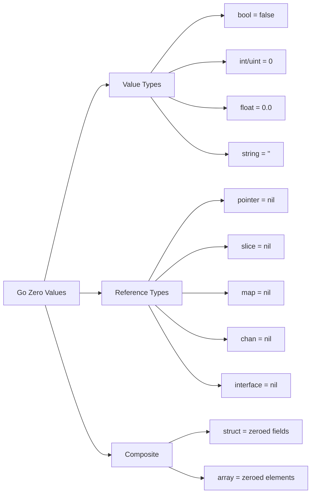

#go #data-structure #data-type #associative-array #hash-table 
# Definition
- Map is an unordered collection of key-value pairs whose key is distinct.
```Go title='Map in Go'
ages := map[string]int{
    "alice": 31,
    "charlie": 34,
}

ages["alice"] = 28
ages["charlie"] = 38

delete(ages, "alice")
```
- In case, the key does not exist in the map, the map will automatically return the <mark class="hltr-yellow">zero value</mark> for that key.

# Allocation
## `{Go}make` function
- `make` function allocates a map with a given length and capacity and returns a reference to that map.
```Go title='Allocate a map with make function'
m := make(map[string]int, 3)
fmt.Println(m, len(m)) // map[] 0
m["C"] = 1972
m["Go"] = 2009
fmt.Println(m, len(m)) // map[C:1972 Go:2009] 2
```
# Iteration
- Since the map is unordered, the order of elements is random
```Go title='Iterate a map in Go'
for name, age := range ages {
  fmt.Printf("%s\t%d\n", name, age)
}
```
***
# References
1. Programming languages, principles and practice - Louden K.C., Lambert K.A. - Course Technology, 3th Edition 2011.
	1. Chapter 14. Data type.
2. 3. The Go Programming Language - Alan A. A. Donovan, Brian W. Kernighan - Addison-Wesley Professional Computing Series - 2015.
	1. Chapter 4. Composite Types.
		1. Section 4.3 Map