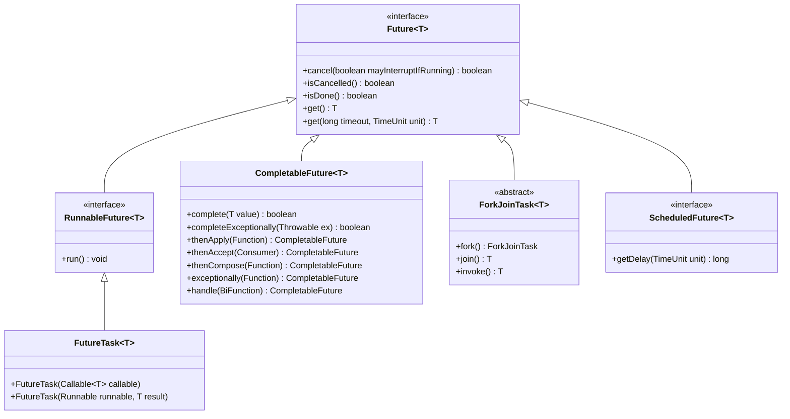
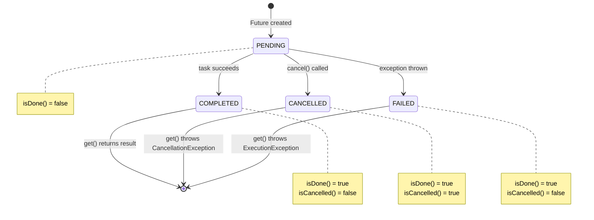
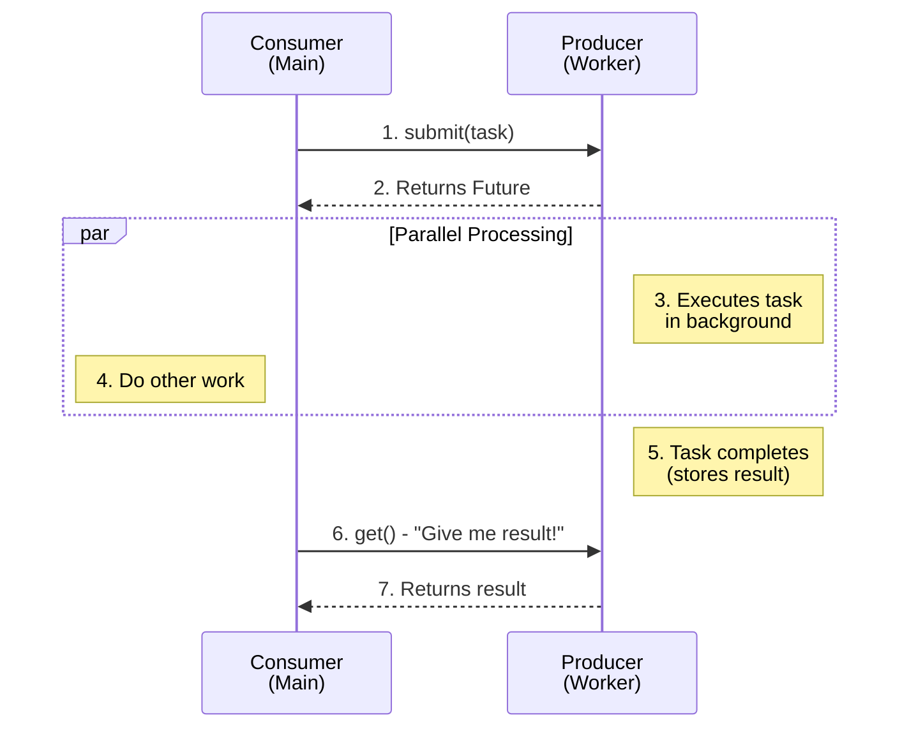
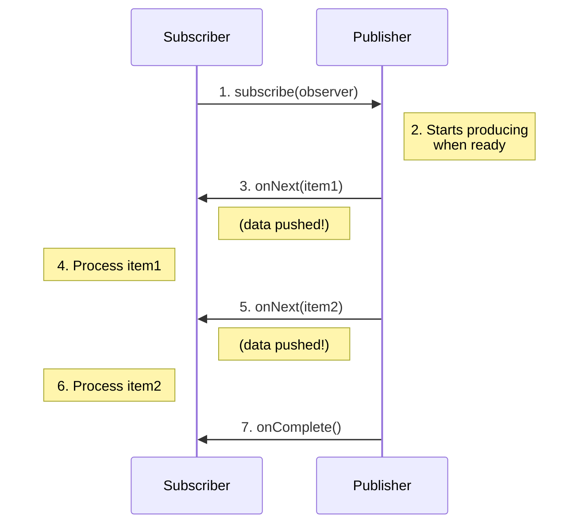

#java #parallel-programming #concurrency-control #java8 #object-oriented-programming 
#java11 #java17 
# Definition
- A **Future** in Java is an object representing the <mark class="hltr-yellow">eventual completion or failure of an asynchronous operation</mark>.
```Java title='interface Future in Java'
public interface Future<V> {
    boolean cancel(boolean mayInterruptIfRunning);
    boolean isCancelled();
    boolean isDone();
    V get() throws InterruptedException, ExecutionException;
    V get(long timeout, TimeUnit unit) throws InterruptedException, ExecutionException, TimeoutException;
} 
```
# Hierarchy

- 
# Lifecycle

- `get()`: Blocking retrieval of the result.
- `get(timeout, unit)`: blocking retrieval of the result with timeout.
- `cancel()`: attempt to cancel execution.
- `isDone()`: check completion status.
- `isCancelled()`: Check cancellation status.
# Push-based vs pull-based
## Pull-based

## Push-based



***
# References
1. https://concurrencydeepdives.com/java-future-vs-completablefuture/
2. [[programming/javascript/vanilla-javascript/fundamentals/promise/Promise|Promise]] for JavaScript Promise.
3. 