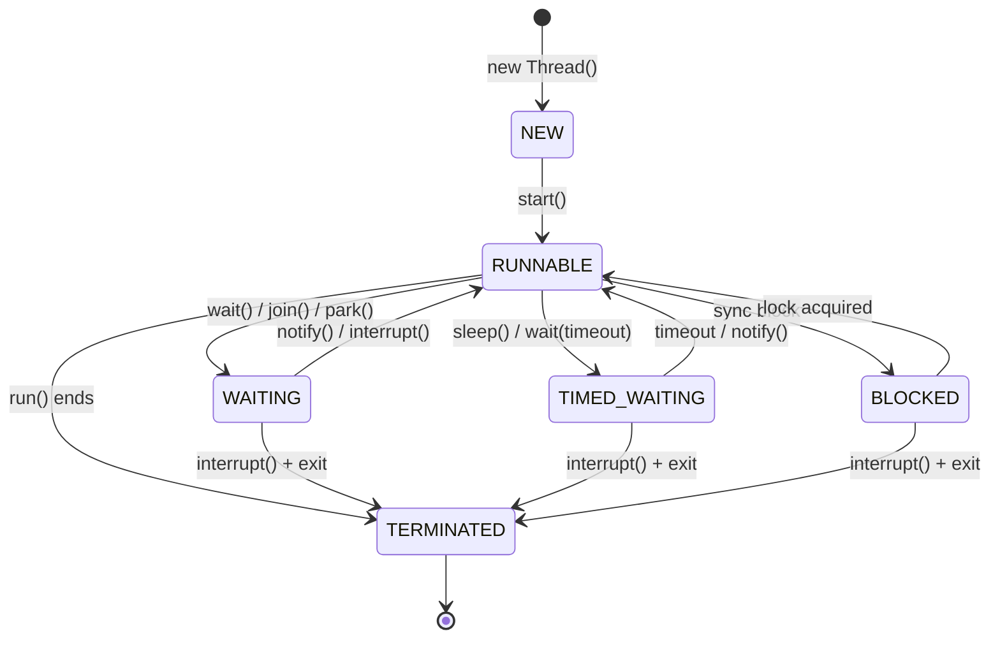

#java #parallel-programming #concurrency-control #java8 
# Concept
- Each child thread must implement `interface Runnable` or extend `class Thread`.
```Java title='ThreadDemo.java'
public class ThreadDemo implements Runnable {  
  public static Long sum = (long) 0;  
  @Override  
  public void run() {  
    for (int i = 1; i <= 100_000_000; ++i) {  
      synchronized (this) {  
        sum += (long) i;  
      }  
    }  
  }
}
```

```Java title='Main.java'
import java.util.Collections;  
import java.util.LinkedList;  
import java.util.List;  
import java.util.Random;  
import java.util.function.*;  
  
public class Main {  
  private static int THREADS = 2;  
  public static void main(String[] args) {  
    List<Thread> threadDemoList = new LinkedList<Thread>();  
    for (int i = 0 ; i < THREADS; ++i) {  
      threadDemoList.add(new Thread(new ThreadDemo()));  
    }  
  
    for (int i = 0; i < THREADS; ++i) {  
      threadDemoList.get(i).start();  
    }  
  
    try {  
      for (int i = 0; i < THREADS; ++i) {  
        threadDemoList.get(i).join();  
      }  
    } catch (Exception ex) {  
      System.out.println("Interrupt");  
    }  
  
    System.out.println(ThreadDemo.sum);  
  }  
}
```
# Lifecycle

```Java title='Thread lifecycle demostration'
public class ThreadStates {
    private static final Object lock = new Object();
    
    public static void main(String[] args) throws InterruptedException {
        Thread t = new Thread(() -> {
            try {
                // RUNNABLE
                System.out.println("Running");
                
                // TIMED_WAITING
                Thread.sleep(1000);
                
                // WAITING
                synchronized(lock) {
                    lock.wait();
                }
                
                // BLOCKED (if another thread holds lock)
                synchronized(lock) {
                    System.out.println("Got lock");
                }
                
            } catch (InterruptedException e) {
                // TERMINATED
                Thread.currentThread().interrupt();
            }
        });
        
        System.out.println(t.getState()); // NEW
        t.start();
        System.out.println(t.getState()); // RUNNABLE
        
        Thread.sleep(1500);
        synchronized(lock) {
            lock.notify();                 // Wake up waiting thread
        }
        
        t.join();
        System.out.println(t.getState()); // TERMINATED
    }
}
```
```Java title='Thread lifecycle demostration in Java'
public class ThreadStates {
    private static final Object lock = new Object();
    
    public static void main(String[] args) throws InterruptedException {
        Thread t = new Thread(() -> {
            try {
                // RUNNABLE
                System.out.println("Running");
                
                // TIMED_WAITING
                Thread.sleep(1000);
                
                // WAITING
                synchronized(lock) {
                    lock.wait();
                }
                
                // BLOCKED (if another thread holds lock)
                synchronized(lock) {
                    System.out.println("Got lock");
                }
                
            } catch (InterruptedException e) {
                // TERMINATED
                Thread.currentThread().interrupt();
            }
        });
        
        System.out.println(t.getState()); // NEW
        t.start();
        System.out.println(t.getState()); // RUNNABLE
        
        Thread.sleep(1500);
        synchronized(lock) {
            lock.notify();                 // Wake up waiting thread
        }
        
        t.join();
        System.out.println(t.getState()); // TERMINATED
    }
}
```
# `{Java}synchronized` keyword
- `synchronized` keyword provides *thread safety* by ensuring that only *one thread at a time* can execute a synchronized method or block.
## Mechanism
- Every Java object has an intrinsic lock (*monitor*). The `synchronized` keyword uses this lock to control access.
```Java title='synchronized methods are monitor behind the scene'
// Conceptual understanding
public synchronized void method() {
    // Only one thread can execute this at a time
    // Thread must acquire object's lock before entering
    // Lock is released when method exits
}
```
## Usage
### Instance method synchronization
```Java title='Instance method synchronization example'
public class Counter {
    private int count = 0;
    
    // Without synchronization - THREAD UNSAFE
    public void incrementUnsafe() {
        count++; // This is actually: read -> increment -> write (3 operations)
    }
    
    // With synchronization - THREAD SAFE
    public synchronized void increment() {
        count++; // Now atomic from external perspective
    }
    
    public synchronized int getCount() {
        return count;
    }
}
```

```Java title='Driver class'
public class ThreadSafetyDemo {
    public static void main(String[] args) throws InterruptedException {
        Counter counter = new Counter();
        
        // Create 10 threads that increment 1000 times each
        List<Thread> threads = new ArrayList<>();
        for (int i = 0; i < 10; i++) {
            Thread thread = new Thread(() -> {
                for (int j = 0; j < 1000; j++) {
                    counter.increment(); // Thread-safe
                }
            });
            threads.add(thread);
            thread.start();
        }
        
        // Wait for all threads to complete
        for (Thread thread : threads) {
            thread.join();
        }
        
        System.out.println("Final count: " + counter.getCount()); // Always 10000
    }
}
```
### Static method synchronization
```Java title='Static method synchronization'
public class StaticCounter {
    private static int count = 0;
    
    // Synchronizes on the Class object (StaticCounter.class)
    public static synchronized void increment() {
        count++;
    }
    
    public static synchronized int getCount() {
        return count;
    }
}
```
### Synchronized blocks
- A constant dedicated *lock variable* must be initialized for locking.
```Java title='Synchronized blocks'
public class BankAccount {
    private double balance;
    private final Object lock = new Object(); // Dedicated lock object
    
    public void withdraw(double amount) {
        synchronized(lock) {
            if (balance >= amount) {
                // Simulate processing time
                try { Thread.sleep(100); } catch (InterruptedException e) {}
                balance -= amount;
                System.out.println("Withdrew: $" + amount + ", Balance: $" + balance);
            } else {
                System.out.println("Insufficient funds");
            }
        }
    }
    
    public void deposit(double amount) {
        synchronized(lock) {
            balance += amount;
            System.out.println("Deposited: $" + amount + ", Balance: $" + balance);
        }
    }
    
    public double getBalance() {
        synchronized(lock) {
            return balance;
        }
    }
}
```
- Multiple lock variables can be used If there are multiple variables needing to be locked from access.
```Java title='Multiple objects synchronization'
public class MultiLockExample {
    private final Object lock1 = new Object();
    private final Object lock2 = new Object();
    private int resource1 = 0;
    private int resource2 = 0;
    
    public void updateResource1() {
        synchronized(lock1) {
            resource1++;
            // Only resource1 operations are blocked
        }
    }
    
    public void updateResource2() {
        synchronized(lock2) {
            resource2++;
            // Only resource2 operations are blocked
            // This can run concurrently with updateResource1()
        }
    }
    
    public void updateBothResources() {
        synchronized(lock1) {
            synchronized(lock2) {
                resource1++;
                resource2++;
                // Nested synchronization - acquire locks in consistent order
            }
        }
    }
}
```
# Examples
## Thread-safe map implementation
```Java title='Thread-safe map as cache implementation'
public class ThreadSafeCache<K, V> {
    private final Map<K, V> cache = new HashMap<>();
    private final Object lock = new Object();
    
    public V get(K key) {
        synchronized(lock) {
            return cache.get(key);
        }
    }
    
    public void put(K key, V value) {
        synchronized(lock) {
            cache.put(key, value);
        }
    }
    
    public V computeIfAbsent(K key, Function<K, V> mappingFunction) {
        synchronized(lock) {
            V value = cache.get(key);
            if (value == null) {
                value = mappingFunction.apply(key);
                cache.put(key, value);
            }
            return value;
        }
    }
    
    public void clear() {
        synchronized(lock) {
            cache.clear();
        }
    }
    
    public int size() {
        synchronized(lock) {
            return cache.size();
        }
    }
}
```
***
# References
1. https://medium.com/@seungbae2/understanding-the-synchronized-keyword-in-java-ensuring-thread-safety-and-synchronization-4d8f84622a77#:~:text=A%20synchronized%20method%20is%20a,synchronized%20method%20at%20a%20time. 
2. https://www.geeksforgeeks.org/synchronization-in-java/ 
3. [[operating-system/process/process-synchronization/Critical section problem|Critical section problem]]
4. [[operating-system/process/thread/Thread|Thread]]
5. [[operating-system/process/process-synchronization/locking-mechanism/Monitor|Monitor]]
6. https://docs.oracle.com/en/java/javase/21/docs/api/java.base/java/lang/Thread.html for Java 21 Thread.
7. https://www.baeldung.com/java-wait-notify
8. 