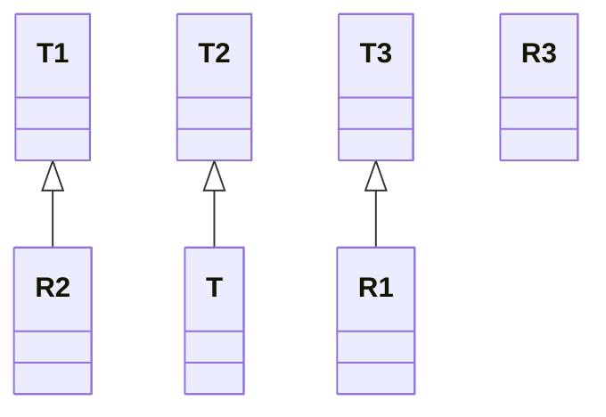

#interface  #functional-programming  #java #high-order-function 

# Function
- `R apply(T t)`: passes the variable `t` as the first ==parameter of high-order function== and return the value of that high-order function.
- `default <V> Function<V, R> compose(Function<? super V, ? extends T> before)`: passes the `Function` `before` as a ==high-order function==. The type of `before` 's return value must be the ==child class or interface of the input parameter== of calling `Predicate`.
- `default <V> Function<T, V> andThen(Function<? super R, ? extends V> after)`: passes the `Function` `after` as a high-order function. The type of calling `Predicate` return value must the ==child class or interface of the input parameter== of `after`. 
- `f.compose(g).andThen(h).apply(t)` $\iff$ 
- Assume $f: T_1 \to R_1$ , $g: T_2 \to R_2$ , $h: T_3 \to R_3$, $t \in T$ , we have class diagram



```Java
import java.util.LinkedList;  
import java.util.List;  
import java.util.Random;  
import java.util.function.*;  
  
public class Main {  
  public static void main(String[] args) {  
    Function<Integer, List<Integer>> generateRandomIntegerListGivenSize = (Integer n) -> {  
      List<Integer> list = new LinkedList<Integer>();  
      Random random = new Random();  
      for (int i = 0; i < n; ++i) {  
        list.add(random.nextInt());  
      }  
      return list;  
    };  
  
    Function<List<Integer>, List<Integer>> addRandomElementsToList = (List<Integer> list) -> {  
      Random random = new Random();  
      int n = list.size();  
      for (int i = 0; i < n; ++i) {  
        list.add(random.nextInt());  
      }  
      return list;  
    };  
  
    Function<Integer, Integer> generateRandomSize = (Integer maxSize) -> {  
      Random random = new Random();  
      return random.nextInt(maxSize) + 1;  
    };  
  
    Consumer<List<Integer>> displayList = (List<Integer> l) -> {  
      for (Integer e: l) {  
        System.out.print(STR."\{e} ");  
      }  
      System.out.println();  
    };  
    List<Integer> list = generateRandomIntegerListGivenSize.compose(generateRandomSize).andThen(addRandomElementsToList).apply(5);  
    displayList.accept(list);  
  }  
}
```

# BiFunction
- Similar to `Function`, but takes ==two arguments== and produces one output.

# References
1. https://www.geeksforgeeks.org/java-bifunction-interface-methods-apply-and-andthen/ for BiFunction.
2. 