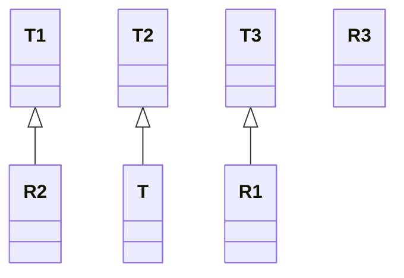

#api  #functional-programming  #java #high-order-function #object-oriented-programming #data-type 

- `Function` is the most general form of function type in Java.
# Function
- `R apply(T t)`: passes the variable `t` as the first ==parameter of high-order function== and return the value of that high-order function.
- `default <V> Function<V, R> compose(Function<? super V, ? extends T> before)`: passes the invoking `Function`  as a ==high-order function==. The type of `before` 's return value must be the ==child class or interface of the input parameter== of calling `Function`.
- `default <V> Function<T, V> andThen(Function<? super R, ? extends V> after)`: passes the `Function` `after` as a high-order function. The type of calling `Predicate` return value must the ==child class or interface of the input parameter== of `after`. 
- `f.compose(g).andThen(h).apply(t)` $\iff$ $h(f(g(t)))$ 
	- `f.andThen(g)` executes `f` first, then `g`  $\iff g(f(x))$
	- `f.compose(g)` executes `g` first, then `f`  $\iff f(g(x))$
- Assume $f: T_1 \to R_1$ , $g: T_2 \to R_2$ , $h: T_3 \to R_3$, $t \in T$ , the type requirement should be conformed:



```Java
import java.util.LinkedList;  
import java.util.List;  
import java.util.Random;  
import java.util.function.*;  
  
public class Main {  
  public static void main(String[] args) {  
    Function<Integer, List<Integer>> generateRandomIntegerListGivenSize = (Integer n) -> {  
      List<Integer> list = new LinkedList<Integer>();  
      Random random = new Random();  
      for (int i = 0; i < n; ++i) {  
        list.add(random.nextInt());  
      }  
      return list;  
    };  
  
    Function<List<Integer>, List<Integer>> addRandomElementsToList = (List<Integer> list) -> {  
      Random random = new Random();  
      int n = list.size();  
      for (int i = 0; i < n; ++i) {  
        list.add(random.nextInt());  
      }  
      return list;  
    };  
  
    Function<Integer, Integer> generateRandomSize = (Integer maxSize) -> {  
      Random random = new Random();  
      return random.nextInt(maxSize) + 1;  
    };  
  
    Consumer<List<Integer>> displayList = (List<Integer> l) -> {  
      for (Integer e: l) {  
        System.out.print(STR."\{e} ");  
      }  
      System.out.println();  
    };  
    List<Integer> list = generateRandomIntegerListGivenSize.compose(generateRandomSize)
      .andThen(addRandomElementsToList).apply(5);  
    displayList.accept(list);  
  }  
}
```

# Simplified symbol
- Since Java is an fully object-oriented programming language, it prioritizes the strictness of class hierarchy over the readability.
- The `Function` API can be simplified as:
	- `f.apply(args)` is equivalent to `f(args)`.
	- `f.andThen(g).apply(x)` is equivalent to `g(f(x))`.
	- `f.compose(g).apply(x)` is equivalent to `f(g(x))`.
# Partially applied function
```Java title='Partially applied function in Java'
import java.util.function.Function;

public class FunctionalUtil {
  public static <T, U, V, X> Function<Function<T, U>, Function<Function<U, V>, Function<Function<V, X>, Function<T, X>>>> curriedlyTransform() {
    return (Function<T, U> f1) -> (Function<U, V> f2) -> (Function<V, X> f3) -> f1.andThen(f2).andThen(f3);
  }
}
```
- For the type analysis, domain generalization is performed
$$f_1: T \mapsto U, \space f_2: U \mapsto V, \space f_3: V \mapsto X$$
$$f: (T, U, V) \mapsto X \space \text{as normal function}$$
$$g: T \mapsto (U \mapsto (V \mapsto X)) \space \text{as partially applied function}$$
$$\text{For each map symbol, replace it with Function: }$$
$$g: \text{Function}(T, \space\text{Function}(U, \space\text{Function}(V, X)))$$
- For the runtime calculation, value specialization is performed. A layer of function is removed whenever the argument as high-order function is executed.
$$f_1 \text{ is executed, remove a layer of function}$$
$$f_1(t)=u, \space g(f_1)=\text{Function}(U, \space\text{Function}(V, X))$$
$$f_2 \text{ is executed, remove a layer of function} $$$$f_2(u)=v, \space g(f_1)(f_2)=\space\text{Function}(V, X)$$
$$f_3 \text{ is executed, remove a layer of function} $$
$$f_3(v)=x, \space g(f_1)(f_2)(f_3)=x$$
- The arguments of a curried function can be applied in a reverse order by defining a new function.
```Java title='Reverse the order of arguments in a curried function in Java'
public static <T, U, V> Function<U, Function<T, V>> reverseArgs(Function<T, Function<U, V>> f) {
	return u -> t -> f.apply(t).apply(u);
}
```
# Variant
## BiFunction
- Similar to `Function`, but takes ==two arguments== and produces one output.
# References
1. https://www.geeksforgeeks.org/java-bifunction-interface-methods-apply-and-andthen/ for BiFunction.
2. [[Currying function]] for Partially applied function in Java.
3. Functional Programming in Java: How functional techniques improve your Java programs - Pierre-Yves Saumont - Manning Publications 2017.
	1. Chapter 2. Using Functions in Java.