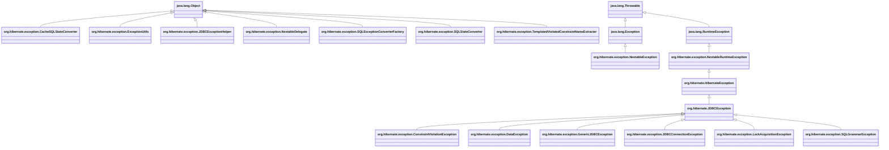

#exception #dbms #transaction #hibernate #software-architecture #software-engineering #object-oriented-programming #java #jakarta-ee #jdbc 

# Exception hierarchy

***
# References
1. https://drive.google.com/file/d/1GP3TrBzG7xUD72qHfFqmbVJRxvSV_t-X/view?usp=sharing
2. 

