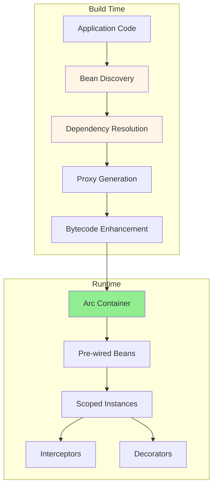

#java #quarkus  #jakarta-ee #design-pattern #software-architecture #java17 #java21
# Definition
- ==Arc== is Quarkus' ==dependency injection (DI) solution== based on Jakarta CDI (Contexts and Dependency Injection). 
- Unlike traditional CDI containers, Arc performs ==bean discovery and metadata processing at build time==, resulting in zero reflection, faster startup, and reduced memory footprint.
# Arc CDI Architecture



## Build-Time Processing

### Bean Discovery
- Arc scans for beans at compile time:
    - Classes annotated with `@ApplicationScoped`, `@RequestScoped`, `@Singleton`
    - Classes with `@Inject` constructors
    - Producer methods and fields
    - Interceptors and decorators
### Dependency Graph Construction

```mermaid
graph LR
    A[UserResource] -->|@Inject| B[UserService]
    B -->|@Inject| C[UserRepository]
    B -->|@Inject| D[EmailService]
    C -->|@Inject| E[EntityManager]

    style A fill:#FFD700
    style B fill:#90EE90
    style C fill:#87CEEB
```

- All dependencies resolved at build time, eliminating runtime discovery overhead.
## Runtime Behavior
### Minimal Initialization
```Java
// Build time: Arc generates initialization code
// Runtime: Direct bean instantiation, no scanning

@ApplicationScoped
public class UserService {
    // Arc knows this dependency at build time
    @Inject
    UserRepository repository;
}

// At runtime:
// UserService instance = new UserService_Bean();
// instance.repository = container.select(UserRepository.class).get();
```
# Bean Scopes
## `@ApplicationScoped`
- ==Single instance== shared across the entire application lifecycle.
```Java
import jakarta.enterprise.context.ApplicationScoped;

@ApplicationScoped
public class ConfigurationService {

    private final Map<String, String> config = new HashMap<>();

    public void loadConfig() {
        // Load configuration once
        config.put("app.name", "My Quarkus App");
    }

    public String getConfig(String key) {
        return config.get(key);
    }
}
```

**Use cases:**
- Configuration services
- Caches and shared state
- Connection pools
- Stateless services

**Lifecycle:** Created on first access, destroyed on application shutdown

**Thread safety:** Must be thread-safe (accessed by multiple threads)
## @Singleton

- ==Eager singleton== - instantiated at startup.

```Java
import jakarta.inject.Singleton;
import io.quarkus.runtime.StartupEvent;
import jakarta.enterprise.event.Observes;

@Singleton
public class DatabaseInitializer {

    void onStart(@Observes StartupEvent event) {
        // Executed at startup
        initializeDatabase();
    }

    private void initializeDatabase() {
        System.out.println("Database initialized");
    }
}
```

**@ApplicationScoped vs @Singleton:**

| Aspect | @ApplicationScoped | @Singleton |
|--------|-------------------|------------|
| Creation | Lazy (on first use) | Eager (at startup) |
| Proxy | Generated | Direct reference |
| Interception | Supported | Limited |
| Standard | CDI standard | JSR-330 |
| Recommended | Yes | Specific cases |

## @RequestScoped

==New instance per request== - activated during HTTP request, destroyed after response.

```Java
import jakarta.enterprise.context.RequestScoped;
import jakarta.ws.rs.core.Context;
import jakarta.ws.rs.core.SecurityContext;

@RequestScoped
public class RequestContext {

    @Context
    SecurityContext securityContext;

    private String requestId = UUID.randomUUID().toString();

    public String getCurrentUser() {
        return securityContext.getUserPrincipal().getName();
    }

    public String getRequestId() {
        return requestId;
    }
}
```

**Use cases:**
- Request-specific data
- User session information
- Request tracing and logging
- Web request state

**Lifecycle:** Created at request start, destroyed after response sent

**Thread safety:** Single thread per request (thread-safe by design)

## @Dependent

==New instance for each injection point== - no shared state.

```Java
import jakarta.enterprise.context.Dependent;

@Dependent
public class PriceCalculator {

    public BigDecimal calculatePrice(Product product, int quantity) {
        return product.getPrice().multiply(BigDecimal.valueOf(quantity));
    }
}

@ApplicationScoped
public class OrderService {

    @Inject
    PriceCalculator calculator1; // Instance 1

    @Inject
    PriceCalculator calculator2; // Instance 2 (different from calculator1)
}
```

**Use cases:**
- Stateful objects
- Non-shared computations
- Temporary objects
- Default scope (when no scope specified)

**Lifecycle:** Tied to lifecycle of dependent bean

## Scope Comparison

```mermaid
graph TB
    A[Application Start] --> B[@Singleton created]
    C[First Access] --> D[@ApplicationScoped created]
    E[HTTP Request] --> F[@RequestScoped created]
    E --> G[@Dependent created per injection]

    F --> H[Request End: @RequestScoped destroyed]
    I[Application Shutdown] --> J[@ApplicationScoped destroyed]
    I --> K[@Singleton destroyed]

    style B fill:#FFD700
    style D fill:#90EE90
    style F fill:#87CEEB
    style G fill:#FFB6C6
```

# Dependency Injection Methods

## Constructor Injection

==Recommended approach== - immutable dependencies, testability.

```Java
import jakarta.enterprise.context.ApplicationScoped;

@ApplicationScoped
public class UserService {

    private final UserRepository repository;
    private final EmailService emailService;

    // Arc auto-detects constructor injection
    public UserService(UserRepository repository, EmailService emailService) {
        this.repository = repository;
        this.emailService = emailService;
    }

    public User createUser(String email) {
        User user = new User(email);
        repository.persist(user);
        emailService.sendWelcome(user);
        return user;
    }
}
```

**Advantages:**
- Immutability (final fields)
- Easier testing (explicit dependencies)
- Null-safety (dependencies required)
- No reflection needed

## Field Injection

Convenient but less testable.

```Java
import jakarta.enterprise.context.ApplicationScoped;
import jakarta.inject.Inject;

@ApplicationScoped
public class OrderService {

    @Inject
    OrderRepository orderRepository;

    @Inject
    PaymentService paymentService;

    public Order processOrder(Order order) {
        orderRepository.persist(order);
        paymentService.charge(order.getTotal());
        return order;
    }
}
```

**Disadvantages:**
- Mutable fields (not final)
- Hidden dependencies
- Harder to unit test
- Reflection in tests

## Setter Injection

Rarely used in Quarkus.

```Java
import jakarta.inject.Inject;

@ApplicationScoped
public class NotificationService {

    private EmailService emailService;

    @Inject
    public void setEmailService(EmailService emailService) {
        this.emailService = emailService;
    }
}
```

# Qualifiers

==Disambiguate== multiple implementations of the same type.

## Built-in Qualifiers

### @Named

```Java
import jakarta.inject.Named;
import jakarta.enterprise.context.ApplicationScoped;

@ApplicationScoped
@Named("emailNotifier")
public class EmailNotifier implements Notifier {
    public void send(String message) {
        // Send email
    }
}

@ApplicationScoped
@Named("smsNotifier")
public class SmsNotifier implements Notifier {
    public void send(String message) {
        // Send SMS
    }
}

// Injection
@ApplicationScoped
public class NotificationService {

    @Inject
    @Named("emailNotifier")
    Notifier emailNotifier;

    @Inject
    @Named("smsNotifier")
    Notifier smsNotifier;
}
```

### @Default

Implicit qualifier when no qualifier specified.

```Java
@ApplicationScoped
@Default // Implicit
public class DefaultNotifier implements Notifier {
    public void send(String message) {
        System.out.println(message);
    }
}
```

## Custom Qualifiers

```Java
import jakarta.inject.Qualifier;
import java.lang.annotation.Retention;
import java.lang.annotation.Target;
import static java.lang.annotation.ElementType.*;
import static java.lang.annotation.RetentionPolicy.RUNTIME;

@Qualifier
@Retention(RUNTIME)
@Target({TYPE, METHOD, FIELD, PARAMETER})
public @interface Email {}

@Qualifier
@Retention(RUNTIME)
@Target({TYPE, METHOD, FIELD, PARAMETER})
public @interface Sms {}
```

```Java
@ApplicationScoped
@Email
public class EmailNotifier implements Notifier {
    public void send(String message) {
        // Send email
    }
}

@ApplicationScoped
@Sms
public class SmsNotifier implements Notifier {
    public void send(String message) {
        // Send SMS
    }
}

// Injection with custom qualifiers
@ApplicationScoped
public class NotificationService {

    @Inject
    @Email
    Notifier emailNotifier;

    @Inject
    @Sms
    Notifier smsNotifier;
}
```

## Qualifiers with Members

```Java
@Qualifier
@Retention(RUNTIME)
@Target({TYPE, METHOD, FIELD, PARAMETER})
public @interface PaymentMethod {
    PaymentType value();
}

public enum PaymentType {
    CREDIT_CARD,
    PAYPAL,
    BANK_TRANSFER
}
```

```Java
@ApplicationScoped
@PaymentMethod(PaymentType.CREDIT_CARD)
public class CreditCardProcessor implements PaymentProcessor {
    public void process(Payment payment) {
        // Process credit card
    }
}

@ApplicationScoped
@PaymentMethod(PaymentType.PAYPAL)
public class PayPalProcessor implements PaymentProcessor {
    public void process(Payment payment) {
        // Process PayPal
    }
}

// Injection
@Inject
@PaymentMethod(PaymentType.CREDIT_CARD)
PaymentProcessor creditCardProcessor;
```

# Producers

Create beans programmatically when constructor injection is insufficient.

## Producer Methods

```Java
import jakarta.enterprise.context.ApplicationScoped;
import jakarta.enterprise.inject.Produces;
import org.eclipse.microprofile.config.inject.ConfigProperty;

@ApplicationScoped
public class DatabaseProducer {

    @ConfigProperty(name = "database.url")
    String databaseUrl;

    @Produces
    @ApplicationScoped
    public DataSource createDataSource() {
        HikariConfig config = new HikariConfig();
        config.setJdbcUrl(databaseUrl);
        config.setUsername("user");
        config.setPassword("pass");
        return new HikariDataSource(config);
    }
}

// Injection
@Inject
DataSource dataSource; // Produced by createDataSource()
```

## Producer Fields

```Java
@ApplicationScoped
public class ConfigurationProducer {

    @Produces
    @ApplicationScoped
    public ObjectMapper objectMapper = new ObjectMapper()
        .registerModule(new JavaTimeModule())
        .configure(SerializationFeature.WRITE_DATES_AS_TIMESTAMPS, false);
}

// Injection
@Inject
ObjectMapper objectMapper;
```

## Disposer Methods

Clean up produced resources.

```Java
@ApplicationScoped
public class ConnectionProducer {

    @Produces
    @RequestScoped
    public Connection createConnection(DataSource dataSource) throws SQLException {
        return dataSource.getConnection();
    }

    public void closeConnection(@Disposes Connection connection) throws SQLException {
        if (connection != null && !connection.isClosed()) {
            connection.close();
        }
    }
}
```

# Interceptors

Implement cross-cutting concerns using [[software-engineering/software-architecture/design/design-pattern/structural/Proxy pattern|Proxy Pattern]].

## Interceptor Binding

```Java
import jakarta.interceptor.InterceptorBinding;
import java.lang.annotation.Retention;
import java.lang.annotation.Target;
import static java.lang.annotation.ElementType.*;
import static java.lang.annotation.RetentionPolicy.RUNTIME;

@InterceptorBinding
@Retention(RUNTIME)
@Target({TYPE, METHOD})
public @interface Logged {}
```

## Interceptor Implementation

```Java
import jakarta.interceptor.Interceptor;
import jakarta.interceptor.InvocationContext;
import jakarta.interceptor.AroundInvoke;
import io.quarkus.logging.Log;

@Logged
@Interceptor
public class LoggingInterceptor {

    @AroundInvoke
    public Object logInvocation(InvocationContext context) throws Exception {
        String methodName = context.getMethod().getName();
        Log.infof("Entering method: %s", methodName);

        long startTime = System.currentTimeMillis();
        try {
            return context.proceed();
        } finally {
            long duration = System.currentTimeMillis() - startTime;
            Log.infof("Exiting method: %s (took %d ms)", methodName, duration);
        }
    }
}
```

## Using Interceptors

```Java
@ApplicationScoped
public class UserService {

    @Logged // Interceptor applied
    public User createUser(String email) {
        return new User(email);
    }

    @Logged
    public List<User> findAll() {
        return userRepository.listAll();
    }
}
```

## Common Interceptor Use Cases

### Transaction Management

```Java
@InterceptorBinding
@Retention(RUNTIME)
@Target({TYPE, METHOD})
public @interface Transactional {}

@Transactional
@Interceptor
public class TransactionalInterceptor {

    @Inject
    EntityManager em;

    @AroundInvoke
    public Object manageTransaction(InvocationContext context) throws Exception {
        EntityTransaction tx = em.getTransaction();
        boolean startedTransaction = false;

        if (!tx.isActive()) {
            tx.begin();
            startedTransaction = true;
        }

        try {
            Object result = context.proceed();
            if (startedTransaction) {
                tx.commit();
            }
            return result;
        } catch (Exception e) {
            if (startedTransaction && tx.isActive()) {
                tx.rollback();
            }
            throw e;
        }
    }
}
```

### Performance Monitoring

```Java
@InterceptorBinding
@Retention(RUNTIME)
@Target({TYPE, METHOD})
public @interface Timed {}

@Timed
@Interceptor
public class PerformanceInterceptor {

    @Inject
    MeterRegistry registry;

    @AroundInvoke
    public Object measureTime(InvocationContext context) throws Exception {
        Timer.Sample sample = Timer.start(registry);
        try {
            return context.proceed();
        } finally {
            sample.stop(Timer.builder("method.execution")
                .tag("class", context.getMethod().getDeclaringClass().getSimpleName())
                .tag("method", context.getMethod().getName())
                .register(registry));
        }
    }
}
```

# Events

Loosely-coupled communication between beans.

## Event Definition

```Java
public class UserCreatedEvent {
    private final User user;
    private final LocalDateTime timestamp;

    public UserCreatedEvent(User user) {
        this.user = user;
        this.timestamp = LocalDateTime.now();
    }

    // Getters
}
```

## Event Firing

```Java
import jakarta.enterprise.event.Event;
import jakarta.inject.Inject;

@ApplicationScoped
public class UserService {

    @Inject
    Event<UserCreatedEvent> userCreatedEvent;

    public User createUser(String email) {
        User user = new User(email);
        repository.persist(user);

        // Fire event
        userCreatedEvent.fire(new UserCreatedEvent(user));

        return user;
    }
}
```

## Event Observation

```Java
import jakarta.enterprise.context.ApplicationScoped;
import jakarta.enterprise.event.Observes;

@ApplicationScoped
public class EmailService {

    public void onUserCreated(@Observes UserCreatedEvent event) {
        User user = event.getUser();
        sendWelcomeEmail(user.getEmail());
    }
}

@ApplicationScoped
public class AuditService {

    public void onUserCreated(@Observes UserCreatedEvent event) {
        logAuditEvent("USER_CREATED", event.getUser().getId());
    }
}
```

## Async Events

```Java
import jakarta.enterprise.event.ObservesAsync;

@ApplicationScoped
public class NotificationService {

    public void onUserCreatedAsync(@ObservesAsync UserCreatedEvent event) {
        // Executed asynchronously
        sendNotification(event.getUser());
    }
}

// Fire asynchronously
@Inject
Event<UserCreatedEvent> userCreatedEvent;

userCreatedEvent.fireAsync(new UserCreatedEvent(user));
```

## Event Qualifiers

```Java
@Qualifier
@Retention(RUNTIME)
@Target({FIELD, PARAMETER})
public @interface Premium {}

// Fire qualified event
@Inject
@Premium
Event<UserCreatedEvent> premiumUserEvent;

premiumUserEvent.fire(new UserCreatedEvent(user));

// Observe qualified event
public void onPremiumUserCreated(@Observes @Premium UserCreatedEvent event) {
    // Handle premium user creation
}
```

# Programmatic Lookup

Access beans programmatically at runtime.

## Instance<T>

```Java
import jakarta.enterprise.inject.Instance;
import jakarta.inject.Inject;

@ApplicationScoped
public class NotificationDispatcher {

    @Inject
    Instance<Notifier> notifiers;

    public void sendToAll(String message) {
        // Iterate all Notifier implementations
        for (Notifier notifier : notifiers) {
            notifier.send(message);
        }
    }
}
```

## Qualified Lookup

```Java
@Inject
Instance<Notifier> notifiers;

public void sendEmail(String message) {
    Notifier emailNotifier = notifiers
        .select(EmailNotifier.class)
        .get();

    emailNotifier.send(message);
}
```

## Conditional Bean Access

```Java
@Inject
Instance<CacheService> cacheService;

public void saveData(String key, String value) {
    // Check if CacheService is available
    if (cacheService.isResolvable()) {
        cacheService.get().put(key, value);
    } else {
        // Fallback behavior
        saveToDatabase(key, value);
    }
}
```

# Bean Lifecycle Callbacks

## PostConstruct

Executed after dependency injection is complete.

```Java
import jakarta.annotation.PostConstruct;
import jakarta.enterprise.context.ApplicationScoped;

@ApplicationScoped
public class DatabaseService {

    @Inject
    DataSource dataSource;

    private Connection connection;

    @PostConstruct
    public void initialize() {
        try {
            connection = dataSource.getConnection();
            System.out.println("Database connection established");
        } catch (SQLException e) {
            throw new RuntimeException("Failed to connect to database", e);
        }
    }
}
```

## PreDestroy

Executed before bean destruction.

```Java
import jakarta.annotation.PreDestroy;

@ApplicationScoped
public class DatabaseService {

    private Connection connection;

    @PreDestroy
    public void cleanup() {
        try {
            if (connection != null && !connection.isClosed()) {
                connection.close();
                System.out.println("Database connection closed");
            }
        } catch (SQLException e) {
            System.err.println("Error closing connection: " + e.getMessage());
        }
    }
}
```

## Startup Event

```Java
import io.quarkus.runtime.StartupEvent;
import jakarta.enterprise.event.Observes;

@ApplicationScoped
public class ApplicationInitializer {

    void onStart(@Observes StartupEvent event) {
        System.out.println("Application started");
        // Perform startup tasks
    }
}
```

## Shutdown Event

```Java
import io.quarkus.runtime.ShutdownEvent;
import jakarta.enterprise.event.Observes;

@ApplicationScoped
public class ApplicationCleanup {

    void onShutdown(@Observes ShutdownEvent event) {
        System.out.println("Application shutting down");
        // Cleanup resources
    }
}
```

# Arc vs Traditional CDI

| Feature | Arc (Quarkus) | Weld (Traditional CDI) |
|---------|---------------|------------------------|
| **Bean Discovery** | Build time | Runtime |
| **Reflection** | Minimal (build time only) | Extensive (runtime) |
| **Startup Time** | Fast (<1s) | Slow (3-10s) |
| **Memory Footprint** | Low | High |
| **Native Image** | Full support | Limited |
| **CDI Compliance** | Subset | Full specification |
| **Portable Extensions** | Limited | Full support |
| **Decorators** | Supported | Supported |
| **Interceptors** | Supported | Supported |
| **Events** | Supported | Supported |

# Links to Design Patterns

## Dependency Injection Pattern

Arc implements the [[software-engineering/software-architecture/design/design-pattern/enterprise-pattern/integration/Dependency injection pattern|Dependency Injection Pattern]]:

- **Constructor injection**: Dependencies passed via constructor
- **Setter injection**: Dependencies set via setter methods
- **Interface injection**: Not supported (CDI uses annotations)

## Singleton Pattern

`@ApplicationScoped` and `@Singleton` provide controlled access to [[software-engineering/software-architecture/design/design-pattern/creational/Singleton pattern|Singleton Pattern]] instances.

## Factory Pattern

Producer methods implement [[software-engineering/software-architecture/design/design-pattern/creational/Factory Method pattern|Factory Method Pattern]] for bean creation.

## Observer Pattern

CDI events implement [[software-engineering/software-architecture/design/design-pattern/behavioral/Observer pattern|Observer Pattern]] for event-driven communication.

## Proxy Pattern

Arc interceptors use [[software-engineering/software-architecture/design/design-pattern/structural/Proxy pattern|Proxy Pattern]] for cross-cutting concerns.

# Best Practices

## Prefer Constructor Injection

```Java
// Good: Constructor injection with final fields
@ApplicationScoped
public class UserService {
    private final UserRepository repository;
    private final EmailService emailService;

    public UserService(UserRepository repository, EmailService emailService) {
        this.repository = repository;
        this.emailService = emailService;
    }
}

// Avoid: Field injection (harder to test)
@ApplicationScoped
public class UserService {
    @Inject UserRepository repository;
    @Inject EmailService emailService;
}
```

## Use @ApplicationScoped by Default

```Java
// Default to @ApplicationScoped for stateless services
@ApplicationScoped
public class PriceCalculator {
    public BigDecimal calculate(Product product) {
        return product.getPrice();
    }
}

// Use @RequestScoped only when needed
@RequestScoped
public class UserContext {
    private User currentUser;
}
```

## Avoid Circular Dependencies

```Java
// Bad: Circular dependency
@ApplicationScoped
public class ServiceA {
    @Inject ServiceB serviceB; // ServiceB depends on ServiceA
}

@ApplicationScoped
public class ServiceB {
    @Inject ServiceA serviceA; // Circular!
}

// Good: Refactor to eliminate cycle
@ApplicationScoped
public class ServiceA {
    @Inject SharedService sharedService;
}

@ApplicationScoped
public class ServiceB {
    @Inject SharedService sharedService;
}
```

## Use Qualifiers for Multiple Implementations

```Java
// Good: Clear qualifier-based selection
@Inject
@Email
Notifier emailNotifier;

@Inject
@Sms
Notifier smsNotifier;

// Avoid: Generic Instance lookup everywhere
@Inject
Instance<Notifier> notifiers;
Notifier emailNotifier = notifiers.select(EmailNotifier.class).get();
```

---
# References

1. https://quarkus.io/guides/cdi-reference - Quarkus CDI reference guide
2. https://jakarta.ee/specifications/cdi/4.0/ - Jakarta CDI 4.0 specification
3. https://quarkus.io/guides/cdi - Introduction to CDI in Quarkus
4. https://github.com/quarkusio/quarkus/tree/main/extensions/arc - Arc CDI implementation source
5. https://quarkus.io/blog/magic-control/ - Arc: Magic or Controlled Magic?
6. [[software-engineering/software-architecture/design/design-pattern/enterprise-pattern/integration/Dependency injection pattern|Dependency Injection Pattern]]
7. [[software-engineering/software-architecture/design/design-pattern/creational/Factory Method pattern|Factory Method Pattern]]
8. [[software-engineering/software-architecture/design/design-pattern/behavioral/Observer pattern|Observer Pattern]]
9. [[software-engineering/software-architecture/design/design-pattern/structural/Proxy pattern|Proxy Pattern]]
10. [[programming/java/quarkus/Quarkus]] for Quarkus architecture and philosophy
11. [[programming/java/spring/dependency-injection/Bean lifecycle|Spring Bean Lifecycle]] for comparison with Spring DI
