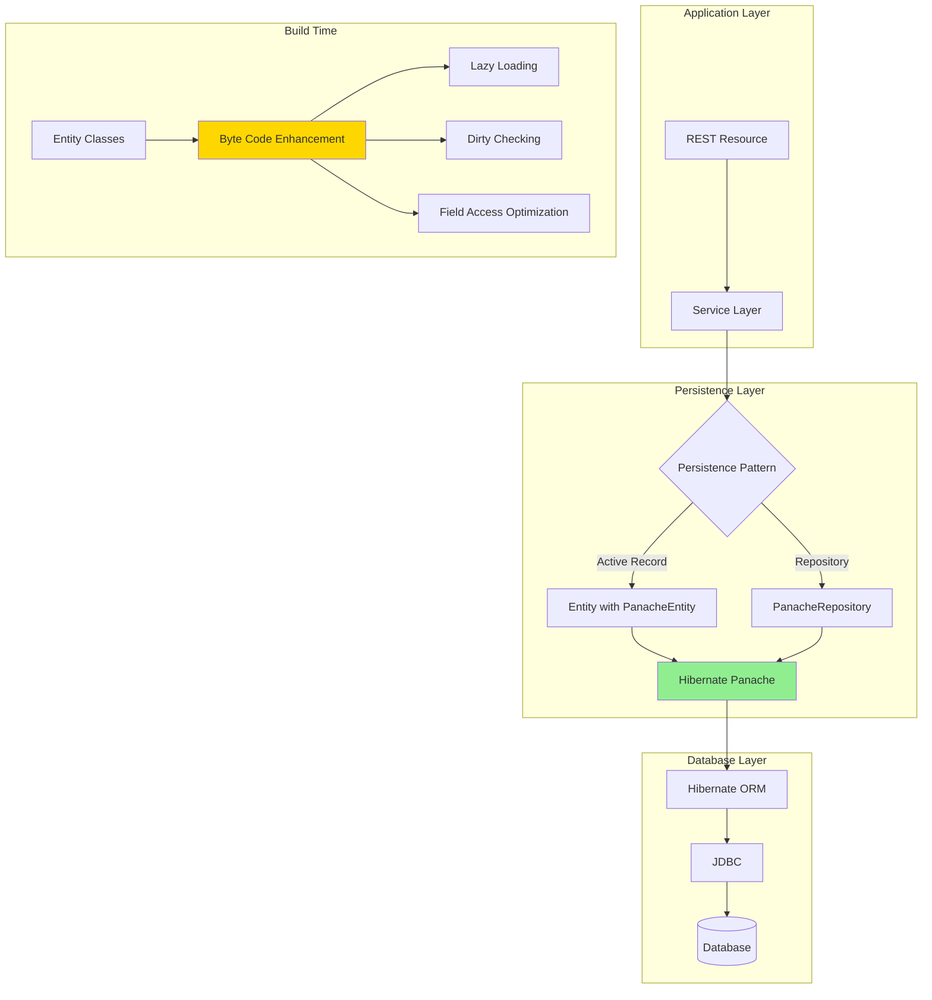

#java #quarkus #hibernate #panache #jpa  #database #orm #repository-pattern #active-record-pattern #jakarta-ee
# Definition
- Hibernate ORM with Panache is Quarkus' persistence layer that simplifies Hibernate.
# Architecture


# Active Record Pattern
- Entities inherit from `PanacheEntity` or `PanacheEntityBase` and manage their own persistence.
## Basic Entity
```Java
import io.quarkus.hibernate.orm.panache.PanacheEntity;
import jakarta.persistence.Entity;
import jakarta.persistence.Column;

@Entity
public class User extends PanacheEntity {
    // id field inherited from PanacheEntity (Long id)

    @Column(unique = true, nullable = false)
    public String username;

    @Column(nullable = false)
    public String email;

    public String firstName;
    public String lastName;

    // No getters/setters needed - Panache generates them
}
```
## Custom ID Type
```Java
import io.quarkus.hibernate.orm.panache.PanacheEntityBase;
import jakarta.persistence.Id;
import jakarta.persistence.GeneratedValue;
import java.util.UUID;

@Entity
public class Product extends PanacheEntityBase {

    @Id
    @GeneratedValue
    public UUID id;

    public String name;
    public BigDecimal price;
    public Integer stock;
}
```
## CRUD Operations
```Java
import jakarta.transaction.Transactional;
import jakarta.ws.rs.*;

@Path("/users")
@Produces(MediaType.APPLICATION_JSON)
@Consumes(MediaType.APPLICATION_JSON)
public class UserResource {

    @GET
    public List<User> list() {
        return User.listAll();
    }

    @GET
    @Path("/{id}")
    public User getById(@PathParam("id") Long id) {
        return User.findById(id);
    }

    @POST
    @Transactional
    public User create(User user) {
        user.persist();
        return user;
    }

    @PUT
    @Path("/{id}")
    @Transactional
    public User update(@PathParam("id") Long id, User updatedUser) {
        User user = User.findById(id);
        if (user == null) {
            throw new NotFoundException();
        }
        user.username = updatedUser.username;
        user.email = updatedUser.email;
        // No explicit persist() needed - dirty checking
        return user;
    }

    @DELETE
    @Path("/{id}")
    @Transactional
    public void delete(@PathParam("id") Long id) {
        User.deleteById(id);
    }
}
```
## Query Methods
```Java
// Find all
List<User> users = User.listAll();

// Find by ID
User user = User.findById(1L);

// Find by field
List<User> users = User.list("username", "john");

// Find with query
List<User> users = User.list("username = ?1 and active = ?2", "john", true);

// Named parameters
List<User> users = User.list("username = :username", Parameters.with("username", "john"));

// Count
long count = User.count();
long activeCount = User.count("active", true);

// Exists
boolean exists = User.count("email", "john@example.com") > 0;

// Delete
long deleted = User.delete("active", false);

// Stream (for large datasets)
Stream<User> users = User.stream("active", true);
```
## Pagination and Sorting
```Java
import io.quarkus.panache.common.Page;
import io.quarkus.panache.common.Sort;

// Pagination
List<User> users = User.findAll()
    .page(Page.of(0, 20))  // Page 0, size 20
    .list();

// Sorting
List<User> users = User.findAll(Sort.by("username").ascending())
    .list();

// Combined
List<User> users = User.find("active", Sort.by("createdAt").descending(), true)
    .page(Page.of(2, 10))  // Page 2, size 10
    .list();
```
# Repository Pattern
## Repository Interface
```Java
import io.quarkus.hibernate.orm.panache.PanacheRepository;
import jakarta.enterprise.context.ApplicationScoped;

@ApplicationScoped
public class UserRepository implements PanacheRepository<User> {

    public User findByUsername(String username) {
        return find("username", username).firstResult();
    }

    public List<User> findActive() {
        return list("active", true);
    }

    public List<User> findByEmailDomain(String domain) {
        return list("email like ?1", "%" + domain);
    }

    public List<User> search(String query) {
        return find("username like ?1 or email like ?1", "%" + query + "%")
            .list();
    }
}
```
## Using Repository
```Java
import jakarta.inject.Inject;

@Path("/users")
public class UserResource {

    @Inject
    UserRepository userRepository;

    @GET
    public List<User> list() {
        return userRepository.listAll();
    }

    @GET
    @Path("/active")
    public List<User> listActive() {
        return userRepository.findActive();
    }

    @GET
    @Path("/search")
    public List<User> search(@QueryParam("q") String query) {
        return userRepository.search(query);
    }

    @POST
    @Transactional
    public User create(User user) {
        userRepository.persist(user);
        return user;
    }

    @DELETE
    @Path("/{id}")
    @Transactional
    public void delete(@PathParam("id") Long id) {
        userRepository.deleteById(id);
    }
}
```
## Custom Base Repository
```Java
import io.quarkus.hibernate.orm.panache.PanacheRepositoryBase;

public interface BaseRepository<T, ID> extends PanacheRepositoryBase<T, ID> {

    default T findByIdOrThrow(ID id) {
        T entity = findById(id);
        if (entity == null) {
            throw new EntityNotFoundException("Entity not found");
        }
        return entity;
    }

    default List<T> findByIds(List<ID> ids) {
        return find("id in ?1", ids).list();
    }
}

@ApplicationScoped
public class UserRepository implements BaseRepository<User, Long> {
    // Inherits findByIdOrThrow() and findByIds()
}
```
# Relationships
## OneToMany / ManyToOne
```Java
@Entity
public class Customer extends PanacheEntity {
    public String name;
    public String email;

    @OneToMany(mappedBy = "customer", cascade = CascadeType.ALL, orphanRemoval = true)
    public List<Order> orders = new ArrayList<>();
}

@Entity
public class Order extends PanacheEntity {
    @ManyToOne
    @JoinColumn(name = "customer_id")
    public Customer customer;

    public LocalDateTime orderDate;
    public BigDecimal total;

    @OneToMany(mappedBy = "order", cascade = CascadeType.ALL, orphanRemoval = true)
    public List<OrderItem> items = new ArrayList<>();
}

@Entity
public class OrderItem extends PanacheEntity {
    @ManyToOne
    @JoinColumn(name = "order_id")
    public Order order;

    @ManyToOne
    @JoinColumn(name = "product_id")
    public Product product;

    public Integer quantity;
    public BigDecimal price;
}
```
## ManyToMany
```Java
@Entity
public class Student extends PanacheEntity {
    public String name;
    public String email;

    @ManyToMany
    @JoinTable(
        name = "student_course",
        joinColumns = @JoinColumn(name = "student_id"),
        inverseJoinColumns = @JoinColumn(name = "course_id")
    )
    public Set<Course> courses = new HashSet<>();
}

@Entity
public class Course extends PanacheEntity {
    public String code;
    public String name;
    public Integer credits;

    @ManyToMany(mappedBy = "courses")
    public Set<Student> students = new HashSet<>();
}
```
## Fetching Strategies
```Java
// Eager loading (default for @ManyToOne, @OneToOne)
@ManyToOne(fetch = FetchType.EAGER)
public Customer customer;

// Lazy loading (default for @OneToMany, @ManyToMany)
@OneToMany(mappedBy = "customer", fetch = FetchType.LAZY)
public List<Order> orders;

// Join fetch in query
List<Order> orders = Order.find(
    "select o from Order o join fetch o.items where o.customer.id = ?1",
    customerId
).list();

// Multiple join fetches
List<Customer> customers = Customer.find(
    "select distinct c from Customer c " +
    "left join fetch c.orders o " +
    "left join fetch o.items"
).list();
```
# Transactions
## Declarative Transactions
```Java
import jakarta.transaction.Transactional;

@ApplicationScoped
public class OrderService {

    @Inject
    OrderRepository orderRepository;

    @Transactional
    public Order createOrder(OrderDTO dto) {
        Order order = new Order();
        order.customer = Customer.findById(dto.customerId);
        order.orderDate = LocalDateTime.now();

        for (OrderItemDTO item : dto.items) {
            OrderItem orderItem = new OrderItem();
            orderItem.product = Product.findById(item.productId);
            orderItem.quantity = item.quantity;
            orderItem.price = orderItem.product.price;
            order.items.add(orderItem);
        }

        order.total = order.items.stream()
            .map(item -> item.price.multiply(BigDecimal.valueOf(item.quantity)))
            .reduce(BigDecimal.ZERO, BigDecimal::add);

        orderRepository.persist(order);
        return order;
    }

    @Transactional
    public void cancelOrder(Long orderId) {
        Order order = orderRepository.findById(orderId);
        if (order != null) {
            order.status = OrderStatus.CANCELLED;
            // Dirty checking - no explicit persist needed
        }
    }
}
```
## Transaction Propagation
```Java
import jakarta.transaction.Transactional;
import jakarta.transaction.Transactional.TxType;

@Transactional(TxType.REQUIRED)  // Default: Join existing or create new
public void method1() { }

@Transactional(TxType.REQUIRES_NEW)  // Always create new transaction
public void method2() { }

@Transactional(TxType.MANDATORY)  // Must be called within transaction
public void method3() { }

@Transactional(TxType.NOT_SUPPORTED)  // Suspend current transaction
public void method4() { }

@Transactional(TxType.NEVER)  // Fail if transaction exists
public void method5() { }
```
## Rollback Strategies
```Java
// Rollback on all exceptions (default for RuntimeException)
@Transactional
public void method1() { }

// Rollback on specific exceptions
@Transactional(rollbackOn = {ValidationException.class})
public void method2() { }

// Don't rollback on specific exceptions
@Transactional(dontRollbackOn = {OptimisticLockException.class})
public void method3() { }

// Manual rollback
@Inject
TransactionManager tm;

@Transactional
public void method4() {
    try {
        // Do something
    } catch (Exception e) {
        tm.setRollbackOnly();
    }
}
```
# Advanced Queries
## HQL Queries
```Java
// Projection
List<String> emails = User.find(
    "select u.email from User u where u.active = true"
).list();

// Constructor expression
public record UserDTO(Long id, String username, String email) {}

List<UserDTO> dtos = User.find(
    "select new UserDTO(u.id, u.username, u.email) from User u"
).list();

// Aggregation
Long count = User.find("select count(u) from User u where u.active = true")
    .project(Long.class)
    .singleResult();

// Group by
List<Object[]> results = Order.find(
    "select o.customer.id, count(o), sum(o.total) " +
    "from Order o " +
    "group by o.customer.id " +
    "having count(o) > 5"
).list();
```
## Criteria API (Type-Safe)
```Java
import jakarta.persistence.EntityManager;
import jakarta.persistence.criteria.*;
import jakarta.inject.Inject;

@ApplicationScoped
public class UserRepository implements PanacheRepository<User> {

    @Inject
    EntityManager em;

    public List<User> searchUsers(UserSearchCriteria criteria) {
        CriteriaBuilder cb = em.getCriteriaBuilder();
        CriteriaQuery<User> cq = cb.createQuery(User.class);
        Root<User> user = cq.from(User.class);

        List<Predicate> predicates = new ArrayList<>();

        if (criteria.getUsername() != null) {
            predicates.add(cb.like(user.get("username"),
                "%" + criteria.getUsername() + "%"));
        }

        if (criteria.getEmail() != null) {
            predicates.add(cb.like(user.get("email"),
                "%" + criteria.getEmail() + "%"));
        }

        if (criteria.getActive() != null) {
            predicates.add(cb.equal(user.get("active"),
                criteria.getActive()));
        }

        cq.where(predicates.toArray(new Predicate[0]));

        return em.createQuery(cq).getResultList();
    }
}
```
## Native SQL Queries
```Java
// Native query
@Repository
public class UserRepository implements PanacheRepository<User> {

    @Inject
    EntityManager em;

    public List<User> findByNativeQuery(String username) {
        return em.createNativeQuery(
            "SELECT * FROM User WHERE username = :username",
            User.class
        )
        .setParameter("username", username)
        .getResultList();
    }

    public List<Object[]> getStatistics() {
        return em.createNativeQuery(
            "SELECT u.country, COUNT(*), AVG(u.age) " +
            "FROM User u " +
            "GROUP BY u.country"
        ).getResultList();
    }
}
```
# Reactive Panache
- Non-blocking database access with Hibernate Reactive.
## Reactive Entity
```Java
import io.quarkus.hibernate.reactive.panache.PanacheEntity;
import io.smallrye.mutiny.Uni;
import io.smallrye.mutiny.Multi;

@Entity
public class User extends PanacheEntity {
    public String username;
    public String email;

    // Static reactive methods
    public static Uni<User> findByUsername(String username) {
        return find("username", username).firstResult();
    }

    public static Multi<User> streamActive() {
        return stream("active", true);
    }
}
```
## Reactive Repository
```Java
import io.quarkus.hibernate.reactive.panache.PanacheRepository;
import io.smallrye.mutiny.Uni;
import io.smallrye.mutiny.Multi;
import jakarta.enterprise.context.ApplicationScoped;

@ApplicationScoped
public class UserRepository implements PanacheRepository<User> {

    public Uni<User> findByUsername(String username) {
        return find("username", username).firstResult();
    }

    public Multi<User> streamActive() {
        return stream("active", true);
    }

    public Uni<List<User>> findByEmailDomain(String domain) {
        return list("email like ?1", "%" + domain);
    }
}
```
## Reactive CRUD Operations
```Java
import io.quarkus.hibernate.reactive.panache.Panache;
import io.smallrye.mutiny.Uni;

@Path("/users")
public class UserResource {

    @Inject
    UserRepository repository;

    @GET
    public Multi<User> list() {
        return repository.streamAll();
    }

    @GET
    @Path("/{id}")
    public Uni<User> getById(@PathParam("id") Long id) {
        return repository.findById(id)
            .onItem().ifNull().failWith(new NotFoundException());
    }

    @POST
    public Uni<Response> create(User user) {
        return Panache.withTransaction(() ->
            repository.persist(user)
        ).onItem().transform(inserted ->
            Response.created(URI.create("/users/" + inserted.id))
                    .entity(inserted)
                    .build()
        );
    }

    @PUT
    @Path("/{id}")
    public Uni<User> update(@PathParam("id") Long id, User updatedUser) {
        return Panache.withTransaction(() ->
            repository.findById(id)
                .onItem().ifNull().failWith(new NotFoundException())
                .onItem().invoke(user -> {
                    user.username = updatedUser.username;
                    user.email = updatedUser.email;
                })
        );
    }

    @DELETE
    @Path("/{id}")
    public Uni<Void> delete(@PathParam("id") Long id) {
        return Panache.withTransaction(() ->
            repository.deleteById(id)
                .onItem().ifNull().failWith(new NotFoundException())
                .replaceWithVoid()
        );
    }
}
```
- See [[Reactive Programming]] for detailed Mutiny integration.
# Caching
## Second-Level Cache
```Java
import jakarta.persistence.Cacheable;
import org.hibernate.annotations.Cache;
import org.hibernate.annotations.CacheConcurrencyStrategy;

@Entity
@Cacheable
@Cache(usage = CacheConcurrencyStrategy.READ_WRITE)
public class Product extends PanacheEntity {
    public String name;
    public BigDecimal price;
    public String description;
}
```

```properties
# application.properties
quarkus.hibernate-orm.second-level-caching-enabled=true
quarkus.hibernate-orm.cache.Product.expiration.max-idle=600
```
## Query Cache
```Java
// Enable query cache
List<User> users = User.find("active = true")
    .withHint(QueryHints.HINT_CACHEABLE, true)
    .list();
```
# Database Configuration
## Single Datasource
```properties
# application.properties
quarkus.datasource.db-kind=postgresql
quarkus.datasource.username=postgres
quarkus.datasource.password=secret
quarkus.datasource.jdbc.url=jdbc:postgresql://localhost:5432/mydb
quarkus.datasource.jdbc.max-size=16
quarkus.datasource.jdbc.min-size=4

# Hibernate
quarkus.hibernate-orm.database.generation=drop-and-create
quarkus.hibernate-orm.log.sql=true
quarkus.hibernate-orm.sql-load-script=import.sql
```
## Multiple Datasources
```properties
# Default datasource
quarkus.datasource.db-kind=postgresql
quarkus.datasource.username=postgres
quarkus.datasource.password=secret
quarkus.datasource.jdbc.url=jdbc:postgresql://localhost:5432/maindb

# Inventory datasource
quarkus.datasource.inventory.db-kind=postgresql
quarkus.datasource.inventory.username=postgres
quarkus.datasource.inventory.password=secret
quarkus.datasource.inventory.jdbc.url=jdbc:postgresql://localhost:5432/inventorydb

# Persistence units
quarkus.hibernate-orm.datasource=default
quarkus.hibernate-orm.inventory.datasource=inventory
```

```Java
@Entity
@PersistenceContext(unitName = "inventory")
public class Product extends PanacheEntity {
    public String name;
}

@ApplicationScoped
public class ProductRepository implements PanacheRepository<Product> {
    // Uses inventory datasource automatically
}
```
# Database Migration
## Flyway
```properties
# application.properties
quarkus.flyway.migrate-at-start=true
quarkus.flyway.baseline-on-migrate=true
quarkus.flyway.baseline-version=1.0.0
```

```SQL
-- src/main/resources/db/migration/V1.0.0__Create_user_table.sql
CREATE TABLE User (
    id BIGSERIAL PRIMARY KEY,
    username VARCHAR(255) NOT NULL UNIQUE,
    email VARCHAR(255) NOT NULL,
    created_at TIMESTAMP NOT NULL DEFAULT CURRENT_TIMESTAMP
);
```
## Liquibase
```properties
# application.properties
quarkus.liquibase.migrate-at-start=true
quarkus.liquibase.change-log=db/changeLog.xml
```

```XML
<!-- src/main/resources/db/changeLog.xml -->
<databaseChangeLog>
    <changeSet id="1" author="developer">
        <createTable tableName="user">
            <column name="id" type="bigint" autoIncrement="true">
                <constraints primaryKey="true"/>
            </column>
            <column name="username" type="varchar(255)">
                <constraints nullable="false" unique="true"/>
            </column>
            <column name="email" type="varchar(255)">
                <constraints nullable="false"/>
            </column>
        </createTable>
    </changeSet>
</databaseChangeLog>
```
# Build-Time Enhancement
- Panache performs ==bytecode enhancement== at build time:
    - **Field access optimization**: Direct field access without getters/setters
    - **Lazy loading**: Proxy generation for lazy associations
    - **Dirty checking**: Automatic detection of entity changes
    - **Bi-directional associations**: Automatic relationship management
- Related to [[software-engineering/software-architecture/design/design-pattern/structural/Proxy pattern|Proxy Pattern]] - Hibernate generates proxies for lazy loading.
# Links to Design Patterns

## Active Record Pattern

Entities inherit persistence capabilities from `PanacheEntity`, implementing [[software-engineering/software-architecture/design/design-pattern/enterprise-pattern/data-source/Active Record pattern|Active Record Pattern]].

## Repository Pattern

`PanacheRepository` implements [[software-engineering/software-architecture/design/design-pattern/enterprise-pattern/data-source/Repository pattern|Repository Pattern]] for separated data access.

## Unit of Work Pattern

`@Transactional` implements [[software-engineering/software-architecture/design/design-pattern/enterprise-pattern/data-source/Unit of Work pattern|Unit of Work Pattern]] tracking changes within transaction boundary.

## Identity Map Pattern

Hibernate's first-level cache implements [[software-engineering/software-architecture/design/design-pattern/enterprise-pattern/data-source/Identity Map pattern|Identity Map Pattern]] ensuring single entity instance per session.

# Best Practices
## Choose Appropriate Pattern
```Java
// Active Record: Simple CRUD-heavy applications
@Entity
public class User extends PanacheEntity {
    // Direct persistence methods
}

// Repository: Complex business logic, layered architecture
@ApplicationScoped
public class UserRepository implements PanacheRepository<User> {
    // Encapsulated data access
}
```
## Use Projections for Read-Only Queries
```Java
// Bad: Fetch entire entity for simple data
List<User> users = User.listAll(); // Fetches all fields
String username = users.get(0).username;

// Good: Project only needed fields
List<String> usernames = User.find("select u.username from User u").list();
```
## Batch Operations
```Java
// Bad: Individual inserts
for (User user : users) {
    user.persist();
}

// Good: Batch insert
User.persist(users.stream());
```
## N+1 Query Problem
```Java
// Bad: N+1 queries
List<Order> orders = Order.listAll();
for (Order order : orders) {
    System.out.println(order.customer.name); // Lazy load: N queries
} 

// Good: Join fetch
List<Order> orders = Order.find(
    "select o from Order o join fetch o.customer"
).list();
```
---
# References
1. https://quarkus.io/guides/hibernate-orm-panache - Hibernate ORM with Panache guide
2. https://quarkus.io/guides/hibernate-reactive-panache - Hibernate Reactive Panache guide
3. https://docs.jboss.org/hibernate/orm/6.2/userguide/html_single/Hibernate_User_Guide.html - Hibernate ORM documentation
4. https://jakarta.ee/specifications/persistence/3.1/ - Jakarta Persistence specification
5. https://www.martinfowler.com/eaaCatalog/ - Patterns of Enterprise Application Architecture
6. [[software-engineering/software-architecture/design/design-pattern/enterprise-pattern/data-source/Repository pattern|Repository Pattern]]
7. [[Reactive Programming]] for Mutiny reactive persistence
8. [[programming/java/quarkus/Dependency Injection]] for CDI repository injection
9. [[programming/java/quarkus/Quarkus]] for build-time optimization architecture
10. [[programming/java/jakarta-ee/jakarta-persistence-api/Entity manager|Entity Manager]] for JPA entity manager concepts
11. [[programming/java/jakarta-ee/jakarta-persistence-api/hibernate/Persistence lifecycle|Persistence Lifecycle]] for entity state management