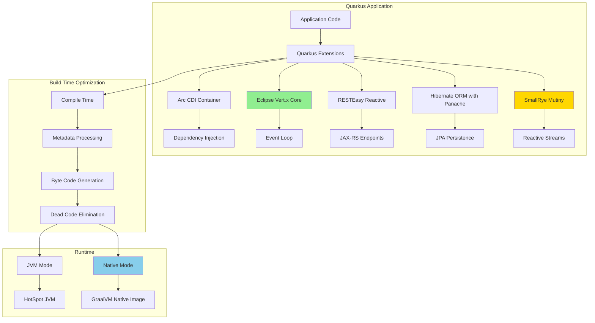
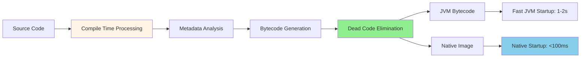
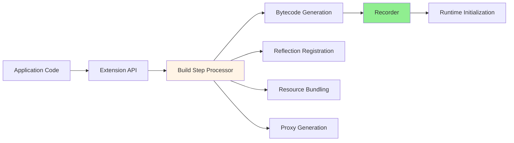
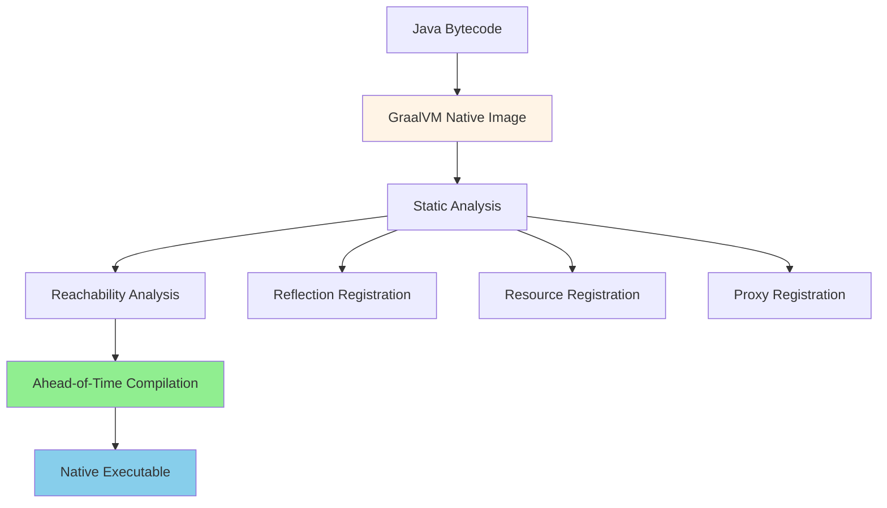

#java #quarkus #microservice #jakarta-ee #graalvm #native-compilation #cloud-native #kubernetes #reactive-programming #supersonic-subatomic
# Definition
- ==Quarkus== is a ==Kubernetes-native Java framework== tailored for GraalVM and OpenJDK HotSpot, crafted from best-of-breed Java libraries and standards. It provides ==supersonic subatomic== Java with extremely fast boot time, incredibly low memory footprint, and optimized for container and cloud deployments.
# Architecture


## Components
### Arc CDI Container
- **Compile-time dependency injection**: CDI beans resolved at build time
- **Zero reflection**: Bean metadata generated during compilation
- **Reduced startup time**: No runtime bean discovery or classpath scanning
- **Standards-based**: Implements Jakarta CDI specification subset
### Eclipse Vert.x
- **Event-driven**: Non-blocking I/O with event loop architecture
- **Multi-reactor pattern**: Event loop per CPU core for concurrency
- **High performance**: Minimal thread context switching overhead
- **Reactive core**: Foundation for Quarkus reactive stack
### SmallRye Mutiny
- **Reactive programming**: Event-driven, non-blocking stream processing
- **Two types**: `Uni<T>` (0 or 1 item), `Multi<T>` (0 to N items)
- **Intuitive API**: Designed for clarity and composability
- **Back-pressure support**: Handles flow control in reactive streams
### Hibernate ORM with Panache
- **Active Record pattern**: Simplified entity persistence
- **Repository pattern**: Type-safe repository support
- **Build-time enhancement**: Entity bytecode optimization
- **Native query support**: GraalVM-compatible query compilation
# Quarkus Philosophy
## Container-First Design

- Quarkus optimizes for ==container density== and ==fast startup== rather than traditional long-running application server metrics.
### Traditional JVM problem
- High memory overhead (hundreds of MB)
- Slow startup (30+ seconds)
- Runtime reflection and dynamic classloading
- Framework initialization at startup
### Quarkus solution
- Build-time metadata processing
- Ahead-of-time compilation
- Native image generation
- Static configuration
## Build-Time vs Runtime


### Build Time
- **Dependency injection resolution**: All CDI beans discovered and wired
- **Configuration parsing**: application.properties processed
- **Reflection registration**: GraalVM reflection hints generated
- **Resource bundling**: Static resources embedded
- **Proxy generation**: Dynamic proxies created as classes
### Runtime
- **Minimal initialization**: Pre-wired components, no scanning
- **Instant startup**: No framework bootstrapping
- **Low memory**: No metadata caching, minimal overhead
- **Predictable performance**: No warmup period needed
# Quarkus vs Spring Boot

| Aspect | Quarkus | Spring Boot |
|--------|---------|-------------|
| **Startup Time (JVM)** | 1-2 seconds | 3-10 seconds |
| **Startup Time (Native)** | 0.01-0.1 seconds | N/A (experimental) |
| **Memory (JVM)** | 50-100 MB | 150-300 MB |
| **Memory (Native)** | 12-30 MB | N/A |
| **DI Container** | Arc (CDI) | Spring IoC |
| **Build-time Optimization** | Extensive | Minimal |
| **Native Compilation** | First-class | Experimental (Spring Native) |
| **Reactive Support** | Native (Mutiny) | Reactive Spring (WebFlux) |
| **Standards** | Jakarta EE, MicroProfile | Spring proprietary |
| **Learning Curve** | Moderate (Jakarta EE) | Gentle (Spring ecosystem) |
| **Ecosystem Maturity** | Growing | Mature |
| **Cloud-Native** | Designed for | Adapted for |

## When to Choose Quarkus
- **Kubernetes/cloud deployments**: Native image perfect for pods
- **Serverless functions**: Fast startup critical for FaaS
- **Microservices**: Low memory footprint for high density
- **Edge computing**: Resource-constrained environments
- **Cost optimization**: Reduced memory = lower cloud costs
- **Jakarta EE familiarity**: Standards-based development
## When to Choose Spring Boot
- **Large existing ecosystem**: Mature libraries and integrations
- **Team expertise**: Spring-experienced developers
- **Complex enterprise apps**: Rich feature set and patterns
- **Gradual cloud adoption**: Traditional deployment to cloud migration
- **Extensive documentation**: Mature community resources
# Runtime Modes
## JVM Mode (Development)
```Shell
# Run in development mode with live reload
./mvnw quarkus:dev

# Or with Gradle
./gradlew quarkusDev
```
- Live reload on code changes
- Debug mode enabled by default (port 5005)
- Development services (DevServices) auto-configured
- Continuous testing support
- Hot deployment for rapid iteration
## JVM Mode (Production)
```Shell
# Package as uber-jar
./mvnw package -Dquarkus.package.type=uber-jar

# Run uber-jar
java -jar target/quarkus-app/quarkus-run.jar
```
- Fast startup (1-2 seconds)
- Standard JVM deployment
- JIT compilation for peak performance
- Debugging and profiling tools available
- Dynamic class loading possible
## Native Mode
```Shell
# Build native executable
./mvnw package -Dnative

# Or with container build
./mvnw package -Dnative -Dquarkus.native.container-build=true

# Run native executable
./target/myapp-1.0.0-runner
```
- Instant startup (10-100 milliseconds)
- Minimal memory footprint (12-30 MB)
- Ahead-of-time (AOT) compilation
- No JIT compiler overhead
- Closed world assumption (no dynamic loading)
- Reflection requires explicit registration
## Performance Comparison

# Extension Ecosystem
- Quarkus uses ==extensions== to integrate libraries and frameworks with build-time optimization.
## Core Extensions
### Web
- `quarkus-resteasy-reactive`: Reactive JAX-RS endpoints
- `quarkus-rest-client-reactive`: Reactive REST client
- `quarkus-websockets`: WebSocket support
- `quarkus-undertow`: Servlet container
### Data
- `quarkus-hibernate-orm-panache`: Simplified ORM
- `quarkus-hibernate-reactive-panache`: Reactive Hibernate
- `quarkus-mongodb-panache`: MongoDB with Panache
- `quarkus-redis-client`: Redis integration
### Messaging
- `quarkus-kafka`: Apache Kafka client
- `quarkus-reactive-messaging`: Reactive messaging
- `quarkus-amqp`: AMQP protocol support
### Security
- `quarkus-security`: Security framework
- `quarkus-oidc`: OpenID Connect integration
- `quarkus-jwt`: JWT authentication
- `quarkus-keycloak`: Keycloak integration
### Observability
- `quarkus-micrometer`: Metrics collection
- `quarkus-opentelemetry`: Distributed tracing
- `quarkus-health`: Health checks
- `quarkus-logging-json`: JSON logging
### Cloud
- `quarkus-kubernetes`: Kubernetes resource generation
- `quarkus-container-image-docker`: Docker image build
- `quarkus-funqy`: Serverless functions
- `quarkus-amazon-lambda`: AWS Lambda support
## Extension Architecture



# GraalVM Native Image
## Native Compilation Process



### Closed World Assumption
- GraalVM performs ==static analysis== to determine all reachable code at build time:
    - **All classes must be known**: No dynamic classloading
    - **Reflection must be registered**: `@RegisterForReflection`
    - **Resources must be included**: Explicit resource registration
    - **Proxies pre-generated**: No runtime proxy creation
### Build-Time Reflection Registration
```Java
import io.quarkus.runtime.annotations.RegisterForReflection;

@RegisterForReflection
public class User {
    private Long id;
    private String username;
    private String email;
    // Getters and setters accessible via reflection
}
```
## Native Image Trade-offs
### Advantages
- Instant startup (10-100ms)
- Minimal memory footprint
- No warmup time required
- Predictable performance
- Smaller container images
### Disadvantages
- Longer build times (2-5 minutes)
- No dynamic classloading
- Reflection requires registration
- Limited debugging capabilities
- Some libraries incompatible
# Configuration Management
## application.properties
```properties
# Server configuration
quarkus.http.port=8080
quarkus.http.host=0.0.0.0

# Database configuration
quarkus.datasource.db-kind=postgresql
quarkus.datasource.username=postgres
quarkus.datasource.password=secret
quarkus.datasource.jdbc.url=jdbc:postgresql://localhost:5432/mydb

# Hibernate configuration
quarkus.hibernate-orm.database.generation=drop-and-create
quarkus.hibernate-orm.log.sql=true

# Logging configuration
quarkus.log.level=INFO
quarkus.log.category."com.example".level=DEBUG
```
## Profiles
```properties
# Default (applies to all profiles)
quarkus.http.port=8080

# Development profile
%dev.quarkus.datasource.jdbc.url=jdbc:postgresql://localhost:5432/devdb
%dev.quarkus.hibernate-orm.database.generation=drop-and-create

# Production profile
%prod.quarkus.datasource.jdbc.url=jdbc:postgresql://prod-db:5432/proddb
%prod.quarkus.hibernate-orm.database.generation=validate

# Test profile
%test.quarkus.datasource.jdbc.url=jdbc:h2:mem:testdb
```
## Programmatic Configuration
```Java
import org.eclipse.microprofile.config.inject.ConfigProperty;

@ApplicationScoped
public class EmailService {

    @ConfigProperty(name = "email.from")
    String fromAddress;

    @ConfigProperty(name = "email.smtp.host")
    String smtpHost;

    @ConfigProperty(name = "email.smtp.port", defaultValue = "587")
    int smtpPort;

    public void sendEmail(String to, String subject, String body) {
        // Use configuration values
    }
}
```
## Project Structure
```tree title='Quarkus project structure'
quarkus-project/
│── src/
│   ├── main/
│   │   ├── java/com/example/
│   │   │   ├── Application.java
│   │   │   ├── resources/
│   │   │   │   ├── GreetingResource.java
│   │   │   │   ├── service/
│   │   │   │   │   ├── GreetingService.java
│   │   │   │   ├── repository/
│   │   │   │   │   ├── UserRepository.java
│   │   │   │   ├── entity/
│   │   │   │   │   ├── User.java
│   │   │   │   ├── dto/
│   │   │   │   │   ├── UserDTO.java
│   │   │   ├── grpc/
│   │   │   │   ├── UserGrpcService.java
│   │   ├── resources/
│   │   │   ├── application.properties
│   │   │   ├── import.sql
│   │   │   ├── META-INF/
│   │   │   │   ├── persistence.xml  (If using JPA)
│   │   ├── docker/
│   │   │   ├── Dockerfile.jvm
│   │   │   ├── Dockerfile.native
│   ├── test/
│   │   ├── java/com/example/
│   │   │   ├── GreetingResourceTest.java
│   │   │   ├── GreetingServiceTest.java
│── target/  (Generated build output)
│── pom.xml  (Maven)
│── build.gradle.kts (Gradle, if using Kotlin DSL)
│── gradlew / gradlew.bat  (Gradle wrapper)
│── mvnw / mvnw.cmd  (Maven wrapper)
│── README.md
│── .gitignore
│── .dockerignore
```
---
# References
1. https://quarkus.io/ - Official Quarkus website
2. https://quarkus.io/guides/ - Quarkus guides and documentation
3. https://quarkus.io/blog/tag/architecture/ - Quarkus architecture blog posts
4. https://www.graalvm.org/latest/reference-manual/native-image/ - GraalVM Native Image documentation
5. https://vertx.io/ - Eclipse Vert.x documentation
6. https://smallrye.io/smallrye-mutiny/ - SmallRye Mutiny reactive programming
7. https://jakarta.ee/specifications/cdi/ - Jakarta CDI specification
8. https://www.eclipse.org/community/eclipse_newsletter/2019/september/1.php - Quarkus: Supersonic Subatomic Java
9. Operating System Concepts - Abraham Silberschatz - 10th - 2018 - Pearson Publisher
   1. Chapter 3: Processes
      1. Section 3.4: Interprocess Communication
   2. Chapter 5: Process Synchronization
      1. Section 5.8: Event-based systems
10. [[software-engineering/software-architecture/design/design-pattern/enterprise-pattern/integration/Dependency injection pattern|Dependency Injection Pattern]]
11. [[programming/java/quarkus/Dependency Injection|Quarkus Dependency Injection]] for Quarkus CDI implementation
12. [[Reactive Programming|Quarkus Reactive Programming]] for Mutiny and reactive patterns
13. [[Persistence|Quarkus Persistence]] for Hibernate Panache
14. [[RESTful Services|Quarkus RESTful Services]] for JAX-RS endpoints
15. [[gRPC for Quarkus]] for gRPC microservices implementation
16. [[site-reliability-engineering/build-tools/java/java-runtime/java-distribution/GraalVM|GraalVM]]
17. 
