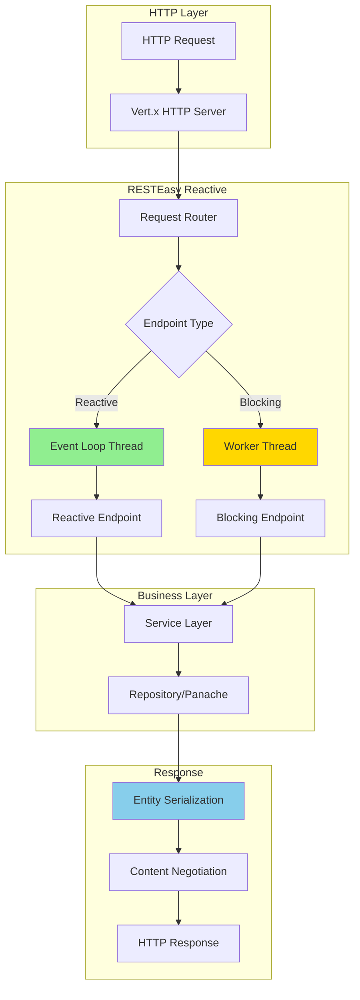

#java #quarkus #rest #jax-rs #resteasy-reactive #http #web-service #jakarta-ee #microservice #api-design #application-layer
# Definition
- ==RESTEasy Reactive== is Quarkus' implementation of ==Jakarta RESTful Web Services (JAX-RS)== built on top of Eclipse Vert.x, providing ==reactive, non-blocking HTTP endpoints== with minimal overhead. 
- It supports both traditional blocking and reactive programming models with complete annotation-based REST API development.
# Architecture



# Basic REST Endpoint

## Resource Class

```Java
import jakarta.ws.rs.*;
import jakarta.ws.rs.core.MediaType;
import jakarta.ws.rs.core.Response;

@Path("/api/users")
@Produces(MediaType.APPLICATION_JSON)
@Consumes(MediaType.APPLICATION_JSON)
public class UserResource {

    @GET
    public List<User> listAll() {
        return User.listAll();
    }

    @GET
    @Path("/{id}")
    public User getById(@PathParam("id") Long id) {
        User user = User.findById(id);
        if (user == null) {
            throw new NotFoundException("User not found");
        }
        return user;
    }

    @POST
    @Transactional
    public Response create(User user) {
        user.persist();
        return Response.created(URI.create("/api/users/" + user.id))
                       .entity(user)
                       .build();
    }

    @PUT
    @Path("/{id}")
    @Transactional
    public User update(@PathParam("id") Long id, User updatedUser) {
        User user = User.findById(id);
        if (user == null) {
            throw new NotFoundException("User not found");
        }
        user.username = updatedUser.username;
        user.email = updatedUser.email;
        return user;
    }

    @DELETE
    @Path("/{id}")
    @Transactional
    public Response delete(@PathParam("id") Long id) {
        boolean deleted = User.deleteById(id);
        return deleted ? Response.noContent().build()
                       : Response.status(404).build();
    }
}
```

## Reactive Endpoint

```Java
import io.smallrye.mutiny.Uni;
import io.smallrye.mutiny.Multi;

@Path("/api/users")
@Produces(MediaType.APPLICATION_JSON)
@Consumes(MediaType.APPLICATION_JSON)
public class UserResource {

    @Inject
    UserRepository repository;

    @GET
    public Multi<User> listAll() {
        return repository.streamAll();
    }

    @GET
    @Path("/{id}")
    public Uni<User> getById(@PathParam("id") Long id) {
        return repository.findById(id)
            .onItem().ifNull().failWith(
                new NotFoundException("User not found")
            );
    }

    @POST
    public Uni<Response> create(User user) {
        return Panache.withTransaction(() ->
            repository.persist(user)
        ).onItem().transform(saved ->
            Response.created(URI.create("/api/users/" + saved.id))
                    .entity(saved)
                    .build()
        );
    }

    @PUT
    @Path("/{id}")
    public Uni<User> update(@PathParam("id") Long id, User updatedUser) {
        return Panache.withTransaction(() ->
            repository.findById(id)
                .onItem().ifNull().failWith(new NotFoundException())
                .onItem().invoke(user -> {
                    user.username = updatedUser.username;
                    user.email = updatedUser.email;
                })
        );
    }

    @DELETE
    @Path("/{id}")
    public Uni<Response> delete(@PathParam("id") Long id) {
        return Panache.withTransaction(() ->
            repository.deleteById(id)
        ).onItem().transform(deleted ->
            deleted ? Response.noContent().build()
                    : Response.status(404).build()
        );
    }
}
```

See [[Reactive Programming]] for Mutiny details.

# HTTP Methods

## GET - Retrieve Resources

```Java
// List all
@GET
public List<User> list() {
    return User.listAll();
}

// Get by ID
@GET
@Path("/{id}")
public User getById(@PathParam("id") Long id) {
    return User.findById(id);
}

// Query parameters
@GET
@Path("/search")
public List<User> search(
    @QueryParam("username") String username,
    @QueryParam("email") String email,
    @DefaultValue("0") @QueryParam("page") int page,
    @DefaultValue("20") @QueryParam("size") int size
) {
    return User.find("username like ?1 and email like ?2",
                     "%" + username + "%",
                     "%" + email + "%")
               .page(Page.of(page, size))
               .list();
}

// Multiple path parameters
@GET
@Path("/{userId}/orders/{orderId}")
public Order getUserOrder(
    @PathParam("userId") Long userId,
    @PathParam("orderId") Long orderId
) {
    return Order.find("user.id = ?1 and id = ?2", userId, orderId)
                .firstResult();
}
```

## POST - Create Resources

```Java
@POST
@Transactional
public Response create(User user) {
    // Validate
    if (User.count("username", user.username) > 0) {
        throw new BadRequestException("Username already exists");
    }

    // Persist
    user.persist();

    // Return 201 Created with Location header
    return Response.created(URI.create("/api/users/" + user.id))
                   .entity(user)
                   .build();
}

// With validation
@POST
@Valid
@Transactional
public Response create(@Valid User user) {
    user.persist();
    return Response.created(URI.create("/api/users/" + user.id))
                   .entity(user)
                   .build();
}
```

## PUT - Update Resources

```Java
// Full update
@PUT
@Path("/{id}")
@Transactional
public User update(@PathParam("id") Long id, User updatedUser) {
    User user = User.findById(id);
    if (user == null) {
        throw new NotFoundException();
    }

    // Update all fields
    user.username = updatedUser.username;
    user.email = updatedUser.email;
    user.firstName = updatedUser.firstName;
    user.lastName = updatedUser.lastName;

    return user;
}

// Upsert pattern
@PUT
@Path("/{id}")
@Transactional
public Response upsert(@PathParam("id") Long id, User updatedUser) {
    User user = User.findById(id);

    if (user == null) {
        // Create new
        updatedUser.id = id;
        updatedUser.persist();
        return Response.created(URI.create("/api/users/" + id))
                       .entity(updatedUser)
                       .build();
    } else {
        // Update existing
        user.username = updatedUser.username;
        user.email = updatedUser.email;
        return Response.ok(user).build();
    }
}
```

## PATCH - Partial Update

```Java
import jakarta.json.JsonMergePatch;

@PATCH
@Path("/{id}")
@Consumes("application/merge-patch+json")
@Transactional
public User patch(@PathParam("id") Long id, JsonMergePatch patch) {
    User user = User.findById(id);
    if (user == null) {
        throw new NotFoundException();
    }

    // Apply JSON Merge Patch
    JsonValue userJson = Json.createObjectBuilder()
        .add("username", user.username)
        .add("email", user.email)
        .build();

    JsonValue patched = patch.apply(userJson);

    // Update entity
    user.username = patched.asJsonObject().getString("username");
    user.email = patched.asJsonObject().getString("email");

    return user;
}

// DTO-based partial update
@PATCH
@Path("/{id}")
@Transactional
public User patch(@PathParam("id") Long id, UserPatchDTO dto) {
    User user = User.findById(id);
    if (user == null) {
        throw new NotFoundException();
    }

    // Only update non-null fields
    if (dto.username != null) {
        user.username = dto.username;
    }
    if (dto.email != null) {
        user.email = dto.email;
    }

    return user;
}
```

## DELETE - Remove Resources

```Java
@DELETE
@Path("/{id}")
@Transactional
public Response delete(@PathParam("id") Long id) {
    boolean deleted = User.deleteById(id);
    return deleted ? Response.noContent().build()
                   : Response.status(404).build();
}

// Soft delete
@DELETE
@Path("/{id}")
@Transactional
public Response softDelete(@PathParam("id") Long id) {
    User user = User.findById(id);
    if (user == null) {
        return Response.status(404).build();
    }

    user.active = false;
    user.deletedAt = LocalDateTime.now();

    return Response.noContent().build();
}

// Bulk delete
@DELETE
@Transactional
public Response deleteMultiple(@QueryParam("ids") List<Long> ids) {
    long deleted = User.delete("id in ?1", ids);
    return Response.ok()
                   .entity(Map.of("deleted", deleted))
                   .build();
}
```

# Request Parameters

## Path Parameters

```Java
@GET
@Path("/{id}")
public User getById(@PathParam("id") Long id) {
    return User.findById(id);
}

// Multiple path parameters
@GET
@Path("/users/{userId}/orders/{orderId}")
public Order getOrder(
    @PathParam("userId") Long userId,
    @PathParam("orderId") Long orderId
) {
    return Order.find("user.id = ?1 and id = ?2", userId, orderId)
                .firstResult();
}

// Regular expression matching
@GET
@Path("/{code: [A-Z]{2}\\d{4}}")
public Product getByCode(@PathParam("code") String code) {
    return Product.find("code", code).firstResult();
}
```

## Query Parameters

```Java
@GET
public List<User> search(
    @QueryParam("q") String query,
    @QueryParam("active") @DefaultValue("true") boolean active,
    @QueryParam("page") @DefaultValue("0") int page,
    @QueryParam("size") @DefaultValue("20") int size,
    @QueryParam("sort") @DefaultValue("username") String sortField
) {
    return User.find(
        "username like ?1 and active = ?2",
        Sort.by(sortField).ascending(),
        "%" + query + "%",
        active
    )
    .page(Page.of(page, size))
    .list();
}

// List parameters
@GET
@Path("/by-ids")
public List<User> getByIds(@QueryParam("id") List<Long> ids) {
    return User.list("id in ?1", ids);
}
```

## Header Parameters

```Java
@GET
public Response getUsers(
    @HeaderParam("Authorization") String authHeader,
    @HeaderParam("Accept-Language") @DefaultValue("en") String language,
    @HeaderParam("User-Agent") String userAgent
) {
    // Process headers
    return Response.ok(users).build();
}
```

## Cookie Parameters

```Java
@GET
public Response getPreferences(
    @CookieParam("session") String sessionId,
    @CookieParam("theme") @DefaultValue("light") String theme
) {
    // Use cookie values
    return Response.ok().build();
}
```

## Form Parameters

```Java
@POST
@Path("/login")
@Consumes(MediaType.APPLICATION_FORM_URLENCODED)
public Response login(
    @FormParam("username") String username,
    @FormParam("password") String password
) {
    // Authenticate
    return Response.ok().build();
}
```

# Content Negotiation

## Media Types

```Java
@Path("/api/users")
public class UserResource {

    // JSON (default)
    @GET
    @Produces(MediaType.APPLICATION_JSON)
    public List<User> listJson() {
        return User.listAll();
    }

    // XML
    @GET
    @Produces(MediaType.APPLICATION_XML)
    public List<User> listXml() {
        return User.listAll();
    }

    // Plain text
    @GET
    @Produces(MediaType.TEXT_PLAIN)
    public String listText() {
        return User.listAll().stream()
            .map(u -> u.username)
            .collect(Collectors.joining("\n"));
    }

    // Multiple formats
    @GET
    @Produces({MediaType.APPLICATION_JSON, MediaType.APPLICATION_XML})
    public List<User> list() {
        return User.listAll();
    }
}
```

## Custom Serialization

```Java
import com.fasterxml.jackson.annotation.JsonFormat;
import com.fasterxml.jackson.annotation.JsonIgnore;
import com.fasterxml.jackson.annotation.JsonProperty;

@Entity
public class User extends PanacheEntity {

    public String username;

    @JsonIgnore // Don't serialize password
    public String password;

    @JsonProperty("email_address") // Custom field name
    public String email;

    @JsonFormat(pattern = "yyyy-MM-dd HH:mm:ss")
    public LocalDateTime createdAt;
}
```

## Content Type Consumption

```Java
@POST
@Consumes({MediaType.APPLICATION_JSON, MediaType.APPLICATION_XML})
@Transactional
public Response create(User user) {
    user.persist();
    return Response.created(URI.create("/api/users/" + user.id))
                   .entity(user)
                   .build();
}
```
# Response Building
## Response Status Codes
```Java
// 200 OK
@GET
public Response ok() {
    return Response.ok(user).build();
}

// 201 Created
@POST
@Transactional
public Response create(User user) {
    user.persist();
    return Response.created(URI.create("/api/users/" + user.id))
                   .entity(user)
                   .build();
}

// 204 No Content
@DELETE
@Path("/{id}")
@Transactional
public Response delete(@PathParam("id") Long id) {
    User.deleteById(id);
    return Response.noContent().build();
}

// 400 Bad Request
@POST
public Response validate(User user) {
    if (user.username == null) {
        return Response.status(400)
                       .entity(Map.of("error", "Username required"))
                       .build();
    }
    return Response.ok().build();
}

// 404 Not Found
@GET
@Path("/{id}")
public Response getById(@PathParam("id") Long id) {
    User user = User.findById(id);
    if (user == null) {
        return Response.status(404)
                       .entity(Map.of("error", "User not found"))
                       .build();
    }
    return Response.ok(user).build();
}

// Custom status
return Response.status(418) // I'm a teapot
               .entity("Short and stout")
               .build();
```

## Response Headers

```Java
@GET
@Path("/{id}")
public Response getWithHeaders(@PathParam("id") Long id) {
    User user = User.findById(id);

    return Response.ok(user)
        .header("X-Total-Count", User.count())
        .header("Cache-Control", "max-age=3600")
        .header("ETag", generateETag(user))
        .build();
}

// Cookies
@GET
public Response setPreferences() {
    NewCookie cookie = new NewCookie.Builder("theme")
        .value("dark")
        .path("/")
        .maxAge(86400)
        .httpOnly(true)
        .secure(true)
        .build();

    return Response.ok().cookie(cookie).build();
}
```

# Validation

## Bean Validation

```Java
import jakarta.validation.constraints.*;

@Entity
public class User extends PanacheEntity {

    @NotBlank(message = "Username is required")
    @Size(min = 3, max = 50, message = "Username must be between 3 and 50 characters")
    public String username;

    @NotBlank(message = "Email is required")
    @Email(message = "Email must be valid")
    public String email;

    @Min(value = 18, message = "Must be at least 18 years old")
    @Max(value = 120, message = "Age must be less than 120")
    public Integer age;

    @Pattern(regexp = "^\\+?[1-9]\\d{1,14}$", message = "Invalid phone number")
    public String phoneNumber;
}
```

## Endpoint Validation

```Java
import jakarta.validation.Valid;

@POST
@Transactional
public Response create(@Valid User user) {
    // If validation fails, 400 Bad Request is automatically returned
    user.persist();
    return Response.created(URI.create("/api/users/" + user.id))
                   .entity(user)
                   .build();
}

// Manual validation
@Inject
Validator validator;

@POST
public Response createWithManualValidation(User user) {
    Set<ConstraintViolation<User>> violations = validator.validate(user);

    if (!violations.isEmpty()) {
        Map<String, String> errors = violations.stream()
            .collect(Collectors.toMap(
                v -> v.getPropertyPath().toString(),
                v -> v.getMessage()
            ));

        return Response.status(400)
                       .entity(Map.of("errors", errors))
                       .build();
    }

    user.persist();
    return Response.created(URI.create("/api/users/" + user.id))
                   .entity(user)
                   .build();
}
```

# Exception Handling

## Exception Mappers

```Java
import jakarta.ws.rs.ext.ExceptionMapper;
import jakarta.ws.rs.ext.Provider;
import jakarta.ws.rs.core.Response;

@Provider
public class NotFoundExceptionMapper implements ExceptionMapper<NotFoundException> {

    @Override
    public Response toResponse(NotFoundException exception) {
        ErrorResponse error = new ErrorResponse(
            404,
            "Not Found",
            exception.getMessage(),
            LocalDateTime.now()
        );

        return Response.status(404)
                       .entity(error)
                       .build();
    }
}

@Provider
public class ValidationExceptionMapper implements ExceptionMapper<ConstraintViolationException> {

    @Override
    public Response toResponse(ConstraintViolationException exception) {
        Map<String, String> errors = exception.getConstraintViolations()
            .stream()
            .collect(Collectors.toMap(
                v -> v.getPropertyPath().toString(),
                ConstraintViolation::getMessage
            ));

        return Response.status(400)
                       .entity(Map.of("errors", errors))
                       .build();
    }
}
```

## Custom Exceptions

```Java
public class ResourceNotFoundException extends RuntimeException {
    public ResourceNotFoundException(String message) {
        super(message);
    }
}

@Provider
public class ResourceNotFoundExceptionMapper implements ExceptionMapper<ResourceNotFoundException> {

    @Override
    public Response toResponse(ResourceNotFoundException exception) {
        return Response.status(404)
                       .entity(Map.of(
                           "error", "Resource not found",
                           "message", exception.getMessage()
                       ))
                       .build();
    }
}
```

# File Upload and Download

## File Upload

```Java
import org.jboss.resteasy.reactive.multipart.FileUpload;

@POST
@Path("/upload")
@Consumes(MediaType.MULTIPART_FORM_DATA)
public Response upload(@MultipartForm FileUploadForm form) {
    // Save file
    Path uploadPath = Paths.get("uploads", form.file.fileName());
    Files.copy(form.file.uploadedFile(), uploadPath,
               StandardCopyOption.REPLACE_EXISTING);

    return Response.ok(Map.of(
        "filename", form.file.fileName(),
        "size", form.file.size()
    )).build();
}

public static class FileUploadForm {
    @FormParam("file")
    public FileUpload file;

    @FormParam("description")
    public String description;
}
```

## File Download

```Java
@GET
@Path("/download/{filename}")
@Produces(MediaType.APPLICATION_OCTET_STREAM)
public Response download(@PathParam("filename") String filename) {
    File file = new File("uploads/" + filename);

    if (!file.exists()) {
        throw new NotFoundException();
    }

    return Response.ok(file)
        .header("Content-Disposition",
                "attachment; filename=\"" + filename + "\"")
        .build();
}

// Stream large files
@GET
@Path("/stream/{filename}")
public Response streamFile(@PathParam("filename") String filename) throws IOException {
    Path path = Paths.get("uploads", filename);

    if (!Files.exists(path)) {
        throw new NotFoundException();
    }

    StreamingOutput stream = output -> {
        try (InputStream input = Files.newInputStream(path)) {
            byte[] buffer = new byte[8192];
            int bytesRead;
            while ((bytesRead = input.read(buffer)) != -1) {
                output.write(buffer, 0, bytesRead);
            }
        }
    };

    return Response.ok(stream)
        .header("Content-Disposition", "attachment; filename=\"" + filename + "\"")
        .build();
}
```

# CORS Configuration

```properties
# application.properties
quarkus.http.cors=true
quarkus.http.cors.origins=http://localhost:3000,https://example.com
quarkus.http.cors.methods=GET,POST,PUT,DELETE,OPTIONS
quarkus.http.cors.headers=Content-Type,Authorization
quarkus.http.cors.exposed-headers=Location
quarkus.http.cors.access-control-max-age=24H
quarkus.http.cors.access-control-allow-credentials=true
```

# OpenAPI Documentation

```Java
import org.eclipse.microprofile.openapi.annotations.Operation;
import org.eclipse.microprofile.openapi.annotations.parameters.Parameter;
import org.eclipse.microprofile.openapi.annotations.responses.APIResponse;
import org.eclipse.microprofile.openapi.annotations.tags.Tag;

@Path("/api/users")
@Tag(name = "User Management", description = "Operations for managing users")
public class UserResource {

    @GET
    @Operation(summary = "List all users", description = "Retrieve all users from the database")
    @APIResponse(responseCode = "200", description = "Success")
    public List<User> listAll() {
        return User.listAll();
    }

    @GET
    @Path("/{id}")
    @Operation(summary = "Get user by ID")
    @APIResponse(responseCode = "200", description = "User found")
    @APIResponse(responseCode = "404", description = "User not found")
    public User getById(
        @Parameter(description = "User ID", required = true)
        @PathParam("id") Long id
    ) {
        return User.findById(id);
    }

    @POST
    @Operation(summary = "Create new user")
    @APIResponse(responseCode = "201", description = "User created")
    @APIResponse(responseCode = "400", description = "Invalid input")
    @Transactional
    public Response create(User user) {
        user.persist();
        return Response.created(URI.create("/api/users/" + user.id))
                       .entity(user)
                       .build();
    }
}
```

Access OpenAPI UI at: http://localhost:8080/q/swagger-ui

# Links to Protocols

## HTTP Protocol

JAX-RS implements [[computer-network/application-layer/protocols/HTTP|HTTP]] application layer protocol:

- Request methods: GET, POST, PUT, DELETE, PATCH
- Status codes: 2xx Success, 3xx Redirection, 4xx Client Error, 5xx Server Error
- Headers: Content-Type, Accept, Authorization, Cache-Control
- Content negotiation: Media types and charsets

## REST Architectural Style

REST (Representational State Transfer) principles:

- **Stateless**: No client context stored on server
- **Cacheable**: Responses must define cacheability
- **Uniform interface**: Standard HTTP methods
- **Client-server**: Separation of concerns
- **Layered system**: Intermediary servers transparent

# Best Practices

## Use Appropriate HTTP Methods

```Java
// Good: Semantic HTTP methods
@GET // Read-only, idempotent
@POST // Create, non-idempotent
@PUT // Full update, idempotent
@PATCH // Partial update
@DELETE // Remove, idempotent

// Bad: Using POST for everything
@POST
@Path("/get-user")
public User getUser(Long id) { }
```

## Return Proper Status Codes

```Java
// Good
@POST
public Response create(User user) {
    user.persist();
    return Response.created(URI.create("/users/" + user.id))
                   .entity(user)
                   .build(); // 201 Created
}

// Bad
@POST
public User create(User user) {
    user.persist();
    return user; // Returns 200 OK instead of 201
}
```

## Use DTOs for API Contracts

```Java
// Good: Separate DTO from entity
public record UserDTO(
    Long id,
    String username,
    String email
) {}

@GET
public List<UserDTO> list() {
    return User.listAll().stream()
        .map(u -> new UserDTO(u.id, u.username, u.email))
        .toList();
}

// Bad: Expose entity directly
@GET
public List<User> list() {
    return User.listAll(); // Exposes all fields, security risk
}
```

## Validate Input

```Java
// Good: Explicit validation
@POST
public Response create(@Valid UserDTO dto) {
    // Validated automatically
}

// Bad: No validation
@POST
public Response create(UserDTO dto) {
    // No validation, potential SQL injection or invalid data
}
```

---
# References
1. https://quarkus.io/guides/resteasy-reactive - RESTEasy Reactive guide
2. https://jakarta.ee/specifications/restful-ws/3.1/ - Jakarta RESTful Web Services specification
3. https://quarkus.io/guides/rest-json - REST JSON guide
4. https://quarkus.io/guides/validation - Validation guide
5. https://quarkus.io/guides/openapi-swaggerui - OpenAPI and Swagger UI
6. https://www.ietf.org/rfc/rfc2616.txt - HTTP/1.1 specification
7. https://www.ietf.org/rfc/rfc7231.txt - HTTP Semantics
8. [[Reactive Programming]] for reactive endpoints with Mutiny
9. [[Persistence]] for database integration
10. [[programming/java/quarkus/Dependency Injection]] for service injection
11. [[gRPC for Quarkus]] for RPC alternative to REST
12. [[computer-network/application-layer/http/Hyper Text Transfer Protocol (HTTP)|Hyper Text Transfer Protocol (HTTP)]]
13. [[computer-network/application-layer/web-socket/Web Socket|Web Socket]]
14. 
