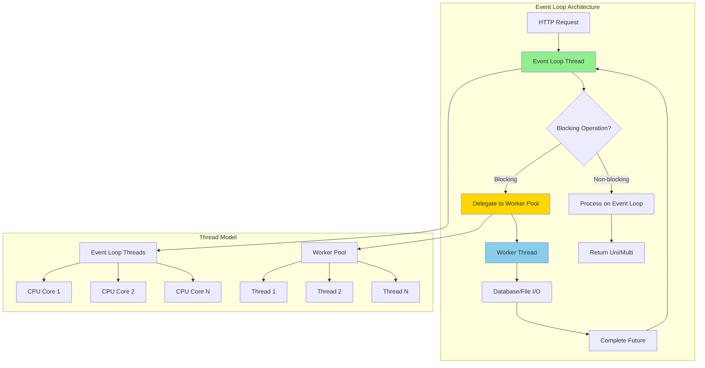
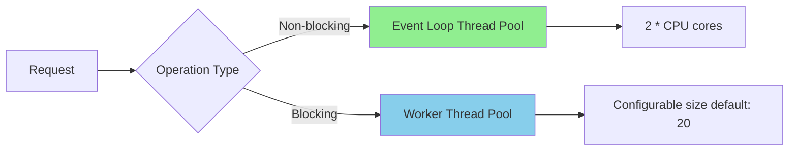
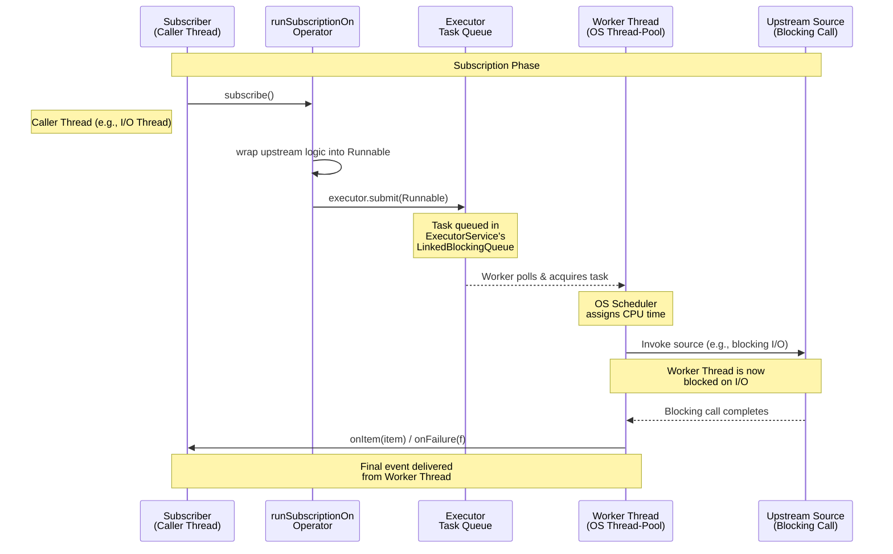
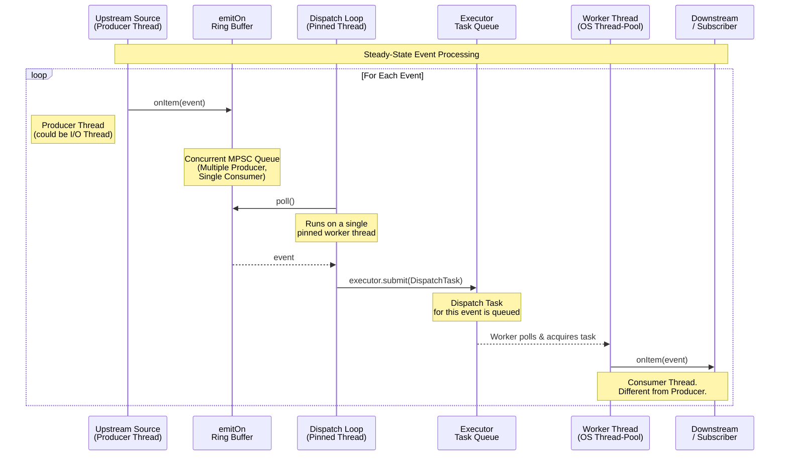

#java #quarkus #reactive-programming   #concurrency-control #operating-system #asynchronous-programming #event-driven-programming #web-server 
# Definition
- ==Reactive programming== in Quarkus uses SmallRye Mutiny, a reactive programming library designed for building asynchronous, non-blocking applications. 
- Mutiny provides `Uni<T>`for 0-or-1 items and `Multi<T>` for 0-to-N items, with an intuitive API that emphasizes code readability and event-driven architecture.
# Thread
- The two following terminologies are specified by Quarkus official documentation and may cause confusion.
## I/O thread
- Runs non-blocking reactive event loops and never blocks according to Quarkus documentation. 
    - In Request-per-Thread model, the I/O thread is the main causes for the blocking of execution. The reactive programming architecture of Quarkus, however, turn its into non-blocking.
- Provided by the underlying reactive engine (Vert.x, Netty).
- The default number of I/O is $2 \times \text{number of CPU cores}$.
## Worker thread
- Executes blocking or CPU-intensive tasks offloaded from I/O threads.
# Reactive Architecture

## Eclipse Vert.x Event Loop
- Quarkus reactive stack is built on ==Eclipse Vert.x==, which implements ==multi-reactor pattern==:
### Event Loop Model
```Java title='Event loop with Eclipse Vert.x'
// Event loop thread - non-blocking operations
public Uni<User> getUserById(Long id) {
    return userRepository.findById(id) // Database query on worker thread
        .onItem().transform(user -> {
            // Transform on event loop thread
            return user;
        });
}
```
- The I/O task is delegated to worker thread which is performed at system level and does not block the main thread.
### Thread Pools



```properties title='Quarkus Vertx configuration'
# application.properties
quarkus.vertx.event-loops-pool-size=8 # Event loop threads
quarkus.vertx.worker-pool-size=20     # Worker threads
quarkus.vertx.max-event-loop-execute-time=2s # Warning threshold
```
# `Uni<T>` - Single Item Publisher
- `Uni<T>`represents asynchronous action producing 0 or 1 item.
## Creating Uni
```Java
import io.smallrye.mutiny.Uni;

public class UserService {

    // From item
    public Uni<String> getGreeting() {
        return Uni.createFrom().item("Hello, World!");
    }

    // From supplier (lazy evaluation)
    public Uni<User> getUserLazy(Long id) {
        return Uni.createFrom().item(() -> {
            // Executed when subscribed
            return userRepository.findById(id);
        });
    }

    // From CompletionStage
    public Uni<String> fromFuture(CompletableFuture<String> future) {
        return Uni.createFrom().completionStage(future);
    }

    // Failed Uni
    public Uni<User> notFound() {
        return Uni.createFrom().failure(
            new EntityNotFoundException("User not found")
        );
    }

    // Null item (completes with null)
    public Uni<User> nullResult() {
        return Uni.createFrom().nullItem();
    }
}
```
## Transforming Uni
### `onItem().transform()`
```Java
public Uni<UserDTO> getUserDTO(Long id) {
    return userRepository.findById(id)
        .onItem().transform(user -> {
            // Synchronous transformation
            return new UserDTO(user.getId(), user.getName());
        });
}
```
### `onItem().transformToUni()`
- Chain asynchronous operations (`flatMap`).
```Java
public Uni<OrderDTO> getOrderWithCustomer(Long orderId) {
    return orderRepository.findById(orderId)
        .onItem().transformToUni(order -> {
            // Asynchronous transformation - returns Uni
            return customerRepository.findById(order.getCustomerId())
                .onItem().transform(customer ->
                    new OrderDTO(order, customer)
                );
        });
}
```
### `onItem().transformToMulti()`
- Convert Uni to Multi.
```Java
public Multi<Product> getProductsByCategory(String category) {
    return categoryRepository.findByName(category)
        .onItem().transformToMulti(cat ->
            Multi.createFrom().iterable(cat.getProducts())
        );
}
```
## Handling Failures
### `onFailure().recoverWithItem()`
```Java
public Uni<User> getUserWithFallback(Long id) {
    return userRepository.findById(id)
        .onFailure().recoverWithItem(throwable -> {
            // Return default user on failure
            return User.getDefaultUser();
        });
}
```
### `onFailure().retry()`
```Java
public Uni<Response> callExternalAPI(String url) {
    return webClient.get(url)
        .onFailure().retry()
            .atMost(3)                    // Max 3 retries
            .withBackOff(Duration.ofSeconds(1)) // Exponential backoff
        .onFailure().recoverWithItem(
            new Response("Service unavailable", 503)
        );
}
```
### `onFailure().transform()`
```Java
public Uni<User> getUserOrThrow(Long id) {
    return userRepository.findById(id)
        .onFailure(NoResultException.class).transform(e ->
            new EntityNotFoundException("User with id " + id + " not found")
        );
}
```
## Combining Multiple Unis
### `Uni.combine()`
```Java
public Uni<OrderSummary> getOrderSummary(Long orderId) {
    Uni<Order> orderUni = orderRepository.findById(orderId);
    Uni<Customer> customerUni = customerRepository.findById(customerId);
    Uni<List<Item>> itemsUni = itemRepository.findByOrder(orderId);

    return Uni.combine().all()
        .unis(orderUni, customerUni, itemsUni)
        .asTuple()
        .onItem().transform(tuple -> {
            Order order = tuple.getItem1();
            Customer customer = tuple.getItem2();
            List<Item> items = tuple.getItem3();
            return new OrderSummary(order, customer, items);
        });
}
```
### `Uni.join()`
```Java
public Uni<DashboardData> getDashboard() {
    return Uni.join().all(
        userRepository.count(),
        orderRepository.count(),
        productRepository.count()
    ).andCollectFailures()
     .onItem().transform(tuple ->
         new DashboardData(
             tuple.getItem1(),
             tuple.getItem2(),
             tuple.getItem3()
         )
     );
}
```

# `Multi<T>` - Multiple Item Publisher
- `Multi<T>` represents asynchronous stream producing 0 to N items.
## Creating Multi
```Java
import io.smallrye.mutiny.Multi;

// From iterable
Multi<String> fromList = Multi.createFrom()
    .iterable(List.of("A", "B", "C"));

// From items
Multi<Integer> fromItems = Multi.createFrom()
    .items(1, 2, 3, 4, 5);

// From range
Multi<Integer> range = Multi.createFrom()
    .range(1, 100); // 1 to 99

// From ticks (periodic)
Multi<Long> ticks = Multi.createFrom()
    .ticks().every(Duration.ofSeconds(1));

// From Uni
Multi<User> fromUni = userRepository.findById(1L)
    .toMulti();
```
## Transforming Multi
### `map()`
```Java
public Multi<UserDTO> getAllUsersDTO() {
    return userRepository.listAll()
        .onItem().transform(user ->
            new UserDTO(user.getId(), user.getName())
        );
}
```
### `flatMap()`
```Java
public Multi<Order> getOrdersByUserIds(List<Long> userIds) {
    return Multi.createFrom().iterable(userIds)
        .onItem().transformToMultiAndMerge(userId ->
            orderRepository.findByUserId(userId)
        );
}
```
### `filter()`
```Java
public Multi<Product> getActiveProducts() {
    return productRepository.listAll()
        .filter(product -> product.isActive())
        .filter(product -> product.getStock() > 0);
}
```
## Collecting Multi
### `collect()`
```Java
public Uni<List<User>> getAllUsersList() {
    return userRepository.streamAll()
        .collect().asList();
}

public Uni<Set<String>> getUniqueEmails() {
    return userRepository.streamAll()
        .map(User::getEmail)
        .collect().asSet();
}

public Uni<Map<Long, User>> getUserMap() {
    return userRepository.streamAll()
        .collect().asMap(User::getId);
}
```
### `reduce()`
```Java
public Uni<BigDecimal> getTotalRevenue() {
    return orderRepository.streamAll()
        .map(Order::getTotal)
        .collect().with(Collectors.reducing(
            BigDecimal.ZERO,
            BigDecimal::add
        ));
}
```
## Back-Pressure
- Multi supports back-pressure to prevent overwhelming consumers.
```Java
public Multi<Data> processWithBackPressure() {
    return dataSource.stream()
        .onOverflow().buffer(100)      // Buffer up to 100 items
        .onOverflow().drop()           // Drop oldest items
        .onItem().transform(this::process);
}
```
- `buffer(size)`: Buffer items up to size
- `drop()`: Drop items when buffer full
- `invoke()`: Custom handling
# Thread orchestrations
### `runSubscriptionOn()`
- - `runSubscriptionOn()` determines <mark class="hltr-yellow">which thread will run the source</mark>. It is one producer - one producer context.
#### Single delegation
- The entire responsibility for the upstream source is transferred to the executor's queue.
#### Worker thread is blocked
- The worker thread is blocked by I/O on the call to the Upstream Source.
#### End-to-end thread
- All events flow from the same worker thread.
- The thread context for the entire chain from source to final subscriber is switched *only once.*
```Java title='runSubscriptionOn() example' hl=4,11
import io.smallrye.mutiny.infrastructure.Infrastructure;

public Uni<User> createUser(UserDTO dto) {
    return Uni.createFrom().item(() -> {
            // Blocking database operation
            User user = new User(dto.getName(), dto.getEmail());
            entityManager.persist(user);
            return user;
        })
        // Execute on worker thread, not event loop
        .runSubscriptionOn(Infrastructure.getDefaultWorkerPool());
}
```


### `emitOn()`
- `emitOn()` determines which thread will receive the events but does not guarantee the same worker thread handles all events from the same stream. It is a <mark class="hltr-yellow">multiple producer - one consumer </mark>context.
```Java title='emitOn() example'
public Uni<String> processData() {
    return Uni.createFrom().item("data")
        .emitOn(Infrastructure.getDefaultWorkerPool())
        .onItem().transform(data -> {
            // Execute on worker thread
            return heavyComputation(data);
        });
}

Multi<String> multi = Multi.createFrom().items("john", "jack", "sue")
        .emitOn(Infrastructure.getDefaultWorkerPool())
        .onItem().transform(this::invokeRemoteServiceUsingBlockingIO);
```
#### Dual loop
- The upstream source can asynchronously produce items and push them into the Ring Buffer, which is *producer loop*.
- The independent dispatch loop polls the buffer and schedules dispatch tasks, which is *consumer loop*.
- These two loops run concurrently.
#### Two queues, two transfers
- Events move from the upstream source to ring buffer, which is the first transfer.
- The dispatch loop creates a `DispatchTask` per event and submits it to the executor queue, which is the second transfer. This mechanism incurs scheduling overhead but allows load distribution.
#### Arbitrary worker thread
- The final `onItem(event)` call happens on an arbitrary worker thread from the pool. It is not the same as the producer thread, and it can be a different thread for each subsequent event.


# Reactive REST Endpoints
## GET Request
```Java
import jakarta.ws.rs.GET;
import jakarta.ws.rs.Path;
import jakarta.ws.rs.PathParam;
import io.smallrye.mutiny.Uni;

@Path("/users")
public class UserResource {

    @Inject
    UserRepository repository;

    @GET
    public Multi<User> list() {
        return repository.streamAll();
    }

    @GET
    @Path("/{id}")
    public Uni<User> getById(@PathParam("id") Long id) {
        return repository.findById(id)
            .onItem().ifNull().failWith(
                new NotFoundException("User not found")
            );
    }
}
```
## POST Request
```Java
import jakarta.ws.rs.POST;
import jakarta.transaction.Transactional;

@POST
@Transactional
public Uni<Response> create(UserDTO dto) {
    return Uni.createFrom().item(() -> {
            User user = new User(dto.getName(), dto.getEmail());
            repository.persist(user);
            return user;
        })
        .runSubscriptionOn(Infrastructure.getDefaultWorkerPool())
        .onItem().transform(user ->
            Response.created(URI.create("/users/" + user.getId()))
                    .entity(user)
                    .build()
        );
}
```

## PUT Request

```Java
import jakarta.ws.rs.PUT;

@PUT
@Path("/{id}")
@Transactional
public Uni<User> update(@PathParam("id") Long id, UserDTO dto) {
    return repository.findById(id)
        .onItem().ifNull().failWith(
            new NotFoundException("User not found")
        )
        .onItem().transformToUni(user -> {
            user.setName(dto.getName());
            user.setEmail(dto.getEmail());
            return repository.persist(user);
        })
        .runSubscriptionOn(Infrastructure.getDefaultWorkerPool());
}
```
## DELETE Request
```Java
import jakarta.ws.rs.DELETE;

@DELETE
@Path("/{id}")
@Transactional
public Uni<Response> delete(@PathParam("id") Long id) {
    return repository.deleteById(id)
        .runSubscriptionOn(Infrastructure.getDefaultWorkerPool())
        .onItem().transform(deleted ->
            deleted ? Response.noContent().build()
                    : Response.status(404).build()
        );
}
```
# Reactive REST Client
```Java
import org.eclipse.microprofile.rest.client.inject.RegisterRestClient;
import jakarta.ws.rs.GET;
import jakarta.ws.rs.Path;

@Path("/api")
@RegisterRestClient(configKey = "external-api")
public interface ExternalApiClient {

    @GET
    @Path("/users/{id}")
    Uni<UserDTO> getUserById(@PathParam("id") Long id);

    @GET
    @Path("/users")
    Multi<UserDTO> getAllUsers();
}
```

```properties
# application.properties
quarkus.rest-client.external-api.url=https://api.example.com
quarkus.rest-client.external-api.scope=jakarta.inject.Singleton
```

```Java
@Inject
@RestClient
ExternalApiClient externalApi;

public Uni<UserDTO> fetchExternalUser(Long id) {
    return externalApi.getUserById(id)
        .onFailure().retry().atMost(3)
        .onFailure().recoverWithItem(
            new UserDTO(null, "Unknown User")
        );
}
```
# Reactive Database Access
## Hibernate Reactive
```Java
import io.quarkus.hibernate.reactive.panache.PanacheRepository;
import jakarta.enterprise.context.ApplicationScoped;

@ApplicationScoped
public class UserRepository implements PanacheRepository<User> {

    public Uni<List<User>> findByEmail(String email) {
        return list("email", email);
    }

    public Uni<User> findByIdOrFail(Long id) {
        return findById(id)
            .onItem().ifNull().failWith(
                new EntityNotFoundException("User not found")
            );
    }

    public Multi<User> streamActive() {
        return stream("active", true);
    }
}
```
## Reactive Transactions
```Java
import io.quarkus.hibernate.reactive.panache.Panache;

public Uni<User> createUserWithRoles(UserDTO dto) {
    return Panache.withTransaction(() -> {
        User user = new User(dto.getName(), dto.getEmail());
        return persist(user)
            .onItem().transformToUni(savedUser -> {
                List<Role> roles = dto.getRoles().stream()
                    .map(Role::new)
                    .toList();
                return Panache.persist(roles)
                    .onItem().transform(v -> savedUser);
            });
    });
}
```
# Event-driven Messaging
## Kafka Producer
```Java
import org.eclipse.microprofile.reactive.messaging.Channel;
import org.eclipse.microprofile.reactive.messaging.Emitter;

@ApplicationScoped
public class OrderService {

    @Channel("orders")
    Emitter<Order> orderEmitter;

    public Uni<Order> createOrder(OrderDTO dto) {
        return Uni.createFrom().item(() -> {
            Order order = new Order(dto);
            orderRepository.persist(order);
            return order;
        })
        .runSubscriptionOn(Infrastructure.getDefaultWorkerPool())
        .onItem().invoke(order -> {
            // Emit event
            orderEmitter.send(order);
        });
    }
}
```
## Kafka Consumer
```Java
import org.eclipse.microprofile.reactive.messaging.Incoming;
import io.smallrye.reactive.messaging.annotations.Blocking;

@ApplicationScoped
public class OrderProcessor {

    @Incoming("orders")
    @Blocking // Execute on worker thread
    public void process(Order order) {
        // Process order
        System.out.println("Processing order: " + order.getId());
    }

    @Incoming("orders-reactive")
    public Uni<Void> processReactive(Order order) {
        return Uni.createFrom().item(() -> {
            // Non-blocking processing
            return null;
        });
    }
}
```

```properties
# application.properties
mp.messaging.outgoing.orders.connector=smallrye-kafka
mp.messaging.outgoing.orders.topic=orders
mp.messaging.outgoing.orders.value.serializer=io.quarkus.kafka.client.serialization.ObjectMapperSerializer

mp.messaging.incoming.orders.connector=smallrye-kafka
mp.messaging.incoming.orders.topic=orders
mp.messaging.incoming.orders.value.deserializer=io.quarkus.kafka.client.serialization.ObjectMapperDeserializer
```
# Context Propagation
- Maintain context across thread boundaries.
```Java
import io.quarkus.arc.ManagedContext;
import io.quarkus.arc.Arc;

public Uni<User> getUserWithContext(Long id) {
    ManagedContext requestContext = Arc.container()
        .requestContext();

    return userRepository.findById(id)
        .emitOn(Infrastructure.getDefaultWorkerPool())
        .onItem().invoke(() -> {
            // Activate request context on worker thread
            requestContext.activate();
        })
        .onItem().transform(user -> {
            // Process with context
            return user;
        })
        .eventually(() -> {
            // Deactivate context
            requestContext.deactivate();
        });
}
```
# Performance Patterns
## Parallel Processing

```Java
public Uni<List<UserStats>> calculateStatsParallel(List<Long> userIds) {
    List<Uni<UserStats>> unis = userIds.stream()
        .map(this::calculateUserStats)
        .toList();

    return Uni.combine().all().unis(unis)
        .collectFailures()
        .combinedWith(results -> (List<UserStats>) results);
}
```
## Caching
```Java
import io.quarkus.cache.CacheResult;

@CacheResult(cacheName = "user-cache")
public Uni<User> getCachedUser(Long id) {
    return userRepository.findById(id);
}
```
## Timeout
```Java
public Uni<Response> callWithTimeout(String url) {
    return webClient.get(url)
        .ifNoItem().after(Duration.ofSeconds(5))
        .fail()
        .onFailure(TimeoutException.class).recoverWithItem(
            new Response("Timeout", 504)
        );
}
```
# Best Practices
## Never Block Event Loop
```Java
// Bad: Blocking on event loop
@GET
public Uni<User> getUser(Long id) {
    return Uni.createFrom().item(() -> {
        // Blocking database call on event loop!
        return entityManager.find(User.class, id);
    });
}

// Good: Delegate to worker pool
@GET
public Uni<User> getUser(Long id) {
    return Uni.createFrom().item(() -> {
        return entityManager.find(User.class, id);
    }).runSubscriptionOn(Infrastructure.getDefaultWorkerPool());
}
```
## Handle Failures Explicitly
```Java
// Good: Explicit failure handling
public Uni<User> getUser(Long id) {
    return userRepository.findById(id)
        .onItem().ifNull().failWith(
            new NotFoundException("User not found")
        )
        .onFailure().retry().atMost(3)
        .onFailure().recoverWithItem(User.getDefault());
}
```
## Use Appropriate Types
```Java
// Single item: Use Uni
public Uni<User> getUser(Long id);

// Multiple items: Use Multi
public Multi<User> listUsers();

// No return value: Use Uni<Void>
public Uni<Void> deleteUser(Long id);
```
---
# References
1. https://smallrye.io/smallrye-mutiny/ - SmallRye Mutiny documentation
2. https://quarkus.io/guides/mutiny-primer - Quarkus Mutiny primer
3. https://vertx.io/docs/vertx-core/java/ - Eclipse Vert.x core documentation
4. https://www.reactive-streams.org/ - Reactive Streams specification
5. https://quarkus.io/guides/reactive-sql-clients - Reactive SQL clients
6. https://quarkus.io/guides/kafka - Kafka reactive messaging
7. Operating System Concepts - Abraham Silberschatz - 10th - 2018 - Pearson Publisher
   1. Chapter 5: Process Synchronization
      1. Section 5.8: Event-based Systems
   2. Chapter 13: I/O Systems
      1. Section 13.2: I/O Hardware
      2. Section 13.4: I/O Scheduling
3. [[operating-system/concepts/Processes|Processes]] for process scheduling and management
4. [[programming/java/quarkus/Quarkus]] for Quarkus architecture overview
5. [[Dependency Injection]] for Arc CDI integration with reactive code
6. [[gRPC for Quarkus]] for reactive gRPC implementation
