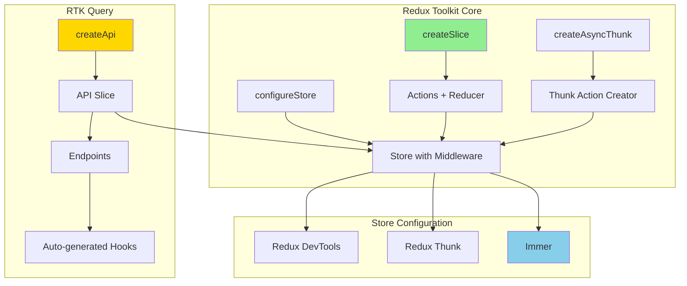
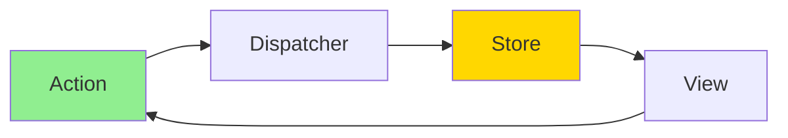

#javascript #react #redux #redux-toolkit #state-management #immer #rtk-query #typescript #functional-programming #design-pattern
# Definition

==Redux Toolkit== (RTK) is the ==official, opinionated, batteries-included toolset== for efficient Redux development. It provides a set of utilities that simplify Redux logic, reduce boilerplate code, and include best practices by default, including ==Immer for immutability==, ==Redux Thunk for async logic==, and ==RTK Query for data fetching==.

# Architecture



# Why Redux Toolkit?

## Problems with Classic Redux

```JavaScript
// Classic Redux: Lots of boilerplate

// Action types
const ADD_TODO = 'todos/add'
const TOGGLE_TODO = 'todos/toggle'
const DELETE_TODO = 'todos/delete'

// Action creators
const addTodo = (text) => ({
  type: ADD_TODO,
  payload: { id: nanoid(), text, completed: false }
})

const toggleTodo = (id) => ({
  type: TOGGLE_TODO,
  payload: id
})

// Reducer with manual immutability
const todosReducer = (state = [], action) => {
  switch (action.type) {
    case ADD_TODO:
      return [...state, action.payload]
    case TOGGLE_TODO:
      return state.map(todo =>
        todo.id === action.payload
          ? { ...todo, completed: !todo.completed }
          : todo
      )
    case DELETE_TODO:
      return state.filter(todo => todo.id !== action.payload)
    default:
      return state
  }
}
```

## Redux Toolkit Solution

```JavaScript
// Redux Toolkit: Concise and clear
import { createSlice } from '@reduxjs/toolkit'

const todosSlice = createSlice({
  name: 'todos',
  initialState: [],
  reducers: {
    // Immer allows "mutating" logic
    addTodo: {
      reducer: (state, action) => {
        state.push(action.payload)
      },
      prepare: (text) => ({
        payload: { id: nanoid(), text, completed: false }
      })
    },
    toggleTodo: (state, action) => {
      const todo = state.find(todo => todo.id === action.payload)
      if (todo) {
        todo.completed = !todo.completed
      }
    },
    deleteTodo: (state, action) => {
      return state.filter(todo => todo.id !== action.payload)
    }
  }
})

export const { addTodo, toggleTodo, deleteTodo } = todosSlice.actions
export default todosSlice.reducer
```

# Core APIs

## configureStore

Simplified store setup with good defaults.

```JavaScript
import { configureStore } from '@reduxjs/toolkit'
import todosReducer from './features/todos/todosSlice'
import filtersReducer from './features/filters/filtersSlice'

const store = configureStore({
  reducer: {
    todos: todosReducer,
    filters: filtersReducer
  },
  // Middleware automatically includes Redux Thunk
  // DevTools automatically configured in development
})

export default store
```

**What configureStore does automatically:**
- Combines slice reducers into root reducer
- Adds Redux Thunk middleware
- Configures Redux DevTools Extension
- Enables development-mode checks (immutability, serializability)
- Simplifies middleware and enhancer setup

### Custom Middleware

```JavaScript
import { configureStore } from '@reduxjs/toolkit'
import logger from 'redux-logger'

const store = configureStore({
  reducer: {
    todos: todosReducer
  },
  middleware: (getDefaultMiddleware) =>
    getDefaultMiddleware().concat(logger),
  devTools: process.env.NODE_ENV !== 'production'
})
```

## createSlice

Generates action creators and action types automatically.

```JavaScript
import { createSlice, nanoid } from '@reduxjs/toolkit'

const initialState = {
  items: [],
  status: 'idle', // 'idle' | 'loading' | 'succeeded' | 'failed'
  error: null
}

const todosSlice = createSlice({
  name: 'todos',
  initialState,
  reducers: {
    // Simple reducer - payload is the new todo
    todoAdded: (state, action) => {
      state.items.push(action.payload)
    },

    // Prepare callback for custom payload
    todoAddedWithPrepare: {
      reducer: (state, action) => {
        state.items.push(action.payload)
      },
      prepare: (text) => {
        return {
          payload: {
            id: nanoid(),
            text,
            completed: false,
            createdAt: new Date().toISOString()
          }
        }
      }
    },

    todoToggled: (state, action) => {
      const todo = state.items.find(t => t.id === action.payload)
      if (todo) {
        todo.completed = !todo.completed
      }
    },

    todoDeleted: (state, action) => {
      state.items = state.items.filter(t => t.id !== action.payload)
    },

    todosCleared: (state) => {
      state.items = []
    }
  },

  // Extra reducers for handling external actions
  extraReducers: (builder) => {
    builder
      .addCase('app/reset', (state) => {
        return initialState
      })
  }
})

// Auto-generated action creators
export const {
  todoAdded,
  todoAddedWithPrepare,
  todoToggled,
  todoDeleted,
  todosCleared
} = todosSlice.actions

// Reducer
export default todosSlice.reducer

// Selectors
export const selectAllTodos = (state) => state.todos.items
export const selectTodoById = (state, todoId) =>
  state.todos.items.find(t => t.id === todoId)
```

### Immer Integration

Redux Toolkit uses ==Immer== internally, allowing "mutating" logic that produces immutable updates.

```JavaScript
const todosSlice = createSlice({
  name: 'todos',
  initialState: [],
  reducers: {
    // Direct "mutation" - Immer makes it immutable
    todoUpdated: (state, action) => {
      const { id, updates } = action.payload
      const todo = state.find(t => t.id === id)
      if (todo) {
        // Looks like mutation, but Immer creates new object
        Object.assign(todo, updates)
      }
    },

    // Array mutations also work
    todosPrioritized: (state, action) => {
      const importantTodos = state.filter(t => t.priority === 'high')
      const normalTodos = state.filter(t => t.priority !== 'high')
      // Replace entire array
      return [...importantTodos, ...normalTodos]
    },

    // Can also return new state explicitly
    allTodosCompleted: (state) => {
      return state.map(todo => ({ ...todo, completed: true }))
    }
  }
})
```

**Immer Rules:**
- Either mutate draft state OR return new state, not both
- Mutations to draft are tracked and converted to immutable updates
- Related to [[software-engineering/software-architecture/design/design-pattern/structural/Proxy pattern|Proxy Pattern]] - Immer uses Proxies to intercept mutations

## createAsyncThunk

Handles async logic with automatic action creators for pending/fulfilled/rejected states.

```JavaScript
import { createSlice, createAsyncThunk } from '@reduxjs/toolkit'
import axios from 'axios'

// Async thunk
export const fetchTodos = createAsyncThunk(
  'todos/fetchTodos',
  async (userId, thunkAPI) => {
    try {
      const response = await axios.get(`/api/todos?userId=${userId}`)
      return response.data
    } catch (error) {
      return thunkAPI.rejectWithValue(error.response.data)
    }
  }
)

export const addTodo = createAsyncThunk(
  'todos/addTodo',
  async (text, thunkAPI) => {
    const response = await axios.post('/api/todos', { text })
    return response.data
  }
)

const todosSlice = createSlice({
  name: 'todos',
  initialState: {
    items: [],
    status: 'idle',
    error: null
  },
  reducers: {
    // Synchronous reducers
  },
  extraReducers: (builder) => {
    builder
      // fetchTodos lifecycle
      .addCase(fetchTodos.pending, (state) => {
        state.status = 'loading'
      })
      .addCase(fetchTodos.fulfilled, (state, action) => {
        state.status = 'succeeded'
        state.items = action.payload
      })
      .addCase(fetchTodos.rejected, (state, action) => {
        state.status = 'failed'
        state.error = action.error.message
      })

      // addTodo lifecycle
      .addCase(addTodo.fulfilled, (state, action) => {
        state.items.push(action.payload)
      })
  }
})
```

### Using Async Thunks in Components

```JSX
import { useEffect } from 'react'
import { useDispatch, useSelector } from 'react-redux'
import { fetchTodos, addTodo } from './todosSlice'

function TodoList() {
  const dispatch = useDispatch()
  const { items, status, error } = useSelector(state => state.todos)

  useEffect(() => {
    if (status === 'idle') {
      dispatch(fetchTodos())
    }
  }, [status, dispatch])

  const handleAddTodo = async (text) => {
    // Unwrap to handle promise
    try {
      const result = await dispatch(addTodo(text)).unwrap()
      console.log('Todo added:', result)
    } catch (error) {
      console.error('Failed to add todo:', error)
    }
  }

  if (status === 'loading') {
    return <div>Loading...</div>
  }

  if (status === 'failed') {
    return <div>Error: {error}</div>
  }

  return (
    <div>
      {items.map(todo => (
        <div key={todo.id}>{todo.text}</div>
      ))}
    </div>
  )
}
```

### Conditional Thunk Execution

```JavaScript
export const fetchTodos = createAsyncThunk(
  'todos/fetchTodos',
  async (userId, thunkAPI) => {
    const response = await axios.get(`/api/todos?userId=${userId}`)
    return response.data
  },
  {
    condition: (userId, { getState }) => {
      const { todos } = getState()
      // Don't fetch if already loading
      if (todos.status === 'loading') {
        return false
      }
    }
  }
)
```

# RTK Query

Powerful data fetching and caching solution built into Redux Toolkit.

## API Definition

```JavaScript
import { createApi, fetchBaseQuery } from '@reduxjs/toolkit/query/react'

export const todosApi = createApi({
  reducerPath: 'todosApi',
  baseQuery: fetchBaseQuery({ baseUrl: '/api' }),
  tagTypes: ['Todo'],
  endpoints: (builder) => ({
    // Query endpoints (GET)
    getTodos: builder.query({
      query: () => '/todos',
      providesTags: ['Todo']
    }),

    getTodoById: builder.query({
      query: (id) => `/todos/${id}`,
      providesTags: (result, error, id) => [{ type: 'Todo', id }]
    }),

    // Mutation endpoints (POST, PUT, DELETE)
    addTodo: builder.mutation({
      query: (todo) => ({
        url: '/todos',
        method: 'POST',
        body: todo
      }),
      invalidatesTags: ['Todo']
    }),

    updateTodo: builder.mutation({
      query: ({ id, ...patch }) => ({
        url: `/todos/${id}`,
        method: 'PATCH',
        body: patch
      }),
      invalidatesTags: (result, error, { id }) => [{ type: 'Todo', id }]
    }),

    deleteTodo: builder.mutation({
      query: (id) => ({
        url: `/todos/${id}`,
        method: 'DELETE'
      }),
      invalidatesTags: (result, error, id) => [{ type: 'Todo', id }]
    })
  })
})

// Auto-generated hooks
export const {
  useGetTodosQuery,
  useGetTodoByIdQuery,
  useAddTodoMutation,
  useUpdateTodoMutation,
  useDeleteTodoMutation
} = todosApi
```

## Store Configuration with RTK Query

```JavaScript
import { configureStore } from '@reduxjs/toolkit'
import { todosApi } from './services/todos'

export const store = configureStore({
  reducer: {
    [todosApi.reducerPath]: todosApi.reducer
  },
  middleware: (getDefaultMiddleware) =>
    getDefaultMiddleware().concat(todosApi.middleware)
})
```

## Using RTK Query Hooks

```JSX
import {
  useGetTodosQuery,
  useAddTodoMutation,
  useUpdateTodoMutation,
  useDeleteTodoMutation
} from './services/todos'

function TodoList() {
  // Query hook
  const { data: todos, isLoading, isError, error } = useGetTodosQuery()

  // Mutation hooks
  const [addTodo, { isLoading: isAdding }] = useAddTodoMutation()
  const [updateTodo] = useUpdateTodoMutation()
  const [deleteTodo] = useDeleteTodoMutation()

  const handleAddTodo = async (text) => {
    try {
      await addTodo({ text, completed: false }).unwrap()
    } catch (err) {
      console.error('Failed to add todo:', err)
    }
  }

  const handleToggle = async (todo) => {
    await updateTodo({
      id: todo.id,
      completed: !todo.completed
    })
  }

  const handleDelete = async (id) => {
    await deleteTodo(id)
  }

  if (isLoading) return <div>Loading...</div>
  if (isError) return <div>Error: {error.message}</div>

  return (
    <div>
      {todos.map(todo => (
        <div key={todo.id}>
          <input
            type="checkbox"
            checked={todo.completed}
            onChange={() => handleToggle(todo)}
          />
          <span>{todo.text}</span>
          <button onClick={() => handleDelete(todo.id)}>Delete</button>
        </div>
      ))}
      <button onClick={() => handleAddTodo('New Todo')} disabled={isAdding}>
        Add Todo
      </button>
    </div>
  )
}
```

## Cache Invalidation

```JavaScript
const todosApi = createApi({
  tagTypes: ['Todo', 'User'],
  endpoints: (builder) => ({
    getTodos: builder.query({
      query: () => '/todos',
      // Provide tags for caching
      providesTags: (result) =>
        result
          ? [
              ...result.map(({ id }) => ({ type: 'Todo', id })),
              { type: 'Todo', id: 'LIST' }
            ]
          : [{ type: 'Todo', id: 'LIST' }]
    }),

    addTodo: builder.mutation({
      query: (body) => ({
        url: '/todos',
        method: 'POST',
        body
      }),
      // Invalidate tags to refetch
      invalidatesTags: [{ type: 'Todo', id: 'LIST' }]
    }),

    updateTodo: builder.mutation({
      query: ({ id, ...patch }) => ({
        url: `/todos/${id}`,
        method: 'PATCH',
        body: patch
      }),
      // Invalidate specific item and list
      invalidatesTags: (result, error, { id }) => [
        { type: 'Todo', id },
        { type: 'Todo', id: 'LIST' }
      ]
    })
  })
})
```

## Optimistic Updates

```JavaScript
const todosApi = createApi({
  endpoints: (builder) => ({
    updateTodo: builder.mutation({
      query: ({ id, ...patch }) => ({
        url: `/todos/${id}`,
        method: 'PATCH',
        body: patch
      }),
      // Optimistic update
      async onQueryStarted({ id, ...patch }, { dispatch, queryFulfilled }) {
        // Optimistically update cache
        const patchResult = dispatch(
          todosApi.util.updateQueryData('getTodos', undefined, (draft) => {
            const todo = draft.find(t => t.id === id)
            Object.assign(todo, patch)
          })
        )

        try {
          await queryFulfilled
        } catch {
          // Rollback on failure
          patchResult.undo()
        }
      }
    })
  })
})
```

# TypeScript Integration

## Typed Store

```TypeScript
import { configureStore } from '@reduxjs/toolkit'
import todosReducer from './features/todos/todosSlice'

export const store = configureStore({
  reducer: {
    todos: todosReducer
  }
})

// Infer types from store
export type RootState = ReturnType<typeof store.getState>
export type AppDispatch = typeof store.dispatch
```

## Typed Hooks

```TypeScript
import { TypedUseSelectorHook, useDispatch, useSelector } from 'react-redux'
import type { RootState, AppDispatch } from './store'

// Typed hooks
export const useAppDispatch = () => useDispatch<AppDispatch>()
export const useAppSelector: TypedUseSelectorHook<RootState> = useSelector
```

## Typed Slice

```TypeScript
import { createSlice, PayloadAction } from '@reduxjs/toolkit'

interface Todo {
  id: string
  text: string
  completed: boolean
}

interface TodosState {
  items: Todo[]
  status: 'idle' | 'loading' | 'succeeded' | 'failed'
  error: string | null
}

const initialState: TodosState = {
  items: [],
  status: 'idle',
  error: null
}

const todosSlice = createSlice({
  name: 'todos',
  initialState,
  reducers: {
    todoAdded: (state, action: PayloadAction<Todo>) => {
      state.items.push(action.payload)
    },
    todoToggled: (state, action: PayloadAction<string>) => {
      const todo = state.items.find(t => t.id === action.payload)
      if (todo) {
        todo.completed = !todo.completed
      }
    }
  }
})
```

## Typed Async Thunk

```TypeScript
import { createAsyncThunk } from '@reduxjs/toolkit'
import type { RootState } from './store'

interface FetchTodosParams {
  userId: string
}

export const fetchTodos = createAsyncThunk<
  Todo[],           // Return type
  FetchTodosParams, // Argument type
  {
    state: RootState
    rejectValue: string
  }
>(
  'todos/fetchTodos',
  async (params, thunkAPI) => {
    try {
      const response = await fetch(`/api/todos?userId=${params.userId}`)
      return response.json()
    } catch (error) {
      return thunkAPI.rejectWithValue('Failed to fetch todos')
    }
  }
)
```

## Typed RTK Query

```TypeScript
import { createApi, fetchBaseQuery } from '@reduxjs/toolkit/query/react'

interface Todo {
  id: string
  text: string
  completed: boolean
}

export const todosApi = createApi({
  reducerPath: 'todosApi',
  baseQuery: fetchBaseQuery({ baseUrl: '/api' }),
  tagTypes: ['Todo'],
  endpoints: (builder) => ({
    getTodos: builder.query<Todo[], void>({
      query: () => '/todos',
      providesTags: ['Todo']
    }),

    getTodoById: builder.query<Todo, string>({
      query: (id) => `/todos/${id}`,
      providesTags: (result, error, id) => [{ type: 'Todo', id }]
    }),

    addTodo: builder.mutation<Todo, Partial<Todo>>({
      query: (body) => ({
        url: '/todos',
        method: 'POST',
        body
      }),
      invalidatesTags: ['Todo']
    })
  })
})
```

# Entity Adapter

Normalized state management for collections.

```JavaScript
import { createSlice, createEntityAdapter } from '@reduxjs/toolkit'

// Create adapter
const todosAdapter = createEntityAdapter({
  // Custom ID selector
  selectId: (todo) => todo.id,
  // Sort by createdAt
  sortComparer: (a, b) => b.createdAt.localeCompare(a.createdAt)
})

const todosSlice = createSlice({
  name: 'todos',
  initialState: todosAdapter.getInitialState({
    status: 'idle',
    error: null
  }),
  reducers: {
    // Adapter provides CRUD methods
    todoAdded: todosAdapter.addOne,
    todosReceived: todosAdapter.setAll,
    todoUpdated: todosAdapter.updateOne,
    todoRemoved: todosAdapter.removeOne
  }
})

// Adapter-generated selectors
export const {
  selectAll: selectAllTodos,
  selectById: selectTodoById,
  selectIds: selectTodoIds
} = todosAdapter.getSelectors((state) => state.todos)
```

## Entity Adapter Methods

```JavaScript
// Add operations
todosAdapter.addOne(state, todo)
todosAdapter.addMany(state, todos)

// Set operations (replace all)
todosAdapter.setAll(state, todos)
todosAdapter.setMany(state, todos)

// Update operations
todosAdapter.updateOne(state, { id: '1', changes: { completed: true } })
todosAdapter.updateMany(state, updates)

// Upsert (add or update)
todosAdapter.upsertOne(state, todo)
todosAdapter.upsertMany(state, todos)

// Remove operations
todosAdapter.removeOne(state, '1')
todosAdapter.removeMany(state, ['1', '2', '3'])
todosAdapter.removeAll(state)
```

# Links to Design Patterns

## Command Pattern

Actions implement [[software-engineering/software-architecture/design/design-pattern/behavioral/Command pattern|Command Pattern]]:

- **Command**: Action objects encapsulate requests
- **Receiver**: Reducers execute commands
- **Invoker**: Dispatch function invokes commands
- **Client**: React components create and dispatch actions

## Observer Pattern

Redux store implements [[software-engineering/software-architecture/design/design-pattern/behavioral/Observer pattern|Observer Pattern]]:

- **Subject**: Redux store holds state
- **Observers**: React components subscribe via `useSelector`
- **Notify**: Store notifies subscribers on state changes
- **Update**: Components re-render with new state

## Singleton Pattern

Redux store follows [[software-engineering/software-architecture/design/design-pattern/creational/Singleton pattern|Singleton Pattern]]:

- Single global store instance
- Centralized state management
- Consistent access via `useSelector` and `useDispatch`

## Flux Architecture

Redux implements unidirectional data flow:



# Redux Toolkit vs Classic Redux

| Aspect | Classic Redux | Redux Toolkit |
|--------|---------------|---------------|
| **Boilerplate** | High (action types, creators, immutability) | Low (createSlice handles it) |
| **Immutability** | Manual spread operators | Immer (write "mutations") |
| **Async Logic** | Manual thunk setup | createAsyncThunk |
| **DevTools** | Manual configuration | Auto-configured |
| **TypeScript** | Manual type definitions | Automatic inference |
| **Data Fetching** | Custom solution | RTK Query built-in |
| **Store Setup** | createStore + combineReducers | configureStore |
| **Learning Curve** | Steeper | Gentler |

# Best Practices

## Organize by Features

```
src/
  features/
    todos/
      todosSlice.js
      TodoList.jsx
      TodoItem.jsx
    filters/
      filtersSlice.js
      FilterButtons.jsx
  app/
    store.js
```

## Use Entity Adapters for Collections

```JavaScript
// Good: Normalized state with adapter
const usersAdapter = createEntityAdapter()

const usersSlice = createSlice({
  name: 'users',
  initialState: usersAdapter.getInitialState(),
  reducers: {
    userAdded: usersAdapter.addOne
  }
})

// Avoid: Array-based state for large collections
const usersSlice = createSlice({
  name: 'users',
  initialState: [],
  reducers: {
    userAdded: (state, action) => {
      state.push(action.payload) // O(1) but harder to update
    }
  }
})
```

## Prefer RTK Query for Server State

```JavaScript
// Good: RTK Query for API data
const todosApi = createApi({
  endpoints: (builder) => ({
    getTodos: builder.query({ query: () => '/todos' })
  })
})

// Avoid: Manual async thunks for simple CRUD
const fetchTodos = createAsyncThunk(
  'todos/fetch',
  async () => {
    const response = await fetch('/todos')
    return response.json()
  }
)
```

## Use Selectors

```JavaScript
// Good: Memoized selectors
import { createSelector } from '@reduxjs/toolkit'

const selectTodos = (state) => state.todos.items
const selectFilter = (state) => state.filters.status

export const selectFilteredTodos = createSelector(
  [selectTodos, selectFilter],
  (todos, filter) => {
    if (filter === 'active') {
      return todos.filter(t => !t.completed)
    }
    if (filter === 'completed') {
      return todos.filter(t => t.completed)
    }
    return todos
  }
)

// Avoid: Inline filtering in component
function TodoList() {
  const todos = useSelector(state => state.todos.items)
  const filter = useSelector(state => state.filters.status)

  // Recalculates on every render
  const filteredTodos = todos.filter(t =>
    filter === 'active' ? !t.completed :
    filter === 'completed' ? t.completed : true
  )
}
```

## Handle Loading States

```JavaScript
// Good: Explicit loading states
const todosSlice = createSlice({
  name: 'todos',
  initialState: {
    items: [],
    status: 'idle', // 'idle' | 'loading' | 'succeeded' | 'failed'
    error: null
  },
  extraReducers: (builder) => {
    builder
      .addCase(fetchTodos.pending, (state) => {
        state.status = 'loading'
      })
      .addCase(fetchTodos.fulfilled, (state, action) => {
        state.status = 'succeeded'
        state.items = action.payload
      })
      .addCase(fetchTodos.rejected, (state, action) => {
        state.status = 'failed'
        state.error = action.error.message
      })
  }
})
```

---
# References

1. https://redux-toolkit.js.org/ - Official Redux Toolkit documentation
2. https://redux-toolkit.js.org/tutorials/quick-start - Quick start guide
3. https://redux-toolkit.js.org/rtk-query/overview - RTK Query overview
4. https://github.com/immerjs/immer - Immer documentation
5. https://redux.js.org/style-guide/ - Redux style guide
6. [[Redux|Redux]] for Redux fundamentals
7. [[Classic Redux]] for traditional Redux patterns
8. [[Deriving state from redux store]] for selector patterns
9. [[software-engineering/software-architecture/design/design-pattern/behavioral/Command pattern|Command Pattern]]
10. [[software-engineering/software-architecture/design/design-pattern/behavioral/Observer pattern|Observer Pattern]]
11. [[software-engineering/software-architecture/design/design-pattern/creational/Singleton pattern|Singleton Pattern]]
12. [[software-engineering/software-architecture/design/design-pattern/structural/Proxy pattern|Proxy Pattern]]
