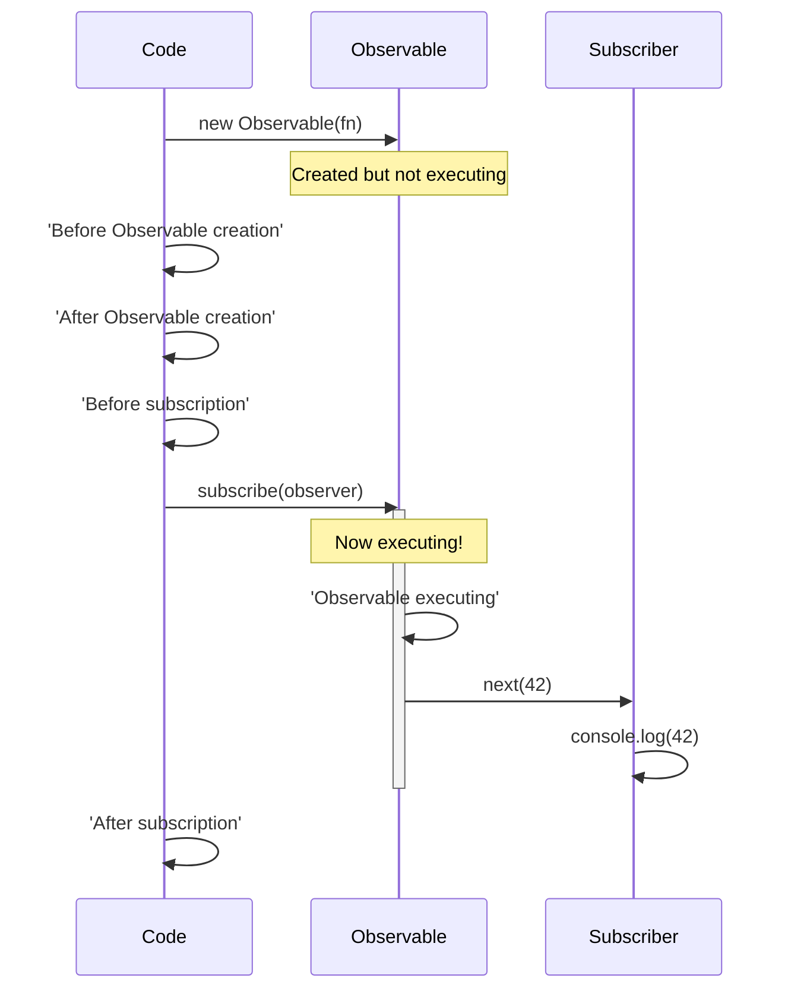
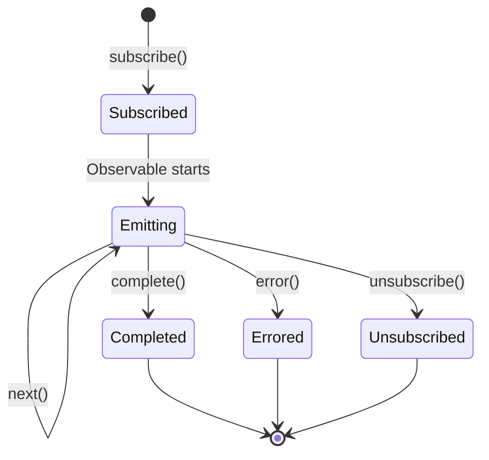
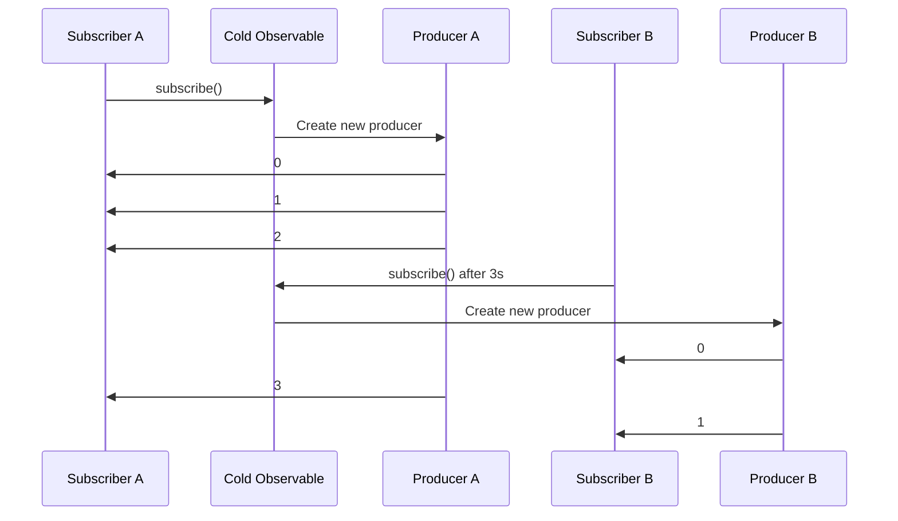
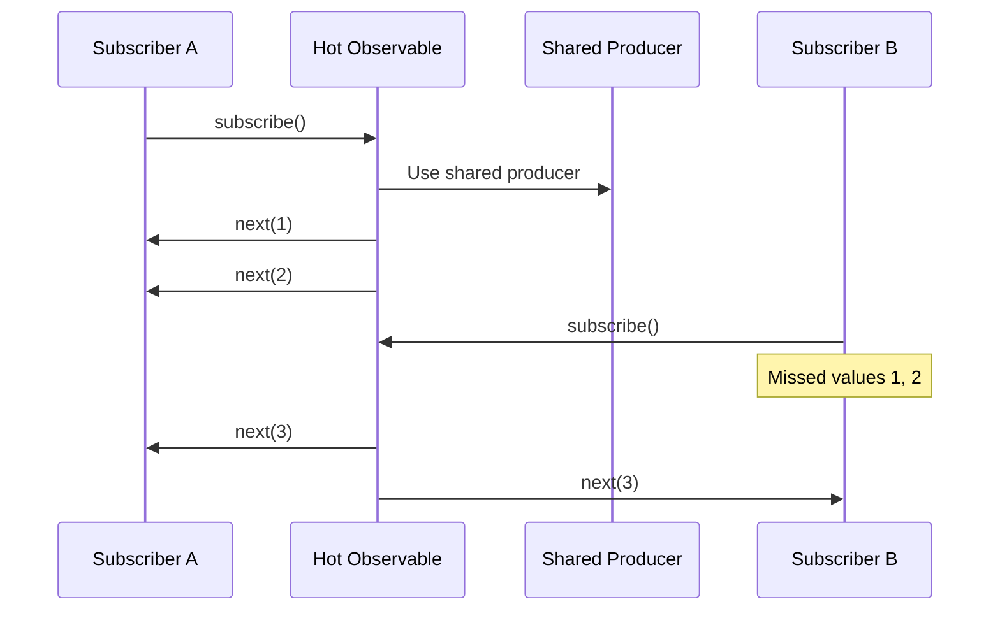
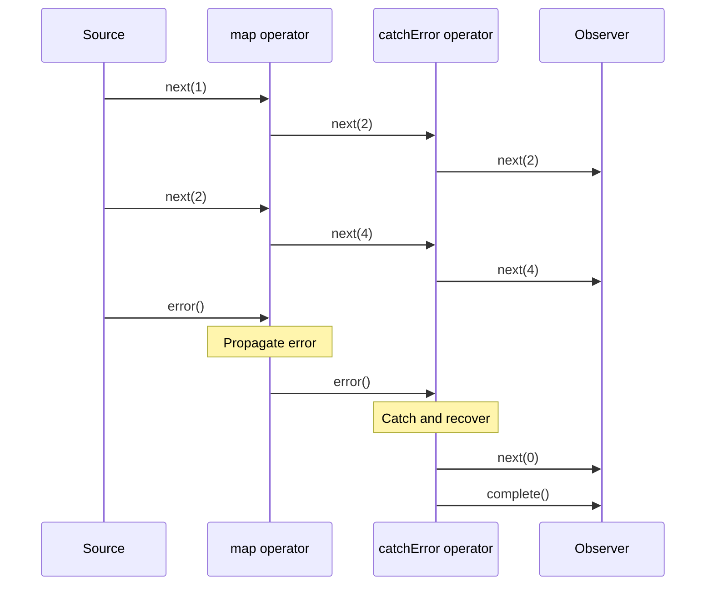

#rxjs #reactive-programming #design-pattern #behavioral-pattern #software-engineering #software-architecture #javascript #typescript #functional-programming #asynchronous-programming
# Overview
- Observables are ==lazy Push collections== that can deliver multiple values over time.
- Observables are the ==core primitive== of RxJS, representing a stream of data or events.
- Observables generalize functions to support multiple return values delivered asynchronously or synchronously.
- Observables do not execute until an Observer subscribes, making them ==lazy by design==.
# Observable characteristics
## Push-based system
- Observables are ==Push systems== where the Producer determines when to send data to the Consumer.
- The Observable decides when to emit values via `TypeScript next()`, `TypeScript error()`, or `TypeScript complete()`.
```TypeScript title='Observable pushes values to subscribers'
import { Observable } from 'rxjs';
const observable = new Observable((subscriber) => {
  subscriber.next(1);
  subscriber.next(2);
  setTimeout(() => subscriber.next(3), 1000);
});
observable.subscribe((value) => console.log(value));
```
## Multiple values
- Observables can emit ==zero, one, or many values== over time.
- Unlike Promises that resolve to a single value, Observables support streams of values.
```TypeScript title='Observable emitting multiple values'
const numbers = new Observable((subscriber) => {
  subscriber.next(1);
  subscriber.next(2);
  subscriber.next(3);
  subscriber.complete();
});
```
## Lazy execution
- Observables are ==lazy==: the Observable function does not execute until subscription.
- Each subscription triggers a new independent execution of the Observable.
```TypeScript title='Observable lazy execution'
console.log('Before Observable creation');
const observable = new Observable((subscriber) => {
  console.log('Observable executing');
  subscriber.next(42);
});
console.log('After Observable creation');
console.log('Before subscription');
observable.subscribe((x) => console.log(x));
console.log('After subscription');
```
- Output demonstrates lazy execution: the Observable body only runs when subscribed.

## Synchronous or Asynchronous
- Observables can deliver values ==synchronously or asynchronously==.
```TypeScript title='Synchronous Observable'
const sync = new Observable((subscriber) => {
  subscriber.next(1);
  subscriber.next(2);
  subscriber.next(3);
  subscriber.complete();
});
```
```TypeScript title='Asynchronous Observable'
const async = new Observable((subscriber) => {
  setTimeout(() => subscriber.next(1), 1000);
  setTimeout(() => subscriber.next(2), 2000);
  setTimeout(() => subscriber.complete(), 3000);
});
```
# Creating Observables
## Constructor
- Observables are created using the `TypeScript Observable` constructor with a subscriber function.
```TypeScript title='Observable constructor'
import { Observable } from 'rxjs';
const observable = new Observable((subscriber) => {
  subscriber.next('Hello');
  subscriber.next('World');
  subscriber.complete();
});
```
## Creation operators
- RxJS provides creation operators for common Observable patterns.
### of operator
- `TypeScript of()` creates an Observable that emits provided arguments sequentially.
```TypeScript title='Creating Observable with of'
import { of } from 'rxjs';
const observable = of(1, 2, 3, 4, 5);
observable.subscribe((x) => console.log(x));
```
### from operator
- `TypeScript from()` converts arrays, promises, iterables, or observables into Observables.
```TypeScript title='Creating Observable from array'
import { from } from 'rxjs';
const array = [10, 20, 30];
const observable = from(array);
observable.subscribe((x) => console.log(x));
```
```TypeScript title='Creating Observable from Promise'
const promise = Promise.resolve(42);
const observable = from(promise);
observable.subscribe((x) => console.log(x));
```
### interval operator
- `TypeScript interval()` creates an Observable that emits sequential numbers at specified intervals.
```TypeScript title='Creating interval Observable'
import { interval } from 'rxjs';
const observable = interval(1000);
observable.subscribe((x) => console.log(x));
```
### fromEvent operator
- `TypeScript fromEvent()` creates an Observable from DOM events.
```TypeScript title='Creating Observable from DOM event'
import { fromEvent } from 'rxjs';
const button = document.querySelector('button');
const clicks = fromEvent(button, 'click');
clicks.subscribe((event) => console.log('Clicked!'));
```
### timer operator
- `TypeScript timer()` creates an Observable that emits after a delay, optionally repeating at intervals.
```TypeScript title='Creating timer Observable'
import { timer } from 'rxjs';
const observable = timer(3000, 1000);
observable.subscribe((x) => console.log(x));
```
# Subscribing to Observables
## Subscribe method
- The `TypeScript subscribe()` method starts the Observable execution and provides callbacks for emitted values.
```TypeScript title='Subscribing to an Observable'
observable.subscribe({
  next: (value) => console.log('Next:', value),
  error: (err) => console.error('Error:', err),
  complete: () => console.log('Complete')
});
```
## Observer callbacks
- Observers provide three optional callbacks: `TypeScript next()`, `TypeScript error()`, and `TypeScript complete()`.
### next callback
- `TypeScript next()` receives each emitted value from the Observable.
```TypeScript title='next callback'
observable.subscribe({
  next: (value) => console.log('Received:', value)
});
```
### error callback
- `TypeScript error()` receives error notifications and terminates the Observable.
```TypeScript title='error callback'
observable.subscribe({
  error: (err) => console.error('Error occurred:', err)
});
```
### complete callback
- `TypeScript complete()` is called when the Observable finishes emitting values.
```TypeScript title='complete callback'
observable.subscribe({
  complete: () => console.log('Observable completed')
});
```
## Shorthand subscription
- `TypeScript subscribe()` accepts callbacks as positional arguments for convenience.
```TypeScript title='Shorthand subscription syntax'
observable.subscribe(
  (value) => console.log(value),
  (err) => console.error(err),
  () => console.log('Complete')
);
```
# Observable execution
## Notification types
- Observable execution delivers three types of notifications to Observers.
### Next notification
- Delivers a ==value== (number, string, object) to the Observer.
- An Observable can emit zero to infinite Next notifications.
```TypeScript title='Next notification'
subscriber.next(42);
subscriber.next('Hello');
subscriber.next({ name: 'John' });
```
### Error notification
- Delivers a JavaScript Error or exception, ==terminating== the Observable.
- After Error, no further notifications are delivered.
```TypeScript title='Error notification'
subscriber.error(new Error('Something went wrong'));
```
### Complete notification
- Signals that the Observable has ==finished== emitting values successfully.
- After Complete, no further notifications are delivered.
```TypeScript title='Complete notification'
subscriber.complete();
```
## Execution lifecycle

# Unsubscribing from Observables
## Subscription disposal
- Unsubscribing stops the Observable execution and releases resources.
```TypeScript title='Unsubscribing from Observable'
const subscription = observable.subscribe((x) => console.log(x));
subscription.unsubscribe();
```
## Custom cleanup logic
- Observables can define cleanup logic returned from the subscriber function.
```TypeScript title='Observable with cleanup logic'
const observable = new Observable((subscriber) => {
  const intervalId = setInterval(() => {
    subscriber.next('tick');
  }, 1000);
  return () => {
    console.log('Cleaning up');
    clearInterval(intervalId);
  };
});
const subscription = observable.subscribe((x) => console.log(x));
setTimeout(() => subscription.unsubscribe(), 5000);
```
## Multiple subscriptions
- Each subscription creates an independent execution of the Observable.
```TypeScript title='Multiple independent subscriptions'
const observable = new Observable((subscriber) => {
  console.log('Observable execution started');
  subscriber.next(Math.random());
});
observable.subscribe((x) => console.log('Subscriber A:', x));
observable.subscribe((x) => console.log('Subscriber B:', x));
```
- Output shows two separate executions with different random values.
# Hot vs Cold Observables
## Cold Observables
- Cold Observables ==create a new data producer== for each subscription.
- Each subscriber receives its own independent stream of values.
```TypeScript title='Cold Observable example'
import { interval } from 'rxjs';
const cold = interval(1000);
cold.subscribe((x) => console.log('Subscriber A:', x));
setTimeout(() => {
  cold.subscribe((x) => console.log('Subscriber B:', x));
}, 3000);
```
- Subscriber B starts from 0, independent of Subscriber A.

## Hot Observables
- Hot Observables ==share a single data producer== across all subscriptions.
- Subscribers receive values from the point they subscribe, missing earlier values.
```TypeScript title='Hot Observable with Subject'
import { Subject } from 'rxjs';
const hot = new Subject();
hot.subscribe((x) => console.log('Subscriber A:', x));
hot.next(1);
hot.next(2);
hot.subscribe((x) => console.log('Subscriber B:', x));
hot.next(3);
```
- Subscriber B only receives value 3, missing 1 and 2.

## Converting Cold to Hot
- Use multicasting operators to convert Cold Observables to Hot.
```TypeScript title='Converting Cold to Hot with share'
import { interval } from 'rxjs';
import { share } from 'rxjs/operators';
const cold = interval(1000);
const hot = cold.pipe(share());
hot.subscribe((x) => console.log('Subscriber A:', x));
setTimeout(() => {
  hot.subscribe((x) => console.log('Subscriber B:', x));
}, 3000);
```
# Observable contract
- Observables adhere to the ==Observable Contract== governing notification delivery.
## Grammar
- Observable notifications follow this grammar: `next*(error|complete)?`
- Zero or more Next notifications followed by optional Error or Complete.
## Termination rules
- After `TypeScript error()` or `TypeScript complete()`, no further notifications are delivered.
```TypeScript title='Observable termination'
const observable = new Observable((subscriber) => {
  subscriber.next(1);
  subscriber.next(2);
  subscriber.complete();
  subscriber.next(3);
});
observable.subscribe((x) => console.log(x));
```
- Value 3 is never delivered because the Observable completed.
## Synchronous delivery guarantee
- Within a single subscription, notifications are delivered ==synchronously and sequentially==.
- No interleaving of notifications from different Observables occurs within a single call stack.
# Comparison with other patterns
## Observable vs Function
- Observables generalize functions to return multiple values.
```TypeScript title='Function returns single value'
function getData() {
  return 42;
}
console.log(getData());
```
```TypeScript title='Observable returns multiple values'
const observable = new Observable((subscriber) => {
  subscriber.next(42);
  subscriber.next(43);
  subscriber.next(44);
});
observable.subscribe((x) => console.log(x));
```
## Observable vs Generator
- Observables ==push values==, while Generators ==pull values==.
- Observables support asynchronous delivery, Generators are synchronous.
```TypeScript title='Generator pulls values'
function* generator() {
  yield 1;
  yield 2;
  yield 3;
}
const gen = generator();
console.log(gen.next().value);
console.log(gen.next().value);
```
```TypeScript title='Observable pushes values'
const observable = of(1, 2, 3);
observable.subscribe((x) => console.log(x));
```
## Observable vs Promise
- Observables can emit multiple values, Promises resolve once.
- Observables are lazy, Promises are eager.
- Observables support cancellation, Promises do not.
```TypeScript title='Promise resolves once'
const promise = new Promise((resolve) => resolve(42));
promise.then((x) => console.log(x));
```
```TypeScript title='Observable emits multiple times'
const observable = of(1, 2, 3);
observable.subscribe((x) => console.log(x));
```
# Error handling
- Observables provide mechanisms for handling errors gracefully.
## Error in Observable
```TypeScript title='Observable with error'
const observable = new Observable((subscriber) => {
  subscriber.next(1);
  subscriber.error(new Error('Oops!'));
  subscriber.next(2);
});
observable.subscribe({
  next: (x) => console.log(x),
  error: (err) => console.error('Error:', err.message)
});
```
## Error propagation
- Errors propagate through the operator chain until caught.
```TypeScript title='Error propagation through operators'
import { throwError } from 'rxjs';
import { map, catchError } from 'rxjs/operators';
throwError(() => new Error('Error!'))
  .pipe(
    map((x) => x * 2),
    catchError((err) => {
      console.error('Caught:', err.message);
      return of(0);
    })
  )
  .subscribe((x) => console.log(x));
```

***
# References
1. https://rxjs.dev/guide/observable for Observable specification and behavior.
2. https://rxjs.dev/api/index/class/Observable for Observable API documentation.
3. [[RxJS|RxJS]] for RxJS overview and core concepts.
4. [[Operators|Operators]] for Observable transformation and manipulation.
5. https://rxjs.dev/guide/observer for Observer pattern in RxJS.
6. https://rxjs.dev/guide/subscription for Subscription lifecycle management.
7. https://medium.com/@benlesh/hot-vs-cold-observables-f8094ed53339 for hot vs cold Observable explanation.
8. https://rxjs.dev/api/index/function/of for `of` operator documentation.
9. https://rxjs.dev/api/index/function/from for `from` operator documentation.
