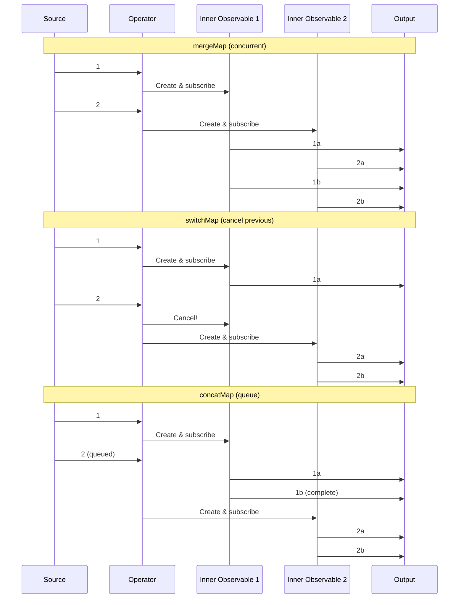
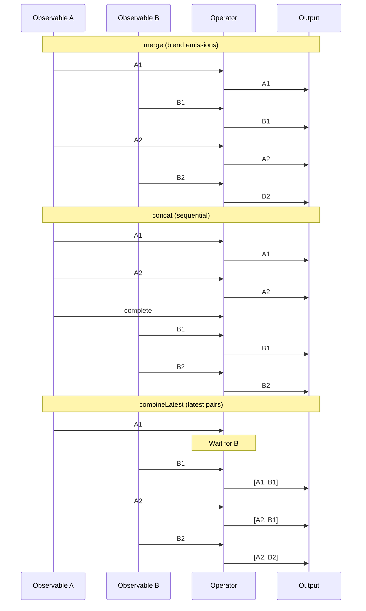
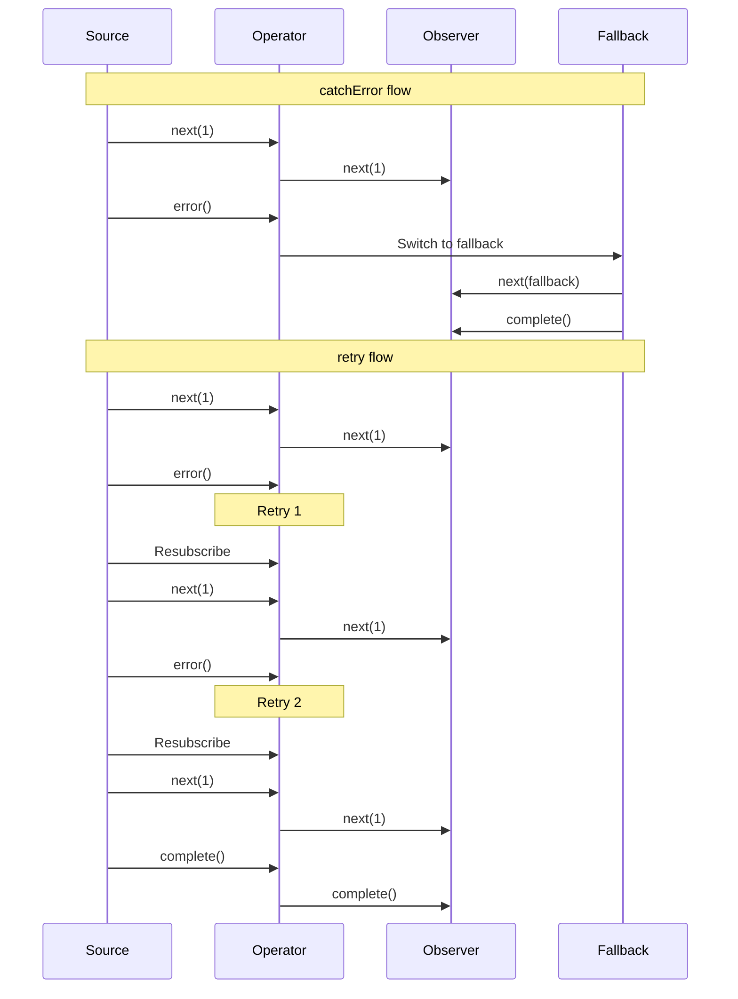

#rxjs #high-order-function #operator #pipeline #streaming #functional-programming #javascript #typescript #reactive-programming
# Overview
- Operators are ==pure functions== that enable functional programming for transforming, filtering, and combining Observables.
- Operators do not modify the source Observable; they return a ==new Observable== based on the current one.
- Operators are composable, allowing complex asynchronous logic to be built from simple building blocks.
- Operators are applied using the `TypeScript pipe()` method to chain multiple operations.
# Pipeable operators
- Pipeable operators are functions that take an Observable as input and return a new Observable.
- Pipeable operators are ==pure functions== that do not mutate the input Observable.
```TypeScript title='Using pipeable operators'
import { of } from 'rxjs';
import { map, filter } from 'rxjs/operators';
const source = of(1, 2, 3, 4, 5);
const result = source.pipe(
  filter((x) => x % 2 === 0),
  map((x) => x * 10)
);
result.subscribe((x) => console.log(x));
```
## Pipe method
- The `TypeScript pipe()` method chains multiple operators sequentially.
- Each operator receives the output of the previous operator.
```TypeScript title='Chaining multiple operators'
observable.pipe(
  operator1(),
  operator2(),
  operator3()
).subscribe(observer);
```
## Custom operators
- Custom operators can be created by composing existing operators or writing functions.
```TypeScript title='Creating custom operator'
import { Observable } from 'rxjs';
import { map } from 'rxjs/operators';
function multiplyBy(multiplier: number) {
  return (source: Observable<number>) => source.pipe(
    map((value) => value * multiplier)
  );
}
of(1, 2, 3).pipe(multiplyBy(10)).subscribe((x) => console.log(x));
```
# Creation operators
- Creation operators create Observables from various sources.
## `of` operator
- `TypeScript of()` creates an Observable that emits specified values sequentially.
```TypeScript title='of operator example'
import { of } from 'rxjs';
of(1, 2, 3, 4, 5).subscribe((x) => console.log(x));
```
## `from` operator
- `TypeScript from()` converts arrays, promises, iterables, or observables into Observables.
```TypeScript title='from operator with array'
import { from } from 'rxjs';
from([10, 20, 30]).subscribe((x) => console.log(x));
```
```TypeScript title='from operator with Promise'
const promise = Promise.resolve(42);
from(promise).subscribe((x) => console.log(x));
```
## `interval` operator
- `TypeScript interval()` creates an Observable emitting sequential numbers at specified intervals.
```TypeScript title='interval operator example'
import { interval } from 'rxjs';
import { take } from 'rxjs/operators';
interval(1000).pipe(take(5)).subscribe((x) => console.log(x));
```
## `timer` operator
- `TypeScript timer()` emits after a delay, optionally repeating at intervals.
```TypeScript title='timer operator example'
import { timer } from 'rxjs';
timer(3000, 1000).pipe(take(5)).subscribe((x) => console.log(x));
```
## `fromEvent` operator
- `TypeScript fromEvent()` creates an Observable from DOM events.
```TypeScript title='fromEvent operator example'
import { fromEvent } from 'rxjs';
const button = document.querySelector('button');
fromEvent(button, 'click').subscribe(() => console.log('Clicked!'));
```
## `range` operator
- `TypeScript range()` emits a sequence of numbers within a specified range.
```TypeScript title='range operator example'
import { range } from 'rxjs';
range(1, 5).subscribe((x) => console.log(x));
```
# Transformation operators
- Transformation operators transform values emitted by the source Observable.
## `map` operator
- `TypeScript map()` applies a ==projection function== to each emitted value.
```TypeScript title='map operator example'
import { of } from 'rxjs';
import { map } from 'rxjs/operators';
of(1, 2, 3).pipe(
  map((x) => x * 10)
).subscribe((x) => console.log(x));
```
## `mergeMap` operator
- `TypeScript mergeMap()` projects each value to an Observable and ==flattens== all inner Observables.
- Also known as `TypeScript flatMap()`.
```TypeScript title='mergeMap operator example'
import { of } from 'rxjs';
import { mergeMap } from 'rxjs/operators';
of(1, 2, 3).pipe(
  mergeMap((x) => of(x, x * 10))
).subscribe((x) => console.log(x));
```
## `switchMap` operator
- `TypeScript switchMap()` projects each value to an Observable, ==cancelling== previous inner Observables.
```TypeScript title='switchMap operator example'
import { fromEvent, interval } from 'rxjs';
import { switchMap } from 'rxjs/operators';
const button = document.querySelector('button');
fromEvent(button, 'click').pipe(
  switchMap(() => interval(1000))
).subscribe((x) => console.log(x));
```
## `concatMap` operator
- `TypeScript concatMap()` projects each value to an Observable, ==queuing== inner Observables sequentially.
```TypeScript title='concatMap operator example'
import { of } from 'rxjs';
import { concatMap, delay } from 'rxjs/operators';
of(1, 2, 3).pipe(
  concatMap((x) => of(x).pipe(delay(1000)))
).subscribe((x) => console.log(x));
```

## `scan` operator
- `TypeScript scan()` applies an ==accumulator function== over the source Observable.
- Similar to `JavaScript Array.reduce()` but emits each intermediate result.
```TypeScript title='scan operator example'
import { of } from 'rxjs';
import { scan } from 'rxjs/operators';
of(1, 2, 3, 4, 5).pipe(
  scan((acc, value) => acc + value, 0)
).subscribe((x) => console.log(x));
```
## `reduce` operator
- `TypeScript reduce()` applies an accumulator function and emits only the ==final result==.
```TypeScript title='reduce operator example'
import { of } from 'rxjs';
import { reduce } from 'rxjs/operators';
of(1, 2, 3, 4, 5).pipe(
  reduce((acc, value) => acc + value, 0)
).subscribe((x) => console.log(x));
```
## `pluck` operator
- `TypeScript pluck()` selects ==nested properties== from each emitted object.
```TypeScript title='pluck operator example'
import { of } from 'rxjs';
import { pluck } from 'rxjs/operators';
of(
  { name: 'Alice', age: 30 },
  { name: 'Bob', age: 25 }
).pipe(
  pluck('name')
).subscribe((x) => console.log(x));
```
# Filtering operators
- Filtering operators select specific values from the source Observable.
## `filter` operator
- `TypeScript filter()` emits values that satisfy a ==predicate function==.
```TypeScript title='filter operator example'
import { of } from 'rxjs';
import { filter } from 'rxjs/operators';
of(1, 2, 3, 4, 5).pipe(
  filter((x) => x % 2 === 0)
).subscribe((x) => console.log(x));
```
## `take` operator
- `TypeScript take()` emits only the ==first N values== then completes.
```TypeScript title='take operator example'
import { interval } from 'rxjs';
import { take } from 'rxjs/operators';
interval(1000).pipe(take(3)).subscribe((x) => console.log(x));
```
## `takeUntil` operator
- `TypeScript takeUntil()` emits values until a ==notifier Observable== emits.
```TypeScript title='takeUntil operator example'
import { interval, timer } from 'rxjs';
import { takeUntil } from 'rxjs/operators';
const source = interval(1000);
const notifier = timer(5000);
source.pipe(takeUntil(notifier)).subscribe((x) => console.log(x));
```
## `takeWhile` operator
- `TypeScript takeWhile()` emits values while a ==predicate== is true.
```TypeScript title='takeWhile operator example'
import { of } from 'rxjs';
import { takeWhile } from 'rxjs/operators';
of(1, 2, 3, 4, 5, 1, 2).pipe(
  takeWhile((x) => x < 4)
).subscribe((x) => console.log(x));
```
## `skip` operator
- `TypeScript skip()` skips the ==first N values== from the source Observable.
```TypeScript title='skip operator example'
import { of } from 'rxjs';
import { skip } from 'rxjs/operators';
of(1, 2, 3, 4, 5).pipe(skip(2)).subscribe((x) => console.log(x));
```
## `first` operator
- `TypeScript first()` emits only the ==first value== then completes.
```TypeScript title='first operator example'
import { of } from 'rxjs';
import { first } from 'rxjs/operators';
of(1, 2, 3, 4, 5).pipe(first()).subscribe((x) => console.log(x));
```
## `last` operator
- `TypeScript last()` emits only the ==last value== when the source completes.
```TypeScript title='last operator example'
import { of } from 'rxjs';
import { last } from 'rxjs/operators';
of(1, 2, 3, 4, 5).pipe(last()).subscribe((x) => console.log(x));
```
## `distinct` operator
- `TypeScript distinct()` emits values that have ==never been emitted before==.
```TypeScript title='distinct operator example'
import { of } from 'rxjs';
import { distinct } from 'rxjs/operators';
of(1, 2, 2, 3, 1, 4, 3).pipe(distinct()).subscribe((x) => console.log(x));
```
## `distinctUntilChanged` operator
- `TypeScript distinctUntilChanged()` emits values only when they differ from the ==previous value==.
```TypeScript title='distinctUntilChanged operator example'
import { of } from 'rxjs';
import { distinctUntilChanged } from 'rxjs/operators';
of(1, 1, 2, 2, 3, 3, 1).pipe(
  distinctUntilChanged()
).subscribe((x) => console.log(x));
```
## `debounceTime` operator
- `TypeScript debounceTime()` emits a value only after a ==silence period== of specified duration.
```TypeScript title='debounceTime operator example'
import { fromEvent } from 'rxjs';
import { debounceTime, map } from 'rxjs/operators';
const input = document.querySelector('input');
fromEvent(input, 'input').pipe(
  debounceTime(300),
  map((event) => event.target.value)
).subscribe((value) => console.log(value));
```
## `throttleTime` operator
- `TypeScript throttleTime()` emits a value then ==ignores== subsequent values for specified duration.
```TypeScript title='throttleTime operator example'
import { fromEvent } from 'rxjs';
import { throttleTime } from 'rxjs/operators';
fromEvent(document, 'click').pipe(
  throttleTime(1000)
).subscribe(() => console.log('Clicked'));
```
# Combination operators
- Combination operators combine multiple Observables into a single Observable.
## `merge` operator
- `TypeScript merge()` ==merges== multiple Observables into one by blending emitted values.
```TypeScript title='merge operator example'
import { merge, interval } from 'rxjs';
import { map, take } from 'rxjs/operators';
const first = interval(1000).pipe(map((x) => `First: ${x}`), take(3));
const second = interval(1500).pipe(map((x) => `Second: ${x}`), take(3));
merge(first, second).subscribe((x) => console.log(x));
```
## `concat` operator
- `TypeScript concat()` ==sequentially== concatenates Observables, waiting for each to complete.
```TypeScript title='concat operator example'
import { concat, of } from 'rxjs';
import { delay } from 'rxjs/operators';
const first = of(1, 2, 3);
const second = of(4, 5, 6).pipe(delay(1000));
concat(first, second).subscribe((x) => console.log(x));
```
## `combineLatest` operator
- `TypeScript combineLatest()` combines ==latest values== from multiple Observables when any emits.
```TypeScript title='combineLatest operator example'
import { combineLatest, interval } from 'rxjs';
import { take } from 'rxjs/operators';
const first = interval(1000).pipe(take(3));
const second = interval(1500).pipe(take(3));
combineLatest([first, second]).subscribe(([a, b]) =>
  console.log(`First: ${a}, Second: ${b}`)
);
```

## `forkJoin` operator
- `TypeScript forkJoin()` waits for all Observables to ==complete== then emits last values.
```TypeScript title='forkJoin operator example'
import { forkJoin, of } from 'rxjs';
import { delay } from 'rxjs/operators';
const first = of(1, 2, 3);
const second = of(4, 5, 6).pipe(delay(1000));
forkJoin([first, second]).subscribe(([a, b]) =>
  console.log(`First: ${a}, Second: ${b}`)
);
```
## `zip` operator
- `TypeScript zip()` combines values from Observables ==pairwise== based on emission order.
```TypeScript title='zip operator example'
import { zip, of } from 'rxjs';
const age = of(27, 25, 29);
const name = of('Alice', 'Bob', 'Charlie');
zip(age, name).subscribe(([a, n]) => console.log(`${n} is ${a}`));
```
## `withLatestFrom` operator
- `TypeScript withLatestFrom()` combines source values with ==latest values== from other Observables.
```TypeScript title='withLatestFrom operator example'
import { interval } from 'rxjs';
import { withLatestFrom, map } from 'rxjs/operators';
const source = interval(1000);
const other = interval(500);
source.pipe(
  withLatestFrom(other),
  map(([s, o]) => `Source: ${s}, Other: ${o}`)
).subscribe((x) => console.log(x));
```
## `startWith` operator
- `TypeScript startWith()` emits ==initial values== before values from the source Observable.
```TypeScript title='startWith operator example'
import { of } from 'rxjs';
import { startWith } from 'rxjs/operators';
of(1, 2, 3).pipe(startWith(0)).subscribe((x) => console.log(x));
```
# Error handling operators
- Error handling operators manage errors in Observable streams.
## `catchError` operator
- `TypeScript catchError()` catches errors and returns a ==fallback Observable==.
```TypeScript title='catchError operator example'
import { throwError, of } from 'rxjs';
import { catchError } from 'rxjs/operators';
throwError(() => new Error('Error!')).pipe(
  catchError((err) => {
    console.error('Caught:', err.message);
    return of('Fallback value');
  })
).subscribe((x) => console.log(x));
```
## `retry` operator
- `TypeScript retry()` resubscribes to the source Observable on error up to ==N times==.
```TypeScript title='retry operator example'
import { ajax } from 'rxjs/ajax';
import { retry } from 'rxjs/operators';
ajax.getJSON('https://api.example.com/data').pipe(
  retry(3)
).subscribe((data) => console.log(data));
```

## `retryWhen` operator
- `TypeScript retryWhen()` resubscribes based on ==custom retry logic==.
```TypeScript title='retryWhen operator example'
import { throwError } from 'rxjs';
import { retryWhen, delay, take } from 'rxjs/operators';
throwError(() => new Error('Error!')).pipe(
  retryWhen((errors) => errors.pipe(delay(1000), take(3)))
).subscribe({
  next: (x) => console.log(x),
  error: (err) => console.error('Failed after retries')
});
```
# Utility operators
- Utility operators provide helpful utilities for working with Observables.
## `tap` operator
- `TypeScript tap()` performs ==side effects== without modifying emitted values.
```TypeScript title='tap operator example'
import { of } from 'rxjs';
import { tap, map } from 'rxjs/operators';
of(1, 2, 3).pipe(
  tap((x) => console.log('Before:', x)),
  map((x) => x * 10),
  tap((x) => console.log('After:', x))
).subscribe();
```
## `delay` operator
- `TypeScript delay()` delays emission of values by a ==specified duration==.
```TypeScript title='delay operator example'
import { of } from 'rxjs';
import { delay } from 'rxjs/operators';
of(1, 2, 3).pipe(delay(1000)).subscribe((x) => console.log(x));
```
## `timeout` operator
- `TypeScript timeout()` emits an error if the Observable does not emit within ==specified time==.
```TypeScript title='timeout operator example'
import { interval } from 'rxjs';
import { timeout } from 'rxjs/operators';
interval(2000).pipe(
  timeout(1000)
).subscribe({
  next: (x) => console.log(x),
  error: (err) => console.error('Timeout!')
});
```
## `finalize` operator
- `TypeScript finalize()` executes a callback when the Observable ==completes or errors==.
```TypeScript title='finalize operator example'
import { of } from 'rxjs';
import { finalize } from 'rxjs/operators';
of(1, 2, 3).pipe(
  finalize(() => console.log('Cleanup'))
).subscribe((x) => console.log(x));
```
# Multicasting operators
- Multicasting operators share a single subscription among multiple subscribers.
## `share` operator
- `TypeScript share()` ==multicasts== the source Observable to multiple subscribers.
```TypeScript title='share operator example'
import { interval } from 'rxjs';
import { share, take } from 'rxjs/operators';
const shared = interval(1000).pipe(take(5), share());
shared.subscribe((x) => console.log('Subscriber A:', x));
setTimeout(() => {
  shared.subscribe((x) => console.log('Subscriber B:', x));
}, 2000);
```
## `shareReplay` operator
- `TypeScript shareReplay()` multicasts and ==replays== specified number of values to new subscribers.
```TypeScript title='shareReplay operator example'
import { interval } from 'rxjs';
import { shareReplay, take } from 'rxjs/operators';
const shared = interval(1000).pipe(take(5), shareReplay(2));
shared.subscribe((x) => console.log('Subscriber A:', x));
setTimeout(() => {
  shared.subscribe((x) => console.log('Subscriber B:', x));
}, 3000);
```
# Conditional operators
- Conditional operators emit values based on conditions.
## `defaultIfEmpty` operator
- `TypeScript defaultIfEmpty()` emits a ==default value== if the source completes without emitting.
```TypeScript title='defaultIfEmpty operator example'
import { EMPTY } from 'rxjs';
import { defaultIfEmpty } from 'rxjs/operators';
EMPTY.pipe(
  defaultIfEmpty('No values')
).subscribe((x) => console.log(x));
```
## `every` operator
- `TypeScript every()` emits a boolean indicating if ==all values== satisfy a predicate.
```TypeScript title='every operator example'
import { of } from 'rxjs';
import { every } from 'rxjs/operators';
of(2, 4, 6, 8).pipe(
  every((x) => x % 2 === 0)
).subscribe((x) => console.log(x));
```
***
# References
1. https://rxjs.dev/guide/operators for RxJS operators overview.
2. https://rxjs.dev/api for complete RxJS API documentation.
3. [[RxJS|RxJS]] for RxJS core concepts and overview.
4. [[Observable|Observable]] for Observable fundamentals.
5. https://www.learnrxjs.io/learn-rxjs/operators for operator examples and explanations.
6. https://rxmarbles.com/ for interactive operator visualizations.
7. https://rxjs.dev/operator-decision-tree for operator selection guide.
