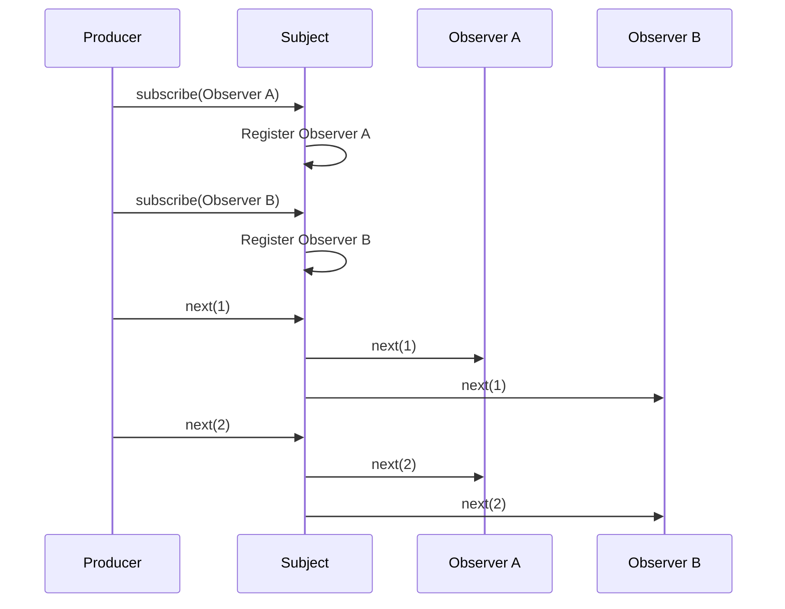
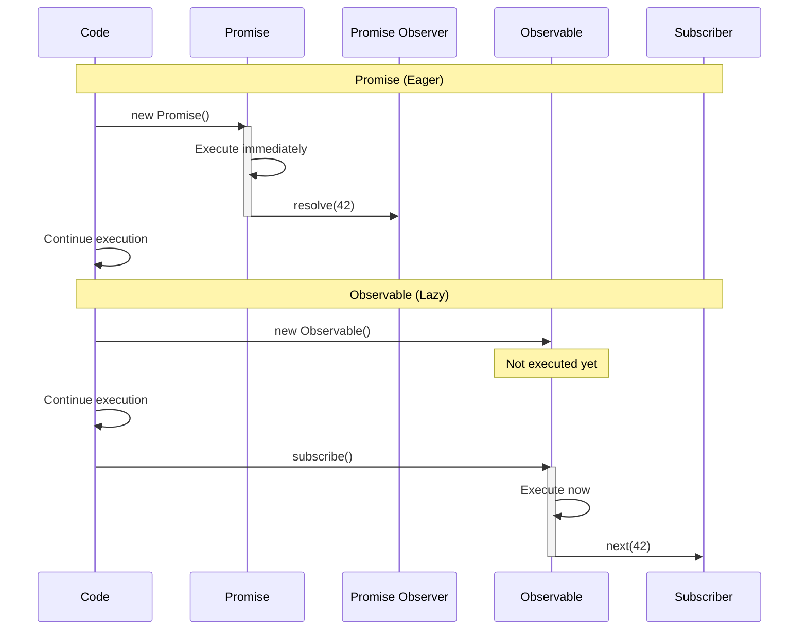

#reactive-programming #javascript #typescript #angular #design-pattern #behavioral-pattern #software-engineering #software-architecture #asynchronous-programming #event-driven
# Overview
- RxJS stands for ==Reactive Extensions for JavaScript==.
- RxJS is a library for ==reactive programming== using Observables to compose asynchronous and event-based programs.
- RxJS provides functional programming utilities for working with event streams and asynchronous data flows.
- RxJS is heavily used in frameworks like Angular for handling asynchronous operations and state management.
# Core concepts
## Observable
- An [[Observable|Observable]] represents a ==lazy Push collection== of multiple values over time.
- Observables are the foundation of RxJS, producing values synchronously or asynchronously.
- Observables do not execute until an Observer subscribes to them.
```TypeScript title='Basic Observable example'
import { Observable } from 'rxjs';
const observable = new Observable((subscriber) => {
  subscriber.next(1);
  subscriber.next(2);
  subscriber.next(3);
  setTimeout(() => {
    subscriber.next(4);
    subscriber.complete();
  }, 1000);
});
```
## Observer
- An Observer is a ==consumer of values== delivered by an Observable.
- Observers are objects with callback methods: `TypeScript next()`, `TypeScript error()`, and `TypeScript complete()`.
```TypeScript title='Observer with all three callbacks'
const observer = {
  next: (value) => console.log('Received:', value),
  error: (err) => console.error('Error:', err),
  complete: () => console.log('Complete')
};
observable.subscribe(observer);
```
## Subscription
- A Subscription represents the ==execution of an Observable==.
- Subscriptions are used to unsubscribe and cancel ongoing executions.
```TypeScript title='Subscription and unsubscription'
const subscription = observable.subscribe((x) => console.log(x));
subscription.unsubscribe();
```
## Operators
- [[Operators|Operators]] are ==pure functions== that enable functional programming for complex asynchronous operations.
- Operators transform, filter, combine, and manipulate Observables.
```TypeScript title='Using operators with pipe'
import { of } from 'rxjs';
import { map, filter } from 'rxjs/operators';
of(1, 2, 3, 4, 5)
  .pipe(
    filter((x) => x % 2 === 0),
    map((x) => x * 10)
  )
  .subscribe((x) => console.log(x));
```
## Subject
- A Subject is a ==special Observable== that acts as both Observable and Observer.
- Subjects allow values to be ==multicast== to multiple Observers.
- Subjects maintain a registry of Observers similar to the Observer pattern.
```TypeScript title='Subject multicasting to multiple observers'
import { Subject } from 'rxjs';
const subject = new Subject();
subject.subscribe((x) => console.log('Observer A:', x));
subject.subscribe((x) => console.log('Observer B:', x));
subject.next(1);
subject.next(2);
```

## Scheduler
- Schedulers control ==when a subscription starts== and ==when notifications are delivered==.
- Schedulers provide fine-grained control over concurrency and timing.
```TypeScript title='Observable with scheduler'
import { of, asyncScheduler } from 'rxjs';
import { observeOn } from 'rxjs/operators';
of(1, 2, 3)
  .pipe(observeOn(asyncScheduler))
  .subscribe((x) => console.log(x));
```
# Push vs Pull systems
## Pull system
- In Pull systems, the ==Consumer determines when it receives data== from the Producer.
- Functions are Pull systems: the function does not execute until called.
```TypeScript title='Pull system with function'
function getData() {
  return 42;
}
const value = getData();
```
## Push system
- In Push systems, the ==Producer determines when to send data== to the Consumer.
- Promises and Observables are Push systems: they decide when to deliver values.
```TypeScript title='Push system with Observable'
const observable = new Observable((subscriber) => {
  subscriber.next(42);
});
observable.subscribe((value) => console.log(value));
```
## Comparison table
| Type | Producer | Consumer |
|------|----------|----------|
| Pull: Function | Passive: produces data when requested | Active: decides when data is requested |
| Pull: Iterator | Passive: produces data when requested | Active: decides when data is requested |
| Push: Promise | Active: decides when to resolve | Passive: reacts to resolved value |
| Push: Observable | Active: decides when to emit | Passive: reacts to emitted values |
# Observable vs Promise
## Single vs Multiple values
- Promises handle ==single asynchronous values==.
- Observables handle ==multiple values over time==.
```TypeScript title='Promise delivers one value'
const promise = new Promise((resolve) => {
  setTimeout(() => resolve(42), 1000);
});
promise.then((value) => console.log(value));
```

```TypeScript title='Observable delivers multiple values'
const observable = new Observable((subscriber) => {
  subscriber.next(1);
  subscriber.next(2);
  subscriber.next(3);
});
observable.subscribe((value) => console.log(value));
```
## Eager vs Lazy execution
- Promises are ==eager==: they execute immediately upon creation.
- Observables are ==lazy==: they only execute when subscribed.
```TypeScript title='Promise executes immediately'
console.log('Before Promise');
const promise = new Promise((resolve) => {
  console.log('Promise executor runs');
  resolve(42);
});
console.log('After Promise');
```
```TypeScript title='Observable executes only when subscribed'
console.log('Before Observable');
const observable = new Observable((subscriber) => {
  console.log('Observable executor runs');
  subscriber.next(42);
});
console.log('After Observable');
observable.subscribe();
```

## Cancellation
- Promises ==cannot be cancelled== once started.
- Observables ==can be cancelled== via unsubscription.
```TypeScript title='Observable cancellation'
const subscription = observable.subscribe((x) => console.log(x));
subscription.unsubscribe();
```
# Common use cases
## HTTP requests
- RxJS simplifies handling HTTP responses, retries, and error handling.
```TypeScript title='HTTP request with retry'
import { ajax } from 'rxjs/ajax';
import { retry, catchError } from 'rxjs/operators';
import { of } from 'rxjs';
ajax.getJSON('https://api.example.com/data')
  .pipe(
    retry(3),
    catchError((error) => of({ error: error.message }))
  )
  .subscribe((data) => console.log(data));
```
## Event handling
- RxJS transforms DOM events into Observable streams.
```TypeScript title='Click event stream'
import { fromEvent } from 'rxjs';
import { throttleTime, map } from 'rxjs/operators';
const clicks = fromEvent(document, 'click');
clicks
  .pipe(
    throttleTime(1000),
    map((event) => event.clientX)
  )
  .subscribe((x) => console.log('Click X:', x));
```
## State management
- RxJS manages application state reactively using BehaviorSubject or state operators.
```TypeScript title='State management with BehaviorSubject'
import { BehaviorSubject } from 'rxjs';
const state = new BehaviorSubject({ count: 0 });
state.subscribe((s) => console.log('State:', s));
state.next({ count: 1 });
state.next({ count: 2 });
```
## Real-time data streams
- RxJS handles WebSocket connections, server-sent events, and real-time updates.
```TypeScript title='WebSocket stream'
import { webSocket } from 'rxjs/webSocket';
const socket = webSocket('ws://localhost:8080');
socket.subscribe(
  (msg) => console.log('Message:', msg),
  (err) => console.log('Error:', err),
  () => console.log('Connection closed')
);
```
## Debouncing user input
- RxJS debounces user input for search-as-you-type functionality.
```TypeScript title='Search input debouncing'
import { fromEvent } from 'rxjs';
import { debounceTime, map, distinctUntilChanged } from 'rxjs/operators';
const searchInput = document.getElementById('search');
fromEvent(searchInput, 'input')
  .pipe(
    map((event) => event.target.value),
    debounceTime(300),
    distinctUntilChanged()
  )
  .subscribe((searchTerm) => console.log('Search:', searchTerm));
```
# Advantages
- ==Composability==: Operators compose complex asynchronous logic from simple building blocks.
- ==Declarative==: Code describes what to do rather than how to do it.
- ==Cancellation==: Subscriptions can be cancelled to prevent memory leaks.
- ==Error handling==: Centralized error handling with operators like `TypeScript catchError()`.
- ==Testability==: Pure functions and marble testing simplify unit testing.
- ==Consistency==: Uniform API for handling various async sources (events, promises, timers).
# Installation
- RxJS is available as an npm package.
```Shell title='Install RxJS via npm'
npm install rxjs
```
```TypeScript title='Import RxJS modules'
import { Observable, of, from } from 'rxjs';
import { map, filter, mergeMap } from 'rxjs/operators';
```
***
# References
1. https://rxjs.dev/ for official RxJS documentation.
2. https://rxjs.dev/guide/overview for RxJS overview and core concepts.
3. https://rxjs.dev/guide/observable for Observable specification.
4. [[Observable|Observable]] for detailed Observable concepts.
5. [[Operators|Operators]] for RxJS operator categories and usage.
6. https://www.learnrxjs.io/ for RxJS learning resources and operator examples.
7. https://angular.io/guide/observables for RxJS usage in Angular.
