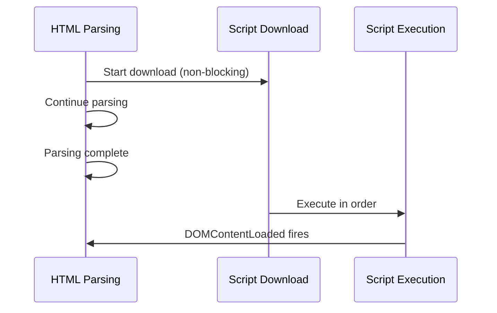
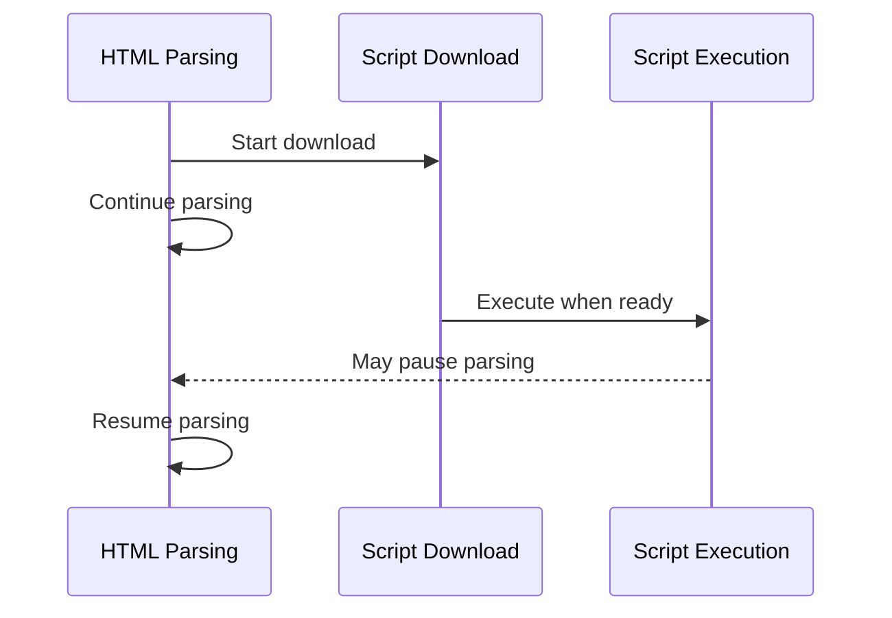

#vanilla-javascript #javascript #browser #html #concurrency-control
# Overview
- The `HTML <script>` tag is the mechanism for embedding or referencing JavaScript code in HTML documents.
- Script tags can load JavaScript in two modes: ==classic scripts== and ==module scripts==.
- Script loading and execution behavior significantly impacts page load performance and rendering.
# Classic scripts
## Inline scripts
- JavaScript code embedded directly within the `HTML <script>` tag.
```HTML title='Inline script example'
<script>
  console.log('Hello from inline script');
  document.getElementById('app').textContent = 'Loaded';
</script>
```
- Inline scripts execute immediately when the HTML parser encounters them, blocking further parsing.
- Inline scripts have access to the global scope and can modify the DOM.
## External scripts
- JavaScript code loaded from an external file using the `HTML src` attribute.
```HTML title='External script example'
<script src="app.js"></script>
```
- External scripts are downloaded and executed, blocking HTML parsing by default.
- The browser caches external scripts for performance optimization.
# Module scripts
- Module scripts are loaded using `HTML type="module"` attribute.
```HTML title='Module script example'
<script type="module" src="main.js"></script>
```
- Module scripts are ==deferred by default==, executing after HTML parsing completes.
- Module scripts have their own scope, not the global scope.
- Module scripts can use `JavaScript import` and `JavaScript export` syntax.
```HTML title='Inline module script with imports'
<script type="module">
  import { render } from './renderer.js';
  render();
</script>
```
- Module scripts execute in ==strict mode== automatically.
# Script loading attributes
## defer attribute
- The `HTML defer` attribute delays script execution until HTML parsing is complete.
```HTML title='Deferred script loading'
<script defer src="analytics.js"></script>
```
- Deferred scripts download in parallel with HTML parsing without blocking.
- Deferred scripts execute in the order they appear in the document.
- Deferred scripts execute before the `JavaScript DOMContentLoaded` event fires.
- The `HTML defer` attribute only works with external scripts, not inline scripts.
## async attribute
- The `HTML async` attribute loads scripts asynchronously without blocking HTML parsing.
```HTML title='Async script loading'
<script async src="tracker.js"></script>
```
- Async scripts download in parallel with HTML parsing.
- Async scripts execute immediately upon download, potentially blocking parsing.
- Async scripts execute in ==unpredictable order==, not necessarily document order.
- The `HTML async` attribute is ideal for independent scripts like analytics or advertisements.
- The `HTML async` attribute only works with external scripts, not inline scripts.
## Combining defer and async
- If both `HTML defer` and `HTML async` are present, `HTML async` takes precedence in modern browsers.
- Module scripts ignore the `HTML async` and `HTML defer` attributes as they are deferred by default.
# Loading behavior comparison
## Blocking scripts (default)
- HTML parsing stops when the script tag is encountered.
- Script downloads (if external) and executes immediately.
- HTML parsing resumes after script execution completes.
```HTML title='Blocking script example'
<script src="blocking.js"></script>
```
- Blocking scripts can cause poor page load performance if placed in the `HTML <head>`.
## Deferred scripts
- HTML parsing continues while script downloads.
- Script executes after HTML parsing completes, before `JavaScript DOMContentLoaded`.
- Multiple deferred scripts execute in document order.

## Async scripts
- HTML parsing continues while script downloads.
- Script executes immediately when download completes, pausing HTML parsing.
- Multiple async scripts execute in ==download completion order==.

# Execution order
## Classic scripts without attributes
- Scripts execute in document order, blocking at each script tag.
```HTML title='Sequential blocking execution'
<script src="first.js"></script>
<script src="second.js"></script>
<script src="third.js"></script>
```
- Execution order: `first.js` → `second.js` → `third.js`.
## Scripts with defer
- All deferred scripts execute in document order after parsing.
```HTML title='Deferred execution order'
<script defer src="first.js"></script>
<script defer src="second.js"></script>
```
- Both download in parallel, execute in document order after HTML parsing.
## Scripts with async
- Async scripts execute in ==completion order==, not document order.
```HTML title='Async unpredictable order'
<script async src="first.js"></script>
<script async src="second.js"></script>
```
- The script that downloads first executes first, order is unpredictable.
## Module scripts
- Module scripts execute after HTML parsing, respecting dependency order.
- Dynamic imports within modules are asynchronous.
```HTML title='Module script execution'
<script type="module" src="app.js"></script>
<script type="module" src="utils.js"></script>
```
- Modules execute in dependency order, not necessarily document order.
# Cross-origin scripts
## CORS requirements
- Scripts from different origins require proper CORS headers.
- The `HTML crossorigin` attribute controls credential handling for cross-origin requests.
```HTML title='Cross-origin script with CORS'
<script src="https://cdn.example.com/library.js" crossorigin="anonymous"></script>
```
- `HTML crossorigin="anonymous"` sends requests without credentials.
- `HTML crossorigin="use-credentials"` includes credentials (cookies, certificates).
## Integrity checking
- The `HTML integrity` attribute enables Subresource Integrity (SRI) verification.
```HTML title='Script with integrity hash'
<script
  src="https://cdn.example.com/library.js"
  integrity="sha384-oqVuAfXRKap7fdgcCY5uykM6+R9GqQ8K/ux..."
  crossorigin="anonymous">
</script>
```
- The browser verifies the downloaded script matches the provided hash before execution.
- SRI prevents execution of tampered scripts from compromised CDNs.
# Best practices
## Script placement
- Place blocking scripts at the end of `HTML <body>` to avoid blocking rendering.
```HTML title='Scripts at end of body'
<!DOCTYPE html>
<html>
<head>
  <title>Page Title</title>
</head>
<body>
  <div id="app"></div>
  <script src="app.js"></script>
</body>
</html>
```
- Place critical scripts in `HTML <head>` with `HTML defer` or `HTML async` attributes.
```HTML title='Deferred scripts in head'
<!DOCTYPE html>
<html>
<head>
  <title>Page Title</title>
  <script defer src="app.js"></script>
</head>
<body>
  <div id="app"></div>
</body>
</html>
```
## Choosing attributes
- Use `HTML defer` for scripts that depend on DOM or other scripts.
- Use `HTML async` for independent scripts like analytics that don't depend on DOM state.
- Use `HTML type="module"` for modern modular code with dependencies.
## Performance optimization
- Minimize the number of script tags to reduce HTTP requests.
- Bundle and minify scripts for production environments.
- Use `HTML async` or `HTML defer` to prevent blocking page rendering.
- Leverage browser caching with proper cache headers.
# Dynamic script loading
- Scripts can be dynamically created and loaded using JavaScript.
```JavaScript title='Dynamic script loading'
const script = document.createElement('script');
script.src = 'dynamic.js';
script.async = true;
script.onload = () => console.log('Script loaded');
script.onerror = () => console.error('Script failed to load');
document.head.appendChild(script);
```
- Dynamically loaded scripts are ==async by default==.
- Dynamic loading enables conditional script loading and lazy loading.
# Module preloading
- The `HTML <link rel="modulepreload">` preloads module scripts without executing them.
```HTML title='Module preloading'
<link rel="modulepreload" href="main.js">
<link rel="modulepreload" href="utils.js">
<script type="module" src="main.js"></script>
```
- Preloading improves performance by starting downloads earlier.
- Preloaded modules are cached and ready when the script tag executes.
***
# References
1. https://developer.mozilla.org/en-US/docs/Web/HTML/Element/script for HTML script element specification.
2. https://html.spec.whatwg.org/multipage/scripting.html for WHATWG HTML script specification.
3. https://developer.mozilla.org/en-US/docs/Web/HTML/Attributes/crossorigin for CORS attribute.
4. https://developer.mozilla.org/en-US/docs/Web/Security/Subresource_Integrity for Subresource Integrity.
5. https://v8.dev/features/modules for V8 module implementation.
6. [[ECMAScript Module|ECMAScript Module]] for module syntax and behavior.
7. https://web.dev/articles/efficiently-load-third-party-javascript for third-party script loading best practices.
