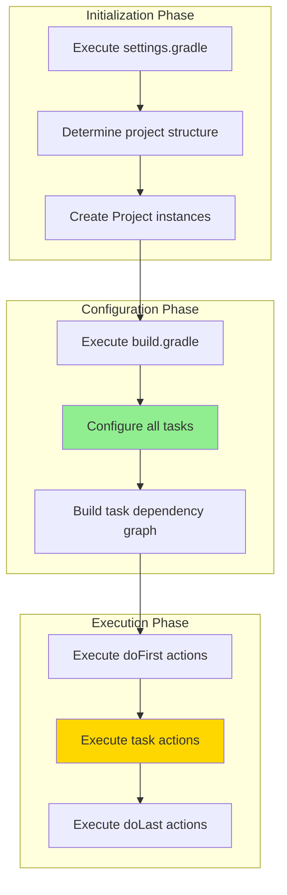
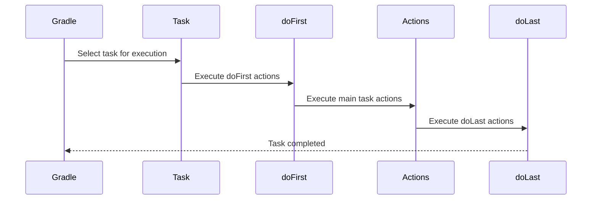
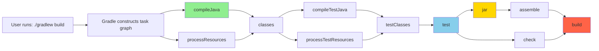

#gradle #dependency-manager #java #spring #spring-boot #build-lifecycle #quarkus #micronaut #kotlin #groovy
# Definition
- Gradle does not have predefined build lifecycles like Maven. Instead, it uses a <mark class="hltr-yellow">directed acyclic graph (DAG) of tasks</mark> that dynamically determines execution order based on task dependencies.
- Gradle has three distinct build phases:
1. **Initialization** - determines which projects participate in the build.
2. **Configuration** - configures tasks and builds the task dependency graph.
3. **Execution** - executes selected tasks in dependency order.
- Each task has its own lifecycle: `doFirst` → task actions → `doLast`
# Gradle Build Phases Architecture


## Build Phases
### 1. Initialization Phase
#### Purpose
- Determine which projects participate in the build (single or multi-project).
#### Input
- `settings.gradle` (Groovy DSL) or `settings.gradle.kts` (Kotlin DSL).
- `gradle.properties`.
#### Output
- Project hierarchy structure.
- `Project` instances for each participating project.
```groovy title='settings.gradle'
rootProject.name = 'my-application'

include 'core'
include 'web'
include 'api'
```

```kotlin title='settings.gradle.kts'
rootProject.name = "my-application"

include("core")
include("web")
include("api")
```
### 2. Configuration Phase
#### Purpose
- Execute build scripts and configure all tasks.
- Construct task dependency graph (DAG).
#### Input
- `build.gradle` or `build.gradle.kts` files.
- Plugin configurations.
- Task definitions.
#### Output
- Fully configured task graph.
- Task dependencies resolved.
- Ready-to-execute tasks.
```groovy title='build.gradle'
plugins {
    id 'java'
    id 'org.springframework.boot' version '3.2.0'
}

group = 'com.example'
version = '1.0.0'

repositories {
    mavenCentral()
}

dependencies {
    implementation 'org.springframework.boot:spring-boot-starter-web'
    testImplementation 'org.springframework.boot:spring-boot-starter-test'
}

tasks.named('test') {
    useJUnitPlatform()
}
```

```kotlin title='build.gradle.kts'
plugins {
    java
    id("org.springframework.boot") version "3.2.0"
}

group = "com.example"
version = "1.0.0"

repositories {
    mavenCentral()
}

dependencies {
    implementation("org.springframework.boot:spring-boot-starter-web")
    testImplementation("org.springframework.boot:spring-boot-starter-test")
}

tasks.named<Test>("test") {
    useJUnitPlatform()
}
```

### 3. Execution Phase
#### Purpose
- Execute tasks in dependency order according to the task graph.
#### Input
- Configured task graph.
- Task dependencies.
- Task actions.
#### Output
- Compiled classes.
- Test results.
- Packaged artifacts.
- Build reports.

```shell title='Execute tasks'
./gradlew build
```

# Task Lifecycle


## Task Lifecycle Hooks
```groovy title='Task lifecycle hooks'
tasks.register('customTask') {
    doFirst {
        println 'Executing before main task'
    }

    doLast {
        println 'Executing after main task'
    }
}

tasks.named('build') {
    doFirst {
        println 'Starting build...'
    }

    doLast {
        println 'Build completed!'
    }
}
```

```kotlin title='Task lifecycle hooks'
tasks.register("customTask") {
    doFirst {
        println("Executing before main task")
    }

    doLast {
        println("Executing after main task")
    }
}

tasks.named("build") {
    doFirst {
        println("Starting build...")
    }

    doLast {
        println("Build completed!")
    }
}
```
# Common Build Tasks
## Java Plugin Tasks
### `compileJava`
#### Purpose
- Compile production Java source files.
#### Input
- `src/main/java/**/*.java`.
- Dependencies from configurations.
#### Output
- Compiled `.class` files in `build/classes/java/main/`.
```shell title='compileJava task'
./gradlew compileJava
```
### test
#### Purpose
- Execute unit tests using JUnit or TestNG.
#### Input
- Compiled classes from `build/classes/java/main/`.
- Test source files from `src/test/java/`.
- Test dependencies.
#### Output
- Compiled test classes in `build/classes/java/test/`.
- Test results in `build/test-results/`.
- HTML test reports in `build/reports/tests/`.

```shell title='test task'
./gradlew test
```

```shell title='Skip tests'
./gradlew build -x test  # Exclude test task
```
### jar
#### Purpose
- Assemble JAR archive from compiled classes.
#### Input
- Compiled classes from `build/classes/java/main/`.
- Resources from `src/main/resources/`.
#### Output
- JAR file in `build/libs/<project-name>-<version>.jar`.

```shell title='jar task'
./gradlew jar
```
### build
#### Purpose
- Assemble and test the project.
#### Input
- All source files.
- Dependencies.
- Build configurations.
#### Output
- Compiled classes.
- Test results.
- Packaged JAR/WAR.

```shell title='build task'
./gradlew build
```
### clean
#### Purpose
- Delete the build directory and all generated files.
#### Input
- `build/` directory.
#### Output
- Deleted `build/` directory.

```shell title='clean task'
./gradlew clean
```
## Publishing Tasks
### publishToMavenLocal
#### Purpose
- Install artifact to local Maven repository (`~/.m2/repository`).
#### Input
- Built artifact from `build/libs/`.
- Publication metadata.
#### Output
- Artifact installed in `~/.m2/repository/<group>/<artifact>/<version>/`.
```groovy title='Maven publish plugin configuration'
plugins {
    id 'maven-publish'
}

publishing {
    publications {
        maven(MavenPublication) {
            from components.java
            groupId = 'com.example'
            artifactId = 'my-library'
            version = '1.0.0'
        }
    }
}
```

```kotlin title='Maven publish plugin configuration'
plugins {
    `maven-publish`
}

publishing {
    publications {
        create<MavenPublication>("maven") {
            from(components["java"])
            groupId = "com.example"
            artifactId = "my-library"
            version = "1.0.0"
        }
    }
}
```

```Shell title='Publish to local Maven repository'
./gradlew publishToMavenLocal
```
### publish
#### Purpose
- Publish artifact to configured remote repository.
#### Input
- Built artifact.
- Repository credentials.
- Publication configuration.
#### Output
- Artifact deployed to remote repository.
```groovy title='Remote repository configuration'
publishing {
    repositories {
        maven {
            name = 'myRepo'
            url = 'https://repo.example.com/releases'
            credentials {
                username = project.findProperty('repoUser')
                password = project.findProperty('repoPassword')
            }
        }
    }
}
```

```kotlin title='Remote repository configuration'
publishing {
    repositories {
        maven {
            name = "myRepo"
            url = uri("https://repo.example.com/releases")
            credentials {
                username = project.findProperty("repoUser") as String?
                password = project.findProperty("repoPassword") as String?
            }
        }
    }
}
```

```shell title='Publish to remote repository'
./gradlew publish
```
# Task Dependency Graph

## Task Dependencies
```groovy title='Custom task dependencies'
tasks.register('deployDev') {
    dependsOn 'build'
    doLast {
        println 'Deploying to dev environment...'
    }
}

tasks.register('integrationTest') {
    dependsOn 'test'
    mustRunAfter 'test'
    doLast {
        println 'Running integration tests...'
    }
}
```

```kotlin title='Custom task dependencies'
tasks.register("deployDev") {
    dependsOn("build")
    doLast {
        println("Deploying to dev environment...")
    }
}

tasks.register("integrationTest") {
    dependsOn("test")
    mustRunAfter("test")
    doLast {
        println("Running integration tests...")
    }
}
```
# Common Task Combinations

| Command                         | Tasks Executed                                                                                         | Use Case                          |
| ------------------------------- | ------------------------------------------------------------------------------------------------------ | --------------------------------- |
| `./gradlew clean`               | clean                                                                                                  | Remove build artifacts            |
| `./gradlew compileJava`         | compileJava                                                                                            | Quick compilation check           |
| `./gradlew test`                | compileJava → processResources → classes → compileTestJava → processTestResources → testClasses → test | Run unit tests                    |
| `./gradlew jar`                 | compileJava → processResources → classes → jar                                                         | Create JAR artifact               |
| `./gradlew build`               | Complete build task graph                                                                              | Build and test project            |
| `./gradlew assemble`            | compileJava → processResources → classes → jar → assemble                                              | Build without tests               |
| `./gradlew clean build`         | clean → full build                                                                                     | Fresh build                       |
| `./gradlew build -x test`       | Build excluding tests                                                                                  | Fast build for development        |
| `./gradlew publishToMavenLocal` | build → publishToMavenLocal                                                                            | Install to local Maven repository |
# Maven vs Gradle Lifecycle Comparison

| Maven Phase | Gradle Task | Description |
|-------------|-------------|-------------|
| `validate` | N/A | Gradle validates during configuration phase |
| `compile` | `compileJava` | Compile source code |
| `test` | `test` | Run unit tests |
| `package` | `jar` / `war` | Create distributable artifact |
| `verify` | `check` | Run verification tasks |
| `install` | `publishToMavenLocal` | Install to local repository |
| `deploy` | `publish` | Deploy to remote repository |
| `clean` | `clean` | Remove build artifacts |

# Task Configuration vs Execution
```groovy title='Configuration vs Execution'
// Configuration phase - always executes
println 'Configuring project...'

tasks.register('example') {
    // Configuration phase - always executes
    println 'Configuring task...'

    // Execution phase - only when task runs
    doLast {
        println 'Executing task...'
    }
}
```

```kotlin title='Configuration vs Execution'
// Configuration phase - always executes
println("Configuring project...")

tasks.register("example") {
    // Configuration phase - always executes
    println("Configuring task...")

    // Execution phase - only when task runs
    doLast {
        println("Executing task...")
    }
}
```

# Build Lifecycle Hooks
```groovy title='Gradle lifecycle hooks'
gradle.beforeProject { project ->
    println "Configuring ${project.name}"
}

gradle.afterProject { project ->
    println "Configured ${project.name}"
}

gradle.taskGraph.whenReady { graph ->
    println "Task graph ready with ${graph.allTasks.size()} tasks"
}

gradle.buildFinished { result ->
    println "Build finished: ${result.failure ? 'FAILED' : 'SUCCESS'}"
}
```

```kotlin title='Gradle lifecycle hooks'
gradle.beforeProject {
    println("Configuring ${project.name}")
}

gradle.afterProject {
    println("Configured ${project.name}")
}

gradle.taskGraph.whenReady {
    println("Task graph ready with ${allTasks.size} tasks")
}

gradle.buildFinished {
    println("Build finished: ${failure?.let { "FAILED" } ?: "SUCCESS"}")
}
```
# Directory Structure Input/Output

```
project-root/
├── build.gradle.kts          # INPUT: Build configuration (Kotlin DSL)
├── build.gradle              # INPUT: Build configuration (Groovy DSL)
├── settings.gradle.kts       # INPUT: Multi-project settings (Kotlin DSL)
├── settings.gradle           # INPUT: Multi-project settings (Groovy DSL)
├── gradle.properties         # INPUT: Build properties
├── src/
│   ├── main/
│   │   ├── java/            # INPUT: Source code
│   │   └── resources/       # INPUT: Resources
│   └── test/
│       ├── java/            # INPUT: Test code
│       └── resources/       # INPUT: Test resources
└── build/                    # OUTPUT: All generated files
    ├── classes/
    │   ├── java/main/       # OUTPUT: Compiled main classes
    │   └── java/test/       # OUTPUT: Compiled test classes
    ├── resources/
    │   ├── main/            # OUTPUT: Processed main resources
    │   └── test/            # OUTPUT: Processed test resources
    ├── libs/                # OUTPUT: Packaged artifacts (JAR/WAR)
    ├── test-results/        # OUTPUT: Test results (XML)
    ├── reports/
    │   └── tests/           # OUTPUT: Test reports (HTML)
    └── tmp/                 # OUTPUT: Temporary build files
```
---
# References
1. https://docs.gradle.org/current/userguide/build_lifecycle.html - Official Gradle Build Lifecycle documentation
2. https://docs.gradle.org/current/userguide/kotlin_dsl.html - Kotlin DSL reference
3. https://docs.gradle.org/current/userguide/tutorial_using_tasks.html - Task configuration and usage
