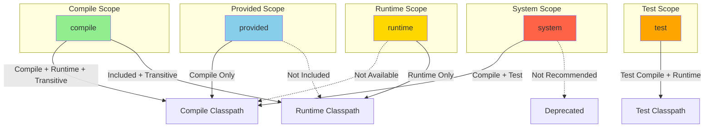
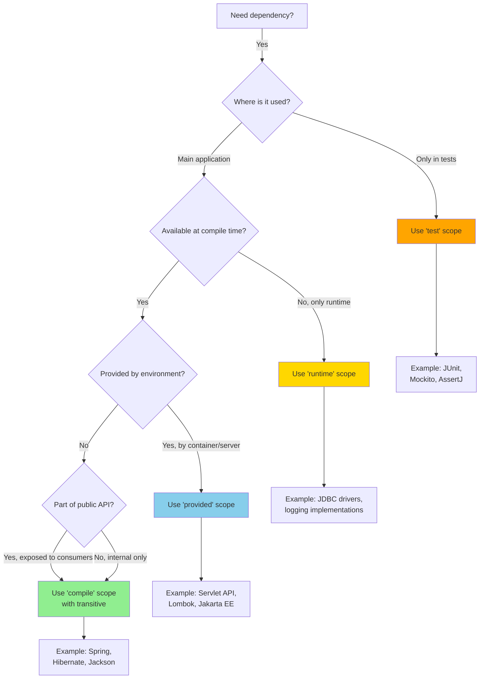
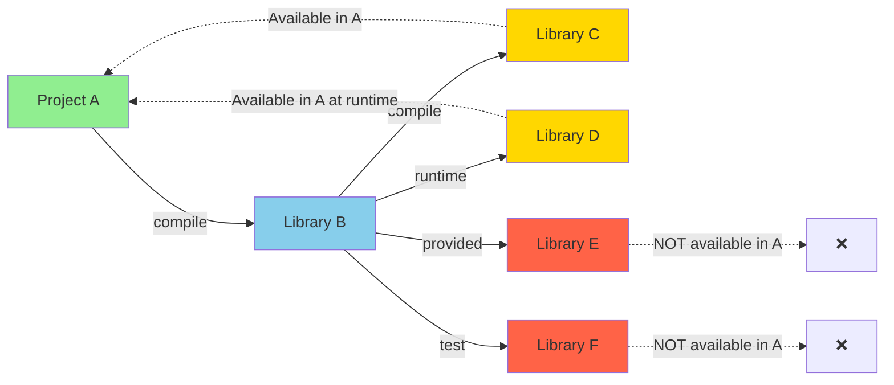

#maven #dependency-manager #java #spring #spring-boot #quarkus #micronaut #build-lifecycle 
#continuous-delivery #continuous-integration #site-realibility-engineering #solid #software-engineering 
#software-architecture 
# Definition
- Maven dependency scopes define <mark class="hltr-yellow">when and where dependencies are available</mark> during the build lifecycle.
- Each scope determines:
    - **Compile-time availability** - whether the dependency is available during compilation.
    - **Runtime availability** - whether the dependency is included in the runtime classpath.
    - **Transitive propagation** - whether the dependency is passed to consumers.
    - **Test availability** - whether the dependency is available during testing.
- Maven provides six dependency scopes: `compile`, `provided`, `runtime`, `test`, `system`, and `import`.
# Dependency Scope Visibility



# Maven Dependency Scopes

## `compile` (Default)
### Purpose
- Default scope for dependencies needed at <mark class="hltr-yellow">compile-time and runtime</mark>.
- Dependencies are **transitively propagated** to consumers.
### Compile-time
- Available during compilation.
### Runtime
- Included in the runtime classpath.
### Test
- Available during test compilation and execution.
### Transitive
- **Propagated** to dependent projects.
### Use Case
- Business logic libraries.
- Framework dependencies (Spring, Hibernate).
- Utility libraries used in public APIs.

```xml title='compile scope'
<dependencies>
    <!-- Default scope (compile) - explicitly declared -->
    <dependency>
        <groupId>org.springframework.boot</groupId>
        <artifactId>spring-boot-starter-web</artifactId>
        <scope>compile</scope>
    </dependency>

    <!-- Scope omitted - defaults to compile -->
    <dependency>
        <groupId>org.apache.commons</groupId>
        <artifactId>commons-lang3</artifactId>
        <version>3.13.0</version>
    </dependency>

    <dependency>
        <groupId>com.fasterxml.jackson.core</groupId>
        <artifactId>jackson-databind</artifactId>
        <version>2.15.2</version>
    </dependency>

    <dependency>
        <groupId>org.hibernate</groupId>
        <artifactId>hibernate-core</artifactId>
        <version>6.2.7.Final</version>
    </dependency>
</dependencies>
```
## `provided`
### Purpose
- Dependencies available at <mark class="hltr-yellow">compile-time but provided by runtime environment</mark>.
- **Not packaged** in the final artifact (WAR, JAR).
### Compile-time
- Available during compilation.
### Runtime
- **Not included** - expected to be provided by container or JDK.
### Test
- Available during test compilation and execution.
### Transitive
- **Not propagated** to dependent projects.
### Use Case
- Servlet API (provided by Tomcat, Jetty).
- Jakarta EE APIs (provided by application servers).
- Lombok (compile-time code generation).
```xml title='provided scope'
<dependencies>
    <!-- Servlet API - provided by web container -->
    <dependency>
        <groupId>jakarta.servlet</groupId>
        <artifactId>jakarta.servlet-api</artifactId>
        <version>6.0.0</version>
        <scope>provided</scope>
    </dependency>

    <!-- Lombok - compile-time only -->
    <dependency>
        <groupId>org.projectlombok</groupId>
        <artifactId>lombok</artifactId>
        <version>1.18.30</version>
        <scope>provided</scope>
    </dependency>

    <!-- Jakarta EE API - provided by application server -->
    <dependency>
        <groupId>jakarta.platform</groupId>
        <artifactId>jakarta.jakartaee-api</artifactId>
        <version>10.0.0</version>
        <scope>provided</scope>
    </dependency>

    <!-- JSR-305 annotations -->
    <dependency>
        <groupId>com.google.code.findbugs</groupId>
        <artifactId>jsr305</artifactId>
        <version>3.0.2</version>
        <scope>provided</scope>
    </dependency>
</dependencies>
```
## `runtime`
### Purpose
- Dependencies needed <mark class="hltr-yellow">only at runtime</mark>, not during compilation.
- Used for implementation-specific dependencies.
### Compile-time
- **Not available** during compilation.
### Runtime
- Included in the runtime classpath.
### Test
- Available during test execution (not test compilation).
### Transitive
- Propagated to dependent projects.
### Use Case
- JDBC drivers (compile against interfaces, run with implementations).
- Logging implementations (SLF4J bindings).
- Runtime-specific libraries.
```xml title='runtime scope'
<dependencies>
    <!-- PostgreSQL JDBC driver -->
    <dependency>
        <groupId>org.postgresql</groupId>
        <artifactId>postgresql</artifactId>
        <version>42.6.0</version>
        <scope>runtime</scope>
    </dependency>

    <!-- MySQL JDBC driver -->
    <dependency>
        <groupId>mysql</groupId>
        <artifactId>mysql-connector-java</artifactId>
        <version>8.0.33</version>
        <scope>runtime</scope>
    </dependency>

    <!-- Logback implementation for SLF4J -->
    <dependency>
        <groupId>ch.qos.logback</groupId>
        <artifactId>logback-classic</artifactId>
        <version>1.4.11</version>
        <scope>runtime</scope>
    </dependency>

    <!-- H2 in-memory database -->
    <dependency>
        <groupId>com.h2database</groupId>
        <artifactId>h2</artifactId>
        <version>2.2.224</version>
        <scope>runtime</scope>
    </dependency>
</dependencies>
```
## `test`
### Purpose
- Dependencies needed <mark class="hltr-yellow">only for test compilation and execution</mark>.
- **Not included** in production builds.
### Compile-time
- **Not available** for main source compilation.
### Runtime
- **Not included** in runtime classpath.
### Test
- Available during test compilation and execution.
### Transitive
- **Not propagated** to dependent projects.
### Use Case
- Testing frameworks (JUnit, TestNG).
- Mocking libraries (Mockito).
- Assertion libraries (AssertJ, Hamcrest).
- Test containers and utilities.
```xml title='test scope'
<dependencies>
    <!-- JUnit 5 for testing -->
    <dependency>
        <groupId>org.junit.jupiter</groupId>
        <artifactId>junit-jupiter</artifactId>
        <version>5.10.0</version>
        <scope>test</scope>
    </dependency>

    <!-- Mockito for mocking -->
    <dependency>
        <groupId>org.mockito</groupId>
        <artifactId>mockito-core</artifactId>
        <version>5.7.0</version>
        <scope>test</scope>
    </dependency>

    <!-- AssertJ for fluent assertions -->
    <dependency>
        <groupId>org.assertj</groupId>
        <artifactId>assertj-core</artifactId>
        <version>3.24.2</version>
        <scope>test</scope>
    </dependency>

    <!-- Spring Boot Test -->
    <dependency>
        <groupId>org.springframework.boot</groupId>
        <artifactId>spring-boot-starter-test</artifactId>
        <scope>test</scope>
    </dependency>

    <!-- Testcontainers for integration testing -->
    <dependency>
        <groupId>org.testcontainers</groupId>
        <artifactId>postgresql</artifactId>
        <version>1.19.3</version>
        <scope>test</scope>
    </dependency>

    <!-- REST Assured for API testing -->
    <dependency>
        <groupId>io.rest-assured</groupId>
        <artifactId>rest-assured</artifactId>
        <version>5.3.2</version>
        <scope>test</scope>
    </dependency>
</dependencies>
```
## `system`
### Purpose
- Similar to `provided`, but JAR must be <mark class="hltr-yellow">explicitly provided via system path</mark>.
- **Deprecated** - not recommended for use.
### Compile-time
- Available during compilation.
### Runtime
- **Not included** in runtime classpath.
### Test
- Available during testing.
### Transitive
- **Not propagated**.
### Use Case
- Legacy local JAR files not in repositories.
- **Avoid using** - use local repository installation instead.

```xml title='system scope (not recommended)'
<dependencies>
    <!-- System dependency - NOT RECOMMENDED -->
    <dependency>
        <groupId>com.example</groupId>
        <artifactId>legacy-library</artifactId>
        <version>1.0.0</version>
        <scope>system</scope>
        <systemPath>${project.basedir}/lib/legacy-library.jar</systemPath>
    </dependency>
</dependencies>
```

**Better alternative:**
```shell title='Install local JAR to local repository'
# Install JAR to local Maven repository
mvn install:install-file \
    -Dfile=legacy-library.jar \
    -DgroupId=com.example \
    -DartifactId=legacy-library \
    -Dversion=1.0.0 \
    -Dpackaging=jar

# Then use as normal dependency
```

```xml title='Use installed local dependency'
<dependency>
    <groupId>com.example</groupId>
    <artifactId>legacy-library</artifactId>
    <version>1.0.0</version>
</dependency>
```
## `import`
### Purpose
- Special scope used only in `<dependencyManagement>`.
- Imports dependency versions from a BOM (Bill of Materials).
### Use Case
- Managing dependency versions from platform BOMs.
- Spring Boot BOM, Spring Cloud BOM.

```xml title='import scope with BOM'
<dependencyManagement>
    <dependencies>
        <!-- Import Spring Boot BOM -->
        <dependency>
            <groupId>org.springframework.boot</groupId>
            <artifactId>spring-boot-dependencies</artifactId>
            <version>3.2.0</version>
            <type>pom</type>
            <scope>import</scope>
        </dependency>

        <!-- Import Spring Cloud BOM -->
        <dependency>
            <groupId>org.springframework.cloud</groupId>
            <artifactId>spring-cloud-dependencies</artifactId>
            <version>2023.0.0</version>
            <type>pom</type>
            <scope>import</scope>
        </dependency>
    </dependencies>
</dependencyManagement>

<dependencies>
    <!-- Version inherited from BOM -->
    <dependency>
        <groupId>org.springframework.boot</groupId>
        <artifactId>spring-boot-starter-web</artifactId>
    </dependency>

    <dependency>
        <groupId>org.springframework.cloud</groupId>
        <artifactId>spring-cloud-starter-netflix-eureka-client</artifactId>
    </dependency>
</dependencies>
```

# Scope Comparison Table

| Scope | Compile Classpath | Runtime Classpath | Test Classpath | Transitive | Common Use Cases |
|-------|-------------------|-------------------|----------------|------------|------------------|
| `compile` | ✅ Yes | ✅ Yes | ✅ Yes | ✅ Yes | Business logic, frameworks, utilities |
| `provided` | ✅ Yes | ❌ No | ✅ Yes | ❌ No | Servlet API, Lombok, Jakarta EE APIs |
| `runtime` | ❌ No | ✅ Yes | ✅ Runtime only | ✅ Yes | JDBC drivers, logging implementations |
| `test` | ❌ No | ❌ No | ✅ Yes | ❌ No | JUnit, Mockito, testing utilities |
| `system` | ✅ Yes | ❌ No | ✅ Yes | ❌ No | **Deprecated - avoid using** |
| `import` | N/A | N/A | N/A | N/A | BOM imports in `<dependencyManagement>` |

# Scope Decision Flowchart



# Transitive Dependency Behavior



## Transitive Scope Resolution

| Dependency's Scope in B | Project A depends on B with scope | Resulting scope in A |
| ----------------------- | --------------------------------- | -------------------- |
| `compile`               | `compile`                         | `compile`            |
| `compile`               | `runtime`                         | `runtime`            |
| `compile`               | `provided`                        | `provided`           |
| `runtime`               | `compile`                         | `runtime`            |
| `runtime`               | `runtime`                         | `runtime`            |
| `provided`              | `compile`                         | `provided`           |
| `provided`              | `runtime`                         | `provided`           |
| `test`                  | any                               | - (not included)     |
- The `test` scope does not allow its dependency to propagate to another project.
- The `provided` scope definitely propagates its dependency scope because the dependency is completely supported by the environment.
- The `runtime` scope also propagates its dependency scope because it is only needed at runtime, not build time.
- The `compile` scope, however, cannot block or propagate its dependency scope. It is transparent pass-through.
# Dependency Management Best Practices

## Use `compile` scope by default
- Default scope for most dependencies.
- Explicitly declare scope only when different from `compile`.
```xml title='Default compile scope'
<!-- Scope omitted - defaults to compile -->
<dependency>
    <groupId>org.springframework.boot</groupId>
    <artifactId>spring-boot-starter-web</artifactId>
</dependency>
```
## Use `provided` for container-supplied dependencies
- Servlet API, Jakarta EE APIs.
- Compile-time annotation processors (Lombok).
```xml title='Provided scope for container dependencies'
<dependency>
    <groupId>jakarta.servlet</groupId>
    <artifactId>jakarta.servlet-api</artifactId>
    <version>6.0.0</version>
    <scope>provided</scope>
</dependency>
```
## Use `runtime` for implementation-agnostic dependencies
- JDBC drivers - compile against JDBC API, run with specific driver.
- Logging implementations - compile against SLF4J API, bind at runtime.
```xml title='Runtime scope for drivers'
<!-- Compile against SLF4J API -->
<dependency>
    <groupId>org.slf4j</groupId>
    <artifactId>slf4j-api</artifactId>
    <version>2.0.9</version>
</dependency>

<!-- Runtime implementation -->
<dependency>
    <groupId>ch.qos.logback</groupId>
    <artifactId>logback-classic</artifactId>
    <version>1.4.11</version>
    <scope>runtime</scope>
</dependency>
```
## Isolate test dependencies with `test` scope
- Prevents test dependencies from polluting production classpath.

```xml title='Test scope isolation'
<!-- ❌ Bad - test dependency in compile scope -->
<dependency>
    <groupId>org.junit.jupiter</groupId>
    <artifactId>junit-jupiter</artifactId>
    <version>5.10.0</version>
</dependency>

<!-- ✅ Good - test dependency properly scoped -->
<dependency>
    <groupId>org.junit.jupiter</groupId>
    <artifactId>junit-jupiter</artifactId>
    <version>5.10.0</version>
    <scope>test</scope>
</dependency>
```
## Use BOM imports for version management
- Centralize dependency version management.
- Ensures compatible dependency versions.
```xml title='BOM import best practice'
<dependencyManagement>
    <dependencies>
        <dependency>
            <groupId>org.springframework.boot</groupId>
            <artifactId>spring-boot-dependencies</artifactId>
            <version>3.2.0</version>
            <type>pom</type>
            <scope>import</scope>
        </dependency>
    </dependencies>
</dependencyManagement>
```
## Avoid `system` scope
- **Deprecated** and not portable.
- Use `mvn install:install-file` instead.
# Real-World Example

```xml title='Complete dependency scope example'
<project>
    <dependencyManagement>
        <dependencies>
            <!-- Import Spring Boot BOM for version management -->
            <dependency>
                <groupId>org.springframework.boot</groupId>
                <artifactId>spring-boot-dependencies</artifactId>
                <version>3.2.0</version>
                <type>pom</type>
                <scope>import</scope>
            </dependency>
        </dependencies>
    </dependencyManagement>

    <dependencies>
        <!-- COMPILE SCOPE - Default, available everywhere -->
        <dependency>
            <groupId>org.springframework.boot</groupId>
            <artifactId>spring-boot-starter-web</artifactId>
        </dependency>

        <dependency>
            <groupId>org.springframework.boot</groupId>
            <artifactId>spring-boot-starter-data-jpa</artifactId>
        </dependency>

        <dependency>
            <groupId>com.fasterxml.jackson.core</groupId>
            <artifactId>jackson-databind</artifactId>
        </dependency>

        <!-- PROVIDED SCOPE - Compile-time only -->
        <dependency>
            <groupId>org.projectlombok</groupId>
            <artifactId>lombok</artifactId>
            <version>1.18.30</version>
            <scope>provided</scope>
        </dependency>

        <dependency>
            <groupId>jakarta.servlet</groupId>
            <artifactId>jakarta.servlet-api</artifactId>
            <scope>provided</scope>
        </dependency>

        <!-- RUNTIME SCOPE - Runtime only -->
        <dependency>
            <groupId>org.postgresql</groupId>
            <artifactId>postgresql</artifactId>
            <scope>runtime</scope>
        </dependency>

        <dependency>
            <groupId>com.h2database</groupId>
            <artifactId>h2</artifactId>
            <scope>runtime</scope>
        </dependency>

        <!-- TEST SCOPE - Testing only -->
        <dependency>
            <groupId>org.springframework.boot</groupId>
            <artifactId>spring-boot-starter-test</artifactId>
            <scope>test</scope>
        </dependency>

        <dependency>
            <groupId>org.testcontainers</groupId>
            <artifactId>postgresql</artifactId>
            <version>1.19.3</version>
            <scope>test</scope>
        </dependency>
    </dependencies>
</project>
```

# Gradle vs Maven Scope Mapping

| Maven Scope | Gradle Configuration | Notes |
|------------|---------------------|-------|
| `compile` | `api` or `implementation` | Use `implementation` by default in Gradle |
| `provided` | `compileOnly` | Not included in runtime |
| `runtime` | `runtimeOnly` | Only available at runtime |
| `test` | `testImplementation` | Test dependencies |
| `system` | N/A | Deprecated in both |
| `import` | Platform dependencies | Use `platform()` in Gradle |

---
# References
1. https://maven.apache.org/guides/introduction/introduction-to-dependency-mechanism.html - Official Maven Dependency Mechanism
2. https://maven.apache.org/pom.html#Dependencies - Maven POM Reference
3. https://maven.apache.org/guides/introduction/introduction-to-optional-and-excludes-dependencies.html - Optional and Excluded Dependencies
4. https://www.baeldung.com/maven-dependency-scopes - Maven Dependency Scopes Guide
