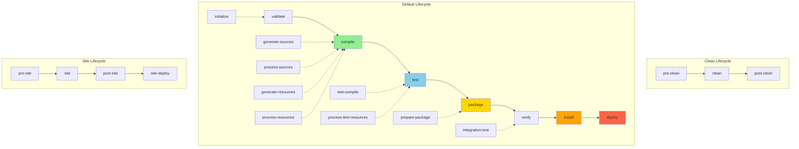
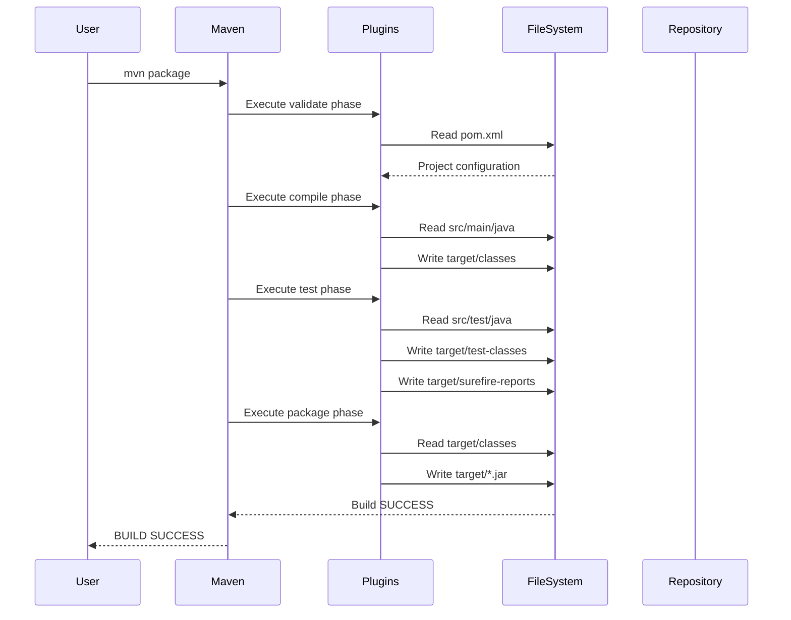
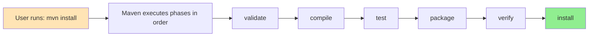

#maven #dependency-manager #java #spring #spring-boot #build-lifecycle #quarkus #micronaut 
# Definition
- A build lifecycle is a well-defined <mark class="hltr-yellow">sequence of phases</mark> that define the order in which goals are executed. Maven has three built-in build lifecycles:
1. **default** - handles project deployment
2. **clean** - handles project cleaning
3. **site** - handles project site documentation creation
- Each lifecycle consists of a sequence of **phases**, and each phase consists of a sequence of **goals**. When a phase is executed, all previous phases in the lifecycle are executed first.
# Maven Build Lifecycles Architecture



## Default Lifecycle Phases
### 1. validate
#### Purpose
- Validate the project is correct and all necessary information is available.
#### Input
- `pom.xml` file.
- Project structure.
#### Output
- Validation status.
- Error messages if configuration is invalid.
```Shell title='validate phase'
mvn validate
```
### 2. compile
#### Purpose
 - Compile the source code of the project.
#### Input
- `src/main/java/**/*.java` (source files).
- `src/main/resources/**/*` (resource files).
- Dependencies from `pom.xml`.
#### Output
- Compiled `.class` files in `target/classes/`.
- Processed resources in `target/classes/`.
```Shell title='compile phase'
mvn compile
```
### 3. test
#### Purpose
- Test the compiled source code using a suitable unit testing framework.
#### Input
- Compiled classes from `target/classes/`
- Test source files from `src/test/java/`
- Test resources from `src/test/resources/`
- Test dependencies.
#### Output
- Compiled test classes in `target/test-classes/`
- Test results in `target/surefire-reports/`
- Console output with test summary (passed/failed/skipped).
```Shell title='test phase'
mvn test
```

```Shell title='Skip tests'
mvn test -DskipTests         # Compile tests but don't run
mvn test -Dmaven.test.skip=true  # Don't compile or run tests
```
### 4. package
#### Purpose
- Package compiled code into distributable format (JAR, WAR, EAR).
#### Input
- Compiled classes from `target/classes/`.
- Resources.
- `pom.xml` metadata (version, artifact name, packaging type).
#### Output
- Packaged artifact in `target/` directory:
  - `target/<artifactId>-<version>.jar` (for JAR packaging)
  - `target/<artifactId>-<version>.war` (for WAR packaging)
```Shell title='package phase'
mvn package
```
### 5. verify
#### Purpose 
- Run integration tests and checks to ensure *quality criteria* are met.
#### Input
- Packaged artifact from `target/`
- Integration test configurations.
- Quality check plugins (e.g., Checkstyle, PMD)
##### Output
- Integration test results.
- Quality check reports.
- Verification status.
```Shell title='verify phase'
mvn verify
```
### 6. install
#### Purpose
- Install the package into the local repository (`~/.m2/repository`)
#### Input
- Packaged artifact from `target/`.
- `pom.xml` metadata.
#### Output
- Artifact installed in local Maven repository:
    - `~/.m2/repository/<groupId>/<artifactId>/<version>/<artifactId>-<version>.jar`
    - `~/.m2/repository/<groupId>/<artifactId>/<version>/<artifactId>-<version>.pom`
```Shell title='Install phase'
mvn install
```
### 7. deploy
#### Purpose
- Copy the final package to remote repository for sharing with other developers.
#### Input
- Packaged artifact from `target/`
- `pom.xml` with `<distributionManagement>` configuration.
- Remote repository credentials.
#### Output
- Artifact deployed to remote repository (Nexus, Artifactory, etc).
- Updated repository metadata.
```Shell title='Deploy phase'
mvn deploy
```
## Clean Lifecycle Phases
### clean
#### Purpose
- Remove all files generated by the previous build.
#### Input 
- `target/` directory
#### Output
- Deleted `target/` directory and all contents
```Shell title='clean phase'
mvn clean
```
#### Usage
```Shell title='Common usage of clean phase'
mvn clean install    # Clean then install
mvn clean package    # Clean then package
```
## Site Lifecycle Phases
### site
#### Purpose
- Generate project documentation and reports.
#### Input
- `src/site/` directory (if exists)
- `pom.xml` project information
- Generated reports (JavaDoc, test coverage, etc.)
#### Output
- Project site in `target/site/`
- HTML documentation.
- Generated reports.
```Shell title='site phase'
mvn site
```
### site-deploy
#### Purpose
- Deploy generated site to remote web server.
#### Input
- Generated site from `target/site/`.
- Site deployment configuration from `pom.xml`.
#### Output
- Site deployed to configured server,
```Shell title='site deplou phase'
mvn site-deploy
```
# Phase Execution Flow

## Common Lifecycle Combinations

| Command | Phases Executed | Use Case |
|---------|----------------|----------|
| `mvn clean` | pre-clean → clean → post-clean | Remove build artifacts |
| `mvn compile` | validate → compile | Quick compilation check |
| `mvn test` | validate → compile → test | Run unit tests |
| `mvn package` | validate → compile → test → package | Create distributable artifact |
| `mvn verify` | validate → compile → test → package → verify | Run integration tests |
| `mvn install` | All phases up to install | Install to local repository |
| `mvn deploy` | Complete default lifecycle | Deploy to remote repository |
| `mvn clean install` | Clean lifecycle + default lifecycle up to install | Fresh build and install |
| `mvn clean package -DskipTests` | Clean + package without tests | Fast packaging for development |
## Lifecycle Phase Dependencies



- When a specific phase is executed, all preceding phases in the lifecycle are automatically executed first.
## Plugin Goals Binding
- Each lifecycle phase has default plugin goals bound to it based on packaging type:
### JAR Packaging
- `compile` → `compiler:compile`
- `test` → `surefire:test`
- `package` → `jar:jar`
- `install` → `install:install`
- `deploy` → `deploy:deploy`
### WAR Packaging
- `compile` → `compiler:compile`
- `test` → `surefire:test`
- `package` → `war:war`
- `install` → `install:install`
- `deploy` → `deploy:deploy`
# Directory Structure Input/Output
```
project-root/
├── pom.xml                    # INPUT: Project configuration
├── src/
│   ├── main/
│   │   ├── java/             # INPUT: Source code
│   │   └── resources/        # INPUT: Resources
│   └── test/
│       ├── java/             # INPUT: Test code
│       └── resources/        # INPUT: Test resources
└── target/                    # OUTPUT: All generated files
    ├── classes/              # OUTPUT: Compiled main classes
    ├── test-classes/         # OUTPUT: Compiled test classes
    ├── surefire-reports/     # OUTPUT: Test results
    ├── <artifact>-<version>.jar  # OUTPUT: Packaged artifact
    └── site/                 # OUTPUT: Generated documentation
```
---
# References
1. https://contabo.com/blog/maven-commands-cheat-sheet/ for maven commands
2. https://maven.apache.org/guides/introduction/introduction-to-the-lifecycle.html - Official Maven lifecycle documentation
