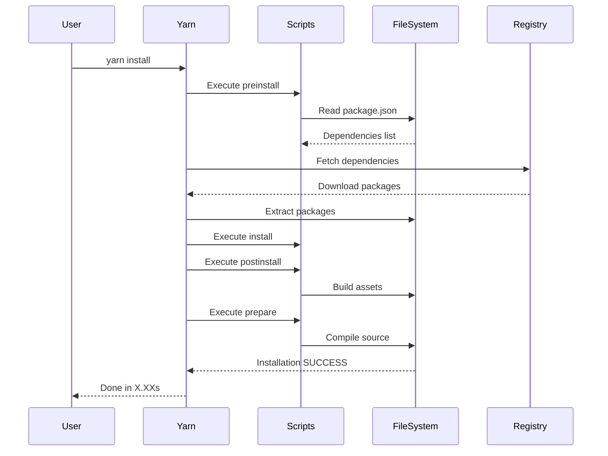
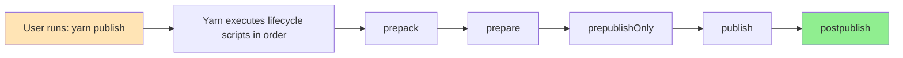

#shell #yarn #dependency-manager #javascript #react #continuous-delivery #continuous-integration
#site-realibility-engineering #software-engineering #angular #nodejs #build-lifecycle #typescript
# Formal Definition
- Yarn is built around the concept of **lifecycle scripts**, similar to npm. Lifecycle scripts are <mark class="hltr-yellow">special hooks that run automatically</mark> at different points during package operations (install, publish, pack, etc.).
- Yarn has two major versions with different behaviors:
  1. **Yarn Classic (v1)** - Compatible with npm's lifecycle approach
  2. **Yarn Berry/Modern (v2+)** - Modernized package manager with Plug'n'Play (PnP) mode
- Yarn lifecycle scripts include:
  1. **Built-in lifecycle scripts** - automatically executed during specific Yarn operations (install, publish, pack)
  2. **Custom scripts** - user-defined commands that can be run with `yarn run <script-name>` or simply `yarn <script-name>`
- Each lifecycle script can have **pre** and **post** hooks that run before and after the main script. For example, `preinstall` runs before `install`, and `postinstall` runs after `install`.

# Yarn Lifecycle Architecture

```mermaid title='Yarn lifecycle'
graph TB
    subgraph "Install Lifecycle"
        I1[preinstall]
        I2[install]
        I3[postinstall]
        I4[preprepare]
        I5[prepare]
        I6[postprepare]

        I1 --> I2 --> I3 --> I4 --> I5 --> I6
    end

    subgraph "Publish Lifecycle (Yarn Classic)"
        P1[prepublish]
        P2[prepare]
        P3[prepublishOnly]
        P4[prepack]
        P5[postpack]
        P6[publish]
        P7[postpublish]

        P1 --> P2 --> P3 --> P4 --> P5 --> P6 --> P7
    end

    subgraph "Pack Lifecycle"
        K1[prepack]
        K2[postpack]

        K1 --> K2
    end

    subgraph "Custom Script Lifecycle"
        C1[pre&lt;script&gt;]
        C2[&lt;script&gt;]
        C3[post&lt;script&gt;]

        C1 --> C2 --> C3
    end

    style I2 fill:#90EE90
    style I3 fill:#87CEEB
    style I5 fill:#FFD700
    style P3 fill:#FFA500
    style P6 fill:#FF6347
```



## Install Lifecycle Scripts

### 1. preinstall
#### Purpose
- Run before package dependencies are installed.
- Executed for the root package and all dependencies.

#### Input
- `package.json` file.
- Existing `node_modules/` directory (if any).

#### Output
- Custom pre-installation operations (environment checks, cleanup).

```json title='preinstall script'
{
  "scripts": {
    "preinstall": "node scripts/check-yarn-version.js"
  }
}
```

#### Yarn Classic vs Modern
- **Yarn Classic (v1)**: Runs `preinstall` for all packages.
- **Yarn Berry (v2+)**: Can be disabled globally with `enableScripts: false` in `.yarnrc.yml`.

### 2. install
#### Purpose
- Run after the package is installed but before its dependencies.

#### Input
- Installed package in `node_modules/`.
- `package.json` configuration.

#### Output
- Custom installation operations (compile native modules).

```json title='install script'
{
  "scripts": {
    "install": "node-gyp rebuild"
  }
}
```

**Note**: Yarn Classic executes `install` scripts; Yarn Berry requires explicit configuration.

### 3. postinstall
#### Purpose
- Run after the package and all its dependencies are installed.
- <mark class="hltr-yellow">Most commonly used lifecycle hook</mark> for build steps.

#### Input
- Fully installed `node_modules/` directory.
- All dependencies available.

#### Output
- Post-installation tasks (build assets, patch dependencies, setup configuration).

```json title='postinstall script'
{
  "scripts": {
    "postinstall": "yarn run build && patch-package"
  }
}
```

#### Common Use Cases
- Building TypeScript/Babel projects
- Applying patches with `patch-package`
- Generating configuration files
- Running setup scripts

### 4. prepare
#### Purpose
- Run before the package is packed or published, and on local `yarn install` without arguments.
- Replaced `prepublish` in Yarn Classic.

#### Input
- Source files.
- `package.json` configuration.
- Development dependencies.

#### Output
- Compiled/transpiled code.
- Built distribution files.

```json title='prepare script'
{
  "scripts": {
    "prepare": "tsc && yarn run bundle"
  }
}
```

#### Usage
- Runs automatically during:
  - `yarn install` (in package root without arguments)
  - `yarn publish`
  - Git dependencies installation
  - Local `yarn link`

## Publish Lifecycle Scripts

### 1. prepublishOnly
#### Purpose
- Run before the package is prepared and packed, only on `yarn publish`.
- Ideal for running tests and validation before publishing.

#### Input
- Source code.
- `package.json` configuration.

#### Output
- Pre-publish validation results.
- Test execution status.

```json title='prepublishOnly script'
{
  "scripts": {
    "prepublishOnly": "yarn test && yarn run lint"
  }
}
```

### 2. prepack
#### Purpose
- Run before a tarball is packed (during `yarn pack` and `yarn publish`).

#### Input
- Source files.
- `package.json` metadata.

#### Output
- Prepared files for packing.

```json title='prepack script'
{
  "scripts": {
    "prepack": "yarn run build && yarn run clean:tests"
  }
}
```

### 3. postpack
#### Purpose
- Run after the tarball has been generated.

#### Input
- Generated tarball file.

#### Output
- Post-pack operations (cleanup, notifications).

```json title='postpack script'
{
  "scripts": {
    "postpack": "rm -rf dist/temp"
  }
}
```

### 4. publish
#### Purpose
- Run during `yarn publish` after packing but before uploading.

#### Input
- Packed tarball.
- Registry configuration.

#### Output
- Custom publish operations.

```json title='publish script'
{
  "scripts": {
    "publish": "echo Publishing to npm registry..."
  }
}
```

### 5. postpublish
#### Purpose
- Run after the package is successfully published to the registry.

#### Input
- Published package information.
- Registry response.

#### Output
- Notifications, git tags, announcements.

```json title='postpublish script'
{
  "scripts": {
    "postpublish": "git push --tags && yarn run announce"
  }
}
```

## Custom Script Hooks

### Pre and Post Hooks
#### Purpose
- Run custom scripts before and after any user-defined script.
- Yarn automatically recognizes `pre*` and `post*` patterns.

#### Input
- Context from main script.

#### Output
- Setup/teardown operations.

```json title='Custom script with hooks'
{
  "scripts": {
    "prebuild": "rimraf dist",
    "build": "tsc",
    "postbuild": "cp -r public dist/",

    "pretest": "yarn run lint",
    "test": "jest",
    "posttest": "yarn run coverage",

    "prestart": "yarn run build",
    "start": "node dist/index.js",
    "poststart": "echo Server started successfully"
  }
}
```

#### Usage
```bash title='Running custom scripts'
yarn build     # Executes: prebuild → build → postbuild
yarn test      # Executes: pretest → test → posttest
yarn start     # Executes: prestart → start → poststart
```

## Common Yarn Commands

### 1. yarn install
#### Purpose
- Install all dependencies defined in `package.json`.

#### Input
- `package.json` file.
- `yarn.lock` file (lockfile).

#### Output
- Installed dependencies in `node_modules/` (Yarn Classic) or `.yarn/cache/` (Yarn Berry PnP).
- Updated `yarn.lock` if needed.

```bash title='yarn install variants'
yarn install
yarn install --frozen-lockfile  # CI mode: fail if lock file needs update
yarn install --production       # Install only production dependencies
yarn install --force            # Refetch all packages
yarn install --ignore-scripts   # Skip lifecycle scripts
```

**Lifecycle executed**: preinstall → install → postinstall → prepare

#### Yarn Classic vs Berry
- **Classic (v1)**: Creates `node_modules/` directory with nested structure.
- **Berry (v2+)**: Uses Plug'n'Play (PnP) by default, no `node_modules/` unless configured.

### 2. yarn add
#### Purpose
- Add a new dependency to the project.

#### Input
- Package name and version.
- `package.json` and `yarn.lock`.

#### Output
- Updated `package.json`.
- Updated `yarn.lock`.
- Installed package.

```bash title='yarn add variants'
yarn add react                    # Add to dependencies
yarn add -D typescript            # Add to devDependencies
yarn add react@17.0.2             # Specific version
yarn add react@^18.0.0            # Version range
yarn add --peer react             # Add to peerDependencies
```

**Lifecycle executed**: Runs install lifecycle for the newly added package.

### 3. yarn remove
#### Purpose
- Remove a dependency from the project.

#### Input
- Package name.
- `package.json` and `yarn.lock`.

#### Output
- Updated `package.json`.
- Updated `yarn.lock`.
- Removed package files.

```bash title='yarn remove'
yarn remove lodash
yarn remove typescript eslint     # Remove multiple packages
```

### 4. yarn test
#### Purpose
- Run the test script defined in `package.json`.

#### Input
- Test files and configuration.

#### Output
- Test results and exit code.

```bash title='yarn test'
yarn test
yarn test --coverage    # Run with coverage
```

**Lifecycle executed**: pretest → test → posttest

### 5. yarn run
#### Purpose
- Run arbitrary scripts defined in `package.json`.
- Yarn allows omitting `run` for custom scripts.

#### Input
- Script name.
- Script arguments (optional).

#### Output
- Script execution results.

```bash title='yarn run script'
yarn run build
yarn build              # Shorthand (run is optional)
yarn build --watch      # Pass arguments
yarn run lint
yarn lint               # Shorthand
```

**Lifecycle executed**: `pre<script>` → `<script>` → `post<script>`

### 6. yarn publish
#### Purpose
- Publish package to npm registry.

#### Input
- Package source code.
- `package.json` metadata.
- `.npmignore` or `.gitignore` (to exclude files).

#### Output
- Published package on npm registry.
- Updated version on registry.

```bash title='yarn publish'
yarn publish
yarn publish --tag beta           # Publish with tag
yarn publish --access public      # Publish scoped package as public
yarn publish --new-version 1.2.3  # Specify version
```

**Lifecycle executed (Yarn Classic)**:
- prepack → prepare → prepublishOnly → publish → postpublish

### 7. yarn pack
#### Purpose
- Create a tarball from the package.

#### Input
- Package source code.
- `package.json` metadata.

#### Output
- Tarball file: `package.tgz` (Yarn Classic) or `<name>-<version>.tgz` (Yarn Berry).

```bash title='yarn pack'
yarn pack
yarn pack --filename custom-name.tgz  # Custom filename
yarn pack --dry-run                   # Test without creating tarball
```

**Lifecycle executed**: prepack → prepare → postpack

### 8. yarn workspaces
#### Purpose
- Manage monorepo workspaces.
- Run commands across all workspace packages.

#### Input
- Workspace configuration in root `package.json`.
- Individual workspace `package.json` files.

#### Output
- Executed commands in workspace packages.

```bash title='yarn workspaces'
yarn workspaces info                    # List workspaces
yarn workspace <workspace-name> add lodash  # Add dep to specific workspace
yarn workspaces run build               # Run build in all workspaces
yarn workspaces run test                # Run test in all workspaces
```

#### Workspace Lifecycle
- Lifecycle scripts run in each workspace package.
- Root `postinstall` runs after all workspaces are installed.

```json title='Workspace configuration'
{
  "name": "my-monorepo",
  "private": true,
  "workspaces": [
    "packages/*",
    "apps/*"
  ],
  "scripts": {
    "postinstall": "yarn workspaces run build"
  }
}
```

## Script Execution Flow



## Common Lifecycle Combinations

| Command                   | Lifecycle Scripts Executed                       | Use Case                    |
| ------------------------- | ------------------------------------------------ | --------------------------- |
| `yarn install`            | preinstall → install → postinstall → prepare     | Install dependencies        |
| `yarn install --frozen`   | preinstall → install → postinstall → prepare     | CI/CD installation          |
| `yarn add <package>`      | Install lifecycle for new package                | Add new dependency          |
| `yarn publish`            | prepack → prepare → prepublishOnly → publish     | Publish to registry         |
| `yarn pack`               | prepack → prepare → postpack                     | Create tarball              |
| `yarn test`               | pretest → test → posttest                        | Run tests                   |
| `yarn build`              | prebuild → build → postbuild                     | Run build script            |
| `yarn run <script>`       | `pre<script> → <script> → post<script>`          | Run custom script           |
| `yarn workspaces run test` | Run test lifecycle in all workspaces            | Test monorepo packages      |

## Lifecycle Script Dependencies



- When a specific operation is executed, all lifecycle scripts for that operation are automatically executed in order.
- Pre hooks (`pre*`) always run before the main script.
- Post hooks (`post*`) always run after the main script.
- Failed lifecycle script will halt the operation unless `--ignore-scripts` is used.

## Script Environment Variables

Yarn sets several environment variables during script execution:

### Process Environment
- `npm_lifecycle_event` - Name of the lifecycle event being executed (e.g., "install", "test").
- `npm_lifecycle_script` - The script being executed.
- `npm_package_name` - Package name from `package.json`.
- `npm_package_version` - Package version from `package.json`.
- `npm_package_<field>` - Any field from `package.json`.

### Yarn-Specific Variables
- `YARN_VERSION` - Yarn version being used.
- `PROJECT_CWD` - Project root directory (Yarn Berry).
- `INIT_CWD` - Directory where `yarn` was invoked.

### Configuration
- `npm_config_<key>` - npm/Yarn configuration values.
- `PATH` - Includes `node_modules/.bin` so local binaries are accessible.

```json title='Using environment variables'
{
  "scripts": {
    "env": "echo Running $npm_lifecycle_event for $npm_package_name@$npm_package_version"
  }
}
```

## Yarn Classic vs Yarn Berry Differences

### Lifecycle Script Execution

| Feature                  | Yarn Classic (v1)     | Yarn Berry (v2+)              |
| ------------------------ | --------------------- | ----------------------------- |
| Default behavior         | Runs all scripts      | Scripts disabled by default   |
| Enable scripts           | Always enabled        | `enableScripts: true` in .yarnrc.yml |
| Script security          | Runs all scripts      | Explicit approval required    |
| Workspace scripts        | Run in all workspaces | Configurable per workspace    |
| Hoisting                 | Node modules hoisted  | PnP (no hoisting)             |

### Yarn Berry Configuration

```yaml title='.yarnrc.yml - Enable lifecycle scripts'
# Enable all lifecycle scripts
enableScripts: true

# Enable scripts for specific packages
packageExtensions:
  "some-package@*":
    scripts:
      postinstall: node ./scripts/setup.js
```

### Plug'n'Play (PnP) Impact
- **Yarn Berry with PnP** doesn't create `node_modules/`.
- Lifecycle scripts must be PnP-aware or use `nodeLinker: node-modules` mode.

```yaml title='.yarnrc.yml - Use node_modules linker'
nodeLinker: node-modules  # Disable PnP, use traditional node_modules
```

## Script Best Practices

### Use prepare for Build Steps
- The `prepare` script runs on both install and publish.
- Ideal for TypeScript compilation, asset bundling.

```json title='prepare for builds'
{
  "scripts": {
    "prepare": "tsc && yarn run bundle"
  }
}
```

### Use prepublishOnly for Validation
- The `prepublishOnly` script only runs on `yarn publish`.
- Ideal for running tests and linting before publishing.

```json title='prepublishOnly for validation'
{
  "scripts": {
    "prepublishOnly": "yarn run lint && yarn test"
  }
}
```

### Avoid Heavy postinstall Scripts
- The `postinstall` script runs for all users installing your package.
- <mark class="hltr-yellow">Avoid long-running operations</mark> that slow down installation.
- Consider using `prepare` for build steps that only package maintainers need.

```json title='Good vs Bad postinstall'
{
  "scripts": {
    "postinstall": "patch-package",  // Good: fast, necessary
    // "postinstall": "npm run build && npm test"  // Bad: slow, heavy
  }
}
```

### Use Pre/Post Hooks for Setup/Teardown
- Pre hooks are ideal for cleanup and preparation.
- Post hooks are ideal for verification and notifications.

```json title='Pre/Post hooks pattern'
{
  "scripts": {
    "prebuild": "rimraf dist",
    "build": "tsc",
    "postbuild": "yarn run copy-assets",

    "pretest": "yarn run build",
    "test": "jest",
    "posttest": "yarn run generate-coverage"
  }
}
```

### Make Scripts Cross-Platform
- Avoid shell-specific commands.
- Use cross-platform npm packages.

```json title='Cross-platform scripts'
{
  "scripts": {
    "clean": "rimraf dist",                    // Instead of rm -rf
    "build": "cross-env NODE_ENV=production webpack",  // Cross-platform env vars
    "copy": "cpy src/assets dist/assets"       // Instead of cp -r
  }
}
```

### Workspace Best Practices
- Use workspace-level scripts for orchestration.
- Keep individual package scripts focused.

```json title='Workspace script organization'
{
  "name": "my-monorepo",
  "private": true,
  "workspaces": ["packages/*"],
  "scripts": {
    "build": "yarn workspaces run build",
    "test": "yarn workspaces run test",
    "lint": "yarn workspaces run lint",
    "clean": "yarn workspaces run clean && rimraf node_modules"
  }
}
```

### Use --ignore-scripts Carefully
- Skip lifecycle scripts for faster installs in development.
- **Never** skip scripts in production or CI/CD.

```bash title='Skipping scripts'
yarn install --ignore-scripts        # Development only
yarn install --frozen-lockfile       # Production/CI (runs scripts)
```

## Yarn-Specific Features

### Interactive Upgrade
```bash title='Yarn interactive upgrade'
yarn upgrade-interactive            # Classic
yarn upgrade-interactive --latest   # Upgrade to latest versions
```

### Dedupe Dependencies
```bash title='Deduplicate dependencies'
yarn dedupe  # Yarn Berry only
```

### Plugin System (Yarn Berry)
- Yarn Berry supports plugins that can hook into lifecycle events.

```bash title='Add Yarn plugin'
yarn plugin import interactive-tools
yarn plugin import workspace-tools
```

### Constraints (Yarn Berry)
- Define rules for workspace dependencies.

```javascript title='constraints.pro - Prolog constraints'
gen_enforced_dependency(WorkspaceCwd, 'react', '18.0.0', dependencies) :-
  workspace_has_dependency(WorkspaceCwd, 'react', _, _).
```

# Directory Structure Input/Output

## Yarn Classic (v1)

```
project-root/
├── package.json               # INPUT: Project configuration
├── yarn.lock                  # INPUT/OUTPUT: Dependency lock file
├── .yarnrc                    # INPUT: Yarn Classic configuration
├── .npmignore                 # INPUT: Files to exclude from publish
├── src/                       # INPUT: Source code
│   ├── index.ts
│   └── lib/
├── test/                      # INPUT: Test files
│   └── *.test.js
├── node_modules/              # OUTPUT: Installed dependencies (Classic)
│   ├── .bin/                  # OUTPUT: Executable binaries
│   └── <package-name>/        # OUTPUT: Installed packages
├── dist/                      # OUTPUT: Compiled/built code
│   ├── index.js
│   └── index.d.ts
├── coverage/                  # OUTPUT: Test coverage reports
└── package.tgz                # OUTPUT: Packed tarball (from yarn pack)
```

## Yarn Berry (v2+) with PnP

```
project-root/
├── package.json               # INPUT: Project configuration
├── yarn.lock                  # INPUT/OUTPUT: Dependency lock file
├── .yarnrc.yml                # INPUT: Yarn Berry configuration
├── .pnp.cjs                   # OUTPUT: PnP runtime (Plug'n'Play)
├── .pnp.loader.mjs            # OUTPUT: PnP ESM loader
├── src/                       # INPUT: Source code
│   ├── index.ts
│   └── lib/
├── test/                      # INPUT: Test files
│   └── *.test.js
├── .yarn/                     # OUTPUT: Yarn Berry files
│   ├── cache/                 # OUTPUT: Package cache (zip files)
│   ├── plugins/               # OUTPUT: Installed plugins
│   ├── releases/              # OUTPUT: Yarn binary
│   └── sdk/                   # OUTPUT: Editor SDKs (VSCode, etc.)
├── dist/                      # OUTPUT: Compiled/built code
│   ├── index.js
│   └── index.d.ts
├── coverage/                  # OUTPUT: Test coverage reports
└── <name>-<version>.tgz      # OUTPUT: Packed tarball
```
## Monorepo with Workspaces
```
monorepo-root/
├── package.json               # INPUT: Root configuration with workspaces
├── yarn.lock                  # INPUT/OUTPUT: Shared lockfile
├── .yarnrc.yml                # INPUT: Yarn configuration
├── packages/                  # INPUT: Workspace packages
│   ├── package-a/
│   │   ├── package.json      # INPUT: Package A config
│   │   ├── src/              # INPUT: Package A source
│   │   └── dist/             # OUTPUT: Package A build
│   ├── package-b/
│   │   ├── package.json      # INPUT: Package B config
│   │   ├── src/              # INPUT: Package B source
│   │   └── dist/             # OUTPUT: Package B build
├── node_modules/              # OUTPUT: Hoisted dependencies (Classic)
│   └── .bin/                 # OUTPUT: Shared binaries
└── .yarn/                     # OUTPUT: Yarn Berry cache (if using Berry)
    └── cache/                # OUTPUT: Cached packages
```
## Example `package.json` with Scripts

```json title='package.json with comprehensive lifecycle scripts'
{
  "name": "my-package",
  "version": "1.0.0",
  "scripts": {
    "preinstall": "node scripts/check-yarn.js",
    "postinstall": "patch-package && yarn run setup",
    "prepare": "tsc",

    "prepublishOnly": "yarn run lint && yarn test",
    "prepack": "yarn run build",

    "prebuild": "rimraf dist",
    "build": "tsc",
    "postbuild": "cpy src/assets dist/assets",

    "pretest": "yarn run build",
    "test": "jest",
    "posttest": "yarn run coverage",

    "prestart": "yarn run build",
    "start": "node dist/index.js",

    "lint": "eslint src/**/*.ts",
    "format": "prettier --write src/**/*.ts",
    "clean": "rimraf dist coverage",
    "coverage": "jest --coverage",
    "dev": "nodemon --exec ts-node src/index.ts"
  },
  "devDependencies": {
    "typescript": "^5.0.0",
    "jest": "^29.0.0",
    "eslint": "^8.0.0",
    "rimraf": "^5.0.0",
    "cross-env": "^7.0.0",
    "patch-package": "^8.0.0",
    "cpy-cli": "^5.0.0"
  }
}
```

***

# References
1. https://classic.yarnpkg.com/en/docs/cli/ - Yarn Classic documentation
2. https://yarnpkg.com/cli - Yarn Berry documentation
3. https://classic.yarnpkg.com/en/docs/package-json#toc-scripts - Yarn Classic scripts reference
4. https://yarnpkg.com/advanced/lifecycle-scripts - Yarn Berry lifecycle scripts
5. https://yarnpkg.com/features/workspaces - Yarn workspaces documentation
6. https://yarnpkg.com/features/pnp - Plug'n'Play documentation
7. https://yarnpkg.com/configuration/yarnrc - .yarnrc.yml configuration reference
