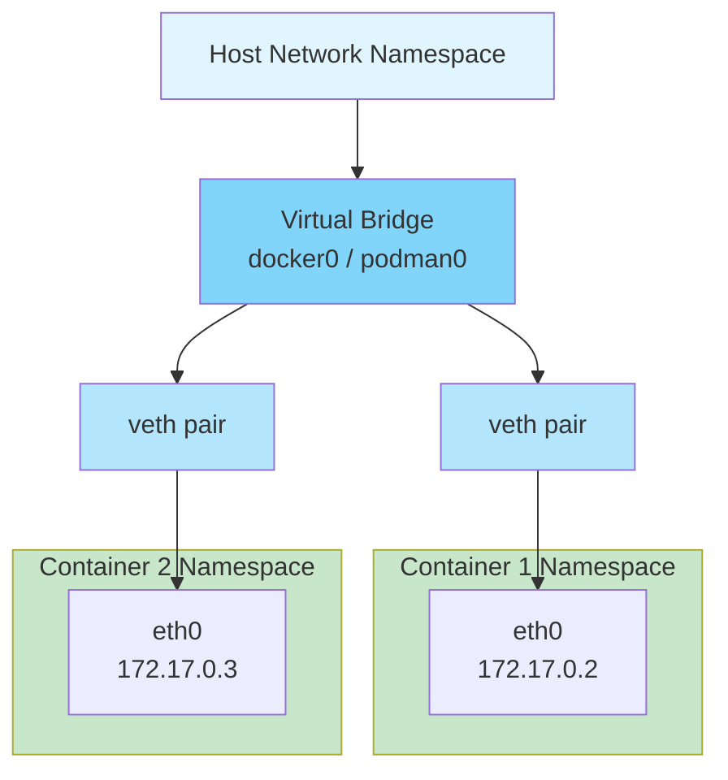
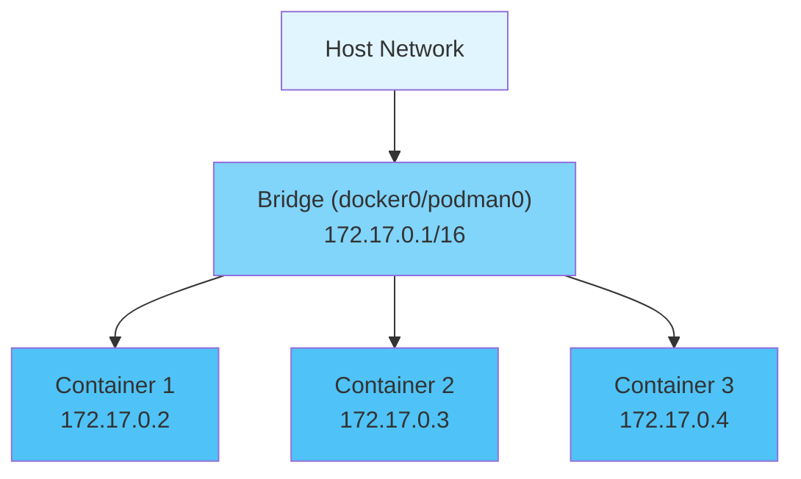
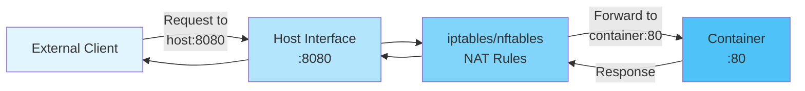

#container #docker #podman #computer-network #network-layer #transport-layer #application-layer #site-realibility-engineering
# Container Networking
## Overview
- Container engines provide ==network isolation== through Linux network namespaces.
- Multiple network drivers support different networking scenarios.
- Each container has its own ==network stack== (interfaces, routing tables, firewall rules).
- Containers communicate via ==virtual ethernet (veth) pairs== connecting namespaces.
## Network Namespace Isolation
### Concept
- Each container runs in separate ==network namespace==.
- Namespace provides isolated view of network stack:
  - Network interfaces
  - IP addresses
  - Routing tables
  - Firewall rules (iptables/nftables)
  - Network statistics
### Communication Model


## Network Drivers
### bridge (Default)
- **Description**: Creates ==virtual bridge network== on host
- **Default Name**:
  - Docker: `docker0`
  - Podman: `podman0` (or CNI-managed bridge)
- **IP Range**: Default 172.17.0.0/16 (Docker), configurable
- **Use Case**: Single-host container communication

**Topology:**


**Features:**
- Containers on same bridge can communicate directly
- ==Port mapping== required for external access (`-p` flag)
- Automatic DNS resolution between containers (Docker)
- NAT for outbound connections

**Example:**
```bash
# Docker
docker network create mybridge
docker run --network mybridge nginx

# Podman
podman network create mybridge
podman run --network mybridge nginx
```
### host
- **Description**: Container uses ==host network directly==
- **Isolation**: No network isolation $\implies$ container sees all host interfaces
- **Performance**: Better performance (no bridge overhead)
- **Port Conflicts**: Cannot run multiple containers on same port
- **Use Case**: Maximum network performance, monitoring tools

**Characteristics:**
- Container binds ports directly to host
- Access to all host network interfaces
- No IP address translation (NAT)
- Security consideration: Less isolation

**Example:**
```bash
# Docker/Podman
docker run --network host nginx
```

### none
- **Description**: Disables all networking
- **Interfaces**: Only loopback (127.0.0.1) available
- **Use Case**: Isolated workloads, security-sensitive applications
- **Network Access**: No external connectivity

**Example:**
```bash
# Docker/Podman
docker run --network none nginx
```

### overlay (Docker Swarm)
- **Description**: Multi-host networking for ==Docker Swarm clusters==
- **Technology**: VXLAN encapsulation for cross-host communication
- **Encryption**: Optional IPsec encryption
- **Use Case**: Multi-host container orchestration
- **Scope**: Swarm services

**Features:**
- Containers on different hosts communicate seamlessly
- Automatic service discovery
- Load balancing across replicas
- Encrypted control plan.
### macvlan
- **Description**: Assigns ==MAC address== to container
- **Visibility**: Container appears as physical device on network
- **Use Case**: Legacy applications requiring direct network access
- **Limitation**: Requires promiscuous mode on host interface

**Modes:**
- **Bridge Mode**: Virtual bridge for container communication
- **802.1Q Trunk**: VLAN tagging support
- **IPVLAN**: Alternative to MACVLAN with shared MAC

## CNI (Container Network Interface)
### Overview
- ==Plugin-based networking== architecture used by Podman, Kubernetes
- Standard interface for configuring container networks
- Pluggable network providers

### CNI vs Docker Networking
| Aspect | Docker | Podman (CNI) |
|--------|--------|--------------|
| **Architecture** | Built-in drivers | Plugin-based |
| **Flexibility** | Fixed drivers | Extensible plugins |
| **Kubernetes** | Custom integration | Native CNI support |
| **Configuration** | daemon.json | CNI config files |

### Common CNI Plugins
- **bridge**: Standard bridge networking
- **macvlan**: MACVLAN networking
- **ipvlan**: IPVLAN networking
- **host-device**: Move host device into container
- **ptp**: Point-to-point link between containers

### Podman CNI Configuration
Location: `/etc/cni/net.d/`

Example (`87-podman-bridge.conflist`):
```json
{
  "cniVersion": "0.4.0",
  "name": "podman",
  "plugins": [
    {
      "type": "bridge",
      "bridge": "cni-podman0",
      "isGateway": true,
      "ipMasq": true,
      "ipam": {
        "type": "host-local",
        "routes": [{"dst": "0.0.0.0/0"}],
        "ranges": [[{"subnet": "10.88.0.0/16"}]]
      }
    },
    {
      "type": "portmap",
      "capabilities": {"portMappings": true}
    }
  ]
}
```

## Netavark (Modern Podman)
### Overview
- ==Rust-based network stack== replacing CNI in newer Podman versions
- Improved performance and reliability
- Native IPv4/IPv6 dual stack support
### Features
- **Performance**: Faster than CNI plugins
- **IPv6**: First-class IPv6 support
- **DNS**: Built-in DNS server (aardvark-dns)
- **Firewall**: Integrated firewall management
### Migration
- Podman 4.0+ uses Netavark by default
- CNI still supported for backward compatibility
- Configuration: `/etc/containers/containers.conf`
## DNS Resolution
### Docker DNS
- **Built-in DNS Server**: 127.0.0.11 in containers
- **Service Discovery**: Containers resolve each other by ==service name==
- **Custom DNS**: `--dns` flag for external DNS servers
- **Search Domains**: `--dns-search` for domain resolution
**Example:**
```bash
docker run --name web nginx
docker run --name app --link web alpine ping web
# 'web' resolves to nginx container IP
```
### Podman DNS
- **CNI dnsname Plugin**: Provides DNS resolution
- **Netavark**: Uses aardvark-dns for DNS
- **Container Names**: Resolvable within same network
## Port Mapping
### Concept
- Exposes container ports to host network
- Uses ==iptables/nftables== rules for port forwarding
- Format: `-p HOST_PORT:CONTAINER_PORT`
### Syntax
```bash
# Single port
docker run -p 8080:80 nginx

# Multiple ports
docker run -p 8080:80 -p 8443:443 nginx

# Specific IP
docker run -p 127.0.0.1:8080:80 nginx

# Protocol specification
docker run -p 8080:80/tcp -p 53:53/udp nginx

# Random host port
docker run -p 80 nginx
```

### Port Mapping Flow


## Network Security
### Firewall Integration
- **iptables**: Traditional Linux firewall
- **nftables**: Modern replacement for iptables
- **firewalld**: High-level firewall management (RHEL/Fedora)
- **UFW**: User-friendly firewall (Ubuntu)
### Security Considerations
1. **Principle of Least Privilege**: Only expose necessary ports
2. **Host Network**: Avoid unless required (reduced isolation)
3. **Internal Networks**: Use custom networks for service isolation
4. **Encryption**: Use overlay encryption for multi-host
5. **Network Policies**: Implement firewall rules between containers

## Network Commands
### Docker
```Shell title='Docker network command'
# List networks
docker network ls

# Create network
docker network create --driver bridge mynet

# Inspect network
docker network inspect mynet

# Connect container to network
docker network connect mynet container_name

# Disconnect container
docker network disconnect mynet container_name

# Remove network
docker network rm mynet
```
### Podman
```Shell title='Podman network command'
# List networks
podman network ls

# Create network
podman network create mynet

# Inspect network
podman network inspect mynet

# Connect container
podman network connect mynet container_name

# Disconnect container
podman network disconnect mynet container_name

# Remove network
podman network rm mynet
```

***
# References
1. [Docker Networking](https://docs.docker.com/network/) for Docker network documentation.
2. [CNI Specification](https://github.com/containernetworking/cni) for Container Network Interface standards.
3. [Podman Networking](https://docs.podman.io/en/latest/markdown/podman-network.1.html) for Podman network commands.
4. [Netavark](https://github.com/containers/netavark) for modern Podman network stack.
5. [Linux Network Namespaces](https://man7.org/linux/man-pages/man7/network_namespaces.7.html) for namespace documentation.
6. [Docker architecture](docker/Docker%20architecture.md) for Docker-specific networking.
7. [Podman architecture](podman/Podman%20architecture.md) for Podman-specific networking.
