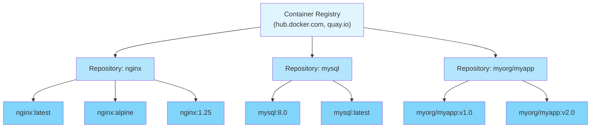

#containerization #docker #podman #application-layer #computer-network #site-realibility-engineering #binary-image #continuous-delivery

# Container Registry
## Overview
- ==Centralized repository== for storing and distributing container images.
- Implements OCI Distribution Specification (formerly Docker Registry HTTP API V2).
- Provides image versioning, access control, and distribution.
- Enables sharing images across teams and deployment environments.

## Registry Hierarchy


### Structure
- **Registry**: Server hosting repositories (e.g., Docker Hub, Quay.io)
- **Repository**: Collection of related images (e.g., nginx, mysql)
- **Tag**: Version identifier for image (e.g., latest, v1.0, alpine)
- **Digest**: Immutable SHA-256 hash of image manifest

## Image Naming Convention
### Format
```
[REGISTRY_HOST[:PORT]/][NAMESPACE/]REPOSITORY[:TAG|@DIGEST]
```

### Components
- **REGISTRY_HOST**: Registry domain/IP (optional, defaults to Docker Hub)
- **PORT**: Registry port (optional, default 443 for HTTPS)
- **NAMESPACE**: Organization or user namespace (optional for official images)
- **REPOSITORY**: Image repository name (required)
- **TAG**: Version tag (optional, defaults to `latest`)
- **DIGEST**: SHA-256 hash for immutable reference (optional)

### Examples
```bash
# Docker Hub official image (implicit registry)
nginx:alpine
# Full: docker.io/library/nginx:alpine

# Docker Hub user image
username/myapp:v1.0
# Full: docker.io/username/myapp:v1.0

# Private registry
registry.example.com:5000/myapp:latest

# GitHub Container Registry
ghcr.io/organization/project:main

# Google Container Registry
gcr.io/project-id/image:tag

# Digest reference (immutable)
nginx@sha256:abc123def456...

# Combined tag and digest
nginx:1.25@sha256:abc123...
```

## Registry Types
### Docker Hub
- **Operator**: Docker Inc.
- **URL**: hub.docker.com
- **Type**: Public registry
- **Official Images**: Curated by Docker (library namespace)
- **Free Tier**: Unlimited public repositories, limited private repositories
- **Paid Tiers**: More private repositories, increased pull rate limits
- **Features**:
  - Automated builds from GitHub/Bitbucket
  - Webhooks for CI/CD integration
  - Team collaboration tools
  - Vulnerability scanning (paid)

**Usage:**
```bash
# Pull from Docker Hub (implicit)
docker pull nginx
podman pull nginx

# Explicit registry
docker pull docker.io/library/nginx
```

### Private Self-Hosted Registry
- **Image**: `registry:2`
- **Purpose**: Full control over image storage
- **Deployment**: Docker/Podman container or Kubernetes
- **Storage**: Local filesystem, S3, Azure Blob, Google Cloud Storage
- **Security**: TLS encryption, authentication (basic auth, token-based)

**Deployment:**
```bash
# Run registry container
docker run -d -p 5000:5000 \
  --name registry \
  -v /mnt/registry:/var/lib/registry \
  registry:2

# Push to private registry
docker tag myapp localhost:5000/myapp:v1.0
docker push localhost:5000/myapp:v1.0

# Pull from private registry
docker pull localhost:5000/myapp:v1.0
```

**Configuration** (`config.yml`):
```yaml
version: 0.1
storage:
  filesystem:
    rootdirectory: /var/lib/registry
http:
  addr: :5000
  headers:
    X-Content-Type-Options: [nosniff]
auth:
  htpasswd:
    realm: basic-realm
    path: /auth/htpasswd
```

### Cloud Registries
#### Amazon ECR (Elastic Container Registry)
- **Provider**: AWS
- **Integration**: AWS IAM for access control
- **Encryption**: At-rest and in-transit
- **Scanning**: Integrated vulnerability scanning
- **Lifecycle**: Automatic image cleanup policies

```bash
# Login to ECR
aws ecr get-login-password --region us-east-1 | \
  docker login --username AWS --password-stdin \
  123456789012.dkr.ecr.us-east-1.amazonaws.com

# Push image
docker push 123456789012.dkr.ecr.us-east-1.amazonaws.com/myapp:v1.0
```

#### Google Container Registry (GCR) / Artifact Registry
- **Provider**: Google Cloud Platform
- **Authentication**: gcloud SDK or service accounts
- **Regions**: Multi-regional replication
- **Integration**: Cloud Build, GKE

```bash
# Login to GCR
gcloud auth configure-docker

# Push image
docker push gcr.io/project-id/myapp:v1.0
```

#### Azure Container Registry (ACR)
- **Provider**: Microsoft Azure
- **Tiers**: Basic, Standard, Premium (geo-replication)
- **Security**: Azure AD integration, private endpoints
- **Features**: Automated patching, content trust

```bash
# Login to ACR
az acr login --name myregistry

# Push image
docker push myregistry.azurecr.io/myapp:v1.0
```

#### GitHub Container Registry (GHCR)
- **Provider**: GitHub
- **Integration**: GitHub Actions, GitHub Packages
- **Access**: GitHub personal access tokens
- **Namespace**: User or organization

```bash
# Login to GHCR
echo $GITHUB_TOKEN | docker login ghcr.io -u USERNAME --password-stdin

# Push image
docker push ghcr.io/username/myapp:v1.0
```

#### Quay.io
- **Provider**: Red Hat
- **Features**: Automated builds, security scanning, geo-replication
- **Integration**: Kubernetes, OpenShift
- **Access**: Public and private repositories

```bash
# Login to Quay
docker login quay.io

# Push image
docker push quay.io/organization/myapp:v1.0
```

## Registry Operations
### Authentication
```bash
# Docker/Podman login
docker login registry.example.com
# Prompts for username/password
# Credentials stored in ~/.docker/config.json

# Login with token
echo $TOKEN | docker login -u USERNAME --password-stdin registry.example.com

# Logout
docker logout registry.example.com
```

### Push Images
```bash
# Tag image for registry
docker tag local-image:latest registry.example.com/myimage:v1.0

# Push to registry
docker push registry.example.com/myimage:v1.0

# Push all tags
docker push registry.example.com/myimage --all-tags
```

### Pull Images
```bash
# Pull specific tag
docker pull registry.example.com/myimage:v1.0

# Pull by digest (immutable)
docker pull nginx@sha256:abc123...

# Pull all tags
docker pull --all-tags registry.example.com/myimage
```

### Image Inspection
```bash
# View image layers and metadata
docker inspect nginx:alpine

# Get image digest
docker inspect --format='{{.RepoDigests}}' nginx:alpine

# View image history
docker history nginx:alpine
```

## Registry Security
### TLS/HTTPS
- **Requirement**: Production registries must use HTTPS
- **Certificates**: Valid SSL/TLS certificates required
- **Insecure Registry**: Testing only, requires explicit configuration

**Allow insecure registry** (not recommended for production):
```json
// Docker: /etc/docker/daemon.json
{
  "insecure-registries": ["registry.example.com:5000"]
}
```

### Authentication Methods
#### Basic Authentication
```bash
# Create htpasswd file
htpasswd -Bc auth/htpasswd username

# Configure registry to use htpasswd
```

#### Token-Based Authentication
- OAuth 2.0 tokens
- JWT (JSON Web Tokens)
- Registry token service

#### Cloud Provider Authentication
- AWS IAM roles
- Google Cloud service accounts
- Azure managed identities

### Image Signing and Verification
#### Docker Content Trust (Notary)
```bash
# Enable content trust
export DOCKER_CONTENT_TRUST=1

# Push signed image
docker push username/myapp:v1.0
# Prompts for root key and repository key

# Pull and verify
docker pull username/myapp:v1.0
# Verifies signature automatically
```

#### Cosign (Sigstore)
```bash
# Generate key pair
cosign generate-key-pair

# Sign image
cosign sign --key cosign.key registry.example.com/myapp:v1.0

# Verify signature
cosign verify --key cosign.pub registry.example.com/myapp:v1.0
```

## Registry Mirroring and Caching
### Pull-Through Cache
- **Purpose**: Reduce external bandwidth, improve pull speed
- **Mechanism**: Registry acts as caching proxy
- **Configuration**: Upstream registry + local cache
```yaml title='Docker Registry as Pull-Through Cache'
proxy:
  remoteurl: https://registry-1.docker.io
  username: docker_hub_user
  password: docker_hub_password
```
### Registry Mirror Configuration
#### Docker
```Json title='/etc/docker/daemon.json'
{
  "registry-mirrors": ["https://mirror.example.com"]
}
```
#### Podman
```toml title='/etc/containers/registries.conf'
[[registry]]
location = "docker.io"
[[registry.mirror]]
location = "mirror.example.com"
```
## Best Practices
### Image Tagging Strategy
1. **Semantic Versioning**: Use semver (v1.2.3, v2.0.0)
2. **Git Commit SHA**: Tag with commit hash for traceability
3. **Environment Tags**: dev, staging, prod
4. **Avoid `latest`**: Use specific versions in production
5. **Immutable Tags**: Never overwrite existing tags

### Registry Management
1. **Cleanup Policies**: Remove old/unused images regularly
2. **Storage Limits**: Monitor registry disk usage
3. **Access Control**: Implement least privilege access
4. **Vulnerability Scanning**: Scan images before deployment
5. **Backup**: Regular backups of registry data
### Performance Optimization
1. **Geo-Replication**: Use multi-region registries
2. **CDN**: Content delivery network for global distribution
3. **Layer Caching**: Optimize Dockerfile layer ordering
4. **Compression**: Enable image compression
5. **Rate Limiting**: Implement rate limits to prevent abuse

***
# References
1. [OCI Distribution Specification](https://github.com/opencontainers/distribution-spec) for registry protocol standards.
2. [Docker Registry](https://docs.docker.com/registry/) for Docker registry documentation.
3. [Docker Hub](https://docs.docker.com/docker-hub/) for Docker Hub features.
4. [Amazon ECR](https://docs.aws.amazon.com/ecr/) for AWS container registry.
5. [Google Artifact Registry](https://cloud.google.com/artifact-registry/docs) for GCP registry.
6. [Azure Container Registry](https://docs.microsoft.com/en-us/azure/container-registry/) for Azure registry.
7. [GitHub Container Registry](https://docs.github.com/en/packages/working-with-a-github-packages-registry/working-with-the-container-registry) for GHCR.
8. [Quay.io Documentation](https://docs.quay.io/) for Red Hat Quay.
9. [Docker Content Trust](https://docs.docker.com/engine/security/trust/) for image signing.
10. [Cosign](https://github.com/sigstore/cosign) for container signing tool.
