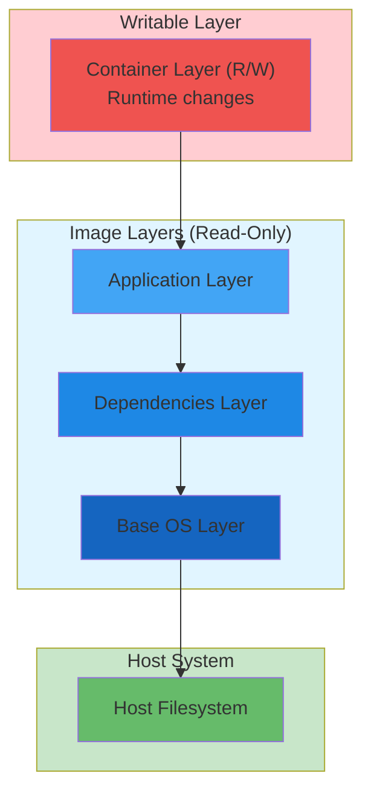

#containerization #docker #podman #operating-system #file-system #secondary-storage 
#site-realibility-engineering #binary-image #continuous-delivery #continuous-integration
#container-engine 
# Container Storage Architecture
## Overview
- Container engines use ==layered filesystem== with Copy-on-Write (CoW) mechanism.
- Images consist of ==immutable read-only layers== stacked on top of each other.
- Containers add a ==writable layer== on top of image layers for runtime changes.
- Layers uniquely identified by ==SHA-256 hash== $\implies$ enables layer sharing and caching.
## Image Layer Concept
### Layer Structure


### Layer Characteristics
- **Immutability**: Image layers cannot be modified after creation
- **Content Addressability**: Each layer identified by SHA-256 hash of contents
- **Layer Sharing**: Multiple images share identical layers $\implies$ reduced storage usage
- **Incremental Updates**: Only changed layers need to be pulled/pushed

### Copy-on-Write (CoW) Mechanism
- **Read Operations**: Direct access to files in image layers without copying
- **Write Operations**: File copied to writable layer before modification
- **Original Preservation**: Image layers remain unchanged $\implies$ multiple containers share same base
- **Efficiency**: Minimizes disk usage and speeds up container creation

## Storage Drivers
### overlay2 (Recommended)
- **Technology**: Uses Linux OverlayFS kernel filesystem
- **Status**: Default on modern Linux systems (kernel 4.0+)
- **Performance**: Better than older drivers (aufs, devicemapper)
- **Limits**: Supports up to 128 lower layers
- **Use Case**: General purpose, production workloads

### devicemapper
- **Technology**: Block-level storage using device mapper
- **Status**: Legacy driver for older systems
- **Configuration**: Requires additional setup (direct-lvm mode recommended)
- **Performance**: Slower than overlay2
- **Use Case**: Systems without overlay support

### btrfs
- **Technology**: Uses Btrfs filesystem features (subvolumes, snapshots)
- **Requirement**: Host must use Btrfs filesystem
- **Performance**: Good for copy-on-write operations
- **Features**: Native snapshot support, compression
- **Use Case**: Btrfs-based systems

### zfs
- **Technology**: Uses ZFS filesystem
- **Requirement**: ZFS installed on host system
- **Performance**: Excellent reliability and performance
- **Features**: Compression, deduplication, snapshots
- **Use Case**: ZFS-based systems, high-reliability requirements

### vfs
- **Technology**: No Copy-on-Write support
- **Performance**: Poor (full copy for each layer)
- **Use Case**: Testing only, compatibility fallback
- **Warning**: Not recommended for production

## Storage Locations
### Docker
#### Linux
```
/var/lib/docker/
    ├── containers/        # Container metadata and logs
    ├── image/             # Image metadata
    ├── overlay2/          # Image and container layers (overlay2 driver)
    ├── volumes/           # Named volumes
    ├── network/           # Network configuration
    └── buildkit/          # BuildKit cache
```
#### Windows
```
C:\ProgramData\Docker\
    ├── containers\
    ├── image\
    ├── windowsfilter\     # Windows container layers
    └── volumes\
```

### Podman
#### Rootful Mode
```
/var/lib/containers/storage/
    ├── overlay/               # Image layers
    ├── overlay-containers/    # Container layers
    └── vfs-containers/        # VFS storage (if used)
```
#### Rootless Mode
```
~/.local/share/containers/
    ├── storage/
    │   ├── overlay/
    │   └── overlay-containers/
    └── cache/
```
## Volume Management
### Named Volumes
- **Management**: Fully managed by container engine
- **Location**: Stored in engine-specific directory
  - Docker: `/var/lib/docker/volumes/`
  - Podman: `/var/lib/containers/storage/volumes/`
- **Lifecycle**: Independent of containers
- **Backup**: Easy to backup and migrate
- **Use Case**: Persistent application data (databases, uploads)

**Example:**
```bash
# Docker
docker volume create mydata
docker run -v mydata:/data nginx

# Podman
podman volume create mydata
podman run -v mydata:/data nginx
```

### Bind Mounts
- **Management**: User manages host directory
- **Location**: Any host filesystem path
- **Permissions**: Requires proper host permissions
- **Flexibility**: Direct access to host files
- **Use Case**: Development (source code), configuration files

**Example:**
```bash
# Docker/Podman
docker run -v /host/path:/container/path nginx
podman run -v /host/path:/container/path nginx
```

### tmpfs Mounts (Linux Only)
- **Storage**: Host memory (RAM)
- **Persistence**: Data lost when container stops
- **Performance**: Fastest option (no disk I/O)
- **Security**: Sensitive data never written to disk
- **Use Case**: Temporary files, secrets, caches

**Example:**
```bash
# Docker/Podman
docker run --tmpfs /tmp nginx
podman run --tmpfs /tmp nginx
```

## Storage Driver Selection
### Factors to Consider
1. **Host Filesystem**: What filesystem is host using?
2. **Kernel Support**: Does kernel support overlay2/OverlayFS?
3. **Performance**: I/O patterns of workload
4. **Stability**: Production vs development environment
5. **Features**: Compression, deduplication requirements
### Recommendation Matrix
| Host Filesystem | Recommended Driver | Alternative |
|----------------|-------------------|-------------|
| ext4, xfs | overlay2 | devicemapper |
| btrfs | btrfs | overlay2 |
| zfs | zfs | overlay2 |
| Windows | windowsfilter | - |

### Configuration
**Docker** (`/etc/docker/daemon.json`):
```json
{
  "storage-driver": "overlay2",
  "storage-opts": [
    "overlay2.override_kernel_check=true"
  ]
}
```

**Podman** (`/etc/containers/storage.conf`):
```toml
[storage]
driver = "overlay"

[storage.options.overlay]
mountopt = "nodev,metacopy=on"
```

## Storage Optimization
### Image Layer Best Practices
1. **Minimize Layers**: Combine related RUN commands with `&&`
2. **Order Instructions**: Place frequently changing content in upper layers
3. **Use .dockerignore**: Exclude unnecessary files from build context
4. **Multi-stage Builds**: Remove build dependencies from final image
5. **Clean Package Caches**: Remove after installation in same layer
### Storage Cleanup
**Docker:**
```bash
docker system df              # Show disk usage
docker image prune            # Remove unused images
docker container prune        # Remove stopped containers
docker volume prune           # Remove unused volumes
docker system prune -a        # Remove all unused objects
```

**Podman:**
```bash
podman system df              # Show disk usage
podman image prune            # Remove unused images
podman container prune        # Remove stopped containers
podman volume prune           # Remove unused volumes
podman system reset           # Complete storage cleanup
```

## Rootless Storage Considerations
### Podman Rootless Features
- **Storage Location**: User home directory (`~/.local/share/containers/`)
- **Permissions**: No root access required
- **fuse-overlayfs**: Enables overlay without root privileges
- **UID/GID Mapping**: User namespaces map container UIDs to host UIDs
- **Quota Support**: Per-user storage quotas possible

### Performance Implications
- **fuse-overlayfs**: Slight overhead vs kernel overlay2
- **User Namespaces**: Minimal performance impact
- **Network Storage**: Home directory on NFS may have issues
- **Recommendation**: Local storage for best performance

***
# References
1. [Docker Storage Drivers](https://docs.docker.com/storage/storagedriver/) for official Docker storage documentation.
2. [Podman Storage Configuration](https://docs.podman.io/en/latest/markdown/podman-system-service.1.html) for Podman storage setup.
3. [OverlayFS Documentation](https://www.kernel.org/doc/html/latest/filesystems/overlayfs.html) for kernel overlay filesystem.
4. [containers/storage](https://github.com/containers/storage) for shared storage library used by Podman.
5. [Docker Volumes](https://docs.docker.com/storage/volumes/) for volume management.
6. [Docker architecture](docker/Docker%20architecture.md) for Docker-specific architecture details.
7. [Podman architecture](podman/Podman%20architecture.md) for Podman-specific architecture details.
8. [OCI-compliant image](OCI-compliant%20image.md) for image layer concepts.
