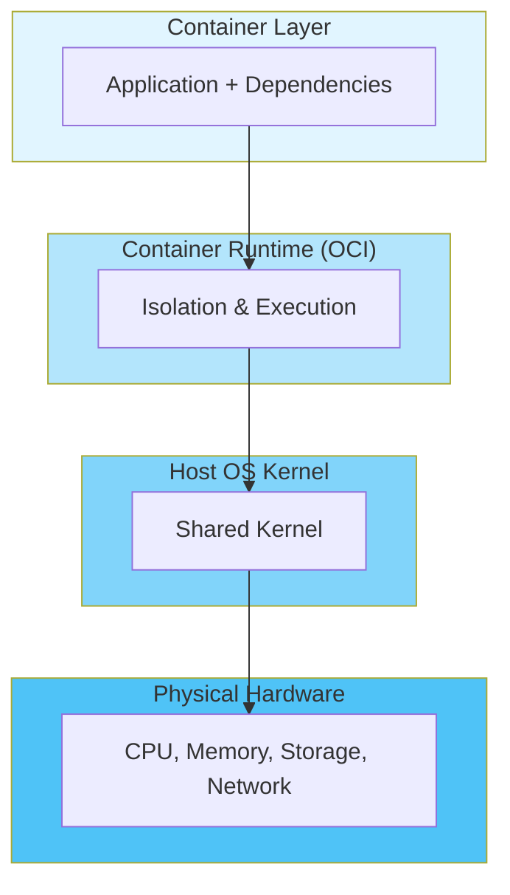
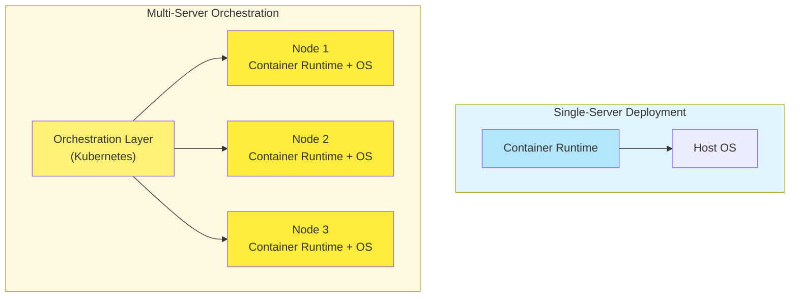

#continuous-integration #software-engineering #operating-system #shell #kubernetes #process #docker
#software-architecture #container-orchestration #site-realibility-engineering
#computer-network #file-system #containerization
# Open Container Initiative (OCI)
- Industry standard for <mark class="hltr-yellow">container runtimes</mark> and <mark class="hltr-yellow">image formats</mark>.
- Governed by Linux Foundation.
- Defines three specifications:
	- **Runtime Specification**: Container execution and lifecycle standards
	- **Image Specification**: Container image format and configuration
	- **Distribution Specification**: Image distribution protocols
# OCI-Compliant Container
## Definition
- ==Isolation layer== providing OS-level virtualization on top of host kernel.
- Encapsulates application ==binary image==, libraries, and dependencies as a single deployable unit.
- Provides higher abstraction than traditional process isolation.
## Architecture

## Key Innovations
### Image Packaging
- Standardized ==container image== format using cryptographic hashing.
- Layered filesystem with ==SHA-256 checksums== for integrity verification.
- Content-addressable storage $\implies$ identical layers shared across images.
- Reference: [Hash-based Message Authentication Code](../../cryptography/hash/Hash-based%20Message%20Authentication%20Code.md)
### Container Isolation
- Process isolation via Linux ==namespaces== (PID, NET, MNT, UTS, IPC, USER).
- Resource limitation via ==cgroups== (CPU, memory, I/O).
- Security policies via Seccomp, SELinux, AppArmor.
- Shared kernel $\implies$ lightweight compared to virtual machines.
### Image Distribution
- Centralized ==container registry== for image storage and distribution.
- Pull/push operations over HTTP/HTTPS.
- Tag-based versioning system.
- Examples: Docker Hub, Quay.io, GitHub Container Registry.
## Container vs Orchestration
### Single-Server Deployment
- OCI-compliant containers operate on single host systems.
- Direct container execution via runtime (Docker, Podman, containerd).
- Manual scaling and management.
### Multi-Server Orchestration
- Container orchestration platforms manage containers across clusters.
- Examples: Kubernetes, Docker Swarm, Nomad.
- Automated scheduling, scaling, networking, and service discovery.
- Kubernetes as de facto standard for production deployments.

## Design Principles
- **Platform Independence**: Run anywhere with compatible kernel.
- **Process Isolation**: Separate runtime environments per container.
- **Immutability**: Images are read-only, changes in writable layer.
- **Portability**: Consistent behavior across development and production.
- **Reproducibility**: Identical image produces identical container.
***
# References
1. https://opencontainers.org/about/overview/ for OCI specifications and governance.
2. https://github.com/opencontainers/runtime-spec for OCI Runtime Specification.
3. https://github.com/opencontainers/image-spec for OCI Image Format Specification.
4. https://github.com/opencontainers/distribution-spec for OCI Distribution Specification.
5. https://www.bretfisher.com/kubernetes-vs-docker/ for container orchestration concepts.
6. https://www.aquasec.com/blog/a-brief-history-of-containers-from-1970s-chroot-to-docker-2016/ for container history.
7. https://en.wikipedia.org/wiki/OS-level_virtualization for OS-level virtualization concepts.
8. [Docker architecture](docker/Docker%20architecture.md) for daemon-based container engine implementation.
9. [Podman architecture](podman/Podman%20architecture.md) for daemonless container engine implementation.
10. [OCI-compliant image](OCI-compliant%20image.md) for container image layer architecture.
11. [Containerfile](artifacts/Containerfile.md) for image build specifications.
12. [Container commands](Container%20commands.md) for CLI reference.
