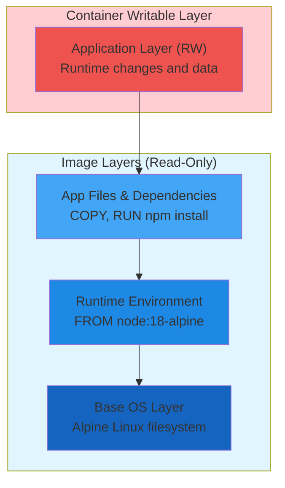
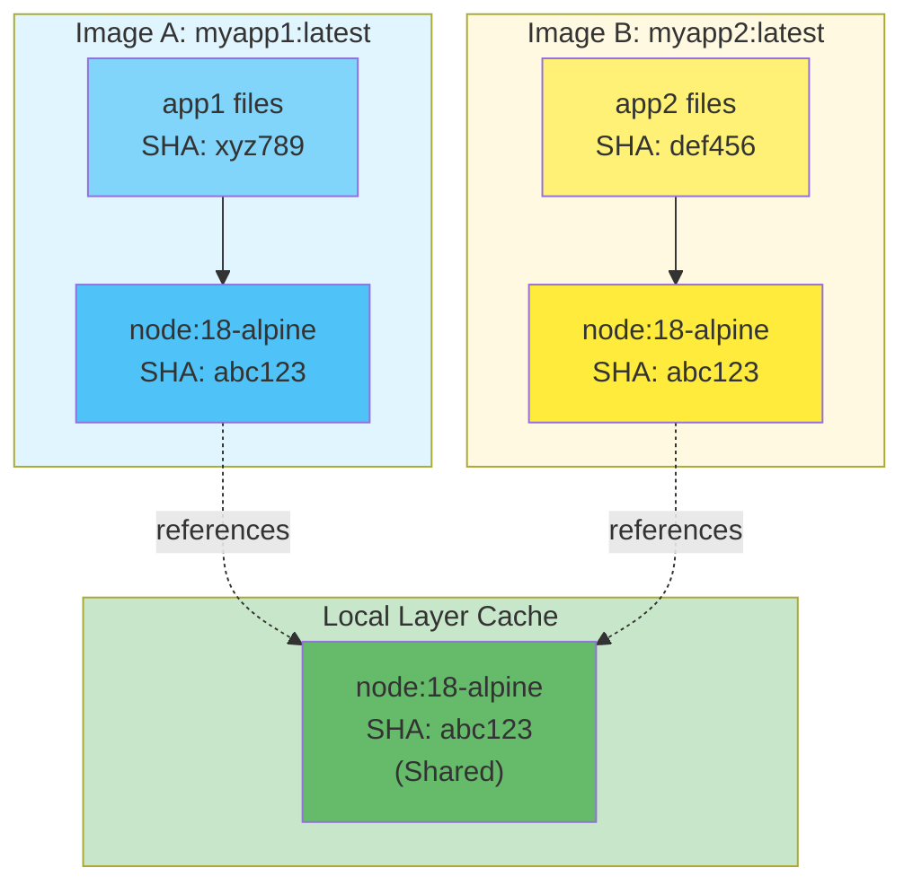

#docker #binary-image #containerization #operating-system #process #cli #software-architecture #site-realibility-engineering #file-system #continuous-integration #cybersecurity 
#common-vulnerabilities-and-exposures
# OCI-Compliant Image
## Definition
- Standardized ==container image format== defined by OCI Image Specification.
- Immutable ==filesystem bundle== containing application binaries, libraries, dependencies, and runtime configurations.
- Template for creating container instances.
- When loaded into memory and executed $\implies$ becomes one or more [processes](../../operating-system/process/Process.md).
## Image Structure
### Components
- **Image Manifest**: JSON document describing image configuration and layers
- **Image Configuration**: Container runtime settings (environment variables, entrypoint, working directory)
- **Filesystem Layers**: Ordered stack of filesystem changesets
- **Image Index** (optional): Multi-platform image variants
### Layer Architecture


## Layer Characteristics
### Immutability
- Image layers are ==read-only== after creation.
- Each layer identified by ==SHA-256 hash== of its contents.
- Changes to layer contents $\implies$ different hash $\implies$ different layer.
- Ensures ==content addressability== and integrity verification.
### Layer Sharing
- Multiple images can share ==identical layers== with matching hashes.
- Container engine caches layers locally $\implies$ reduced storage usage.
- Shared layers across images $\implies$ faster image pull/push operations.
- Example: Multiple applications using same `node:18-alpine` base layer.



### Copy-on-Write (CoW)
- Containers add ==writable layer== on top of read-only image layers.
- File read from image layer $\implies$ direct access, no copy.
- File write to image layer $\implies$ copy to writable layer, then modify.
- Original image layers remain unchanged $\implies$ multiple containers share same base.
## Layer Composition
### Build Process
- Each Dockerfile instruction creates a new layer:

```dockerfile
FROM node:18-alpine          # Layer 1: Base OS + Node.js runtime
WORKDIR /app                 # Layer 2: Metadata change (no filesystem layer)
COPY package*.json ./        # Layer 3: Package files
RUN npm install              # Layer 4: Dependencies in node_modules
COPY . .                     # Layer 5: Application source code
CMD ["node", "server.js"]    # Metadata: Default command
```
### Layer Hierarchy
- **Lowest layer**: Base operating system (Ubuntu, Alpine, Debian)
- **Middle layers**: Runtime dependencies (Node.js, Python, Java)
- **Upper layers**: Application code and configurations
- **Highest layer**: Container-specific writable layer
## Image Operations
### Image Distribution
- Images stored in ==container registries== (Docker Hub, Quay.io, GHCR).
- Push/pull operations transfer only ==missing layers== $\implies$ efficient bandwidth usage.
- Layer compression (gzip, zstd) reduces transfer size.
- Parallel layer downloads for faster pulls.
### Image Naming
```
[REGISTRY/][NAMESPACE/]REPOSITORY[:TAG|@DIGEST]

Examples:
docker.io/library/nginx:alpine           # Docker Hub official image
ghcr.io/username/myapp:v1.2.3           # GitHub Container Registry
localhost:5000/project/api:latest       # Private registry
nginx@sha256:abc123...                  # Digest reference (immutable)
```
### Image Commands
- **Pull**: Download image from registry to local storage
- **Build**: Create image from Dockerfile instructions
- **Tag**: Assign name/version to image
- **Push**: Upload image to registry
- **Inspect**: View image metadata and layer information
- **History**: Display layer creation commands
## Storage Drivers
- Container engines use storage drivers for layer management:
### overlay2 (Recommended)
- Default on modern Linux systems.
- Uses ==OverlayFS== kernel filesystem.
- Efficient Copy-on-Write performance.
- Supports up to 128 lower layers.
### devicemapper
- Legacy block-level storage driver.
- Uses ==thin provisioning== and snapshots.
- Requires additional configuration.
### btrfs / zfs
- Leverages filesystem-native CoW features.
- Requires host filesystem support.
- Better performance for certain workloads.
## Image Manifest
- JSON document describing image structure:

```json
{
  "schemaVersion": 2,
  "mediaType": "application/vnd.oci.image.manifest.v1+json",
  "config": {
    "mediaType": "application/vnd.oci.image.config.v1+json",
    "digest": "sha256:abc123...",
    "size": 1234
  },
  "layers": [
    {
      "mediaType": "application/vnd.oci.image.layer.v1.tar+gzip",
      "digest": "sha256:def456...",
      "size": 5678
    }
  ]
}
```
## Image vs Container
| Aspect | Image | Container |
|--------|-------|-----------|
| **State** | Immutable template | Running instance |
| **Filesystem** | Read-only layers | Read-only layers + writable layer |
| **Purpose** | Distribution and storage | Execution environment |
| **Lifecycle** | Built once, reused many times | Created, started, stopped, destroyed |
| **Analogy** | Class definition | Object instance |
| **Storage** | Registry or local cache | Local runtime state |

## Optimization Strategies
### Layer Caching
- Reorder Dockerfile instructions $\implies$ place frequently changing files in upper layers.
- Dependency installation before source code copy $\implies$ cache dependencies layer.
- Multi-stage builds $\implies$ reduce final image size by excluding build tools.
### Image Size Reduction
- Use minimal base images (Alpine, distroless).
- Remove package manager caches in same RUN instruction.
- Combine multiple RUN commands with `&&` $\implies$ single layer.
- Use `.dockerignore` to exclude unnecessary files.
### Security Best Practices
- Pin base image versions with ==digest references== $\implies$ immutable builds.
- Scan images for vulnerabilities (Trivy, Grype, Snyk).
- Use minimal base images $\implies$ reduced attack surface.
- Run containers as non-root user.
***
# References
1. https://github.com/opencontainers/image-spec for OCI Image Specification.
2. https://docs.docker.com/build/building/layers/ for image layer documentation.
3. https://docs.docker.com/storage/storagedriver/ for storage driver comparison.
4. https://docs.docker.com/build/building/best-practices/ for Dockerfile best practices.
5. https://docs.docker.com/engine/reference/builder/ for Dockerfile reference.
6. https://docs.docker.com/registry/ for Docker Registry documentation.
7. https://github.com/opencontainers/distribution-spec for OCI Distribution Specification.
8. https://www.docker.com/blog/intro-guide-to-dockerfile-best-practices/ for optimization strategies.
9. [OCI-compliant container](OCI-compliant%20container.md) for container runtime concepts.
10. [Docker architecture](docker/Docker%20architecture.md) for storage drivers and layer management.
11. [Podman architecture](podman/Podman%20architecture.md) for daemonless image handling.
12. [Containerfile](artifacts/Containerfile.md) for image build instructions.
13. [Container commands](Container%20commands.md) for image manipulation CLI.
