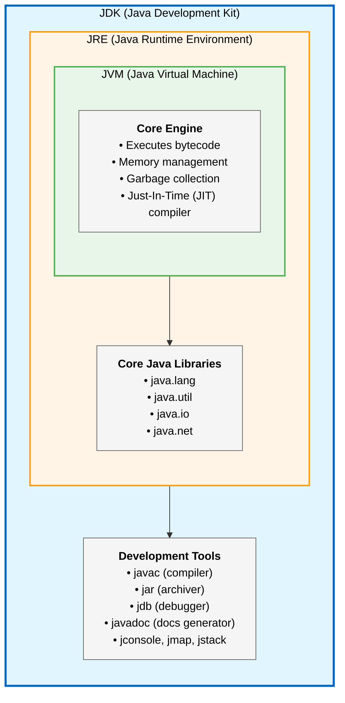

#quarkus #java #java21 #java17 #podman #containerization #site-realibility-engineering 
#continuous-delivery #bash #shell #rhel #ibm #amazon #microsoft #continuous-integration 

# Java Development Kit (JDK)
## Definition
- JDK is a software development kit used to build Java applications. It *contains the JRE and a set of development tools such as compiler, debugger and so on*.
- JDK is *platform-dependent*.
## Usage
- JDK is used for compiling Java source files into bytecode files, debugging the application and packaging the executable `.jar` file in <mark class="hltr-yellow">development</mark> environment.
# Java Runtime Environment (JRE)
## Definition
- JRE provides an environment to run Java programs but *does not include development tools*.
- JRE is *platform-dependent*.
## Usage
- JRE is only used for application execution including class loading, bytecode verification and binary execution.
# Java Virtual Machine (JVM)
## Definition
- JVM the *core* execution engine of Java. It is responsible for *converting bytecode into machine-specific instructions*.
- Bytecode is platform-independent and can be executed on any JVM.
## Usage
- JDK performs memory management, garbage collection,...
***
# References
1. https://www.geeksforgeeks.org/java/differences-jdk-jre-jvm/
2. 