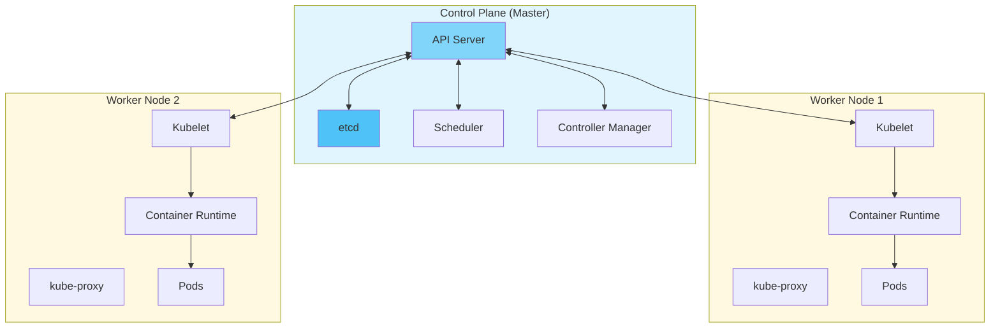
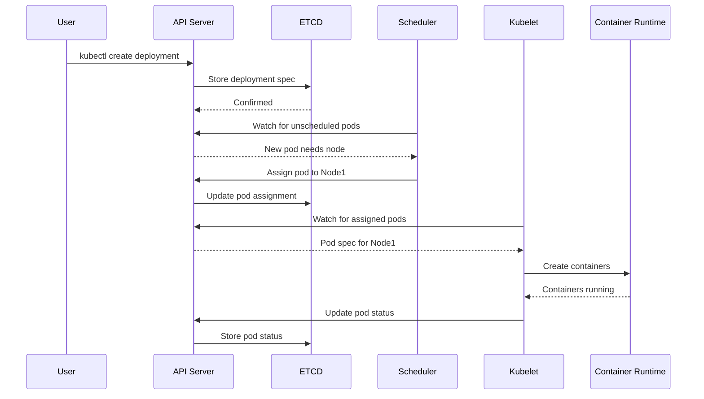

#kubernetes #go #container-orchestration #computer-network #application-layer
#transport-layer #containerization #site-realibility-engineering #distributed-system #algorithm 
#container-engine #continuous-delivery #continuous-integration #linux #fedora #ubuntu #centos-stream 
#rhel 
# Overview
- ==Container orchestration platform== for automating deployment, scaling, and management of containerized applications across clusters.
- Manages multiple nodes (servers) as a single unified system.
# Architecture Components
- Kubernetes uses ==master-worker architecture== with two main layers:

## Control Plane
- Makes global decisions about the cluster. Runs on master node(s).
### API Server
- ==Central hub== for all cluster communications.
- Exposes Kubernetes API via REST.
- All components communicate through API server $\implies$ single point of interaction.
- Authentication, authorization, and validation of requests.
### etcd
- ==Distributed key-value store== for cluster state.
- Stores all cluster data: configuration, state, metadata.
- Source of truth for cluster $\implies$ if etcd fails, cluster loses state.
- Implements Raft consensus algorithm for consistency.
### Scheduler
- ==Assigns pods to nodes== based on resource requirements.
- Considers: CPU, memory, storage, affinity rules, taints/toleration.
- Makes placement decisions, does not execute them.
### Controller Manager
- Runs controllers that <mark class="hltr-yellow">regulate cluster state</mark>.
- Continuously watches cluster state and makes changes to match desired state.
- Examples:
    - **Node Controller**: Monitors node health
    - **ReplicaSet Controller**: Maintains correct number of pod replicas
    - **Deployment Controller**: Manages rolling updates
    - **Service Controller**: Creates load balancers
## Worker Node (Data Plane)
- Runs application workloads as containers. Each node has:
### Kubelet
- ==Node agent== that runs on every worker node.
- Communicates with API server to receive pod specifications.
- Ensures containers are running in pods as expected.
- Reports node and pod status back to control plane.
### kube-proxy
- ==Network proxy== running on each node.
- Maintains network rules for pod communication.
- Implements Kubernetes Service abstraction $\implies$ enables load balancing.
- Routes traffic to correct pods.
### Container Runtime
- Software that runs containers (Docker, containerd, CRI-O).
- Pulls images from registry.
- Starts and stops containers as instructed by kubelet.
### Pods
- ==Smallest deployable unit== in Kubernetes.
- One or more containers that share storage and network.
- Each pod gets unique IP address.
- Containers in same pod communicate via localhost.
# Workflow

**Flow**:
1. User submits request via kubectl $\to$ API Server
2. API Server validates and stores in etcd
3. Scheduler assigns pod to suitable node
4. Kubelet on assigned node pulls image and starts container
5. kube-proxy configures networking for pod
6. Controllers continuously monitor and maintain desired state

# Control Plane vs Worker Node

| Component              | Control Plane        | Worker Node              |
| ---------------------- | -------------------- | ------------------------ |
| **Purpose**            | Cluster management   | Run workloads            |
| **API Server**         | ✓                    | -                        |
| **etcd**               | ✓                    | -                        |
| **Scheduler**          | ✓                    | -                        |
| **Controller Manager** | ✓                    | -                        |
| **Kubelet**            | -                    | ✓                        |
| **kube-proxy**         | -                    | ✓                        |
| **Container Runtime**  | -                    | ✓                        |
| **Failure Impact**     | Cluster control lost | Only local pods affected |

***
# References
1. [Kubernetes Official Documentation](https://kubernetes.io/docs/concepts/overview/) for comprehensive Kubernetes concepts.
2. [Kubernetes Architecture](https://kubernetes.io/docs/concepts/architecture/) for official architecture documentation.
3. [OCI-compliant container](../../container-engine/OCI-compliant%20container.md) for container fundamentals.
4. [Docker architecture](../../container-engine/docker/Docker%20architecture.md) for container runtime understanding.
5. https://www.cncf.io/projects/kubernetes/ for CNCF project information. 