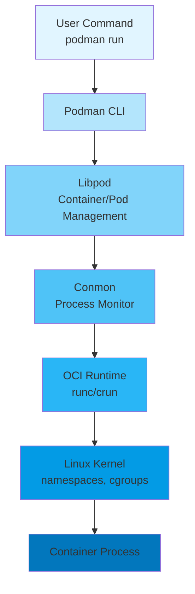

#ci-cd #cli #docker #software-architecture #client-server #application-layer #web-server  #dbms #binary-image  #operating-system #process #memory #virtual-memory
#site-realibility-engineering

# Podman Architecture

## Overview

Podman (Pod Manager) is a daemonless container engine for developing, managing, and running OCI containers on Linux systems. Unlike Docker, Podman operates without a central daemon, providing enhanced security and flexibility through a fork-exec model.

## Components
###  Daemonless Architecture
- **No Central Daemon**: Podman runs containers as child processes of the Podman command itself
- **Fork-Exec Model**: Each container runs as a direct child process of the user's shell
- **Process Ownership**: Containers inherit the user's privileges, eliminating the need for root daemon
### Key Components

#### Libpod
- Core library implementing container and pod management logic
- Handles container lifecycle (create, start, stop, remove)
- Manages pods as groups of containers sharing resources
#### Container Runtime (OCI Runtime)
- **Default**: runc (OCI-compliant runtime)
- **Alternatives**: crun (lightweight C implementation)
- Responsible for low-level container execution and isolation
#### Conmon (Container Monitor)
- Monitors container processes
- Handles logging and TTY allocation
- Maintains container state information
- Acts as the intermediary between Podman and the runtime
#### Container Storage
- **Storage Driver**: Manages image layers and container filesystems
- **Supported Drivers**: overlay, vfs, devicemapper
- **Image Store**: Stores container images locally
- **Container Store**: Manages running container storage
### Networking Components
#### CNI (Container Network Interface)
- Plugin-based networking architecture
- Supports bridge, macvlan, ipvlan network modes
- Manages network namespaces and IP allocation
#### Netavark (Modern Network Stack)
- Rust-based network stack (replacing CNI in newer versions)
- Improved performance and reliability
- Native support for IPv4/IPv6 dual stack
### Pod Architecture
Podman introduces the concept of pods (borrowed from Kubernetes):
- **Infra Container**: Special pause container for shared namespaces
- **Shared Resources**: Network namespace, IPC namespace, UTS namespace
- **Multiple Containers**: Run within the same pod, sharing networking
## Architectural Flow



## Rootless Mode Architecture

### Key Features
- Runs containers without root privileges
- Uses user namespaces for UID/GID mapping
- Storage in user's home directory (`~/.local/share/containers`)
- Enhanced security through privilege separation
### Components
- **User Namespaces**: Maps container UIDs to unprivileged user UIDs.
- `slirp4netns`: Provides user-mode networking
- fuse-overlayfs: Enables overlay filesystem without root
## Storage Architecture
### Image Layers
- Copy-on-Write (CoW) filesystem
- Shared base layers across containers
- Efficient storage utilization
### Container Storage Layout
```
/var/lib/containers/storage/  (rootful)
~/.local/share/containers/     (rootless)
    ├── overlay/               (image layers)
    ├── overlay-containers/    (container layers)
    └── vfs-containers/        (alternative storage)
```

## Comparison with Docker Architecture

| Aspect | Podman | Docker |
|--------|--------|--------|
| Daemon | Daemonless | Central daemon (dockerd) |
| Process Model | Fork-exec | Client-server |
| Root Requirement | Optional (rootless) | Required for daemon |
| Systemd Integration | Native | Via daemon |
| Pod Support | Native | Requires Kubernetes |
| Security | Process-level isolation | Daemon-level vulnerability |

## Integration Points

### Systemd Integration
- Generate systemd unit files: `podman generate systemd`
- Socket activation support
- Native service management
### Kubernetes Compatibility
- Generate Kubernetes YAML: `podman generate kube`
- Pod manifest support
- Seamless transition to Kubernetes deployments
### Registry Integration
- Pull/push images from OCI registries
- Support for Docker Hub, Quay.io, private registries
- Authentication and credential management
## Security Architecture

### Isolation Mechanisms
- **Namespaces**: PID, network, mount, UTS, IPC, user
- **Cgroups**: Resource limitation and accounting
- **SELinux/AppArmor**: Mandatory Access Control (MAC)
- **Seccomp**: System call filtering
### Rootless Security Benefits
- No daemon running as root
- Reduced attack surface
- User-level process isolation
- No privilege escalation vectors
## Advantages
1. **Security**: No central daemon eliminates single point of failure
2. **Systemd Integration**: Better alignment with Linux service management
3. **Rootless Operation**: Enhanced security for multi-tenant environments
4. **Docker Compatibility**: Drop-in replacement with familiar CLI
5. **Pod Support**: Native Kubernetes-like pod management
6. **Auditing**: Easier process tracking and security auditing
***
# References
1. **Podman Official Documentation** - Red Hat. "Podman Documentation." Available at: https://docs.podman.io/
2. **Open Container Initiative (OCI)** - "OCI Runtime Specification." Available at: https://github.com/opencontainers/runtime-spec
3. **OCI Image Specification** - "Open Container Initiative Image Format Specification." Available at: https://github.com/opencontainers/image-spec
4. **Libpod GitHub Repository** - "Podman: A tool for managing OCI containers and pods." Available at: https://github.com/containers/podman
5. **runc** - OCI Reference Implementation. "runc - CLI tool for spawning and running containers." Available at: https://github.com/opencontainers/runc
6. **crun** - "A fast and lightweight OCI runtime written in C." Available at: https://github.com/containers/crun
7. **Conmon** - "An OCI container runtime monitor." Available at: https://github.com/containers/conmon
8. **Linux Namespaces** - "namespaces(7) - Linux manual page." Available at: https://man7.org/linux/man-pages/man7/namespaces.7.html
9. **Control Groups (cgroups)** - "cgroups(7) - Linux manual page." Available at: https://man7.org/linux/man-pages/man7/cgroups.7.html
10. **Container Network Interface (CNI)** - "CNI Specification." Available at: https://github.com/containernetworking/cni
11. **Netavark** - "Container network stack." Available at: https://github.com/containers/netavark
12. **slirp4netns** - "User-mode networking for unprivileged network namespaces." Available at: https://github.com/rootless-containers/slirp4netns
13. **Kubernetes Pods** - "Pod Overview." Available at: https://kubernetes.io/docs/concepts/workloads/pods/
14. **Buildah** - "A tool for building OCI container images." Available at: https://buildah.io/
15. **Skopeo** - "Work with remote images registries." Available at: https://github.com/containers/skopeo
16. **Podman vs Docker** - Red Hat Developer. "Podman and Buildah for Docker users." Available at: https://developers.redhat.com/blog/2019/02/21/podman-and-buildah-for-docker-users
17. **Rootless Containers** - "Rootless Containers Documentation." Available at: https://rootlesscontaine.rs/
18. **User Namespaces** - "user_namespaces(7) - Linux manual page." Available at: https://man7.org/linux/man-pages/man7/user_namespaces.7.html
19. **Seccomp** - "Seccomp BPF (SECure COMPuting with filters)." Available at: https://www.kernel.org/doc/html/latest/userspace-api/seccomp_filter.html
20. **SELinux** - Red Hat. "What is SELinux?" Available at: https://www.redhat.com/en/topics/linux/what-is-selinux