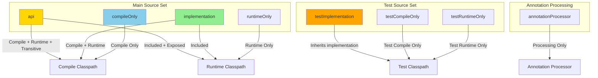
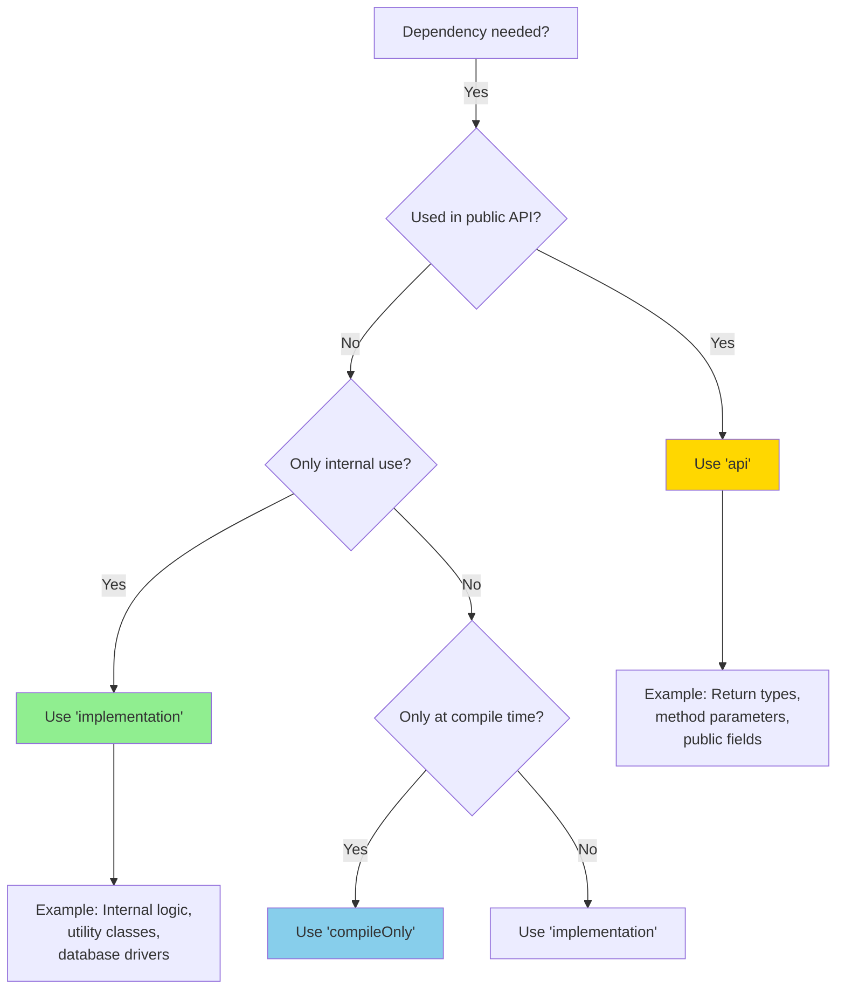
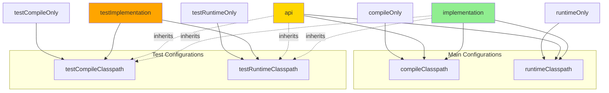
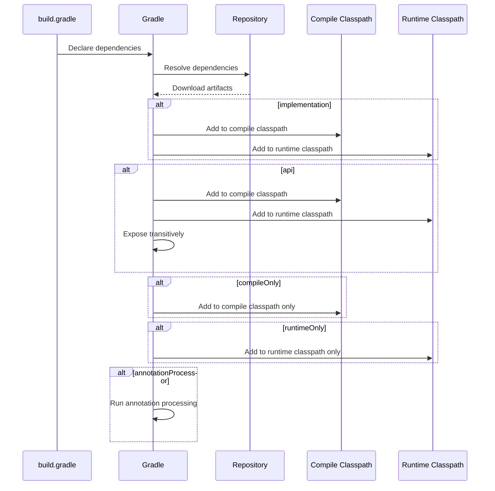

#gradle #dependency-manager #java #spring #spring-boot #quarkus #micronaut #kotlin #groovy
#quarkus #continuous-delivery #continuous-integration 
# Definition
- Dependency configurations define <mark class="hltr-yellow">how dependencies are used during compilation and runtime</mark>.
- Each configuration determines:
    - *Compile-time availability* - whether the dependency is available during compilation.
    - *Runtime availability* - whether the dependency is included in the runtime classpath.
    - *Transitive exposure* - whether the dependency is exposed to consumers of the library.
- Gradle provides built-in configurations through the Java plugin for managing dependencies across different scopes.
# Dependency Configuration Scopes

# Main Source Set Configurations

## `implementation`
### Purpose
- Declare dependencies required for <mark class="hltr-yellow">compilation and runtime</mark>, but **not exposed transitively** to consumers.
### Compile-time
- Available during compilation of the module.
### Runtime
- Included in the runtime classpath.
### Transitive Exposure
- **Not exposed** to consumers (encapsulated).
>[!error]
>If  project A depends on project B, and project B depends on library C, then project A cannot directly use library C because it is already hidden by project B.
>If project B declares `implementation('C')`, project A can use project B but cannot transitively use library C.
### Use Case
- Internal implementation dependencies that consumers don't need to know about.
- Improves compilation performance by reducing classpath size for consumers.
#### Groovy DSL
```groovy title='implementation configuration'
dependencies {
    implementation 'org.springframework.boot:spring-boot-starter-web'
    implementation 'com.fasterxml.jackson.core:jackson-databind:2.15.2'
    implementation 'org.hibernate:hibernate-core:6.2.7.Final'
}
```
#### Kotlin DSL
```kotlin title='implementation configuration'
dependencies {
    implementation("org.springframework.boot:spring-boot-starter-web")
    implementation("com.fasterxml.jackson.core:jackson-databind:2.15.2")
    implementation("org.hibernate:hibernate-core:6.2.7.Final")
}
```
## `api`
### Purpose
- Declare dependencies that are <mark class="hltr-yellow">exposed to consumers transitively</mark>.
- Requires `java-library` plugin.
### Compile-time
- Available during compilation.
### Runtime
- Included in the runtime classpath.
### Transitive Exposure
- Exposed to consumers as part of the public API.
>[!info]
>If  project A depends on project B, and project B depends on library C, then project A might automatically depend library C as well.
>If project B declares `api('C')`, project A can directly use both project B and library C.
### Use Case
- Dependencies that are part of the library's public API.
- Types from these dependencies appear in public method signatures or are returned/accepted by public methods.
#### Groovy DSL
```groovy title='api configuration'
plugins {
    id 'java-library'
}

dependencies {
    // Public API dependency - exposed to consumers
    api 'com.google.guava:guava:32.1.2-jre'

    // Internal dependency - not exposed
    implementation 'org.apache.commons:commons-lang3:3.13.0'
}
```
#### Kotlin DSL
```kotlin title='api configuration'
plugins {
    `java-library`
}

dependencies {
    // Public API dependency - exposed to consumers
    api("com.google.guava:guava:32.1.2-jre")

    // Internal dependency - not exposed
    implementation("org.apache.commons:commons-lang3:3.13.0")
}
```
### `api` vs `implementation` Decision


## `compileOnly`
### Purpose
- Declare dependencies needed <mark class="hltr-yellow">only during compilation</mark>, not included at runtime.
### Compile-time
- Available during compilation.
### Runtime
- **Not included** in the runtime classpath.
### Transitive Exposure
- Not exposed to consumers.
### Use Case
- Compile-time annotations (e.g., Lombok, JSR-305).
- APIs provided by the runtime environment (e.g., Servlet API in web containers).
#### Groovy DSL
```groovy title='compileOnly configuration'
dependencies {
    compileOnly 'org.projectlombok:lombok:1.18.30'
    compileOnly 'jakarta.servlet:jakarta.servlet-api:6.0.0'
    compileOnly 'com.google.code.findbugs:jsr305:3.0.2'
}
```
#### Kotlin DSL
```kotlin title='compileOnly configuration'
dependencies {
    compileOnly("org.projectlombok:lombok:1.18.30")
    compileOnly("jakarta.servlet:jakarta.servlet-api:6.0.0")
    compileOnly("com.google.code.findbugs:jsr305:3.0.2")
}
```
## `runtimeOnly`
### Purpose
- Declare dependencies needed <mark class="hltr-yellow">only at runtime</mark>, not during compilation.
### Compile-time
- **Not available** during compilation.
### Runtime
- Included in the runtime classpath.
### Transitive Exposure
- Not exposed to consumers.
### Use Case
- JDBC drivers.
- Logging implementations.
- Runtime-specific implementations.
#### Groovy DSL
```groovy title='runtimeOnly configuration'
dependencies {
    // Database drivers - only needed at runtime
    runtimeOnly 'org.postgresql:postgresql:42.6.0'
    runtimeOnly 'mysql:mysql-connector-java:8.0.33'

    // Logging implementation - SLF4J bindings
    runtimeOnly 'ch.qos.logback:logback-classic:1.4.11'
}
```
#### Kotlin DSL
```kotlin title='runtimeOnly configuration'
dependencies {
    // Database drivers - only needed at runtime
    runtimeOnly("org.postgresql:postgresql:42.6.0")
    runtimeOnly("mysql:mysql-connector-java:8.0.33")

    // Logging implementation - SLF4J bindings
    runtimeOnly("ch.qos.logback:logback-classic:1.4.11")
}
```
# Test Source Set Configurations
## `testImplementation`
### Purpose
- Declare dependencies for <mark class="hltr-yellow">compiling and running tests</mark>.
- Automatically extends from `implementation` configuration.
### Compile-time
- Available during test compilation.
### Runtime
- Included in the test runtime classpath.
### Transitive Exposure
- Not applicable (test scope only).
### Use Case
- Testing frameworks.
- Test utilities and assertions.
- Mock libraries.
#### Groovy DSL
```groovy title='testImplementation configuration'
dependencies {
    testImplementation 'org.junit.jupiter:junit-jupiter:5.10.0'
    testImplementation 'org.mockito:mockito-core:5.5.0'
    testImplementation 'org.assertj:assertj-core:3.24.2'
    testImplementation 'org.springframework.boot:spring-boot-starter-test'
}
```
#### Kotlin DSL
```kotlin title='testImplementation configuration'
dependencies {
    testImplementation("org.junit.jupiter:junit-jupiter:5.10.0")
    testImplementation("org.mockito:mockito-core:5.5.0")
    testImplementation("org.assertj:assertj-core:3.24.2")
    testImplementation("org.springframework.boot:spring-boot-starter-test")
}
```
## `testCompileOnly`
### Purpose
- Declare dependencies needed only during test compilation, not at test runtime.
### Compile-time
- Available during test compilation.
### Runtime
- **Not included** in the test runtime classpath.
### Transitive Exposure
- Not applicable (test scope only).
### Use Case
- Test-specific compile-time annotations.
#### Groovy DSL
```groovy title='testCompileOnly configuration'
dependencies {
    testCompileOnly 'org.apiguardian:apiguardian-api:1.1.2'
}
```
#### Kotlin DSL
```kotlin title='testCompileOnly configuration'
dependencies {
    testCompileOnly("org.apiguardian:apiguardian-api:1.1.2")
}
```
## `testRuntimeOnly`
### Purpose
- Declare dependencies needed only during test execution, not test compilation.
### Compile-time
- **Not available** during test compilation.
### Runtime
- Included in the test runtime classpath.
### Transitive Exposure
- Not applicable (test scope only).
### Use Case
- Test runtime engines.
- Test database drivers.
#### Groovy DSL
```groovy title='testRuntimeOnly configuration'
dependencies {
    // JUnit Platform Engine for running JUnit 5 tests
    testRuntimeOnly 'org.junit.platform:junit-platform-launcher'

    // In-memory database for testing
    testRuntimeOnly 'com.h2database:h2:2.2.224'
}
```
#### Kotlin DSL
```kotlin title='testRuntimeOnly configuration'
dependencies {
    // JUnit Platform Engine for running JUnit 5 tests
    testRuntimeOnly("org.junit.platform:junit-platform-launcher")

    // In-memory database for testing
    testRuntimeOnly("com.h2database:h2:2.2.224")
}
```
# Annotation Processing Configuration
## `annotationProcessor`
### Purpose
- Declare annotation processors that generate code during compilation.
### Compile-time
- Runs during compilation but **not on compilation classpath**.
### Runtime
- Not included in runtime.
### Transitive Exposure
- Not exposed.
### Use Case
- Lombok annotation processor.
- MapStruct processor.
- JPA metamodel generator.
#### Groovy DSL
```groovy title='annotationProcessor configuration'
dependencies {
    // Lombok for compile-time code generation
    compileOnly 'org.projectlombok:lombok:1.18.30'
    annotationProcessor 'org.projectlombok:lombok:1.18.30'

    // MapStruct for mapper generation
    implementation 'org.mapstruct:mapstruct:1.5.5.Final'
    annotationProcessor 'org.mapstruct:mapstruct-processor:1.5.5.Final'

    // JPA Metamodel generator
    annotationProcessor 'org.hibernate:hibernate-jpamodelgen:6.2.7.Final'
}
```
#### Kotlin DSL
```kotlin title='annotationProcessor configuration'
dependencies {
    // Lombok for compile-time code generation
    compileOnly("org.projectlombok:lombok:1.18.30")
    annotationProcessor("org.projectlombok:lombok:1.18.30")

    // MapStruct for mapper generation
    implementation("org.mapstruct:mapstruct:1.5.5.Final")
    annotationProcessor("org.mapstruct:mapstruct-processor:1.5.5.Final")

    // JPA Metamodel generator
    annotationProcessor("org.hibernate:hibernate-jpamodelgen:6.2.7.Final")
}
```

# Configuration Inheritance Hierarchy



# Configuration Comparison Table

| Configuration | Compile-time | Runtime | Transitive | Common Use Cases |
|--------------|--------------|---------|------------|------------------|
| `api` | ✅ Yes | ✅ Yes | ✅ Exposed | Public API types, return types in public methods |
| `implementation` | ✅ Yes | ✅ Yes | ❌ Hidden | Internal dependencies, business logic libraries |
| `compileOnly` | ✅ Yes | ❌ No | ❌ Hidden | Lombok, Jakarta EE APIs, JSR-305 annotations |
| `runtimeOnly` | ❌ No | ✅ Yes | ❌ Hidden | JDBC drivers, logging implementations |
| `testImplementation` | ✅ Yes | ✅ Yes | ❌ Test only | JUnit, Mockito, AssertJ |
| `testCompileOnly` | ✅ Yes | ❌ No | ❌ Test only | Test annotations |
| `testRuntimeOnly` | ❌ No | ✅ Yes | ❌ Test only | JUnit engine, H2 database |
| `annotationProcessor` | 🔧 Processing | ❌ No | ❌ Hidden | Lombok, MapStruct, JPA metamodel |
# Dependency Configuration Flow



# Real-World Example
## Groovy DSL
```groovy title='Complete dependency configuration example'
plugins {
    id 'java-library'
    id 'org.springframework.boot' version '3.2.0'
}

dependencies {
    // Public API - exposed to consumers
    api 'com.google.guava:guava:32.1.2-jre'

    // Implementation dependencies - internal use only
    implementation 'org.springframework.boot:spring-boot-starter-web'
    implementation 'org.springframework.boot:spring-boot-starter-data-jpa'
    implementation 'org.apache.commons:commons-lang3:3.13.0'

    // Compile-time only - code generation and annotations
    compileOnly 'org.projectlombok:lombok:1.18.30'
    annotationProcessor 'org.projectlombok:lombok:1.18.30'
    annotationProcessor 'org.hibernate:hibernate-jpamodelgen:6.2.7.Final'

    // Runtime only - drivers and implementations
    runtimeOnly 'org.postgresql:postgresql:42.6.0'
    runtimeOnly 'com.h2database:h2:2.2.224'

    // Test dependencies
    testImplementation 'org.springframework.boot:spring-boot-starter-test'
    testImplementation 'org.junit.jupiter:junit-jupiter:5.10.0'
    testImplementation 'org.mockito:mockito-core:5.5.0'
    testImplementation 'org.assertj:assertj-core:3.24.2'

    // Test runtime only
    testRuntimeOnly 'org.junit.platform:junit-platform-launcher'
}

test {
    useJUnitPlatform()
}
```
## Kotlin DSL
```kotlin title='Complete dependency configuration example'
plugins {
    `java-library`
    id("org.springframework.boot") version "3.2.0"
}

dependencies {
    // Public API - exposed to consumers
    api("com.google.guava:guava:32.1.2-jre")

    // Implementation dependencies - internal use only
    implementation("org.springframework.boot:spring-boot-starter-web")
    implementation("org.springframework.boot:spring-boot-starter-data-jpa")
    implementation("org.apache.commons:commons-lang3:3.13.0")

    // Compile-time only - code generation and annotations
    compileOnly("org.projectlombok:lombok:1.18.30")
    annotationProcessor("org.projectlombok:lombok:1.18.30")
    annotationProcessor("org.hibernate:hibernate-jpamodelgen:6.2.7.Final")

    // Runtime only - drivers and implementations
    runtimeOnly("org.postgresql:postgresql:42.6.0")
    runtimeOnly("com.h2database:h2:2.2.224")

    // Test dependencies
    testImplementation("org.springframework.boot:spring-boot-starter-test")
    testImplementation("org.junit.jupiter:junit-jupiter:5.10.0")
    testImplementation("org.mockito:mockito-core:5.5.0")
    testImplementation("org.assertj:assertj-core:3.24.2")

    // Test runtime only
    testRuntimeOnly("org.junit.platform:junit-platform-launcher")
}

tasks.named<Test>("test") {
    useJUnitPlatform()
}
```
# Best Practices
## Prefer `implementation` over `api`
- Use `implementation` by default to reduce compilation dependencies.
- Only use `api` when types are exposed in public API.
### Example
```kotlin
// ❌ Bad - unnecessarily exposes internal dependency
api("org.apache.commons:commons-lang3:3.13.0")

// ✅ Good - hides internal dependency
implementation("org.apache.commons:commons-lang3:3.13.0")
```
## Use `compileOnly` for provided dependencies
- Container-provided APIs (Servlet API, Jakarta EE).
- Compile-time annotation processors (Lombok).
### Example
```kotlin
// ✅ Correct - Servlet API provided by container
compileOnly("jakarta.servlet:jakarta.servlet-api:6.0.0")

// ✅ Correct - Lombok only needed at compile time
compileOnly("org.projectlombok:lombok:1.18.30")
annotationProcessor("org.projectlombok:lombok:1.18.30")
```
## Use `runtimeOnly` for implementation-agnostic dependencies
- JDBC drivers (switch between databases without code changes).
- Logging implementations (switch SLF4J bindings).
### Example
```kotlin
// Compile against SLF4J API
implementation("org.slf4j:slf4j-api:2.0.9")

// Choose logging implementation at runtime
runtimeOnly("ch.qos.logback:logback-classic:1.4.11")
```
## Separate main and test configurations
- Test dependencies should use `testImplementation`, not `implementation`.
### Example
```kotlin
// ❌ Bad - pollutes main classpath
implementation("org.junit.jupiter:junit-jupiter:5.10.0")

// ✅ Good - isolated to test classpath
testImplementation("org.junit.jupiter:junit-jupiter:5.10.0")
```

# Maven vs Gradle Configuration Mapping

| Maven Scope | Gradle Configuration | Notes |
|------------|---------------------|-------|
| `compile` | `api` or `implementation` | Use `implementation` by default |
| `provided` | `compileOnly` | Not included in runtime |
| `runtime` | `runtimeOnly` | Only available at runtime |
| `test` | `testImplementation` | Test dependencies |
| `system` | N/A | Not recommended in Gradle |

---
# References
1. https://docs.gradle.org/current/userguide/java_library_plugin.html - Official Java Library Plugin documentation
2. https://docs.gradle.org/current/userguide/dependency_management.html - Gradle Dependency Management
3. https://docs.gradle.org/current/userguide/java_plugin.html#sec:java_plugin_and_dependency_management - Java Plugin dependency configurations
4. https://docs.gradle.org/current/userguide/upgrading_version_6.html#sec:configuration_removal - Migration from deprecated configurations
5. [[site-reliability-engineering/build-tools/java/build-tools/maven/Dependency Scopes]] for Maven Dependency scopes.
6. [[site-reliability-engineering/build-tools/java/build-tools/maven/Lifecycle]] for Maven lifecycle