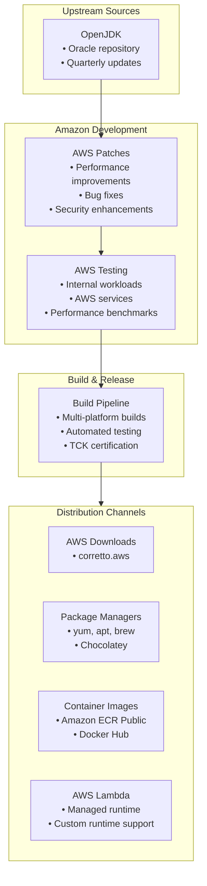

#java #jdk #openjdk #amazon #aws #site-reliability-engineering #cloud
# Amazon Corretto
- Amazon Corretto is a ==no-cost, multiplatform, production-ready distribution of OpenJDK== provided by Amazon Web Services.
- Corretto is used internally by Amazon for thousands of production services and is made available for external use.
- The distribution includes long-term support with performance enhancements and security patches from AWS.
- Corretto is optimized for AWS services but runs on any platform that supports standard OpenJDK.
# Key characteristics
## AWS optimization
- Corretto includes AWS-specific performance improvements and bug fixes.
- Optimized for running Java workloads on AWS infrastructure (EC2, Lambda, ECS, EKS).
- Integration with AWS monitoring and management tools.
- Tested extensively on AWS services before release.
## Long-term support
- Corretto provides free long-term support for LTS versions:
	- Corretto 8: Based on OpenJDK 8, support until at least May 2026
	- Corretto 11: Based on OpenJDK 11, support until at least September 2027
	- Corretto 17: Based on OpenJDK 17, support until at least September 2029
	- Corretto 21: Based on OpenJDK 21, support until at least September 2031
- Security updates and critical bug fixes provided at no cost.
- No license fees or subscription requirements for production use.
## TCK certification
- All Corretto releases pass the Java Technology Compatibility Kit (TCK).
- Ensures compatibility with Java SE specifications.
- Binary compatibility with standard OpenJDK distributions.
## Platform support
- Corretto supports multiple platforms:
	- Linux (x64, aarch64)
	- Windows (x64, x86)
	- macOS (x64, aarch64/Apple Silicon)
	- Docker container images
- Available in multiple package formats: installers, archives, system packages.
# Architecture

## Version scheme
- Corretto follows OpenJDK versioning with AWS-specific build numbers.
- Format: `major.minor.security.build-revision`
- Example: `17.0.9.8.1`
	- `17.0.9`: OpenJDK version
	- `8`: Build number
	- `1`: Corretto revision
# Installation
## Linux package managers
### Amazon Linux 2/2023
```shell
# Amazon Linux 2023
sudo yum install java-17-amazon-corretto-devel

# Amazon Linux 2
sudo amazon-linux-extras enable corretto17
sudo yum install java-17-amazon-corretto-devel
```
### Debian/Ubuntu (APT)
```shell
wget -O - https://apt.corretto.aws/corretto.key | sudo gpg --dearmor -o /usr/share/keyrings/corretto-keyring.gpg
echo "deb [signed-by=/usr/share/keyrings/corretto-keyring.gpg] https://apt.corretto.aws stable main" | sudo tee /etc/apt/sources.list.d/corretto.list

sudo apt update
sudo apt install java-17-amazon-corretto-jdk
```
### Red Hat/CentOS/Fedora (YUM/DNF)
```shell
sudo rpm --import https://yum.corretto.aws/corretto.key
sudo curl -L -o /etc/yum.repos.d/corretto.repo https://yum.corretto.aws/corretto.repo

sudo yum install java-17-amazon-corretto-devel
```
## macOS package managers
### Homebrew
```shell
brew install --cask corretto
# Or specific version
brew install --cask corretto@17
brew install --cask corretto@11
```
## Windows package managers
### Chocolatey
```shell
choco install corretto17jdk
```
### Direct installer
```powershell
# Download MSI installer from corretto.aws
# Install via MSI
msiexec /i amazon-corretto-17-x64-windows-jdk.msi /qn
```
## Container images
### Amazon ECR Public
```shell
docker pull public.ecr.aws/amazoncorretto/amazoncorretto:17
docker pull public.ecr.aws/amazoncorretto/amazoncorretto:17-alpine
```
### Docker Hub
```shell
docker pull amazoncorretto:17
docker pull amazoncorretto:17-alpine-jdk
```
### Using in Dockerfile
```dockerfile
FROM public.ecr.aws/amazoncorretto/amazoncorretto:17

WORKDIR /app
COPY target/application.jar /app/app.jar

ENTRYPOINT ["java", "-jar", "app.jar"]
```
## Manual installation
### Download and install
```shell
# Download from corretto.aws
wget https://corretto.aws/downloads/latest/amazon-corretto-17-x64-linux-jdk.tar.gz

# Extract
tar -xzf amazon-corretto-17-x64-linux-jdk.tar.gz

# Move to installation directory
sudo mv amazon-corretto-17.0.9.8.1-linux-x64 /opt/corretto-17

# Set environment variables
export JAVA_HOME=/opt/corretto-17
export PATH=$JAVA_HOME/bin:$PATH
```
# AWS integration
## AWS Lambda
- Corretto is the default Java runtime for AWS Lambda.
- Managed runtimes available for Java 8, 11, 17, and 21.
```java title='Lambda function using Corretto runtime'
public class Handler implements RequestHandler<Map<String,String>, String> {
    @Override
    public String handleRequest(Map<String,String> event, Context context) {
        return "Hello from Corretto on Lambda";
    }
}
```
### Custom runtime with Corretto
```dockerfile title='Custom Lambda runtime with Corretto'
FROM public.ecr.aws/amazoncorretto/amazoncorretto:17

# Install AWS Lambda Runtime Interface Client
RUN yum install -y aws-lambda-java-core aws-lambda-java-events

COPY target/function.jar /var/task/

CMD ["com.example.Handler::handleRequest"]
```
## Amazon EC2
### User data script for EC2
```shell
#!/bin/bash
# Install Corretto on EC2 instance
sudo yum update -y
sudo yum install -y java-17-amazon-corretto-devel

# Verify installation
java -version

# Set JAVA_HOME globally
echo "export JAVA_HOME=/usr/lib/jvm/java-17-amazon-corretto" >> /etc/environment
```
## AWS Elastic Beanstalk
### Using Corretto in Beanstalk
```yaml title='.ebextensions/corretto.config'
option_settings:
  aws:elasticbeanstalk:container:java:
    JVMOptions: "-Xms512m -Xmx2g"

commands:
  01_install_corretto:
    command: |
      sudo yum install -y java-17-amazon-corretto-devel
      sudo alternatives --set java /usr/lib/jvm/java-17-amazon-corretto/bin/java
```
## Amazon ECS/EKS
### ECS task definition
```json
{
  "family": "java-app",
  "containerDefinitions": [
    {
      "name": "app",
      "image": "public.ecr.aws/amazoncorretto/amazoncorretto:17",
      "memory": 2048,
      "cpu": 1024,
      "environment": [
        {
          "name": "JAVA_OPTS",
          "value": "-Xmx1536m -XX:+UseG1GC"
        }
      ]
    }
  ]
}
```
### Kubernetes deployment
```yaml
apiVersion: apps/v1
kind: Deployment
metadata:
  name: java-app
spec:
  replicas: 3
  template:
    spec:
      containers:
      - name: app
        image: public.ecr.aws/amazoncorretto/amazoncorretto:17
        resources:
          requests:
            memory: "1Gi"
            cpu: "500m"
          limits:
            memory: "2Gi"
            cpu: "1000m"
        env:
        - name: JAVA_OPTS
          value: "-XX:+UseContainerSupport -XX:MaxRAMPercentage=75.0"
```
# Performance optimizations
## AWS-specific patches
- Corretto includes performance improvements developed by AWS for internal workloads.
- Enhanced garbage collection tuning for cloud environments.
- Optimized cryptographic operations leveraging AWS hardware acceleration.
## JVM tuning for AWS
### EC2 instance optimization
```shell
# For general-purpose workloads on EC2
java -XX:+UseG1GC \
     -XX:MaxGCPauseMillis=200 \
     -XX:InitiatingHeapOccupancyPercent=45 \
     -Xms2g -Xmx4g \
     -jar application.jar
```
### Container optimization
```shell
# For containerized workloads
java -XX:+UseContainerSupport \
     -XX:MaxRAMPercentage=75.0 \
     -XX:+UseG1GC \
     -XX:+ExitOnOutOfMemoryError \
     -jar application.jar
```
### Lambda optimization
```shell
# For AWS Lambda (handled by runtime)
# Use SnapStart for faster cold starts
# Enable through Lambda function configuration
```
## Cryptographic performance
- Corretto leverages AWS Graviton processor optimizations.
- Enhanced AES-GCM performance on ARM-based instances.
```shell
# Enable AWS-optimized crypto providers
java -Djava.security.egd=file:/dev/urandom \
     -Dcrypto.policy=unlimited \
     -jar application.jar
```
# Configuration
## JVM flags for cloud environments
### General cloud optimization
```shell
export JAVA_OPTS="-server \
                  -XX:+UseG1GC \
                  -XX:+ParallelRefProcEnabled \
                  -XX:MaxGCPauseMillis=200 \
                  -XX:+UnlockExperimentalVMOptions \
                  -XX:+DisableExplicitGC \
                  -XX:+AlwaysPreTouch \
                  -XX:G1NewSizePercent=30 \
                  -XX:G1MaxNewSizePercent=40"
```
### Monitoring and diagnostics
```shell
# Enable JMX for monitoring
java -Dcom.sun.management.jmxremote \
     -Dcom.sun.management.jmxremote.port=9010 \
     -Dcom.sun.management.jmxremote.authenticate=false \
     -Dcom.sun.management.jmxremote.ssl=false \
     -jar application.jar

# Enable flight recorder
java -XX:StartFlightRecording=duration=60s,filename=recording.jfr \
     -jar application.jar
```
## CloudWatch integration
### JVM metrics to CloudWatch
```java
import com.amazonaws.services.cloudwatch.AmazonCloudWatch;
import com.amazonaws.services.cloudwatch.model.MetricDatum;
import java.lang.management.ManagementFactory;
import java.lang.management.MemoryMXBean;

MemoryMXBean memoryBean = ManagementFactory.getMemoryMXBean();
long heapUsed = memoryBean.getHeapMemoryUsage().getUsed();

// Send to CloudWatch
cloudWatch.putMetricData(
    new PutMetricDataRequest()
        .withNamespace("CustomJVM")
        .withMetricData(
            new MetricDatum()
                .withMetricName("HeapMemoryUsed")
                .withValue((double) heapUsed)
        )
);
```
# Version management
## Using SDKMAN
```shell
# Install SDKMAN
curl -s "https://get.sdkman.io" | bash

# List available Corretto versions
sdk list java | grep amzn

# Install specific version
sdk install java 17.0.9.8.1-amzn

# Set as default
sdk default java 17.0.9.8.1-amzn
```
## Multiple versions with alternatives
```shell
# Install multiple versions
sudo yum install java-11-amazon-corretto-devel
sudo yum install java-17-amazon-corretto-devel

# Switch between versions
sudo alternatives --config java
sudo alternatives --config javac

# Set manually
sudo alternatives --set java /usr/lib/jvm/java-17-amazon-corretto/bin/java
```
# Security features
## Security updates
- Quarterly security updates aligned with OpenJDK CPU schedule.
- Additional out-of-band patches for critical vulnerabilities.
- Security advisories published on corretto.aws/security
## TLS configuration
```shell
# Enable TLS 1.3
java -Djdk.tls.client.protocols=TLSv1.3 \
     -Djdk.tls.server.protocols=TLSv1.3 \
     -jar application.jar
```
## FIPS compliance
- Corretto Crypto Provider (CCP) available for FIPS 140-2 requirements.
- Provides cryptographic operations validated by NIST.
```shell
# Enable Corretto Crypto Provider
java -cp /path/to/AmazonCorrettoCryptoProvider.jar:application.jar \
     -Djava.security.properties==/path/to/security.properties \
     com.example.Main
```
# Corretto Crypto Provider
- Amazon Corretto Crypto Provider (ACCP) is a cryptographic library optimized for AWS.
- Provides hardware-accelerated cryptographic operations on AWS Graviton processors.
- FIPS 140-2 validated for compliance requirements.
## Installation
```shell
# Add ACCP as dependency (Maven)
<dependency>
    <groupId>software.amazon.cryptools</groupId>
    <artifactId>AmazonCorrettoCryptoProvider</artifactId>
    <version>2.3.3</version>
</dependency>
```
## Usage
```java
import com.amazon.corretto.crypto.provider.AmazonCorrettoCryptoProvider;
import java.security.Security;

// Install ACCP as highest priority provider
AmazonCorrettoCryptoProvider.install();

// Or install at specific position
Security.insertProviderAt(new AmazonCorrettoCryptoProvider(), 1);
```
# Monitoring and diagnostics
## JFR (Java Flight Recorder)
```shell
# Start recording on application launch
java -XX:StartFlightRecording=duration=300s,filename=/tmp/recording.jfr \
     -jar application.jar

# Start recording on running JVM
jcmd <pid> JFR.start duration=60s filename=/tmp/recording.jfr

# Dump recording
jcmd <pid> JFR.dump filename=/tmp/dump.jfr
```
## Garbage collection logging
```shell
# G1GC logging
java -Xlog:gc*:file=/tmp/gc.log:time,uptime,level,tags \
     -XX:+UseG1GC \
     -jar application.jar

# Detailed GC analysis
java -Xlog:gc*=debug:file=/tmp/gc-debug.log \
     -jar application.jar
```
## Thread dumps and heap dumps
```shell
# Thread dump
jstack <pid> > thread-dump.txt

# Heap dump
jmap -dump:live,format=b,file=/tmp/heap-dump.hprof <pid>

# Heap histogram
jmap -histo:live <pid>
```
# Migration guide
## From Oracle JDK
- Corretto is a drop-in replacement for Oracle JDK.
- Binary compatible with Oracle JDK for the same major version.
- No application code changes required.
```shell
# Uninstall Oracle JDK
sudo yum remove oracle-jdk

# Install Corretto
sudo yum install java-17-amazon-corretto-devel

# Update JAVA_HOME
export JAVA_HOME=/usr/lib/jvm/java-17-amazon-corretto
```
## From other OpenJDK distributions
- Compatible with any OpenJDK-based distribution.
- Update package installation and JAVA_HOME path.
```shell
# Update Docker base image
# FROM openjdk:17
FROM public.ecr.aws/amazoncorretto/amazoncorretto:17
```
# Use cases
## Production workloads on AWS
- Ideal for Java applications running on EC2, ECS, EKS, or Lambda.
- Optimized for AWS infrastructure and services.
- Free long-term support reduces operational costs.
## Serverless applications
- Default runtime for AWS Lambda Java functions.
- SnapStart support for reduced cold start times.
- Integration with AWS SDK and services.
## Microservices architectures
- Container images optimized for size and startup time.
- Works with service mesh (App Mesh, Istio) on EKS.
- Suitable for Kubernetes deployments on AWS.
## Enterprise applications
- No-cost LTS alternative to commercial JDK distributions.
- Backed by Amazon's internal use and testing.
- Compliance certifications for regulated industries.
# Comparison with other distributions
## vs Eclipse Temurin
- Corretto: AWS-optimized, includes AWS-specific patches
- Temurin: Vendor-neutral, broader community governance
- Both: Free, LTS support, TCK certified
## vs Oracle JDK
- Corretto: Free for all use, AWS optimizations
- Oracle JDK: Subscription required for production, Oracle support
- Both: Fully Java SE compliant
## vs Red Hat OpenJDK
- Corretto: Available on all platforms, AWS focus
- Red Hat: Integrated with RHEL, Red Hat support
- Both: Enterprise-ready, production-tested
# Support and resources
## Community support
- GitHub repository: https://github.com/corretto
- AWS Developer Forums: forums.aws.amazon.com
- Documentation: docs.aws.amazon.com/corretto
## AWS Support
- Available through AWS Support plans.
- Enterprise support includes JVM troubleshooting assistance.
- Integration with AWS Premium Support.
## Security advisories
- Published at corretto.aws/security
- CVE tracking and patches aligned with OpenJDK.
- Additional AWS-discovered vulnerabilities patched proactively.
***
# References
1. Amazon Corretto Official Website: https://aws.amazon.com/corretto/
2. Corretto Downloads: https://corretto.aws/downloads/
3. GitHub - Amazon Corretto: https://github.com/corretto
4. AWS Documentation - Corretto: https://docs.aws.amazon.com/corretto/
5. Amazon Corretto Crypto Provider: https://github.com/corretto/amazon-corretto-crypto-provider
6. AWS Lambda Java Runtime: https://docs.aws.amazon.com/lambda/latest/dg/lambda-java.html