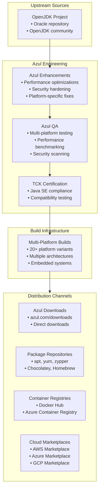
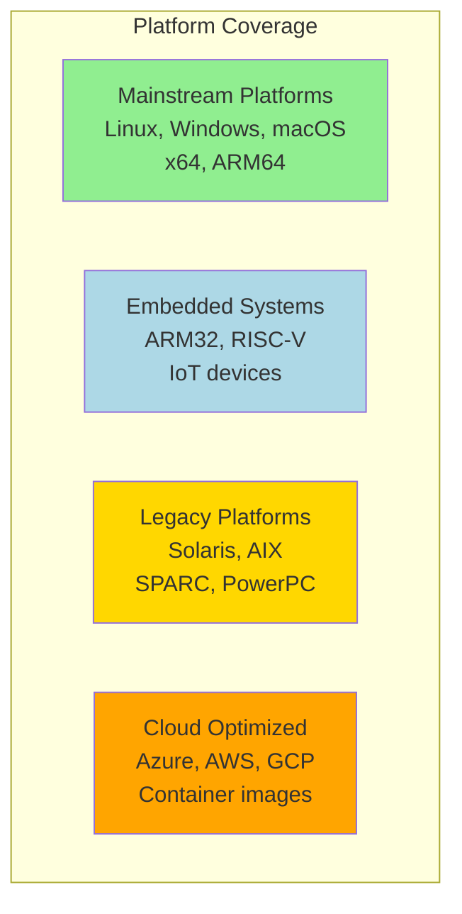
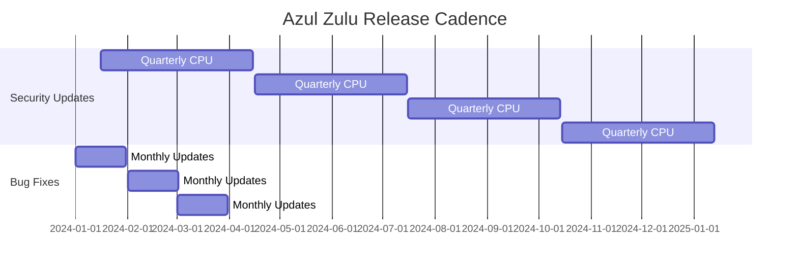

#java #jdk #openjdk #azul #site-reliability-engineering #cloud #enterprise
# Azul Zulu
- Azul Zulu is a ==certified, compliant build of OpenJDK== provided by Azul Systems.
- Zulu is freely available for production use with no licensing fees or restrictions.
- The distribution is optimized for ==performance, security, and enterprise deployments== across cloud and on-premise environments.
- Azul offers commercial support options and extended support beyond standard LTS timelines.
- Zulu is one of the most widely deployed OpenJDK distributions, powering applications at major enterprises globally.
# Key characteristics
## TCK certification
- All Azul Zulu releases are ==fully certified== against the Java Technology Compatibility Kit (TCK).
- Ensures 100% compatibility with Java SE specifications.
- Binary compatible with Oracle JDK and other compliant OpenJDK builds.
- Each release undergoes rigorous testing before distribution.
## Extended availability
- Azul provides Zulu builds for ==more platforms and architectures== than most distributions:
	- Linux (x64, aarch64, arm32, mips64, ppc64, riscv64)
	- Windows (x64, x86, aarch64)
	- macOS (x64, aarch64/Apple Silicon)
	- Solaris (x64, sparc)
	- AIX (ppc64)
	- QNX (embedded systems)
- Supports legacy platforms and specialized hardware.
## Long-term support
- Zulu provides free LTS releases with extended support timelines:
	- Zulu 8: Support through 2030 (commercial support available beyond)
	- Zulu 11: Support through 2032
	- Zulu 17: Support through 2029
	- Zulu 21: Support through 2031
- Medium-Term Support (MTS) for select non-LTS versions.
- Commercial support available for extended lifecycles.
## Regular updates
- Quarterly security updates aligned with Oracle's Critical Patch Updates (CPU).
- Monthly bug fix updates for current releases.
- Proactive security patches for zero-day vulnerabilities.
- Transparent release notes and changelogs.
## JDK Flight Recorder and Mission Control
- Zulu includes ==JDK Flight Recorder (JFR)== for production profiling.
- Compatible with JDK Mission Control (JMC) for analysis.
- Low-overhead performance monitoring capabilities.
- Available in both free Zulu builds and commercial offerings.
# Architecture

## Azul product portfolio
- **Zulu Community**: Free, fully certified OpenJDK builds.
- **Zulu Enterprise**: Commercial builds with extended support and SLAs.
- **Azul Platform Prime (Zing)**: Premium JVM with C4 garbage collector and ReadyNow technology.
- **Azul Intelligence Cloud**: Cloud-based JVM monitoring and optimization.
# Installation
## Linux package managers
### Debian/Ubuntu (APT)
```shell
# Add Azul repository key
sudo apt-key adv --keyserver hkp://keyserver.ubuntu.com:80 --recv-keys 0xB1998361219BD9C9
# Add repository
sudo apt-add-repository 'deb http://repos.azul.com/zulu/deb stable main'
sudo apt update
# Install Zulu 17
sudo apt install zulu17-jdk
# Install Zulu 11
sudo apt install zulu11-jdk
# Install Zulu 8
sudo apt install zulu8-jdk
```
### Red Hat/CentOS/Fedora (YUM/DNF)
```shell
# Add Azul repository
sudo yum install -y https://cdn.azul.com/zulu/bin/zulu-repo-1.0.0-1.noarch.rpm
# Install Zulu 17
sudo yum install zulu17-jdk
# Install Zulu 11
sudo yum install zulu11-jdk
```
### openSUSE/SLES (Zypper)
```shell
# Add Azul repository
sudo zypper addrepo http://repos.azul.com/zulu/rpm zulu
sudo zypper refresh
# Install Zulu 17
sudo zypper install zulu17-jdk
```
## macOS package managers
### Homebrew
```shell
# Install latest Zulu
brew install --cask zulu
# Install specific version
brew tap mdogan/zulu
brew install --cask zulu@17
brew install --cask zulu@11
```
## Windows package managers
### Chocolatey
```shell
choco install zulu17
choco install zulu11
```
### Scoop
```shell
scoop bucket add java
scoop install zulu17-jdk
```
### Windows MSI installer
```powershell
# Download MSI from azul.com
# Silent install
msiexec /i zulu17.msi /qn INSTALLDIR="C:\Program Files\Zulu\zulu-17"
```
## Container images
### Docker Hub
```shell
# Official Azul Zulu images
docker pull azul/zulu-openjdk:17
docker pull azul/zulu-openjdk:17-jre
docker pull azul/zulu-openjdk-alpine:17
docker pull azul/zulu-openjdk-distroless:17
```
### Azure Container Registry
```shell
# Zulu images in Microsoft Azure
docker pull mcr.microsoft.com/java/jdk:17-zulu-alpine
docker pull mcr.microsoft.com/java/jre:17-zulu-alpine
```
### Using in Dockerfile
```dockerfile
FROM azul/zulu-openjdk:17-jre
WORKDIR /app
COPY target/application.jar /app/app.jar
# Zulu optimized for containers
ENV JAVA_OPTS="-XX:+UseContainerSupport \
               -XX:MaxRAMPercentage=75.0 \
               -XX:+ExitOnOutOfMemoryError"
ENTRYPOINT ["sh", "-c", "java $JAVA_OPTS -jar app.jar"]
```
## Cloud marketplace installations
### AWS Marketplace
```shell
# Zulu AMIs available in AWS Marketplace
# Search for "Azul Zulu" in AWS Marketplace
# Launch EC2 instance with pre-installed Zulu
```
### Azure Marketplace
```shell
# Zulu is the default OpenJDK on Azure
# Pre-installed in Azure App Service, Azure Functions
# Azure SDK for Java uses Zulu
```
### Google Cloud Marketplace
```shell
# Zulu available through GCP Marketplace
# Used in Google App Engine Java runtime
```
## Manual installation
### Download and extract
```shell
# Download from azul.com/downloads
wget https://cdn.azul.com/zulu/bin/zulu17.48.15-ca-jdk17.0.10-linux_x64.tar.gz
# Extract
tar -xzf zulu17.48.15-ca-jdk17.0.10-linux_x64.tar.gz
# Move to installation directory
sudo mv zulu17.48.15-ca-jdk17.0.10-linux_x64 /opt/zulu-17
# Set environment variables
export JAVA_HOME=/opt/zulu-17
export PATH=$JAVA_HOME/bin:$PATH
```
# Azul-specific features
## Zulu Build of OpenJDK
- Azul builds Zulu from ==100% open-source OpenJDK code==.
- No proprietary additions or vendor lock-in.
- Includes backported features and performance improvements.
- Enhanced security with proactive vulnerability patching.
## JDK Flight Recorder (JFR)
- Production-ready profiling with minimal overhead (<1%).
- Built into Zulu at no additional cost.
```shell
# Enable JFR recording
java -XX:StartFlightRecording=duration=300s,filename=/tmp/recording.jfr \
     -jar application.jar
# Start recording on running JVM
jcmd <pid> JFR.start duration=60s filename=/tmp/recording.jfr
# Analyze with JDK Mission Control
jmc /tmp/recording.jfr
```
## ReadyNow (Zing feature)
- Available in ==Azul Platform Prime (Zing)==, not free Zulu.
- Warm-up profiles eliminate JIT warmup time.
- Achieves peak performance immediately on startup.
```shell
# Create warmup profile (Zing only)
java -XX:ProfileLogIn=/path/to/profile.cfg -jar application.jar
# Use profile on subsequent runs
java -XX:ProfileLogOut=/path/to/profile.cfg -jar application.jar
```
## C4 Garbage Collector (Zing feature)
- Continuously Concurrent Compacting Collector available in ==Zing only==.
- Eliminates GC pauses regardless of heap size.
- Supports multi-terabyte heaps with consistent sub-millisecond pauses.
```shell
# Enable C4 GC (Zing/Platform Prime only)
java -XX:+UseAzulC4GC -Xmx256g -jar application.jar
```
# Platform support
## Embedded systems
- Azul provides Zulu Embedded for resource-constrained devices.
- Compact builds optimized for IoT and embedded applications.
- Support for ARM32, ARM64, and specialized architectures.
```shell
# Zulu Embedded for ARM
wget https://cdn.azul.com/zulu-embedded/bin/zulu17-ca-jdk17.0.10-linux_aarch32hf.tar.gz
```
## Legacy platforms
- Continued support for Solaris SPARC and x64.
- AIX support for IBM Power systems.
- Windows 32-bit support for legacy applications.
## Alpine Linux
- Musl-based Alpine Linux images for minimal container footprint.
```dockerfile
FROM azul/zulu-openjdk-alpine:17-jre
# Minimal base image ~50MB
```
# Cloud platform integration
## Microsoft Azure
- Zulu is the ==default OpenJDK for Microsoft Azure==.
- Pre-installed in Azure App Service, Azure Functions, Azure Spring Apps.
- Microsoft provides long-term support for Zulu on Azure.
### Azure App Service
```shell
# Zulu pre-installed in Azure App Service
# Specified in application settings
az webapp config set --resource-group myResourceGroup \
                      --name myApp \
                      --linux-fx-version "JAVA|17-java17"
```
### Azure Functions
```json
{
  "version": "2.0",
  "extensionBundle": {
    "id": "Microsoft.Azure.Functions.ExtensionBundle",
    "version": "[3.*, 4.0.0)"
  },
  "functions": {
    "HttpTrigger": {
      "scriptFile": "function.jar",
      "entryPoint": "com.example.Function.run",
      "bindings": []
    }
  }
}
```
### Azure Spring Apps
```shell
# Deploy Spring Boot app with Zulu
az spring app deploy --resource-group myResourceGroup \
                      --service mySpringApp \
                      --name myApp \
                      --runtime-version Java_17 \
                      --artifact-path target/app.jar
```
## Amazon Web Services (AWS)
- Zulu AMIs available in AWS Marketplace.
- Compatible with AWS Elastic Beanstalk, ECS, EKS.
### AWS Elastic Beanstalk
```yaml
# .ebextensions/java.config
option_settings:
  aws:elasticbeanstalk:container:java:
    JVMOptions: "-Xmx2g -XX:+UseG1GC"
```
### AWS Lambda custom runtime
```dockerfile
FROM azul/zulu-openjdk:17-jre
# Build Lambda custom runtime with Zulu
RUN yum install -y aws-lambda-java-core
COPY target/function.jar /var/task/
CMD ["com.example.Handler::handleRequest"]
```
## Google Cloud Platform (GCP)
- Zulu used in Google App Engine standard environment.
- Available in GCP Marketplace.
### Google App Engine
```yaml
# app.yaml
runtime: java17
entrypoint: 'java -jar app.jar'
```
## Kubernetes and OpenShift
### Kubernetes deployment
```yaml
apiVersion: apps/v1
kind: Deployment
metadata:
  name: zulu-app
spec:
  replicas: 3
  template:
    spec:
      containers:
      - name: app
        image: azul/zulu-openjdk:17-jre
        resources:
          requests:
            memory: "512Mi"
            cpu: "250m"
          limits:
            memory: "1Gi"
            cpu: "500m"
        env:
        - name: JAVA_OPTS
          value: "-XX:+UseContainerSupport -XX:MaxRAMPercentage=75.0"
```
# Configuration and tuning
## Performance optimization
### High-throughput server
```shell
# Optimized for throughput
java -server \
     -Xms4g -Xmx4g \
     -XX:+UseG1GC \
     -XX:MaxGCPauseMillis=200 \
     -XX:+UseStringDeduplication \
     -XX:+ParallelRefProcEnabled \
     -jar application.jar
```
### Low-latency trading applications
```shell
# Minimize pause times
java -Xms16g -Xmx16g \
     -XX:+UseG1GC \
     -XX:MaxGCPauseMillis=10 \
     -XX:+AlwaysPreTouch \
     -XX:+DisableExplicitGC \
     -XX:+UseStringDeduplication \
     -jar application.jar
```
### Container-optimized
```shell
# Automatically adapt to container limits
java -XX:+UseContainerSupport \
     -XX:MaxRAMPercentage=75.0 \
     -XX:InitialRAMPercentage=50.0 \
     -XX:+UseG1GC \
     -XX:+ExitOnOutOfMemoryError \
     -jar application.jar
```
### Microservices fast startup
```shell
# Fast startup for short-lived processes
java -XX:TieredStopAtLevel=1 \
     -XX:+UseSerialGC \
     -Xmx256m \
     -jar microservice.jar
```
## JVM diagnostic flags
### Verbose logging
```shell
# GC logging
java -Xlog:gc*:file=/tmp/gc.log:time,uptime,level,tags \
     -XX:+UseGCLogFileRotation \
     -XX:NumberOfGCLogFiles=5 \
     -XX:GCLogFileSize=20M \
     -jar application.jar
# Class loading
java -Xlog:class+load=info -jar application.jar
# JIT compilation
java -XX:+PrintCompilation -jar application.jar
```
### Heap dump on OutOfMemoryError
```shell
java -XX:+HeapDumpOnOutOfMemoryError \
     -XX:HeapDumpPath=/var/log/java/heapdump.hprof \
     -XX:+ExitOnOutOfMemoryError \
     -jar application.jar
```
## Security configuration
### TLS 1.3
```shell
# Enable TLS 1.3
java -Djdk.tls.client.protocols=TLSv1.3 \
     -Djdk.tls.server.protocols=TLSv1.3 \
     -jar application.jar
```
### Enhanced cryptography
```shell
# Unlimited cryptographic strength (default in modern JDKs)
java -Dcrypto.policy=unlimited -jar application.jar
```
# Monitoring and diagnostics
## Azul Intelligence Cloud
- Azul offers ==cloud-based JVM monitoring and optimization== service.
- Provides insights into JVM behavior, memory usage, and performance.
- Identifies optimization opportunities and potential issues.
- Available for Zulu Enterprise and Platform Prime customers.
## JDK Mission Control
- Free tool for analyzing JFR recordings.
- Visualizes performance metrics, memory allocation, thread activity.
```shell
# Download JMC from azul.com
# Open JFR recording
jmc /tmp/recording.jfr
```
## JConsole and VisualVM
- Standard JDK monitoring tools fully compatible with Zulu.
```shell
# Enable JMX
java -Dcom.sun.management.jmxremote \
     -Dcom.sun.management.jmxremote.port=9010 \
     -Dcom.sun.management.jmxremote.authenticate=false \
     -Dcom.sun.management.jmxremote.ssl=false \
     -jar application.jar
# Connect with JConsole
jconsole localhost:9010
```
## Thread dumps and heap analysis
```shell
# Thread dump
jstack <pid> > threaddump.txt
# Using jcmd
jcmd <pid> Thread.print > threaddump.txt
# Heap dump
jmap -dump:live,format=b,file=heapdump.hprof <pid>
# Heap histogram
jmap -histo:live <pid>
```
# Performance characteristics
## Multi-platform optimization

- Azul provides ==broadest platform coverage== among OpenJDK distributions.
- Optimized builds for specific architectures and use cases.
## Update frequency

- More frequent updates than many other distributions.
- Proactive patching for critical vulnerabilities.
# Version management
## Using SDKMAN
```shell
# Install SDKMAN
curl -s "https://get.sdkman.io" | bash
# List Zulu versions
sdk list java | grep zulu
# Install Zulu 17
sdk install java 17.0.10-zulu
# Set as default
sdk default java 17.0.10-zulu
# Switch versions
sdk use java 17.0.10-zulu
```
## Using jEnv
```shell
# Add Zulu installation
jenv add /opt/zulu-17
# Set global version
jenv global zulu64-17.0.10
# Set local version
cd /path/to/project
jenv local zulu64-17.0.10
```
## Multiple Zulu versions
```shell
# Install multiple versions via package manager
sudo apt install zulu8-jdk zulu11-jdk zulu17-jdk
# Use alternatives (Linux)
sudo update-alternatives --config java
```
# Security features
## Proactive security updates
- Azul releases security patches ==ahead of standard CPU schedule== when critical.
- Transparent security advisories and CVE tracking.
- Security bulletins published at azul.com/security
## Vulnerability scanning
- Azul scans Zulu builds for known vulnerabilities.
- Integration with vulnerability databases (NVD, NIST).
- Container images scanned before publication.
## Secure defaults
- Modern TLS protocols enabled by default.
- Strong cryptographic algorithms prioritized.
- Deprecated insecure features disabled.
# Migration guide
## From Oracle JDK to Zulu
- Zulu is a drop-in replacement for Oracle JDK.
- Binary compatible for same major version.
### Migration steps
```shell
# Remove Oracle JDK
sudo yum remove oracle-java
# Install Zulu
sudo yum install zulu17-jdk
# Update JAVA_HOME
export JAVA_HOME=/usr/lib/jvm/zulu17
# Verify
java -version
```
## From other OpenJDK distributions
### Container migration
```dockerfile
# Before: Other distribution
# FROM eclipse-temurin:17-jdk
# After: Azul Zulu
FROM azul/zulu-openjdk:17
```
### Application migration
- No code changes required for compliant Java applications.
- Test thoroughly in development environment first.
- Monitor JVM metrics after migration.
# Zulu Enterprise
## Commercial support
- Zulu Enterprise provides ==commercial support with SLAs==.
- 24x7 support from Azul engineers.
- Extended support beyond community timelines.
- Guaranteed response times for critical issues.
## Enhanced features
- Priority access to bug fixes and patches.
- Customized builds for specific requirements.
- Dedicated support portal and knowledge base.
- Proactive monitoring and optimization recommendations.
## Pricing model
- Subscription-based pricing per core or per instance.
- Flexible licensing for cloud and on-premise deployments.
- Volume discounts for enterprise deployments.
# Azul Platform Prime (Zing)
## Premium JVM features
- Azul Platform Prime (formerly Zing) is a ==premium Java runtime== with advanced features.
- C4 garbage collector for pauseless operation.
- ReadyNow for instant warmup.
- Falcon JIT compiler for optimized performance.
## C4 Garbage Collector
- Continuously Concurrent Compacting Collector.
- Eliminates GC pauses regardless of heap size.
- Supports heaps up to 16TB with sub-millisecond pauses.
- Ideal for latency-sensitive applications (trading, gaming, analytics).
## ReadyNow technology
- Eliminates JIT compiler warmup time.
- Applications reach peak performance immediately.
- Profile-guided optimization using production workload data.
## Use cases for Platform Prime
- Ultra-low latency trading platforms.
- Real-time analytics and big data processing.
- Large-scale caching layers (Redis, Memcached alternatives).
- High-frequency transaction processing.
# Use cases
## Enterprise production applications
- Mission-critical applications requiring certified, supported JDK.
- Multi-platform deployments across diverse infrastructure.
- Long-term support requirements beyond standard LTS.
## Cloud-native microservices
- Container-optimized builds for Kubernetes deployments.
- Fast startup and low memory footprint for scaling.
- Integration with major cloud platforms (Azure, AWS, GCP).
## Microsoft Azure ecosystem
- Default OpenJDK for Azure services.
- Seamless integration with Azure App Service, Functions, Spring Apps.
- Microsoft-backed support on Azure platform.
## Embedded and IoT devices
- Zulu Embedded for resource-constrained environments.
- Support for ARM32, ARM64, and specialized architectures.
- Compact builds for edge computing.
## Financial services and trading
- Low-latency requirements for algorithmic trading.
- Large heap applications with consistent performance.
- FIPS compliance for regulatory requirements.
## Development environments
- Free, full-featured JDK for local development.
- Cross-platform consistency (Windows, macOS, Linux).
- Compatible with all major IDEs.
# Comparison with other distributions
## vs Eclipse Temurin
- Zulu: Broader platform support, commercial options, Azure integration
- Temurin: Vendor-neutral governance, community-driven
- Both: Free, TCK certified, production-ready
## vs Amazon Corretto
- Zulu: Multi-cloud, broader platforms, commercial support available
- Corretto: AWS-optimized, free for all platforms
- Both: Long-term support, enterprise-grade
## vs Red Hat OpenJDK
- Zulu: Multi-platform, independent of OS, commercial support
- Red Hat: RHEL integration, subscription-based, middleware focus
- Both: Enterprise support, TCK certified
## vs Oracle JDK
- Zulu: Free for production, commercial support optional
- Oracle JDK: Subscription required, Oracle support
- Both: Full Java SE compliance, enterprise-ready
# Support and community
## Azul support options
- **Community Support**: Free community forums and documentation.
- **Zulu Enterprise Support**: Commercial support with SLAs.
- **Platform Prime Support**: Premium support for Zing customers.
## Resources
- Azul website: https://www.azul.com/
- Zulu downloads: https://www.azul.com/downloads/
- Azul documentation: https://docs.azul.com/
- Community forums: https://community.azul.com/
## Knowledge base
- Technical articles and guides.
- Performance tuning recommendations.
- Troubleshooting documentation.
- Migration guides and best practices.
## Security bulletins
- Published at: https://www.azul.com/products/azul-support-roadmap/
- CVE notifications and remediation guidance.
- Proactive security advisories.
***
# References
1. Azul Zulu Official Website: https://www.azul.com/downloads/zulu-community/
2. Azul Documentation: https://docs.azul.com/
3. Zulu Downloads: https://www.azul.com/downloads/
4. Azul Platform Prime (Zing): https://www.azul.com/products/prime/
5. Azul Intelligence Cloud: https://www.azul.com/products/intelligence-cloud/
6. Azul on Microsoft Azure: https://azure.microsoft.com/en-us/updates/announcing-general-availability-of-microsoft-build-of-openjdk/
7. Azul Security Bulletins: https://www.azul.com/products/azul-support-roadmap/
8. JDK Mission Control: https://www.azul.com/products/components/zulu-mission-control/
9. [[site-reliability-engineering/build-tools/java/java-runtime/Java Development Kit (JDK), Java Runtime Environment (JRE) and Java Virtual Machine (JVM)]]
10. [[site-reliability-engineering/build-tools/java/java-runtime/java-distribution/OpenJDK]]
11. [[site-reliability-engineering/build-tools/java/java-runtime/java-distribution/Eclipse Temurin]]
12. [[site-reliability-engineering/build-tools/java/java-runtime/java-distribution/Amazon Corretto]]
13. [[site-reliability-engineering/build-tools/java/java-runtime/java-distribution/IBM Semeru]]
14. [[site-reliability-engineering/build-tools/java/java-runtime/java-distribution/Red Hat OpenJDK]]
