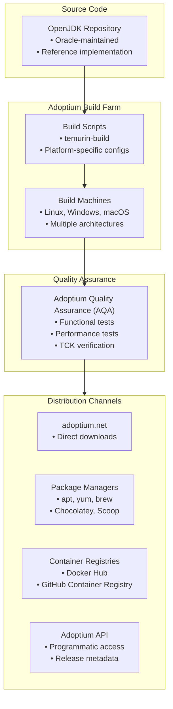

#java #jdk #openjdk #eclipse #adoptium #site-reliability-engineering #open-source
# Eclipse Temurin
- Eclipse Temurin is the official ==OpenJDK distribution== provided by the Eclipse Adoptium Working Group.
- Temurin is the successor to AdoptOpenJDK and provides prebuilt, tested, and certified OpenJDK binaries for multiple platforms.
- The distribution is ==free, open-source==, and production-ready with long-term support versions.
- Temurin is one of the most widely adopted OpenJDK distributions for enterprise and cloud deployments.
# Key characteristics
## Open governance
- Temurin is governed by the Eclipse Adoptium Working Group, ensuring vendor-neutral development.
- The project includes members from major companies including Microsoft, Red Hat, IBM, and Azul Systems.
- All builds are created using fully open-source build scripts and infrastructure.
## TCK certified
- All Temurin releases are tested against the Java Technology Compatibility Kit (TCK).
- TCK certification ensures full compliance with Java SE specifications.
- Each release passes extensive quality assurance testing before distribution.
## Long-term support
- Temurin provides LTS releases aligned with OpenJDK LTS schedule.
- LTS versions receive security updates and bug fixes for extended periods:
	- Java 8: Support until at least November 2026
	- Java 11: Support until at least October 2027
	- Java 17: Support until at least October 2029
	- Java 21: Support until at least September 2031
- Non-LTS feature releases receive updates until the next feature release.
## Platform coverage
- Temurin supports multiple operating systems:
	- Linux (x64, aarch64, arm, ppc64le, s390x)
	- Windows (x64, x86, aarch64)
	- macOS (x64, aarch64/Apple Silicon)
	- AIX (ppc64)
- Both JDK and JRE variants are available.
- Supports multiple package formats: archives (tar.gz, zip), installers (MSI, PKG, DEB, RPM), container images.
# Architecture
## Build infrastructure
- Temurin uses reproducible builds to ensure consistency and security.
- All builds are performed on dedicated infrastructure maintained by the Adoptium Working Group.
- Build scripts are open-source and available in the temurin-build repository.

## Release cadence
- Feature releases every 6 months (March and September).
- LTS releases every 2 years (September of even years).
- Security updates on a quarterly basis (January, April, July, October).
- Critical patch updates released as needed for severe vulnerabilities.
# Installation
## Linux package managers
### Debian/Ubuntu (APT)
```shell
wget -O - https://packages.adoptium.net/artifactory/api/gpg/key/public | sudo apt-key add -
echo "deb https://packages.adoptium.net/artifactory/deb $(awk -F= '/^VERSION_CODENAME/{print$2}' /etc/os-release) main" | sudo tee /etc/apt/sources.list.d/adoptium.list
sudo apt update
sudo apt install temurin-17-jdk
```
### Red Hat/CentOS/Fedora (YUM/DNF)
```shell
cat <<EOF | sudo tee /etc/yum.repos.d/adoptium.repo
[Adoptium]
name=Adoptium
baseurl=https://packages.adoptium.net/artifactory/rpm/centos/\$releasever/\$basearch
enabled=1
gpgcheck=1
gpgkey=https://packages.adoptium.net/artifactory/api/gpg/key/public
EOF

sudo yum install temurin-17-jdk
```
## macOS package managers
### Homebrew
```shell
brew install --cask temurin
# Or specific version
brew install --cask temurin@17
brew install --cask temurin@11
```
## Windows package managers
### Chocolatey
```shell
choco install temurin17
```
### Scoop
```shell
scoop bucket add java
scoop install temurin-lts-jdk
```
## Container images
### Docker Hub
```shell
docker pull eclipse-temurin:17-jdk
docker pull eclipse-temurin:17-jre
docker pull eclipse-temurin:21-jdk-alpine
```
### Using in Dockerfile
```dockerfile
FROM eclipse-temurin:17-jdk-jammy

WORKDIR /app
COPY target/myapp.jar /app/app.jar

ENTRYPOINT ["java", "-jar", "app.jar"]
```
## Manual installation
### Download and extract
```shell
# Download from adoptium.net
wget https://github.com/adoptium/temurin17-binaries/releases/download/jdk-17.0.9%2B9/OpenJDK17U-jdk_x64_linux_hotspot_17.0.9_9.tar.gz

# Extract
tar -xzf OpenJDK17U-jdk_x64_linux_hotspot_17.0.9_9.tar.gz

# Move to installation directory
sudo mv jdk-17.0.9+9 /opt/temurin-17

# Set environment variables
export JAVA_HOME=/opt/temurin-17
export PATH=$JAVA_HOME/bin:$PATH
```
# Version management
## Using SDKMAN
```shell
# Install SDKMAN
curl -s "https://get.sdkman.io" | bash

# List available Temurin versions
sdk list java | grep tem

# Install specific version
sdk install java 17.0.9-tem

# Switch between versions
sdk use java 17.0.9-tem
sdk default java 17.0.9-tem
```
## Using jenv
```shell
# Add Temurin installation to jenv
jenv add /opt/temurin-17

# Set global version
jenv global temurin64-17.0.9

# Set local version for project
cd /path/to/project
jenv local temurin64-17.0.9
```
# Adoptium API
- The Adoptium API provides programmatic access to release information and binary downloads.
- API endpoint: `https://api.adoptium.net`
## Query available releases
```shell
# Get latest LTS release
curl https://api.adoptium.net/v3/assets/latest/17/hotspot

# Get specific version
curl https://api.adoptium.net/v3/assets/version/17.0.9+9

# Filter by platform and architecture
curl "https://api.adoptium.net/v3/assets/latest/17/hotspot?os=linux&architecture=x64&image_type=jdk"
```
## Download binary programmatically
```shell
# Get download URL for latest Java 17 JDK on Linux x64
DOWNLOAD_URL=$(curl -s "https://api.adoptium.net/v3/binary/latest/17/ga/linux/x64/jdk/hotspot/normal/eclipse" -w "%{redirect_url}" -o /dev/null)

# Download the binary
wget "$DOWNLOAD_URL" -O temurin-17-jdk.tar.gz
```
# Configuration
## JVM options
- Temurin uses HotSpot JVM with standard JVM options.
```shell
# Set heap size
java -Xms512m -Xmx2g -jar application.jar

# Enable garbage collection logging
java -Xlog:gc*:file=gc.log -jar application.jar

# Use G1 garbage collector
java -XX:+UseG1GC -jar application.jar
```
## JVM flags for containerized environments
```dockerfile
FROM eclipse-temurin:17-jdk-jammy

ENV JAVA_OPTS="-XX:+UseContainerSupport \
               -XX:MaxRAMPercentage=75.0 \
               -XX:InitialRAMPercentage=50.0 \
               -XX:+ExitOnOutOfMemoryError"

ENTRYPOINT ["sh", "-c", "java $JAVA_OPTS -jar app.jar"]
```
## Security configuration
### Enable TLS 1.3
```shell
java -Djdk.tls.client.protocols=TLSv1.3 -jar application.jar
```
### Configure cryptographic policies
```shell
# Unlimited cryptography (enabled by default in modern JDKs)
java -Dcrypto.policy=unlimited -jar application.jar
```
# Migration from AdoptOpenJDK
- Eclipse Temurin is the direct successor to AdoptOpenJDK.
- AdoptOpenJDK binaries were rebranded to Temurin after the project moved to the Eclipse Foundation.
## Package name changes
- Old: `adoptopenjdk-17-hotspot`
- New: `temurin-17-jdk`
## Container image changes
- Old: `adoptopenjdk:17-jdk-hotspot`
- New: `eclipse-temurin:17-jdk`
## Migration steps
```shell
# Remove old AdoptOpenJDK package
sudo apt remove adoptopenjdk-17-hotspot

# Add Adoptium repository
wget -O - https://packages.adoptium.net/artifactory/api/gpg/key/public | sudo apt-key add -
echo "deb https://packages.adoptium.net/artifactory/deb $(lsb_release -sc) main" | sudo tee /etc/apt/sources.list.d/adoptium.list

# Install Temurin
sudo apt update
sudo apt install temurin-17-jdk

# Update JAVA_HOME if needed
export JAVA_HOME=/usr/lib/jvm/temurin-17-jdk-amd64
```
# Use cases
## Enterprise applications
- Temurin is suitable for production Java applications requiring stable, certified JDK builds.
- Used by organizations that need vendor-neutral, TCK-certified OpenJDK distributions.
- Supports long-term deployments with predictable update schedules.
## Cloud-native deployments
- Container images optimized for microservices and Kubernetes deployments.
- Slim JRE images available for reduced container size.
- Alpine-based images for minimal attack surface.
## CI/CD pipelines
- Widely integrated with CI/CD tools (Jenkins, GitLab CI, GitHub Actions).
- Consistent builds across development, testing, and production environments.
- Automated updates through package managers.
## Development environments
- Free alternative to Oracle JDK for local development.
- Compatible with all major IDEs (IntelliJ IDEA, Eclipse, VS Code).
- Multiple versions can coexist using version managers.
# Comparison with other distributions
## vs Oracle JDK
- Temurin: Free for all use cases, no license restrictions
- Oracle JDK: Free for development, requires subscription for production use
- Both: TCK certified, same performance characteristics
## vs Amazon Corretto
- Temurin: Vendor-neutral governance, broader platform support
- Corretto: AWS-optimized, includes AWS-specific patches
- Both: Free, long-term support, production-ready
## vs Red Hat OpenJDK
- Temurin: Available on all platforms, standalone distribution
- Red Hat: Integrated with RHEL, includes Red Hat support contracts
- Both: Enterprise-ready, TCK certified
# Support and community
## Community support
- GitHub repository: https://github.com/adoptium
- Slack workspace: adoptium.net/slack
- Mailing lists and forums available through Eclipse Foundation.
## Commercial support
- Available through Adoptium Working Group member companies.
- Support contracts offered by IBM, Microsoft, Red Hat, and others.
- Third-party support from Java consulting firms.
## Security updates
- Security advisories published on adoptium.net/security
- Updates follow Oracle's Critical Patch Update schedule.
- Vulnerabilities tracked and patched in coordination with upstream OpenJDK.
***
# References
1. Eclipse Adoptium Official Website: https://adoptium.net/
2. Adoptium API Documentation: https://api.adoptium.net/
3. GitHub - Adoptium Temurin Build: https://github.com/adoptium/temurin-build
4. Eclipse Adoptium Working Group: https://www.eclipse.org/org/workinggroups/adoptium-charter.php
5. AdoptOpenJDK Migration Guide: https://blog.adoptium.net/2021/08/adoptium-celebrates-first-release/
6. [[site-reliability-engineering/build-tools/java/java-runtime/Java Development Kit (JDK), Java Runtime Environment (JRE) and Java Virtual Machine (JVM)]]
7. [[site-reliability-engineering/build-tools/java/java-runtime/java-distribution/OpenJDK]]
8. 
