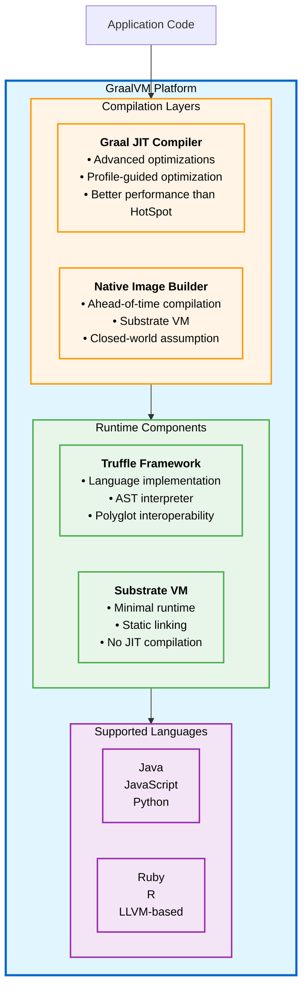
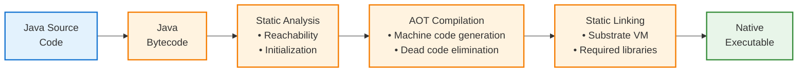

#graalvm #java  #jvm #containerization #site-realibility-engineering #oracle #redhat  #microservices #cloud-native
#continuous-delivery #continuous-integration 


# Definition
- GraalVM is a *high-performance JDK distribution* designed to accelerate the execution of applications written in Java and other JVM languages, as well as support for JavaScript, Python, Ruby, R, and LLVM-based languages.
- GraalVM provides *two modes of operation*: traditional **JIT (Just-In-Time) compilation** and **AOT (Ahead-of-Time) compilation** via Native Image.
- Developed by Oracle Labs and available in both **Community Edition** (free, open-source) and **Enterprise Edition** (commercial, with additional optimizations).
# Components
## Graal Compiler
- A *modern JIT compiler* written in Java that replaces the traditional HotSpot C2 compiler.
- Provides advanced optimizations including:
    - Better inlining decisions
    - Profile-guided optimization
    - Speculative optimizations
    - Improved escape analysis
- Can run as a JIT compiler within the JVM or as an AOT compiler for Native Image generation.
## Native Image
- Compiles Java bytecode *ahead-of-time* into a standalone native executable.
- Produces binaries that:
    - Start up in *milliseconds* (vs. seconds for traditional JVM).
    - Consume *less memory* (no JIT overhead, smaller heap).
    - Do not require JVM installation to run.
- Uses **Substrate VM**, a minimal runtime that includes only the necessary components.
## Truffle Framework
- A language implementation framework that enables *polyglot programming*.
- Allows different programming languages to interoperate seamlessly within the same runtime.
- Languages implemented on Truffle include JavaScript (GraalJS), Python (GraalPython), Ruby (TruffleRuby), and R (FastR).
# GraalVM Editions
## Community Edition (CE)
- **Free and open-source** under GPL with Classpath Exception.
- Available for download from GitHub releases.
- Suitable for most development and production workloads.
- Includes Java, JavaScript, LLVM, and WebAssembly support out of the box.
## Oracle GraalVM
- **Commercial offering** with additional enterprise features.
- Includes:
    - Extended support and security updates.
    - Advanced monitoring and profiling tools.
    - Performance improvements beyond CE.
    - Production support from Oracle.
### Red Hat Mandrel
- Red Hat's *downstream distribution* of GraalVM Community Edition.
- Optimized for building native executables for Quarkus applications.
- Designed specifically for <mark class="hltr-yellow">Red Hat Enterprise Linux</mark> environments.
- Provides long-term support aligned with Red Hat's lifecycle.
# Native Image Compilation
## Compilation Process


## Closed-World Assumption
- Native Image uses a *closed-world assumption*: all code must be known at build time.
- Dynamic features like reflection, JNI, and dynamic proxies require explicit configuration:
  - `reflect-config.json` - Reflection configuration
  - `jni-config.json` - JNI configuration
  - `proxy-config.json` - Dynamic proxy configuration
  - `resource-config.json` - Resource bundle configuration
## Build-Time vs Run-Time
- **Build-time initialization**: Static initializers run during image build, results embedded in the executable.
- **Run-time initialization**: Specified classes initialize at application startup.
- Incorrect initialization strategy can lead to build failures or runtime errors.
# Advantages

## Native Image Benefits
- **Fast Startup**: Applications start in <mark class="hltr-yellow">milliseconds</mark> instead of seconds.
- **Low Memory Footprint**: Significantly reduced memory consumption (50-80% less than traditional JVM).
- **Small Binary Size**: Self-contained executables with only required code included.
- **No Warm-up Period**: Peak performance from the first request (no JIT warm-up).
- **Improved Security**: Reduced attack surface with minimal runtime and no dynamic class loading.
## Cloud-Native Advantages
- **Container Optimization**: Smaller container images (10-100 MB vs. 200-500 MB for traditional JVM).
- **Faster Scaling**: Instant startup enables rapid horizontal scaling.
- **Cost Efficiency**: Lower memory requirements reduce cloud infrastructure costs.
- **Serverless-Friendly**: Sub-second startup makes Java viable for AWS Lambda, Google Cloud Functions.
## Performance
- **JIT Mode**: 10-30% better throughput than traditional HotSpot JVM.
- **Native Mode**: Instant peak performance, ideal for microservices and CLI tools.
- **Polyglot Performance**: Efficient cross-language calls without serialization overhead.
# Limitations and Trade-offs
## Native Image Constraints
- **No Dynamic Class Loading**: Classes must be known at build time.
- **Limited Reflection Support**: Requires explicit configuration for reflection usage.
- **Build Time**: Native image compilation can take several minutes for large applications.
- **Debugging Complexity**: Debugging native images is more challenging than JVM applications.
- **Incompatible Libraries**: Some Java libraries relying on dynamic features may not work.
## Peak Throughput
- For *long-running applications*, traditional JVM with JIT may achieve higher peak throughput.
- Native Image trades <mark class="hltr-yellow">peak performance for startup speed and memory efficiency</mark>.
## Maintenance Overhead
- Requires maintaining configuration files for dynamic features.
- Framework-specific build configurations (Spring Native, Quarkus, Micronaut).
- Testing both JVM and native modes increases QA overhead.
# Use Cases
## Ideal Scenarios
- **Microservices**: Fast startup and low memory footprint are critical.
- **Serverless Functions**: Sub-second cold starts required.
- **CLI Tools**: Command-line utilities benefit from instant startup.
- **Containers**: Smaller images and faster scaling in Kubernetes.
- **Cloud-Native Applications**: Cost optimization through reduced resource usage.
## Less Suitable Scenarios
- **Long-Running Batch Jobs**: Traditional JVM may provide better peak throughput.
- **Applications with Heavy Reflection**: Extensive dynamic behavior requires complex configuration.
- **Legacy Applications**: Migration cost may outweigh benefits.
# Installation
## Download GraalVM
```Shell title='Download and install GraalVM Community Edition on Linux'
# Download GraalVM
wget https://github.com/graalvm/graalvm-ce-builds/releases/download/jdk-21.0.2/graalvm-community-jdk-21.0.2_linux-x64_bin.tar.gz

# Extract archive
tar -xzf graalvm-community-jdk-21.0.2_linux-x64_bin.tar.gz

# Move to installation directory
sudo mv graalvm-community-openjdk-21.0.2+13.1 /opt/graalvm

# Set environment variables
export JAVA_HOME=/opt/graalvm
export PATH=$JAVA_HOME/bin:$PATH
```
## Verify Installation
```Shell title='Verify GraalVM installation'
# Check Java version
java -version

# Expected output:
# openjdk version "21.0.2" 2024-01-16
# OpenJDK Runtime Environment GraalVM CE 21.0.2+13.1 (build 21.0.2+13-jvmci-23.1-b30)
# OpenJDK 64-Bit Server VM GraalVM CE 21.0.2+13.1 (build 21.0.2+13-jvmci-23.1-b30, mixed mode, sharing)
```
## Install Native Image
```Shell title='Install Native Image component'
# Install native-image tool
gu install native-image

# Verify installation
native-image --version
```
# Building Native Images
## Simple Java Application
```bash title='Build native image for simple Java application'
# Compile Java source
javac HelloWorld.java

# Build native image
native-image HelloWorld

# Run the native executable
./helloworld
```
## Maven Project
```xml title='Maven configuration for native image' hl=6-21
<profiles>
    <profile>
        <id>native</id>
        <build>
            <plugins>
                <plugin>
                    <groupId>org.graalvm.buildtools</groupId>
                    <artifactId>native-maven-plugin</artifactId>
                    <version>0.10.1</version>
                    <executions>
                        <execution>
                            <id>build-native</id>
                            <goals>
                                <goal>compile-no-fork</goal>
                            </goals>
                            <phase>package</phase>
                        </execution>
                    </executions>
                </plugin>
            </plugins>
        </build>
    </profile>
</profiles>
```

```Shell title='Build native image with Maven'
# Build native executable
mvn clean package -Pnative

# Run the native executable
./target/myapp
```
### Gradle Project
```kotlin title='Gradle configuration for native image'
plugins {
    id("org.graalvm.buildtools.native") version "0.10.1"
}

graalvmNative {
    binaries {
        named("main") {
            imageName.set("myapp")
            mainClass.set("com.example.Main")
            buildArgs.add("--verbose")
        }
    }
}
```

```Shell title='Build native image with Gradle'
# Build native executable
./gradlew nativeCompile

# Run the native executable
./build/native/nativeCompile/myapp
```
## Container Images with GraalVM
### Debian-based image
```Dockerfile title='Build Java native image using GraalVM on Debian' hl=13-17,19-20
FROM docker.io/library/eclipse-temurin:21 AS builder

USER root
RUN <<EOT bash
  set -ex
  apt-get -y update
  apt-get -y install build-essential \
    zlib1g-dev \
    wget \
    tar
  apt-get clean
  rm -rf /var/lib/apt/lists/*
EOT

# Install GraalVM
WORKDIR /opt
RUN wget -q https://github.com/graalvm/graalvm-ce-builds/releases/download/jdk-21.0.2/graalvm-community-jdk-21.0.2_linux-x64_bin.tar.gz && \
    tar -xzf graalvm-community-jdk-21.0.2_linux-x64_bin.tar.gz && \
    rm graalvm-community-jdk-21.0.2_linux-x64_bin.tar.gz

ENV JAVA_HOME=/opt/graalvm-community-openjdk-21.0.2+13.1
ENV PATH=$JAVA_HOME/bin:$PATH

# Build application
WORKDIR /build
COPY ./.mvn ./.mvn
COPY ./mvnw ./mvnw
COPY ./pom.xml ./pom.xml
RUN ./mvnw dependency:go-offline

COPY ./src ./src
RUN ./mvnw package -Pnative -DskipTests

# Runtime stage
FROM docker.io/library/ubuntu:noble AS runtime

WORKDIR /app
COPY --from=builder --chown=1000:root /build/target/*-runner /app/application
RUN chmod 775 /app/application

USER 1000
EXPOSE 8080
ENTRYPOINT ["/app/application"]
```
### Red Hat Mandrel image
```Dockerfile title='Build Java native image using Red Hat Mandrel'
FROM quay.io/quarkus/ubi-quarkus-mandrel-builder-image:jdk-21 AS builder

WORKDIR /build

# Copy build configuration
COPY --chown=quarkus:quarkus mvnw /build/mvnw
COPY --chown=quarkus:quarkus .mvn /build/.mvn
COPY --chown=quarkus:quarkus pom.xml /build/

# Download dependencies
RUN ./mvnw dependency:go-offline -B

# Copy source and build
COPY --chown=quarkus:quarkus src /build/src
RUN ./mvnw package -Pnative -DskipTests -B

# Runtime stage
FROM registry.access.redhat.com/ubi9/ubi-minimal:latest

WORKDIR /app
COPY --from=builder --chown=1001:root /build/target/*-runner /app/application
RUN chmod 775 /app/application

USER 1001
EXPOSE 8080
ENTRYPOINT ["/app/application"]
```
# Framework Support
## Quarkus
- <mark class="hltr-yellow">Designed for GraalVM Native Image from the ground up</mark>.
- Extensive build-time processing reduces runtime overhead.
- Automatic generation of native-image configuration.
- Extensions tested for native compatibility.
## Spring Boot (Spring Native)
- Official support via Spring Native project.
- AOT processing engine generates native-image configuration.
- GraalVM reachability metadata repository for popular libraries.
- Trade-off: some Spring features have limitations in native mode.
## Micronaut
- Native-ready framework with minimal reflection usage.
- Compile-time dependency injection and AOP.
- Built-in support for GraalVM Native Image.
- Excellent startup time and memory footprint.
## Helidon
- Oracle's cloud-native microservices framework.
- First-class GraalVM support.
- Designed for both JVM and native execution.
# Performance Characteristics
## Startup Time Comparison
| Mode | Startup Time | Memory (RSS) | Image Size |
|------|-------------|--------------|------------|
| Traditional JVM | 2-5 seconds | 200-500 MB | 200-500 MB |
| GraalVM JIT | 2-4 seconds | 180-450 MB | 200-500 MB |
| GraalVM Native | 0.01-0.1 seconds | 20-100 MB | 10-100 MB |

## Throughput Comparison
- **Native Image**: Consistent performance from start, but lower peak throughput.
- **JIT Compilation**: Requires warm-up period, achieves higher peak throughput after optimization.
- **Use Case Dependent**: Short-lived processes favor native; long-running favor JIT.
# Configuration Examples
## Reflection Configuration
```json title='reflect-config.json'
[
  {
    "name": "com.example.User",
    "allDeclaredFields": true,
    "allDeclaredMethods": true,
    "allDeclaredConstructors": true
  },
  {
    "name": "java.util.HashMap",
    "methods": [
      {"name": "put", "parameterTypes": ["java.lang.Object", "java.lang.Object"]},
      {"name": "get", "parameterTypes": ["java.lang.Object"]}
    ]
  }
]
```
## Resource Configuration
```json title='resource-config.json'
{
  "resources": {
    "includes": [
      {"pattern": "application.properties"},
      {"pattern": "META-INF/.*\\.xml"},
      {"pattern": "templates/.*\\.html"}
    ]
  }
}
```
## Build Arguments
```Shell title='Native image build with custom arguments'
native-image \
  --no-fallback \
  --enable-http \
  --enable-https \
  --initialize-at-build-time=org.slf4j \
  --initialize-at-run-time=io.netty \
  -H:+ReportExceptionStackTraces \
  -H:+PrintClassInitialization \
  -jar myapp.jar \
  myapp-native
```

## Troubleshooting Common Issues

### Missing Reflection Configuration
```Shell title='Generate reflection configuration using tracing agent'
# Run application with tracing agent
java -agentlib:native-image-agent=config-output-dir=src/main/resources/META-INF/native-image \
  -jar target/myapp.jar

# Configuration files will be generated automatically
```
### Class Initialization Issues
```Shell title='Control class initialization timing'
# Initialize at build time (faster startup, larger binary)
--initialize-at-build-time=com.example.StaticHelper

# Initialize at run time (slower startup, correct behavior)
--initialize-at-run-time=com.example.DynamicConfig
```
### Memory Issues During Build
```Shell title='Increase native-image build memory'
# Allocate more memory for native-image build
native-image -J-Xmx8g -jar myapp.jar
```

***
# References
1. https://www.graalvm.org/ - Official GraalVM website
2. https://www.graalvm.org/latest/reference-manual/native-image/ - Native Image documentation
3. https://github.com/graalvm/graalvm-ce-builds - GraalVM Community Edition releases
4. https://quarkus.io/guides/building-native-image - Quarkus Native Image guide
5. https://docs.spring.io/spring-boot/docs/current/reference/html/native-image.html - Spring Boot Native documentation
6. https://github.com/oracle/graal/tree/master/substratevm - Substrate VM documentation
7. https://www.redhat.com/en/blog/mandrel-distribution-graalvm - Red Hat Mandrel introduction
8. https://medium.com/graalvm/graalvm-quick-start-guide-c8c6e7c0d3e7 - GraalVM Quick Start Guide.
9. https://inside.java/tag/hotspot for HotSpot JVM C2 JIT Compiler.
10. [[site-reliability-engineering/build-tools/java/java-runtime/Java Development Kit (JDK), Java Runtime Environment (JRE) and Java Virtual Machine (JVM)]]
11. [[site-reliability-engineering/build-tools/java/java-runtime/java-distribution/OpenJDK]]
12. 
