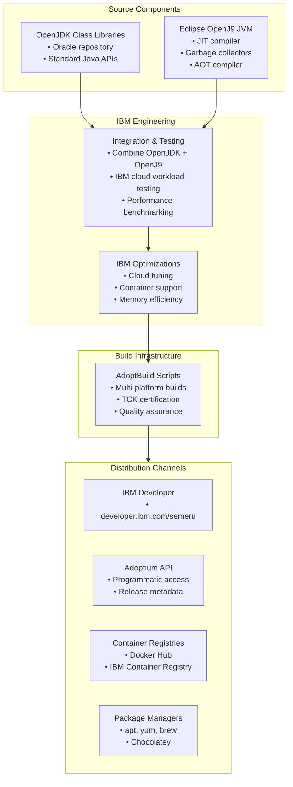
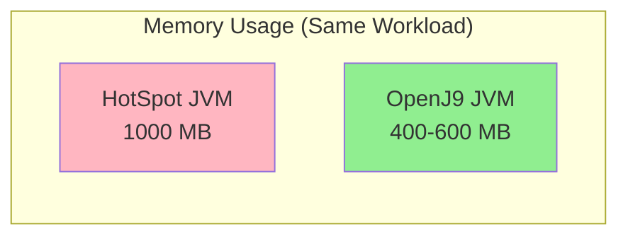
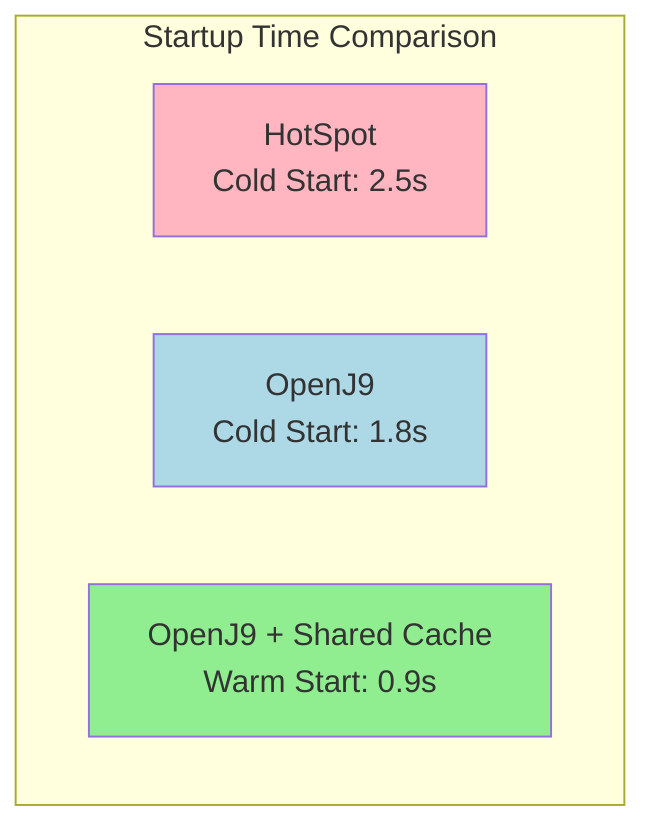

#java #jdk #openjdk #ibm #openj9 #site-reliability-engineering #cloud #eclipse
# IBM Semeru Runtime
- IBM Semeru Runtime is a ==free, production-ready distribution of OpenJDK== with the Eclipse OpenJ9 JVM provided by IBM.
- Semeru combines OpenJDK class libraries with the Eclipse OpenJ9 JVM, offering an alternative to HotSpot-based distributions.
- The distribution is optimized for ==cloud-native and containerized workloads== with a focus on memory efficiency and fast startup.
- Semeru is certified and production-tested, used internally by IBM for cloud services and enterprise applications.
# Key characteristics
## Eclipse OpenJ9 JVM
- Semeru uses ==Eclipse OpenJ9== instead of HotSpot JVM, providing distinct performance characteristics.
- OpenJ9 is designed for ==low memory footprint== and fast startup times, making it ideal for cloud environments.
- OpenJ9 includes advanced JIT compilation, ahead-of-time (AOT) compilation, and class data sharing.
- Originally developed by IBM as J9 JVM, contributed to Eclipse Foundation as open-source OpenJ9.
## Memory efficiency
- OpenJ9 consumes significantly ==less memory== than HotSpot for equivalent workloads.
- Typical memory savings: 40-60% compared to HotSpot-based JDKs.
- Ideal for containerized environments where memory limits are constrained.
- Shared classes cache reduces memory usage when running multiple JVMs.
## Fast startup
- OpenJ9 achieves ==faster startup times== through ahead-of-time (AOT) compilation.
- Class data sharing (CDS) accelerates application initialization.
- Beneficial for microservices, serverless functions, and short-lived processes.
## Long-term support
- Semeru provides free LTS releases aligned with OpenJDK:
	- Semeru 8: Based on OpenJDK 8, support until at least November 2026
	- Semeru 11: Based on OpenJDK 11, support until at least October 2027
	- Semeru 17: Based on OpenJDK 17, support until at least October 2029
	- Semeru 21: Based on OpenJDK 21, support until at least September 2031
- Security updates and bug fixes provided at no cost.
- TCK certified for Java SE compliance.
## Platform support
- Semeru supports multiple platforms:
	- Linux (x64, aarch64, ppc64le, s390x)
	- Windows (x64)
	- macOS (x64, aarch64/Apple Silicon)
	- AIX (ppc64)
	- z/OS (s390x)
- Container images available for Docker and Kubernetes deployments.
# Architecture

## OpenJ9 JVM components
- **JIT Compiler**: Multi-tier just-in-time compilation (cold, warm, hot, scorching).
- **AOT Compiler**: Ahead-of-time compilation for faster startup.
- **Garbage Collectors**: Multiple GC policies (gencon, balanced, metronome, optavgpause, optthruput).
- **Class Data Sharing**: Shared classes cache for reduced memory and faster startup.
- **JVMTI Support**: Full Java Virtual Machine Tool Interface implementation.
# Installation
## Linux package managers
### Debian/Ubuntu (APT)
```shell
# Add Adoptium repository (Semeru distributed through Adoptium)
wget -O - https://packages.adoptium.net/artifactory/api/gpg/key/public | sudo apt-key add -
echo "deb https://packages.adoptium.net/artifactory/deb $(awk -F= '/^VERSION_CODENAME/{print$2}' /etc/os-release) main" | sudo tee /etc/apt/sources.list.d/adoptium.list
sudo apt update
sudo apt install temurin-17-jdk
# For Semeru, download from IBM Developer or use Docker images
```
### Red Hat/CentOS/Fedora (YUM/DNF)
```shell
# Download RPM from IBM Developer
wget https://github.com/ibmruntimes/semeru17-binaries/releases/download/jdk-17.0.9%2B9_openj9-0.41.0/ibm-semeru-open-jdk_x64_linux_17.0.9_9_openj9-0.41.0.rpm
sudo rpm -ivh ibm-semeru-open-jdk_x64_linux_17.0.9_9_openj9-0.41.0.rpm
```
## macOS package managers
### Homebrew
```shell
# Install via Homebrew Cask
brew install --cask semeru-jdk-open
# Or specific version
brew tap ibm-semeru-runtimes/homebrew-semeru
brew install --cask semeru-jdk-open@17
```
## Windows installation
### Chocolatey
```shell
choco install semeru17-jre
```
### Direct installer
```powershell
# Download MSI from IBM Developer
# Install via MSI
msiexec /i ibm-semeru-open-jdk_x64_windows_17.msi /qn
```
## Container images
### Docker Hub
```shell
docker pull ibm-semeru-runtimes/open-17-jdk
docker pull ibm-semeru-runtimes/open-17-jre
docker pull ibm-semeru-runtimes/open-17-jdk-ubi
```
### IBM Container Registry
```shell
docker pull icr.io/appcafe/ibm-semeru-runtimes:open-17-jdk
docker pull icr.io/appcafe/ibm-semeru-runtimes:open-17-jre-ubi-minimal
```
### Using in Dockerfile
```dockerfile
FROM ibm-semeru-runtimes/open-17-jdk:latest
WORKDIR /app
COPY target/application.jar /app/app.jar
# OpenJ9 optimized flags for containers
ENV JAVA_OPTS="-XX:+UseContainerSupport \
               -XX:MaxRAMPercentage=75.0 \
               -Xshareclasses:cacheDir=/opt/shareclasses"
ENTRYPOINT ["sh", "-c", "java $JAVA_OPTS -jar app.jar"]
```
## Manual installation
### Download and extract
```shell
# Download from IBM Developer or GitHub releases
wget https://github.com/ibmruntimes/semeru17-binaries/releases/download/jdk-17.0.9%2B9_openj9-0.41.0/ibm-semeru-open-jdk_x64_linux_17.0.9_9_openj9-0.41.0.tar.gz
# Extract
tar -xzf ibm-semeru-open-jdk_x64_linux_17.0.9_9_openj9-0.41.0.tar.gz
# Move to installation directory
sudo mv jdk-17.0.9+9 /opt/semeru-17
# Set environment variables
export JAVA_HOME=/opt/semeru-17
export PATH=$JAVA_HOME/bin:$PATH
```
# OpenJ9 JVM features
## Class Data Sharing (CDS)
- OpenJ9's shared classes cache stores compiled code and class metadata for reuse across JVM instances.
- Reduces memory footprint when running multiple JVMs.
- Accelerates startup by loading pre-compiled code.
### Enable shared classes cache
```shell
# Create shared cache
java -Xshareclasses:name=myapp,cacheDir=/tmp/cache -jar application.jar
# Subsequent runs use the cache
java -Xshareclasses:name=myapp,cacheDir=/tmp/cache -jar application.jar
# List caches
java -Xshareclasses:listAllCaches
# Destroy cache
java -Xshareclasses:name=myapp,destroyAll
```
### Shared cache for containers
```dockerfile
FROM ibm-semeru-runtimes/open-17-jdk
# Create persistent cache directory
RUN mkdir -p /opt/shareclasses
# Use shared cache across container instances
ENV JAVA_OPTS="-Xshareclasses:name=appCache,cacheDir=/opt/shareclasses"
```
## Ahead-of-Time (AOT) compilation
- OpenJ9 can compile methods ahead of time and store in shared cache.
- AOT code is available immediately on startup without JIT warmup.
```shell
# Enable AOT compilation
java -Xshareclasses -Xaot -jar application.jar
# Aggressive AOT for maximum startup performance
java -Xshareclasses -Xaot:count=10 -jar application.jar
```
## JIT compilation tiers
- OpenJ9 uses multi-tier compilation: cold, warm, hot, scorching.
- Methods progress through tiers based on execution frequency.
```shell
# Disable JIT (use only AOT and interpreter)
java -Xnojit -jar application.jar
# Tune JIT aggressiveness
java -XjitOptions:count=1000 -jar application.jar
# Enable verbose JIT logging
java -Xjit:verbose -jar application.jar
```
## Garbage collection policies
### gencon (Generational Concurrent)
- Default GC policy for OpenJ9.
- Optimized for short-lived objects with concurrent old generation collection.
```shell
java -Xgcpolicy:gencon -jar application.jar
```
### balanced
- Balances pause times and throughput using region-based heap.
- Suitable for large heaps (>4GB).
```shell
java -Xgcpolicy:balanced -jar application.jar
```
### metronome
- Deterministic GC with predictable pause times.
- Real-time garbage collection for latency-sensitive applications.
```shell
java -Xgcpolicy:metronome -Xgc:targetPauseTime=5ms -jar application.jar
```
### optavgpause
- Optimizes for low average pause times.
```shell
java -Xgcpolicy:optavgpause -jar application.jar
```
### optthruput
- Optimizes for maximum throughput, tolerates longer pauses.
```shell
java -Xgcpolicy:optthruput -jar application.jar
```
## Memory management
### Heap sizing
```shell
# Initial and maximum heap
java -Xms512m -Xmx2g -jar application.jar
# Soft maximum heap (allows expansion under pressure)
java -Xmx2g -Xsoftmx1g -jar application.jar
```
### Container support
```shell
# Automatically detect container memory limits
java -XX:+UseContainerSupport -XX:MaxRAMPercentage=75.0 -jar application.jar
# OpenJ9 alternative (more fine-grained)
java -XX:+UseContainerSupport -Xmx0 -XX:MaxRAMPercentage=75.0 -jar application.jar
```
# Configuration and tuning
## Performance tuning for cloud
### Microservices optimization
```shell
# Fast startup with shared classes and AOT
java -Xshareclasses:cacheDir=/opt/cache \
     -Xquickstart \
     -Xaot \
     -jar microservice.jar
```
### Memory-constrained environments
```shell
# Minimize memory footprint
java -Xmx256m \
     -Xcompressedrefs \
     -Xgcpolicy:balanced \
     -Xshareclasses \
     -jar application.jar
```
### High-throughput workloads
```shell
# Optimize for throughput
java -Xgcpolicy:optthruput \
     -Xmx4g \
     -Xms4g \
     -jar application.jar
```
## OpenJ9-specific options
### Compressed references
- Reduces memory usage by compressing object pointers.
- Enabled by default on 64-bit platforms with heaps <57GB.
```shell
# Explicitly enable compressed references
java -Xcompressedrefs -jar application.jar
# Disable if needed
java -Xnocompressedrefs -jar application.jar
```
### Idle tuning
- OpenJ9 can compact heap and release memory when idle.
```shell
# Enable idle tuning (reduce memory when inactive)
java -XX:+IdleTuningGcOnIdle \
     -XX:IdleTuningMinIdleWaitTime=180 \
     -jar application.jar
```
### Quick startup mode
```shell
# Optimize for fast startup over long-term throughput
java -Xquickstart -jar application.jar
```
## Diagnostic options
### Verbose logging
```shell
# GC logging
java -Xverbosegclog:/tmp/gc.log -jar application.jar
# JIT logging
java -Xjit:verbose,vlog=/tmp/jit.log -jar application.jar
# Class loading logging
java -verbose:class -jar application.jar
```
### Dump generation
```shell
# Generate heap dump on OutOfMemoryError
java -Xdump:heap:events=systhrow,filter=java/lang/OutOfMemoryError \
     -jar application.jar
# Generate system dump on specific events
java -Xdump:system:events=vmstop -jar application.jar
# Generate Java core dump
java -Xdump:java:events=throw,filter=java/lang/Exception \
     -jar application.jar
```
# IBM Cloud integration
## IBM Cloud Kubernetes Service (IKS)
### Deployment with OpenJ9 optimizations
```yaml
apiVersion: apps/v1
kind: Deployment
metadata:
  name: java-app-openj9
spec:
  replicas: 3
  template:
    spec:
      containers:
      - name: app
        image: ibm-semeru-runtimes/open-17-jdk
        resources:
          requests:
            memory: "512Mi"
            cpu: "250m"
          limits:
            memory: "1Gi"
            cpu: "500m"
        env:
        - name: JAVA_OPTS
          value: "-Xshareclasses:cacheDir=/opt/cache -Xquickstart -XX:+UseContainerSupport -XX:MaxRAMPercentage=75.0"
        volumeMounts:
        - name: shareclasses
          mountPath: /opt/cache
      volumes:
      - name: shareclasses
        emptyDir: {}
```
## IBM Cloud Code Engine
### Serverless Java with Semeru
```dockerfile
FROM ibm-semeru-runtimes/open-17-jre-ubi-minimal
WORKDIR /app
COPY target/function.jar /app/app.jar
# Optimize for serverless cold starts
ENV JAVA_OPTS="-Xquickstart -Xshareclasses:none -XX:+IdleTuningCompactOnIdle"
CMD ["java", "-jar", "app.jar"]
```
## Red Hat OpenShift
### OpenShift deployment with UBI base
```yaml
apiVersion: apps/v1
kind: Deployment
metadata:
  name: openj9-app
spec:
  template:
    spec:
      containers:
      - name: app
        image: ibm-semeru-runtimes/open-17-jdk-ubi
        env:
        - name: JAVA_OPTS
          value: "-Xshareclasses -Xquickstart -Xgcpolicy:balanced"
```
# Performance characteristics
## Memory footprint comparison

- OpenJ9 typically uses ==40-60% less memory== than HotSpot for equivalent workloads.
- Memory savings increase with heap size and number of JVM instances.
## Startup time optimization

- OpenJ9 achieves ==faster startup== through AOT compilation and class sharing.
- Shared classes cache provides significant benefit for repeated starts.
## Throughput characteristics
- HotSpot typically achieves higher peak throughput for long-running applications.
- OpenJ9 balances throughput with memory efficiency.
- Use `-Xquickstart` for fast startup or default for balanced performance.
# Monitoring and diagnostics
## Eclipse OpenJ9 diagnostic tools
### jcmd with OpenJ9
```shell
# Dump shared classes cache
jcmd <pid> Dump.sharedClasses
# Print GC information
jcmd <pid> GC.class_histogram
# Generate heap dump
jcmd <pid> Dump.heap /tmp/heapdump.phd
```
### OpenJ9-specific dumps
```shell
# Analyze system dump with Eclipse Memory Analyzer Tool (MAT)
# Download Eclipse MAT with DTFJ plugin for OpenJ9 dumps
# OpenJ9 heap dumps use PHD format (Portable Heap Dump)
```
## Health Center
- IBM Monitoring and Diagnostic Tools - Health Center provides runtime monitoring.
- Visualizes GC, thread, method profiling, and locking data.
```shell
# Enable Health Center agent
java -Xhealthcenter -jar application.jar
# Access via Health Center client
```
## Verbose GC analysis
```shell
# Enable verbose GC with detailed output
java -Xverbosegclog:/tmp/verbosegc.%Y%m%d.%H%M%S.%pid.txt \
     -XX:+UseGCLogFileRotation \
     -jar application.jar
# Analyze with GC and Memory Visualizer (GCMV)
```
# Version management
## Using SDKMAN
```shell
# Install SDKMAN
curl -s "https://get.sdkman.io" | bash
# List Semeru versions
sdk list java | grep sem
# Install Semeru
sdk install java 17.0.9-sem
# Set as default
sdk default java 17.0.9-sem
```
## Multiple versions with jenv
```shell
# Add Semeru to jenv
jenv add /opt/semeru-17
# Set global version
jenv global semeru-17
# Set local version for project
cd /path/to/project
jenv local semeru-17
```
# Migration guide
## From HotSpot-based JDKs
- Semeru is generally compatible with applications running on HotSpot.
- Most applications require no code changes.
### Considerations
- JVM flags differ between HotSpot and OpenJ9.
- Garbage collection policies use different names and behaviors.
- Some monitoring tools may require OpenJ9-specific plugins.
### Migration steps
```shell
# Test application with Semeru
docker run -v $(pwd):/app ibm-semeru-runtimes/open-17-jdk \
  java -jar /app/application.jar
# Update production Dockerfile
# FROM eclipse-temurin:17-jdk
FROM ibm-semeru-runtimes/open-17-jdk
# Tune OpenJ9 flags
ENV JAVA_OPTS="-Xshareclasses -Xquickstart -XX:+UseContainerSupport"
```
## JVM flag translation
| HotSpot Flag | OpenJ9 Equivalent |
|--------------|-------------------|
| `-XX:+UseG1GC` | `-Xgcpolicy:gencon` (default) or `-Xgcpolicy:balanced` |
| `-XX:MaxRAMPercentage=75` | `-XX:MaxRAMPercentage=75` (same) |
| `-XX:+UseStringDeduplication` | Not needed (OpenJ9 optimizes strings differently) |
| `-XX:+UseCompressedOops` | `-Xcompressedrefs` (enabled by default) |
| `-XX:+PrintGC` | `-Xverbosegclog` |
# Use cases
## Cloud-native microservices
- OpenJ9's low memory footprint and fast startup make it ideal for microservices.
- Shared classes cache reduces memory when running many JVM instances.
- Quick startup mode benefits frequently scaled services.
## Containerized applications
- Memory efficiency allows more containers per host.
- Container support automatically adapts to memory limits.
- Smaller memory footprint reduces cloud infrastructure costs.
## Serverless functions
- Fast startup critical for serverless cold starts.
- Low memory usage maximizes function concurrency.
- Suitable for AWS Lambda, IBM Cloud Code Engine, Google Cloud Run.
## Resource-constrained environments
- IoT devices and edge computing with limited memory.
- Development environments with memory constraints.
- Cost optimization for cloud workloads.
## IBM platform integration
- Optimized for IBM Cloud, IBM Z mainframes, and IBM Power systems.
- Native support for AIX and z/OS platforms.
- Integration with IBM middleware (WebSphere, Liberty).
# Comparison with other distributions
## vs Eclipse Temurin (HotSpot)
- Semeru: Lower memory, faster startup, OpenJ9 JVM
- Temurin: Higher peak throughput, HotSpot JVM, broader tooling support
- Both: Free, LTS, TCK certified
## vs Amazon Corretto (HotSpot)
- Semeru: Memory efficient, OpenJ9 optimizations
- Corretto: AWS optimized, HotSpot performance characteristics
- Both: Production-ready, cloud-optimized
## vs Oracle JDK (HotSpot)
- Semeru: Free for all use, OpenJ9 JVM, memory efficient
- Oracle JDK: Commercial support, HotSpot JVM, licensing costs
- Both: Java SE compliant
## vs GraalVM
- Semeru: Traditional JVM with OpenJ9, class data sharing
- GraalVM: Polyglot VM, native image compilation, different architecture
- Both: Performance optimizations, cloud-native focus
# Support and community
## Community resources
- GitHub repository: https://github.com/ibmruntimes
- Eclipse OpenJ9 project: https://www.eclipse.org/openj9/
- IBM Developer: https://developer.ibm.com/languages/java/semeru-runtimes/
- Slack channel: openj9.slack.com
## IBM support
- Available through IBM Support for IBM customers.
- Commercial support for Semeru Certified Edition.
- Integration with IBM Cloud support plans.
## Documentation
- OpenJ9 User Guide: https://eclipse.dev/openj9/docs/
- IBM Developer documentation: developer.ibm.com/semeru-runtimes/docs/
- Migration guides and tuning recommendations.
## Security updates
- Quarterly security updates aligned with OpenJDK schedule.
- Security advisories published on IBM Developer.
- CVE tracking through Eclipse OpenJ9 project.
# Semeru Certified Edition
- IBM offers ==Semeru Runtime Certified Edition== for customers requiring commercial support.
- Includes additional testing, certifications, and IBM support contracts.
- Available through IBM Passport Advantage and IBM Marketplace.
- Suitable for regulated industries requiring vendor support.
***
# References
1. IBM Semeru Runtimes: https://developer.ibm.com/languages/java/semeru-runtimes/
2. Eclipse OpenJ9 Project: https://www.eclipse.org/openj9/
3. OpenJ9 Documentation: https://eclipse.dev/openj9/docs/
4. GitHub - IBM Semeru Runtimes: https://github.com/ibmruntimes
5. OpenJ9 Performance Tuning: https://eclipse.dev/openj9/docs/openj9_defaults/
6. IBM Developer - Semeru Downloads: https://developer.ibm.com/languages/java/semeru-runtimes/downloads/
7. Eclipse OpenJ9 Garbage Collection Policies: https://eclipse.dev/openj9/docs/gc/
8. [[site-reliability-engineering/build-tools/java/java-runtime/Java Development Kit (JDK), Java Runtime Environment (JRE) and Java Virtual Machine (JVM)]]
9. [[site-reliability-engineering/build-tools/java/java-runtime/java-distribution/OpenJDK]]
10. [[site-reliability-engineering/build-tools/java/java-runtime/java-distribution/Eclipse Temurin]]
11. [[site-reliability-engineering/build-tools/java/java-runtime/java-distribution/Amazon Corretto]]
