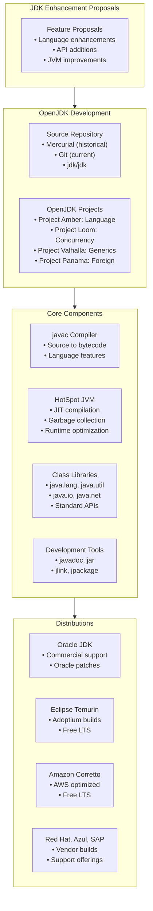

#java #jdk #openjdk #oracle  #site-reliability-engineering
# OpenJDK
- OpenJDK (Open Java Development Kit) is the ==official reference implementation== of the Java Platform, Standard Edition (Java SE).
- OpenJDK is free and open-source software maintained primarily by Oracle under the GNU General Public License version 2 with the Classpath Exception.
- The project serves as the basis for most commercial and free Java distributions including Oracle JDK, Eclipse Temurin, Amazon Corretto, and others.
- OpenJDK provides the foundation for Java development, defining the standard APIs, language features, and runtime behavior.
# History
## Creation and evolution
- OpenJDK was created in 2006 when Sun Microsystems open-sourced the Java platform.
- Initially based on the existing HotSpot JVM and class libraries from Sun's proprietary JDK.
- Oracle acquired Sun Microsystems in 2010 and became the primary maintainer of OpenJDK.
- Oracle JDK and OpenJDK were functionally identical starting from Java 11.
## Licensing changes
- Java 8 and earlier: Proprietary Oracle JDK was free for general use.
- Java 11 onward: Oracle JDK requires commercial license for production use.
- OpenJDK: Always free under GPL v2 with Classpath Exception.
- The licensing change led to the rise of alternative OpenJDK distributions.
# Architecture

# OpenJDK projects
## Project Amber
- Focuses on productivity-oriented language features.
- Recent additions:
	- Local variable type inference (`var`)
	- Switch expressions
	- Text blocks
	- Pattern matching for `instanceof`
	- Record classes
	- Sealed classes
## Project Loom
- Aims to dramatically reduce the effort of writing concurrent applications.
- Key features:
	- Virtual threads (lightweight threads)
	- Structured concurrency
	- Scoped values
- Virtual threads delivered in Java 21 as a preview and finalized in Java 21 LTS.
## Project Valhalla
- Goals: value types and improved generics.
- Planned features:
	- Value classes (inline types)
	- Primitive type specialization for generics
	- Enhanced generics with better performance
## Project Panama
- Simplifies interaction with native code.
- Components:
	- Foreign Function & Memory API (FFM API)
	- Vector API for SIMD operations
	- Replaces JNI with modern alternatives
## Project ZGC
- Ultra-low latency garbage collector.
- Features:
	- Sub-millisecond pause times
	- Scalable to multi-terabyte heaps
	- Concurrent garbage collection
# Release model
## Six-month release cycle
- New feature releases every six months (March and September).
- Predictable release schedule enables regular innovation.
- Each release includes language enhancements, API additions, and performance improvements.
## Long-term support releases
- LTS releases every 2 years (September of even years).
- LTS versions:
	- Java 8 (March 2014) - Extended support
	- Java 11 (September 2018) - LTS
	- Java 17 (September 2021) - LTS
	- Java 21 (September 2023) - LTS
	- Java 25 (September 2025) - Planned LTS
- Non-LTS releases supported until the next release (6 months).
## Update releases
- Quarterly Critical Patch Updates (CPU) in January, April, July, October.
- Security fixes and critical bug patches.
- Each update increments the patch version (e.g., 17.0.1, 17.0.2).
# Version numbering
## Format
- Version format: `$FEATURE.$INTERIM.$UPDATE.$PATCH`
- Example: `21.0.1+12`
	- `21`: Feature release version
	- `0`: Interim version (always 0)
	- `1`: Update release number
	- `12`: Build number
## Version string
```shell
$ java -version
openjdk version "17.0.9" 2023-10-17
OpenJDK Runtime Environment (build 17.0.9+9-Ubuntu-122.04)
OpenJDK 64-Bit Server VM (build 17.0.9+9-Ubuntu-122.04, mixed mode, sharing)
```
# JDK Enhancement Proposals
- JEPs define major changes to the OpenJDK project.
- JEP process ensures community review and consensus.
## JEP lifecycle
1. Draft: Initial proposal
2. Submitted: Formal submission to OpenJDK
3. Candidate: Accepted for consideration
4. Funded: Resources allocated
5. Completed: Implementation finished
6. Delivered: Included in a release
## Notable JEPs
- JEP 286: Local-Variable Type Inference (Java 10)
- JEP 330: Launch Single-File Source-Code Programs (Java 11)
- JEP 355: Text Blocks (Java 15)
- JEP 394: Pattern Matching for instanceof (Java 16)
- JEP 395: Records (Java 16)
- JEP 409: Sealed Classes (Java 17)
- JEP 444: Virtual Threads (Java 21)
- JEP 453: Structured Concurrency (Java 21 Preview)
# Installation
## Building from source
### Prerequisites
```shell
# Install build dependencies (Ubuntu)
sudo apt install build-essential autoconf zip unzip
sudo apt install libx11-dev libxext-dev libxrender-dev libxrandr-dev libxtst-dev libxt-dev
sudo apt install libcups2-dev libfontconfig1-dev libasound2-dev

# Install boot JDK (N-1 version)
sudo apt install openjdk-17-jdk
```
### Build OpenJDK
```shell
# Clone repository
git clone https://github.com/openjdk/jdk.git
cd jdk

# Configure build
bash configure --with-boot-jdk=/usr/lib/jvm/java-17-openjdk-amd64

# Build
make images

# Built JDK location
ls build/linux-x86_64-server-release/jdk/
```
## Distribution packages
### Ubuntu/Debian
```shell
# Install default OpenJDK
sudo apt update
sudo apt install openjdk-17-jdk

# Install specific version
sudo apt install openjdk-11-jdk
sudo apt install openjdk-21-jdk
```
### Red Hat/CentOS/Fedora
```shell
# Install OpenJDK
sudo yum install java-17-openjdk-devel

# List available versions
yum search openjdk
```
### macOS
```shell
# Using Homebrew
brew install openjdk@17

# Link for system Java wrappers
sudo ln -sfn /usr/local/opt/openjdk@17/libexec/openjdk.jdk /Library/Java/JavaVirtualMachines/openjdk-17.jdk
```
# HotSpot JVM
- HotSpot is the reference JVM implementation in OpenJDK.
- Provides Just-In-Time (JIT) compilation and adaptive optimization.
## JIT compilation
- Interprets bytecode initially, compiles hot code paths to native code.
- Two-tier compilation:
	- C1 compiler: Fast compilation, moderate optimization
	- C2 compiler: Slower compilation, aggressive optimization
- Tiered compilation enabled by default since Java 8.
## Garbage collectors
### Serial GC
- Single-threaded garbage collector.
- Suitable for small heap sizes and single-core systems.
```shell
java -XX:+UseSerialGC -jar application.jar
```
### Parallel GC
- Multi-threaded garbage collector for throughput.
- Default in Java 8, good for batch processing.
```shell
java -XX:+UseParallelGC -jar application.jar
```
### G1 GC (Garbage-First)
- Default since Java 9, balances throughput and latency.
- Suitable for heaps up to tens of gigabytes.
```shell
java -XX:+UseG1GC -XX:MaxGCPauseMillis=200 -jar application.jar
```
### ZGC (Z Garbage Collector)
- Ultra-low latency collector with sub-millisecond pause times.
- Scalable to multi-terabyte heaps.
```shell
java -XX:+UseZGC -jar application.jar
```
### Shenandoah GC
- Low-pause-time garbage collector.
- Concurrent evacuation reduces pause times.
```shell
java -XX:+UseShenandoahGC -jar application.jar
```
## JVM tuning
### Heap sizing
```shell
# Set initial and maximum heap size
java -Xms2g -Xmx4g -jar application.jar

# Set young generation size
java -XX:NewSize=512m -XX:MaxNewSize=1g -jar application.jar
```
### GC logging
```shell
# Unified logging (Java 9+)
java -Xlog:gc*:file=gc.log:time,uptime,level,tags -jar application.jar

# Legacy logging (Java 8)
java -Xloggc:gc.log -XX:+PrintGCDetails -XX:+PrintGCDateStamps -jar application.jar
```
# Class libraries
## Core packages
- `java.lang`: Fundamental classes (Object, String, Thread, System)
- `java.util`: Collections, utilities (List, Map, Set, Optional)
- `java.io`: Input/output streams, file operations
- `java.nio`: New I/O, buffers, channels, file system
- `java.net`: Networking (sockets, HTTP client)
- `java.time`: Date and time API (introduced in Java 8)
## Module system
- Java Platform Module System (JPMS) introduced in Java 9.
- Modularizes JDK into discrete modules.
```shell
# List platform modules
java --list-modules

# Run module
java --module-path mods --module myapp/com.example.Main
```
### Module descriptor
```java title='module-info.java'
module com.example.myapp {
    requires java.sql;
    requires java.net.http;
    exports com.example.api;
    opens com.example.internal to java.base;
}
```
# Development tools
## Compiler (javac)
```shell
# Compile Java source
javac -d bin src/com/example/Main.java

# Enable preview features
javac --enable-preview --release 21 Main.java

# Set source and target version
javac -source 17 -target 17 Main.java
```
## Java launcher
```shell
# Run class file
java -cp bin com.example.Main

# Run JAR file
java -jar application.jar

# Run single-file program (Java 11+)
java HelloWorld.java
```
## Javadoc
```shell
# Generate documentation
javadoc -d docs -sourcepath src -subpackages com.example

# Include private members
javadoc -private -d docs src/**/*.java
```
## JAR tool
```shell
# Create JAR file
jar cvf application.jar -C bin .

# Create executable JAR
jar cvfe application.jar com.example.Main -C bin .

# Extract JAR
jar xvf application.jar
```
## jlink (Java 11+)
- Creates custom runtime images with only required modules.
```shell
# Create custom runtime
jlink --module-path $JAVA_HOME/jmods:mods \
      --add-modules myapp \
      --output custom-runtime \
      --launcher myapp=myapp/com.example.Main

# Run custom runtime
custom-runtime/bin/myapp
```
## jpackage (Java 16+)
- Packages Java applications as native installers.
```shell
# Create platform-specific installer
jpackage --input lib \
         --main-jar application.jar \
         --main-class com.example.Main \
         --name MyApp \
         --type deb

# Create Windows MSI
jpackage --input lib --main-jar app.jar --type msi --name MyApp
```
# Monitoring and diagnostics
## JConsole
```shell
# Launch JConsole
jconsole <pid>

# Remote monitoring
jconsole hostname:port
```
## VisualVM
```shell
# Launch VisualVM (requires separate download)
visualvm
```
## Command-line tools
### jps
```shell
# List Java processes
jps -l
jps -v  # Show JVM arguments
```
### jstat
```shell
# Monitor GC statistics
jstat -gc <pid> 1000  # Every 1 second
jstat -gcutil <pid>   # GC utilization
```
### jstack
```shell
# Thread dump
jstack <pid> > thread-dump.txt

# Detect deadlocks
jstack -l <pid>
```
### jmap
```shell
# Heap dump
jmap -dump:live,format=b,file=heap.hprof <pid>

# Heap histogram
jmap -histo:live <pid>
```
### jcmd
```shell
# List available commands
jcmd <pid> help

# Thread dump
jcmd <pid> Thread.print

# Heap dump
jcmd <pid> GC.heap_dump heap.hprof

# JFR recording
jcmd <pid> JFR.start duration=60s filename=recording.jfr
```
## Java Flight Recorder
```shell
# Start recording at launch
java -XX:StartFlightRecording=duration=300s,filename=recording.jfr -jar app.jar

# Start recording on running JVM
jcmd <pid> JFR.start duration=60s filename=recording.jfr

# Dump ongoing recording
jcmd <pid> JFR.dump filename=dump.jfr
```
# OpenJDK distributions
## Official builds
- Oracle provides OpenJDK builds at jdk.java.net for current and early-access releases.
- These builds receive updates only until the next feature release (6 months).
- No long-term support provided by Oracle for free OpenJDK builds.
## Vendor distributions
- Multiple vendors provide OpenJDK distributions with long-term support:
	- Eclipse Temurin (Eclipse Adoptium)
	- Amazon Corretto (AWS)
	- Red Hat OpenJDK (Red Hat)
	- Azul Zulu (Azul Systems)
	- SAP Machine (SAP)
	- Microsoft Build of OpenJDK (Microsoft)
	- Liberica JDK (BellSoft)
# Contributing to OpenJDK
## Development process
- OpenJDK development occurs on the GitHub mirror and official repositories.
- Contributors must sign the Oracle Contributor Agreement (OCA).
- Contributions reviewed through mailing lists and pull requests.
## Getting involved
```shell
# Clone OpenJDK repository
git clone https://github.com/openjdk/jdk.git

# Subscribe to mailing lists
# Visit mail.openjdk.org
```
## Bug reporting
- Bugs tracked in the JDK Bug System (bugs.openjdk.org).
- Community members can report and track issues.
- Critical bugs prioritized for security updates.
# Migration considerations
## Migrating to newer versions
### Java 8 to Java 11
- Remove deprecated APIs (e.g., `java.xml.bind`, `java.activation`).
- Add external dependencies for removed modules.
```xml
<!-- Add JAXB dependency -->
<dependency>
    <groupId>javax.xml.bind</groupId>
    <artifactId>jaxb-api</artifactId>
    <version>2.3.1</version>
</dependency>
```
### Java 11 to Java 17
- Review sealed classes and pattern matching syntax.
- Update to newer garbage collectors if applicable.
- Test with `--illegal-access=deny` to catch reflective access issues.
### Java 17 to Java 21
- Adopt virtual threads for high-concurrency workloads.
- Leverage pattern matching enhancements.
- Review sequenced collections API.
## Compatibility testing
```shell
# Run with stricter module access
java --illegal-access=deny -jar application.jar

# Enable warnings for deprecated APIs
javac -Xlint:deprecation src/**/*.java
```
***
# References
1. OpenJDK Official Website: https://openjdk.org/
2. OpenJDK GitHub Repository: https://github.com/openjdk/jdk
3. JDK Enhancement Proposals: https://openjdk.org/jeps/0
4. OpenJDK Mailing Lists: https://mail.openjdk.org/
5. Oracle Java Documentation: https://docs.oracle.com/en/java/
6. OpenJDK Wiki: https://wiki.openjdk.org/