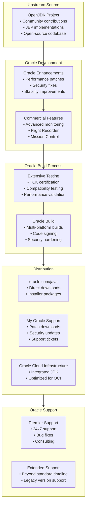

#java #jdk #oracle #commercial #site-reliability-engineering #enterprise
# Oracle JDK
- Oracle JDK is the ==commercial distribution== of the Java Development Kit provided by Oracle Corporation.
- Oracle JDK is based on OpenJDK but includes additional commercial features, tools, and Oracle-specific patches.
- The distribution requires a ==paid subscription== (Oracle Java SE Subscription) for production use since Java 11.
- Oracle JDK provides enterprise-grade support, security updates, and performance monitoring tools.
- Oracle JDK is the reference implementation maintained by the original creators of Java.
# History
## Sun Microsystems era
- Java was created by Sun Microsystems in 1995.
- Sun provided the Java Development Kit as proprietary software with a free license for most uses.
- Sun open-sourced Java as OpenJDK in 2006 under GPL v2 with Classpath Exception.
## Oracle acquisition
- Oracle acquired Sun Microsystems in 2010, becoming the steward of Java.
- Oracle continued free distribution of Oracle JDK through Java 8.
- Oracle JDK and OpenJDK converged in functionality starting from Java 11.
## Licensing changes
- Java 8 and earlier: Free for all use cases under the Binary Code License (BCL).
- Java 11 onward: Requires Oracle Java SE Subscription for production use.
- Oracle Technology Network License (OTNLA): Free for development, testing, and personal use only.
- Commercial use in production requires Oracle Java SE Subscription (per user/processor pricing).
# Licensing models
## Oracle Technology Network License Agreement
- Permits use for development, testing, prototyping, and demonstrating applications.
- Personal use and educational use allowed without payment.
- ==Production use is prohibited== without a commercial subscription.
- Applies to Oracle JDK downloads from oracle.com.
## Oracle Java SE Subscription
- Commercial license for production deployments.
- Pricing models:
	- Named User Plus: Per user pricing
	- Processor: Per physical processor pricing
	- Employee Metric: Based on total employee count
- Includes access to Oracle Premier Support.
- Provides GraalVM Enterprise Edition at no additional cost.
## Oracle Free Terms and Conditions License
- Oracle JDK 17 and later available under No-Fee Terms and Conditions (NFTC).
- Free for all use including production (introduced September 2021).
- Does not include commercial support or access to advanced tools.
- Limited to releases under NFTC license terms.
# Architecture

# Differences from OpenJDK
## Java 8 and earlier
- Oracle JDK included proprietary components not in OpenJDK:
	- Java Web Start
	- JavaFX (later open-sourced)
	- Advanced management and monitoring tools
	- Font rendering improvements
## Java 11 onward
- Oracle JDK and OpenJDK are functionally identical in core features.
- Oracle JDK differences:
	- Commercial license and support
	- Additional installer formats
	- Oracle branding and documentation
	- Access to My Oracle Support portal
	- More frequent updates and patches
## Performance
- Oracle JDK may include performance patches before they reach OpenJDK.
- Both use the same HotSpot JVM implementation.
- Benchmark results typically within margin of error.
# Commercial features
## Java Flight Recorder
- Low-overhead profiling and diagnostics tool.
- Previously commercial-only, now open-source in OpenJDK 11+.
- Collects detailed runtime information for performance analysis.
```shell
# Enable Flight Recorder
java -XX:StartFlightRecording=duration=60s,filename=recording.jfr -jar application.jar

# Start recording on running JVM
jcmd <pid> JFR.start duration=300s filename=/tmp/app-recording.jfr
```
## Java Mission Control
- Advanced monitoring and management console.
- Analyzes Java Flight Recorder data.
- Provides real-time monitoring and profiling.
- Now open-source but Oracle provides commercial builds.
```shell
# Launch Java Mission Control
jmc
```
## Advanced Management Console
- Enterprise-scale deployment and management tool.
- Centralized monitoring of Java deployments.
- License management and compliance tracking.
- Available with Oracle Java SE Subscription.
# Installation
## Download from Oracle
### Direct download
```shell
# Download from oracle.com/java/technologies/downloads
# Requires Oracle account for access
# Select platform and version

# Example for Linux x64
wget --no-check-certificate --no-cookies \
  --header "Cookie: oraclelicense=accept-securebackup-cookie" \
  https://download.oracle.com/java/17/latest/jdk-17_linux-x64_bin.tar.gz
```
## Linux installation
### RPM-based systems
```shell
# Download RPM package
sudo rpm -ivh jdk-17_linux-x64_bin.rpm

# Verify installation
java -version
```
### DEB-based systems
```shell
# Download DEB package
sudo dpkg -i jdk-17_linux-x64_bin.deb

# Configure alternatives
sudo update-alternatives --install /usr/bin/java java /usr/lib/jvm/jdk-17/bin/java 1
sudo update-alternatives --config java
```
### Archive installation
```shell
# Extract archive
tar -xzf jdk-17_linux-x64_bin.tar.gz

# Move to installation directory
sudo mv jdk-17.0.9 /opt/oracle-jdk-17

# Set environment variables
export JAVA_HOME=/opt/oracle-jdk-17
export PATH=$JAVA_HOME/bin:$PATH
```
## Windows installation
### MSI installer
```powershell
# Download MSI from oracle.com
# Run installer with GUI or silent mode
msiexec /i jdk-17_windows-x64_bin.msi /qn

# Verify installation
java -version
```
### Environment variables
```powershell
# Set JAVA_HOME
setx JAVA_HOME "C:\Program Files\Java\jdk-17"

# Add to PATH
setx PATH "%PATH%;%JAVA_HOME%\bin"
```
## macOS installation
### DMG installer
```shell
# Download DMG from oracle.com
# Mount and run installer

# Verify installation
java -version
/usr/libexec/java_home -V
```
### Set JAVA_HOME
```shell
# Add to shell profile (~/.zshrc or ~/.bash_profile)
export JAVA_HOME=$(/usr/libexec/java_home -v 17)
export PATH=$JAVA_HOME/bin:$PATH
```
# Version management
## Multiple Oracle JDK versions
### Linux alternatives system
```shell
# Install multiple versions
sudo rpm -ivh jdk-11_linux-x64_bin.rpm
sudo rpm -ivh jdk-17_linux-x64_bin.rpm

# Configure alternatives
sudo update-alternatives --config java
sudo update-alternatives --config javac

# Set manually
sudo update-alternatives --set java /usr/java/jdk-17/bin/java
```
### Manual JAVA_HOME switching
```shell
# Add to ~/.bashrc or ~/.zshrc
export JAVA_8_HOME=/opt/oracle-jdk-8
export JAVA_11_HOME=/opt/oracle-jdk-11
export JAVA_17_HOME=/opt/oracle-jdk-17

# Alias for switching
alias java8='export JAVA_HOME=$JAVA_8_HOME'
alias java11='export JAVA_HOME=$JAVA_11_HOME'
alias java17='export JAVA_HOME=$JAVA_17_HOME'

# Default
export JAVA_HOME=$JAVA_17_HOME
export PATH=$JAVA_HOME/bin:$PATH
```
# Support and updates
## Oracle Premier Support
- 24x7 technical support with guaranteed response times.
- Access to Oracle support engineers and knowledge base.
- Security updates and critical patch updates.
- Bug fixes and workarounds.
- Consulting on performance and architecture.
## Update schedule
### Critical Patch Updates
- Quarterly CPU releases: January, April, July, October.
- Security vulnerabilities and critical bug fixes.
- Mandatory for maintaining compliance and security.
### Release schedule
- Oracle JDK 8: Extended support until December 2030 (with subscription).
- Oracle JDK 11: Premier support until September 2023, Extended support until January 2032.
- Oracle JDK 17: Premier support until September 2026, Extended support until September 2029.
- Oracle JDK 21: Premier support until September 2028, Extended support until September 2031.
## Extended support
- Available beyond standard support timeline.
- Provides security updates for legacy versions.
- Higher cost than premier support.
- Allows organizations to maintain older Java versions.
# Oracle Cloud Integration
## Oracle Cloud Infrastructure
- Oracle JDK optimized for OCI services.
- Pre-installed on Oracle Linux images.
- Integration with OCI monitoring and logging.
```shell
# OCI compute instance with Oracle JDK
oci compute instance launch \
  --image-id <oracle-linux-image> \
  --shape VM.Standard.E4.Flex \
  --availability-domain <ad> \
  --compartment-id <compartment-ocid>

# SSH and verify Java
ssh opc@<instance-ip>
java -version
```
## Oracle Autonomous Database
- Oracle JDK used for JDBC connections.
- Optimized drivers for Oracle Database.
```java
import oracle.jdbc.pool.OracleDataSource;

OracleDataSource ods = new OracleDataSource();
ods.setURL("jdbc:oracle:thin:@database_high");
ods.setUser("admin");
ods.setPassword("password");

Connection conn = ods.getConnection();
```
## GraalVM Enterprise Edition
- Included with Oracle Java SE Subscription at no additional cost.
- Advanced JIT compiler and native image capabilities.
- Higher performance than standard Oracle JDK.
# Configuration and tuning
## JVM options
### Production settings
```shell
# Recommended production flags
java -server \
     -XX:+UseG1GC \
     -XX:MaxGCPauseMillis=200 \
     -XX:ParallelGCThreads=4 \
     -XX:ConcGCThreads=1 \
     -Xms4g -Xmx4g \
     -XX:+HeapDumpOnOutOfMemoryError \
     -XX:HeapDumpPath=/var/log/java/heapdump.hprof \
     -jar application.jar
```
### Security settings
```shell
# Enable security manager
java -Djava.security.manager \
     -Djava.security.policy=/path/to/security.policy \
     -jar application.jar

# Disable weak cryptographic algorithms
java -Djdk.tls.disabledAlgorithms="SSLv3, RC4, MD5" \
     -jar application.jar
```
## Logging configuration
```shell
# Unified JVM logging (Java 9+)
java -Xlog:all=info:file=/var/log/java/jvm.log:time,uptime,level,tags \
     -Xlog:gc*=debug:file=/var/log/java/gc.log \
     -jar application.jar

# Application logging
java -Djava.util.logging.config.file=/etc/logging.properties \
     -jar application.jar
```
## Remote monitoring
### JMX configuration
```shell
# Enable JMX remote monitoring
java -Dcom.sun.management.jmxremote \
     -Dcom.sun.management.jmxremote.port=9010 \
     -Dcom.sun.management.jmxremote.authenticate=true \
     -Dcom.sun.management.jmxremote.ssl=true \
     -Dcom.sun.management.jmxremote.password.file=/path/to/jmxremote.password \
     -Dcom.sun.management.jmxremote.access.file=/path/to/jmxremote.access \
     -jar application.jar
```
# Performance monitoring
## Java Flight Recorder
### Recording configuration
```shell
# Continuous recording with rotation
java -XX:StartFlightRecording=maxage=24h,maxsize=500M,disk=true,filename=/var/log/java/flight.jfr \
     -jar application.jar

# Template-based recording
java -XX:StartFlightRecording=settings=profile,filename=profile.jfr \
     -jar application.jar
```
### Analyze recordings
```shell
# Using jfr tool (Java 14+)
jfr print --events jdk.CPULoad recording.jfr
jfr summary recording.jfr

# Using Java Mission Control
jmc -open recording.jfr
```
## Diagnostic tools
### Thread analysis
```shell
# Generate thread dump
jstack -l <pid> > thread-dump.txt

# Detect deadlocks
jstack <pid> | grep -A 10 "deadlock"
```
### Memory analysis
```shell
# Heap dump
jmap -dump:live,format=b,file=heap.hprof <pid>

# Analyze with jhat (deprecated) or Eclipse MAT
java -Xmx4g -jar mat.jar heap.hprof
```
# Migration strategies
## From Oracle JDK to OpenJDK distributions
### Assessment
1. Review Oracle JDK-specific features in use
2. Identify dependencies on commercial tools
3. Evaluate support requirements
4. Test application compatibility
### Migration steps
```shell
# Inventory current Java usage
java -version
rpm -qa | grep jdk

# Download alternative distribution
# Example: Eclipse Temurin
wget https://github.com/adoptium/temurin17-binaries/releases/download/...

# Test in non-production
export JAVA_HOME=/opt/temurin-17
./run-tests.sh

# Deploy to production
sudo yum remove oracle-jdk
sudo yum install temurin-17-jdk
```
## From older Oracle JDK versions
### Java 8 to Java 11
```shell
# Identify removed modules
jdeps --jdk-internals application.jar

# Add replacement dependencies
# JAXB, JAF, CORBA removed in Java 11
```
```xml
<dependencies>
    <dependency>
        <groupId>javax.xml.bind</groupId>
        <artifactId>jaxb-api</artifactId>
        <version>2.3.1</version>
    </dependency>
    <dependency>
        <groupId>com.sun.xml.bind</groupId>
        <artifactId>jaxb-impl</artifactId>
        <version>2.3.3</version>
    </dependency>
</dependencies>
```
### Java 11 to Java 17
```shell
# Test with migration flags
java --illegal-access=deny -jar application.jar

# Review warnings
javac -Xlint:all src/**/*.java
```
# Security
## Security updates
- Oracle provides security updates through Critical Patch Updates (CPU).
- Security patches included in quarterly releases.
- Out-of-band updates for critical zero-day vulnerabilities.
- My Oracle Support portal provides early access to patches.
## Vulnerability management
```shell
# Check for known vulnerabilities
# Oracle Security Alerts: oracle.com/security-alerts

# Update to latest patch version
sudo yum update oracle-jdk-17

# Verify version includes security patches
java -version
```
## Security manager
```java title='security.policy'
grant codeBase "file:/path/to/application.jar" {
    permission java.io.FilePermission "/var/data/*", "read,write";
    permission java.net.SocketPermission "*.example.com:443", "connect,resolve";
    permission java.util.PropertyPermission "user.name", "read";
};
```
```shell
# Enable security manager
java -Djava.security.manager \
     -Djava.security.policy==/path/to/security.policy \
     -jar application.jar
```
# Compliance and licensing
## License compliance
- Track Oracle JDK installations across organization.
- Ensure production systems have valid subscriptions.
- Regular audits through Oracle Advanced Management Console.
- Maintain records of downloads and deployments.
## License metrics
### Named User Plus
- Count users who can access Java applications.
- Minimum 25 users per processor.
- Suitable for known, limited user base.
### Processor-based
- Count physical processors running Java workloads.
- Multiplied by Oracle Processor Core Factor.
- Suitable for unlimited users or external-facing applications.
### Employee metric
- Based on total employee count of organization.
- Covers all Java use within organization.
- Predictable pricing for growing companies.
# Use cases
## Enterprise applications
- Large organizations requiring vendor support.
- Mission-critical applications needing guaranteed updates.
- Compliance requirements for supported software.
- Integration with Oracle middleware and databases.
## Legacy systems
- Maintaining Java 8 applications beyond free support timeline.
- Extended support for legacy versions.
- Migration path to newer versions with vendor assistance.
## Oracle ecosystem
- Applications using Oracle Database.
- WebLogic Server deployments.
- Oracle Cloud Infrastructure workloads.
- Integration with Oracle enterprise software.
# Alternatives comparison
## vs OpenJDK builds
- Oracle JDK: Commercial support, guaranteed updates, vendor backing
- OpenJDK: Free, community-driven, multiple vendors
- Consider: Support needs, budget, compliance requirements
## vs Eclipse Temurin
- Oracle JDK: Official Oracle support, early patches
- Temurin: Free LTS, vendor-neutral, broad platform support
- Both: TCK certified, production-ready
## vs Amazon Corretto
- Oracle JDK: Oracle support, OCI optimization
- Corretto: AWS optimization, free, AWS backing
- Consider: Cloud provider, support model
# Best practices
## Production deployment
- Use specific version numbers, avoid latest or default symlinks.
- Implement automated patching for security updates.
- Test updates in staging before production deployment.
- Maintain separate environments for different Java versions.
## Configuration management
```yaml title='Ansible playbook example'
- name: Install Oracle JDK
  hosts: app_servers
  tasks:
    - name: Download Oracle JDK
      get_url:
        url: "{{ oracle_jdk_url }}"
        dest: /tmp/jdk-17.rpm

    - name: Install JDK package
      yum:
        name: /tmp/jdk-17.rpm
        state: present

    - name: Set JAVA_HOME
      lineinfile:
        path: /etc/environment
        line: 'JAVA_HOME=/usr/java/jdk-17'
```
## Monitoring and alerting
- Monitor JVM metrics (heap, GC, threads).
- Alert on OutOfMemoryError and crashes.
- Track security patch compliance.
- Monitor license usage and compliance.
***
# References
1. Oracle Java SE: https://www.oracle.com/java/technologies/
2. Oracle Java SE Licensing: https://www.oracle.com/java/technologies/javase/jdk-faqs.html
3. Oracle Java SE Subscription: https://www.oracle.com/java/java-se-subscription/
4. Oracle Premier Support: https://www.oracle.com/support/
5. Oracle Critical Patch Updates: https://www.oracle.com/security-alerts/
6. Java SE Documentation: https://docs.oracle.com/en/java/javase/