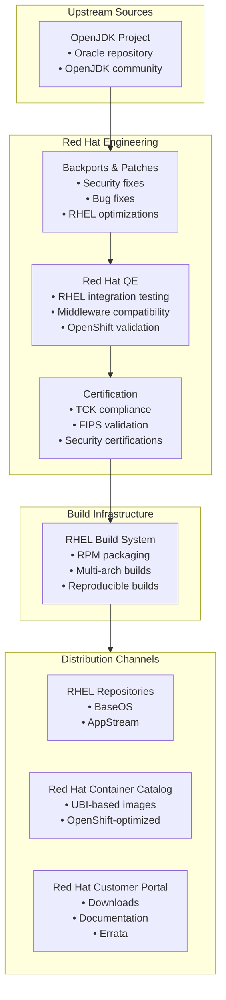
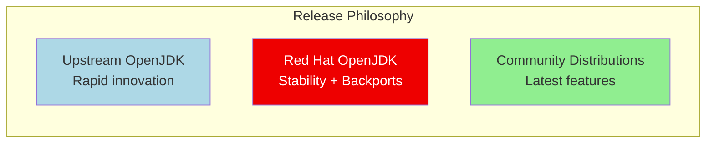
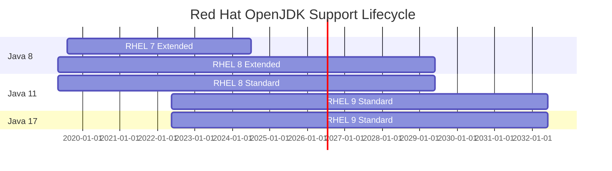

#java #jdk #openjdk #red-hat #rhel #openshift #site-reliability-engineering #enterprise
# Red Hat OpenJDK
- Red Hat build of OpenJDK is an ==enterprise-ready, certified distribution of OpenJDK== provided by Red Hat.
- The distribution is optimized for ==Red Hat Enterprise Linux (RHEL)== and integrated with Red Hat's enterprise ecosystem.
- Red Hat OpenJDK is the foundation for Java applications on Red Hat platforms including RHEL, OpenShift, and JBoss middleware.
- The distribution includes long-term support backed by Red Hat's enterprise support and engineering expertise.
# Key characteristics
## Enterprise integration
- Red Hat OpenJDK is ==deeply integrated with RHEL== and available through standard RHEL repositories.
- Tested and certified for use with Red Hat middleware (JBoss EAP, WildFly, Apache Tomcat).
- Optimized for Red Hat OpenShift Container Platform and Kubernetes environments.
- Part of Red Hat's comprehensive enterprise support model.
## Red Hat support
- Long-term support available through ==Red Hat subscriptions==.
- Support lifecycle aligned with RHEL and OpenShift product lifecycles.
- Access to Red Hat's global support organization and knowledge base.
- Proactive security updates and CVE remediation.
## LTS versions
- Red Hat provides long-term support for LTS releases:
	- Red Hat OpenJDK 8: Support aligned with RHEL 7/8/9 lifecycle
	- Red Hat OpenJDK 11: Extended support until RHEL 8/9 end of life
	- Red Hat OpenJDK 17: Support through RHEL 9 extended lifecycle
	- Red Hat OpenJDK 21: Future LTS aligned with Red Hat platform roadmap
- Support duration extends beyond upstream OpenJDK maintenance windows.
## Certification and compliance
- Red Hat OpenJDK passes ==Java Technology Compatibility Kit (TCK)==.
- Certified for use in regulated industries (financial, healthcare, government).
- FIPS 140-2 compliant builds available for government and compliance requirements.
- Common Criteria and other security certifications.
## Platform support
- Red Hat OpenJDK primarily supports Red Hat platforms:
	- Red Hat Enterprise Linux 7, 8, 9 (x86_64, aarch64, ppc64le, s390x)
	- Red Hat OpenShift Container Platform
	- Windows (x64) for development purposes
	- Container images based on Red Hat Universal Base Image (UBI)
- Multi-architecture support for enterprise deployments.
# Architecture

## Release model
- Red Hat follows a ==conservative release approach== prioritizing stability.
- Security updates released through Red Hat Security Advisories (RHSA).
- Bug fix updates through Red Hat Bug Fix Advisories (RHBA).
- Enhancement updates through Red Hat Enhancement Advisories (RHEA).
## Package versioning
- Red Hat uses RPM versioning with epoch, version, and release components.
- Format: `epoch:version-release`
- Example: `1:11.0.21.0.9-2.el8`
	- `1`: Epoch (for major upgrades)
	- `11.0.21.0.9`: OpenJDK version
	- `2.el8`: Red Hat build number for RHEL 8
# Installation
## Red Hat Enterprise Linux
### RHEL 8 and 9
```shell
# List available OpenJDK versions
yum list available java*openjdk*
# Install OpenJDK 17 (default on RHEL 9)
sudo yum install java-17-openjdk-devel
# Install OpenJDK 11
sudo yum install java-11-openjdk-devel
# Install OpenJDK 8
sudo yum install java-1.8.0-openjdk-devel
```
### RHEL 7
```shell
# Install OpenJDK 11 on RHEL 7
sudo yum install java-11-openjdk-devel
# Install OpenJDK 8 (default on RHEL 7)
sudo yum install java-1.8.0-openjdk-devel
```
### Headless vs Full packages
```shell
# Headless JRE (no GUI support, smaller footprint)
sudo yum install java-17-openjdk-headless
# Full JDK with development tools
sudo yum install java-17-openjdk-devel
# JRE only (includes GUI libraries)
sudo yum install java-17-openjdk
```
## Fedora
```shell
# Fedora includes Red Hat OpenJDK builds
sudo dnf install java-17-openjdk-devel
# Latest version
sudo dnf install java-latest-openjdk-devel
```
## CentOS Stream
```shell
# CentOS Stream receives Red Hat OpenJDK builds
sudo dnf install java-17-openjdk-devel
```
## Red Hat Universal Base Image (UBI)
### UBI 9 container images
```shell
# OpenJDK 17 on UBI 9
docker pull registry.access.redhat.com/ubi9/openjdk-17:latest
docker pull registry.access.redhat.com/ubi9/openjdk-17-runtime:latest
# OpenJDK 11 on UBI 9
docker pull registry.access.redhat.com/ubi9/openjdk-11:latest
docker pull registry.access.redhat.com/ubi9/openjdk-11-runtime:latest
```
### UBI 8 container images
```shell
# OpenJDK 17 on UBI 8
docker pull registry.access.redhat.com/ubi8/openjdk-17:latest
# OpenJDK 11 on UBI 8
docker pull registry.access.redhat.com/ubi8/openjdk-11:latest
# OpenJDK 8 on UBI 8
docker pull registry.access.redhat.com/ubi8/openjdk-8:latest
```
### Using in Dockerfile
```dockerfile
FROM registry.access.redhat.com/ubi9/openjdk-17:latest
# UBI images run as non-root by default (user 185)
USER 185
WORKDIR /deployments
COPY --chown=185:185 target/*.jar /deployments/app.jar
# Use exec form for proper signal handling
ENTRYPOINT ["java", "-jar", "app.jar"]
```
## OpenShift Source-to-Image (S2I)
### S2I builder images
```shell
# OpenJDK 17 S2I builder
oc new-app registry.access.redhat.com/ubi9/openjdk-17~https://github.com/example/java-app.git
# OpenJDK 11 S2I builder
oc new-app registry.access.redhat.com/ubi8/openjdk-11~https://github.com/example/java-app.git
```
### BuildConfig with S2I
```yaml
apiVersion: build.openshift.io/v1
kind: BuildConfig
metadata:
  name: java-app
spec:
  source:
    git:
      uri: https://github.com/example/java-app.git
    type: Git
  strategy:
    sourceStrategy:
      from:
        kind: ImageStreamTag
        name: openjdk-17:latest
        namespace: openshift
    type: Source
  output:
    to:
      kind: ImageStreamTag
      name: java-app:latest
```
# RHEL integration
## Alternatives system
- Red Hat uses the `alternatives` system to manage multiple Java versions.
```shell
# List installed Java versions
alternatives --display java
# Switch Java version interactively
sudo alternatives --config java
sudo alternatives --config javac
# Set specific version
sudo alternatives --set java /usr/lib/jvm/java-17-openjdk/bin/java
```
## SELinux integration
- Red Hat OpenJDK packages include ==SELinux policies== for enhanced security.
```shell
# Check SELinux context for Java
ls -Z /usr/bin/java
# Run Java with specific SELinux context
runcon -t java_exec_t java -jar application.jar
# Troubleshoot SELinux denials
ausearch -m avc -ts recent | grep java
```
## systemd integration
### Create systemd service for Java application
```ini
[Unit]
Description=Java Application
After=network.target
[Service]
Type=simple
User=javaapp
ExecStart=/usr/bin/java -jar /opt/app/application.jar
Restart=on-failure
RestartSec=10
# Use Red Hat OpenJDK
Environment="JAVA_HOME=/usr/lib/jvm/java-17-openjdk"
[Install]
WantedBy=multi-user.target
```
```shell
# Enable and start service
sudo systemctl enable javaapp.service
sudo systemctl start javaapp.service
```
## Subscription Manager integration
```shell
# Verify Red Hat subscription status
sudo subscription-manager status
# List available Java packages
sudo subscription-manager repos --list | grep -i java
# Enable specific repositories
sudo subscription-manager repos --enable rhel-9-for-x86_64-appstream-rpms
```
# Red Hat OpenShift integration
## OpenShift Container Platform
### DeploymentConfig with Red Hat OpenJDK
```yaml
apiVersion: apps.openshift.io/v1
kind: DeploymentConfig
metadata:
  name: java-app
spec:
  replicas: 3
  selector:
    app: java-app
  template:
    metadata:
      labels:
        app: java-app
    spec:
      containers:
      - name: app
        image: registry.access.redhat.com/ubi9/openjdk-17:latest
        ports:
        - containerPort: 8080
        env:
        - name: JAVA_OPTS_APPEND
          value: "-Xmx512m -XX:MaxMetaspaceSize=256m"
        - name: GC_MAX_HEAP_SIZE_RATIO
          value: "75"
        - name: GC_ADAPTIVE_SIZE_POLICY_WEIGHT
          value: "90"
        resources:
          requests:
            memory: "768Mi"
            cpu: "200m"
          limits:
            memory: "1Gi"
            cpu: "500m"
```
## OpenShift environment variables
- Red Hat OpenJDK images support OpenShift-specific environment variables.
```yaml
env:
# Container memory settings
- name: JAVA_MAX_MEM_RATIO
  value: "80"
- name: JAVA_INITIAL_MEM_RATIO
  value: "25"
# GC configuration
- name: GC_MIN_HEAP_FREE_RATIO
  value: "20"
- name: GC_MAX_HEAP_FREE_RATIO
  value: "40"
- name: GC_TIME_RATIO
  value: "4"
- name: GC_ADAPTIVE_SIZE_POLICY_WEIGHT
  value: "90"
- name: GC_MAX_METASPACE_SIZE
  value: "256"
# Diagnostics
- name: JAVA_DIAGNOSTICS
  value: "true"
```
## OpenShift Pipelines (Tekton)
### Pipeline with Red Hat OpenJDK
```yaml
apiVersion: tekton.dev/v1beta1
kind: Pipeline
metadata:
  name: java-build-pipeline
spec:
  tasks:
  - name: build
    taskRef:
      name: maven
    params:
    - name: MAVEN_IMAGE
      value: registry.access.redhat.com/ubi8/openjdk-17:latest
    - name: GOALS
      value: ["clean", "package"]
  - name: build-image
    taskRef:
      name: buildah
    params:
    - name: IMAGE
      value: image-registry.openshift-image-registry.svc:5000/myproject/java-app
```
## Red Hat JBoss middleware
### JBoss EAP integration
```shell
# JBoss EAP includes Red Hat OpenJDK in subscription
sudo yum install eap7-openjdk-11
# Set JAVA_HOME for JBoss EAP
export JAVA_HOME=/usr/lib/jvm/java-11-openjdk
$JBOSS_HOME/bin/standalone.sh
```
### WildFly with Red Hat OpenJDK
```shell
# Install WildFly from RHEL repositories
sudo yum install wildfly
# Use Red Hat OpenJDK
export JAVA_HOME=/usr/lib/jvm/java-17-openjdk
systemctl start wildfly
```
# Configuration and tuning
## RHEL-specific optimizations
### Performance tuning for RHEL
```shell
# Use tuned profiles for Java workloads
sudo yum install tuned
sudo systemctl enable --now tuned
# Apply throughput-performance profile
sudo tuned-adm profile throughput-performance
# Or latency-performance for low-latency workloads
sudo tuned-adm profile latency-performance
```
### Transparent Huge Pages (THP)
```shell
# Check THP status
cat /sys/kernel/mm/transparent_hugepage/enabled
# Disable THP for Java workloads (recommended)
echo never | sudo tee /sys/kernel/mm/transparent_hugepage/enabled
echo never | sudo tee /sys/kernel/mm/transparent_hugepage/defrag
# Make persistent
sudo grubby --update-kernel=ALL --args="transparent_hugepage=never"
```
## JVM options for enterprise workloads
### Production server configuration
```shell
# High-throughput server
java -server \
     -Xms4g -Xmx4g \
     -XX:+UseG1GC \
     -XX:MaxGCPauseMillis=200 \
     -XX:+ParallelRefProcEnabled \
     -XX:+UnlockExperimentalVMOptions \
     -XX:+DisableExplicitGC \
     -jar application.jar
```
### Container-optimized configuration
```shell
# Red Hat UBI container optimization
java -XX:+UseContainerSupport \
     -XX:MaxRAMPercentage=75.0 \
     -XX:InitialRAMPercentage=50.0 \
     -XX:+ExitOnOutOfMemoryError \
     -XX:+UseG1GC \
     -jar application.jar
```
### Low-latency configuration
```shell
# Low-latency trading/financial applications
java -Xms8g -Xmx8g \
     -XX:+UseG1GC \
     -XX:MaxGCPauseMillis=10 \
     -XX:+AlwaysPreTouch \
     -XX:+DisableExplicitGC \
     -XX:+UseStringDeduplication \
     -jar application.jar
```
## Security configuration
### FIPS 140-2 mode
```shell
# Enable FIPS mode on RHEL
sudo fips-mode-setup --enable
sudo reboot
# Verify FIPS mode
fips-mode-setup --check
# Run Java in FIPS mode
java -Dcom.redhat.fips=true \
     -Djava.security.properties=/etc/crypto-policies/back-ends/java.config \
     -jar application.jar
```
### Cryptographic policy
```shell
# RHEL system-wide crypto policies
update-crypto-policies --show
# Set to FUTURE for stronger crypto
sudo update-crypto-policies --set FUTURE
# Java automatically uses system crypto policies
```
## Monitoring and observability
### Red Hat Insights integration
```shell
# Install Red Hat Insights client
sudo yum install insights-client
sudo insights-client --register
# Insights provides proactive issue detection for Java applications
```
### JMX monitoring
```shell
# Enable JMX for monitoring
java -Dcom.sun.management.jmxremote \
     -Dcom.sun.management.jmxremote.port=9010 \
     -Dcom.sun.management.jmxremote.authenticate=false \
     -Dcom.sun.management.jmxremote.ssl=false \
     -Dcom.sun.management.jmxremote.local.only=false \
     -jar application.jar
```
### Java Flight Recorder (JFR)
```shell
# Enable JFR
java -XX:StartFlightRecording=duration=300s,filename=/tmp/recording.jfr \
     -jar application.jar
# Start JFR on running process
jcmd <pid> JFR.start duration=60s filename=/tmp/recording.jfr
```
# Performance characteristics
## Stability focus

- Red Hat prioritizes ==stability and enterprise readiness== over cutting-edge features.
- Extensive testing and validation before release.
- Conservative update cadence with focus on security and critical bug fixes.
## Enterprise support lifecycle

- Support extends well beyond upstream OpenJDK maintenance windows.
- Tied to RHEL Extended Update Support (EUS) and Extended Life Cycle (ELC).
# Version management
## Multiple versions on RHEL
```shell
# Install multiple versions
sudo yum install java-11-openjdk-devel java-17-openjdk-devel
# List installed versions
rpm -qa | grep openjdk
# Switch versions
sudo alternatives --config java
sudo alternatives --config javac
```
## Per-project JAVA_HOME
```shell
# Set JAVA_HOME in project directory
cat > ~/.java_version << EOF
export JAVA_HOME=/usr/lib/jvm/java-17-openjdk
export PATH=$JAVA_HOME/bin:$PATH
EOF
# Source in shell profile
echo "source ~/.java_version" >> ~/.bashrc
```
## Container-based version management
```shell
# Use containers for version isolation
podman run -it registry.access.redhat.com/ubi9/openjdk-17 java -version
podman run -it registry.access.redhat.com/ubi9/openjdk-11 java -version
```
# Security features
## Red Hat Security Advisories (RHSA)
- Red Hat publishes security advisories for OpenJDK vulnerabilities.
- Security updates released through standard RHEL update mechanism.
```shell
# Check for security updates
sudo yum updateinfo list security
# Apply only security updates
sudo yum update --security
# View specific advisory
sudo yum updateinfo info RHSA-2024:XXXX
```
## CVE remediation
- Red Hat backports security fixes to older versions.
- Extended support for CVE remediation beyond upstream.
```shell
# Check installed package security info
rpm -q --changelog java-17-openjdk | grep CVE
```
## FIPS 140-2 compliance
- Red Hat provides FIPS-validated builds for regulated industries.
- System-wide crypto policies integration.
```shell
# Verify FIPS mode
fips-mode-setup --check
# Java respects system FIPS policy
java -XshowSettings:security -version 2>&1 | grep fips
```
# Migration guide
## From Oracle JDK to Red Hat OpenJDK
- Red Hat OpenJDK is a drop-in replacement for Oracle JDK.
- Binary compatible for same major version.
### Migration steps
```shell
# Remove Oracle JDK
sudo yum remove oracle-java
# Install Red Hat OpenJDK
sudo yum install java-17-openjdk-devel
# Update JAVA_HOME
export JAVA_HOME=/usr/lib/jvm/java-17-openjdk
# Verify installation
java -version
```
## From other OpenJDK distributions
### Update container images
```dockerfile
# Before: Eclipse Temurin
# FROM eclipse-temurin:17-jdk
# After: Red Hat UBI OpenJDK
FROM registry.access.redhat.com/ubi9/openjdk-17:latest
```
### Update package installation
```shell
# Remove other distribution
sudo yum remove temurin-17-jdk
# Install Red Hat OpenJDK
sudo yum install java-17-openjdk-devel
```
# Monitoring and diagnostics
## Red Hat build of OpenJDK diagnostics
### Verbose logging
```shell
# GC logging
java -Xlog:gc*:file=/var/log/java/gc.log:time,uptime,level,tags \
     -XX:+UseGCLogFileRotation \
     -XX:NumberOfGCLogFiles=5 \
     -XX:GCLogFileSize=10M \
     -jar application.jar
```
### Thread dumps
```shell
# Generate thread dump
jstack <pid> > /tmp/threaddump.txt
# Using jcmd (recommended)
jcmd <pid> Thread.print > /tmp/threaddump.txt
```
### Heap dumps
```shell
# Generate heap dump
jmap -dump:live,format=b,file=/tmp/heapdump.hprof <pid>
# Auto dump on OutOfMemoryError
java -XX:+HeapDumpOnOutOfMemoryError \
     -XX:HeapDumpPath=/var/log/java/heapdump.hprof \
     -jar application.jar
```
## Red Hat Application Performance Management
- Red Hat offers APM solutions for Java monitoring.
- Integration with Prometheus, Grafana for metrics.
```yaml
# Prometheus JMX exporter for Red Hat OpenJDK
apiVersion: v1
kind: ConfigMap
metadata:
  name: jmx-exporter-config
data:
  config.yaml: |
    lowercaseOutputName: true
    rules:
    - pattern: "java.lang<type=Memory><HeapMemoryUsage>used"
      name: jvm_memory_heap_used
```
# Use cases
## Enterprise applications on RHEL
- Mission-critical applications requiring vendor support.
- Regulated industries (finance, healthcare, government).
- Long-term deployments with extended support requirements.
## Red Hat OpenShift deployments
- Container-native Java applications on OpenShift.
- Microservices architectures with S2I builders.
- Hybrid cloud deployments across on-premise and cloud.
## JBoss middleware integration
- JBoss EAP applications requiring certified Java runtime.
- WildFly and other Red Hat middleware.
- Integration with Red Hat Data Grid, AMQ, Fuse.
## Hybrid cloud environments
- Consistent Java runtime across RHEL and OpenShift.
- Multi-cloud deployments with Red Hat CloudForms.
- Edge computing with RHEL for Edge.
## Mainframe and specialized architectures
- IBM Z (s390x) and IBM Power (ppc64le) support.
- Mission-critical workloads on enterprise hardware.
- Seamless migration from legacy platforms.
# Comparison with other distributions
## vs Eclipse Temurin
- Red Hat: RHEL integration, enterprise support, conservative updates
- Temurin: Vendor-neutral, broader platform support, community-driven
- Both: Free, LTS, TCK certified
## vs Amazon Corretto
- Red Hat: RHEL/OpenShift focus, enterprise middleware integration
- Corretto: AWS optimization, broader availability
- Both: Production-ready, long-term support
## vs IBM Semeru
- Red Hat: HotSpot JVM, RHEL ecosystem integration
- Semeru: OpenJ9 JVM, memory efficiency, IBM cloud focus
- Both: Enterprise-grade, commercial support available
## vs Oracle JDK
- Red Hat: Free with RHEL subscription, open-source
- Oracle: Commercial support, proprietary features, licensing costs
- Both: Enterprise support, TCK certified
# Support and resources
## Red Hat subscription benefits
- Access to Red Hat Customer Portal.
- Knowledge base articles and solution documents.
- Software certifications and hardware compatibility lists.
- Red Hat support cases with SLA guarantees.
## Red Hat support tiers
- **Standard Support**: Business hours support.
- **Premium Support**: 24x7 support with faster response times.
- **Mission Critical Support**: Dedicated support engineers and proactive monitoring.
## Community resources
- Fedora OpenJDK community for upstream development.
- CentOS Stream for preview of upcoming RHEL features.
- Red Hat Developer program (free development subscriptions).
- Red Hat Learning Subscription for training.
## Documentation
- Red Hat Enterprise Linux OpenJDK documentation: https://access.redhat.com/documentation/
- OpenShift container platform documentation.
- JBoss EAP product documentation.
- Red Hat Developer guides and tutorials.
## Security advisories
- Red Hat Security Advisories (RHSA) for CVE notifications.
- Published at: https://access.redhat.com/security/security-updates/
- Email notifications for security updates.
- Integration with Red Hat Insights for proactive detection.
# Red Hat Developer program
- Free Red Hat Developer subscription includes:
	- RHEL for development use
	- Red Hat OpenJDK access
	- OpenShift Developer Sandbox
	- Access to Red Hat container catalog
- No-cost option for learning and development.
```shell
# Register for Red Hat Developer subscription
# Visit: https://developers.redhat.com/register
# Install RHEL with developer subscription
sudo subscription-manager register
sudo subscription-manager attach --pool=<developer-pool-id>
```
***
# References
1. Red Hat OpenJDK Product Page: https://www.redhat.com/en/technologies/cloud-computing/openshift/what-is-openjdk
2. Red Hat Customer Portal - OpenJDK: https://access.redhat.com/articles/1299013
3. Red Hat Enterprise Linux Documentation: https://access.redhat.com/documentation/en-us/red_hat_enterprise_linux/
4. Red Hat OpenShift Documentation: https://docs.openshift.com/
5. Red Hat Universal Base Image: https://www.redhat.com/en/blog/introducing-red-hat-universal-base-image
6. Red Hat Developer: https://developers.redhat.com/products/openjdk/overview
7. Red Hat Security Advisories: https://access.redhat.com/security/security-updates/
8. OpenJDK Life Cycle and Support Policy: https://access.redhat.com/articles/1299013
9. [[site-reliability-engineering/build-tools/java/java-runtime/Java Development Kit (JDK), Java Runtime Environment (JRE) and Java Virtual Machine (JVM)]]
10. [[site-reliability-engineering/build-tools/java/java-runtime/java-distribution/OpenJDK]]
11. [[site-reliability-engineering/build-tools/java/java-runtime/java-distribution/Eclipse Temurin]]
12. [[site-reliability-engineering/build-tools/java/java-runtime/java-distribution/Amazon Corretto]]
13. [[site-reliability-engineering/build-tools/java/java-runtime/java-distribution/IBM Semeru]]
