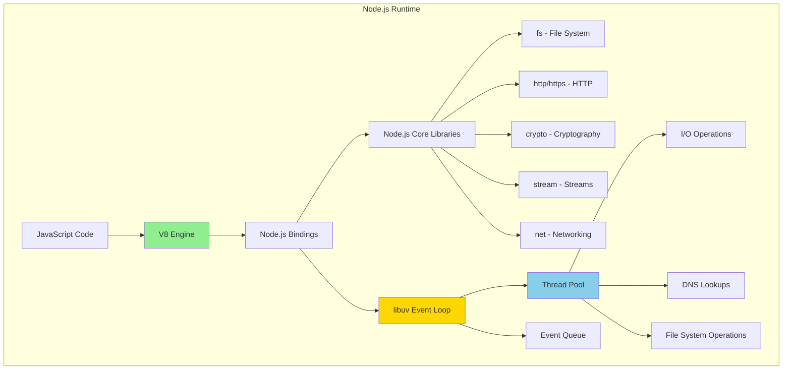
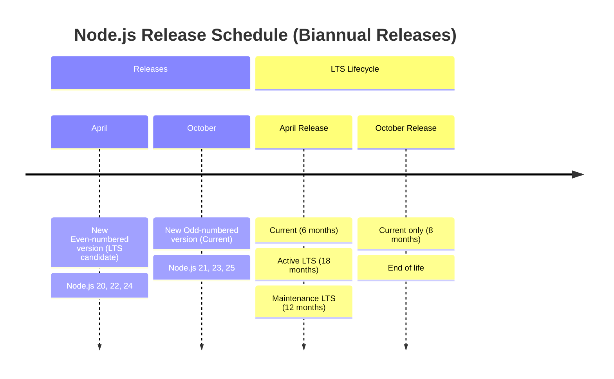

#nodejs #javascript #containerization #npm #package-manager #concurrency-control 
# Definition
- Node.js is an open-source, cross-platform JavaScript runtime environment built on Chrome's V8 JavaScript engine that executes JavaScript code outside of a web browser with *event-driven, non-blocking* I/O model.
# Characteristics
- **Single-threaded event loop**: Non-blocking I/O operations using libuv
- **V8 JavaScript engine**: High-performance compilation and execution
- **Built-in modules**: Core libraries for file system, HTTP, networking, and cryptography
- **NPM ecosystem**: Largest software registry with over 2 million packages
- **Cross-platform**: Runs on Windows, macOS, Linux, and containerized environments
# Architecture


## Components
### V8 JavaScript Engine
- **Just-in-Time (JIT) compilation**: Compiles JavaScript to native machine code
- **Memory management**: Automatic garbage collection with generational heap
- **Optimization**: Inline caching, hidden classes, and dynamic optimization
- **Performance**: Fast execution comparable to statically-typed languages
### libuv Event Loop
- **Asynchronous I/O**: Non-blocking operations for network and file system
- **Cross-platform abstraction**: Unified API across Windows (IOCP) and Unix (epoll, kqueue)
- **Thread pool**: Default 4 threads for CPU-intensive operations
- **Event-driven architecture**: Callback queue and event loop processing
### Node.js Bindings (C++)

- **Native modules**: Bridge between JavaScript and C++ libraries
- **Add-ons**: Native extensions using N-API for version stability
- **System integration**: Direct access to operating system APIs

# Node.js Release Cycle


## Release Types
### Current
- **Release**: Latest features and improvements
- **Duration**: 6 months (even-numbered) or 8 months (odd-numbered)
- **Use case**: Development, testing, and experimentation
- **Stability**: May have breaking changes between major versions

### Active LTS (Long-Term Support)
- **Promotion**: Even-numbered releases after 6 months as Current
- **Duration**: 18 months of active support
- **Updates**: Critical bug fixes, security patches, and compatible features
- **Use case**: Production applications requiring stability
- **Support**: Commercial support available from Node.js Foundation
### Maintenance LTS
- **Duration**: 12 months after Active LTS ends
- **Updates**: Critical bug fixes and security patches only
- **Use case**: Legacy production systems with long upgrade cycles
## Version Selection Strategy

| Version Type | Example | Stability | Updates | Recommended For |
|--------------|---------|-----------|---------|-----------------|
| **Current** | 23.x | Experimental | Frequent | Development, testing |
| **Active LTS** | 22.x | Stable | Regular | Production applications |
| **Maintenance LTS** | 20.x | Very stable | Security only | Legacy systems |
| **EOL** | 17.x and older | Unsupported | None | Migration required |
# Node.js Container Base Images
## Official Docker Images
### Image Variants
```Dockerfile
# Standard Debian-based image (~180MB)
FROM node:22-bookworm

# Slim variant - minimal Debian (~75MB)
FROM node:22-bookworm-slim

# Alpine Linux variant - smallest (~40MB)
FROM node:22-alpine

# Specific version pinning for reproducibility
FROM node:22.11.0-alpine3.20
```
## Image Comparison

| Image Variant | Size | Base OS | Package Manager | Use Case |
|---------------|------|---------|-----------------|----------|
| `node:22-bookworm` | ~180MB | Debian 12 | apt | Full tooling, build environments |
| `node:22-bookworm-slim` | ~75MB | Debian 12 | apt | Production with minimal tools |
| `node:22-alpine` | ~40MB | Alpine 3.20 | apk | Minimal production images |
| `node:22-alpine3.20` | ~40MB | Alpine 3.20 | apk | Pinned Alpine version |

## Alpine Linux Considerations
### Advantages
- Smallest image size (3-4x smaller than Debian)
- musl libc instead of glibc
- apk package manager for quick installs
### Disadvantages
- Native module compatibility issues (some npm packages fail)
- Missing build tools by default (`python`, `make`, `g++`)
- DNS resolution differences may cause issues
- Debugging tools not included by default
### Usage
#### Use when
- Applications with pure JavaScript dependencies
- Production deployments requiring minimal size
- Environments with bandwidth/storage constraints
#### Avoid when
- Applications using native Node.js addons
- Dependencies requiring compilation (node-gyp)
- Need for comprehensive debugging tools
# Container Optimization Patterns

## Multi-Stage Build Pattern

```Dockerfile
# Build stage with full tooling
FROM node:22-alpine AS builder

WORKDIR /app

# Copy package files
COPY package*.json ./

# Install all dependencies (including devDependencies)
RUN npm ci --include=dev

# Copy application source
COPY . .

# Build application (TypeScript, bundling, etc.)
RUN npm run build

# Production stage - minimal runtime
FROM node:22-alpine AS production

WORKDIR /app

# Copy package files
COPY package*.json ./

# Install production dependencies only
RUN npm ci --omit=dev && npm cache clean --force

# Copy built artifacts from builder
COPY --from=builder /app/dist ./dist

# Create non-root user
RUN addgroup -g 1001 -S nodejs && \
    adduser -S nodejs -u 1001

# Set ownership
RUN chown -R nodejs:nodejs /app

# Switch to non-root user
USER nodejs

# Expose application port
EXPOSE 3000

# Health check
HEALTHCHECK --interval=30s --timeout=3s --start-period=40s --retries=3 \
  CMD node healthcheck.js

# Start application
CMD ["node", "dist/index.js"]
```
## Development vs Production Images
### Development Image
```Dockerfile
FROM node:22-bookworm

WORKDIR /app

# Install system dependencies for development
RUN apt-get update && apt-get install -y \
    git \
    vim \
    && rm -rf /var/lib/apt/lists/*

# Copy package files
COPY package*.json ./

# Install all dependencies
RUN npm install

# Copy application source
COPY . .

# Expose port and debugger port
EXPOSE 3000 9229

# Start with nodemon for hot reload
CMD ["npm", "run", "dev"]
```
### Production Image Best Practices
```Dockerfile
FROM node:22-alpine3.20

# Set NODE_ENV before npm install for optimizations
ENV NODE_ENV=production

WORKDIR /app

# Install dumb-init for proper signal handling
RUN apk add --no-cache dumb-init

# Copy package files
COPY package*.json ./

# Install production dependencies with clean install
RUN npm ci --omit=dev && \
    npm cache clean --force

# Copy application code
COPY . .

# Create non-root user
RUN addgroup -g 1001 -S nodejs && \
    adduser -S nodejs -u 1001 && \
    chown -R nodejs:nodejs /app

USER nodejs

EXPOSE 3000

# Use dumb-init to handle signals properly
ENTRYPOINT ["dumb-init", "--"]

CMD ["node", "index.js"]
```
# Package Manager Integration
## NPM (Node Package Manager)
- npm is the default package manager bundled with Node.js.
### Key Commands

```Shell
# Install dependencies from package.json
npm install

# Clean install (uses package-lock.json, removes node_modules first)
npm ci

# Install production dependencies only
npm ci --omit=dev

# Install specific package
npm install express

# Install dev dependency
npm install --save-dev typescript

# Update packages
npm update

# Audit security vulnerabilities
npm audit

# Fix vulnerabilities automatically
npm audit fix
```

### Docker Integration

```Dockerfile
# Copy package files first for layer caching
COPY package*.json ./

# Use npm ci for reproducible builds
RUN npm ci --omit=dev

# Clean npm cache to reduce image size
RUN npm cache clean --force
```

## Yarn
- Alternative package manager with faster installs and better dependency resolution.
```Dockerfile
FROM node:22-alpine

# Install Yarn globally
RUN corepack enable && corepack prepare yarn@stable --activate

WORKDIR /app

# Copy Yarn files
COPY package.json yarn.lock .yarnrc.yml ./

# Install dependencies
RUN yarn install --immutable --immutable-cache

COPY . .

CMD ["node", "index.js"]
```
## pnpm
- pnpm is the efficient package manager using content-addressable storage.
```Dockerfile
FROM node:22-alpine

# Enable pnpm via corepack
RUN corepack enable && corepack prepare pnpm@latest --activate

WORKDIR /app

# Copy pnpm files
COPY package.json pnpm-lock.yaml ./

# Install dependencies
RUN pnpm install --frozen-lockfile --prod

COPY . .

CMD ["node", "index.js"]
```
## Package Manager Comparison

| Feature | npm | Yarn | pnpm |
|---------|-----|------|------|
| **Install Speed** | Baseline | 2x faster | 3x faster |
| **Disk Usage** | High | High | Low (shared store) |
| **Lock File** | package-lock.json | yarn.lock | pnpm-lock.yaml |
| **Workspace Support** | Yes | Yes | Yes (best) |
| **Node.js Bundle** | Yes | No | No |
| **Deterministic** | Yes (with ci) | Yes | Yes |
# Security Best Practices
## User Privilege Model

```Dockerfile
FROM node:22-alpine

WORKDIR /app

# Install dependencies as root
COPY package*.json ./
RUN npm ci --omit=dev

# Copy application
COPY . .

# Create non-root user with specific UID/GID
RUN addgroup -g 1001 -S nodejs && \
    adduser -S nodejs -u 1001 -G nodejs

# Set file ownership
RUN chown -R nodejs:nodejs /app

# Switch to non-root user before starting app
USER nodejs

CMD ["node", "index.js"]
```

## Environment Variable Management

```Dockerfile
# Use build arguments for build-time configuration
ARG NODE_VERSION=22

FROM node:${NODE_VERSION}-alpine

# Runtime environment variables
ENV NODE_ENV=production \
    NODE_OPTIONS="--max-old-space-size=2048" \
    PORT=3000

# Never hardcode secrets - use runtime injection
# Docker: docker run -e SECRET_KEY=value
# Kubernetes: env from ConfigMap/Secret
```
## Secrets Management
```JavaScript
// config.js - Load secrets from environment
module.exports = {
  port: process.env.PORT || 3000,
  database: {
    host: process.env.DB_HOST,
    user: process.env.DB_USER,
    password: process.env.DB_PASSWORD, // Injected at runtime
  },
  jwtSecret: process.env.JWT_SECRET,
};
```

```Shell
# Development - use .env file (never commit)
npm install dotenv
node -r dotenv/config index.js

# Production - inject via orchestrator
docker run -e DB_PASSWORD=secret myapp:latest
kubectl create secret generic app-secrets --from-literal=DB_PASSWORD=secret
```
## Vulnerability Scanning
```Shell
# Audit npm packages
npm audit

# Fix vulnerabilities
npm audit fix

# Check for outdated packages
npm outdated

# Update packages
npm update

# Install specific security patches
npm install package@version
```
## Docker Security Scanning
```Shell
# Scan Docker image for vulnerabilities
docker scan node:22-alpine

# Use Trivy for comprehensive scanning
trivy image myapp:latest

# Use Snyk for dependency scanning
snyk test --docker myapp:latest
```
# Performance Optimization
## Node.js Flags and Options
```Dockerfile
FROM node:22-alpine

WORKDIR /app

COPY package*.json ./
RUN npm ci --omit=dev

COPY . .

# Set Node.js optimization flags
ENV NODE_OPTIONS="--max-old-space-size=2048 --max-semi-space-size=64"

# Production optimizations
ENV NODE_ENV=production

USER nodejs

CMD ["node", "--max-old-space-size=2048", "index.js"]
```
## Common Node.js Options

| Flag | Purpose | Recommended Value |
|------|---------|-------------------|
| `--max-old-space-size` | Maximum heap size (MB) | 2048-4096 (2-4GB) |
| `--max-semi-space-size` | Young generation size (MB) | 64-128 |
| `--optimize-for-size` | Reduce memory usage | Production low-memory |
| `--jitless` | Disable JIT compilation | High-security environments |
| `--inspect` | Enable debugger | Development only |
| `--trace-warnings` | Show stack traces | Development debugging |

## Memory Management

```JavaScript
// Check memory usage
const used = process.memoryUsage();
console.log({
  rss: `${Math.round(used.rss / 1024 / 1024)} MB`, // Total memory
  heapTotal: `${Math.round(used.heapTotal / 1024 / 1024)} MB`,
  heapUsed: `${Math.round(used.heapUsed / 1024 / 1024)} MB`,
  external: `${Math.round(used.external / 1024 / 1024)} MB`,
});

// Trigger garbage collection (requires --expose-gc)
if (global.gc) {
  global.gc();
}
```

## Process Management

### Single Process (Simple Applications)

```Dockerfile
FROM node:22-alpine

WORKDIR /app

RUN apk add --no-cache dumb-init

COPY package*.json ./
RUN npm ci --omit=dev

COPY . .

USER nodejs

# Use dumb-init for proper signal handling
ENTRYPOINT ["dumb-init", "--"]

CMD ["node", "index.js"]
```

### Cluster Mode (Multi-Core Utilization)

```JavaScript
// cluster.js
const cluster = require('cluster');
const os = require('os');
const numCPUs = os.cpus().length;

if (cluster.isPrimary) {
  console.log(`Primary ${process.pid} is running`);

  // Fork workers for each CPU core
  for (let i = 0; i < numCPUs; i++) {
    cluster.fork();
  }

  cluster.on('exit', (worker, code, signal) => {
    console.log(`Worker ${worker.process.pid} died. Restarting...`);
    cluster.fork();
  });
} else {
  // Workers share the same TCP connection
  require('./app.js');
  console.log(`Worker ${process.pid} started`);
}
```

### PM2 (Production Process Manager)

```Dockerfile
FROM node:22-alpine

# Install PM2 globally
RUN npm install -g pm2

WORKDIR /app

COPY package*.json ./
RUN npm ci --omit=dev

COPY . .

# PM2 configuration
COPY ecosystem.config.js ./

USER nodejs

# Start with PM2
CMD ["pm2-runtime", "start", "ecosystem.config.js"]
```

```JavaScript
// ecosystem.config.js
module.exports = {
  apps: [{
    name: 'api',
    script: './index.js',
    instances: 'max', // Use all CPU cores
    exec_mode: 'cluster',
    max_memory_restart: '1G',
    env: {
      NODE_ENV: 'production',
    },
    error_file: '/dev/stderr',
    out_file: '/dev/stdout',
    log_date_format: 'YYYY-MM-DD HH:mm:ss Z',
  }],
};
```

# Health Checks and Monitoring

## Docker Health Check

```Dockerfile
FROM node:22-alpine

WORKDIR /app

COPY package*.json ./
RUN npm ci --omit=dev

COPY . .

USER nodejs

EXPOSE 3000

# Health check endpoint
HEALTHCHECK --interval=30s --timeout=3s --start-period=40s --retries=3 \
  CMD node -e "require('http').get('http://localhost:3000/health', (res) => { process.exit(res.statusCode === 200 ? 0 : 1); }).on('error', () => process.exit(1));"

CMD ["node", "index.js"]
```

## Application Health Check Endpoint

```JavaScript
// Express health check
const express = require('express');
const app = express();

app.get('/health', (req, res) => {
  // Check database connection
  // Check critical services
  // Return 200 if healthy, 503 if not
  res.status(200).json({
    status: 'healthy',
    uptime: process.uptime(),
    timestamp: Date.now(),
  });
});

app.get('/ready', (req, res) => {
  // Check if app is ready to receive traffic
  // Database connected, caches warmed, etc.
  res.status(200).json({ status: 'ready' });
});

app.listen(3000);
```

## Graceful Shutdown

```JavaScript
// graceful-shutdown.js
const http = require('http');

const server = http.createServer((req, res) => {
  res.writeHead(200);
  res.end('Hello World\n');
});

server.listen(3000);

// Handle shutdown signals
const gracefulShutdown = (signal) => {
  console.log(`Received ${signal}, starting graceful shutdown`);

  server.close(() => {
    console.log('HTTP server closed');

    // Close database connections
    // Close other resources

    process.exit(0);
  });

  // Force shutdown after 10 seconds
  setTimeout(() => {
    console.error('Forced shutdown after timeout');
    process.exit(1);
  }, 10000);
};

process.on('SIGTERM', () => gracefulShutdown('SIGTERM'));
process.on('SIGINT', () => gracefulShutdown('SIGINT'));
```

# Build Performance Optimization

## Layer Caching Strategy

```Dockerfile
FROM node:22-alpine

WORKDIR /app

# 1. Copy package files first (changes infrequently)
COPY package*.json ./

# 2. Install dependencies (cached unless package.json changes)
RUN npm ci --omit=dev

# 3. Copy application code (changes frequently)
COPY . .

CMD ["node", "index.js"]
```

## .dockerignore File

```Text
# .dockerignore
node_modules
npm-debug.log
.env
.env.local
.git
.gitignore
README.md
.vscode
.idea
dist
coverage
.nyc_output
*.test.js
*.spec.js
```

## Build Cache Optimization

```Dockerfile
# Use BuildKit cache mounts for faster builds
# syntax=docker/dockerfile:1

FROM node:22-alpine

WORKDIR /app

COPY package*.json ./

# Mount npm cache for faster installs
RUN --mount=type=cache,target=/root/.npm \
    npm ci --omit=dev

COPY . .

CMD ["node", "index.js"]
```

```Shell
# Build with BuildKit
DOCKER_BUILDKIT=1 docker build -t myapp:latest .
```

# Production Deployment Patterns

## Kubernetes Deployment

```yaml
apiVersion: apps/v1
kind: Deployment
metadata:
  name: nodejs-app
spec:
  replicas: 3
  selector:
    matchLabels:
      app: nodejs-app
  template:
    metadata:
      labels:
        app: nodejs-app
    spec:
      containers:
      - name: app
        image: myapp:latest
        ports:
        - containerPort: 3000
        env:
        - name: NODE_ENV
          value: "production"
        - name: NODE_OPTIONS
          value: "--max-old-space-size=2048"
        resources:
          requests:
            memory: "256Mi"
            cpu: "250m"
          limits:
            memory: "512Mi"
            cpu: "500m"
        livenessProbe:
          httpGet:
            path: /health
            port: 3000
          initialDelaySeconds: 30
          periodSeconds: 10
        readinessProbe:
          httpGet:
            path: /ready
            port: 3000
          initialDelaySeconds: 5
          periodSeconds: 5
        securityContext:
          runAsNonRoot: true
          runAsUser: 1001
          allowPrivilegeEscalation: false
          readOnlyRootFilesystem: true
```

## Docker Compose

```yaml
version: '3.8'

services:
  app:
    build:
      context: .
      dockerfile: Dockerfile
      args:
        NODE_VERSION: 22
    image: myapp:latest
    container_name: nodejs-app
    restart: unless-stopped
    ports:
      - "3000:3000"
    environment:
      NODE_ENV: production
      NODE_OPTIONS: "--max-old-space-size=2048"
    env_file:
      - .env.production
    volumes:
      - ./logs:/app/logs
    healthcheck:
      test: ["CMD", "node", "healthcheck.js"]
      interval: 30s
      timeout: 3s
      retries: 3
      start_period: 40s
    networks:
      - app-network
    depends_on:
      - redis
      - postgres

  redis:
    image: redis:7-alpine
    networks:
      - app-network

  postgres:
    image: postgres:16-alpine
    environment:
      POSTGRES_USER: appuser
      POSTGRES_PASSWORD: ${DB_PASSWORD}
      POSTGRES_DB: appdb
    volumes:
      - postgres-data:/var/lib/postgresql/data
    networks:
      - app-network

networks:
  app-network:
    driver: bridge

volumes:
  postgres-data:
```

# Node.js Version Management

## nvm (Node Version Manager)

```Shell
# Install nvm
curl -o- https://raw.githubusercontent.com/nvm-sh/nvm/v0.39.0/install.sh | bash

# Install specific Node.js version
nvm install 22

# Install LTS version
nvm install --lts

# Use specific version
nvm use 22

# Set default version
nvm alias default 22

# List installed versions
nvm ls

# List available versions
nvm ls-remote
```

## .nvmrc for Project Version

```Text
# .nvmrc
22.11.0
```

```Shell
# Use version from .nvmrc
nvm use
```

## Dockerfile with nvm

```Dockerfile
FROM debian:bookworm-slim

# Install nvm
ENV NVM_DIR=/root/.nvm
ENV NODE_VERSION=22.11.0

RUN apt-get update && apt-get install -y curl && \
    curl -o- https://raw.githubusercontent.com/nvm-sh/nvm/v0.39.0/install.sh | bash && \
    . $NVM_DIR/nvm.sh && \
    nvm install $NODE_VERSION && \
    nvm use $NODE_VERSION && \
    nvm alias default $NODE_VERSION

ENV PATH="$NVM_DIR/versions/node/v${NODE_VERSION}/bin:${PATH}"

WORKDIR /app

CMD ["node", "--version"]
```

# Debugging in Containers

## Enable Node.js Inspector

```Dockerfile
FROM node:22-alpine

WORKDIR /app

COPY package*.json ./
RUN npm ci

COPY . .

# Expose debugger port
EXPOSE 3000 9229

# Start with inspector enabled
CMD ["node", "--inspect=0.0.0.0:9229", "index.js"]
```

```Shell
# Run container with debugger
docker run -p 3000:3000 -p 9229:9229 myapp:latest

# Connect Chrome DevTools to chrome://inspect
```

## Development with Hot Reload

```Dockerfile
FROM node:22-alpine

WORKDIR /app

# Install nodemon globally
RUN npm install -g nodemon

COPY package*.json ./
RUN npm install

COPY . .

EXPOSE 3000 9229

# Start with nodemon for hot reload and debugging
CMD ["nodemon", "--inspect=0.0.0.0:9229", "index.js"]
```

```Shell
# Run with source code mounted
docker run -p 3000:3000 -p 9229:9229 -v $(pwd):/app myapp:dev
```

# TypeScript Integration

```Dockerfile
# Multi-stage build for TypeScript
FROM node:22-alpine AS builder

WORKDIR /app

# Copy package files
COPY package*.json tsconfig.json ./

# Install all dependencies
RUN npm ci

# Copy source code
COPY src ./src

# Build TypeScript to JavaScript
RUN npm run build

# Production stage
FROM node:22-alpine

WORKDIR /app

COPY package*.json ./

# Install production dependencies only
RUN npm ci --omit=dev

# Copy compiled JavaScript from builder
COPY --from=builder /app/dist ./dist

USER nodejs

CMD ["node", "dist/index.js"]
```

---
# References
1. https://nodejs.org/en/docs/ - Official Node.js documentation
2. https://nodejs.org/en/about/previous-releases - Node.js release schedule and EOL dates
3. https://hub.docker.com/_/node - Official Node.js Docker images
4. https://github.com/nodejs/docker-node/blob/main/docs/BestPractices.md - Docker best practices for Node.js
5. https://nodejs.org/api/ - Node.js API documentation
6. https://docs.npmjs.com/ - NPM documentation
7. https://yarnpkg.com/getting-started - Yarn package manager documentation
8. https://pnpm.io/ - pnpm package manager documentation
9. https://pm2.keymetrics.io/docs/usage/docker-pm2-nodejs/ - PM2 Docker integration
10. https://nodejs.org/en/learn/getting-started/debugging - Node.js debugging guide
11. https://github.com/nvm-sh/nvm - Node Version Manager (nvm)
12. https://snyk.io/blog/10-best-practices-to-containerize-nodejs-web-applications-with-docker/ - Node.js container security
13. [[programming/javascript/Node.js|Node.js]] for Node.js programming concepts
14. [[site-reliability-engineering/build-tools/javascript/package-manager/npm|npm]] for NPM package manager details
15. [[site-reliability-engineering/build-tools/javascript/package-manager/yarn|yarn]] for Yarn package manager details
