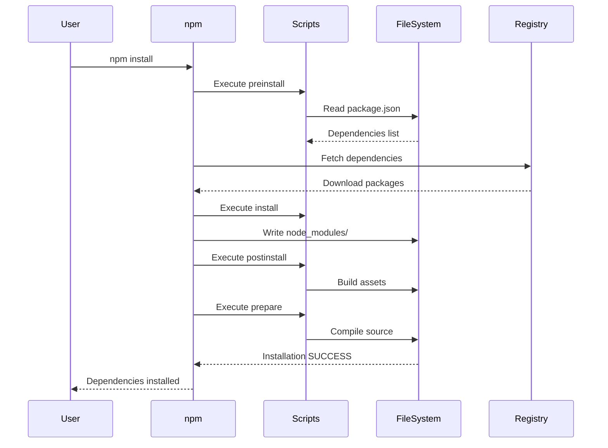
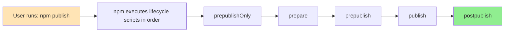

#shell #npm #dependency-manager #javascript #react #continuous-delivery #continuous-integration 
#site-realibility-engineering #software-engineering #angular #node #build-lifecycle #typescript
# Formal Definition
- npm is built around the concept of **lifecycle scripts**. Lifecycle scripts are <mark class="hltr-yellow">special hooks that run automatically</mark> at different points during package operations (install, publish, pack, etc.).
- npm has two types of scripts:
1. **Built-in lifecycle scripts** - automatically executed during specific npm operations (install, publish, pack)
2. **Custom scripts** - user-defined commands that can be run with `npm run <script-name>`
- Each lifecycle script can have **pre** and **post** hooks that run before and after the main script. For example, `preinstall` runs before `install`, and `postinstall` runs after `install`.
# npm Lifecycle Architecture

```mermaid title='npm lifecycle'
graph TB
    subgraph "Install Lifecycle"
        I1[preinstall]
        I2[install]
        I3[postinstall]
        I4[prepublish]
        I5[preprepare]
        I6[prepare]
        I7[postprepare]

        I1 --> I2 --> I3 --> I4 --> I5 --> I6 --> I7
    end

    subgraph "Publish Lifecycle"
        P1[prepublishOnly]
        P2[prepare]
        P3[prepublish]
        P4[publish]
        P5[postpublish]

        P1 --> P2 --> P3 --> P4 --> P5
    end

    subgraph "Pack Lifecycle"
        K1[prepack]
        K2[prepare]
        K3[postpack]

        K1 --> K2 --> K3
    end

    subgraph "Custom Script Lifecycle"
        C1[pre&lt;script&gt;]
        C2[&lt;script&gt;]
        C3[post&lt;script&gt;]

        C1 --> C2 --> C3
    end

    style I2 fill:#90EE90
    style I3 fill:#87CEEB
    style I6 fill:#FFD700
    style P1 fill:#FFA500
    style P4 fill:#FF6347
```



## Install Lifecycle Scripts
### 1. preinstall
#### Purpose
- Run before the package is installed.
#### Input
- `package.json` file.
- Existing `node_modules/` directory (if any).
#### Output
- Custom operations before installation (cleanup, validation, etc.).
```Shell title='preinstall script'
# Define in package.json
{
  "scripts": {
    "preinstall": "node check-node-version.js"
  }
}
```
### 2. install
#### Purpose
- Run after the package is installed.
#### Input
- Installed dependencies in `node_modules/`.
- `package.json` configuration.
#### Output
- Custom build operations (compile native addons, etc.).
```Shell title='install script'
{
  "scripts": {
    "install": "node-gyp rebuild"
  }
}
```
### 3. postinstall
#### Purpose
- Run after the package and its dependencies are installed.
#### Input
- Fully installed `node_modules/` directory.
- All dependencies available.
#### Output
- Post-installation tasks (build assets, patch dependencies, setup configuration).
- Console output from script execution.
```Shell title='postinstall script'
{
  "scripts": {
    "postinstall": "npm run build"
  }
}
```
### 4. prepare
#### Purpose
- Run before the package is packed or published, and on local `npm install` without arguments.
#### Input
- Source files.
- `package.json` configuration.
- Development dependencies.
#### Output
- Compiled/transpiled code.
- Built distribution files.
```Shell title='prepare script'
{
  "scripts": {
    "prepare": "npm run build"
  }
}
```

#### Usage
- Runs automatically during:
    - `npm install` (without arguments)
    - `npm publish`
    - `npm pack`
  - Git dependencies installation
## Publish Lifecycle Scripts
### 1. prepublishOnly
#### Purpose
- Run before the package is prepared and packed, only on `npm publish`.
#### Input
- Source code.
- `package.json` configuration.
#### Output
- Pre-publish validation.
- Test execution results.
```Shell title='prepublishOnly script'
{
  "scripts": {
    "prepublishOnly": "npm test && npm run lint"
  }
}
```
### 2. prepublish (Deprecated)
#### Purpose
- Run before the package is published (deprecated, use `prepublishOnly` or `prepare` instead).
#### Input
- Package source.
#### Output
- Legacy pre-publish operations.
```Shell title='prepublish script (deprecated)'
{
  "scripts": {
    "prepublish": "npm run build"
  }
}
```

**Note**: Deprecated since npm 4.0.0. Use `prepublishOnly` for publish-only tasks or `prepare` for both publish and install.
### 3. publish
#### Purpose
- Run during `npm publish` after `prepublishOnly` and `prepare` but before package is uploaded.
#### Input
- Packed package.
- `package.json` metadata.
#### Output
- Custom publish operations.
```Shell title='publish script'
{
  "scripts": {
    "publish": "echo Publishing to registry..."
  }
}
```
### 4. postpublish
#### Purpose
- Run after the package is published to the registry.
#### Input
- Published package information.
- Registry response.
#### Output
- Notifications, announcements, cleanup tasks.
```Shell title='postpublish script'
{
  "scripts": {
    "postpublish": "git push --tags && echo Published successfully!"
  }
}
```
## Pack Lifecycle Scripts
### 1. prepack
#### Purpose
- Run before a tarball is packed (during `npm pack`, `npm publish`, and installing git dependencies).
#### Input
- Source files.
- `package.json` configuration.
#### Output
- Prepared files for packing.
```Shell title='prepack script'
{
  "scripts": {
    "prepack": "npm run build"
  }
}
```
### 2. postpack
#### Purpose
- Run after the tarball has been generated and moved to its destination.
#### Input
- Generated tarball file.
#### Output
- Post-pack operations (cleanup, validation).
```Shell title='postpack script'
{
  "scripts": {
    "postpack": "rm -rf dist"
  }
}
```
## Custom Script Hooks
### Pre and Post Hooks
#### Purpose
- Run custom scripts before and after any user-defined script.
#### Input
- Context from main script.
#### Output
- Setup/teardown operations.
```Shell title='Custom script with hooks'
{
  "scripts": {
    "prebuild": "rm -rf dist",
    "build": "tsc",
    "postbuild": "cp -r public dist/",

    "pretest": "npm run lint",
    "test": "jest",
    "posttest": "npm run coverage",

    "prestart": "npm run build",
    "start": "node dist/index.js"
  }
}
```

#### Usage
```Shell title='Running custom scripts'
npm run build     # Executes: prebuild → build → postbuild
npm test          # Executes: pretest → test → posttest
npm start         # Executes: prestart → start → poststart (if defined)
```
## Common Built-in Commands
### 1. npm install
#### Purpose
- Install package dependencies defined in `package.json`.
#### Input
- `package.json` file.
- `package-lock.json` or `npm-shrinkwrap.json` (if exists).
#### Output
- Installed dependencies in `node_modules/`.
- Updated `package-lock.json`.
```Shell title='npm install'
npm install
npm install --production    # Install only production dependencies
npm install --save-dev      # Save as dev dependency
```

**Lifecycle executed**: preinstall → install → postinstall → prepublish → preprepare → prepare → postprepare
### 2. npm ci
#### Purpose
- Clean install of dependencies (faster, stricter than `npm install`).
#### Input
- `package.json` file.
- `package-lock.json` (required).
#### Output
- Fresh `node_modules/` directory.
- No changes to `package-lock.json`.
```Shell title='npm ci'
npm ci
```

**Lifecycle executed**: preinstall → install → postinstall → prepublish → preprepare → prepare → postprepare

**Key differences from npm install**:
- Deletes `node_modules/` before installing.
- Requires `package-lock.json`.
- Will fail if dependencies don't match lock file.
- Never writes to `package.json` or lock files.
### 3. npm test
#### Purpose
- Run the test script defined in `package.json`.
#### Input
- Test files.
- Test configuration.
#### Output
- Test results.
- Exit code (0 for success, non-zero for failure).
```Shell title='npm test'
npm test
npm t        # Shorthand
```

**Lifecycle executed**: pretest → test → posttest
### 4. npm start
#### Purpose
- Run the start script to launch the application.
#### Input
- Application source code.
- Configuration files.
#### Output
- Running application.
- Server logs.
```Shell title='npm start'
npm start
```

**Lifecycle executed**: prestart → start → poststart (if defined)
### 5. npm run` <script>`
#### Purpose
- Run arbitrary scripts defined in `package.json`.
#### Input
- Script name.
- Script arguments (optional).
#### Output
- Script execution results.
```Shell title='npm run script'
npm run build
npm run build -- --watch    # Pass arguments to script
npm run lint
```
### 6. npm publish
#### Purpose
- Publish package to npm registry.
#### Input
- Package source code.
- `package.json` metadata.
- `.npmignore` or `.gitignore` (to exclude files).
#### Output
- Published package on npm registry.
- Updated package version on registry.
```Shell title='npm publish'
npm publish
npm publish --tag beta      # Publish with tag
npm publish --access public # Publish scoped package as public
```
### 7. npm pack
#### Purpose
- Create a tarball from the package.
#### Input
- Package source code.
- `package.json` metadata.
#### Output
- Tarball file: `<name>-<version>.tgz`
```Shell title='npm pack'
npm pack
npm pack --dry-run    # Test without creating tarball
```
# Script Execution Flow

## Common Lifecycle Combinations

| Command            | Lifecycle Scripts Executed                       | Use Case              |
| ------------------ | ------------------------------------------------ | --------------------- |
| `npm install`      | preinstall → install → postinstall → prepare     | Install dependencies  |
| `npm ci`           | preinstall → install → postinstall → prepare     | Clean install (CI/CD) |
| `npm publish`      | prepublishOnly → prepare → publish → postpublish | Publish to registry   |
| `npm pack`         | prepack → prepare → postpack                     | Create tarball        |
| `npm test`         | pretest → test → posttest                        | Run tests             |
| `npm start`        | prestart → start → poststart                     | Start application     |
| `npm run build`    | prebuild → build → postbuild                     | Run build script      |
| `npm run <script>` | `pre<script> → <script> → post<script>`          | Run custom script     |
## Lifecycle Script Dependencies

- When a specific operation is executed, all lifecycle scripts for that operation are automatically executed in order.
- Pre hooks (`pre*`) always run before the main script.
- Post hooks (`post*`) always run after the main script.
## Script Environment Variables
- npm sets several environment variables during script execution:
### Process Environment
- `npm_lifecycle_event` - Name of the lifecycle event being executed (e.g., "install", "test").
- `npm_lifecycle_script` - The script being executed.
- `npm_package_name` - Package name from `package.json`.
- `npm_package_version` - Package version from `package.json`.
- `npm_package_<field>` - Any field from `package.json` (e.g., `npm_package_description`).
### Configuration
- `npm_config_<key>` - npm configuration values.
- `PATH` - Includes `node_modules/.bin` so local binaries are accessible.
#### Usage
```Shell title='Using environment variables'
{
  "scripts": {
    "env": "echo Running $npm_lifecycle_event for $npm_package_name@$npm_package_version"
  }
}
```
## Script Best Practices
### Use prepare for Build Steps
- The `prepare` script runs on both `npm install` and `npm publish`.
- Ideal for TypeScript compilation, asset bundling.
```Shell title='prepare for builds'
{
  "scripts": {
    "prepare": "tsc && npm run bundle"
  }
}
```
### Use prepublishOnly for Validation
- The `prepublishOnly` script only runs on `npm publish`.
- Ideal for running tests and linting before publishing.
```Shell title='prepublishOnly for validation'
{
  "scripts": {
    "prepublishOnly": "npm run lint && npm test"
  }
}
```
### Avoid Heavy postinstall Scripts
- The `postinstall` script runs for all users installing your package.
- Avoid long-running operations that slow down installation.
- Use `prepare` instead for build steps that should run for package consumers.
### Use Pre/Post Hooks for Setup/Teardown
- Pre hooks are ideal for cleanup and preparation.
- Post hooks are ideal for notifications and validation.
```Shell title='Pre/Post hooks pattern'
{
  "scripts": {
    "pretest": "npm run build",
    "test": "jest",
    "posttest": "npm run cleanup"
  }
}
```
### Make Scripts Cross-Platform
- Avoid shell-specific commands (use npm packages instead).
- Use `rimraf` instead of `rm -rf`.
- Use `cross-env` for environment variables.
```Shell title='Cross-platform scripts'
{
  "scripts": {
    "clean": "rimraf dist",
    "build": "cross-env NODE_ENV=production webpack"
  }
}
```
# Directory Structure Input/Output

```
project-root/
├── package.json               # INPUT: Project configuration
├── package-lock.json          # INPUT/OUTPUT: Dependency lock file
├── .npmignore                 # INPUT: Files to exclude from publish
├── src/                       # INPUT: Source code
│   ├── index.ts
│   └── lib/
├── test/                      # INPUT: Test files
│   └── *.test.js
├── node_modules/              # OUTPUT: Installed dependencies
│   ├── .bin/                  # OUTPUT: Executable binaries
│   └── <package-name>/        # OUTPUT: Installed packages
├── dist/                      # OUTPUT: Compiled/built code
│   ├── index.js
│   └── index.d.ts
├── coverage/                  # OUTPUT: Test coverage reports
└── <name>-<version>.tgz      # OUTPUT: Packed tarball (from npm pack)
```
## `package.json` Scripts
```json
{
  "name": "my-package",
  "version": "1.0.0",
  "scripts": {
    "preinstall": "node scripts/check-env.js",
    "postinstall": "npm run build",
    "prepare": "tsc",
    "prepublishOnly": "npm test",
    "pretest": "npm run lint",
    "test": "jest",
    "prestart": "npm run build",
    "start": "node dist/index.js",
    "prebuild": "rimraf dist",
    "build": "tsc",
    "postbuild": "cp -r assets dist/",
    "lint": "eslint src/**/*.ts",
    "dev": "nodemon src/index.ts"
  }
}
```
---
# References
1. https://docs.npmjs.com/cli/v10/using-npm/scripts - Official npm scripts documentation
2. https://docs.npmjs.com/cli/v10/configuring-npm/package-json#scripts - package.json scripts reference
3. https://github.com/npm/cli/blob/latest/docs/lib/content/using-npm/scripts.md - npm lifecycle scripts guide
