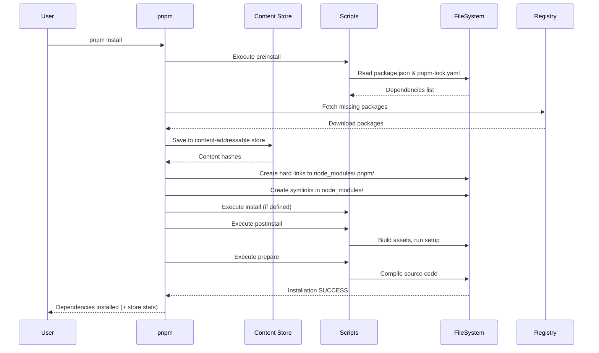
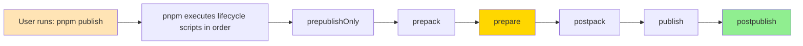

#shell #pnpm #dependency-manager #javascript #react #continuous-delivery #continuous-integration
#site-realibility-engineering #software-engineering #angular #nodejs #build-lifecycle #typescript #monorepo
# Formal Definition
- pnpm (Performant npm) is built around **lifecycle scripts** with <mark class="hltr-yellow">unique content-addressable storage</mark> and <mark class="hltr-yellow">hard link architecture</mark>.
- pnpm lifecycle scripts are <mark class="hltr-yellow">special hooks that run automatically</mark> at different points during package operations (install, publish, pack, etc.).
- pnpm's key differentiators:
  1. **Content-addressable store** - Single global store (`~/.pnpm-store`) with hard links to `node_modules`
  2. **Strict dependency resolution** - Non-flat `node_modules` structure prevents phantom dependencies
  3. **Native workspace support** - First-class monorepo support with filtering
  4. **Faster installation** - Parallel operations and efficient caching
- pnpm has two types of scripts:
  1. **Built-in lifecycle scripts** - automatically executed during specific pnpm operations (install, publish, pack)
  2. **Custom scripts** - user-defined commands that can be run with `pnpm run <script-name>` or `pnpm <script-name>`
- Each lifecycle script can have **pre** and **post** hooks that run before and after the main script.

# pnpm Lifecycle Architecture

```mermaid title='pnpm lifecycle'
graph TB
    subgraph "Install Lifecycle"
        I1[preinstall]
        I2[install]
        I3[postinstall]
        I4[prepare]
        I5[postprepare]

        I1 --> I2 --> I3 --> I4 --> I5
    end

    subgraph "Publish Lifecycle"
        P1[prepublishOnly]
        P2[prepack]
        P3[prepare]
        P4[postpack]
        P5[publish]
        P6[postpublish]

        P1 --> P2 --> P3 --> P4 --> P5 --> P6
    end

    subgraph "Pack Lifecycle"
        K1[prepack]
        K2[prepare]
        K3[postpack]

        K1 --> K2 --> K3
    end

    subgraph "Custom Script Lifecycle"
        C1[pre&lt;script&gt;]
        C2[&lt;script&gt;]
        C3[post&lt;script&gt;]

        C1 --> C2 --> C3
    end

    style I2 fill:#90EE90
    style I3 fill:#87CEEB
    style I4 fill:#FFD700
    style P1 fill:#FFA500
    style P5 fill:#FF6347
```



## Install Lifecycle Scripts

### 1. preinstall
#### Purpose
- Run before package dependencies are installed.
- Executed for the root package only (not for dependencies).

#### Input
- `package.json` file.
- Existing `node_modules/` directory (if any).
- `pnpm-lock.yaml` lockfile.

#### Output
- Custom pre-installation operations (environment checks, cleanup, version validation).

```json title='preinstall script - Node version check'
{
  "name": "my-api-server",
  "scripts": {
    "preinstall": "node -e \"if(process.version.slice(1,3)<18)throw new Error('Node 18+ required')\""
  }
}
```

#### Real-World Example: Enforce pnpm Usage
```json title='preinstall script - Enforce pnpm only'
{
  "scripts": {
    "preinstall": "npx only-allow pnpm"
  },
  "devDependencies": {
    "only-allow": "^1.1.1"
  }
}
```

**Output when using npm/yarn:**
```bash
$ npm install
npm ERR! This project uses pnpm. Please use pnpm install instead.
```

### 2. install
#### Purpose
- Run after the package is installed but before dependencies.
- Rarely used in modern projects (prefer `postinstall`).

#### Input
- Installed package in `node_modules/.pnpm/`.
- `package.json` configuration.

#### Output
- Custom installation operations (compile native modules).

```json title='install script - Native addon compilation'
{
  "name": "native-image-processor",
  "scripts": {
    "install": "node-gyp rebuild"
  }
}
```

### 3. postinstall
#### Purpose
- Run after the package and all its dependencies are installed.
- <mark class="hltr-yellow">Most commonly used lifecycle hook</mark> for setup tasks.

#### Input
- Fully installed `node_modules/` directory.
- All dependencies available in `.pnpm/` store structure.

#### Output
- Post-installation tasks (build assets, patch dependencies, generate code, setup configuration).

#### Real-World Example: Monorepo Build
```json title='postinstall script - Build all workspace packages'
{
  "name": "my-monorepo",
  "scripts": {
    "postinstall": "pnpm run -r build"
  }
}
```

**Execution flow:**
```bash
$ pnpm install
Packages: +342
Progress: resolved 342, reused 342, downloaded 0, added 342, done
Running postinstall script...
> my-monorepo@1.0.0 postinstall
> pnpm run -r build

Scope: all 8 workspace projects
packages/ui-components build$ tsc && vite build
packages/api-client build$ tsc
packages/utils build$ tsc
packages/core build$ tsc && rollup -c
Done in 12.3s
```

#### Real-World Example: Patch Dependencies
```json title='postinstall script - Apply dependency patches'
{
  "scripts": {
    "postinstall": "patch-package"
  },
  "devDependencies": {
    "patch-package": "^8.0.0"
  }
}
```

**Directory structure:**
```
project-root/
├── patches/
│   └── react-dom+18.2.0.patch    # Custom fix for React bug
└── package.json
```

**Output:**
```bash
$ pnpm install
...
Running postinstall script...
patch-package 8.0.0
Applying patches...
react-dom@18.2.0 ✔
```

### 4. prepare
#### Purpose
- Run before the package is packed or published, and on local `pnpm install` without arguments.
- <mark class="hltr-yellow">Ideal for TypeScript compilation and build steps</mark>.

#### Input
- Source files in `src/` directory.
- `package.json` configuration.
- Development dependencies.

#### Output
- Compiled/transpiled code in `dist/` or `lib/` directory.
- Built distribution files ready for consumption.

#### Real-World Example: TypeScript Library
```json title='prepare script - Build TypeScript library'
{
  "name": "@company/shared-types",
  "version": "2.1.0",
  "main": "dist/index.js",
  "types": "dist/index.d.ts",
  "scripts": {
    "prepare": "tsc"
  },
  "devDependencies": {
    "typescript": "^5.3.3"
  }
}
```

**tsconfig.json:**
```json title='TypeScript configuration'
{
  "compilerOptions": {
    "outDir": "dist",
    "declaration": true,
    "declarationMap": true,
    "sourceMap": true
  },
  "include": ["src/**/*"]
}
```

**Execution:**
```bash
$ pnpm install
...
Running prepare script...
> @company/shared-types@2.1.0 prepare
> tsc

src/index.ts → dist/index.js
src/types/user.ts → dist/types/user.js
Generated 24 declaration files
```

#### Usage Scenarios
- Runs automatically during:
  - `pnpm install` (in package root, no arguments)
  - `pnpm publish`
  - Git dependencies installation
  - `pnpm link` (local linking)

## Publish Lifecycle Scripts

### 1. prepublishOnly
#### Purpose
- Run before the package is prepared and packed, only on `pnpm publish`.
- <mark class="hltr-yellow">Safety gate for publishing</mark> - run tests and validation.

#### Input
- Source code.
- `package.json` configuration.
- Test suite.

#### Output
- Pre-publish validation results.
- Test execution status.
- Lint results.

#### Real-World Example: Complete Pre-Publish Checks
```json title='prepublishOnly script - Full validation'
{
  "name": "@company/api-client",
  "version": "3.2.1",
  "scripts": {
    "prepublishOnly": "pnpm run verify",
    "verify": "pnpm run lint && pnpm run test && pnpm run build && pnpm run check-exports",
    "lint": "eslint src --ext .ts",
    "test": "vitest run",
    "build": "tsup",
    "check-exports": "node scripts/verify-exports.js"
  }
}
```

**Publish flow:**
```bash
$ pnpm publish

> @company/api-client@3.2.1 prepublishOnly
> pnpm run verify

> @company/api-client@3.2.1 lint
> eslint src --ext .ts
✔ No linting errors

> @company/api-client@3.2.1 test
> vitest run
✔ 247 tests passed (12.4s)

> @company/api-client@3.2.1 build
> tsup
Build complete: dist/index.js (42.3 KB)

> @company/api-client@3.2.1 check-exports
> node scripts/verify-exports.js
✔ All exports verified

Publishing to npm registry...
+ @company/api-client@3.2.1
```

**Failure scenario:**
```bash
$ pnpm publish

> @company/api-client@3.2.2 prepublishOnly
> pnpm run verify

> test
✖ 2 tests failed
  - ApiClient.fetchUser should handle 404
  - ApiClient.fetchPosts should retry on network error

ERROR: Tests failed. Fix errors before publishing.
```

### 2. prepack
#### Purpose
- Run before a tarball is packed (during `pnpm pack` and `pnpm publish`).
- Final build step before packaging.

#### Input
- Source files.
- `package.json` metadata.
- Build configuration.

#### Output
- Prepared files for packing.
- Cleaned distribution directory.

```json title='prepack script - Clean and build'
{
  "scripts": {
    "prepack": "pnpm run clean && pnpm run build",
    "clean": "rimraf dist",
    "build": "tsup src/index.ts --format cjs,esm --dts"
  }
}
```

### 3. postpack
#### Purpose
- Run after the tarball has been generated.
- Cleanup temporary files created during packing.

#### Input
- Generated tarball file.
- Temporary build artifacts.

#### Output
- Cleanup status.
- Post-pack notifications.

```json title='postpack script - Cleanup temp files'
{
  "scripts": {
    "postpack": "rimraf dist"
  }
}
```

**Usage scenario:**
```bash
$ pnpm pack

> prepack
Cleaning dist...
Building package...

Created tarball: company-api-client-3.2.1.tgz (43.2 KB)

> postpack
Removing dist directory...
```

### 4. publish
#### Purpose
- Run during `pnpm publish` after packing but before uploading to registry.

#### Input
- Packed tarball.
- Registry configuration from `.npmrc`.

#### Output
- Custom publish operations (notifications, registry updates).

```json title='publish script'
{
  "scripts": {
    "publish": "echo Publishing to private registry..."
  }
}
```

### 5. postpublish
#### Purpose
- Run after the package is successfully published to the registry.
- <mark class="hltr-yellow">Automation and notifications</mark>.

#### Input
- Published package information.
- Registry response.

#### Output
- Git tags, Slack notifications, changelog updates.

#### Real-World Example: Complete Post-Publish Workflow
```json title='postpublish script - Complete workflow'
{
  "scripts": {
    "postpublish": "pnpm run tag-release && pnpm run notify-team && pnpm run update-docs",
    "tag-release": "git tag v$npm_package_version && git push --tags",
    "notify-team": "node scripts/slack-notify.js",
    "update-docs": "curl -X POST https://docs.company.com/api/rebuild"
  }
}
```

**scripts/slack-notify.js:**
```javascript title='Slack notification script'
const { IncomingWebhook } = require('@slack/webhook');

const webhook = new IncomingWebhook(process.env.SLACK_WEBHOOK_URL);

const packageName = process.env.npm_package_name;
const version = process.env.npm_package_version;

webhook.send({
  text: `📦 New release: ${packageName}@${version}`,
  blocks: [
    {
      type: 'section',
      text: {
        type: 'mrkdwn',
        text: `*${packageName}* version *${version}* has been published to npm!`
      }
    },
    {
      type: 'section',
      fields: [
        { type: 'mrkdwn', text: `*Registry:*\nnpm` },
        { type: 'mrkdwn', text: `*Time:*\n${new Date().toISOString()}` }
      ]
    }
  ]
});
```

**Output:**
```bash
$ pnpm publish

Publishing...
+ @company/api-client@3.2.1

> postpublish
> pnpm run tag-release && pnpm run notify-team && pnpm run update-docs

> tag-release
Created git tag: v3.2.1
Pushed tags to origin

> notify-team
Sent Slack notification to #releases

> update-docs
Documentation rebuild triggered
```

## Custom Script Hooks

### Pre and Post Hooks
#### Purpose
- Run custom scripts before and after any user-defined script.
- Automatic hook detection for `pre*` and `post*` patterns.

#### Input
- Context from main script.
- Environment variables.

#### Output
- Setup/teardown operations.

#### Real-World Example: Build Pipeline
```json title='Custom script with hooks - Complete build pipeline'
{
  "name": "web-dashboard",
  "scripts": {
    "prebuild": "pnpm run clean && pnpm run generate-types",
    "build": "vite build",
    "postbuild": "pnpm run analyze-bundle && pnpm run generate-sitemap",

    "pretest": "pnpm run build",
    "test": "vitest run",
    "posttest": "pnpm run coverage-report",

    "prestart": "pnpm run check-env",
    "start": "node server.js",
    "poststart": "echo Server running on http://localhost:3000",

    "clean": "rimraf dist coverage .vite",
    "generate-types": "graphql-codegen",
    "analyze-bundle": "vite-bundle-visualizer",
    "generate-sitemap": "node scripts/sitemap-generator.js",
    "coverage-report": "vitest run --coverage",
    "check-env": "node scripts/check-env-vars.js"
  }
}
```

**Execution:**
```bash
$ pnpm build

> prebuild
> pnpm run clean && pnpm run generate-types

> clean
Removed dist, coverage, .vite

> generate-types
Generated 24 TypeScript types from GraphQL schema

> build
> vite build
vite v5.0.10 building for production...
✓ 247 modules transformed
dist/index.html          0.45 kB │ gzip: 0.29 kB
dist/assets/index.js    186.32 kB │ gzip: 62.41 kB
✓ built in 3.21s

> postbuild
> pnpm run analyze-bundle && pnpm run generate-sitemap

> analyze-bundle
Bundle analysis saved to dist/stats.html
Total size: 186.32 kB
  - React: 42.3 kB
  - Chart.js: 89.1 kB
  - Application code: 54.92 kB

> generate-sitemap
Generated sitemap.xml with 47 pages
```

#### Usage
```bash title='Running custom scripts with hooks'
pnpm build     # Executes: prebuild → build → postbuild
pnpm test      # Executes: pretest → test → posttest
pnpm start     # Executes: prestart → start → poststart
```

## Common pnpm Commands

### 1. pnpm install
#### Purpose
- Install all dependencies defined in `package.json`.
- Creates hard links from global store to `node_modules/.pnpm/`.

#### Input
- `package.json` file.
- `pnpm-lock.yaml` lockfile.
- Global content-addressable store (`~/.pnpm-store/`).

#### Output
- Installed dependencies in `node_modules/.pnpm/` (non-flat structure).
- Symlinks in `node_modules/` for direct dependencies.
- Updated `pnpm-lock.yaml` if needed.

```bash title='pnpm install variants'
pnpm install
pnpm i                          # Shorthand

pnpm install --frozen-lockfile  # CI mode: fail if lock file needs update
pnpm install --prod             # Install only production dependencies
pnpm install --offline          # Use only cached packages
pnpm install --prefer-offline   # Prefer cache, fetch if missing
```

**Lifecycle executed**: preinstall → install → postinstall → prepare

#### Real-World Output:
```bash
$ pnpm install

Lockfile is up to date, resolution step is skipped
Already up to date
Progress: resolved 1, reused 0, downloaded 0, added 0
Packages: +847
++++++++++++++++++++++++++++++++++++++++++++++++++
Progress: resolved 847, reused 847, downloaded 0, added 847, done

dependencies:
+ express 4.18.2
+ react 18.2.0
+ react-dom 18.2.0

devDependencies:
+ typescript 5.3.3
+ vite 5.0.10
+ vitest 1.1.0

Done in 4.2s
```

#### pnpm Store Structure:
```bash
$ pnpm store path
/home/user/.pnpm-store/v3

$ pnpm store status
Store path: /home/user/.pnpm-store/v3
Store size: 3.2 GB
Packages: 2,847
```

### 2. pnpm add
#### Purpose
- Add a new dependency to the project.
- Downloads to global store and hard links to project.

#### Input
- Package name and version.
- `package.json` and `pnpm-lock.yaml`.

#### Output
- Updated `package.json`.
- Updated `pnpm-lock.yaml`.
- Installed package hard-linked from store.

```bash title='pnpm add variants'
pnpm add react                    # Add to dependencies
pnpm add -D typescript            # Add to devDependencies
pnpm add -O prettier              # Add to optionalDependencies
pnpm add --save-peer react        # Add to peerDependencies
pnpm add react@18.2.0             # Specific version
pnpm add react@^18.0.0            # Version range
pnpm add lodash@npm:lodash-es     # Alias package
pnpm add -g pnpm                  # Global installation
```

**Real-World Example:**
```bash
$ pnpm add -D @types/node

Packages: +1
+
Progress: resolved 1, reused 0, downloaded 1, added 1, done

devDependencies:
+ @types/node 20.10.6

Done in 1.8s
```

**Lifecycle executed**: Runs install lifecycle for the newly added package.

### 3. pnpm remove
#### Purpose
- Remove a dependency from the project.
- Removes hard links and updates lockfile.

#### Input
- Package name.
- `package.json` and `pnpm-lock.yaml`.

#### Output
- Updated `package.json`.
- Updated `pnpm-lock.yaml`.
- Removed package files and symlinks.

```bash title='pnpm remove'
pnpm remove lodash
pnpm rm typescript eslint         # Remove multiple packages
pnpm remove -g pnpm               # Uninstall global package
```

### 4. pnpm test
#### Purpose
- Run the test script defined in `package.json`.

#### Input
- Test files and configuration.
- `package.json` scripts.

#### Output
- Test results and exit code.

```bash title='pnpm test'
pnpm test
pnpm t                            # Shorthand
pnpm test -- --coverage           # Pass arguments to test command
pnpm test --reporter=verbose      # pnpm flag
```

**Lifecycle executed**: pretest → test → posttest

**Real-World Example with Vitest:**
```bash
$ pnpm test

> pretest
> pnpm run build

Build complete

> test
> vitest run

 ✓ src/utils/date.test.ts (12)
 ✓ src/components/Button.test.tsx (8)
 ✓ src/api/client.test.ts (24)
 ✓ src/hooks/useAuth.test.ts (15)

Test Files  4 passed (4)
     Tests  59 passed (59)
  Start at  10:23:45
  Duration  2.34s

> posttest
> pnpm run coverage-report

Coverage report generated: coverage/index.html
Lines: 87.3% | Branches: 82.1% | Functions: 91.2%
```

### 5. pnpm run
#### Purpose
- Run arbitrary scripts defined in `package.json`.
- pnpm allows omitting `run` for custom scripts (like yarn).

#### Input
- Script name.
- Script arguments (optional).

#### Output
- Script execution results.

```bash title='pnpm run script'
pnpm run build
pnpm build                        # Shorthand (run is optional)
pnpm build -- --mode production   # Pass arguments
pnpm run lint
pnpm lint                         # Shorthand
pnpm run dev -- --port 3001       # Pass arguments
```

**Lifecycle executed**: `pre<script>` → `<script>` → `post<script>`

### 6. pnpm publish
#### Purpose
- Publish package to npm registry.

#### Input
- Package source code.
- `package.json` metadata.
- `.npmignore` or `files` field in `package.json`.

#### Output
- Published package on npm registry.
- Updated version on registry.

```bash title='pnpm publish'
pnpm publish
pnpm publish --tag beta           # Publish with tag
pnpm publish --access public      # Publish scoped package as public
pnpm publish --no-git-checks      # Skip git checks
pnpm publish --dry-run            # Test without publishing
```

**Lifecycle executed**: prepublishOnly → prepack → prepare → postpack → publish → postpublish

### 7. pnpm pack
#### Purpose
- Create a tarball from the package.

#### Input
- Package source code.
- `package.json` metadata.

#### Output
- Tarball file: `<name>-<version>.tgz`

```bash title='pnpm pack'
pnpm pack
pnpm pack --pack-destination ~/packages  # Custom output directory
```

**Lifecycle executed**: prepack → prepare → postpack

**Real-World Output:**
```bash
$ pnpm pack

> prepack
> pnpm run clean && pnpm run build

Cleaning...
Building...

company-api-client-3.2.1.tgz
Size: 43.2 KB
Unpacked size: 186.7 KB

Contents:
- package.json
- README.md
- LICENSE
- dist/
  - index.js
  - index.d.ts
  - types/

> postpack
Cleanup complete
```

### 8. pnpm install --filter
#### Purpose
- Install dependencies for specific workspace packages.
- <mark class="hltr-yellow">Powerful monorepo filtering</mark>.

#### Input
- Filter pattern.
- Workspace configuration.

#### Output
- Installed dependencies for matching packages.

```bash title='pnpm install with filters'
pnpm install --filter @company/api-client    # Specific package
pnpm install --filter "@company/*"           # All packages in scope
pnpm install --filter "...@company/web-app"  # Package and dependencies
pnpm install --filter "@company/api-client^" # Dependents only
pnpm install --filter "./packages/**"        # Glob pattern
```

#### Real-World Monorepo Example:
```bash
$ pnpm install --filter "@company/web-app"

Scope: 1 of 8 workspace projects
Packages: +247
Progress: resolved 247, reused 247, downloaded 0, added 247

@company/web-app dependencies:
+ @company/ui-components link:../../packages/ui-components
+ @company/api-client link:../../packages/api-client
+ react 18.2.0
+ vite 5.0.10

Done in 3.1s
```

### 9. pnpm run --filter
#### Purpose
- Run scripts in specific workspace packages.
- <mark class="hltr-yellow">Essential for monorepo task orchestration</mark>.

#### Input
- Script name.
- Filter pattern.

#### Output
- Script execution results for matching packages.

```bash title='pnpm run with filters'
pnpm run --filter @company/api build              # Single package
pnpm run --filter "@company/*" build              # All @company packages
pnpm run -r build                                 # All workspace packages (recursive)
pnpm run --filter "...@company/web-app" test      # Package + dependencies
pnpm run --filter "@company/api-client^" test     # Dependents only
pnpm run --filter "./packages/core" build         # By path
pnpm run --parallel --filter "@company/*" build   # Parallel execution
```

#### Real-World Monorepo Build:
```bash
$ pnpm run -r --parallel build

Scope: all 8 workspace projects
Running "build" in parallel...

@company/utils build$ tsc
@company/types build$ tsc
@company/core build$ tsc && rollup -c
@company/api-client build$ tsup
@company/ui-components build$ vite build
@company/admin-dashboard build$ next build
@company/web-app build$ vite build
@company/mobile-app build$ expo build

All builds completed in 18.3s
```

#### Dependency-Aware Build:
```bash
$ pnpm run --filter "...@company/web-app" build

Scope: 4 workspace projects (dependency order)

@company/types build$ tsc
@company/utils build$ tsc
@company/api-client build$ tsup
@company/web-app build$ vite build

Done in 12.1s
```

### 10. pnpm exec
#### Purpose
- Execute a binary from `node_modules/.bin/`.
- Alternative to npx with better performance.

#### Input
- Binary name.
- Arguments.

#### Output
- Command execution results.

```bash title='pnpm exec'
pnpm exec tsc
pnpm exec eslint src/
pnpm exec vitest run
```

### 11. pnpm dlx
#### Purpose
- Download and execute a package (like npx).
- Temporary execution without installation.

#### Input
- Package name.
- Arguments.

#### Output
- Command execution results.

```bash title='pnpm dlx - Execute without installing'
pnpm dlx create-react-app my-app
pnpm dlx prettier --write .
pnpm dlx @antfu/ni               # Use ni package manager aliasing
```

**Real-World Example:**
```bash
$ pnpm dlx create-vite my-project --template react-ts

Downloading create-vite...
✔ Select a framework: › React
✔ Select a variant: › TypeScript

Scaffolding project in /home/user/my-project...

Done. Now run:
  cd my-project
  pnpm install
  pnpm dev
```

### 12. pnpm update
#### Purpose
- Update dependencies to their latest versions (within ranges).

#### Input
- `package.json` version ranges.
- `pnpm-lock.yaml`.

#### Output
- Updated `pnpm-lock.yaml`.
- Updated packages in `node_modules/`.

```bash title='pnpm update'
pnpm update                       # Update all dependencies
pnpm up                           # Shorthand
pnpm update react react-dom       # Update specific packages
pnpm update -r                    # Update all workspace packages
pnpm update --latest              # Update to latest (ignore ranges)
pnpm update -i                    # Interactive update
```

**Real-World Interactive Update:**
```bash
$ pnpm update -i

? Select packages to update:
  ◯ react 18.2.0 → 18.3.1
  ◉ typescript 5.2.2 → 5.3.3
  ◉ vite 5.0.5 → 5.0.10
  ◯ vitest 1.0.4 → 1.2.0

Press <space> to select, <a> to toggle all, <i> to invert selection
```

## Script Execution Flow



## pnpm Store Architecture

```mermaid
graph TB
    subgraph "Global Store ~/.pnpm-store/"
        S1[react@18.2.0]
        S2[express@4.18.2]
        S3[lodash@4.17.21]
    end

    subgraph "Project A - node_modules/"
        PA1[react → symlink]
        PA2[express → symlink]

        subgraph ".pnpm/"
            PA_PNPM1[react@18.2.0 hard link]
            PA_PNPM2[express@4.18.2 hard link]
        end

        PA1 -.-> PA_PNPM1
        PA2 -.-> PA_PNPM2
    end

    subgraph "Project B - node_modules/"
        PB1[react → symlink]
        PB2[lodash → symlink]

        subgraph ".pnpm/"
            PB_PNPM1[react@18.2.0 hard link]
            PB_PNPM2[lodash@4.17.21 hard link]
        end

        PB1 -.-> PB_PNPM1
        PB2 -.-> PB_PNPM2
    end

    S1 -.hard link.-> PA_PNPM1
    S2 -.hard link.-> PA_PNPM2
    S1 -.hard link.-> PB_PNPM1
    S3 -.hard link.-> PB_PNPM2

    style S1 fill:#90EE90
    style S2 fill:#87CEEB
    style S3 fill:#FFD700
```

**Key Benefits:**
1. **Disk Space Efficiency**: Same package version shared across all projects (hard links)
2. **Faster Installation**: Packages already in store don't need downloading
3. **Strict Dependencies**: Non-flat structure prevents phantom dependencies

## Common Lifecycle Combinations

| Command                           | Lifecycle Scripts Executed                    | Use Case                        |
| --------------------------------- | --------------------------------------------- | ------------------------------- |
| `pnpm install`                    | preinstall → install → postinstall → prepare  | Install dependencies            |
| `pnpm install --frozen-lockfile`  | preinstall → install → postinstall → prepare  | CI/CD installation              |
| `pnpm add <package>`              | Install lifecycle for new package             | Add new dependency              |
| `pnpm publish`                    | prepublishOnly → prepack → prepare → publish  | Publish to registry             |
| `pnpm pack`                       | prepack → prepare → postpack                  | Create tarball                  |
| `pnpm test`                       | pretest → test → posttest                     | Run tests                       |
| `pnpm build`                      | prebuild → build → postbuild                  | Run build script                |
| `pnpm run <script>`               | `pre<script> → <script> → post<script>`       | Run custom script               |
| `pnpm run -r build`               | Run build lifecycle in all workspaces         | Build monorepo                  |
| `pnpm run --filter "..." build`   | Run build lifecycle for filtered packages     | Filtered workspace build        |

## Lifecycle Script Dependencies



- When a specific operation is executed, all lifecycle scripts for that operation are automatically executed in order.
- Pre hooks (`pre*`) always run before the main script.
- Post hooks (`post*`) always run after the main script.
- Failed lifecycle script will halt the operation and return non-zero exit code.

## Script Environment Variables

pnpm sets several environment variables during script execution:

### Process Environment
- `npm_lifecycle_event` - Name of the lifecycle event being executed (e.g., "install", "test")
- `npm_lifecycle_script` - The script being executed
- `npm_package_name` - Package name from `package.json`
- `npm_package_version` - Package version from `package.json`
- `npm_package_<field>` - Any field from `package.json` (nested fields use underscores)

### pnpm-Specific Variables
- `PNPM_HOME` - pnpm home directory
- `PNPM_SCRIPT_SRC_DIR` - Directory where the script is defined (useful in workspaces)
- `npm_config_user_agent` - Contains "pnpm" identifier

### Configuration
- `npm_config_<key>` - pnpm configuration values
- `PATH` - Includes `node_modules/.bin` so local binaries are accessible

#### Real-World Usage Example:
```json title='Using environment variables'
{
  "name": "@company/api-client",
  "version": "3.2.1",
  "scripts": {
    "env-info": "node -e \"console.log('Building', process.env.npm_package_name, process.env.npm_package_version)\"",
    "build": "node scripts/build.js"
  }
}
```

**scripts/build.js:**
```javascript title='Build script using environment variables'
const packageName = process.env.npm_package_name;
const version = process.env.npm_package_version;
const lifecycle = process.env.npm_lifecycle_event;
const author = process.env.npm_package_author_name;

console.log(`[${lifecycle}] Building ${packageName}@${version}`);
console.log(`Author: ${author}`);
console.log(`Repository: ${process.env.npm_package_repository_url}`);

// Build logic here...
```

**Output:**
```bash
$ pnpm run env-info
Building @company/api-client 3.2.1

$ pnpm build
[build] Building @company/api-client@3.2.1
Author: Engineering Team
Repository: https://github.com/company/api-client
```

## Workspace Features

### Workspace Configuration
```json title='package.json - Workspace root'
{
  "name": "my-monorepo",
  "version": "1.0.0",
  "private": true,
  "scripts": {
    "build": "pnpm run -r build",
    "test": "pnpm run -r test",
    "dev": "pnpm run --parallel -r dev",
    "lint": "pnpm run -r lint"
  }
}
```

```yaml title='pnpm-workspace.yaml'
packages:
  - 'packages/*'
  - 'apps/*'
  - 'tools/*'
  - '!**/test/**'
```

### Workspace Protocol
```json title='package.json - Workspace dependency'
{
  "name": "@company/web-app",
  "dependencies": {
    "@company/ui-components": "workspace:*",
    "@company/api-client": "workspace:^",
    "react": "^18.2.0"
  }
}
```

**Workspace protocol variants:**
- `workspace:*` - Link to any version in workspace
- `workspace:^` - Link to compatible version (semver)
- `workspace:~` - Link to patch-compatible version

### Real-World Monorepo Structure
```
company-monorepo/
├── package.json
├── pnpm-workspace.yaml
├── pnpm-lock.yaml
├── packages/
│   ├── ui-components/
│   │   ├── package.json
│   │   ├── src/
│   │   └── dist/
│   ├── api-client/
│   │   ├── package.json
│   │   ├── src/
│   │   └── dist/
│   └── utils/
│       ├── package.json
│       ├── src/
│       └── dist/
├── apps/
│   ├── web-app/
│   │   ├── package.json
│   │   ├── src/
│   │   └── dist/
│   └── admin-dashboard/
│       ├── package.json
│       ├── src/
│       └── dist/
└── node_modules/
    ├── .pnpm/
    └── [symlinks to dependencies]
```

### Workspace Scripts with Dependencies
```json title='Root package.json - Orchestration scripts'
{
  "scripts": {
    "build": "pnpm run --filter \"./packages/**\" build && pnpm run --filter \"./apps/**\" build",
    "build:deps": "pnpm run --filter \"...@company/web-app\" build",
    "test:all": "pnpm run -r test",
    "test:changed": "pnpm run --filter \"...[HEAD^1]\" test",
    "dev:web": "pnpm run --filter @company/web-app dev",
    "clean": "pnpm run -r clean && rm -rf node_modules"
  }
}
```

**Advanced filtering examples:**
```bash
# Build only changed packages since last commit
pnpm run --filter "...[HEAD^1]" build

# Build specific package and its dependencies
pnpm run --filter "...@company/web-app" build

# Build only dependents of a package
pnpm run --filter "@company/api-client^..." build

# Build packages in specific directory
pnpm run --filter "./packages/**" build

# Parallel execution of all workspace packages
pnpm run --parallel -r build

# Test only packages that depend on changed packages
pnpm run --filter "...[origin/main]" test
```

## Script Best Practices

### 1. Use prepare for Build Steps
The `prepare` script runs on both install and publish - ideal for compilation.

```json title='prepare for TypeScript builds'
{
  "name": "@company/shared-lib",
  "main": "dist/index.js",
  "types": "dist/index.d.ts",
  "scripts": {
    "prepare": "pnpm run build",
    "build": "tsc"
  },
  "files": ["dist"]
}
```

**Why this works:**
- Library consumers get compiled code after `pnpm add @company/shared-lib`
- Publishers always publish latest build
- Git dependencies work correctly

### 2. Use prepublishOnly for Validation
The `prepublishOnly` script only runs on `pnpm publish` - perfect for safety checks.

```json title='prepublishOnly for validation gates'
{
  "scripts": {
    "prepublishOnly": "pnpm run verify",
    "verify": "pnpm run lint && pnpm run test && pnpm run build && pnpm run check-types",
    "lint": "eslint src --ext .ts --max-warnings 0",
    "test": "vitest run --coverage --coverage.threshold.lines=80",
    "build": "tsup",
    "check-types": "tsc --noEmit"
  }
}
```

**Safety gates enforced:**
- ✅ Linting with zero warnings
- ✅ Tests passing with 80%+ coverage
- ✅ Successful build
- ✅ TypeScript type checking

### 3. Avoid Heavy postinstall Scripts
The `postinstall` script runs for **all users** installing your package - keep it fast.

```json title='Good vs Bad postinstall'
{
  "scripts": {
    // ✅ GOOD: Fast, necessary operations
    "postinstall": "patch-package",

    // ❌ BAD: Slow, heavy operations
    // "postinstall": "pnpm run build && pnpm run test"
  }
}
```

**Alternative: Move builds to prepare**
```json title='Use prepare instead of postinstall for builds'
{
  "scripts": {
    "prepare": "pnpm run build",
    "postinstall": "echo Installation complete"
  }
}
```

### 4. Use Pre/Post Hooks for Setup/Teardown
Pre hooks clean and prepare; post hooks verify and notify.

```json title='Pre/Post hooks pattern'
{
  "scripts": {
    "prebuild": "rimraf dist && pnpm run generate-types",
    "build": "tsup",
    "postbuild": "pnpm run verify-exports && pnpm run copy-assets",

    "pretest": "pnpm run build",
    "test": "vitest run",
    "posttest": "pnpm run check-coverage",

    "predeploy": "pnpm run build && pnpm run test",
    "deploy": "node scripts/deploy.js",
    "postdeploy": "pnpm run notify-team",

    "generate-types": "graphql-codegen",
    "verify-exports": "node scripts/check-exports.js",
    "copy-assets": "cpy src/assets dist/assets",
    "check-coverage": "vitest run --coverage",
    "notify-team": "node scripts/slack-notify.js"
  }
}
```

### 5. Make Scripts Cross-Platform
Avoid shell-specific commands - use cross-platform npm packages.

```json title='Cross-platform scripts'
{
  "scripts": {
    "clean": "rimraf dist coverage",                           // ✅ Instead of rm -rf
    "build": "cross-env NODE_ENV=production vite build",       // ✅ Cross-platform env vars
    "copy": "cpy src/assets dist/assets",                      // ✅ Instead of cp -r
    "mkdir": "mkdirp dist/assets",                             // ✅ Instead of mkdir -p
    "watch": "concurrently \"tsc -w\" \"vite build --watch\""  // ✅ Parallel commands
  },
  "devDependencies": {
    "rimraf": "^5.0.5",
    "cross-env": "^7.0.3",
    "cpy-cli": "^5.0.0",
    "mkdirp": "^3.0.1",
    "concurrently": "^8.2.2"
  }
}
```

### 6. Use Workspace Scripts for Orchestration
Organize monorepo tasks efficiently with pnpm filters.

```json title='Workspace script organization'
{
  "name": "my-monorepo",
  "private": true,
  "scripts": {
    "build": "pnpm run --filter \"./packages/**\" build && pnpm run --filter \"./apps/**\" build",
    "build:parallel": "pnpm run --parallel -r build",
    "test": "pnpm run -r test",
    "test:changed": "pnpm run --filter \"...[HEAD^1]\" test",
    "lint": "pnpm run -r lint",
    "clean": "pnpm run -r clean && rimraf node_modules",
    "dev:web": "pnpm run --filter @company/web-app dev",
    "dev:admin": "pnpm run --filter @company/admin-dashboard dev"
  }
}
```

### 7. Enforce pnpm Usage
Prevent accidental npm/yarn usage in pnpm projects.

```json title='Enforce pnpm only'
{
  "scripts": {
    "preinstall": "npx only-allow pnpm"
  },
  "engines": {
    "node": ">=18.0.0",
    "pnpm": ">=8.0.0"
  }
}
```

**Alternative: .npmrc configuration**
```ini title='.npmrc'
engine-strict=true
```

### 8. Use --frozen-lockfile in CI/CD
Ensure consistent installations in CI/CD pipelines.

```yaml title='.github/workflows/ci.yml'
name: CI
on: [push, pull_request]

jobs:
  test:
    runs-on: ubuntu-latest
    steps:
      - uses: actions/checkout@v4

      - uses: pnpm/action-setup@v2
        with:
          version: 8

      - uses: actions/setup-node@v4
        with:
          node-version: 20
          cache: 'pnpm'

      - name: Install dependencies
        run: pnpm install --frozen-lockfile

      - name: Run tests
        run: pnpm test

      - name: Build
        run: pnpm build
```

### 9. Optimize Store Management
Manage pnpm's global store for disk space efficiency.

```bash title='Store management commands'
# Check store status
pnpm store status

# Prune unreferenced packages
pnpm store prune

# Add to CI/CD for cache cleanup
pnpm store prune --force
```

```json title='CI/CD store optimization'
{
  "scripts": {
    "ci:install": "pnpm install --frozen-lockfile && pnpm store prune"
  }
}
```

### 10. Use Lifecycle Logging
Debug lifecycle execution with verbose logging.

```bash title='Debug lifecycle scripts'
pnpm install --loglevel=debug           # Detailed logs
pnpm run build --reporter=append-only   # Sequential output
```

```json title='Add logging to scripts'
{
  "scripts": {
    "prebuild": "echo [prebuild] Cleaning and preparing...",
    "build": "echo [build] Building application... && vite build",
    "postbuild": "echo [postbuild] Build complete!"
  }
}
```

## pnpm vs npm/yarn Differences

| Feature                      | pnpm                           | npm                    | yarn                      |
| ---------------------------- | ------------------------------ | ---------------------- | ------------------------- |
| **Storage**                  | Content-addressable store      | Flat node_modules      | Hoisted node_modules      |
| **Disk Space**               | Hard links (efficient)         | Full copies (wasteful) | Deduplicated (moderate)   |
| **node_modules Structure**   | Non-flat (.pnpm/)              | Flat                   | Hoisted (flat)            |
| **Phantom Dependencies**     | ❌ Prevented                    | ✅ Allowed              | ✅ Allowed                 |
| **Installation Speed**       | ⚡ Fastest                      | Slow                   | Fast                      |
| **Lockfile**                 | pnpm-lock.yaml                 | package-lock.json      | yarn.lock                 |
| **Workspace Support**        | ✅ First-class (filters)        | ✅ Limited              | ✅ Good                    |
| **Monorepo Filtering**       | ✅ Advanced                     | ❌ None                 | ⚠️ Basic                  |
| **Lifecycle Scripts**        | Same as npm                    | Standard               | Same as npm               |
| **Global Store**             | ~/.pnpm-store                  | No store               | ~/.yarn/berry/cache       |
| **Strict Mode**              | ✅ Default                      | ❌ Optional             | ❌ Optional                |

### Real Disk Space Comparison
```bash
# Same project installed with different package managers
npm install     # node_modules: 350 MB
yarn install    # node_modules: 280 MB
pnpm install    # node_modules: 120 MB (hard links to store)

# Multiple projects with pnpm share the store
# Store size: 500 MB for 10 projects (instead of 3.5 GB with npm)
```

# Directory Structure Input/Output

## Single Project Structure

```
project-root/
├── package.json               # INPUT: Project configuration
├── pnpm-lock.yaml             # INPUT/OUTPUT: Dependency lockfile (not package-lock.json)
├── .npmrc                     # INPUT: pnpm configuration
├── .npmignore                 # INPUT: Files to exclude from publish
├── src/                       # INPUT: Source code
│   ├── index.ts
│   ├── lib/
│   └── utils/
├── test/                      # INPUT: Test files
│   └── *.test.ts
├── node_modules/              # OUTPUT: Installed dependencies
│   ├── .pnpm/                 # OUTPUT: Actual package files (hard links from store)
│   │   ├── react@18.2.0/
│   │   │   └── node_modules/
│   │   │       └── react/
│   │   └── express@4.18.2/
│   │       └── node_modules/
│   │           └── express/
│   ├── react/                 # OUTPUT: Symlink to .pnpm/react@18.2.0/node_modules/react
│   ├── express/               # OUTPUT: Symlink to .pnpm/express@4.18.2/node_modules/express
│   └── .bin/                  # OUTPUT: Executable binaries
├── dist/                      # OUTPUT: Compiled code
│   ├── index.js
│   └── index.d.ts
├── coverage/                  # OUTPUT: Test coverage reports
└── company-package-3.2.1.tgz # OUTPUT: Packed tarball (from pnpm pack)
```

### node_modules Structure Comparison

**npm/yarn (flat):**
```
node_modules/
├── react/
├── react-dom/
├── scheduler/        # React dependency, but accessible to your code
└── loose-envify/     # Nested dependency, but hoisted and accessible
```

**pnpm (strict):**
```
node_modules/
├── .pnpm/
│   ├── react@18.2.0/
│   │   └── node_modules/
│   │       ├── react/
│   │       └── loose-envify/     # Only accessible to react
│   └── react-dom@18.2.0/
│       └── node_modules/
│           ├── react-dom/
│           ├── react/            # Symlink
│           └── scheduler/        # Only accessible to react-dom
├── react/                        # Symlink to .pnpm/react@18.2.0/node_modules/react
└── react-dom/                    # Symlink to .pnpm/react-dom@18.2.0/node_modules/react-dom
```

**Result:** Your code can only import packages listed in `dependencies` - no phantom dependencies.

## Monorepo with Workspaces

```
monorepo-root/
├── package.json                 # INPUT: Root configuration
├── pnpm-workspace.yaml          # INPUT: Workspace configuration
├── pnpm-lock.yaml               # INPUT/OUTPUT: Shared lockfile for all workspaces
├── .npmrc                       # INPUT: pnpm configuration
├── packages/
│   ├── ui-components/
│   │   ├── package.json         # INPUT: Package configuration
│   │   ├── src/
│   │   │   ├── Button.tsx
│   │   │   └── Input.tsx
│   │   ├── dist/                # OUTPUT: Built package
│   │   └── node_modules/        # OUTPUT: Symlinks to root node_modules/.pnpm/
│   ├── api-client/
│   │   ├── package.json
│   │   ├── src/
│   │   │   └── client.ts
│   │   ├── dist/                # OUTPUT: Built package
│   │   └── node_modules/        # OUTPUT: Symlinks
│   └── utils/
│       ├── package.json
│       ├── src/
│       │   └── date.ts
│       ├── dist/                # OUTPUT: Built package
│       └── node_modules/        # OUTPUT: Symlinks
├── apps/
│   ├── web-app/
│   │   ├── package.json
│   │   ├── src/
│   │   │   ├── App.tsx
│   │   │   └── pages/
│   │   ├── dist/                # OUTPUT: Built application
│   │   └── node_modules/        # OUTPUT: Symlinks (includes workspace deps)
│   │       ├── @company/ui-components/  # Symlink to ../../packages/ui-components
│   │       ├── @company/api-client/     # Symlink to ../../packages/api-client
│   │       └── react/                   # Symlink to root node_modules/.pnpm/
│   └── admin-dashboard/
│       ├── package.json
│       ├── src/
│       ├── dist/                # OUTPUT: Built application
│       └── node_modules/        # OUTPUT: Symlinks
└── node_modules/                # OUTPUT: Root node_modules
    ├── .modules.yaml            # OUTPUT: pnpm metadata
    ├── .pnpm/                   # OUTPUT: Content-addressable storage
    │   ├── react@18.2.0/
    │   ├── express@4.18.2/
    │   └── [all other packages]
    └── [symlinks]               # OUTPUT: Symlinks to .pnpm/
```

### Workspace Dependency Linking

```json title='apps/web-app/package.json'
{
  "name": "@company/web-app",
  "dependencies": {
    "@company/ui-components": "workspace:*",
    "@company/api-client": "workspace:^",
    "react": "^18.2.0"
  }
}
```

**Result in node_modules:**
```
apps/web-app/node_modules/
├── @company/
│   ├── ui-components/ → symlink to ../../../packages/ui-components
│   └── api-client/    → symlink to ../../../packages/api-client
└── react/             → symlink to ../../../node_modules/.pnpm/react@18.2.0/node_modules/react
```

## Global Store Structure

```
~/.pnpm-store/
└── v3/
    └── files/
        ├── 00/
        │   └── a1b2c3d4e5f6...  # Content-addressed file (hash)
        ├── 01/
        │   └── f6e5d4c3b2a1...
        └── [thousands more]/
            └── [content hashes]
```

**How hard linking works:**
```
~/.pnpm-store/v3/files/a1/b2c3d4... (actual file: react/index.js)
    ↓ hard link
project-a/node_modules/.pnpm/react@18.2.0/node_modules/react/index.js
    ↓ hard link
project-b/node_modules/.pnpm/react@18.2.0/node_modules/react/index.js
```

**Result:** Same file, multiple locations, single inode - disk space of only 1 copy.

## Real-World Example Package

```json title='Complete package.json with lifecycle scripts'
{
  "name": "@company/api-client",
  "version": "3.2.1",
  "description": "REST API client for company services",
  "main": "dist/index.js",
  "module": "dist/index.mjs",
  "types": "dist/index.d.ts",
  "files": [
    "dist"
  ],
  "scripts": {
    "preinstall": "npx only-allow pnpm",
    "postinstall": "echo @company/api-client installed successfully",
    "prepare": "pnpm run build",

    "prepublishOnly": "pnpm run verify",
    "verify": "pnpm run lint && pnpm run test && pnpm run build",
    "prepack": "pnpm run clean && pnpm run build",
    "postpack": "echo Tarball created successfully",

    "prebuild": "rimraf dist",
    "build": "tsup src/index.ts --format cjs,esm --dts",
    "postbuild": "pnpm run check-exports",

    "pretest": "pnpm run lint",
    "test": "vitest run",
    "posttest": "pnpm run coverage",

    "prestart": "pnpm run build",
    "start": "node dist/index.js",

    "lint": "eslint src --ext .ts --max-warnings 0",
    "format": "prettier --write src/**/*.ts",
    "clean": "rimraf dist coverage",
    "coverage": "vitest run --coverage",
    "check-exports": "node scripts/verify-exports.js",
    "dev": "tsup src/index.ts --watch"
  },
  "dependencies": {
    "axios": "^1.6.2"
  },
  "devDependencies": {
    "@types/node": "^20.10.6",
    "eslint": "^8.56.0",
    "prettier": "^3.1.1",
    "rimraf": "^5.0.5",
    "tsup": "^8.0.1",
    "typescript": "^5.3.3",
    "vitest": "^1.1.0",
    "only-allow": "^1.1.1"
  },
  "engines": {
    "node": ">=18.0.0",
    "pnpm": ">=8.0.0"
  },
  "packageManager": "pnpm@8.14.0"
}
```

---

# References
1. https://pnpm.io/motivation - pnpm motivation and architecture
2. https://pnpm.io/cli/install - pnpm install command reference
3. https://pnpm.io/cli/run - pnpm run and lifecycle scripts
4. https://pnpm.io/using-changesets - Publishing with pnpm and changesets
5. https://pnpm.io/workspaces - pnpm workspace configuration
6. https://pnpm.io/filtering - Filtering packages in workspaces
7. https://pnpm.io/pnpm-vs-npm - Comparison: pnpm vs npm
8. https://pnpm.io/symlinked-node-modules-structure - node_modules structure explanation
9. https://pnpm.io/next/cli/store - pnpm store management
10. https://pnpm.io/package_json - package.json fields and scripts
