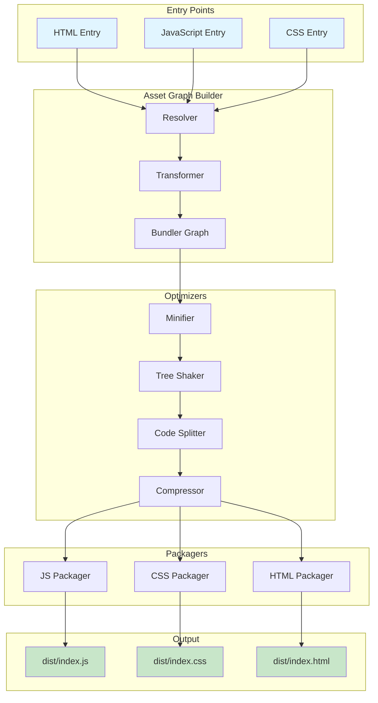
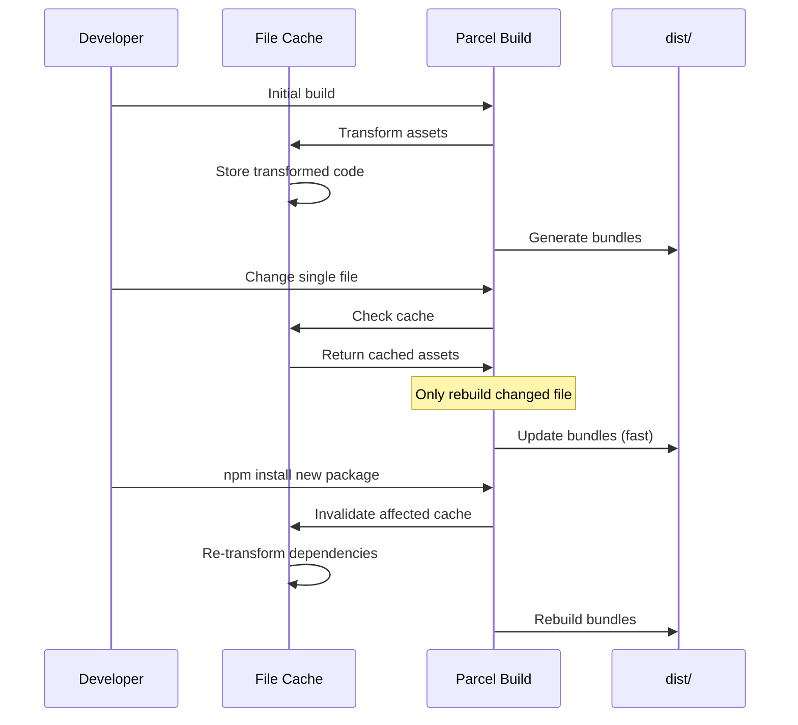
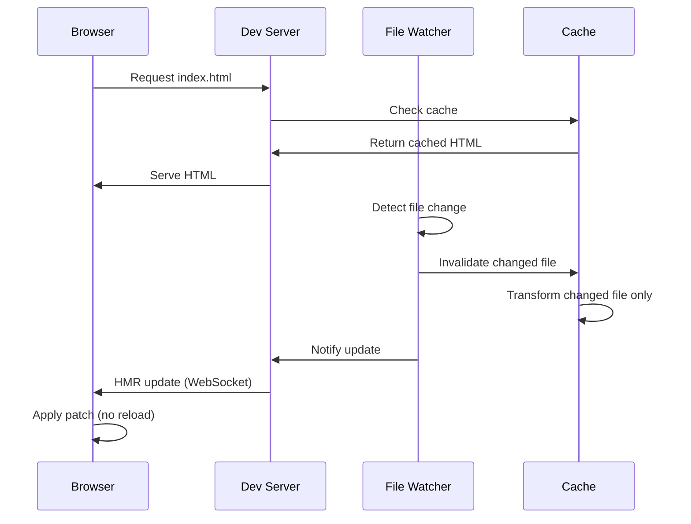
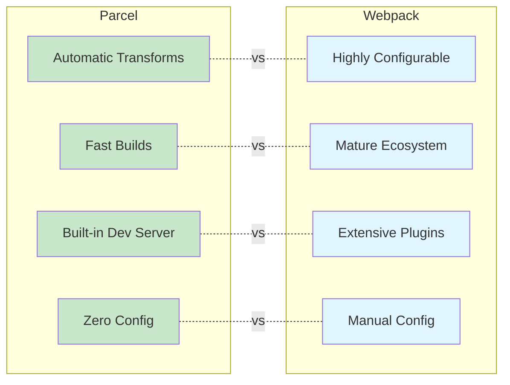

#javascript #web-bundler #build-tool #parcel #frontend #zero-config #site-reliability-engineering #devops #web-development #asset-bundler
# Overview
- Parcel is a ==zero-configuration web application bundler== that provides fast, automatic asset bundling with minimal setup.
- Parcel automatically detects and transforms assets based on file extensions without requiring configuration files.
- Parcel uses ==multicore compilation== to achieve fast build times and includes a built-in development server with Hot Module Replacement.
- Parcel supports multiple entry points, code splitting, tree shaking, and automatic optimization for production builds.
- Parcel is designed for ==developer experience== with sensible defaults while remaining extensible through plugins.
# Architecture
## Core components
- Parcel's architecture consists of several key components working together for asset processing.

## Resolver
- The Resolver locates assets based on import specifiers and file system paths.
- Resolves ==node_modules== dependencies, relative imports, and absolute paths.
- Supports custom resolution strategies through resolver plugins.
```JavaScript title='Resolver handling different import types'
// node_modules resolution
import React from 'react';

// Relative path resolution
import Header from './components/Header.jsx';

// Absolute path resolution
import utils from '/src/utils/helpers.js';

// URL resolution
import styles from 'url:./styles.css';

// Glob resolution
import images from './images/*.png';
```
## Transformer
- Transformers process assets and convert them to formats understood by JavaScript runtimes.
- Parcel automatically selects appropriate transformers based on ==file extensions==.
- Common transformers include Babel for JavaScript, PostCSS for CSS, and various preprocessor transformers.
```JavaScript title='Automatic transformation based on file type'
// TypeScript transformation (.ts, .tsx)
import Component from './Component.tsx';

// SASS transformation (.scss, .sass)
import styles from './styles.scss';

// Vue transformation (.vue)
import App from './App.vue';

// GraphQL transformation (.gql)
import query from './query.gql';
```
## Bundler
- The Bundler creates the dependency graph and determines optimal bundle splitting strategy.
- Parcel automatically splits code based on ==dynamic imports== and shared dependencies.
- Creates separate bundles for different entry points and shared chunks.
## Packagers
- Packagers combine transformed assets into final output bundles.
- Different packagers handle JavaScript, CSS, HTML, and binary assets.
- Packagers apply optimizations like minification and compression.
## Cache system
- Parcel uses a ==persistent file cache== to speed up subsequent builds.
- Cache stores transformed assets and dependency information.
- Invalidates cache automatically when source files or dependencies change.

# Zero-configuration approach
## Automatic detection
- Parcel automatically detects asset types and applies appropriate transformers without configuration.
- Supports ==dozens of file types== out of the box including JavaScript, TypeScript, CSS, images, fonts, and more.
```JavaScript title='No configuration needed for common transformations'
// package.json - minimal setup
{
  "name": "my-app",
  "scripts": {
    "dev": "parcel src/index.html",
    "build": "parcel build src/index.html"
  },
  "devDependencies": {
    "parcel": "^2.11.0"
  }
}
```
## Built-in features
- Code splitting via dynamic `JavaScript import()`
- Hot Module Replacement for fast development
- Automatic PostCSS and Babel configuration based on `browserslist`
- Image optimization and resizing
- Environment variable injection via `process.env`
- Source maps for debugging
```JavaScript title='Automatic features without configuration'
// Code splitting automatically enabled
const LazyComponent = () => import('./components/LazyComponent.jsx');

// Environment variables automatically injected
const API_URL = process.env.API_URL;

// PostCSS autoprefixer applied based on browserslist
import './styles.css';

// Image optimization automatic
import logo from './logo.png';
```
## Sensible defaults
- Production builds automatically enable minification, tree shaking, and compression.
- Development builds prioritize speed with source maps and HMR.
- Browser targets determined from `browserslist` configuration.
```JSON title='Browserslist configuration for automatic transpilation'
{
  "browserslist": [
    "last 2 Chrome versions",
    "last 2 Firefox versions",
    "last 2 Safari versions"
  ]
}
```
# Development server
## Built-in dev server
- Parcel includes a ==built-in development server== with automatic reloading.
- Supports HTTPS, custom ports, and host configuration.
- Proxy support for API requests during development.
```Shell title='Starting development server'
# Basic development server
parcel src/index.html

# Custom port
parcel src/index.html --port 3000

# HTTPS with custom certificate
parcel src/index.html --https --cert ./cert.pem --key ./key.pem

# Open browser automatically
parcel src/index.html --open
```
## Hot Module Replacement
- Parcel provides ==automatic HMR== for JavaScript, CSS, and many asset types.
- HMR updates modules in place without full page reload.
- Preserves application state during development.
```JavaScript title='HMR API for custom module updates'
// Automatic HMR for CSS and most frameworks
import './styles.css';

// Manual HMR API for custom logic
if (module.hot) {
  module.hot.accept('./data.js', () => {
    const newData = require('./data.js').default;
    updateUI(newData);
  });

  module.hot.dispose(() => {
    // Cleanup before module replacement
    cleanupListeners();
  });
}
```
## Development optimizations
- Fast incremental rebuilds using persistent cache.
- Lazy compilation defers processing until assets are requested.
- Source maps generated for easier debugging.

# Production optimization
## Automatic minification
- Parcel automatically minifies JavaScript, CSS, HTML, and SVG in production builds.
- Uses ==Terser== for JavaScript minification with optimized configuration.
- CSS minification with `cssnano` removing unused rules.
```Shell title='Production build with automatic optimizations'
# Production build
parcel build src/index.html

# Output shows optimized bundles
# dist/index.html       1.2 KB
# dist/index.abc123.js  45.3 KB (minified)
# dist/index.def456.css  8.7 KB (minified)
```
## Tree shaking
- Parcel automatically performs ==tree shaking== to remove unused exports.
- Works with ES modules and CommonJS modules.
- Removes dead code across the entire dependency graph.
```JavaScript title='Tree shaking removes unused exports'
// utils.js - exports multiple functions
export function usedFunction() {
  return 'used';
}

export function unusedFunction() {
  return 'never imported';
}

// main.js - only imports usedFunction
import { usedFunction } from './utils.js';

// Production bundle excludes unusedFunction completely
console.log(usedFunction());
```
## Code splitting
- Parcel automatically splits code based on ==dynamic imports== and entry points.
- Shared dependencies extracted into common bundles to avoid duplication.
- Parallel chunk loading for optimal performance.
```JavaScript title='Automatic code splitting with dynamic imports'
// Lazy load routes
const Home = () => import('./pages/Home.jsx');
const About = () => import('./pages/About.jsx');
const Dashboard = () => import('./pages/Dashboard.jsx');

// Parcel creates separate bundles:
// dist/Home.abc123.js
// dist/About.def456.js
// dist/Dashboard.ghi789.js
// dist/shared.jkl012.js (common dependencies)
```
## Scope hoisting
- Parcel performs ==scope hoisting== to concatenate modules into fewer scopes.
- Reduces bundle size and improves runtime performance.
- Enables better minification by reducing function wrappers.
```JavaScript title='Scope hoisting combines modules'
// Before scope hoisting (multiple module scopes)
// (function() { module1 code })()
// (function() { module2 code })()

// After scope hoisting (single scope)
// Combined code in single scope with better minification
```
## Content hashing
- Parcel adds ==content hashes== to output filenames for effective browser caching.
- Only changed files receive new hashes, unchanged files keep existing hashes.
- Enables long-term caching with automatic cache invalidation.
```Shell title='Content-hashed output filenames'
dist/
├── index.html
├── index.a1b2c3d4.js    # Main bundle with content hash
├── about.e5f6g7h8.js    # About page chunk
└── logo.i9j0k1l2.png    # Hashed image asset
```
## Compression
- Parcel can generate ==compressed versions== of assets using Gzip and Brotli.
- Pre-compressed assets served by web servers for faster delivery.
```Shell title='Enable compression in production build'
# Build with compression
parcel build src/index.html --no-scope-hoist

# Output includes compressed versions
# dist/index.abc123.js       45.3 KB
# dist/index.abc123.js.gz    12.1 KB (gzip)
# dist/index.abc123.js.br     9.8 KB (brotli)
```
# Asset handling
## JavaScript and TypeScript
- Parcel automatically transpiles JavaScript and TypeScript based on `browserslist` targets.
- Supports ==JSX and TSX== without configuration.
- Automatic Babel configuration with `@babel/preset-env`.
```JavaScript title='Automatic TypeScript and JSX transformation'
// Component.tsx - no tsconfig.json required
import React, { useState } from 'react';

interface Props {
  title: string;
}

export const Component: React.FC<Props> = ({ title }) => {
  const [count, setCount] = useState<number>(0);

  return (
    <div>
      <h1>{title}</h1>
      <button onClick={() => setCount(count + 1)}>
        Count: {count}
      </button>
    </div>
  );
};
```
## CSS and preprocessors
- Parcel supports CSS, SCSS, SASS, Less, and Stylus without configuration.
- Automatic ==PostCSS== with Autoprefixer based on browserslist.
- CSS Modules support via `.module.css` naming convention.
```JavaScript title='Automatic CSS preprocessing and modules'
// SCSS automatically compiled
import './styles.scss';

// CSS Modules with type safety
import styles from './Button.module.css';

export const Button = () => (
  <button className={styles.primary}>
    Click me
  </button>
);
```

```CSS title='CSS Modules automatic scoping'
/* Button.module.css */
.primary {
  background: blue;
  color: white;
}

/* Compiles to scoped class name */
/* .Button_primary_1a2b3c { ... } */
```
## Images and fonts
- Parcel optimizes images automatically and supports multiple image formats.
- Provides ==URL resolution== for assets with proper content hashing.
- Supports image resizing and format conversion through query parameters.
```JavaScript title='Image optimization and URL resolution'
// Standard import returns hashed URL
import logo from './logo.png';

// URL import forces separate file
import iconUrl from 'url:./icon.svg';

// Data URL embeds small images
import smallIcon from 'data-url:./small-icon.png';

// Image resizing with query parameters
import thumbnail from './photo.jpg?width=200&height=200';

// WebP conversion
import webpImage from './photo.jpg?as=webp';
```
## HTML and static assets
- Parcel processes HTML files and automatically resolves asset references.
- Supports ==template languages== like Pug, EJS, and Handlebars.
- Static assets copied to output directory with proper hashing.
```HTML title='HTML with automatic asset resolution'
<!DOCTYPE html>
<html>
<head>
  <title>My App</title>
  <!-- CSS automatically bundled and injected -->
  <link rel="stylesheet" href="./styles.css">
</head>
<body>
  <div id="root"></div>
  <!-- JavaScript automatically bundled -->
  <script type="module" src="./index.js"></script>

  <!-- Images automatically optimized and hashed -->
  
</body>
</html>
```
## JSON and other data formats
- Parcel supports importing JSON, YAML, TOML, and other data formats.
- Data files automatically parsed and tree-shaken.
```JavaScript title='Importing various data formats'
// JSON import with tree shaking
import { version } from './package.json';

// YAML import
import config from './config.yaml';

// TOML import
import settings from './settings.toml';

// GraphQL import
import query from './query.graphql';
```
# Configuration
## Package.json configuration
- Parcel configuration can be added to `package.json` under `targets` field.
- Supports multiple build targets with different output configurations.
```JSON title='Multiple build targets configuration'
{
  "name": "my-app",
  "source": "src/index.html",
  "targets": {
    "modern": {
      "engines": {
        "browsers": "last 2 Chrome versions"
      },
      "distDir": "dist/modern",
      "outputFormat": "esmodule"
    },
    "legacy": {
      "engines": {
        "browsers": "IE 11"
      },
      "distDir": "dist/legacy",
      "outputFormat": "global"
    }
  }
}
```
## .parcelrc configuration
- Advanced configuration using `.parcelrc` file for custom pipelines.
- Extends default configuration with custom transformers, optimizers, and packagers.
```JSON title='Custom Parcel configuration'
{
  "extends": "@parcel/config-default",
  "transformers": {
    "*.svg": ["@parcel/transformer-svg-react"]
  },
  "optimizers": {
    "*.js": ["@parcel/optimizer-terser"]
  },
  "reporters": [
    "...",
    "@parcel/reporter-bundle-analyzer"
  ]
}
```
## Browserslist configuration
- Parcel uses `browserslist` to determine ==transpilation targets==.
- Configuration in `package.json` or `.browserslistrc` file.
```Text title='.browserslistrc configuration'
# Modern browsers
last 2 Chrome versions
last 2 Firefox versions
last 2 Safari versions
last 2 Edge versions

# Exclude dead browsers
not dead
not IE 11
```
## Environment variables
- Parcel automatically loads environment variables from `.env` files.
- Variables prefixed with `PARCEL_` available during build time.
```Shell title='.env file configuration'
# .env file
API_URL=https://api.example.com
DEBUG=true

# Available in code
console.log(process.env.API_URL);
```
```JavaScript title='Using environment variables'
// Development-specific code
if (process.env.NODE_ENV === 'development') {
  console.log('Development mode');
}

// API endpoint from environment
const API_URL = process.env.API_URL || 'http://localhost:3000';

// Feature flags
const ENABLE_ANALYTICS = process.env.ENABLE_ANALYTICS === 'true';
```
# Plugin system
## Official plugins
- Parcel provides ==official plugins== for common transformations and optimizations.
- Plugins installed via npm and configured in `.parcelrc`.
```Shell title='Installing Parcel plugins'
# SVG React transformer
npm install --save-dev @parcel/transformer-svg-react

# Image optimizer
npm install --save-dev @parcel/optimizer-image

# Bundle analyzer
npm install --save-dev @parcel/reporter-bundle-analyzer
```
## Custom transformers
- Custom transformers process specific file types during the build.
- Implement the `Transformer` interface to create custom transformers.
```JavaScript title='Custom transformer example'
// parcel-transformer-custom.js
import { Transformer } from '@parcel/plugin';

export default new Transformer({
  async transform({ asset, options }) {
    const code = await asset.getCode();

    // Custom transformation logic
    const transformed = code.toUpperCase();

    asset.setCode(transformed);
    return [asset];
  }
});
```
## Custom resolvers
- Custom resolvers modify how Parcel locates and resolves modules.
- Useful for implementing custom module resolution strategies.
```JavaScript title='Custom resolver example'
// parcel-resolver-custom.js
import { Resolver } from '@parcel/plugin';
import path from 'path';

export default new Resolver({
  async resolve({ specifier, dependency, options }) {
    // Custom resolution logic
    if (specifier.startsWith('@components/')) {
      return {
        filePath: path.join(
          options.projectRoot,
          'src/components',
          specifier.replace('@components/', '')
        )
      };
    }

    return null; // Fallback to default resolver
  }
});
```
## Custom optimizers
- Custom optimizers modify assets during the production build.
- Apply custom minification, compression, or transformation logic.
```JavaScript title='Custom optimizer example'
// parcel-optimizer-custom.js
import { Optimizer } from '@parcel/plugin';

export default new Optimizer({
  async optimize({ bundle, contents, map, options }) {
    // Custom optimization logic
    const optimized = await customMinify(contents);

    return {
      contents: optimized,
      map
    };
  }
});
```
# Real-world examples
## React application
- Setting up a React application with Parcel requires minimal configuration.
```Shell title='Creating React app with Parcel'
# Initialize project
mkdir my-react-app && cd my-react-app
npm init -y

# Install dependencies
npm install react react-dom
npm install --save-dev parcel

# Add scripts to package.json
npm pkg set scripts.dev="parcel src/index.html"
npm pkg set scripts.build="parcel build src/index.html"
```

```HTML title='src/index.html entry point'
<!DOCTYPE html>
<html>
<head>
  <title>React App</title>
</head>
<body>
  <div id="root"></div>
  <script type="module" src="./index.jsx"></script>
</body>
</html>
```

```JavaScript title='src/index.jsx React application'
import React from 'react';
import ReactDOM from 'react-dom/client';
import App from './App';
import './styles.css';

const root = ReactDOM.createRoot(document.getElementById('root'));
root.render(<App />);
```

```JavaScript title='src/App.jsx main component'
import React, { useState, lazy, Suspense } from 'react';

// Code splitting with lazy loading
const Dashboard = lazy(() => import('./components/Dashboard'));

export default function App() {
  const [showDashboard, setShowDashboard] = useState(false);

  return (
    <div className="app">
      <h1>My React App</h1>
      <button onClick={() => setShowDashboard(true)}>
        Load Dashboard
      </button>

      {showDashboard && (
        <Suspense fallback={<div>Loading...</div>}>
          <Dashboard />
        </Suspense>
      )}
    </div>
  );
}
```
## TypeScript application
- TypeScript support works automatically without `tsconfig.json` configuration.
```Shell title='TypeScript project setup'
# Install TypeScript
npm install --save-dev typescript

# Parcel handles TypeScript automatically
parcel src/index.html
```
```TypeScript title='src/index.ts with TypeScript'
interface User {
  id: number;
  name: string;
  email: string;
}

async function fetchUsers(): Promise<User[]> {
  const response = await fetch('/api/users');
  return response.json();
}

async function main() {
  const users = await fetchUsers();
  users.forEach(user => {
    console.log(`${user.name} <${user.email}>`);
  });
}

main();
```
## Multi-page application
- Parcel supports multiple entry points for multi-page applications.
```Shell title='Multi-page application structure'
src/
├── index.html       # Home page
├── about.html       # About page
├── contact.html     # Contact page
├── index.js
├── about.js
└── contact.js

# Build all pages
parcel build src/*.html
```

```JSON title='Package.json with multiple entry points'
{
  "name": "multi-page-app",
  "source": [
    "src/index.html",
    "src/about.html",
    "src/contact.html"
  ],
  "scripts": {
    "dev": "parcel",
    "build": "parcel build"
  }
}
```
## Library bundling
- Parcel can bundle libraries for distribution with proper entry point configuration.
```JSON title='Library bundling configuration'
{
  "name": "my-library",
  "version": "1.0.0",
  "source": "src/index.js",
  "main": "dist/main.js",
  "module": "dist/module.js",
  "targets": {
    "main": {
      "outputFormat": "commonjs"
    },
    "module": {
      "outputFormat": "esmodule"
    }
  }
}
```

```JavaScript title='src/index.js library entry'
// Export library API
export function add(a, b) {
  return a + b;
}

export function multiply(a, b) {
  return a * b;
}

export default {
  add,
  multiply
};
```
# Comparison with other bundlers
## Parcel vs Webpack

- ==Parcel advantages==: Zero configuration, faster initial setup, automatic transformations, better developer experience for small to medium projects.
- ==Webpack advantages==: More control over build process, larger plugin ecosystem, better for complex enterprise applications, more optimization options.
- ==Configuration comparison==:
```JavaScript title='Webpack requires explicit configuration'
// webpack.config.js - explicit configuration required
module.exports = {
  entry: './src/index.js',
  output: {
    filename: 'bundle.js',
    path: path.resolve(__dirname, 'dist')
  },
  module: {
    rules: [
      {
        test: /\.jsx?$/,
        use: 'babel-loader'
      },
      {
        test: /\.css$/,
        use: ['style-loader', 'css-loader']
      }
    ]
  },
  plugins: [
    new HtmlWebpackPlugin()
  ]
};
```
```Shell title='Parcel zero configuration'
# No config file needed
parcel src/index.html
```
## Parcel vs Vite
- ==Parcel advantages==: Truly zero-config, works with any entry file type, automatic optimization, simpler mental model.
- ==Vite advantages==: Faster development server with native ESM, better for large applications, more granular control, better Vue.js integration.
- ==Performance comparison==:
```Shell title='Development server startup time'
# Vite - Instant (native ESM, no bundling)
npm run dev  # ~100ms

# Parcel - Fast (bundling with cache)
npm run dev  # ~500ms

# Webpack - Slower (full bundling)
npm run dev  # ~3000ms
```
## Use case recommendations
### Parcel
- Prototypes and small to medium projects
- Projects prioritizing developer experience over configuration
- Teams wanting minimal build tool maintenance
- Applications with standard build requirements
### Webpack
- Large enterprise applications requiring extensive customization
- Projects with complex build requirements
- Teams needing fine-grained control over optimization
- Applications requiring specific plugin ecosystems
### Vite
- Modern frontend frameworks (Vue, React, Svelte)
- Large applications requiring instant development server
- Projects leveraging native ESM during development
- Teams comfortable with more configuration than Parcel
# Migration guides
## Migrating from Webpack
- Migrating from Webpack to Parcel simplifies configuration dramatically.
```Shell title='Migration steps from Webpack'
# 1. Install Parcel
npm uninstall webpack webpack-cli webpack-dev-server
npm install --save-dev parcel

# 2. Remove webpack.config.js and related files
rm webpack.config.js

# 3. Update package.json scripts
npm pkg set scripts.dev="parcel src/index.html"
npm pkg set scripts.build="parcel build src/index.html"

# 4. Create HTML entry point if needed
# Webpack uses JavaScript entry, Parcel prefers HTML
```

```HTML title='Create HTML entry point for Parcel'
<!-- src/index.html -->
<!DOCTYPE html>
<html>
<head>
  <title>Migrated App</title>
</head>
<body>
  <div id="app"></div>
  <!-- Replace Webpack's JavaScript entry -->
  <script type="module" src="./index.js"></script>
</body>
</html>
```
- ==Configuration mapping==:
```JavaScript title='Webpack loaders replaced by Parcel auto-detection'
// Webpack - explicit loaders
{
  module: {
    rules: [
      { test: /\.tsx?$/, use: 'ts-loader' },
      { test: /\.scss$/, use: ['style-loader', 'css-loader', 'sass-loader'] },
      { test: /\.(png|svg|jpg|gif)$/, type: 'asset/resource' }
    ]
  }
}

// Parcel - automatic detection, no configuration needed
```
- ==Plugin migration==:
```JavaScript title='Webpack plugins to Parcel alternatives'
// Webpack plugins
new HtmlWebpackPlugin()  // Parcel handles HTML automatically
new MiniCssExtractPlugin()  // Parcel extracts CSS automatically
new DefinePlugin()  // Use .env files with Parcel
new BundleAnalyzerPlugin()  // Use @parcel/reporter-bundle-analyzer
```
## Migrating from Vite
- Migrating from Vite to Parcel requires changing entry point approach.
```Shell title='Migration steps from Vite'
# 1. Install Parcel
npm uninstall vite @vitejs/plugin-react
npm install --save-dev parcel

# 2. Remove vite.config.js
rm vite.config.js

# 3. Update package.json scripts
npm pkg set scripts.dev="parcel index.html"
npm pkg set scripts.build="parcel build index.html"

# 4. Update index.html (remove Vite-specific features)
```

```HTML title='Update HTML from Vite to Parcel'
<!-- Vite index.html -->
<script type="module" src="/src/main.jsx"></script>

<!-- Parcel index.html (adjust path) -->
<script type="module" src="./src/main.jsx"></script>
```

```JavaScript title='Vite config to Parcel alternatives'
// vite.config.js
export default {
  plugins: [react()],  // Parcel auto-detects React
  resolve: {
    alias: {
      '@': '/src'  // Use .parcelrc for custom resolvers
    }
  }
}

// .parcelrc (only if needed)
{
  "extends": "@parcel/config-default"
}
```
## Common migration issues
- ==Path resolution==: Parcel uses relative paths, adjust absolute paths from other bundlers.
```JavaScript title='Fix import paths during migration'
// Webpack/Vite - absolute paths
import Component from '/src/components/Component';

// Parcel - relative paths
import Component from './components/Component';
```
- ==Environment variables==: Update environment variable usage.
```JavaScript title='Environment variable differences'
// Vite - VITE_ prefix
const url = import.meta.env.VITE_API_URL;

// Parcel - process.env (no prefix needed)
const url = process.env.API_URL;
```
- ==Public directory==: Adjust static asset handling.
```Text title='Static assets directory structure'
# Webpack/Vite - public/ directory
public/
  images/
  fonts/

# Parcel - reference from HTML or import
src/
  assets/
    images/
    fonts/
```
# Performance characteristics
## Build performance

```mermaid
gantt
    title Build Performance Comparison
    dateFormat X
    axisFormat %s

    section Cold Build
    Parcel (cold)      :0, 8
    Vite (cold)        :0, 6
    Webpack (cold)     :0, 15

    section Warm Build
    Parcel (cached)    :0, 2
    Vite (cached)      :0, 1
    Webpack (cached)   :0, 5

    section Production
    Parcel (prod)      :0, 12
    Vite (prod)        :0, 10
    Webpack (prod)     :0, 18
```

- Parcel achieves fast builds through ==multicore compilation== and persistent caching.
- Cold build performance competitive with other bundlers for small to medium projects.
- Warm builds significantly faster due to granular cache invalidation.
- Production builds slower than Vite but faster than Webpack for typical applications.
## Development performance
- Development server starts quickly with lazy compilation.
- HMR updates apply in milliseconds for most file types.
- Cache system reduces rebuild time to ==subsecond== for single file changes.
```Shell title='Development performance metrics'
# Initial dev server startup
parcel src/index.html
Server running at http://localhost:1234
✨ Built in 847ms

# Hot module replacement update
✨ Updated in 23ms
```
## Bundle size optimization
- Parcel produces competitive bundle sizes with automatic optimizations.
- Tree shaking removes unused code effectively.
- Scope hoisting reduces bundle size by ==10-20%== compared to non-optimized builds.
```Shell title='Bundle size comparison'
# Development build (unoptimized)
dist/index.js  245 KB

# Production build (optimized)
dist/index.abc123.js  89 KB (minified + tree-shaken + scope-hoisted)
dist/index.abc123.js.gz  28 KB (gzip)
dist/index.abc123.js.br  24 KB (brotli)
```
## Memory usage
- Parcel uses moderate memory during builds with multicore compilation.
- Cache system trades disk space for faster rebuilds.
- Memory usage scales with project size and number of assets.
```Shell title='Memory usage monitoring'
# Monitor Parcel memory usage
parcel build src/index.html --log-level verbose

# Typical memory usage
Small project (< 100 files):    ~200 MB
Medium project (100-500 files): ~500 MB
Large project (> 500 files):    ~1-2 GB
```
# Best practices
## Project structure
- Organize source files in `src/` directory with clear entry points.
- Keep assets close to components that use them.
- Use meaningful filenames that indicate content type.
```Text title='Recommended project structure'
my-app/
├── src/
│   ├── index.html          # Entry point
│   ├── index.js            # Main JavaScript
│   ├── styles/
│   │   ├── global.css
│   │   └── variables.css
│   ├── components/
│   │   ├── Header/
│   │   │   ├── Header.jsx
│   │   │   ├── Header.module.css
│   │   │   └── logo.svg
│   │   └── Footer/
│   │       ├── Footer.jsx
│   │       └── Footer.module.css
│   ├── pages/
│   │   ├── Home.jsx
│   │   └── About.jsx
│   └── utils/
│       └── helpers.js
├── .env
├── .gitignore
└── package.json
```
## Code splitting strategy
- Use dynamic imports for routes and heavy components.
- Split vendor code from application code automatically.
- Leverage Parcel's automatic shared bundle extraction.
```JavaScript title='Effective code splitting patterns'
// Route-based splitting
const routes = [
  {
    path: '/',
    component: () => import('./pages/Home')
  },
  {
    path: '/dashboard',
    component: () => import('./pages/Dashboard')
  }
];

// Feature-based splitting
const HeavyChart = lazy(() => import('./components/HeavyChart'));

// Vendor splitting (automatic with Parcel)
import React from 'react';  // Extracted to vendor bundle
import lodash from 'lodash';  // Extracted to vendor bundle
```
## Environment-specific configuration
- Use `.env` files for different environments.
- Leverage `NODE_ENV` for environment-specific code.
```Shell title='Environment files organization'
.env              # Default variables
.env.development  # Development overrides
.env.production   # Production overrides
.env.local        # Local overrides (gitignored)
```
```JavaScript title='Environment-specific code'
// Development-only debugging
if (process.env.NODE_ENV === 'development') {
  console.log('Debug:', data);
}

// Production-only analytics
if (process.env.NODE_ENV === 'production') {
  initAnalytics(process.env.ANALYTICS_ID);
}

// Feature flags
const features = {
  newUI: process.env.ENABLE_NEW_UI === 'true',
  betaFeatures: process.env.ENABLE_BETA === 'true'
};
```
## Optimization checklist
- Enable production mode for final builds.
- Configure browserslist for appropriate transpilation targets.
- Use content hashing for effective caching.
- Enable compression for text assets.
- Optimize images and use modern formats.
```Shell title='Production build checklist'
# 1. Set NODE_ENV to production
export NODE_ENV=production

# 2. Configure browserslist
echo "> 0.5%, last 2 versions, not dead" > .browserslistrc

# 3. Build with optimizations
parcel build src/index.html --no-source-maps

# 4. Analyze bundle size
npm install --save-dev @parcel/reporter-bundle-analyzer

# 5. Verify output
ls -lh dist/
```
## Cache management
- Commit `.parcelrc` but ignore `.parcel-cache/` directory.
- Clear cache when experiencing unexpected build issues.
- Use cache warming in CI/CD pipelines.
```Shell title='Cache management commands'
# Clear cache manually
rm -rf .parcel-cache

# Rebuild from scratch
parcel build src/index.html --no-cache

# Add to .gitignore
echo ".parcel-cache/" >> .gitignore
echo "dist/" >> .gitignore
```
## Debugging builds
- Use verbose logging to troubleshoot issues.
- Enable source maps for debugging production builds.
- Use `--no-optimize` to disable optimizations during debugging.
```Shell title='Debugging Parcel builds'
# Verbose logging
parcel build src/index.html --log-level verbose

# Detailed error reporting
parcel build src/index.html --detailed-report

# Disable optimizations for debugging
parcel build src/index.html --no-optimize --no-scope-hoist

# Generate source maps in production
parcel build src/index.html --source-maps
```
***
# References
1. https://parceljs.org/ for official Parcel documentation and guides.
2. https://parceljs.org/getting-started/webapp/ for getting started with web applications.
3. https://parceljs.org/features/development/ for development features including HMR and dev server.
4. https://parceljs.org/features/production/ for production optimization features.
5. https://parceljs.org/features/code-splitting/ for automatic code splitting documentation.
6. https://parceljs.org/features/scope-hoisting/ for scope hoisting and tree shaking.
7. https://parceljs.org/plugin-system/overview/ for plugin system architecture and APIs.
8. https://parceljs.org/languages/javascript/ for JavaScript and TypeScript support.
9. https://parceljs.org/languages/css/ for CSS and preprocessor support.
10. https://parceljs.org/recipes/react/ for React application setup and best practices.
11. https://parceljs.org/configuration/package-json/ for package.json configuration options.
12. [[Webpack|Webpack]] for comparison with Webpack bundler.
13. [[Vite|Vite]] for comparison with Vite build tool.
