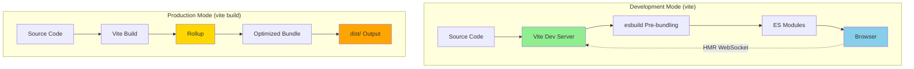
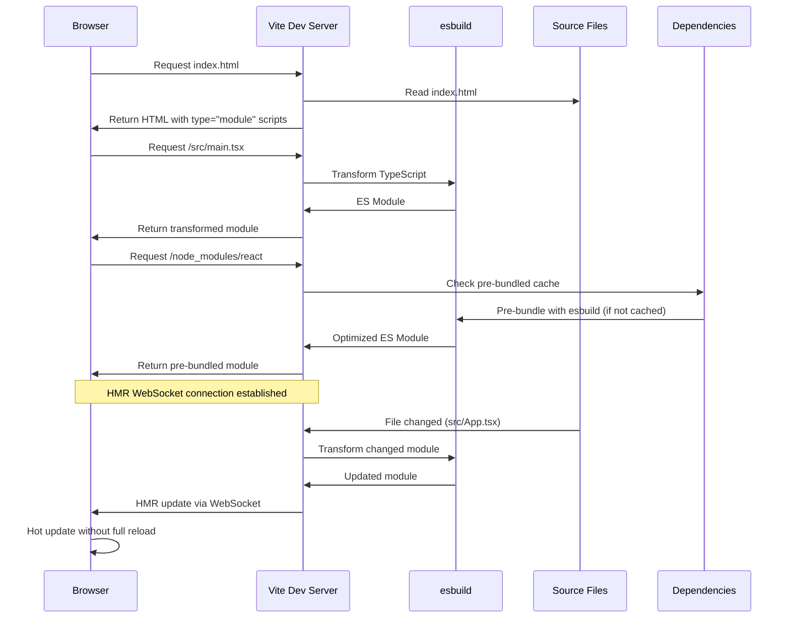
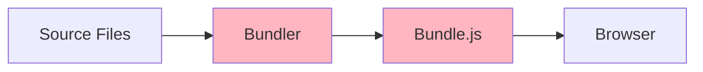
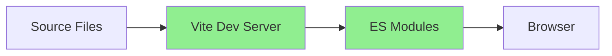
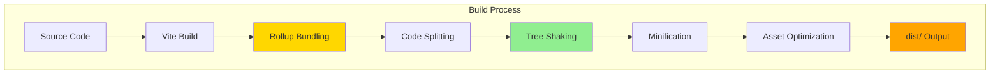

#web #vite #web-bundler #javascript #esm #rollup #nodejs #browser #react #vue #typescript #build-tool
#hot-module-replacement 
# Formal Definition
- Vite is a <mark class="hltr-yellow">next-generation frontend build tool</mark> that provides an <mark class="hltr-yellow">extremely fast development experience</mark>.
- Vite consists of two major parts:
  1. **Development Server** - Serves source files over native ES modules with <mark class="hltr-yellow">instant Hot Module Replacement (HMR)</mark>
  2. **Build Command** - Bundles code with Rollup for highly optimized production builds
- Key innovations:
  1. **Native ESM** - No bundling during development, serves modules directly
  2. **Instant Server Start** - Server starts in milliseconds regardless of project size
  3. **Lightning Fast HMR** - Hot updates remain fast even in large applications
  4. **Optimized Build** - Pre-configured Rollup with sensible defaults for production
  5. **Rich Plugin Ecosystem** - Compatible with Rollup plugins + dedicated Vite plugins
# Vite Architecture



## Development Server Flow



# Core Concepts

## Native ES Modules in Development

### Traditional Bundler Approach (Webpack)


- Bundler must process entire application before serving. Large apps = slow start (30s - 2min).
### Vite's Approach

- Serve modules directly. Browser imports modules on-demand. Start time = 100-300ms.
### Real-World Example

```html title='Vite entry point with ES modules'
<!DOCTYPE html>
<html lang="en">
  <head>
    <meta charset="UTF-8" />
    <link rel="icon" type="image/svg+xml" href="/vite.svg" />
    <meta name="viewport" content="width=device-width, initial-scale=1.0" />
    <title>Vite + React + TS</title>
  </head>
  <body>
    <div id="root"></div>
    <!-- Type="module" enables native ES module loading -->
    <script type="module" src="/src/main.tsx"></script>
  </body>
</html>
```

```HTTP title='Network request'
GET http://localhost:5173/                              200  HTML
GET http://localhost:5173/src/main.tsx                  200  Transformed to JS
GET http://localhost:5173/src/App.tsx                   200  Transformed to JS
GET http://localhost:5173/node_modules/react/index.js   200  Pre-bundled
GET http://localhost:5173/src/components/Button.tsx     200  Transformed to JS
```

```HTTP title='Traditional webpack bundler'
Wait 30 seconds for bundling...
GET http://localhost:3000/bundle.js                     200  3.2 MB
```

## Dependency Pre-Bundling
- Vite pre-bundles dependencies using esbuild for two reasons:
### Reason 1: CommonJS to ESM Conversion
Many npm packages ship CommonJS. Vite converts them to ESM.

```javascript title='CommonJS package (lodash)'
// node_modules/lodash/index.js
module.exports = {
  debounce: function() { /* ... */ },
  throttle: function() { /* ... */ }
};
```

- **Vite pre-bundles to:**
```javascript title='Pre-bundled ESM version'
// node_modules/.vite/deps/lodash.js
export function debounce() { /* ... */ }
export function throttle() { /* ... */ }
```

### Reason 2: Performance Optimization
Some packages have hundreds of internal modules.

**Without pre-bundling:**
```javascript title='lodash-es has 600+ modules'
import { debounce } from 'lodash-es'
// Browser makes 600+ HTTP requests for lodash internals
```

**With pre-bundling:**
```javascript title='Pre-bundled into single file'
import { debounce } from 'lodash-es'
// Browser makes 1 HTTP request for pre-bundled lodash
// Vite bundles lodash-es → node_modules/.vite/deps/lodash-es.js
```

### Pre-Bundle Cache Location

```
node_modules/
└── .vite/
    ├── deps/
    │   ├── react.js               # Pre-bundled React
    │   ├── react-dom_client.js    # Pre-bundled ReactDOM
    │   ├── lodash-es.js           # Pre-bundled lodash
    │   └── chunk-*.js             # Shared chunks
    ├── deps_temp/                 # Temporary pre-bundle location
    └── _metadata.json             # Pre-bundle metadata and hash
```

**Cache invalidation triggers:**
- `package.json` dependencies change
- `package-lock.json` or `pnpm-lock.yaml` change
- `vite.config.js` changes
- Manual: `vite --force`

## 3. Hot Module Replacement (HMR)

### HMR Speed Comparison

**Traditional Bundler HMR:**
```
File changed → Re-bundle affected modules → Browser refresh
Time: 1-5 seconds (slow, depends on bundle size)
```

**Vite HMR:**
```
File changed → Transform single module → Send update via WebSocket
Time: 20-100ms (instant, independent of app size)
```

### Real-World HMR Example

```typescript title='src/App.tsx - React component with HMR'
import { useState } from 'react'
import './App.css'

function App() {
  const [count, setCount] = useState(0)

  return (
    <div className="App">
      <h1>Vite + React</h1>
      <button onClick={() => setCount(count + 1)}>
        Count is: {count}
      </button>
      <p>Edit src/App.tsx and save to test HMR</p>
    </div>
  )
}

export default App

// Vite HMR API (automatically added by @vitejs/plugin-react)
if (import.meta.hot) {
  import.meta.hot.accept()
}
```

**User interaction:**
1. User clicks button 5 times → count = 5
2. Developer edits `<h1>Vite + React</h1>` to `<h1>My App</h1>`
3. Saves file
4. **Vite HMR:** Component updates instantly, count stays 5 (state preserved)
5. **Webpack HMR:** Full page reload, count resets to 0

### HMR Console Output

```bash
[vite] hmr update /src/App.tsx
[vite] hot updated: /src/App.tsx
[React Fast Refresh] Component updated: App
Time: 43ms
```

## 4. Build Optimization

Vite uses Rollup for production builds with advanced optimizations:



# Configuration

## Basic Configuration

```typescript title='vite.config.ts - Basic configuration'
import { defineConfig } from 'vite'
import react from '@vitejs/plugin-react'

export default defineConfig({
  plugins: [react()],
  server: {
    port: 3000,
    open: true
  },
  build: {
    outDir: 'dist',
    sourcemap: true
  }
})
```

## Advanced Configuration

```typescript title='vite.config.ts - Production-ready configuration'
import { defineConfig } from 'vite'
import react from '@vitejs/plugin-react'
import path from 'path'
import { visualizer } from 'rollup-plugin-visualizer'

export default defineConfig({
  // Plugin configuration
  plugins: [
    react({
      // Fast Refresh for React
      fastRefresh: true,
      // Babel plugins for production
      babel: {
        plugins: ['babel-plugin-macros']
      }
    }),
    // Bundle size visualization
    visualizer({
      filename: './dist/stats.html',
      open: true
    })
  ],

  // Development server configuration
  server: {
    port: 3000,
    open: true,
    cors: true,
    proxy: {
      '/api': {
        target: 'http://localhost:8080',
        changeOrigin: true,
        rewrite: (path) => path.replace(/^\/api/, '')
      }
    }
  },

  // Build configuration
  build: {
    outDir: 'dist',
    sourcemap: true,
    minify: 'terser',
    terserOptions: {
      compress: {
        drop_console: true,
        drop_debugger: true
      }
    },
    rollupOptions: {
      output: {
        manualChunks: {
          'vendor-react': ['react', 'react-dom'],
          'vendor-ui': ['@mui/material', '@mui/icons-material']
        }
      }
    },
    chunkSizeWarningLimit: 1000
  },

  // Path aliases
  resolve: {
    alias: {
      '@': path.resolve(__dirname, './src'),
      '@components': path.resolve(__dirname, './src/components'),
      '@utils': path.resolve(__dirname, './src/utils'),
      '@api': path.resolve(__dirname, './src/api')
    }
  },

  // CSS configuration
  css: {
    preprocessorOptions: {
      scss: {
        additionalData: `@import "@/styles/variables.scss";`
      }
    },
    modules: {
      localsConvention: 'camelCaseOnly'
    }
  },

  // Dependency optimization
  optimizeDeps: {
    include: ['react', 'react-dom'],
    exclude: ['@vite/client']
  }
})
```

## Environment-Specific Configuration

```typescript title='vite.config.ts - Environment-based config'
import { defineConfig, loadEnv } from 'vite'
import react from '@vitejs/plugin-react'

export default defineConfig(({ command, mode }) => {
  // Load environment variables
  const env = loadEnv(mode, process.cwd(), '')

  return {
    plugins: [react()],

    define: {
      // Expose env variables to client
      __APP_VERSION__: JSON.stringify(env.npm_package_version),
      __API_URL__: JSON.stringify(env.VITE_API_URL)
    },

    build: {
      // Production-specific settings
      minify: command === 'build' ? 'terser' : false,
      sourcemap: mode === 'development'
    },

    server: {
      // Development-specific settings
      hmr: {
        overlay: mode === 'development'
      }
    }
  }
})
```

**.env files:**
```bash title='.env - Base environment variables'
VITE_APP_TITLE=My Application
VITE_API_URL=http://localhost:8080
```

```bash title='.env.production - Production overrides'
VITE_API_URL=https://api.production.com
```

```bash title='.env.staging - Staging overrides'
VITE_API_URL=https://api.staging.com
```

**Usage in code:**
```typescript title='src/config.ts - Access environment variables'
export const config = {
  appTitle: import.meta.env.VITE_APP_TITLE,
  apiUrl: import.meta.env.VITE_API_URL,
  isDev: import.meta.env.DEV,
  isProd: import.meta.env.PROD,
  mode: import.meta.env.MODE
}

console.log(config.apiUrl) // Development: http://localhost:8080
                            // Production: https://api.production.com
```

# Plugin System
## Official Plugins
### `@vitejs/plugin-react`
```typescript title='React plugin configuration'
import react from '@vitejs/plugin-react'

export default {
  plugins: [
    react({
      // Include .tsx, .jsx files
      include: '**/*.{tsx,jsx}',

      // Babel configuration
      babel: {
        plugins: [
          ['babel-plugin-styled-components', { displayName: true }]
        ]
      },

      // Fast Refresh options
      fastRefresh: true
    })
  ]
}
```

### 2. @vitejs/plugin-vue
```typescript title='Vue plugin configuration'
import vue from '@vitejs/plugin-vue'

export default {
  plugins: [
    vue({
      include: [/\.vue$/],
      reactivityTransform: true,
      script: {
        defineModel: true,
        propsDestructure: true
      }
    })
  ]
}
```

## Community Plugins

### vite-plugin-pwa (Progressive Web App)
```typescript title='PWA plugin for offline support'
import { VitePWA } from 'vite-plugin-pwa'

export default {
  plugins: [
    VitePWA({
      registerType: 'autoUpdate',
      includeAssets: ['favicon.ico', 'robots.txt', 'apple-touch-icon.png'],
      manifest: {
        name: 'My Application',
        short_name: 'MyApp',
        description: 'My awesome application',
        theme_color: '#ffffff',
        icons: [
          {
            src: 'pwa-192x192.png',
            sizes: '192x192',
            type: 'image/png'
          },
          {
            src: 'pwa-512x512.png',
            sizes: '512x512',
            type: 'image/png'
          }
        ]
      },
      workbox: {
        cleanupOutdatedCaches: true,
        runtimeCaching: [
          {
            urlPattern: /^https:\/\/api\.example\.com\/.*/i,
            handler: 'NetworkFirst',
            options: {
              cacheName: 'api-cache',
              expiration: {
                maxEntries: 50,
                maxAgeSeconds: 60 * 60 // 1 hour
              }
            }
          }
        ]
      }
    })
  ]
}
```

### vite-plugin-compression (Gzip/Brotli)
```typescript title='Compression plugin for optimized builds'
import viteCompression from 'vite-plugin-compression'

export default {
  plugins: [
    viteCompression({
      algorithm: 'gzip',
      ext: '.gz',
      threshold: 10240, // Only compress files > 10KB
      deleteOriginFile: false
    }),
    viteCompression({
      algorithm: 'brotliCompress',
      ext: '.br',
      threshold: 10240
    })
  ]
}
```

### vite-tsconfig-paths (TypeScript Paths)
```typescript title='TypeScript path mapping plugin'
import tsconfigPaths from 'vite-tsconfig-paths'

export default {
  plugins: [tsconfigPaths()]
}
```

**tsconfig.json:**
```json title='Path aliases in TypeScript'
{
  "compilerOptions": {
    "baseUrl": ".",
    "paths": {
      "@/*": ["src/*"],
      "@components/*": ["src/components/*"],
      "@utils/*": ["src/utils/*"]
    }
  }
}
```

**Usage:**
```typescript title='Import using path aliases'
import { Button } from '@components/Button'
import { formatDate } from '@utils/date'
// Instead of: import { Button } from '../../../components/Button'
```

## Custom Plugin Example

```typescript title='vite-plugin-auto-import.ts - Custom plugin'
import type { Plugin } from 'vite'

export function autoImportPlugin(): Plugin {
  return {
    name: 'vite-plugin-auto-import',

    // Transform hook - modify code during dev
    transform(code, id) {
      // Auto-import React in .tsx files
      if (id.endsWith('.tsx') && !code.includes('import React')) {
        return {
          code: `import React from 'react';\n${code}`,
          map: null
        }
      }
    },

    // Config hook - modify Vite config
    config(config, { command }) {
      if (command === 'build') {
        return {
          build: {
            rollupOptions: {
              // Custom Rollup options
            }
          }
        }
      }
    },

    // Server hook - custom dev server middleware
    configureServer(server) {
      server.middlewares.use((req, res, next) => {
        if (req.url === '/api/health') {
          res.end('OK')
          return
        }
        next()
      })
    }
  }
}
```

**Usage:**
```typescript title='vite.config.ts'
import { autoImportPlugin } from './plugins/vite-plugin-auto-import'

export default {
  plugins: [autoImportPlugin()]
}
```

# Build Process

## Development Build

```bash
$ pnpm vite

  VITE v5.0.10  ready in 247 ms

  ➜  Local:   http://localhost:5173/
  ➜  Network: use --host to expose
  ➜  press h + enter to show help
```

**What happens:**
1. Vite starts development server (247ms)
2. Pre-bundles dependencies with esbuild
3. Serves source files on-demand as ES modules
4. Establishes HMR WebSocket connection

## Production Build

```bash
$ pnpm vite build

vite v5.0.10 building for production...
✓ 247 modules transformed.
dist/index.html                   0.45 kB │ gzip:  0.29 kB
dist/assets/react.svg             4.13 kB │ gzip:  2.14 kB
dist/assets/index-DJfKkN3j.css    1.42 kB │ gzip:  0.74 kB
dist/assets/index-BbkD9M3T.js   143.42 kB │ gzip: 46.12 kB

✓ built in 2.13s
```

**Build output structure:**
```
dist/
├── index.html                          # Entry HTML with hashed asset references
├── assets/
│   ├── index-DJfKkN3j.css             # Hashed CSS bundle
│   ├── index-BbkD9M3T.js              # Hashed JS bundle
│   ├── vendor-react-CbkD8N2a.js       # Code-split vendor chunk
│   └── Logo-D2wD9N3j.png              # Optimized assets
└── vite.svg                            # Static assets
```

## Build Analysis

```typescript title='vite.config.ts - Bundle analysis'
import { defineConfig } from 'vite'
import { visualizer } from 'rollup-plugin-visualizer'

export default defineConfig({
  plugins: [
    visualizer({
      filename: './dist/stats.html',
      open: true,
      gzipSize: true,
      brotliSize: true
    })
  ],
  build: {
    rollupOptions: {
      output: {
        manualChunks(id) {
          if (id.includes('node_modules')) {
            if (id.includes('react')) return 'vendor-react'
            if (id.includes('@mui')) return 'vendor-ui'
            return 'vendor'
          }
        }
      }
    }
  }
})
```

**Output stats.html:**
```
Treemap visualization:
┌─────────────────────────────────────────────┐
│ vendor-react.js (126.4 KB)                  │
│  ├─ react (8.2 KB)                          │
│  ├─ react-dom (118.2 KB)                    │
├─────────────────────────────────────────────┤
│ vendor-ui.js (312.7 KB)                     │
│  ├─ @mui/material (280.3 KB)               │
│  ├─ @mui/icons-material (32.4 KB)          │
├─────────────────────────────────────────────┤
│ index.js (43.2 KB)                          │
│  ├─ src/App.tsx (12.1 KB)                  │
│  ├─ src/components/ (28.3 KB)              │
│  ├─ src/utils/ (2.8 KB)                    │
└─────────────────────────────────────────────┘

Total size: 482.3 KB
Gzip size: 156.8 KB
Brotli size: 138.2 KB
```

## Code Splitting Strategies

### 1. Route-Based Splitting
```typescript title='Route-based lazy loading'
import { lazy, Suspense } from 'react'
import { BrowserRouter, Routes, Route } from 'react-router-dom'

// Lazy-loaded route components
const Home = lazy(() => import('./pages/Home'))
const Dashboard = lazy(() => import('./pages/Dashboard'))
const Profile = lazy(() => import('./pages/Profile'))
const Settings = lazy(() => import('./pages/Settings'))

function App() {
  return (
    <BrowserRouter>
      <Suspense fallback={<div>Loading...</div>}>
        <Routes>
          <Route path="/" element={<Home />} />
          <Route path="/dashboard" element={<Dashboard />} />
          <Route path="/profile" element={<Profile />} />
          <Route path="/settings" element={<Settings />} />
        </Routes>
      </Suspense>
    </BrowserRouter>
  )
}
```

**Build output:**
```
dist/assets/
├── index-BbkD9M3T.js              # Main bundle (10 KB)
├── Home-DjfK3N2a.js               # Home route chunk (15 KB)
├── Dashboard-CkD9M2b.js           # Dashboard route chunk (32 KB)
├── Profile-EkF9N3c.js             # Profile route chunk (8 KB)
└── Settings-FkG9O4d.js            # Settings route chunk (12 KB)
```

### 2. Component-Based Splitting
```typescript title='Component-level code splitting'
import { lazy, Suspense } from 'react'

// Heavy chart library loaded only when needed
const Chart = lazy(() => import('./components/Chart'))
const DataTable = lazy(() => import('./components/DataTable'))

function Dashboard() {
  const [showChart, setShowChart] = useState(false)

  return (
    <div>
      <button onClick={() => setShowChart(!showChart)}>
        Toggle Chart
      </button>

      {showChart && (
        <Suspense fallback={<Spinner />}>
          <Chart data={chartData} />
        </Suspense>
      )}

      <Suspense fallback={<TableSkeleton />}>
        <DataTable data={tableData} />
      </Suspense>
    </div>
  )
}
```

**Network requests:**
```
Initial load:
GET /assets/Dashboard-CkD9M2b.js        200  32 KB

User clicks "Toggle Chart":
GET /assets/Chart-GkH9P5e.js            200  156 KB  (chart.js library)
```

### 3. Vendor Chunk Splitting
```typescript title='vite.config.ts - Manual vendor chunks'
export default {
  build: {
    rollupOptions: {
      output: {
        manualChunks: {
          // React ecosystem
          'vendor-react': ['react', 'react-dom', 'react-router-dom'],

          // UI libraries
          'vendor-ui': ['@mui/material', '@mui/icons-material'],

          // Data visualization
          'vendor-charts': ['chart.js', 'react-chartjs-2'],

          // Utilities
          'vendor-utils': ['lodash-es', 'date-fns', 'axios']
        }
      }
    }
  }
}
```

**Benefits:**
- Better browser caching (vendor code changes rarely)
- Parallel loading of chunks
- Smaller initial bundle

# Performance Optimization

## 1. Dependency Pre-Bundling Optimization

```typescript title='vite.config.ts - Optimize dependencies'
export default {
  optimizeDeps: {
    // Force pre-bundle these packages
    include: [
      'react',
      'react-dom',
      'react-router-dom',
      'lodash-es',
      '@mui/material',
      '@mui/icons-material'
    ],

    // Exclude from pre-bundling
    exclude: ['@vite/client', '@vite/env'],

    // esbuild options for pre-bundling
    esbuildOptions: {
      target: 'es2020',
      supported: {
        'top-level-await': true
      }
    }
  }
}
```

## 2. Asset Optimization

```typescript title='vite.config.ts - Asset optimization'
export default {
  build: {
    assetsInlineLimit: 4096, // Inline assets < 4KB as base64

    rollupOptions: {
      output: {
        // Separate asset file naming
        assetFileNames: (assetInfo) => {
          const info = assetInfo.name.split('.')
          const ext = info[info.length - 1]

          if (/png|jpe?g|svg|gif|tiff|bmp|ico/i.test(ext)) {
            return `assets/images/[name]-[hash][extname]`
          } else if (/woff|woff2|eot|ttf|otf/i.test(ext)) {
            return `assets/fonts/[name]-[hash][extname]`
          }
          return `assets/[name]-[hash][extname]`
        },

        // Chunk file naming
        chunkFileNames: 'assets/js/[name]-[hash].js',
        entryFileNames: 'assets/js/[name]-[hash].js'
      }
    }
  }
}
```

## 3. CSS Optimization

```typescript title='vite.config.ts - CSS optimization'
export default {
  css: {
    // Code splitting for CSS
    devSourcemap: true,

    preprocessorOptions: {
      scss: {
        // Global variables
        additionalData: `
          @import "@/styles/variables.scss";
          @import "@/styles/mixins.scss";
        `
      }
    },

    // CSS Modules configuration
    modules: {
      localsConvention: 'camelCaseOnly',
      scopeBehaviour: 'local',
      generateScopedName: '[name]__[local]___[hash:base64:5]'
    },

    postcss: {
      plugins: [
        require('autoprefixer'),
        require('cssnano')({
          preset: ['default', {
            discardComments: { removeAll: true },
            normalizeWhitespace: true
          }]
        })
      ]
    }
  }
}
```

## 4. Image Optimization

```bash
pnpm add -D vite-plugin-image-optimizer
```

```typescript title='vite.config.ts - Image optimization'
import { ViteImageOptimizer } from 'vite-plugin-image-optimizer'

export default {
  plugins: [
    ViteImageOptimizer({
      png: {
        quality: 80
      },
      jpeg: {
        quality: 80
      },
      jpg: {
        quality: 80
      },
      webp: {
        quality: 80
      },
      svg: {
        multipass: true
      }
    })
  ]
}
```

# Real-World Project Examples

## React + TypeScript + Vite Project

### Project Structure
```
my-react-app/
├── index.html
├── package.json
├── tsconfig.json
├── vite.config.ts
├── .env
├── .env.production
├── public/
│   ├── favicon.ico
│   └── robots.txt
├── src/
│   ├── main.tsx                 # Entry point
│   ├── App.tsx                  # Root component
│   ├── vite-env.d.ts            # Vite type definitions
│   ├── components/
│   │   ├── Button/
│   │   │   ├── Button.tsx
│   │   │   ├── Button.module.css
│   │   │   └── Button.test.tsx
│   │   └── Header/
│   │       ├── Header.tsx
│   │       └── Header.module.css
│   ├── pages/
│   │   ├── Home.tsx
│   │   ├── Dashboard.tsx
│   │   └── Profile.tsx
│   ├── hooks/
│   │   ├── useAuth.ts
│   │   └── useLocalStorage.ts
│   ├── api/
│   │   ├── client.ts
│   │   └── endpoints.ts
│   ├── utils/
│   │   ├── date.ts
│   │   └── format.ts
│   ├── styles/
│   │   ├── variables.scss
│   │   ├── mixins.scss
│   │   └── global.scss
│   └── types/
│       └── models.ts
└── dist/                         # Build output
```

### package.json Scripts
```json title='package.json'
{
  "name": "my-react-app",
  "version": "1.0.0",
  "type": "module",
  "scripts": {
    "dev": "vite",
    "build": "tsc && vite build",
    "preview": "vite preview",
    "lint": "eslint src --ext ts,tsx",
    "test": "vitest",
    "test:ui": "vitest --ui",
    "type-check": "tsc --noEmit"
  },
  "dependencies": {
    "react": "^18.2.0",
    "react-dom": "^18.2.0",
    "react-router-dom": "^6.20.0",
    "axios": "^1.6.2"
  },
  "devDependencies": {
    "@types/react": "^18.2.43",
    "@types/react-dom": "^18.2.17",
    "@vitejs/plugin-react": "^4.2.1",
    "typescript": "^5.3.3",
    "vite": "^5.0.10",
    "vitest": "^1.1.0",
    "eslint": "^8.56.0"
  }
}
```

### Main Entry Point
```typescript title='src/main.tsx'
import React from 'react'
import ReactDOM from 'react-dom/client'
import App from './App'
import './styles/global.scss'

ReactDOM.createRoot(document.getElementById('root')!).render(
  <React.StrictMode>
    <App />
  </React.StrictMode>
)
```

### TypeScript Configuration
```json title='tsconfig.json'
{
  "compilerOptions": {
    "target": "ES2020",
    "useDefineForClassFields": true,
    "lib": ["ES2020", "DOM", "DOM.Iterable"],
    "module": "ESNext",
    "skipLibCheck": true,

    /* Bundler mode */
    "moduleResolution": "bundler",
    "allowImportingTsExtensions": true,
    "resolveJsonModule": true,
    "isolatedModules": true,
    "noEmit": true,
    "jsx": "react-jsx",

    /* Linting */
    "strict": true,
    "noUnusedLocals": true,
    "noUnusedParameters": true,
    "noFallthroughCasesInSwitch": true,

    /* Path aliases */
    "baseUrl": ".",
    "paths": {
      "@/*": ["src/*"],
      "@components/*": ["src/components/*"],
      "@utils/*": ["src/utils/*"]
    }
  },
  "include": ["src"],
  "references": [{ "path": "./tsconfig.node.json" }]
}
```

## Vue + Vite Project

```typescript title='vite.config.ts - Vue configuration'
import { defineConfig } from 'vite'
import vue from '@vitejs/plugin-vue'
import path from 'path'

export default defineConfig({
  plugins: [
    vue({
      script: {
        defineModel: true,
        propsDestructure: true
      }
    })
  ],
  resolve: {
    alias: {
      '@': path.resolve(__dirname, './src')
    }
  }
})
```

## Library Mode

```typescript title='vite.config.ts - Library build'
import { defineConfig } from 'vite'
import { resolve } from 'path'

export default defineConfig({
  build: {
    lib: {
      entry: resolve(__dirname, 'src/index.ts'),
      name: 'MyLib',
      fileName: (format) => `my-lib.${format}.js`,
      formats: ['es', 'cjs', 'umd']
    },
    rollupOptions: {
      // Externalize dependencies that shouldn't be bundled
      external: ['react', 'react-dom'],
      output: {
        globals: {
          react: 'React',
          'react-dom': 'ReactDOM'
        }
      }
    }
  }
})
```

**Build output:**
```
dist/
├── my-lib.es.js       # ES modules
├── my-lib.cjs.js      # CommonJS
├── my-lib.umd.js      # UMD (browser)
└── my-lib.d.ts        # TypeScript definitions
```

# Troubleshooting

## Common Issues and Solutions

### 1. Slow Pre-Bundling
**Symptom:** Dependencies take long to pre-bundle

**Solution:**
```typescript title='vite.config.ts'
export default {
  optimizeDeps: {
    include: [
      'heavy-package',
      'heavy-package > nested-dep'
    ]
  }
}
```

### 2. HMR Not Working
**Symptom:** Changes don't reflect without full reload

**Solution:**
```typescript title='Component must export for HMR'
// ❌ Bad
function Component() { return <div>Hello</div> }
export default Component

// ✅ Good
export default function Component() {
  return <div>Hello</div>
}
```

### 3. Build Size Too Large
**Symptom:** Bundle size exceeds acceptable limits

**Solution:**
```typescript title='Analyze and optimize'
import { visualizer } from 'rollup-plugin-visualizer'

export default {
  plugins: [visualizer()],
  build: {
    rollupOptions: {
      output: {
        manualChunks: {
          // Split large libraries
        }
      }
    }
  }
}
```

### 4. Memory Issues During Build
**Symptom:** Build process runs out of memory

**Solution:**
```bash
# Increase Node.js memory limit
NODE_OPTIONS="--max-old-space-size=4096" pnpm build
```

### 5. CSS Import Order Issues
**Symptom:** CSS specificity problems

**Solution:**
```typescript title='Control CSS import order'
export default {
  css: {
    preprocessorOptions: {
      scss: {
        additionalData: `@import "@/styles/variables.scss";`
      }
    }
  }
}
```

# Migration from Webpack

## Key Differences

| Feature                  | Webpack                       | Vite                          |
| ------------------------ | ----------------------------- | ----------------------------- |
| **Dev Server Start**     | 30s - 2min (large apps)       | <300ms (always fast)          |
| **HMR Speed**            | 1-5s (gets slower over time)  | 20-100ms (consistent)         |
| **Configuration**        | Complex, verbose              | Simple, sensible defaults     |
| **Build Tool**           | Webpack                       | Rollup                        |
| **Dev Bundling**         | ✅ Bundles everything          | ❌ No bundling (native ESM)    |
| **Plugin Ecosystem**     | Mature, large                 | Growing, Rollup-compatible    |
| **Learning Curve**       | Steep                         | Gentle                        |

## Migration Steps

### 1. Install Vite
```bash
pnpm add -D vite @vitejs/plugin-react
pnpm remove webpack webpack-cli webpack-dev-server
```

### 2. Create vite.config.ts
```typescript title='vite.config.ts - Webpack to Vite'
import { defineConfig } from 'vite'
import react from '@vitejs/plugin-react'

export default defineConfig({
  plugins: [react()],

  // Webpack resolve.alias → Vite resolve.alias
  resolve: {
    alias: {
      '@': '/src'
    }
  },

  // Webpack devServer → Vite server
  server: {
    port: 3000,
    proxy: {
      '/api': 'http://localhost:8080'
    }
  },

  // Webpack output → Vite build
  build: {
    outDir: 'dist',
    sourcemap: true
  }
})
```

### 3. Update index.html
```html title='Move index.html to root'
<!-- Webpack: public/index.html -->
<!-- Vite: index.html (root) -->

<!DOCTYPE html>
<html>
  <body>
    <div id="root"></div>
    <!-- Change from: <script src="/bundle.js"></script> -->
    <!-- To: -->
    <script type="module" src="/src/main.tsx"></script>
  </body>
</html>
```

### 4. Update Environment Variables
```bash
# Webpack: .env
REACT_APP_API_URL=http://localhost:8080

# Vite: .env
VITE_API_URL=http://localhost:8080
```

```typescript
// Webpack
process.env.REACT_APP_API_URL

// Vite
import.meta.env.VITE_API_URL
```

### 5. Update package.json Scripts
```json
{
  "scripts": {
    "dev": "vite",
    "build": "vite build",
    "preview": "vite preview"
  }
}
```

---
# References
1. https://vitejs.dev/guide/ - Official Vite guide
2. https://vitejs.dev/config/ - Configuration reference
3. https://vitejs.dev/guide/api-plugin.html - Plugin API
4. https://vitejs.dev/guide/build.html - Build optimizations
5. https://vitejs.dev/guide/env-and-mode.html - Environment variables
6. https://github.com/vitejs/awesome-vite - Awesome Vite resources
7. https://vitejs.dev/guide/migration.html - Migration from other tools
8. https://rollupjs.org/configuration-options/ - Rollup options (used in Vite build)
