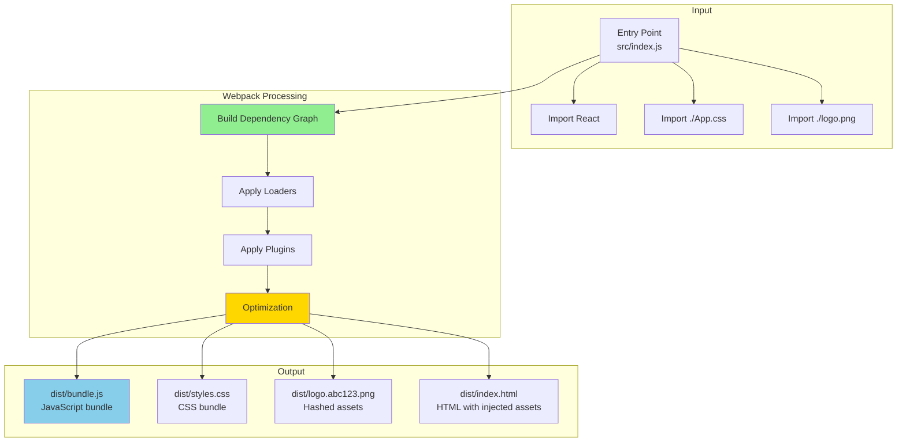
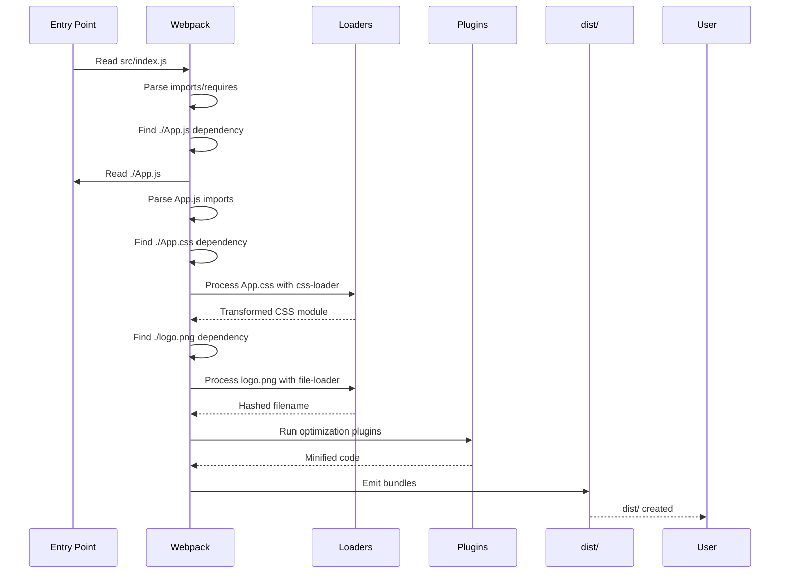
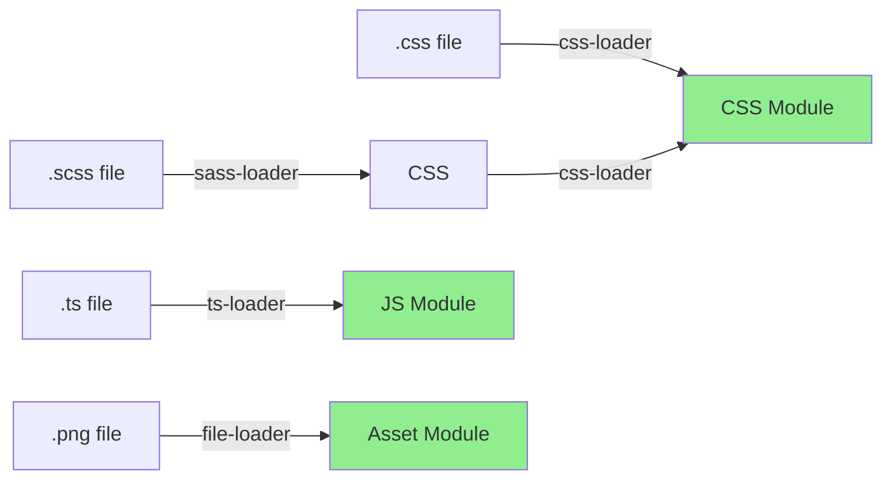
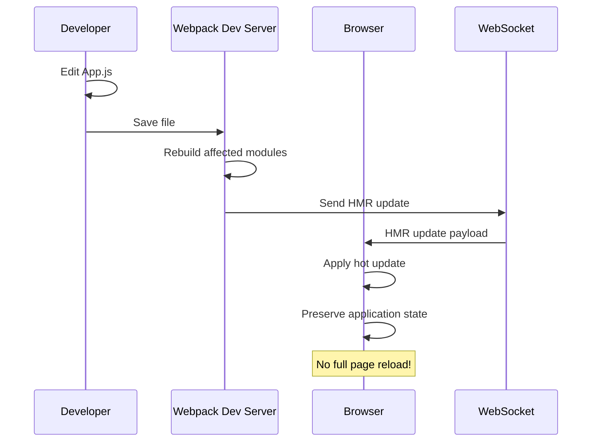

#web #webpack #web-bundler #javascript #module-bundler #nodejs #browser #build-tool #loaders #plugins
#code-splitting #tree-shaking #hot-module-replacement #asset-optimization
# Formal Definition
- Webpack is a <mark class="hltr-yellow">static module bundler</mark> for modern JavaScript applications.
- Webpack builds a <mark class="hltr-yellow">dependency graph</mark> that maps every module your project needs and generates one or more bundles.
- Webpack treats every file (JS, CSS, images, fonts) as a <mark class="hltr-yellow">module</mark> that can be imported.
# Webpack Architecture



## Dependency Graph Construction



# Components

## Entry Points
- Entry points tell Webpack where to start building the dependency graph.
### Single Entry
```javascript title='webpack.config.js - Single entry'
module.exports = {
  entry: './src/index.js',
  output: {
    filename: 'bundle.js',
    path: __dirname + '/dist'
  }
}
```
- The build result will be stored at `dist/bundle.js`
### Multiple Entries
```javascript title='webpack.config.js - Multiple entries'
module.exports = {
  entry: {
    app: './src/app.js',
    admin: './src/admin.js'
  },
  output: {
    filename: '[name].bundle.js',
    path: __dirname + '/dist'
  }
}
```
- The build results will be stored at `dist/app.bundle.js` and `dist/admin.bundle.js`
### Multi-Page Application
```javascript title='webpack.config.js - Multi-page app'
const path = require('path')
const HtmlWebpackPlugin = require('html-webpack-plugin')

module.exports = {
  entry: {
    home: './src/pages/home/index.js',
    about: './src/pages/about/index.js',
    contact: './src/pages/contact/index.js'
  },
  output: {
    filename: '[name].[contenthash].js',
    path: path.resolve(__dirname, 'dist'),
    clean: true
  },
  plugins: [
    new HtmlWebpackPlugin({
      template: './src/pages/home/index.html',
      filename: 'index.html',
      chunks: ['home']
    }),
    new HtmlWebpackPlugin({
      template: './src/pages/about/index.html',
      filename: 'about.html',
      chunks: ['about']
    }),
    new HtmlWebpackPlugin({
      template: './src/pages/contact/index.html',
      filename: 'contact.html',
      chunks: ['contact']
    })
  ]
}
```

## 2. Output

Output tells Webpack where to emit bundles and how to name them.

### Basic Output
```javascript title='webpack.config.js - Basic output'
const path = require('path')

module.exports = {
  output: {
    filename: 'bundle.js',
    path: path.resolve(__dirname, 'dist')
  }
}
```

### Hashed Filenames (Cache Busting)
```javascript title='webpack.config.js - Content hashing'
module.exports = {
  output: {
    filename: '[name].[contenthash].js',
    chunkFilename: '[name].[contenthash].chunk.js',
    assetModuleFilename: 'assets/[name].[hash][ext]',
    path: path.resolve(__dirname, 'dist'),
    clean: true  // Clean dist/ before build
  }
}
```

**Result:**
```
dist/
├── main.abc123def.js
├── vendor.xyz789abc.chunk.js
├── assets/
│   ├── logo.a1b2c3d4.png
│   └── font.e5f6g7h8.woff2
└── index.html
```

### Public Path (CDN)
```javascript title='webpack.config.js - CDN assets'
module.exports = {
  output: {
    filename: '[name].[contenthash].js',
    path: path.resolve(__dirname, 'dist'),
    publicPath: 'https://cdn.example.com/assets/'
  }
}
```

**Generated HTML:**
```html
<script src="https://cdn.example.com/assets/main.abc123.js"></script>
```

## 3. Loaders

Loaders transform files into modules that Webpack can process.



### JavaScript/TypeScript Loaders

**Babel Loader (ES6+ → ES5):**
```javascript title='webpack.config.js - Babel loader'
module.exports = {
  module: {
    rules: [
      {
        test: /\.jsx?$/,
        exclude: /node_modules/,
        use: {
          loader: 'babel-loader',
          options: {
            presets: [
              '@babel/preset-env',
              '@babel/preset-react'
            ],
            plugins: [
              '@babel/plugin-transform-runtime'
            ]
          }
        }
      }
    ]
  }
}
```

**TypeScript Loader:**
```javascript title='webpack.config.js - TypeScript'
module.exports = {
  module: {
    rules: [
      {
        test: /\.tsx?$/,
        use: 'ts-loader',
        exclude: /node_modules/
      }
    ]
  },
  resolve: {
    extensions: ['.tsx', '.ts', '.js']
  }
}
```

### CSS Loaders

**CSS Loader Chain:**
```javascript title='webpack.config.js - CSS processing'
const MiniCssExtractPlugin = require('mini-css-extract-plugin')

module.exports = {
  module: {
    rules: [
      {
        test: /\.css$/,
        use: [
          MiniCssExtractPlugin.loader,  // 3. Extract to separate file
          'css-loader',                 // 2. Convert CSS to JS module
          'postcss-loader'              // 1. Process with PostCSS
        ]
      }
    ]
  },
  plugins: [
    new MiniCssExtractPlugin({
      filename: '[name].[contenthash].css'
    })
  ]
}
```

**Loader execution order:** Right to left (bottom to top)

**SASS/SCSS Loader:**
```javascript title='webpack.config.js - SASS processing'
module.exports = {
  module: {
    rules: [
      {
        test: /\.s[ac]ss$/,
        use: [
          MiniCssExtractPlugin.loader,
          'css-loader',
          'postcss-loader',
          'sass-loader'
        ]
      }
    ]
  }
}
```

**CSS Modules:**
```javascript title='webpack.config.js - CSS Modules'
module.exports = {
  module: {
    rules: [
      {
        test: /\.module\.css$/,
        use: [
          'style-loader',
          {
            loader: 'css-loader',
            options: {
              modules: {
                localIdentName: '[name]__[local]___[hash:base64:5]'
              }
            }
          }
        ]
      }
    ]
  }
}
```

**Usage:**
```javascript title='Button.jsx - CSS Modules'
import styles from './Button.module.css'

function Button() {
  return <button className={styles.primary}>Click me</button>
}

// Generated class: Button__primary___a1b2c
```

### Asset Loaders

**File Loader (Images, Fonts):**
```javascript title='webpack.config.js - Asset modules'
module.exports = {
  module: {
    rules: [
      {
        test: /\.(png|svg|jpg|jpeg|gif)$/i,
        type: 'asset/resource',
        generator: {
          filename: 'images/[name].[hash][ext]'
        }
      },
      {
        test: /\.(woff|woff2|eot|ttf|otf)$/i,
        type: 'asset/resource',
        generator: {
          filename: 'fonts/[name].[hash][ext]'
        }
      }
    ]
  }
}
```

**Asset Types:**
- `asset/resource`: Emit separate file, return URL
- `asset/inline`: Inline as data URI (base64)
- `asset/source`: Inline as string
- `asset`: Automatic choice based on file size

```javascript title='webpack.config.js - Auto asset handling'
module.exports = {
  module: {
    rules: [
      {
        test: /\.(png|jpg|gif)$/i,
        type: 'asset',
        parser: {
          dataUrlCondition: {
            maxSize: 8 * 1024  // 8KB - inline if smaller
          }
        }
      }
    ]
  }
}
```

## 4. Plugins

Plugins perform tasks on the entire bundle (optimization, injection, environment variables).

### Essential Plugins

**HtmlWebpackPlugin (Generate HTML):**
```javascript title='webpack.config.js - HTML generation'
const HtmlWebpackPlugin = require('html-webpack-plugin')

module.exports = {
  plugins: [
    new HtmlWebpackPlugin({
      template: './src/index.html',
      filename: 'index.html',
      inject: 'body',
      minify: {
        removeComments: true,
        collapseWhitespace: true
      }
    })
  ]
}
```

**Input:** `src/index.html`
```html
<!DOCTYPE html>
<html>
<head>
  <title>My App</title>
</head>
<body>
  <div id="root"></div>
</body>
</html>
```

**Output:** `dist/index.html`
```html
<!DOCTYPE html>
<html>
<head>
  <title>My App</title>
  <link href="main.abc123.css" rel="stylesheet">
</head>
<body>
  <div id="root"></div>
  <script src="main.abc123.js"></script>
</body>
</html>
```

**MiniCssExtractPlugin (Extract CSS):**
```javascript title='webpack.config.js - CSS extraction'
const MiniCssExtractPlugin = require('mini-css-extract-plugin')

module.exports = {
  plugins: [
    new MiniCssExtractPlugin({
      filename: '[name].[contenthash].css',
      chunkFilename: '[id].[contenthash].css'
    })
  ]
}
```

**DefinePlugin (Environment Variables):**
```javascript title='webpack.config.js - Environment variables'
const webpack = require('webpack')

module.exports = {
  plugins: [
    new webpack.DefinePlugin({
      'process.env.NODE_ENV': JSON.stringify('production'),
      'process.env.API_URL': JSON.stringify('https://api.example.com'),
      __VERSION__: JSON.stringify('1.0.0')
    })
  ]
}
```

**Usage in code:**
```javascript
console.log(process.env.API_URL)  // https://api.example.com
console.log(__VERSION__)           // 1.0.0
```

**CleanWebpackPlugin (Clean dist/):**
```javascript title='webpack.config.js - Clean output'
const { CleanWebpackPlugin } = require('clean-webpack-plugin')

module.exports = {
  plugins: [
    new CleanWebpackPlugin()
  ]
}
```

**CopyWebpackPlugin (Copy static assets):**
```javascript title='webpack.config.js - Copy files'
const CopyWebpackPlugin = require('copy-webpack-plugin')

module.exports = {
  plugins: [
    new CopyWebpackPlugin({
      patterns: [
        { from: 'public/robots.txt', to: 'robots.txt' },
        { from: 'public/favicon.ico', to: 'favicon.ico' }
      ]
    })
  ]
}
```

## 5. Mode

Mode enables built-in optimizations for development or production.

```javascript title='webpack.config.js - Mode configuration'
module.exports = {
  mode: 'production',  // or 'development' or 'none'
}
```

| Mode          | Optimizations Enabled                      |
| ------------- | ------------------------------------------ |
| `development` | Fast builds, detailed errors, source maps  |
| `production`  | Minification, tree shaking, scope hoisting |
| `none`        | No built-in optimizations                  |

**Development Mode:**
- Fast rebuild times
- Detailed error messages
- Source maps enabled
- No minification

**Production Mode:**
- Minification (TerserPlugin)
- Dead code elimination (Tree Shaking)
- Scope hoisting (ModuleConcatenationPlugin)
- Deterministic chunk IDs

# Advanced Configuration

## Complete Production Configuration

```javascript title='webpack.config.js - Production-ready'
const path = require('path')
const HtmlWebpackPlugin = require('html-webpack-plugin')
const MiniCssExtractPlugin = require('mini-css-extract-plugin')
const CssMinimizerPlugin = require('css-minimizer-webpack-plugin')
const TerserPlugin = require('terser-webpack-plugin')
const { BundleAnalyzerPlugin } = require('webpack-bundle-analyzer')

module.exports = {
  mode: 'production',
  entry: {
    app: './src/index.js'
  },
  output: {
    filename: '[name].[contenthash].js',
    chunkFilename: '[name].[contenthash].chunk.js',
    assetModuleFilename: 'assets/[name].[hash][ext]',
    path: path.resolve(__dirname, 'dist'),
    clean: true,
    publicPath: '/'
  },

  module: {
    rules: [
      // JavaScript/JSX
      {
        test: /\.jsx?$/,
        exclude: /node_modules/,
        use: {
          loader: 'babel-loader',
          options: {
            presets: [
              ['@babel/preset-env', {
                targets: '> 0.25%, not dead',
                useBuiltIns: 'usage',
                corejs: 3
              }],
              ['@babel/preset-react', { runtime: 'automatic' }]
            ]
          }
        }
      },

      // TypeScript
      {
        test: /\.tsx?$/,
        use: 'ts-loader',
        exclude: /node_modules/
      },

      // CSS
      {
        test: /\.css$/,
        use: [
          MiniCssExtractPlugin.loader,
          'css-loader',
          'postcss-loader'
        ]
      },

      // SASS/SCSS
      {
        test: /\.s[ac]ss$/,
        use: [
          MiniCssExtractPlugin.loader,
          'css-loader',
          'postcss-loader',
          'sass-loader'
        ]
      },

      // Images
      {
        test: /\.(png|svg|jpg|jpeg|gif)$/i,
        type: 'asset',
        parser: {
          dataUrlCondition: {
            maxSize: 8 * 1024
          }
        },
        generator: {
          filename: 'images/[name].[hash][ext]'
        }
      },

      // Fonts
      {
        test: /\.(woff|woff2|eot|ttf|otf)$/i,
        type: 'asset/resource',
        generator: {
          filename: 'fonts/[name].[hash][ext]'
        }
      }
    ]
  },

  plugins: [
    new HtmlWebpackPlugin({
      template: './src/index.html',
      minify: {
        removeComments: true,
        collapseWhitespace: true,
        removeRedundantAttributes: true,
        useShortDoctype: true,
        removeEmptyAttributes: true,
        removeStyleLinkTypeAttributes: true,
        keepClosingSlash: true,
        minifyJS: true,
        minifyCSS: true,
        minifyURLs: true
      }
    }),

    new MiniCssExtractPlugin({
      filename: '[name].[contenthash].css',
      chunkFilename: '[id].[contenthash].css'
    }),

    // Analyze bundle size
    new BundleAnalyzerPlugin({
      analyzerMode: 'static',
      openAnalyzer: false,
      reportFilename: 'bundle-report.html'
    })
  ],

  optimization: {
    minimize: true,
    minimizer: [
      new TerserPlugin({
        terserOptions: {
          compress: {
            drop_console: true,
            drop_debugger: true
          }
        }
      }),
      new CssMinimizerPlugin()
    ],

    // Code splitting
    splitChunks: {
      chunks: 'all',
      cacheGroups: {
        vendor: {
          test: /[\\/]node_modules[\\/]/,
          name: 'vendors',
          priority: 10
        },
        react: {
          test: /[\\/]node_modules[\\/](react|react-dom)[\\/]/,
          name: 'react',
          priority: 20
        }
      }
    },

    // Runtime chunk
    runtimeChunk: 'single'
  },

  resolve: {
    extensions: ['.tsx', '.ts', '.jsx', '.js'],
    alias: {
      '@': path.resolve(__dirname, 'src'),
      '@components': path.resolve(__dirname, 'src/components'),
      '@utils': path.resolve(__dirname, 'src/utils')
    }
  },

  performance: {
    hints: 'warning',
    maxEntrypointSize: 512000,
    maxAssetSize: 512000
  }
}
```

## Development Configuration

```javascript title='webpack.config.dev.js'
const path = require('path')
const HtmlWebpackPlugin = require('html-webpack-plugin')
const ReactRefreshWebpackPlugin = require('@pmmmwh/react-refresh-webpack-plugin')

module.exports = {
  mode: 'development',
  entry: './src/index.js',
  output: {
    filename: '[name].js',
    path: path.resolve(__dirname, 'dist'),
    publicPath: '/'
  },

  devtool: 'eval-source-map',

  devServer: {
    static: {
      directory: path.join(__dirname, 'public')
    },
    compress: true,
    port: 3000,
    open: true,
    hot: true,
    historyApiFallback: true,
    proxy: {
      '/api': {
        target: 'http://localhost:8080',
        pathRewrite: { '^/api': '' },
        changeOrigin: true
      }
    }
  },

  module: {
    rules: [
      {
        test: /\.jsx?$/,
        exclude: /node_modules/,
        use: {
          loader: 'babel-loader',
          options: {
            presets: [
              '@babel/preset-env',
              '@babel/preset-react'
            ],
            plugins: [
              'react-refresh/babel'
            ]
          }
        }
      },
      {
        test: /\.css$/,
        use: ['style-loader', 'css-loader']
      }
    ]
  },

  plugins: [
    new HtmlWebpackPlugin({
      template: './src/index.html'
    }),
    new ReactRefreshWebpackPlugin()
  ]
}
```

# Code Splitting

Code splitting splits code into smaller chunks loaded on-demand.

## 1. Entry Point Splitting

```javascript title='webpack.config.js - Multiple entries'
module.exports = {
  entry: {
    app: './src/app.js',
    admin: './src/admin.js'
  }
}
```

## 2. Dynamic Imports (Route-based)

```javascript title='Router.jsx - Lazy loading routes'
import { lazy, Suspense } from 'react'
import { BrowserRouter, Routes, Route } from 'react-router-dom'

// Dynamic imports - separate chunks
const Home = lazy(() => import('./pages/Home'))
const Dashboard = lazy(() => import('./pages/Dashboard'))
const Profile = lazy(() => import('./pages/Profile'))

function Router() {
  return (
    <BrowserRouter>
      <Suspense fallback={<div>Loading...</div>}>
        <Routes>
          <Route path="/" element={<Home />} />
          <Route path="/dashboard" element={<Dashboard />} />
          <Route path="/profile" element={<Profile />} />
        </Routes>
      </Suspense>
    </BrowserRouter>
  )
}
```

**Build output:**
```
dist/
├── main.abc123.js           # Main bundle (router code)
├── 0.def456.chunk.js        # Home page chunk
├── 1.ghi789.chunk.js        # Dashboard page chunk
└── 2.jkl012.chunk.js        # Profile page chunk
```

## 3. SplitChunksPlugin (Vendor splitting)

```javascript title='webpack.config.js - Vendor chunk splitting'
module.exports = {
  optimization: {
    splitChunks: {
      chunks: 'all',
      cacheGroups: {
        // Vendor libraries
        vendor: {
          test: /[\\/]node_modules[\\/]/,
          name: 'vendors',
          priority: 10,
          reuseExistingChunk: true
        },

        // React libraries separate
        react: {
          test: /[\\/]node_modules[\\/](react|react-dom|react-router-dom)[\\/]/,
          name: 'react-vendors',
          priority: 20
        },

        // Common code shared between pages
        common: {
          minChunks: 2,
          priority: 5,
          reuseExistingChunk: true,
          enforce: true
        }
      }
    },

    // Runtime code in separate chunk
    runtimeChunk: 'single'
  }
}
```

**Build output:**
```
dist/
├── main.abc123.js            # Application code
├── react-vendors.def456.js   # React, ReactDOM, React Router
├── vendors.ghi789.js         # Other vendor libraries
├── common.jkl012.js          # Shared code between routes
└── runtime.mno345.js         # Webpack runtime
```

## 4. Magic Comments (Webpack hints)

```javascript title='Component.jsx - Magic comments for chunks'
// Prefetch - load during idle time
import(
  /* webpackPrefetch: true */
  /* webpackChunkName: "analytics" */
  './analytics'
)

// Preload - load in parallel with parent
import(
  /* webpackPreload: true */
  /* webpackChunkName: "chat-widget" */
  './ChatWidget'
)

// Bundle size limit
import(
  /* webpackChunkName: "large-lib" */
  /* webpackMode: "lazy" */
  'large-library'
)
```

**Generated HTML:**
```html
<!-- Prefetch: low priority, load when idle -->
<link rel="prefetch" href="analytics.chunk.js">

<!-- Preload: high priority, load in parallel -->
<link rel="preload" href="chat-widget.chunk.js" as="script">
```

# Tree Shaking

Tree shaking eliminates dead code from bundles.

## How Tree Shaking Works

```mermaid
graph TB
    subgraph "Source Code"
        S1[utils.js<br/>export usedFn<br/>export unusedFn]
        S2[app.js<br/>import { usedFn } from './utils']
    end

    subgraph "Webpack Analysis"
        A1[Mark usedFn: USED]
        A2[Mark unusedFn: UNUSED]
    end

    subgraph "Output Bundle"
        O1[bundle.js<br/>Contains: usedFn<br/>Removed: unusedFn]
    end

    S1 --> A1
    S1 --> A2
    S2 --> A1
    A1 --> O1
    A2 -.removed.-> O1

    style A2 fill:#FF6347
    style O1 fill:#90EE90
```

## Requirements for Tree Shaking

1. **ES6 Module Syntax (ESM)**
```javascript
// ✅ GOOD - Tree shakeable
export function used() { }
export function unused() { }

// ❌ BAD - Not tree shakeable
module.exports = {
  used: function() { },
  unused: function() { }
}
```

2. **Side-effect-free modules**

```json title='package.json - Mark side-effect-free modules'
{
  "name": "my-library",
  "sideEffects": false  // All modules are side-effect-free
}
```

```json title='package.json - Mark files with side effects'
{
  "sideEffects": [
    "*.css",
    "*.scss",
    "./src/polyfills.js"
  ]
}
```

3. **Production mode**
```javascript
module.exports = {
  mode: 'production'  // Enables tree shaking
}
```

## Tree Shaking Example

**utils.js:**
```javascript title='utils.js - Export multiple functions'
export function add(a, b) {
  return a + b
}

export function subtract(a, b) {
  return a - b
}

export function multiply(a, b) {
  return a * b
}

export function divide(a, b) {
  return a / b
}
```

**app.js:**
```javascript title='app.js - Import only one function'
import { add } from './utils'

console.log(add(2, 3))
```

**Build output (production):**
```javascript
// Only 'add' function included
// subtract, multiply, divide: REMOVED
(()=>{"use strict";console.log(2+3)})();
```

## Analyzing Bundle (Find Dead Code)

```bash
# Install webpack-bundle-analyzer
npm install --save-dev webpack-bundle-analyzer
```

```javascript title='webpack.config.js - Bundle analyzer'
const { BundleAnalyzerPlugin } = require('webpack-bundle-analyzer')

module.exports = {
  plugins: [
    new BundleAnalyzerPlugin({
      analyzerMode: 'static',
      reportFilename: 'bundle-report.html',
      openAnalyzer: true
    })
  ]
}
```

**Output visualization:**
```
┌─────────────────────────────────────────────┐
│ Bundle Size: 342.5 KB                       │
├─────────────────────────────────────────────┤
│ node_modules/                  280 KB      │
│  ├─ react                       42 KB      │
│  ├─ react-dom                  112 KB      │
│  ├─ lodash (UNUSED PARTS!)      89 KB      │
│  └─ other                       37 KB      │
├─────────────────────────────────────────────┤
│ src/                            62.5 KB     │
│  ├─ components/                 38 KB      │
│  ├─ utils/                      12 KB      │
│  └─ pages/                      12.5 KB    │
└─────────────────────────────────────────────┘
```

# Hot Module Replacement (HMR)

HMR updates modules without full page reload.



## HMR Configuration

```javascript title='webpack.config.js - Enable HMR'
module.exports = {
  devServer: {
    hot: true,  // Enable HMR
    liveReload: false  // Disable fallback to live reload
  }
}
```

## React Fast Refresh (React HMR)

```bash
npm install -D @pmmmwh/react-refresh-webpack-plugin react-refresh
```

```javascript title='webpack.config.js - React Fast Refresh'
const ReactRefreshWebpackPlugin = require('@pmmmwh/react-refresh-webpack-plugin')

module.exports = {
  mode: 'development',
  devServer: {
    hot: true
  },
  module: {
    rules: [
      {
        test: /\.jsx?$/,
        exclude: /node_modules/,
        use: {
          loader: 'babel-loader',
          options: {
            plugins: ['react-refresh/babel']
          }
        }
      }
    ]
  },
  plugins: [
    new ReactRefreshWebpackPlugin()
  ]
}
```

**HMR behavior:**
```javascript
// Edit this component
function Counter() {
  const [count, setCount] = useState(0)

  return (
    <div>
      <p>Count: {count}</p>
      <button onClick={() => setCount(count + 1)}>Increment</button>
    </div>
  )
}

// User clicks button to count = 5
// Developer changes button text
// HMR updates component
// State preserved: count still = 5
```

# Performance Optimization

## 1. Build Performance

### Parallel Processing
```javascript title='webpack.config.js - Parallel builds'
const TerserPlugin = require('terser-webpack-plugin')
const os = require('os')

module.exports = {
  optimization: {
    minimizer: [
      new TerserPlugin({
        parallel: os.cpus().length - 1
      })
    ]
  }
}
```

### Cache
```javascript title='webpack.config.js - Persistent cache'
module.exports = {
  cache: {
    type: 'filesystem',
    cacheDirectory: path.resolve(__dirname, '.webpack-cache')
  }
}
```

**First build:**
```
Time: 12.3s
```

**Subsequent builds (cached):**
```
Time: 1.8s (85% faster)
```

### Exclude node_modules from loaders
```javascript
module.exports = {
  module: {
    rules: [
      {
        test: /\.js$/,
        exclude: /node_modules/,  // Don't transpile dependencies
        use: 'babel-loader'
      }
    ]
  }
}
```

## 2. Bundle Size Optimization

### Minification
```javascript title='webpack.config.js - Aggressive minification'
const TerserPlugin = require('terser-webpack-plugin')
const CssMinimizerPlugin = require('css-minimizer-webpack-plugin')

module.exports = {
  optimization: {
    minimize: true,
    minimizer: [
      new TerserPlugin({
        terserOptions: {
          compress: {
            drop_console: true,
            drop_debugger: true,
            pure_funcs: ['console.log', 'console.info']
          },
          mangle: true,
          format: {
            comments: false
          }
        },
        extractComments: false
      }),
      new CssMinimizerPlugin()
    ]
  }
}
```

### Compression (Gzip/Brotli)
```bash
npm install --save-dev compression-webpack-plugin
```

```javascript title='webpack.config.js - Compression'
const CompressionPlugin = require('compression-webpack-plugin')

module.exports = {
  plugins: [
    // Gzip
    new CompressionPlugin({
      algorithm: 'gzip',
      test: /\.(js|css|html|svg)$/,
      threshold: 10240,  // Only compress files > 10KB
      minRatio: 0.8
    }),

    // Brotli
    new CompressionPlugin({
      filename: '[path][base].br',
      algorithm: 'brotliCompress',
      test: /\.(js|css|html|svg)$/,
      compressionOptions: {
        level: 11
      },
      threshold: 10240,
      minRatio: 0.8
    })
  ]
}
```

**Output:**
```
dist/
├── main.abc123.js           (342 KB)
├── main.abc123.js.gz        (112 KB) - 67% smaller
└── main.abc123.js.br        (98 KB)  - 71% smaller
```

### Import on Interaction
```javascript title='Button.jsx - Load heavy module on click'
function Button() {
  const handleClick = async () => {
    // Load chart.js only when user clicks
    const Chart = await import('chart.js')
    Chart.default.render(data)
  }

  return <button onClick={handleClick}>Show Chart</button>
}
```

# Webpack vs Other Bundlers

| Feature                | Webpack            | Vite               | Rollup             | Parcel             |
| ---------------------- | ------------------ | ------------------ | ------------------ | ------------------ |
| **Dev Server Speed**   | Slow (bundles)     | ⚡ Fast (no bundle) | N/A                | Fast               |
| **Build Speed**        | Moderate           | Fast (Rollup)      | Fast               | Fast               |
| **Configuration**      | Complex            | Simple             | Moderate           | Zero-config        |
| **Plugin Ecosystem**   | ✅ Huge             | Growing            | Good               | Limited            |
| **Code Splitting**     | ✅ Advanced         | ✅ Advanced         | ✅ Good             | Automatic          |
| **Tree Shaking**       | ✅ Yes              | ✅ Yes              | ✅ Excellent        | ✅ Yes              |
| **HMR**                | ✅ Yes              | ⚡ Fast            | No                 | ✅ Yes              |
| **Learning Curve**     | Steep              | Gentle             | Moderate           | None               |
| **Use Case**           | Complex apps       | Modern SPAs        | Libraries          | Quick prototypes   |

## When to Use Webpack

**Choose Webpack:**
- Complex build requirements
- Need fine-grained control
- Large existing codebase
- Custom build pipelines
- Extensive plugin ecosystem needed

**Choose Vite:**
- New projects
- Modern frameworks (React, Vue, Svelte)
- Fast development experience priority

**Choose Rollup:**
- Building libraries (npm packages)
- Minimal bundle size critical

**Choose Parcel:**
- Prototyping
- Simple projects
- Zero configuration needed

# Migration to Webpack 5

## Breaking Changes from Webpack 4

```javascript title='webpack 4 → webpack 5 changes'
// ❌ Webpack 4
module.exports = {
  node: {
    fs: 'empty',
    net: 'empty'
  }
}

// ✅ Webpack 5
module.exports = {
  resolve: {
    fallback: {
      fs: false,
      net: false,
      crypto: require.resolve('crypto-browserify')
    }
  }
}
```

## Asset Modules Replace Loaders

```javascript
// ❌ Webpack 4 - file-loader, url-loader
{
  test: /\.(png|jpg|gif)$/,
  use: [
    {
      loader: 'file-loader',
      options: {}
    }
  ]
}

// ✅ Webpack 5 - asset modules
{
  test: /\.(png|jpg|gif)$/,
  type: 'asset/resource'
}
```

## Persistent Caching

```javascript title='webpack.config.js - Webpack 5 caching'
module.exports = {
  cache: {
    type: 'filesystem',
    buildDependencies: {
      config: [__filename]
    }
  }
}
```

**Performance improvement:**
- First build: 12s
- Cached rebuild: 1.5s

---

# References
1. https://webpack.js.org/ - Official Webpack documentation
2. https://webpack.js.org/concepts/ - Core concepts
3. https://webpack.js.org/configuration/ - Configuration reference
4. https://webpack.js.org/loaders/ - Loader reference
5. https://webpack.js.org/plugins/ - Plugin reference
6. https://webpack.js.org/api/ - API documentation
7. https://webpack.js.org/guides/code-splitting/ - Code splitting guide
8. https://webpack.js.org/guides/tree-shaking/ - Tree shaking guide
9. https://webpack.js.org/guides/hot-module-replacement/ - HMR guide
10. https://github.com/webpack/webpack - Webpack GitHub repository
