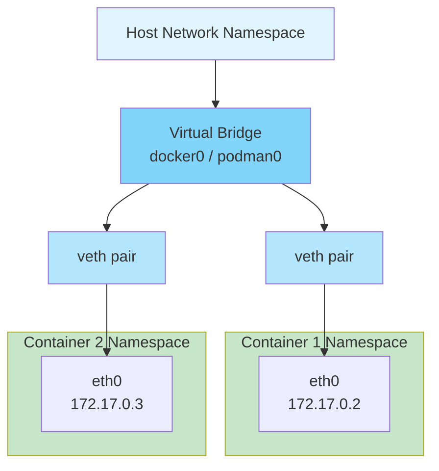
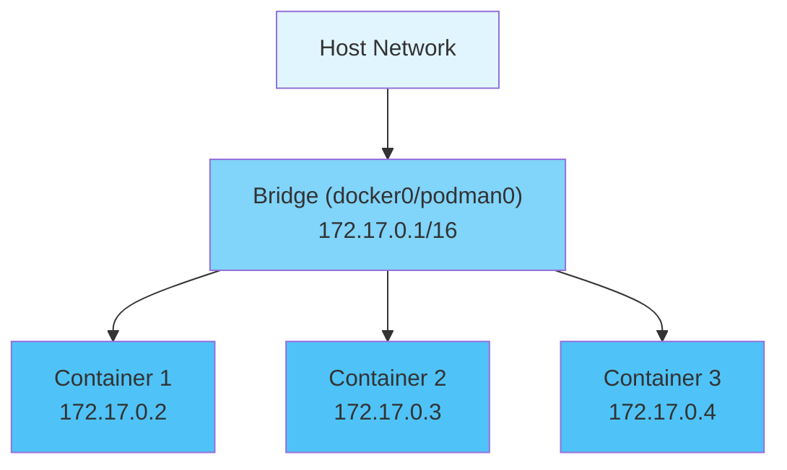
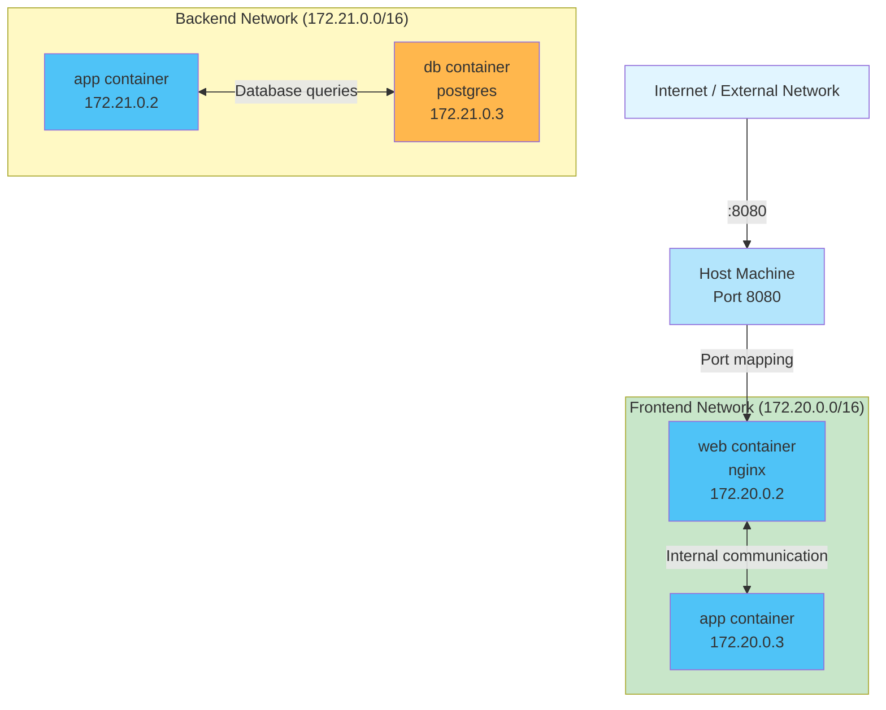
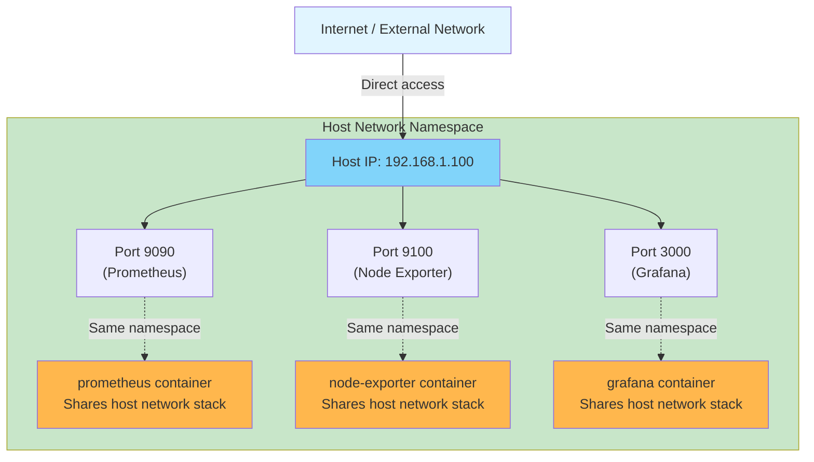
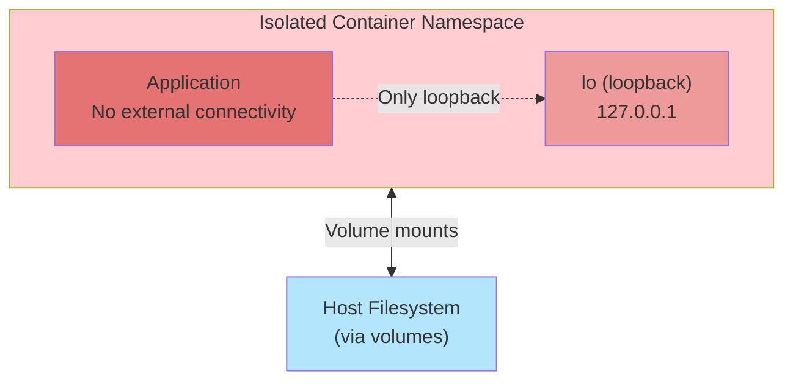
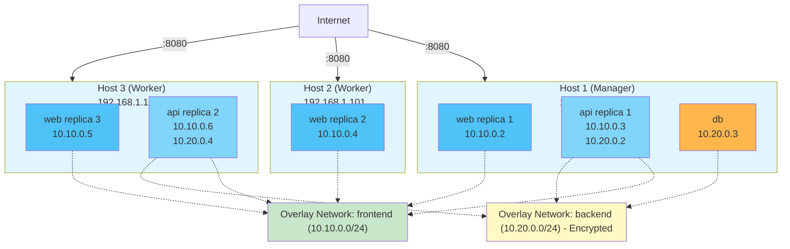
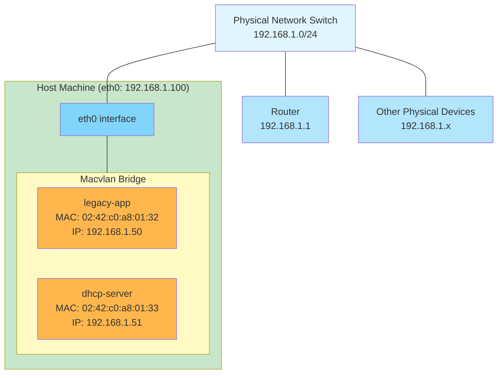
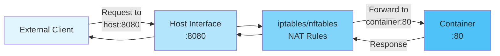

#containerization #docker #podman #computer-network #network-layer #transport-layer #application-layer
#site-realibility-engineering
# Overview
- Container engines provide <mark class="hltr-yellow">network isolation </mark>through Linux network namespaces.
- Multiple network drivers support different networking scenarios.
- Each container has its own network stack (interfaces, routing tables, firewall rules).
- Containers communicate via virtual ethernet (veth) pairs connecting namespaces.
# Network Namespace Isolation
## Concept
- Each container runs in separate ==network namespace==.
- Namespace provides isolated view of network stack including:
    - Network interfaces
    - IP addresses
    - Routing tables
    - Firewall rules (iptables/nftables)
    - Network statistics
## Communication Model


# Network Drivers
## bridge (Default)
- Creates <mark class="hltr-yellow">virtual bridge network</mark> on host.
- **Default Name**:
    - Docker: `docker0`
    - Podman: `podman0` (or CNI-managed bridge)
- **IP Range**: Default `172.17.0.0/16` (Docker), configurable
### Usecase
- Single-host container communication.
### Topology


### Characteristics
- Containers on same bridge can communicate directly
- *Port mapping* required for *external access* (`-p` flag)
- Automatic DNS resolution between containers (Docker)
- NAT for outbound connections
### Example
```Shell title='Imperative example'
# Docker - Create custom bridge network
docker network create --driver bridge \
  --subnet 172.18.0.0/16 \
  --gateway 172.18.0.1 \
  mybridge

# List networks
docker network ls

# Run containers on custom bridge
docker run -d --name web --network mybridge nginx
docker run -d --name app --network mybridge alpine sleep 3600

# Inspect network
docker network inspect mybridge

# Connect existing container to network
docker network connect mybridge existing_container

# Disconnect container
docker network disconnect mybridge existing_container

# Remove network
docker network rm mybridge

# Podman - Same commands work with podman
podman network create mybridge
podman run -d --name web --network mybridge nginx
```


```yaml title='Declarative example'
# compose.yaml - Bridge network example
services:
  web:
    image: nginx:latest
    container_name: web
    networks:
      - frontend
    ports:
      - "8080:80"

  app:
    image: node:latest
    container_name: app
    networks:
      - frontend
      - backend
    depends_on:
      - web
      - db

  db:
    image: postgres:15
    container_name: db
    networks:
      - backend
    environment:
      POSTGRES_PASSWORD: secretpassword

networks:
  frontend:
    driver: bridge
    ipam:
      driver: default
      config:
        - subnet: 172.20.0.0/16
          gateway: 172.20.0.1

  backend:
    driver: bridge
    ipam:
      driver: default
      config:
        - subnet: 172.21.0.0/16
          gateway: 172.21.0.1
```

### Topology


- The `app` container connects to both networks, acting as a bridge
- `web` and `db` are isolated from each other (different networks)
- External access only to `web` via port mapping
- Internal DNS: containers resolve each other by service name.
### Container communication
- Containers on the same bridge network can communicate using multiple methods.
#### Container name - DNS resolution
```Shell title='Container name for container communication'
# Create bridge network
docker network create mybridge

# Start nginx container
docker run -d --name web --network mybridge nginx

# Start app container and ping web container
docker run --rm --network mybridge alpine ping web
# Resolves to web container's IP (e.g., 172.18.0.2)

# Access web server from app container
docker run --rm --network mybridge alpine wget -O- http://web:80
```
#### Service name
```yaml title='Service name for container communication'
# compose.yaml
services:
  web:
    image: nginx:latest
    networks:
      - mynet

  app:
    image: node:latest
    networks:
      - mynet
    environment:
      # Access web server using service name
      - WEB_URL=http://web:80
    command: sh -c "curl http://web:80"

networks:
  mynet:
    driver: bridge
```
#### Network alias
```Shell title='Network alias for container communication'
# Run container with network alias
docker run -d --name web \
  --network mybridge \
  --network-alias webserver \
  --network-alias api \
  nginx

# Access using any alias
docker run --rm --network mybridge alpine wget http://webserver:80
docker run --rm --network mybridge alpine wget http://api:80
```
##### IP address
```Shell title='IP address for container communication'
# Inspect container to get IP
docker inspect web -f '{{range.NetworkSettings.Networks}}{{.IPAddress}}{{end}}'
# Output: 172.18.0.2

# Access using IP (not recommended - IP can change)
docker run --rm --network mybridge alpine wget http://172.18.0.2:80
```
#### `host.docker.internal`
- `host.docker.internal` only allows simplex access from *container to host services*.
```Shell title='host.docker.internal help access from container to host'
# This is for accessing HOST machine services, NOT other containers
# Example: Host is running PostgreSQL on port 5432

# From container, access host service
docker run --rm --network mybridge alpine ping host.docker.internal

# Example: Access database on host
docker run --rm --network mybridge postgres:15 \
  psql -h host.docker.internal -p 5432 -U postgres

# Note: host.docker.internal is NOT for container-to-container communication
```

```yaml title='host.docker.internal for access from container to host services'
# compose.yaml - Demonstrating all communication methods
services:
  nginx:
    image: nginx:latest
    container_name: nginx
    networks:
      app-network:
        aliases:
          - webserver
          - frontend
    ports:
      - "8080:80"

  api:
    image: node:18
    container_name: api
    networks:
      - app-network
    environment:
      # Method 1: Service name
      - NGINX_URL=http://nginx:80
      # Method 2: Network alias
      - WEB_URL=http://webserver:80
      # Method 3: Access host service
      - DB_HOST=host.docker.internal
      - DB_PORT=5432

  worker:
    image: python:3.11
    container_name: worker
    networks:
      - app-network
    command: >
      sh -c "
        echo 'Testing communication methods:' &&
        echo '1. Service name:' && curl -s http://nginx:80 | head -n 1 &&
        echo '2. Network alias:' && curl -s http://webserver:80 | head -n 1 &&
        echo '3. Another alias:' && curl -s http://frontend:80 | head -n 1 &&
        echo '4. Host machine:' && ping -c 1 host.docker.internal
      "

networks:
  app-network:
    driver: bridge
    ipam:
      config:
        - subnet: 172.25.0.0/16
```
## host
-  Container uses ==host network directly==
- No network isolation $\implies$ container sees all host interfaces
- Better performance (no bridge overhead) but can lead to port conflicts.
### Usecase
- Maximum network performance, monitoring tools.
### Characteristics
- Container binds ports directly to host.
- Access to all host network interfaces.
- No IP address translation (NAT).
### Example
```Shell title='Container networking with host mode'
# Docker - Run container with host networking
docker run -d --name nginx-host --network host nginx

# No port mapping needed - nginx binds directly to host port 80
# Access via: http://localhost:80

# Podman - Same concept
podman run -d --name nginx-host --network host nginx

# List networks (host is always available)
docker network ls

# Inspect host network
docker network inspect host
```

```yaml title='Container networking with host mode'
# compose.yaml - Host network example
services:
  prometheus:
    image: prom/prometheus:latest
    container_name: prometheus
    network_mode: host
    volumes:
      - ./prometheus.yml:/etc/prometheus/prometheus.yml
      - prometheus-data:/prometheus
    command:
      - '--config.file=/etc/prometheus/prometheus.yml'
      - '--storage.tsdb.path=/prometheus'

  node-exporter:
    image: prom/node-exporter:latest
    container_name: node-exporter
    network_mode: host
    pid: host
    restart: unless-stopped

  grafana:
    image: grafana/grafana:latest
    container_name: grafana
    network_mode: host
    environment:
      - GF_SECURITY_ADMIN_PASSWORD=admin
    volumes:
      - grafana-data:/var/lib/grafana

volumes:
  prometheus-data:
  grafana-data:
```
### Topology


- No port mapping syntax needed (`-p` flag ignored).
- Containers bind directly to host ports.
- All containers share same network namespace.
- Port conflicts possible if multiple containers use same port.
- Access via host IP address: `http://192.168.1.100:9090`.
## none
- Disables all external networking.
- Interfaces: Only loopback (`127.0.0.1`) available
### Usecase
- Isolated workloads, security-sensitive applications.
### Example
```Shell title='Disable container networking with none mode'
# Docker - Run container with no network
docker run -d --name isolated --network none alpine sleep 3600

# Container has only loopback interface
docker exec isolated ip addr
# Output shows only 'lo' interface

# Podman - Same concept
podman run -d --name isolated --network none alpine sleep 3600

# Inspect none network
docker network inspect none
```

```yaml title='Disable container networking with none mode'
# compose.yaml - None network example
services:
  batch-processor:
    image: python:3.11
    container_name: batch-processor
    network_mode: none
    volumes:
      - ./data:/app/data
      - ./scripts:/app/scripts
    command: python /app/scripts/process.py
    restart: "no"

  secret-generator:
    image: alpine:latest
    container_name: secret-generator
    network_mode: none
    volumes:
      - ./secrets:/secrets
    command: sh -c "dd if=/dev/urandom of=/secrets/key.bin bs=32 count=1"

  offline-backup:
    image: postgres:15
    container_name: offline-backup
    network_mode: none
    volumes:
      - ./backups:/backups
      - postgres-data:/var/lib/postgresql/data:ro
    command: pg_dump -Fc mydb > /backups/backup.dump

volumes:
  postgres-data:
```
### Topology

- Complete network isolation - no external connectivity
- Only loopback interface (127.0.0.1) available
- Useful for batch processing, offline tasks, security-sensitive operations
- Can still access host filesystem via volume mounts
- No DNS resolution, no internet access
## overlay (Docker Swarm)
- Multi-host networking for ==Docker Swarm clusters==
- **Technology**: VXLAN encapsulation for cross-host communication
- **Encryption**: Optional IPsec encryption
- **Use Case**: Multi-host container orchestration
- **Scope**: Swarm services
### Feature
- Containers on different hosts communicate seamlessly
- Automatic service discovery
- Load balancing across replicas
- Encrypted control plane
### Example
```Shell title='Imperative example'
# Initialize Docker Swarm (on manager node)
docker swarm init --advertise-addr 192.168.1.100

# Create overlay network
docker network create \
  --driver overlay \
  --subnet 10.10.0.0/16 \
  --gateway 10.10.0.1 \
  --attachable \
  myoverlay

# List networks
docker network ls

# Create service on overlay network
docker service create \
  --name web \
  --network myoverlay \
  --replicas 3 \
  --publish 8080:80 \
  nginx

# Inspect overlay network
docker network inspect myoverlay

# Create encrypted overlay network
docker network create \
  --driver overlay \
  --opt encrypted=true \
  secure-overlay

# Remove network (remove services first)
docker service rm web
docker network rm myoverlay
```

```yaml
# compose.yaml - Overlay network example (deploy with: docker stack deploy)
version: "3.8"

services:
  web:
    image: nginx:latest
    networks:
      - frontend
    ports:
      - "8080:80"
    deploy:
      replicas: 3
      placement:
        max_replicas_per_node: 1
      update_config:
        parallelism: 1
        delay: 10s

  api:
    image: node:latest
    networks:
      - frontend
      - backend
    environment:
      - DB_HOST=db
    deploy:
      replicas: 2
      placement:
        constraints:
          - node.role == worker

  db:
    image: postgres:15
    networks:
      - backend
    environment:
      POSTGRES_PASSWORD: secretpassword
    volumes:
      - db-data:/var/lib/postgresql/data
    deploy:
      replicas: 1
      placement:
        constraints:
          - node.role == manager

networks:
  frontend:
    driver: overlay
    attachable: true
    ipam:
      driver: default
      config:
        - subnet: 10.10.0.0/24

  backend:
    driver: overlay
    driver_opts:
      encrypted: "true"
    ipam:
      driver: default
      config:
        - subnet: 10.20.0.0/24

volumes:
  db-data:
```
### Topology

- Spans multiple Docker hosts in a Swarm cluster.
- VXLAN encapsulation for cross-host communication.
- Built-in load balancing across service replicas.
- Optional encryption with `--opt encrypted=true`
- Automatic service discovery via DNS.
- Requires Docker Swarm mode.
## macvlan
- **Description**: Assigns ==MAC address== to container
- **Visibility**: Container appears as physical device on network
- **Use Case**: Legacy applications requiring direct network access
- **Limitation**: Requires promiscuous mode on host interface
**Modes:**
- **Bridge Mode**: Virtual bridge for container communication
- **802.1Q Trunk**: VLAN tagging support
- **IPVLAN**: Alternative to MACVLAN with shared MAC
### Example
```Shell title='macvlan example'
# Docker - Create macvlan network
docker network create -d macvlan \
  --subnet=192.168.1.0/24 \
  --gateway=192.168.1.1 \
  -o parent=eth0 \
  mymacvlan

# Run container with macvlan (gets IP on physical network)
docker run -d --name web \
  --network mymacvlan \
  --ip 192.168.1.50 \
  nginx

# Create VLAN-tagged macvlan
docker network create -d macvlan \
  --subnet=192.168.10.0/24 \
  --gateway=192.168.10.1 \
  -o parent=eth0.10 \
  macvlan-vlan10

# Podman - Same concept
podman network create -d macvlan \
  --subnet=192.168.1.0/24 \
  -o parent=eth0 \
  mymacvlan

# Inspect macvlan network
docker network inspect mymacvlan

# Remove network
docker network rm mymacvlan
```

```yaml title='macvlan example'
# compose.yaml - Macvlan network example
services:
  legacy-app:
    image: legacy/application:latest
    container_name: legacy-app
    networks:
      physical-net:
        ipv4_address: 192.168.1.50
    hostname: legacy-app

  dhcp-server:
    image: networkboot/dhcpd:latest
    container_name: dhcp-server
    networks:
      physical-net:
        ipv4_address: 192.168.1.51
    volumes:
      - ./dhcpd.conf:/etc/dhcp/dhcpd.conf
    cap_add:
      - NET_ADMIN

  vlan-service:
    image: nginx:latest
    container_name: vlan-service
    networks:
      vlan10-net:
        ipv4_address: 192.168.10.50

networks:
  physical-net:
    driver: macvlan
    driver_opts:
      parent: eth0
    ipam:
      config:
        - subnet: 192.168.1.0/24
          gateway: 192.168.1.1
          ip_range: 192.168.1.50/28
          aux_addresses:
            host: 192.168.1.49

  vlan10-net:
    driver: macvlan
    driver_opts:
      parent: eth0.10
    ipam:
      config:
        - subnet: 192.168.10.0/24
          gateway: 192.168.10.1
```
### Topology


- Containers get unique MAC addresses and appear as physical devices
- Containers exist on same network as host physical interface
- No port mapping needed - direct network access
- Requires promiscuous mode on host interface
- Cannot communicate with host by default (use `ip_range` workaround)
- Ideal for legacy apps, DHCP servers, network appliances
- 802.1Q VLAN tagging supported via `parent=eth0.10` syntax
# CNI (Container Network Interface)
## Overview
- Plugin-based networking architecture used by Podman, Kubernetes
- Standard interface for configuring container networks
- Pluggable network providers
## CNI vs Docker Networking
| Aspect | Docker | Podman (CNI) |
|--------|--------|--------------|
| **Architecture** | Built-in drivers | Plugin-based |
| **Flexibility** | Fixed drivers | Extensible plugins |
| **Kubernetes** | Custom integration | Native CNI support |
| **Configuration** | daemon.json | CNI config files |

## Common CNI Plugins
- **bridge**: Standard bridge networking
- **macvlan**: MACVLAN networking
- **ipvlan**: IPVLAN networking
- **host-device**: Move host device into container
- **ptp**: Point-to-point link between containers
## Podman CNI Configuration
- Location: `/etc/cni/net.d/`
```json title='87-podman-bridge.conflist'
{
  "cniVersion": "0.4.0",
  "name": "podman",
  "plugins": [
    {
      "type": "bridge",
      "bridge": "cni-podman0",
      "isGateway": true,
      "ipMasq": true,
      "ipam": {
        "type": "host-local",
        "routes": [{"dst": "0.0.0.0/0"}],
        "ranges": [[{"subnet": "10.88.0.0/16"}]]
      }
    },
    {
      "type": "portmap",
      "capabilities": {"portMappings": true}
    }
  ]
}
```

# Netavark (Modern Podman)
## Overview
- ==Rust-based network stack== replacing CNI in newer Podman versions
- Improved performance and reliability
- Native IPv4/IPv6 dual stack support
## Features
- **Performance**: Faster than CNI plugins
- **IPv6**: First-class IPv6 support
- **DNS**: Built-in DNS server (aardvark-dns)
- **Firewall**: Integrated firewall management
## Migration
- Podman 4.0+ uses Netavark by default
- CNI still supported for backward compatibility
- Configuration: `/etc/containers/containers.conf`
# DNS Resolution
## Docker DNS
- **Built-in DNS Server**: 127.0.0.11 in containers
- **Service Discovery**: Containers resolve each other by ==service name==
- **Custom DNS**: `--dns` flag for external DNS servers
- **Search Domains**: `--dns-search` for domain resolution
**Example:**
```bash
docker run --name web nginx
docker run --name app --link web alpine ping web
# 'web' resolves to nginx container IP
```
## Podman DNS
- **CNI dnsname Plugin**: Provides DNS resolution
- **Netavark**: Uses aardvark-dns for DNS
- **Container Names**: Resolvable within same network
# Port Mapping
## Concept
- Exposes container ports to host network
- Uses ==iptables/nftables== rules for port forwarding
- Format: `-p HOST_PORT:CONTAINER_PORT`
## Syntax
```bash
# Single port
docker run -p 8080:80 nginx

# Multiple ports
docker run -p 8080:80 -p 8443:443 nginx

# Specific IP
docker run -p 127.0.0.1:8080:80 nginx

# Protocol specification
docker run -p 8080:80/tcp -p 53:53/udp nginx

# Random host port
docker run -p 80 nginx
```
## Port Mapping Flow


# Network Security
### Firewall Integration
- **iptables**: Traditional Linux firewall
- **nftables**: Modern replacement for iptables
- **firewalld**: High-level firewall management (RHEL/Fedora)
- **UFW**: User-friendly firewall (Ubuntu)
### Security Considerations
1. **Principle of Least Privilege**: Only expose necessary ports
2. **Host Network**: Avoid unless required (reduced isolation)
3. **Internal Networks**: Use custom networks for service isolation
4. **Encryption**: Use overlay encryption for multi-host
5. **Network Policies**: Implement firewall rules between containers
***
# References
1. [Docker Networking](https://docs.docker.com/network/) for Docker network documentation.
2. [CNI Specification](https://github.com/containernetworking/cni) for Container Network Interface standards.
3. [Podman Networking](https://docs.podman.io/en/latest/markdown/podman-network.1.html) for Podman network commands.
4. [Netavark](https://github.com/containers/netavark) for modern Podman network stack.
5. [Linux Network Namespaces](https://man7.org/linux/man-pages/man7/network_namespaces.7.html) for namespace documentation.
6. [Docker architecture](site-reliability-engineering/container-engine/docker/Docker%20architecture.md) for Docker-specific networking.
7. [Podman architecture](site-reliability-engineering/container-engine/podman/Podman%20architecture.md) for Podman-specific networking.
