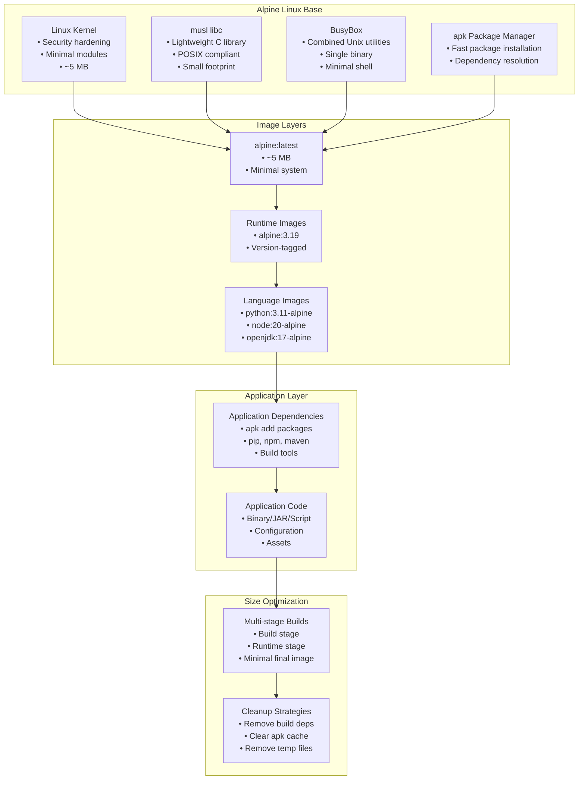

#alpine-linux #docker #container #linux #containerization #site-reliability-engineering #minimal #security
# Alpine Linux-based image
- Alpine Linux-based container images are ==minimal Docker images== built on Alpine Linux, a security-oriented, lightweight Linux distribution.
- Alpine images are significantly smaller than traditional Linux distribution images, typically 5-10 MB compared to 100+ MB for Ubuntu or Debian-based images.
- Alpine uses ==musl libc== instead of glibc and ==BusyBox== instead of GNU coreutils, resulting in reduced image size and attack surface.
- Alpine Linux-based images are widely adopted for microservices, serverless functions, and cloud-native applications where image size and startup time are critical.
# Key characteristics
## Minimal size
- Base Alpine image is approximately 5 MB compressed.
- Significantly reduces container registry storage and network transfer costs.
- Faster image pulls and container startup times.
- Reduced attack surface with fewer installed packages.
## Security-focused
- Alpine Linux follows security-first design principles.
- PaX and grsecurity patches in Alpine kernel (older versions).
- Minimal default installation reduces vulnerability exposure.
- Regular security updates through Alpine package repository.
- No default users or unnecessary services.
## Package management
- Alpine Package Keeper (apk) as package manager.
- Lightweight and fast package installation.
- Extensive package repository covering common dependencies.
- Simple syntax for adding and removing packages.
## musl libc
- Uses musl libc instead of GNU C Library (glibc).
- Smaller memory footprint and binary size.
- May have compatibility issues with applications expecting glibc.
- Different behavior in some edge cases (DNS resolution, locale support).
# Architecture

# Alpine versions
## Version numbering
- Alpine follows semantic versioning: `major.minor.patch`
- Major versions released approximately every 6 months.
- Current stable: Alpine 3.19 (as of 2024)
- Extended support for stable releases (typically 2 years)
## Docker image tags
- `alpine:latest`: Points to latest stable release
- `alpine:3.19`: Specific major.minor version
- `alpine:3.19.0`: Specific patch version
- `alpine:edge`: Rolling release, latest packages (unstable)
## Version selection
```dockerfile
# Latest stable (avoid in production)
FROM alpine:latest

# Specific version (recommended)
FROM alpine:3.19

# Specific patch version (maximum stability)
FROM alpine:3.19.0

# Edge (development only)
FROM alpine:edge
```
# Package management with apk
## Basic apk commands
### Update package index
```shell
apk update
```
### Install packages
```shell
# Install single package
apk add curl

# Install multiple packages
apk add python3 py3-pip gcc musl-dev

# Install without cache
apk add --no-cache nginx

# Install specific version
apk add 'nodejs=~18'
```
### Search packages
```shell
# Search for package
apk search python

# Search with description
apk search -v python
```
### Remove packages
```shell
# Remove package
apk del curl

# Remove package and dependencies
apk del --rdepends curl
```
### List installed packages
```shell
# List all installed packages
apk list --installed

# Show package information
apk info curl
```
## apk in Dockerfiles
### Installing packages
```dockerfile
FROM alpine:3.19

# Update and install in single layer
RUN apk update && \
    apk add --no-cache \
        python3 \
        py3-pip \
        gcc \
        musl-dev \
        linux-headers

# Install and clean up in single RUN
RUN apk add --no-cache --virtual .build-deps \
        gcc \
        musl-dev && \
    pip install myapp && \
    apk del .build-deps
```
### Virtual packages
- Virtual packages group dependencies for easy removal.
```dockerfile
# Install build dependencies as virtual package
RUN apk add --no-cache --virtual .build-deps \
        gcc \
        g++ \
        make \
        cmake && \
    # Build application \
    cmake . && make && make install && \
    # Remove build dependencies \
    apk del .build-deps
```
# Common base images
## Official Alpine image
```dockerfile
FROM alpine:3.19

RUN apk add --no-cache curl

CMD ["/bin/sh"]
```
## Language-specific Alpine images
### Python Alpine
```dockerfile
FROM python:3.11-alpine

WORKDIR /app

# Install dependencies
RUN apk add --no-cache \
        gcc \
        musl-dev \
        libffi-dev

COPY requirements.txt .
RUN pip install --no-cache-dir -r requirements.txt

COPY . .

CMD ["python", "app.py"]
```
### Node.js Alpine
```dockerfile
FROM node:20-alpine

WORKDIR /app

# Install dependencies
COPY package*.json ./
RUN npm ci --only=production

COPY . .

EXPOSE 3000
CMD ["node", "server.js"]
```
### Java Alpine
```dockerfile
FROM eclipse-temurin:17-jdk-alpine

WORKDIR /app

COPY target/application.jar app.jar

EXPOSE 8080
ENTRYPOINT ["java", "-jar", "app.jar"]
```
### Go Alpine
```dockerfile
FROM golang:1.21-alpine AS builder

WORKDIR /app
COPY . .
RUN go build -o main .

FROM alpine:3.19
RUN apk add --no-cache ca-certificates
COPY --from=builder /app/main /main
CMD ["/main"]
```
# Multi-stage builds
- Multi-stage builds reduce final image size by separating build and runtime environments.
## Build stage with Alpine
```dockerfile
# Build stage
FROM golang:1.21-alpine AS builder

WORKDIR /build

# Install build dependencies
RUN apk add --no-cache git make

COPY go.mod go.sum ./
RUN go mod download

COPY . .
RUN CGO_ENABLED=0 go build -o app

# Runtime stage
FROM alpine:3.19

# Install runtime dependencies only
RUN apk add --no-cache ca-certificates tzdata

# Create non-root user
RUN addgroup -g 1000 appuser && \
    adduser -D -u 1000 -G appuser appuser

USER appuser
WORKDIR /app

COPY --from=builder /build/app .

EXPOSE 8080
CMD ["./app"]
```
## Python multi-stage build
```dockerfile
# Build stage
FROM python:3.11-alpine AS builder

WORKDIR /build

# Install build dependencies
RUN apk add --no-cache \
        gcc \
        musl-dev \
        libffi-dev \
        postgresql-dev

COPY requirements.txt .
RUN pip install --user --no-cache-dir -r requirements.txt

# Runtime stage
FROM python:3.11-alpine

# Install runtime dependencies only
RUN apk add --no-cache \
        libpq \
        libffi

# Copy Python packages from builder
COPY --from=builder /root/.local /root/.local

WORKDIR /app
COPY . .

ENV PATH=/root/.local/bin:$PATH

CMD ["python", "app.py"]
```
## Node.js multi-stage build
```dockerfile
# Build stage
FROM node:20-alpine AS builder

WORKDIR /build

COPY package*.json ./
RUN npm ci

COPY . .
RUN npm run build

# Runtime stage
FROM node:20-alpine

WORKDIR /app

# Install production dependencies only
COPY package*.json ./
RUN npm ci --only=production

# Copy built artifacts
COPY --from=builder /build/dist ./dist

EXPOSE 3000
CMD ["node", "dist/server.js"]
```
# Size optimization strategies
## Minimize layers
```dockerfile
# Bad: Multiple RUN commands create multiple layers
FROM alpine:3.19
RUN apk add curl
RUN apk add wget
RUN apk add git

# Good: Single RUN command
FROM alpine:3.19
RUN apk add --no-cache curl wget git
```
## Remove build dependencies
```dockerfile
FROM alpine:3.19

# Install build deps, build, and remove in single layer
RUN apk add --no-cache --virtual .build-deps \
        gcc \
        musl-dev \
        python3-dev && \
    pip install mypackage && \
    apk del .build-deps
```
## Clear package cache
```dockerfile
# Use --no-cache flag
RUN apk add --no-cache python3

# Or manually clear cache
RUN apk add python3 && \
    rm -rf /var/cache/apk/*
```
## Use .dockerignore
```text title='.dockerignore'
.git
.gitignore
README.md
.dockerignore
Dockerfile
.env
*.md
node_modules
__pycache__
*.pyc
.pytest_cache
coverage/
.vscode
.idea
```
## Combine commands
```dockerfile
FROM alpine:3.19

# Bad: Multiple layers
RUN apk add curl
RUN curl -O https://example.com/file
RUN tar -xzf file
RUN rm file

# Good: Single layer
RUN apk add --no-cache curl && \
    curl -O https://example.com/file && \
    tar -xzf file && \
    rm file && \
    apk del curl
```
# Security considerations
## musl libc compatibility
- Some applications may have compatibility issues with musl libc.
- Common issues:
	- DNS resolution differences
	- Thread-local storage behavior
	- Locale and internationalization support
	- Binary dependencies compiled for glibc
## Solutions for glibc dependencies
### Using glibc compatibility layer
```dockerfile
FROM alpine:3.19

# Install glibc compatibility
RUN apk add --no-cache \
        wget && \
    wget -q -O /etc/apk/keys/sgerrand.rsa.pub https://alpine-pkgs.sgerrand.com/sgerrand.rsa.pub && \
    wget https://github.com/sgerrand/alpine-pkg-glibc/releases/download/2.35-r1/glibc-2.35-r1.apk && \
    apk add --no-cache glibc-2.35-r1.apk && \
    rm glibc-2.35-r1.apk
```
### Static compilation
```dockerfile
# Compile with static linking
FROM golang:1.21-alpine AS builder
RUN CGO_ENABLED=0 go build -ldflags '-extldflags "-static"' -o app
```
## Non-root user
- Running as non-root improves security.
```dockerfile
FROM alpine:3.19

# Create user and group
RUN addgroup -g 1000 appgroup && \
    adduser -D -u 1000 -G appgroup appuser

# Set ownership
WORKDIR /app
COPY --chown=appuser:appgroup . .

# Switch to non-root user
USER appuser

CMD ["./app"]
```
## Security scanning
```shell
# Scan Alpine image for vulnerabilities
docker scan alpine:3.19

# Using Trivy
trivy image alpine:3.19

# Using Grype
grype alpine:3.19
```
## Minimal attack surface
```dockerfile
FROM alpine:3.19

# Install only necessary packages
RUN apk add --no-cache \
        ca-certificates \
        tzdata

# Remove shell if not needed
RUN rm /bin/sh /bin/ash

# Use distroless-style approach
FROM scratch
COPY --from=alpine /etc/ssl/certs/ca-certificates.crt /etc/ssl/certs/
COPY app /app
CMD ["/app"]
```
# Troubleshooting
## DNS resolution issues
- Alpine uses musl libc which may have different DNS behavior.
```dockerfile
# Add nsswitch.conf for better DNS resolution
FROM alpine:3.19
RUN echo 'hosts: files dns' > /etc/nsswitch.conf
```
## Missing shared libraries
```shell
# Check for missing libraries
ldd /path/to/binary

# Install common libraries
RUN apk add --no-cache \
        libc6-compat \
        libstdc++
```
## Timezone configuration
```dockerfile
FROM alpine:3.19

# Install timezone data
RUN apk add --no-cache tzdata

# Set timezone
ENV TZ=America/New_York
RUN ln -sf /usr/share/zoneinfo/$TZ /etc/localtime && \
    echo $TZ > /etc/timezone
```
## Locale issues
```dockerfile
FROM alpine:3.19

# Install locale support
RUN apk add --no-cache \
        musl-locales \
        musl-locales-lang

ENV LANG=en_US.UTF-8
ENV LC_ALL=en_US.UTF-8
```
## Certificate verification
```dockerfile
FROM alpine:3.19

# Install CA certificates for HTTPS
RUN apk add --no-cache ca-certificates

# Update certificates
RUN update-ca-certificates
```
# Best practices
## Pin specific versions
```dockerfile
# Pin Alpine version
FROM alpine:3.19

# Pin package versions
RUN apk add --no-cache \
        'python3=~3.11' \
        'nginx=~1.24'
```
## Use .dockerignore
- Exclude unnecessary files from build context.
- Reduces build time and prevents sensitive data inclusion.
## Leverage build cache
```dockerfile
FROM alpine:3.19

# Copy dependency files first
COPY requirements.txt .
RUN pip install -r requirements.txt

# Copy application code last
COPY . .
```
## Health checks
```dockerfile
FROM alpine:3.19

RUN apk add --no-cache curl

HEALTHCHECK --interval=30s --timeout=3s --start-period=5s --retries=3 \
    CMD curl -f http://localhost:8080/health || exit 1

CMD ["./app"]
```
## Resource limits
```dockerfile
FROM alpine:3.19

# Set memory limits in docker-compose or k8s
# Example in docker run:
# docker run --memory="256m" --cpus="0.5" myapp
```
## Logging
```dockerfile
FROM alpine:3.19

# Log to stdout/stderr for container logs
RUN ln -sf /dev/stdout /var/log/nginx/access.log && \
    ln -sf /dev/stderr /var/log/nginx/error.log
```
# Common use cases
## Web servers
### Nginx
```dockerfile
FROM nginx:alpine

COPY nginx.conf /etc/nginx/nginx.conf
COPY html /usr/share/nginx/html

EXPOSE 80
CMD ["nginx", "-g", "daemon off;"]
```
### Apache
```dockerfile
FROM alpine:3.19

RUN apk add --no-cache apache2

COPY httpd.conf /etc/apache2/httpd.conf
COPY html /var/www/html

EXPOSE 80
CMD ["httpd", "-D", "FOREGROUND"]
```
## Databases
### PostgreSQL client
```dockerfile
FROM alpine:3.19

RUN apk add --no-cache \
        postgresql-client \
        postgresql-dev

COPY backup.sh /backup.sh
RUN chmod +x /backup.sh

CMD ["/backup.sh"]
```
### Redis
```dockerfile
FROM redis:alpine

COPY redis.conf /usr/local/etc/redis/redis.conf

EXPOSE 6379
CMD ["redis-server", "/usr/local/etc/redis/redis.conf"]
```
## Microservices
### REST API
```dockerfile
FROM python:3.11-alpine

WORKDIR /app

RUN apk add --no-cache \
        gcc \
        musl-dev \
        postgresql-dev

COPY requirements.txt .
RUN pip install --no-cache-dir -r requirements.txt

COPY . .

EXPOSE 5000
CMD ["gunicorn", "-b", "0.0.0.0:5000", "app:app"]
```
### gRPC service
```dockerfile
FROM golang:1.21-alpine AS builder

WORKDIR /build
COPY . .
RUN CGO_ENABLED=0 go build -o grpc-service

FROM alpine:3.19
RUN apk add --no-cache ca-certificates

COPY --from=builder /build/grpc-service /grpc-service

EXPOSE 50051
CMD ["/grpc-service"]
```
## CI/CD tools
### Build container
```dockerfile
FROM alpine:3.19

RUN apk add --no-cache \
        git \
        make \
        gcc \
        g++ \
        python3 \
        nodejs \
        npm

WORKDIR /workspace
```
# Performance considerations
## Image pull time
- Alpine images pull faster due to smaller size.
- Reduces deployment time in CI/CD and orchestration platforms.
```shell
# Compare pull times
time docker pull ubuntu:22.04  # ~80 MB
time docker pull alpine:3.19   # ~7 MB
```
## Container startup time
- Smaller images start faster.
- Critical for serverless and autoscaling scenarios.
## Memory footprint
- Alpine containers use less memory.
- Allows higher container density per host.
## Build time
- Faster layer creation due to smaller base.
- Package installation may be slower than apt for some packages.
# Comparison with other base images
## vs Ubuntu/Debian
- Alpine: 5 MB, musl libc, apk, minimal
- Ubuntu/Debian: 100+ MB, glibc, apt, comprehensive
- Use Alpine for: microservices, size-critical deployments
- Use Ubuntu/Debian for: complex dependencies, broad compatibility
## vs distroless
- Alpine: ~5 MB, has shell and package manager, easier debugging
- Distroless: ~2 MB, no shell, maximum security
- Use Alpine for: development and debugging needs
- Use distroless for: production, maximum security
## vs scratch
- Alpine: ~5 MB, has basic utilities and shell
- Scratch: 0 MB, completely empty
- Use Alpine for: most applications needing OS utilities
- Use scratch for: fully static binaries only
# Migration to Alpine
## Assessment
1. Identify glibc dependencies in application
2. Check for shell script compatibility with BusyBox
3. Test DNS resolution and networking
4. Verify build process with apk package manager
## Migration steps
```dockerfile
# Before: Ubuntu-based
FROM ubuntu:22.04
RUN apt-get update && apt-get install -y python3 python3-pip
COPY requirements.txt .
RUN pip3 install -r requirements.txt
COPY . .
CMD ["python3", "app.py"]

# After: Alpine-based
FROM python:3.11-alpine
RUN apk add --no-cache gcc musl-dev
COPY requirements.txt .
RUN pip install --no-cache-dir -r requirements.txt
COPY . .
CMD ["python", "app.py"]
```
## Testing
```shell
# Build Alpine image
docker build -t myapp:alpine .

# Test functionality
docker run --rm myapp:alpine

# Compare sizes
docker images myapp
```
***
# References
1. Alpine Linux Official Website: https://alpinelinux.org/
2. Alpine Linux Docker Official Images: https://hub.docker.com/_/alpine
3. Alpine Linux Package Database: https://pkgs.alpinelinux.org/
4. Alpine Linux Wiki: https://wiki.alpinelinux.org/
5. Docker Best Practices for Alpine: https://docs.docker.com/develop/develop-images/dockerfile_best-practices/
6. musl libc: https://musl.libc.org/