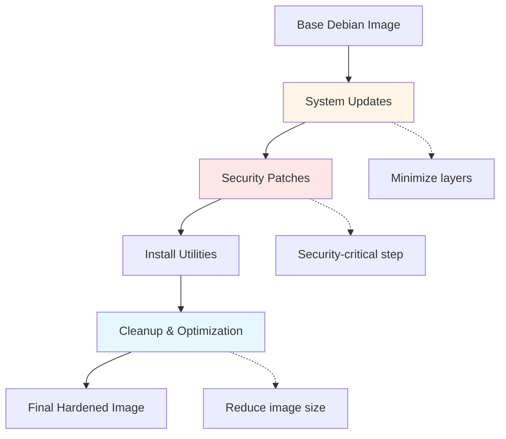
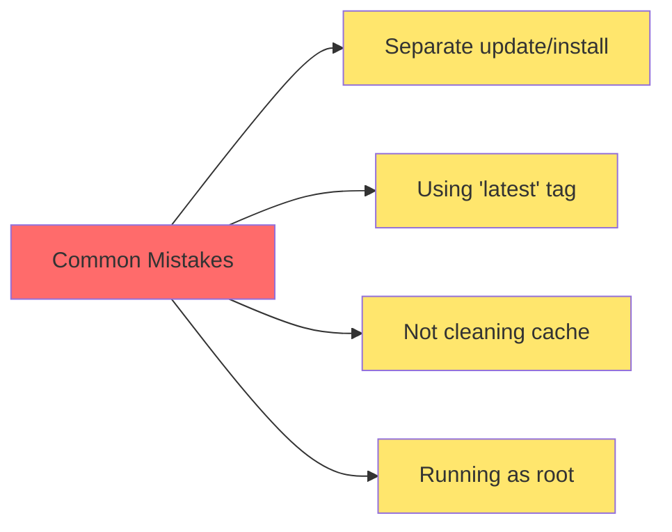
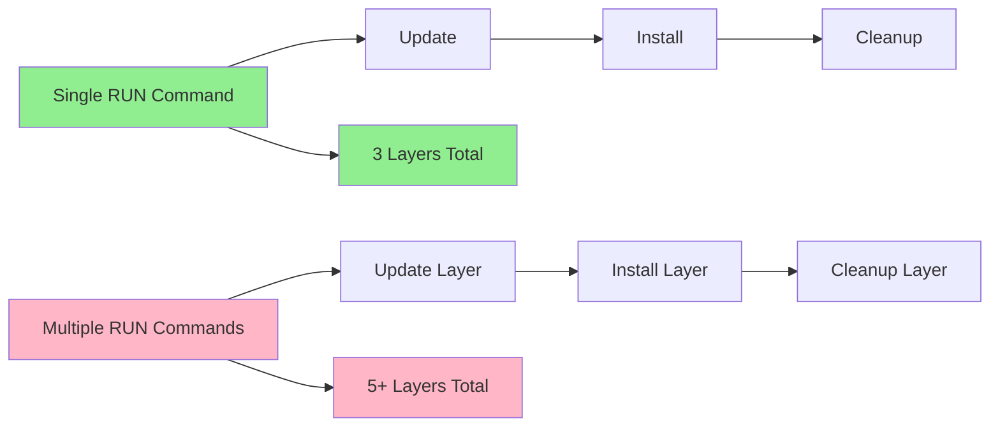
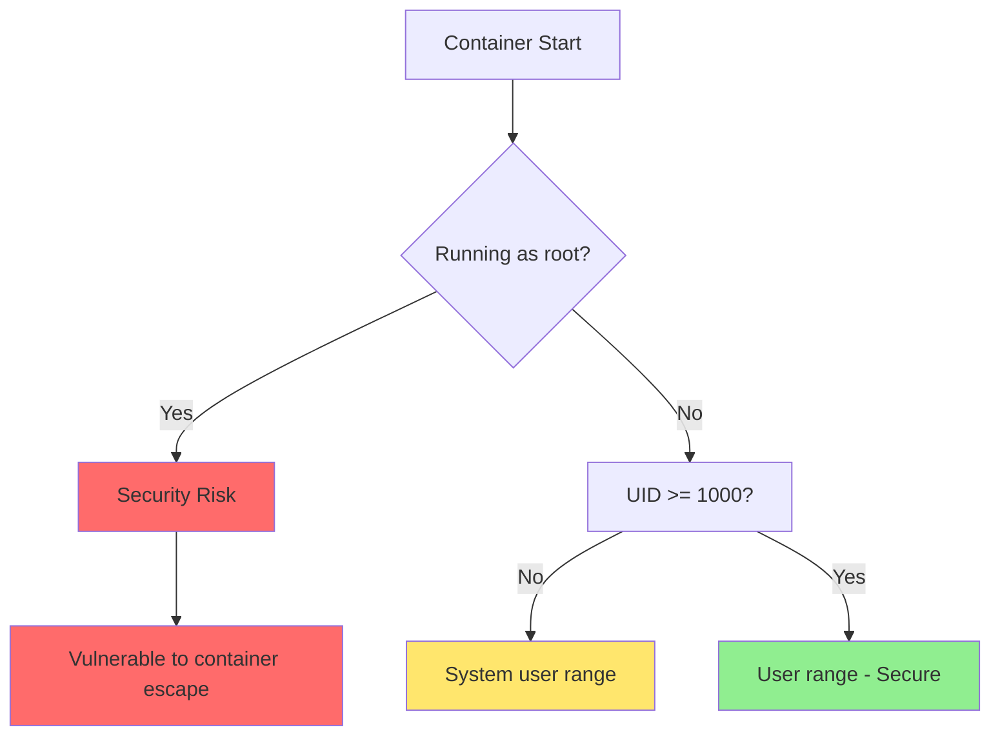

#linux #debian #containerization #container-engine #cybersecurity #operating-system #debian13
# Purpose
- **Security Foundation**: Provides up-to-date security patches and hardened system configurations
- **Runtime Prerequisites**: Installs essential utilities and libraries required by applications
- **Standardization**: Creates consistent base environments across different applications
- **Size Optimization**: Minimizes image size while maintaining necessary functionality
# Image Build Strategy



# Best Practices

## Security Hardening
1. **Always update packages**: Run `apt-get update && apt-get upgrade` to patch known vulnerabilities
2. **Use specific versions**: Pin Debian version (e.g., `debian:13` not `debian:latest`) for reproducibility
3. **Remove package cache**: Clean `/var/lib/apt/lists/*` and `/var/cache/apt/archives/*` to prevent stale packages
4. **Run as non-root**: Create and use non-privileged users (UID/GID > 999) for application runtime
5. **Minimal attack surface**: Install only necessary packages to reduce potential vulnerabilities
## Image Optimization
1. **Combine RUN commands**: Use heredoc syntax to reduce layer count
2. **Use `--no-install-recommends`**: Prevents installing unnecessary suggested packages
3. **Clean in same layer**: Remove package cache in the same `RUN` command that installs packages
4. **Multi-stage builds**: Separate build-time and runtime dependencies

## Package Management
1. **Certificate updates**: Install `ca-certificates` before making HTTPS requests
2. **Transport security**: Use `apt-transport-https` for secure package downloads
3. **GPG verification**: Maintain `gnupg` for package signature verification
## Warning: Common Pitfalls



**Critical Issues to Avoid:**
- Running `apt-get update` in a separate layer creates cache inconsistencies
- Using `latest` tag makes builds non-reproducible
- Not removing apt cache can increase image size by 50-100MB
- Running containers as root violates principle of least privilege.
# Practical Dockerfiles
## Minimal Security-Hardened Base
- Suitable for applications with minimal dependencies that need only core utilities.
```Dockerfile
FROM debian:13-slim

# Metadata
LABEL maintainer="your-email@example.com"
LABEL description="Minimal hardened Debian 13 base image with security updates"

# Update system and install minimal utilities
RUN <<EOT bash
  set -ex

  # Update package lists and upgrade existing packages
  apt-get update
  apt-get upgrade -y

  # Install essential utilities
  apt-get install -y --no-install-recommends \
    ca-certificates \
    curl \
    wget \
    gnupg \
    tzdata

  # Security: Remove package cache and lists
  apt-get clean
  rm -rf /var/lib/apt/lists/* /var/cache/apt/archives/*

  # Configure timezone (set to UTC for consistency)
  ln -sf /usr/share/zoneinfo/UTC /etc/localtime
EOT

# Create non-root user for security
RUN useradd -r -u 1000 -g users -s /bin/bash appuser

# Set working directory
WORKDIR /app

# Switch to non-root user
USER appuser
```
## Extended Utilities Base
- Includes development tools and network utilities for debugging and troubleshooting.
```Dockerfile
FROM debian:13-slim

LABEL maintainer="your-email@example.com"
LABEL description="Extended Debian 13 base with development and network utilities"

RUN <<EOT bash
  set -ex

  # System updates and security patches
  apt-get update
  apt-get upgrade -y

  # Install extended utilities
  apt-get install -y --no-install-recommends \
    # Core utilities
    ca-certificates \
    curl \
    wget \
    gnupg \
    tzdata \
    # Build tools
    build-essential \
    git \
    # Network utilities
    net-tools \
    iputils-ping \
    dnsutils \
    traceroute \
    netcat-openbsd \
    # Process monitoring
    procps \
    htop \
    # Text editors
    vim \
    nano \
    # Compression utilities
    zip \
    unzip \
    tar \
    gzip

  # Cleanup
  apt-get clean
  rm -rf /var/lib/apt/lists/* /var/cache/apt/archives/*

  # Configure timezone
  ln -sf /usr/share/zoneinfo/UTC /etc/localtime
EOT

# Create non-root user with home directory
RUN useradd -r -m -u 1000 -g users -s /bin/bash appuser

WORKDIR /app
USER appuser
```
## Application Runtime Base
- Production-ready base with runtime libraries, security configurations, and multi-architecture support.
```Dockerfile
FROM debian:13-slim

LABEL maintainer="your-email@example.com"
LABEL description="Production-ready Debian 13 base for application runtime"

# Install runtime dependencies and security updates
RUN <<EOT bash
  set -ex

  # Update and upgrade system
  apt-get update
  apt-get upgrade -y

  # Install runtime prerequisites
  apt-get install -y --no-install-recommends \
    # Certificate management
    ca-certificates \
    openssl \
    # HTTP clients
    curl \
    wget \
    # Security
    gnupg \
    apt-transport-https \
    # Common runtime libraries
    libssl3 \
    libcurl4 \
    zlib1g \
    # Timezone support
    tzdata \
    # Process utilities
    procps \
    # Locales for internationalization
    locales

  # Generate locale
  echo "en_US.UTF-8 UTF-8" > /etc/locale.gen
  locale-gen

  # Update CA certificates
  update-ca-certificates

  # Cleanup
  apt-get clean
  rm -rf /var/lib/apt/lists/* /var/cache/apt/archives/* /tmp/* /var/tmp/*
EOT

# Security: Create non-root user with specific UID/GID
RUN groupadd -r -g 1000 appgroup && \
    useradd -r -u 1000 -g appgroup -m -s /bin/bash appuser

# Set locale environment variables
ENV LANG=en_US.UTF-8 \
    LANGUAGE=en_US:en \
    LC_ALL=en_US.UTF-8

# Configure timezone (override with -e TZ=<timezone> at runtime)
ENV TZ=UTC
RUN ln -sf /usr/share/zoneinfo/$TZ /etc/localtime && echo $TZ > /etc/timezone

WORKDIR /app

# Set proper permissions
RUN chown -R appuser:appgroup /app

USER appuser

# Health check (override in derived images)
HEALTHCHECK --interval=30s --timeout=3s --start-period=5s --retries=3 \
  CMD curl -f http://localhost/ || exit 1
```

## Multi-stage Build Pattern

Demonstrates separation of build-time and runtime dependencies for minimal final image size.

```Dockerfile
# Build stage with full toolchain
FROM debian:13 AS builder

RUN <<EOT bash
  set -ex
  apt-get update
  apt-get install -y --no-install-recommends \
    build-essential \
    cmake \
    git \
    ca-certificates
  apt-get clean
  rm -rf /var/lib/apt/lists/*
EOT

WORKDIR /build
# Build application here...
# COPY source code, compile, etc.

# Runtime stage with minimal footprint
FROM debian:13-slim AS runtime

RUN <<EOT bash
  set -ex
  apt-get update
  apt-get upgrade -y
  apt-get install -y --no-install-recommends \
    ca-certificates \
    libssl3 \
    curl
  apt-get clean
  rm -rf /var/lib/apt/lists/* /var/cache/apt/archives/*
EOT

# Create non-root user
RUN useradd -r -u 1000 -g users appuser

WORKDIR /app

# Copy only compiled artifacts from builder
# COPY --from=builder --chown=appuser /build/output /app/

USER appuser
```

## Image Layer Optimization



**Optimization Impact:**
- Combining commands: Reduces layers by 60-70%
- In-line cleanup: Reduces image size by 50-100MB
- No-install-recommends: Reduces package count by 40-50%
# Security
## User Privilege Model



**User ID Ranges:**
- **0**: root (avoid in containers)
- **1-999**: System users (reserved)
- **1000+**: Regular users (recommended for containers)
## Package Security Updates
- Always verify package authenticity and maintain updated certificates:
```Dockerfile
# Update CA certificates after installation
RUN update-ca-certificates

# Verify package signatures (GPG keys are automatically managed)
# Debian uses secure APT by default with automatic signature verification
```
# Advanced Techniques
## Conditional Package Installation
- Install different packages based on architecture or environment.
```Dockerfile
RUN <<EOT bash
  set -ex
  apt-get update
  apt-get upgrade -y

  # Base packages
  apt-get install -y --no-install-recommends ca-certificates curl

  # Architecture-specific packages
  ARCH=$(dpkg --print-architecture)
  if [ "$ARCH" = "amd64" ]; then
    apt-get install -y --no-install-recommends some-amd64-package
  elif [ "$ARCH" = "arm64" ]; then
    apt-get install -y --no-install-recommends some-arm64-package
  fi

  apt-get clean
  rm -rf /var/lib/apt/lists/*
EOT
```
## Build Arguments for Flexibility
```Dockerfile
ARG DEBIAN_VERSION=13
ARG TZ=UTC
ARG USER_UID=1000
ARG USER_GID=1000

FROM debian:${DEBIAN_VERSION}-slim

ENV TZ=${TZ}

RUN <<EOT bash
  set -ex
  apt-get update && apt-get upgrade -y
  apt-get install -y --no-install-recommends ca-certificates curl tzdata
  ln -sf /usr/share/zoneinfo/${TZ} /etc/localtime
  apt-get clean && rm -rf /var/lib/apt/lists/*
EOT

RUN groupadd -g ${USER_GID} appgroup && \
    useradd -r -u ${USER_UID} -g appgroup appuser
```

```Shell
docker build \
  --build-arg DEBIAN_VERSION=13 \
  --build-arg TZ=America/New_York \
  --build-arg USER_UID=5000 \
  -t my-debian-base:latest .
```
***

# References
1. [Containerfile](site-reliability-engineering/container-engine/artifacts/Containerfile.md) for general Dockerfile syntax and commands
2. https://hub.docker.com/_/debian for official Debian Docker images
3. https://docs.docker.com/develop/develop-images/dockerfile_best-practices/ for Dockerfile best practices
4. https://www.debian.org/security/ for Debian security updates and advisories
5. https://docs.docker.com/build/building/multi-stage/ for multi-stage build documentation
6. https://docs.docker.com/engine/reference/builder/#run---mounttypecache for build cache optimization
