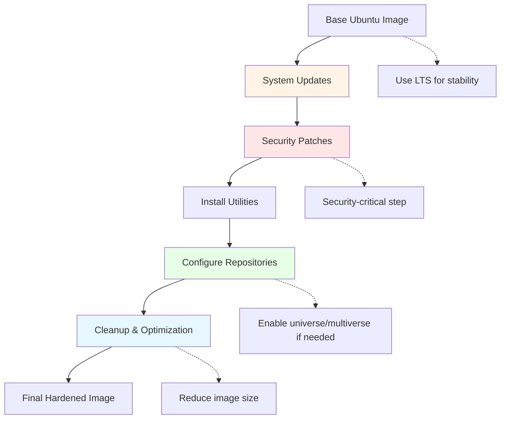
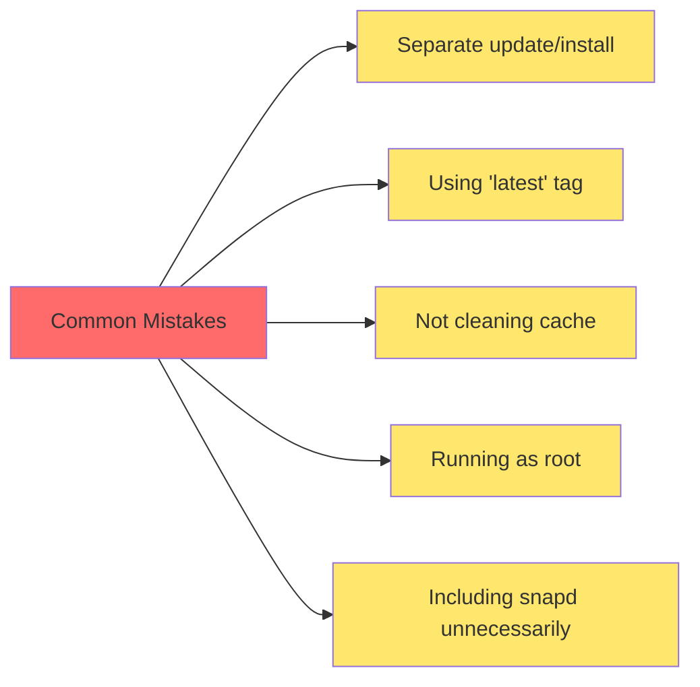
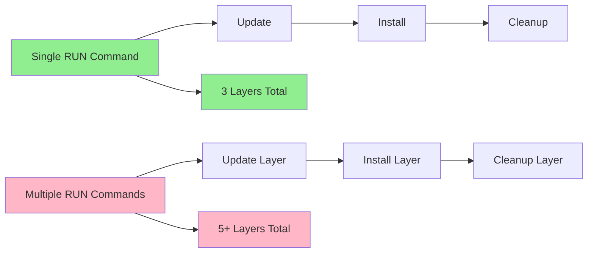
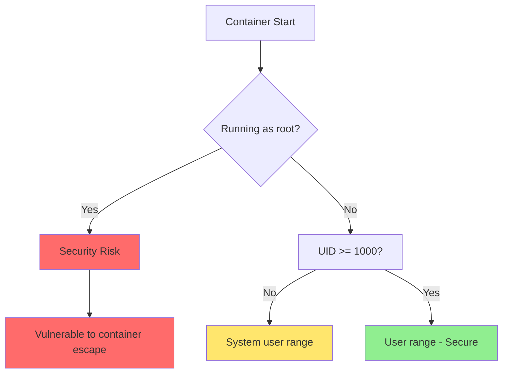
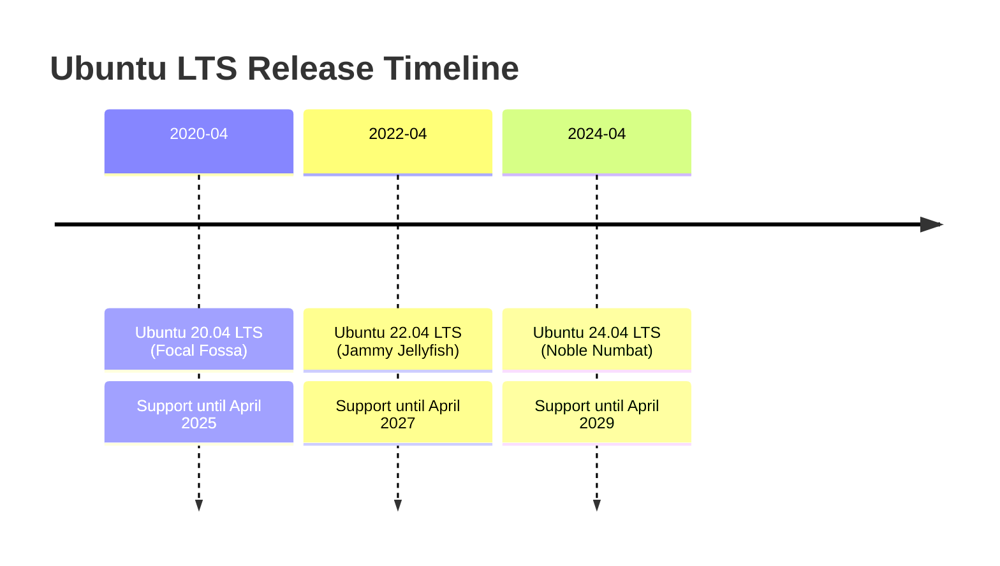

#linux #ubuntu #debian #containerization #container-engine #cybersecurity #operating-system #ubuntu24 #ubuntu22 #ubuntu20
# Image Build Strategy



# Best Practices

## Security Hardening
1. **Prefer LTS releases**: Use Ubuntu 24.04 LTS, 22.04 LTS, or 20.04 LTS for production with extended security support
2. **Always update packages**: Run `apt-get update && apt-get upgrade` to patch known vulnerabilities
3. **Use specific versions**: Pin Ubuntu version (e.g., `ubuntu:24.04`) instead of `ubuntu:latest` for reproducibility
4. **Remove package cache**: Clean `/var/lib/apt/lists/*` and `/var/cache/apt/archives/*` to prevent stale packages
5. **Run as non-root**: Create and use non-privileged users (UID/GID ≥ 1000) for application runtime
6. **Minimal attack surface**: Install only necessary packages to reduce potential vulnerabilities
7. **Enable security updates**: Ensure `ubuntu-security` repository is enabled
## Ubuntu-Specific Considerations
1. **Repository Management**:
   - **main**: Officially supported free software
   - **universe**: Community-maintained free software
   - **restricted**: Proprietary drivers for device support
   - **multiverse**: Software restricted by copyright/legal issues
2. **Snapd**: Ubuntu includes `snapd` by default $\implies$ consider removing if not needed to reduce image size
3. **Cloud Images**: Ubuntu provides `ubuntu:focal`, `ubuntu:jammy`, `ubuntu:noble` optimized for containers
4. **Unattended Upgrades**: Disable in containers (enabled by default on some images)
## Image Optimization
1. **Use minimal variants**: Prefer `-slim` or cloud-optimized images (smaller base size)
2. **Combine RUN commands**: Use heredoc syntax to reduce layer count
3. **Use `--no-install-recommends`**: Prevents installing unnecessary suggested packages
4. **Clean in same layer**: Remove package cache in the same `RUN` command that installs packages
5. **Multi-stage builds**: Separate build-time and runtime dependencies
6. **Remove snapd**: If not using snap packages, remove to save ~100 MB.
## Package Management
1. **Certificate updates**: Install `ca-certificates` before making HTTPS requests
2. **Transport security**: Use `apt-transport-https` for secure package downloads (built-in on Ubuntu 20.04+)
3. **GPG verification**: Maintain `gnupg` for package signature verification
4. **DEBIAN_FRONTEND**: Set to `noninteractive` to prevent interactive prompts during package installation
## Warning: Common Pitfalls



- Running `apt-get update` in a separate layer creates cache inconsistencies
- Using `latest` tag makes builds non-reproducible (may switch between LTS and interim releases)
- Not removing apt cache can increase image size by 50-100MB
- Running containers as root violates principle of least privilege
- Including `snapd` adds unnecessary bloat for containerized applications

# Practical Dockerfiles

## Minimal Security-Hardened Base
- Suitable for applications with minimal dependencies that need only core utilities.

```Dockerfile
FROM ubuntu:24.04

# Metadata
LABEL maintainer="your-email@example.com"
LABEL description="Minimal hardened Ubuntu 24.04 LTS base image with security updates"

# Prevent interactive prompts
ENV DEBIAN_FRONTEND=noninteractive

# Update system and install minimal utilities
RUN <<EOT bash
  set -ex

  # Update package lists and upgrade existing packages
  apt-get update
  apt-get upgrade -y

  # Install essential utilities
  apt-get install -y --no-install-recommends \
    ca-certificates \
    curl \
    wget \
    gnupg \
    tzdata

  # Security: Remove package cache and lists
  apt-get clean
  rm -rf /var/lib/apt/lists/* /var/cache/apt/archives/*

  # Configure timezone (set to UTC for consistency)
  ln -sf /usr/share/zoneinfo/UTC /etc/localtime
  echo "UTC" > /etc/timezone
EOT

# Create non-root user for security
RUN useradd -r -u 1000 -m -s /bin/bash appuser

# Set working directory
WORKDIR /app

# Set proper permissions
RUN chown appuser:appuser /app

# Switch to non-root user
USER appuser
```
## Extended Utilities Base
- Includes development tools and network utilities for debugging and troubleshooting.
```Dockerfile
FROM ubuntu:24.04

LABEL maintainer="your-email@example.com"
LABEL description="Extended Ubuntu 24.04 LTS base with development and network utilities"

ENV DEBIAN_FRONTEND=noninteractive

RUN <<EOT bash
  set -ex

  # System updates and security patches
  apt-get update
  apt-get upgrade -y

  # Install extended utilities
  apt-get install -y --no-install-recommends \
    # Core utilities
    ca-certificates \
    curl \
    wget \
    gnupg \
    tzdata \
    # Build tools
    build-essential \
    git \
    # Network utilities
    net-tools \
    iputils-ping \
    dnsutils \
    traceroute \
    netcat-openbsd \
    iproute2 \
    # Process monitoring
    procps \
    htop \
    # Text editors
    vim \
    nano \
    # Compression utilities
    zip \
    unzip \
    tar \
    gzip \
    # System utilities
    lsb-release \
    software-properties-common

  # Cleanup
  apt-get clean
  rm -rf /var/lib/apt/lists/* /var/cache/apt/archives/* /tmp/* /var/tmp/*

  # Configure timezone
  ln -sf /usr/share/zoneinfo/UTC /etc/localtime
  echo "UTC" > /etc/timezone
EOT

# Create non-root user with home directory
RUN useradd -r -m -u 1000 -s /bin/bash appuser

WORKDIR /app
RUN chown appuser:appuser /app

USER appuser
```
## Application Runtime Base
- Production-ready base with runtime libraries, security configurations, and locale support.
```Dockerfile
FROM ubuntu:24.04

LABEL maintainer="your-email@example.com"
LABEL description="Production-ready Ubuntu 24.04 LTS base for application runtime"

ENV DEBIAN_FRONTEND=noninteractive

# Install runtime dependencies and security updates
RUN <<EOT bash
  set -ex

  # Update and upgrade system
  apt-get update
  apt-get upgrade -y

  # Install runtime prerequisites
  apt-get install -y --no-install-recommends \
    # Certificate management
    ca-certificates \
    openssl \
    # HTTP clients
    curl \
    wget \
    # Security
    gnupg \
    # Common runtime libraries
    libssl3 \
    libcurl4 \
    zlib1g \
    # Timezone support
    tzdata \
    # Process utilities
    procps \
    # Locales for internationalization
    locales \
    # System information
    lsb-release

  # Generate locale
  locale-gen en_US.UTF-8
  update-locale LANG=en_US.UTF-8

  # Update CA certificates
  update-ca-certificates

  # Cleanup
  apt-get clean
  rm -rf /var/lib/apt/lists/* /var/cache/apt/archives/* /tmp/* /var/tmp/*
EOT

# Security: Create non-root user with specific UID/GID
RUN groupadd -r -g 1000 appgroup && \
    useradd -r -u 1000 -g appgroup -m -s /bin/bash appuser

# Set locale environment variables
ENV LANG=en_US.UTF-8 \
    LANGUAGE=en_US:en \
    LC_ALL=en_US.UTF-8

# Configure timezone (override with -e TZ=<timezone> at runtime)
ENV TZ=UTC
RUN ln -sf /usr/share/zoneinfo/$TZ /etc/localtime && echo $TZ > /etc/timezone

WORKDIR /app

# Set proper permissions
RUN chown -R appuser:appgroup /app

USER appuser

# Health check (override in derived images)
HEALTHCHECK --interval=30s --timeout=3s --start-period=5s --retries=3 \
  CMD curl -f http://localhost/ || exit 1
```
## Multi-stage Build Pattern
- Demonstrates separation of build-time and runtime dependencies for minimal final image size.
```Dockerfile
# Build stage with full toolchain
FROM ubuntu:24.04 AS builder

ENV DEBIAN_FRONTEND=noninteractive

RUN <<EOT bash
  set -ex
  apt-get update
  apt-get install -y --no-install-recommends \
    build-essential \
    cmake \
    git \
    ca-certificates \
    curl
  apt-get clean
  rm -rf /var/lib/apt/lists/*
EOT

WORKDIR /build
# Build application here...
# COPY source code, compile, etc.

# Runtime stage with minimal footprint
FROM ubuntu:24.04 AS runtime

ENV DEBIAN_FRONTEND=noninteractive

RUN <<EOT bash
  set -ex
  apt-get update
  apt-get upgrade -y
  apt-get install -y --no-install-recommends \
    ca-certificates \
    libssl3 \
    libcurl4 \
    curl
  apt-get clean
  rm -rf /var/lib/apt/lists/* /var/cache/apt/archives/*
EOT

# Create non-root user
RUN useradd -r -u 1000 -m -s /bin/bash appuser

WORKDIR /app
RUN chown appuser:appuser /app

# Copy only compiled artifacts from builder
# COPY --from=builder --chown=appuser:appuser /build/output /app/

USER appuser
```
## Ubuntu with Additional Repositories
- Example showing how to enable universe/multiverse repositories for additional packages.
```Dockerfile
FROM ubuntu:24.04

LABEL description="Ubuntu 24.04 with universe and multiverse repositories enabled"

ENV DEBIAN_FRONTEND=noninteractive

RUN <<EOT bash
  set -ex

  # Enable universe and multiverse repositories
  apt-get update
  apt-get install -y --no-install-recommends software-properties-common
  add-apt-repository universe
  add-apt-repository multiverse

  # Update package lists with new repositories
  apt-get update
  apt-get upgrade -y

  # Install packages (example includes packages from universe)
  apt-get install -y --no-install-recommends \
    ca-certificates \
    curl \
    wget \
    htop \
    vim

  # Cleanup
  apt-get clean
  rm -rf /var/lib/apt/lists/* /var/cache/apt/archives/*
EOT

RUN useradd -r -u 1000 -m -s /bin/bash appuser

WORKDIR /app
RUN chown appuser:appuser /app

USER appuser
```

## Image Layer Optimization



**Optimization Impact:**
- Combining commands: Reduces layers by 60-70%
- In-line cleanup: Reduces image size by 50-100MB
- No-install-recommends: Reduces package count by 40-50%
- Removing snapd: Saves ~100MB on some Ubuntu base images

# Security

## User Privilege Model



**User ID Ranges:**
- **0**: root (avoid in containers)
- **1-999**: System users (reserved)
- **1000+**: Regular users (recommended for containers)

## Ubuntu Security Features
1. **AppArmor**: Ubuntu includes AppArmor profiles for enhanced container security
2. **Unattended Upgrades**: Disabled in official container images (good for reproducibility)
3. **Security Updates**: Subscribe to Ubuntu Security Notices (USN) for vulnerability tracking
4. **Kernel Patches**: LTS releases receive kernel security patches for 5 years

## Package Security Updates
- Always verify package authenticity and maintain updated certificates:

```Dockerfile
# Update CA certificates after installation
RUN update-ca-certificates

# Ubuntu uses secure APT by default with automatic signature verification
# GPG keys are automatically managed by the ubuntu-keyring package
```

# Advanced Techniques

## Conditional Package Installation Based on Ubuntu Version

```Dockerfile
ARG UBUNTU_VERSION=24.04
FROM ubuntu:${UBUNTU_VERSION}

ENV DEBIAN_FRONTEND=noninteractive

RUN <<EOT bash
  set -ex
  apt-get update
  apt-get upgrade -y

  # Base packages
  apt-get install -y --no-install-recommends ca-certificates curl lsb-release

  # Version-specific packages
  UBUNTU_CODENAME=$(lsb_release -cs)
  case "$UBUNTU_CODENAME" in
    noble)  # Ubuntu 24.04
      apt-get install -y --no-install-recommends package-for-24.04
      ;;
    jammy)  # Ubuntu 22.04
      apt-get install -y --no-install-recommends package-for-22.04
      ;;
    focal)  # Ubuntu 20.04
      apt-get install -y --no-install-recommends package-for-20.04
      ;;
  esac

  apt-get clean
  rm -rf /var/lib/apt/lists/*
EOT
```

## Adding PPA (Personal Package Archive)

```Dockerfile
FROM ubuntu:24.04

ENV DEBIAN_FRONTEND=noninteractive

RUN <<EOT bash
  set -ex
  apt-get update
  apt-get install -y --no-install-recommends \
    software-properties-common \
    gnupg \
    ca-certificates

  # Add PPA (example: deadsnakes for newer Python versions)
  add-apt-repository ppa:deadsnakes/ppa
  apt-get update

  # Install packages from PPA
  apt-get install -y --no-install-recommends python3.12

  # Cleanup
  apt-get clean
  rm -rf /var/lib/apt/lists/*
EOT
```

## Build Arguments for Flexibility

```Dockerfile
ARG UBUNTU_VERSION=24.04
ARG TZ=UTC
ARG USER_UID=1000
ARG USER_GID=1000

FROM ubuntu:${UBUNTU_VERSION}

ENV DEBIAN_FRONTEND=noninteractive
ENV TZ=${TZ}

RUN <<EOT bash
  set -ex
  apt-get update && apt-get upgrade -y
  apt-get install -y --no-install-recommends ca-certificates curl tzdata
  ln -sf /usr/share/zoneinfo/${TZ} /etc/localtime
  echo ${TZ} > /etc/timezone
  apt-get clean && rm -rf /var/lib/apt/lists/*
EOT

RUN groupadd -g ${USER_GID} appgroup && \
    useradd -r -u ${USER_UID} -g appgroup -m appuser

WORKDIR /app
RUN chown appuser:appgroup /app

USER appuser
```

**Build command:**
```bash
docker build \
  --build-arg UBUNTU_VERSION=24.04 \
  --build-arg TZ=America/New_York \
  --build-arg USER_UID=5000 \
  -t my-ubuntu-base:latest .
```

## Removing Snapd to Reduce Image Size

```Dockerfile
FROM ubuntu:24.04

ENV DEBIAN_FRONTEND=noninteractive

RUN <<EOT bash
  set -ex

  # Remove snapd if present (can save ~100MB)
  apt-get purge -y snapd
  apt-get autoremove -y

  apt-get update
  apt-get upgrade -y
  apt-get install -y --no-install-recommends ca-certificates curl

  apt-get clean
  rm -rf /var/lib/apt/lists/* /var/cache/apt/archives/* /snap /var/snap
EOT
```

# Ubuntu LTS Version Guide

## Version Overview



## Recommended Versions for Containers

| Version | Codename | Support Until | Use Case | Tag |
|---------|----------|---------------|----------|-----|
| 24.04 LTS | Noble Numbat | April 2029 | New projects, latest packages | `ubuntu:24.04` or `ubuntu:noble` |
| 22.04 LTS | Jammy Jellyfish | April 2027 | Production, wide compatibility | `ubuntu:22.04` or `ubuntu:jammy` |
| 20.04 LTS | Focal Fossa | April 2025 | Legacy support, older dependencies | `ubuntu:20.04` or `ubuntu:focal` |

## Key Differences Between LTS Versions

### Ubuntu 24.04 LTS
- Kernel: Linux 6.8+
- Default shell: Bash 5.2
- Python: 3.12
- OpenSSL: 3.0
- systemd: 255
- Modern package versions

### Ubuntu 22.04 LTS
- Kernel: Linux 5.15+
- Default shell: Bash 5.1
- Python: 3.10
- OpenSSL: 3.0
- systemd: 249
- Stable, well-tested

### Ubuntu 20.04 LTS
- Kernel: Linux 5.4+
- Default shell: Bash 5.0
- Python: 3.8
- OpenSSL: 1.1.1
- systemd: 245
- Mature, approaching EOL

# Troubleshooting Common Issues

## Interactive Prompts During Build

**Problem**: Package installation prompts for user input (timezone, keyboard layout, etc.)

**Solution**: Set `DEBIAN_FRONTEND=noninteractive`

```Dockerfile
ENV DEBIAN_FRONTEND=noninteractive
```

## Repository Errors

**Problem**: `E: Unable to locate package` or `404 Not Found` errors

**Solution**: Always run `apt-get update` before installing packages

```Dockerfile
RUN apt-get update && apt-get install -y package-name
```

## GPG Key Errors

**Problem**: `NO_PUBKEY` errors when adding third-party repositories

**Solution**: Install and configure GPG keys properly

```Dockerfile
RUN <<EOT bash
  set -ex
  apt-get update
  apt-get install -y gnupg ca-certificates
  curl -fsSL https://example.com/key.gpg | gpg --dearmor -o /usr/share/keyrings/example.gpg
EOT
```

## Locale Issues

**Problem**: `locale: Cannot set LC_CTYPE` or character encoding errors

**Solution**: Generate and configure locales

```Dockerfile
RUN <<EOT bash
  apt-get install -y locales
  locale-gen en_US.UTF-8
  update-locale LANG=en_US.UTF-8
EOT

ENV LANG=en_US.UTF-8 \
    LC_ALL=en_US.UTF-8
```

***

# References
1. [Build Debian-based image](site-reliability-engineering/container-engine/artifacts/operating-system/linux/debian/Build%20Debian-based%20image.md) - Parent distribution documentation
2. [Containerfile](site-reliability-engineering/container-engine/artifacts/Containerfile.md) - General Dockerfile syntax and commands
3. [Container storage](site-reliability-engineering/container-engine/Container%20storage.md) - Understanding container layers and storage
4. https://hub.docker.com/_/ubuntu - Official Ubuntu Docker images
5. https://docs.docker.com/develop/develop-images/dockerfile_best-practices/ - Dockerfile best practices
6. https://ubuntu.com/security - Ubuntu security updates and advisories
7. https://wiki.ubuntu.com/Releases - Ubuntu release schedule and support lifecycle
8. https://help.ubuntu.com/community/Repositories/Ubuntu - Ubuntu repository structure
9. https://docs.docker.com/build/building/multi-stage/ - Multi-stage build documentation
10. https://launchpad.net/ubuntu/+ppas - Ubuntu Personal Package Archives (PPAs)
