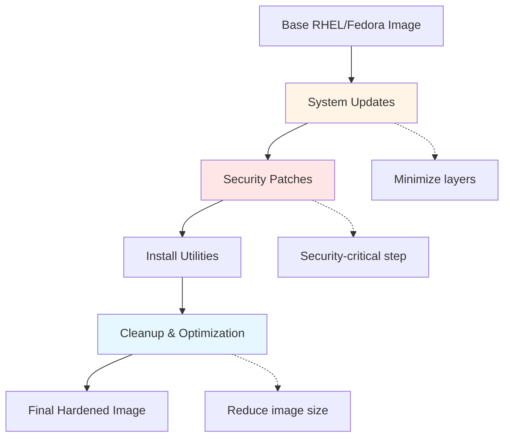
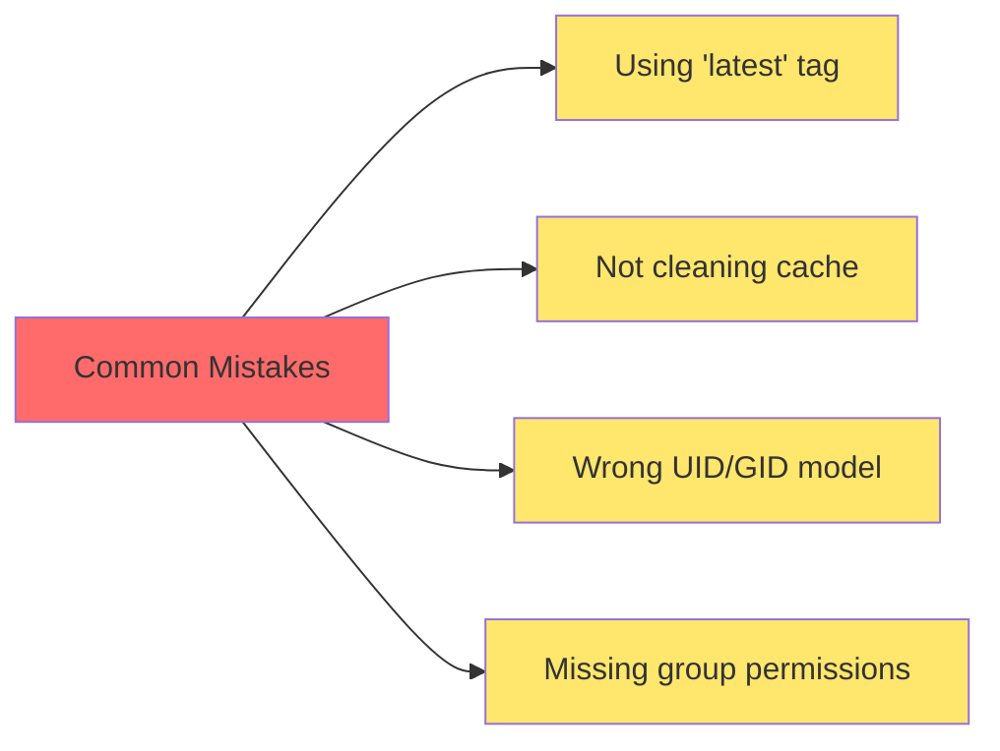
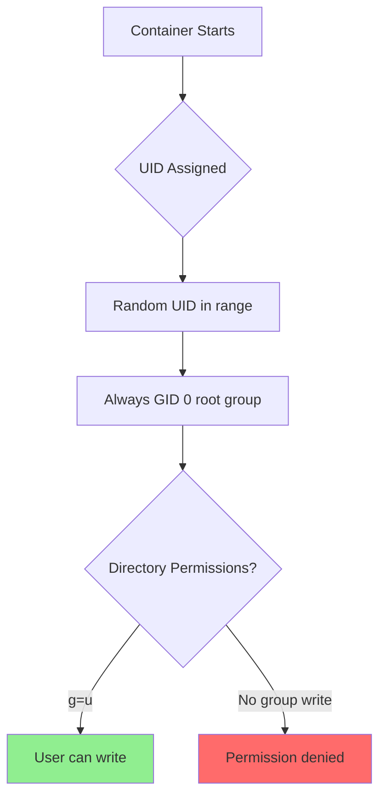
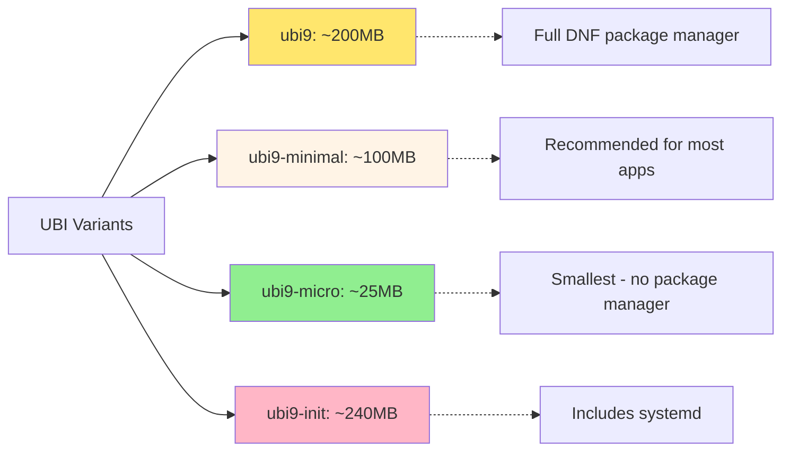

#linux #red-hat #rhel #fedora #centos #containerization #container-engine #cybersecurity #operating-system #rpm
# Image Build Strategy



# Red Hat Image Variants

## Red Hat Universal Base Image (UBI)

==Universal Base Images (UBI)== are freely redistributable OCI-compliant container base images based on Red Hat Enterprise Linux. UBI images can be used, built upon, and redistributed without a Red Hat subscription.

**Key Characteristics:**
- **License**: Free to use and redistribute, even for commercial purposes
- **Support**: Backed by Red Hat's security updates and quality assurance
- **Registry**: Available on Red Hat Container Catalog and Docker Hub
- **Compliance**: OpenShift-ready with security best practices built-in

**UBI Variants:**
- `ubi9`: Standard base image (~200MB)
- `ubi9-minimal`: Minimal image with microdnf (~100MB)
- `ubi9-micro`: Ultra-minimal without package manager (~25MB)
- `ubi9-init`: Includes systemd for multi-service containers

## Red Hat Enterprise Linux (RHEL)

Full RHEL images require a valid Red Hat subscription and are accessed through the Red Hat Container Registry.

- **Authentication**: Requires `podman login registry.redhat.io`
- **Updates**: Full access to RHEL repositories
- **Support**: Commercial support from Red Hat

## Fedora

Community-driven upstream for RHEL with cutting-edge packages and frequent updates.

- **Release Cycle**: ~6 months per version
- **Package Manager**: `dnf`
- **Use Case**: Development, testing, latest features

## CentOS Stream

Rolling-release distribution that sits between Fedora and RHEL.

- **Model**: Continuous delivery of next RHEL minor version
- **Stability**: More stable than Fedora, preview of RHEL
- **Use Case**: Development environments, CI/CD pipelines

## Rocky Linux / AlmaLinux

Community RHEL rebuilds maintaining 1:1 binary compatibility with RHEL.

- **License**: Free and open source
- **Compatibility**: Drop-in replacement for CentOS/RHEL
- **Support**: Community-driven

# Best Practices

## Security Hardening

1. **Always update packages**: Run `dnf upgrade -y` or `microdnf upgrade -y` to patch known vulnerabilities
2. **Use specific versions**: Pin image versions (e.g., `ubi9:9.3` not `ubi9:latest`) for reproducibility
3. **Remove package cache**: Clean `/var/cache/dnf` and `/var/cache/yum` to prevent stale packages
4. **Run as non-root**: UBI images use UID 1001 by default; follow OpenShift random UID pattern
5. **Minimal attack surface**: Install only necessary packages to reduce potential vulnerabilities
6. **Use minimal variants**: Prefer `ubi9-minimal` or `ubi9-micro` for production workloads

## Image Optimization

1. **Combine RUN commands**: Use heredoc syntax to reduce layer count
2. **Use `--nodocs`**: Skip documentation with `dnf install --nodocs` to save space
3. **Clean in same layer**: Remove package cache in the same `RUN` command that installs packages
4. **Multi-stage builds**: Separate build-time and runtime dependencies
5. **Choose appropriate base**: Use `ubi9-micro` for statically-linked binaries

## Package Management

### DNF (Dandified YUM) - Standard RHEL/Fedora

```Shell
# Update package metadata
dnf check-update

# Install packages without docs
dnf install -y --nodocs package-name

# Clean package cache
dnf clean all
```

### MicroDNF - UBI Minimal

```Shell
# Install packages (automatically excludes docs)
microdnf install -y package-name

# Clean cache
microdnf clean all
```

### No Package Manager - UBI Micro

UBI Micro has no package manager. Packages must be installed during build using multi-stage patterns or by copying binaries.

## Warning: Common Pitfalls



- Using `latest` tag makes builds non-reproducible
- Not removing dnf/yum cache can increase image size by 100-150MB
- UBI images expect OpenShift random UID pattern (UID in range, GID 0)
- Directories need group write permissions (`chmod -R g+w`) for OpenShift compatibility
- Full RHEL images require registry authentication

# Practical Dockerfiles

## Minimal Security-Hardened UBI Base

Suitable for applications with minimal dependencies using the smallest UBI variant with package manager.

```Dockerfile
FROM registry.access.redhat.com/ubi9/ubi-minimal:9.3

# Metadata
LABEL maintainer="your-email@example.com" \
      description="Minimal hardened UBI 9 base image with security updates" \
      version="1.0"

# Update system and install minimal utilities
RUN <<EOT bash
  set -ex

  # Update all packages
  microdnf upgrade -y

  # Install essential utilities
  microdnf install -y \
    ca-certificates \
    curl \
    tar \
    gzip \
    shadow-utils

  # Cleanup
  microdnf clean all
  rm -rf /var/cache/yum /var/cache/dnf
EOT

# Create non-root user following OpenShift pattern
# UID 1001, GID 0 (root group) with group permissions
RUN useradd -r -u 1001 -g 0 -m -s /bin/bash appuser && \
    chmod -R g=u /etc/passwd /etc/group

WORKDIR /app

# Set group write permissions for OpenShift random UID support
RUN chgrp -R 0 /app && \
    chmod -R g=u /app

USER 1001

# Set environment
ENV HOME=/home/appuser \
    PATH=/app/bin:$PATH
```

## Standard UBI Base with Development Tools

Includes common development and debugging utilities.

```Dockerfile
FROM registry.access.redhat.com/ubi9/ubi:9.3

LABEL maintainer="your-email@example.com" \
      description="Standard UBI 9 base with development utilities"

RUN <<EOT bash
  set -ex

  # System updates
  dnf upgrade -y

  # Install development and network utilities
  dnf install -y --nodocs \
    # Core utilities
    ca-certificates \
    curl \
    wget \
    tar \
    gzip \
    unzip \
    # Development tools
    git \
    vim \
    # Network utilities
    bind-utils \
    iputils \
    traceroute \
    net-tools \
    nmap-ncat \
    # Process monitoring
    procps-ng \
    htop \
    lsof

  # Cleanup
  dnf clean all
  rm -rf /var/cache/yum /var/cache/dnf /tmp/* /var/tmp/*
EOT

# Create non-root user with OpenShift compatibility
RUN useradd -r -u 1001 -g 0 -m -s /bin/bash appuser && \
    chmod -R g=u /etc/passwd /etc/group

WORKDIR /app

RUN chgrp -R 0 /app && \
    chmod -R g=u /app

USER 1001
```

## Fedora Latest with Modern Tools

For development environments requiring cutting-edge packages.

```Dockerfile
FROM fedora:39

LABEL maintainer="your-email@example.com" \
      description="Fedora 39 development base image"

RUN <<EOT bash
  set -ex

  # Update system
  dnf upgrade -y

  # Install modern development tools
  dnf install -y --nodocs \
    # Build tools
    gcc \
    gcc-c++ \
    make \
    cmake \
    automake \
    autoconf \
    # Version control
    git \
    # Network tools
    curl \
    wget \
    bind-utils \
    iputils \
    # Container tools
    podman \
    buildah \
    skopeo \
    # Editors
    vim \
    nano \
    # Compression
    tar \
    gzip \
    bzip2 \
    xz

  # Cleanup
  dnf clean all
  rm -rf /var/cache/dnf /tmp/* /var/tmp/*
EOT

# Create development user
RUN useradd -r -u 1000 -g 100 -m -s /bin/bash developer

WORKDIR /workspace

RUN chown -R developer:users /workspace

USER developer

ENV EDITOR=vim
```

## CentOS Stream Base

For CI/CD pipelines and testing environments.

```Dockerfile
FROM quay.io/centos/centos:stream9

LABEL maintainer="your-email@example.com" \
      description="CentOS Stream 9 base for CI/CD pipelines"

RUN <<EOT bash
  set -ex

  # Update system
  dnf upgrade -y

  # Install CI/CD utilities
  dnf install -y --nodocs \
    ca-certificates \
    curl \
    git \
    tar \
    gzip \
    jq \
    findutils \
    diffutils \
    which

  # Enable EPEL for additional packages
  dnf install -y epel-release

  # Cleanup
  dnf clean all
  rm -rf /var/cache/dnf /tmp/*
EOT

RUN useradd -r -u 1001 -g 0 appuser

WORKDIR /app

RUN chgrp -R 0 /app && chmod -R g=u /app

USER 1001
```

## Ultra-Minimal UBI Micro for Static Binaries

For containers running single statically-linked binaries.

```Dockerfile
# Build stage with full toolchain
FROM registry.access.redhat.com/ubi9/ubi:9.3 AS builder

RUN dnf install -y --nodocs golang && \
    dnf clean all

WORKDIR /build
# Build your application here
# COPY . .
# RUN CGO_ENABLED=0 go build -o app

# Runtime stage - ultra minimal
FROM registry.access.redhat.com/ubi9/ubi-micro:9.3

LABEL maintainer="your-email@example.com" \
      description="Ultra-minimal UBI Micro for static binaries"

WORKDIR /app

# Copy binary from builder (no package installation possible)
# COPY --from=builder --chown=1001:0 /build/app /app/

# UBI Micro already uses UID 1001 by default
USER 1001

# No shell available - use exec form
CMD ["/app/app"]
```

## Multi-Stage Build with UBI

Demonstrates separation of build and runtime environments.

```Dockerfile
# Builder stage with full UBI
FROM registry.access.redhat.com/ubi9/ubi:9.3 AS builder

RUN <<EOT bash
  set -ex
  dnf install -y --nodocs \
    gcc \
    gcc-c++ \
    make \
    git \
    ca-certificates
  dnf clean all
EOT

WORKDIR /build
# COPY source code and build
# RUN make

# Runtime stage with minimal UBI
FROM registry.access.redhat.com/ubi9/ubi-minimal:9.3

RUN microdnf upgrade -y && \
    microdnf install -y ca-certificates shadow-utils && \
    microdnf clean all

RUN useradd -r -u 1001 -g 0 appuser

WORKDIR /app

# Copy only runtime artifacts
# COPY --from=builder --chown=1001:0 /build/output /app/

RUN chgrp -R 0 /app && chmod -R g=u /app

USER 1001
```

## Rocky Linux / AlmaLinux Base

RHEL-compatible alternative with full package availability.

```Dockerfile
FROM rockylinux:9

# Or use: FROM almalinux:9

LABEL maintainer="your-email@example.com" \
      description="Rocky Linux 9 base image"

RUN <<EOT bash
  set -ex

  # Update system
  dnf upgrade -y

  # Install common utilities
  dnf install -y --nodocs \
    ca-certificates \
    curl \
    wget \
    tar \
    gzip \
    git \
    vim

  # Enable EPEL for extended packages
  dnf install -y epel-release

  # Cleanup
  dnf clean all
  rm -rf /var/cache/dnf
EOT

RUN useradd -r -u 1000 -g 100 appuser

WORKDIR /app

USER appuser
```

# Security

## OpenShift Random UID Pattern

UBI images are designed for ==OpenShift== which assigns random UIDs to containers for security. This requires specific permission patterns:



**Implementation Pattern:**

```Dockerfile
# Create user with UID 1001, GID 0 (root group)
RUN useradd -r -u 1001 -g 0 appuser

# Set group permissions equal to user permissions
RUN chgrp -R 0 /app && \
    chmod -R g=u /app

# This allows any UID in GID 0 to have same permissions as user
```

**UID/GID Ranges:**
- **UID 0**: root (never use in containers)
- **UID 1-999**: System users
- **UID 1000+**: Regular users (traditional)
- **UID 1001**: Default UBI non-root user
- **GID 0**: Root group (OpenShift pattern for all containers)

## RHEL Security Features

### SELinux Integration

UBI images are built with SELinux in mind:

```Dockerfile
# For files that need specific SELinux contexts
# Use COPY with --chown and verify with:
# podman run --security-opt label=disable myimage ls -Z /app
```

### Subscription Management

For full RHEL images requiring subscriptions:

```Shell
# Login to Red Hat registry
podman login registry.redhat.io

# Use in Dockerfile
FROM registry.redhat.io/rhel9/rhel:9.3
```

### Package Signature Verification

```Dockerfile
# DNF automatically verifies RPM signatures using GPG
# Ensure gpgcheck is enabled (default)
RUN echo "gpgcheck=1" >> /etc/dnf/dnf.conf
```

## UBI Security Best Practices

1. **Use minimal variants**: Smaller attack surface with `ubi-minimal` or `ubi-micro`
2. **Read-only root filesystem**: Design apps to run with `--read-only` flag
3. **Drop capabilities**: Remove unnecessary Linux capabilities
4. **No privilege escalation**: Ensure `allowPrivilegeEscalation: false` in Kubernetes

```Shell
# Run with security constraints
podman run --rm \
  --read-only \
  --cap-drop=ALL \
  --security-opt=no-new-privileges \
  --user 1001 \
  myapp:latest
```

# Advanced Techniques

## Conditional Package Installation by Architecture

```Dockerfile
FROM registry.access.redhat.com/ubi9/ubi-minimal:9.3

RUN <<EOT bash
  set -ex
  microdnf upgrade -y

  # Base packages
  microdnf install -y ca-certificates curl

  # Architecture-specific packages
  ARCH=$(uname -m)
  if [ "$ARCH" = "x86_64" ]; then
    microdnf install -y some-x86-package
  elif [ "$ARCH" = "aarch64" ]; then
    microdnf install -y some-arm-package
  fi

  microdnf clean all
EOT
```

## Build Arguments for Flexibility

```Dockerfile
ARG UBI_VERSION=9.3
ARG USER_UID=1001
ARG APP_DIR=/app

FROM registry.access.redhat.com/ubi9/ubi-minimal:${UBI_VERSION}

RUN microdnf upgrade -y && \
    microdnf install -y ca-certificates shadow-utils && \
    microdnf clean all

RUN useradd -r -u ${USER_UID} -g 0 appuser

WORKDIR ${APP_DIR}

RUN chgrp -R 0 ${APP_DIR} && chmod -R g=u ${APP_DIR}

USER ${USER_UID}
```

```Shell
podman build \
  --build-arg UBI_VERSION=9.2 \
  --build-arg USER_UID=5000 \
  -t myapp:latest .
```

## Installing Non-RPM Software

For software not available in RPM repositories:

```Dockerfile
FROM registry.access.redhat.com/ubi9/ubi-minimal:9.3

RUN <<EOT bash
  set -ex
  microdnf upgrade -y
  microdnf install -y curl tar gzip ca-certificates

  # Download and install binary
  curl -fsSL https://example.com/software.tar.gz -o /tmp/software.tar.gz
  tar -xzf /tmp/software.tar.gz -C /usr/local/bin

  # Cleanup
  rm -rf /tmp/*
  microdnf clean all
EOT
```

## Using UBI Init for Multi-Process Containers

```Dockerfile
FROM registry.access.redhat.com/ubi9/ubi-init:9.3

# Install services
RUN dnf install -y --nodocs httpd postgresql && \
    dnf clean all

# Enable services
RUN systemctl enable httpd postgresql

# Expose ports
EXPOSE 80 5432

# UBI Init uses systemd as PID 1
CMD ["/sbin/init"]
```

## Registry Selection Matrix

| Registry | Image Type | Authentication | Use Case |
|----------|-----------|----------------|----------|
| `registry.access.redhat.com` | UBI | None | Free UBI images |
| `registry.redhat.io` | RHEL Full | Required | Enterprise RHEL |
| `docker.io` | UBI Mirror | None | Docker Hub convenience |
| `quay.io/centos` | CentOS Stream | None | Community images |
| `docker.io/rockylinux` | Rocky Linux | None | RHEL alternative |
| `docker.io/almalinux` | AlmaLinux | None | RHEL alternative |

# Image Size Comparison



# Package Manager Command Reference

| Operation | DNF (UBI/RHEL/Fedora) | MicroDNF (UBI Minimal) | Notes |
|-----------|----------------------|----------------------|-------|
| Update metadata | `dnf check-update` | `microdnf repoquery` | Check for updates |
| Install package | `dnf install -y pkg` | `microdnf install -y pkg` | Add `--nodocs` for DNF |
| Upgrade system | `dnf upgrade -y` | `microdnf upgrade -y` | Security patches |
| Remove package | `dnf remove pkg` | `microdnf remove pkg` | Clean up |
| Clean cache | `dnf clean all` | `microdnf clean all` | Required after install |
| Search package | `dnf search term` | Not available | DNF only |
| List installed | `dnf list installed` | `microdnf repoquery --installed` | Inventory |

***
# References

1. https://catalog.redhat.com/software/containers/explore for Red Hat Container Catalog
2. https://developers.redhat.com/products/rhel/ubi for Universal Base Images documentation
3. https://access.redhat.com/documentation/en-us/red_hat_enterprise_linux/9 for RHEL 9 official documentation
4. https://docs.fedoraproject.org/en-US/containers/ for Fedora container documentation
5. https://www.centos.org/centos-stream/ for CentOS Stream information
6. https://rockylinux.org/ for Rocky Linux
7. https://almalinux.org/ for AlmaLinux
8. https://docs.openshift.com/container-platform/latest/openshift_images/create-images.html for OpenShift image guidelines
9. https://developers.redhat.com/articles/ubi-faq for UBI Frequently Asked Questions
10. [Containerfile](../../../Containerfile.md) for general Dockerfile syntax and commands
11. [[operating-system/unix/linux/system-administration/access-control/User|User]] for User management in Linux
12. [[operating-system/unix/linux/system-administration/access-control/Group|Group]] for Group management in Linux
13. [[operating-system/unix/linux/system-administration/access-control/File permissions|File permissions]] for Linux file permissions
14. [[operating-system/unix/linux/system-administration/SELinux|SELinux]] for Security-Enhanced Linux
